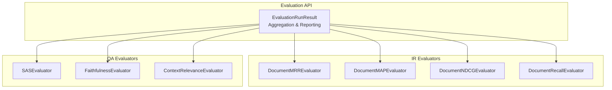
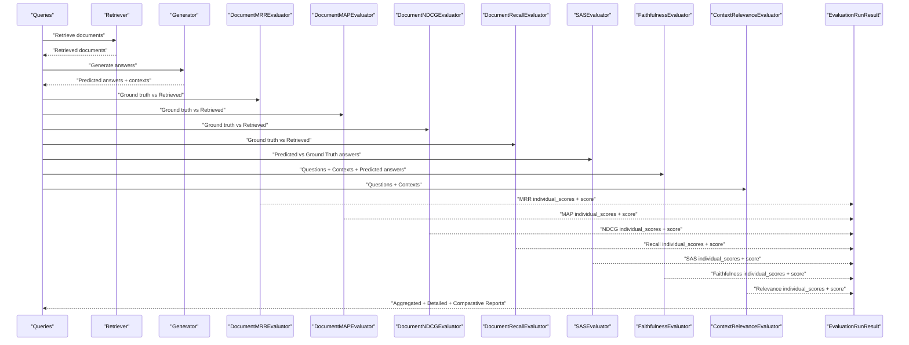
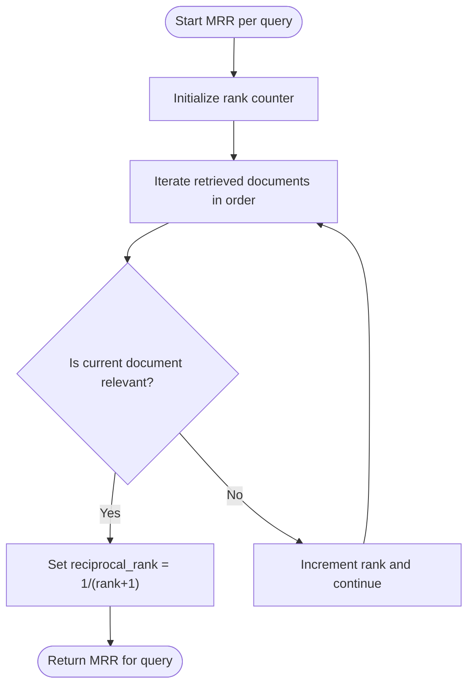
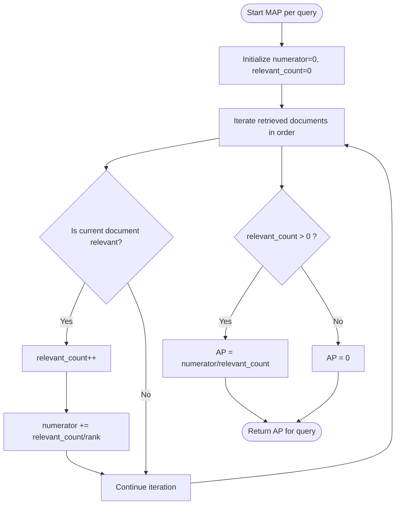
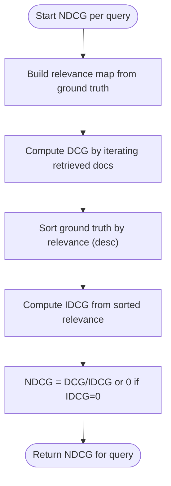
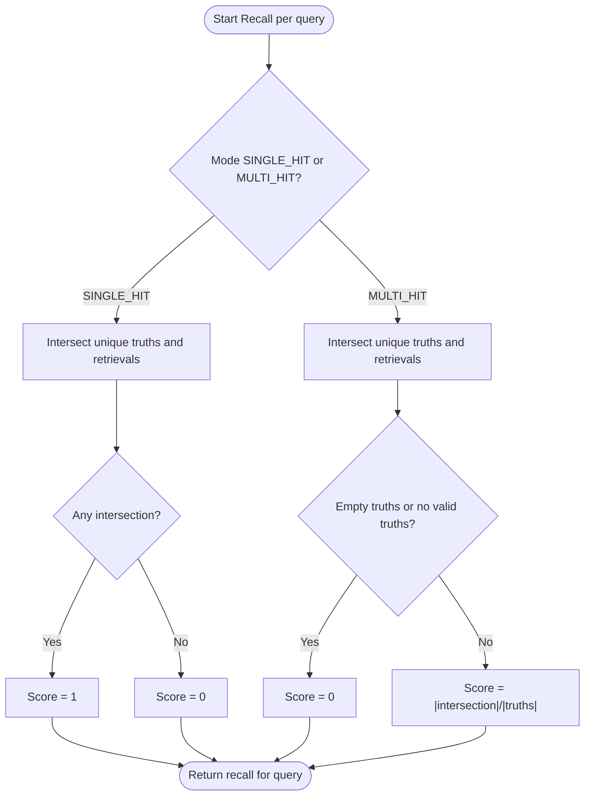
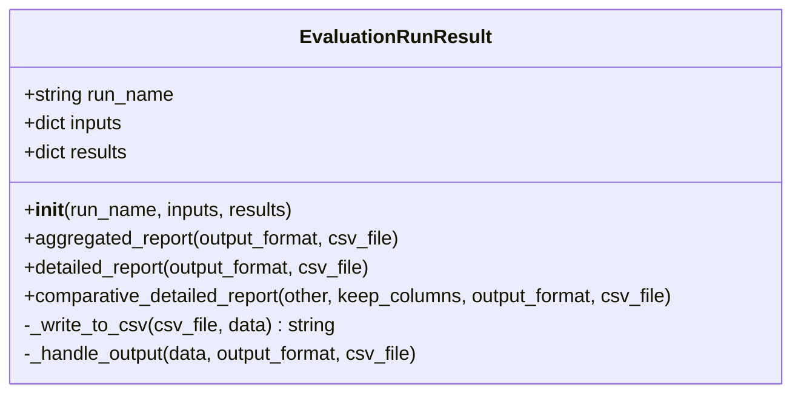
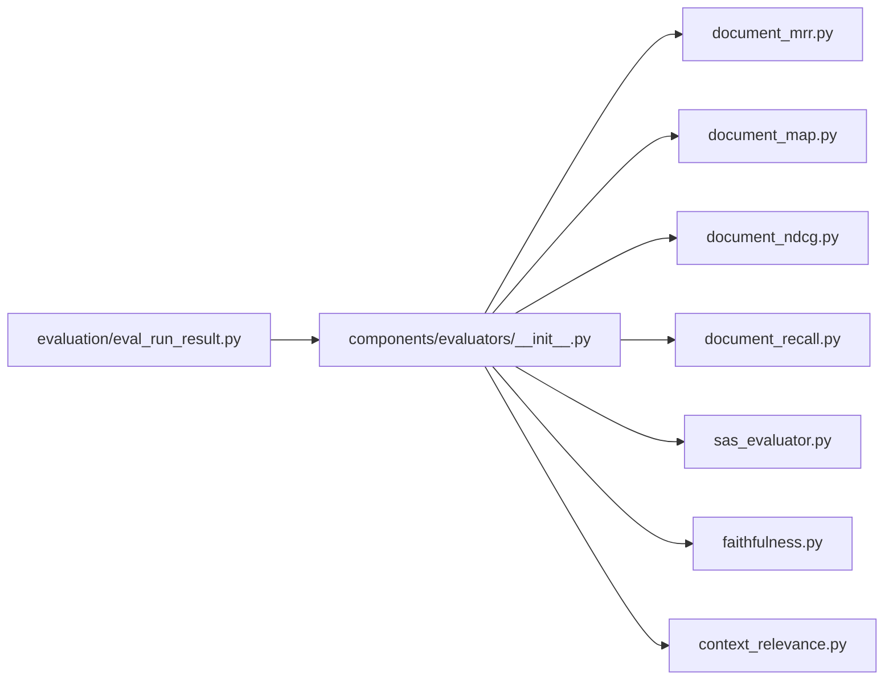

# Statistical Evaluation

<cite>
**Referenced Files in This Document**
- [eval_run_result.py](file://haystack/evaluation/eval_run_result.py)
- [__init__.py](file://haystack/evaluation/__init__.py)
- [document_map.py](file://haystack/components/evaluators/document_map.py)
- [document_mrr.py](file://haystack/components/evaluators/document_mrr.py)
- [document_ndcg.py](file://haystack/components/evaluators/document_ndcg.py)
- [document_recall.py](file://haystack/components/evaluators/document_recall.py)
- [__init__.py](file://haystack/components/evaluators/__init__.py)
- [test_eval_run_result.py](file://test/evaluation/test_eval_run_result.py)
- [test_evaluation_pipeline.py](file://e2e/pipelines/test_evaluation_pipeline.py)
- [documentmapevaluator.mdx](file://docs-website/versioned_docs/version-2.18/pipeline-components/evaluators/documentmapevaluator.mdx)
- [documentndcgevaluator.mdx](file://docs-website/versioned_docs/version-2.18/pipeline-components/evaluators/documentndcgevaluator.mdx)
- [fix-issue-7758-d35b687ca226a707.yaml](file://releasenotes/notes/fix-issue-7758-d35b687ca226a707.yaml)
- [document-ndcg-evaluator-d579f51dd76ae76a.yaml](file://releasenotes/notes/document-ndcg-evaluator-d579f51dd76ae76a.yaml)
- [implementing-eval-results-API-25b2f8707495bea0.yaml](file://releasenotes/notes/implemeting-eval-results-API-25b2f8707495bea0.yaml)
- [removing-deprecated-EvalRunResult-d28c2eb407da0051.yaml](file://releasenotes/notes/removing-deprecated-EvalRunResult-d28c2eb407da0051.yaml)
</cite>

## Table of Contents
1. [Introduction](#introduction)
2. [Project Structure](#project-structure)
3. [Core Components](#core-components)
4. [Architecture Overview](#architecture-overview)
5. [Detailed Component Analysis](#detailed-component-analysis)
6. [Dependency Analysis](#dependency-analysis)
7. [Performance Considerations](#performance-considerations)
8. [Troubleshooting Guide](#troubleshooting-guide)
9. [Conclusion](#conclusion)
10. [Appendices](#appendices)

## Introduction
This document explains statistical evaluation methods in Haystack with a focus on traditional Information Retrieval metrics and recall-based measures. It covers:
- Mathematical foundations and formulas for Mean Average Precision (MAP), Mean Reciprocal Rank (MRR), Normalized Discounted Cumulative Gain (NDCG), and recall metrics
- How to compute per-query scores and aggregate them across evaluation runs
- The EvaluationRunResult class API for validation, aggregation, and reporting
- Practical examples for evaluating retrieval systems, RAG pipelines, and ranking effectiveness
- Guidance on interpreting results, setting benchmarks, and comparing strategies
- Common pitfalls and best practices for reliable metric computation

## Project Structure
Haystack organizes evaluation around dedicated evaluator components and a unified result container:
- Evaluator components implement IR and QA metrics for retrieval and generation quality
- EvaluationRunResult aggregates per-query results and supports reporting and comparison

**Diagram sources**
- [eval_run_result.py](file://haystack/evaluation/eval_run_result.py#L18-L232)
- [document_mrr.py](file://haystack/components/evaluators/document_mrr.py#L10-L131)
- [document_map.py](file://haystack/components/evaluators/document_map.py#L10-L137)
- [document_ndcg.py](file://haystack/components/evaluators/document_ndcg.py#L11-L134)
- [document_recall.py](file://haystack/components/evaluators/document_recall.py#L40-L180)

**Section sources**
- [__init__.py](file://haystack/evaluation/__init__.py#L10-L16)
- [__init__.py](file://haystack/components/evaluators/__init__.py#L10-L20)

## Core Components
- EvaluationRunResult: Validates inputs, ensures consistent lengths, and exposes methods to produce aggregated and detailed reports. It also supports comparative reporting across runs.
- IR Evaluators: DocumentMRREvaluator, DocumentMAPEvaluator, DocumentNDCGEvaluator, and DocumentRecallEvaluator compute per-query scores and averages.

Key capabilities:
- Per-query scoring: Each evaluator returns a list of individual scores aligned with the number of queries
- Aggregation: Averages across queries yield a single aggregate score
- Reporting: JSON, DataFrame, or CSV outputs via EvaluationRunResult
- Comparison: Comparative reporting across two EvaluationRunResult instances

**Section sources**
- [eval_run_result.py](file://haystack/evaluation/eval_run_result.py#L23-L62)
- [eval_run_result.py](file://haystack/evaluation/eval_run_result.py#L122-L163)
- [eval_run_result.py](file://haystack/evaluation/eval_run_result.py#L165-L231)

## Architecture Overview
The evaluation workflow connects retrievers and generators to evaluators, then aggregates results with EvaluationRunResult.

**Diagram sources**
- [test_evaluation_pipeline.py](file://e2e/pipelines/test_evaluation_pipeline.py#L75-L95)
- [test_evaluation_pipeline.py](file://e2e/pipelines/test_evaluation_pipeline.py#L137-L168)
- [eval_run_result.py](file://haystack/evaluation/eval_run_result.py#L122-L163)

## Detailed Component Analysis

### Mean Reciprocal Rank (MRR)
MRR measures the rank of the first relevant item. For each query, it is the reciprocal of the rank of the first relevant document. The aggregate score is the mean across queries.

Mathematical definition:
- For a query with first relevant document at position k, the score is 1/k
- Aggregate score = mean of per-query scores

Implementation highlights:
- Iterates through retrieved documents in order until a relevant document is found
- Uses configurable document comparison field for relevance checks
- Returns per-query MRR and the mean across queries

**Diagram sources**
- [document_mrr.py](file://haystack/components/evaluators/document_mrr.py#L115-L126)

**Section sources**
- [document_mrr.py](file://haystack/components/evaluators/document_mrr.py#L11-L42)
- [document_mrr.py](file://haystack/components/evaluators/document_mrr.py#L89-L131)

### Mean Average Precision (MAP)
MAP computes the mean of Average Precision (AP) across queries. AP is the mean of precision-at-k for all k where the document is relevant.

Mathematical definition:
- AP = (1/R) * Σ precision@k for relevant documents
- R = total number of relevant documents for the query
- Aggregate MAP = mean of AP across queries

Implementation highlights:
- Tracks cumulative sum of precision@relevant_k
- Divides by the number of relevant documents if > 0
- Returns per-query AP and the mean across queries

**Diagram sources**
- [document_map.py](file://haystack/components/evaluators/document_map.py#L117-L133)

**Section sources**
- [document_map.py](file://haystack/components/evaluators/document_map.py#L10-L44)
- [document_map.py](file://haystack/components/evaluators/document_map.py#L91-L137)

### Normalized Discounted Cumulative Gain (NDCG)
NDCG evaluates ranking quality by considering both relevance and position, normalizing by the ideal score.

Mathematical definition:
- DCG = Σ (relevant_score / log2(rank + 2)) for relevant documents
- IDCG = DCG achieved by an ideal ranking (sorted by relevance)
- NDCG = DCG / IDCG (0 if IDCG = 0)

Implementation highlights:
- Supports graded relevance via document scores or binary relevance
- Validates that relevance scores are either absent or uniformly present per query
- Returns per-query NDCG and the mean across queries

**Diagram sources**
- [document_ndcg.py](file://haystack/components/evaluators/document_ndcg.py#L99-L133)

**Section sources**
- [document_ndcg.py](file://haystack/components/evaluators/document_ndcg.py#L11-L35)
- [document_ndcg.py](file://haystack/components/evaluators/document_ndcg.py#L70-L134)

### Recall Metrics
Two recall modes are supported:
- SINGLE_HIT: 1 if any relevant document is retrieved, else 0
- MULTI_HIT: |relevant ∩ retrieved| / |relevant| (or 0 if no valid ground truth)

Implementation highlights:
- Configurable document comparison field
- Warning logs when ground truth or retrieved sets are empty or lack valid comparison values
- Returns per-query recall and the mean across queries

**Diagram sources**
- [document_recall.py](file://haystack/components/evaluators/document_recall.py#L113-L139)

**Section sources**
- [document_recall.py](file://haystack/components/evaluators/document_recall.py#L14-L68)
- [document_recall.py](file://haystack/components/evaluators/document_recall.py#L113-L170)

### EvaluationRunResult API
EvaluationRunResult encapsulates evaluation runs and provides:
- Validation: Ensures inputs and results are consistent and complete
- Aggregated report: Metric names and their aggregate scores
- Detailed report: Inputs plus per-query scores
- Comparative report: Aligns two runs for side-by-side analysis

**Diagram sources**
- [eval_run_result.py](file://haystack/evaluation/eval_run_result.py#L18-L232)

Validation rules:
- Inputs must be non-empty and all lists must have equal length
- Each metric result must include both an aggregate score and individual scores with the expected length

Reporting formats:
- JSON: native Python dicts
- DataFrame: pandas DataFrame (requires pandas)
- CSV: writes to file path (requires csv_file argument)

Comparison behavior:
- Renames columns to disambiguate runs
- Optionally keeps selected input columns unchanged

**Section sources**
- [eval_run_result.py](file://haystack/evaluation/eval_run_result.py#L23-L62)
- [eval_run_result.py](file://haystack/evaluation/eval_run_result.py#L122-L163)
- [eval_run_result.py](file://haystack/evaluation/eval_run_result.py#L165-L231)

## Dependency Analysis
- Evaluator components are lazily imported via the evaluators package init
- EvaluationRunResult depends on pandas only when returning DataFrame outputs
- End-to-end pipelines demonstrate combining retrievers, generators, and evaluators

**Diagram sources**
- [__init__.py](file://haystack/components/evaluators/__init__.py#L10-L20)
- [eval_run_result.py](file://haystack/evaluation/eval_run_result.py#L12-L13)

**Section sources**
- [__init__.py](file://haystack/components/evaluators/__init__.py#L10-L20)
- [__init__.py](file://haystack/evaluation/__init__.py#L10-L16)

## Performance Considerations
- Prefer binary relevance for NDCG when graded relevance is unavailable to avoid extra computations
- Use SINGLE_HIT recall for fast coarse-grained checks; MULTI_HIT for precise coverage measurement
- Minimize repeated conversions by ensuring consistent document comparison fields across runs
- When generating comparative reports, limit keep_columns to reduce output size and improve readability

## Troubleshooting Guide
Common validation errors and resolutions:
- No inputs provided: Ensure inputs dict is non-empty
- Inconsistent input lengths: Align all input lists to the same length
- Missing aggregate or individual scores: Ensure each metric result includes both score and individual_scores
- Mismatched lengths between individual scores and inputs: Verify per-query alignment

Output format errors:
- CSV requires a file path; otherwise raises ValueError
- DataFrame requires pandas; import is lazy and will raise an informative error if not installed

Comparative report warnings:
- Same run names: Warnings are logged; rename runs for clarity
- Different input columns: Uses the left-hand run’s input columns; align inputs for meaningful comparisons

**Section sources**
- [eval_run_result.py](file://haystack/evaluation/eval_run_result.py#L44-L61)
- [eval_run_result.py](file://haystack/evaluation/eval_run_result.py#L115-L120)
- [eval_run_result.py](file://haystack/evaluation/eval_run_result.py#L194-L203)

## Conclusion
Haystack provides robust, modular evaluators for retrieval effectiveness and QA quality, along with a unified container for aggregating, reporting, and comparing results. By understanding the mathematical foundations of MAP, MRR, NDCG, and recall, and by leveraging EvaluationRunResult’s validation and reporting features, practitioners can reliably benchmark retrieval strategies, assess RAG performance, and compare ranking effectiveness across configurations.

## Appendices

### Practical Examples and Benchmarks
- Retrieval evaluation: Combine DocumentMRREvaluator, DocumentMAPEvaluator, DocumentNDCGEvaluator, and DocumentRecallEvaluator in a pipeline to evaluate retrieval quality offline
- RAG pipeline evaluation: Evaluate answer faithfulness, contextual relevance, semantic similarity, and retrieval metrics using a single EvaluationRunResult
- Ranking effectiveness: Use NDCG to capture ordering quality when multiple relevant documents exist; use MRR to emphasize the position of the first relevant hit

Benchmarking guidance:
- Establish baseline scores with a simple retrieval strategy and iterate toward higher MAP/NDCG while monitoring MRR and recall
- Compare strategies using comparative reports to isolate differences in retrieval ordering versus coverage

Interpretation tips:
- MRR focuses on the first hit; improvements here can be dramatic but may miss later relevant documents
- MAP balances precision across ranks; increases often reflect better overall ranking
- NDCG captures both relevance and rank; ideal for scenarios with graded relevance
- Recall SINGLE_HIT is sensitive to coverage; MULTI_HIT reflects completeness relative to ground-truth count

**Section sources**
- [test_evaluation_pipeline.py](file://e2e/pipelines/test_evaluation_pipeline.py#L75-L95)
- [test_evaluation_pipeline.py](file://e2e/pipelines/test_evaluation_pipeline.py#L137-L168)
- [documentmapevaluator.mdx](file://docs-website/versioned_docs/version-2.18/pipeline-components/evaluators/documentmapevaluator.mdx#L33-L54)
- [documentndcgevaluator.mdx](file://docs-website/versioned_docs/version-2.18/pipeline-components/evaluators/documentndcgevaluator.mdx#L71-L97)

### Release Notes Context
- MRR/MAP fixes: Recent releases addressed calculation correctness for MRR and MAP scores
- NDCG evaluator addition: DocumentNDCGEvaluator was introduced alongside documentation examples
- EvaluationRunResult API: Introduced EvaluationRunResult to wrap and visualize evaluation pipeline results
- Deprecated methods: Removed legacy methods in favor of detailed_report, comparative_detailed_report, and aggregated_report

**Section sources**
- [fix-issue-7758-d35b687ca226a707.yaml](file://releasenotes/notes/fix-issue-7758-d35b687ca226a707.yaml#L1-L4)
- [document-ndcg-evaluator-d579f51dd76ae76a.yaml](file://releasenotes/notes/document-ndcg-evaluator-d579f51dd76ae76a.yaml#L1-L4)
- [implementing-eval-results-API-25b2f8707495bea0.yaml](file://releasenotes/notes/implemeting-eval-results-API-25b2f8707495bea0.yaml#L1-L5)
- [removing-deprecated-EvalRunResult-d28c2eb407da0051.yaml](file://releasenotes/notes/removing-deprecated-EvalRunResult-d28c2eb407da0051.yaml#L1-L4)