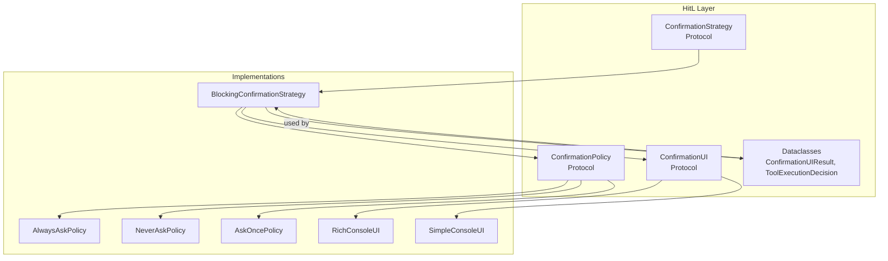
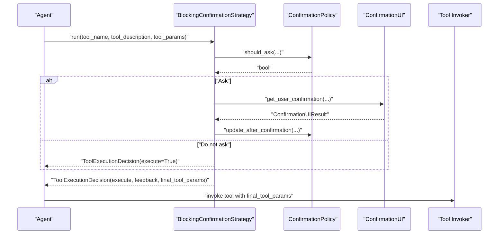
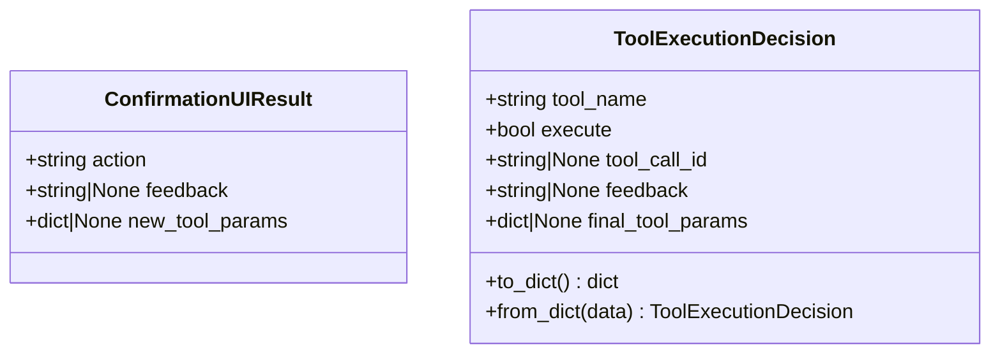
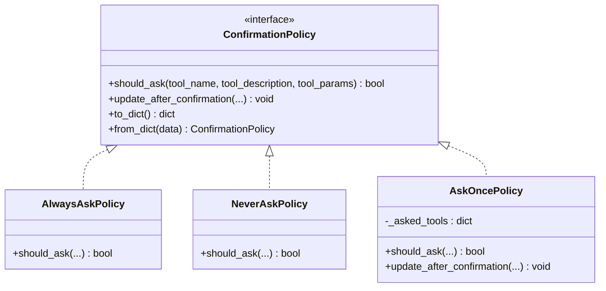
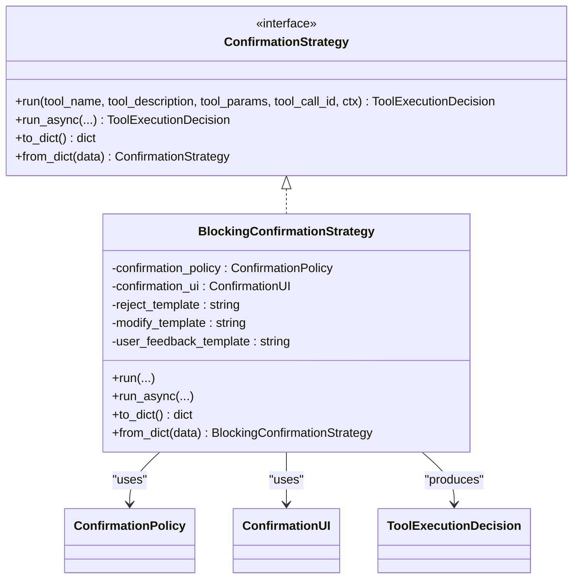
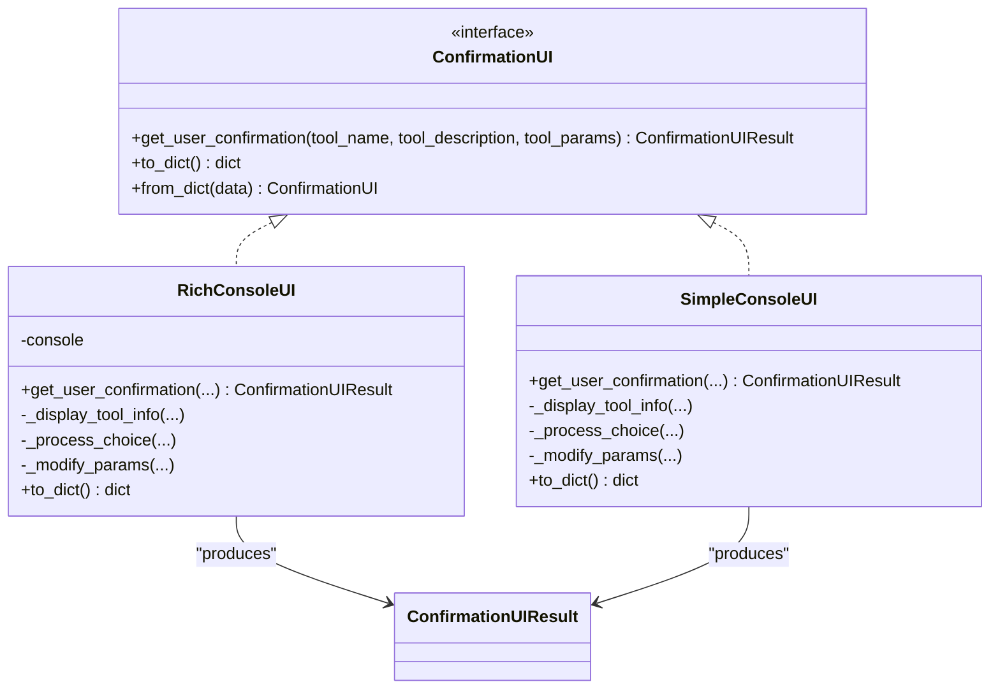
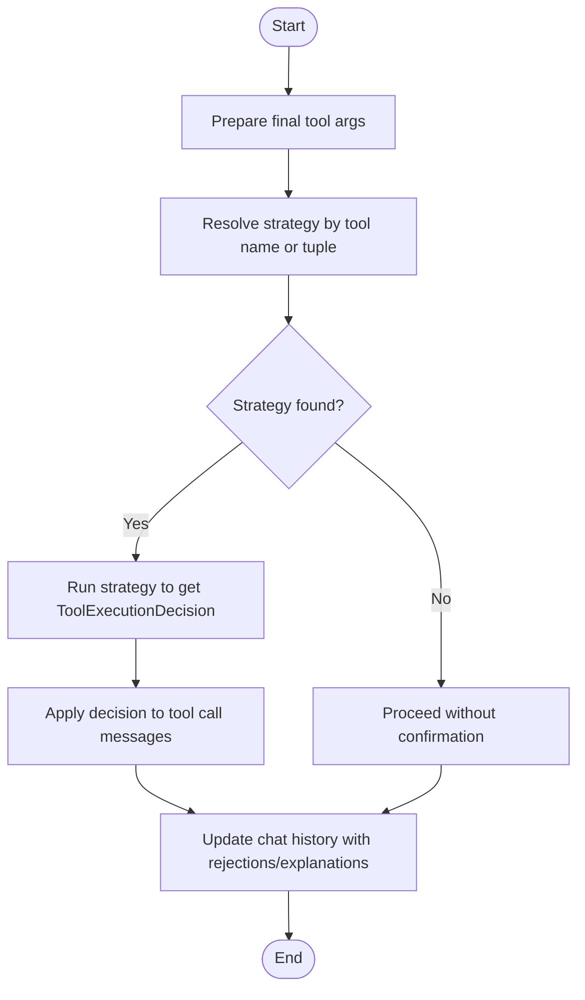
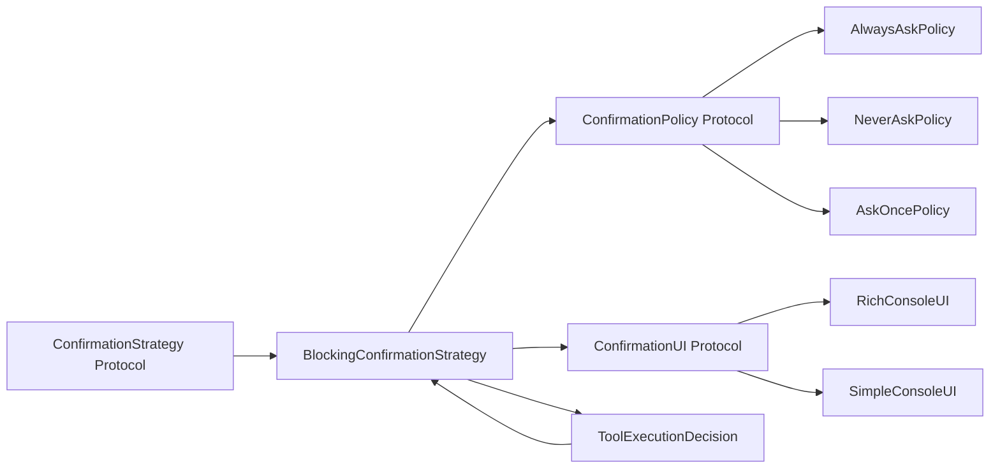

# Human-in-the-Loop

<cite>
**Referenced Files in This Document**
- [__init__.py](file://haystack/human_in_the_loop/__init__.py)
- [types/protocol.py](file://haystack/human_in_the_loop/types/protocol.py)
- [dataclasses.py](file://haystack/human_in_the_loop/dataclasses.py)
- [policies.py](file://haystack/human_in_the_loop/policies.py)
- [strategies.py](file://haystack/human_in_the_loop/strategies.py)
- [user_interfaces.py](file://haystack/human_in_the_loop/user_interfaces.py)
- [test_dataclasses.py](file://test/human_in_the_loop/test_dataclasses.py)
- [test_policies.py](file://test/human_in_the_loop/test_policies.py)
- [test_strategies.py](file://test/human_in_the_loop/test_strategies.py)
- [test_user_interfaces.py](file://test/human_in_the_loop/test_user_interfaces.py)
</cite>

## Table of Contents
1. [Introduction](#introduction)
2. [Project Structure](#project-structure)
3. [Core Components](#core-components)
4. [Architecture Overview](#architecture-overview)
5. [Detailed Component Analysis](#detailed-component-analysis)
6. [Dependency Analysis](#dependency-analysis)
7. [Performance Considerations](#performance-considerations)
8. [Troubleshooting Guide](#troubleshooting-guide)
9. [Conclusion](#conclusion)
10. [Appendices](#appendices)

## Introduction
This document explains Haystack’s Human-in-the-Loop (HitL) capabilities for interactive debugging and feedback integration. It covers how to control when human intervention is required, how to approve or modify tool executions, and how to integrate user interfaces for web-based HitL experiences. It also documents the data structures used for decisions, policy configuration across environments, and security and audit considerations.

## Project Structure
The HitL subsystem is organized around three layers:
- Protocols define the contracts for policies, strategies, and user interfaces.
- Policies decide whether to ask for confirmation.
- Strategies orchestrate confirmation, collect user feedback, and produce execution decisions.
- User Interfaces provide concrete ways for users to confirm, reject, or modify tool calls.
- Dataclasses represent the decisions and results exchanged across components.

**Diagram sources**
- [types/protocol.py](file://haystack/human_in_the_loop/types/protocol.py#L11-L118)
- [policies.py](file://haystack/human_in_the_loop/policies.py#L11-L79)
- [strategies.py](file://haystack/human_in_the_loop/strategies.py#L28-L202)
- [user_interfaces.py](file://haystack/human_in_the_loop/user_interfaces.py#L22-L213)
- [dataclasses.py](file://haystack/human_in_the_loop/dataclasses.py#L9-L73)

**Section sources**
- [__init__.py](file://haystack/human_in_the_loop/__init__.py#L10-L28)
- [types/protocol.py](file://haystack/human_in_the_loop/types/protocol.py#L11-L118)

## Core Components
- ConfirmationPolicy: Determines whether to ask for confirmation before tool execution. Implementations include AlwaysAskPolicy, NeverAskPolicy, and AskOncePolicy.
- ConfirmationStrategy: Orchestrates the confirmation flow, integrates UI and policy, and produces ToolExecutionDecision.
- ConfirmationUI: Defines how users confirm, reject, or modify tool calls. Implementations include RichConsoleUI and SimpleConsoleUI.
- Dataclasses: ConfirmationUIResult captures user action, feedback, and modified parameters; ToolExecutionDecision carries the decision outcome and metadata.

Key responsibilities:
- Policies evaluate tool metadata and parameters to decide if confirmation is needed.
- Strategies run the policy, query the UI, update the policy state, and return a decision.
- UIs render tool details and capture user intent.
- Decisions are serialized/deserialized for persistence and transport.

**Section sources**
- [types/protocol.py](file://haystack/human_in_the_loop/types/protocol.py#L30-L118)
- [policies.py](file://haystack/human_in_the_loop/policies.py#L11-L79)
- [strategies.py](file://haystack/human_in_the_loop/strategies.py#L28-L202)
- [user_interfaces.py](file://haystack/human_in_the_loop/user_interfaces.py#L22-L213)
- [dataclasses.py](file://haystack/human_in_the_loop/dataclasses.py#L9-L73)

## Architecture Overview
The HitL flow integrates with agent tool invocations. For each tool call, the system:
- Prepares final arguments (combining user inputs and state).
- Resolves a strategy by tool name (or tuple of tools).
- Runs the strategy to produce a ToolExecutionDecision.
- Applies the decision to tool call messages and updates chat history.

**Diagram sources**
- [strategies.py](file://haystack/human_in_the_loop/strategies.py#L63-L171)
- [policies.py](file://haystack/human_in_the_loop/policies.py#L11-L79)
- [user_interfaces.py](file://haystack/human_in_the_loop/user_interfaces.py#L29-L84)
- [dataclasses.py](file://haystack/human_in_the_loop/dataclasses.py#L31-L73)

## Detailed Component Analysis

### Data Structures
- ConfirmationUIResult: Captures action, optional feedback, and optional new parameters.
- ToolExecutionDecision: Carries tool identity, execution decision, optional tool_call_id, feedback, and final parameters. Includes serialization helpers.

**Diagram sources**
- [dataclasses.py](file://haystack/human_in_the_loop/dataclasses.py#L9-L73)

**Section sources**
- [dataclasses.py](file://haystack/human_in_the_loop/dataclasses.py#L9-L73)
- [test_dataclasses.py](file://test/human_in_the_loop/test_dataclasses.py#L16-L59)

### Policies
- AlwaysAskPolicy: Confirms every tool call.
- NeverAskPolicy: Skips confirmation.
- AskOncePolicy: Confirms only once per tool with specific parameters; remembers confirmations to avoid repeated prompts.

**Diagram sources**
- [types/protocol.py](file://haystack/human_in_the_loop/types/protocol.py#L30-L55)
- [policies.py](file://haystack/human_in_the_loop/policies.py#L11-L79)

**Section sources**
- [policies.py](file://haystack/human_in_the_loop/policies.py#L11-L79)
- [test_policies.py](file://test/human_in_the_loop/test_policies.py#L20-L93)

### Strategies
- BlockingConfirmationStrategy: Blocks execution to gather user confirmation, applies templates for feedback, and returns ToolExecutionDecision. Supports both sync and async runs and serialization.

**Diagram sources**
- [types/protocol.py](file://haystack/human_in_the_loop/types/protocol.py#L57-L118)
- [strategies.py](file://haystack/human_in_the_loop/strategies.py#L28-L202)
- [dataclasses.py](file://haystack/human_in_the_loop/dataclasses.py#L31-L73)

**Section sources**
- [strategies.py](file://haystack/human_in_the_loop/strategies.py#L28-L202)
- [test_strategies.py](file://test/human_in_the_loop/test_strategies.py#L65-L110)

### User Interfaces
- RichConsoleUI: Rich-formatted console UI with JSON-aware parameter modification and thread-safe locking.
- SimpleConsoleUI: Plain console UI with basic input validation and JSON parsing for non-string parameters.

**Diagram sources**
- [types/protocol.py](file://haystack/human_in_the_loop/types/protocol.py#L11-L28)
- [user_interfaces.py](file://haystack/human_in_the_loop/user_interfaces.py#L22-L213)
- [dataclasses.py](file://haystack/human_in_the_loop/dataclasses.py#L9-L28)

**Section sources**
- [user_interfaces.py](file://haystack/human_in_the_loop/user_interfaces.py#L22-L213)
- [test_user_interfaces.py](file://test/human_in_the_loop/test_user_interfaces.py#L24-L203)

### Tool Call Processing Pipeline
The strategies module coordinates:
- Preparing final arguments from state and inputs.
- Resolving strategies by tool name or tuple of tools.
- Running strategies to produce ToolExecutionDecision instances.
- Applying decisions to tool call messages and updating chat history.

**Diagram sources**
- [strategies.py](file://haystack/human_in_the_loop/strategies.py#L349-L495)
- [strategies.py](file://haystack/human_in_the_loop/strategies.py#L498-L608)

**Section sources**
- [strategies.py](file://haystack/human_in_the_loop/strategies.py#L349-L608)
- [test_strategies.py](file://test/human_in_the_loop/test_strategies.py#L166-L467)

## Dependency Analysis
- Protocols decouple implementations for pluggability.
- Strategies depend on policies and UIs; they produce decisions consumed downstream.
- UIs depend on external libraries for rich rendering (lazy-imported).
- Dataclasses are shared across modules for decision representation and persistence.

**Diagram sources**
- [types/protocol.py](file://haystack/human_in_the_loop/types/protocol.py#L11-L118)
- [policies.py](file://haystack/human_in_the_loop/policies.py#L11-L79)
- [strategies.py](file://haystack/human_in_the_loop/strategies.py#L28-L202)
- [user_interfaces.py](file://haystack/human_in_the_loop/user_interfaces.py#L22-L213)
- [dataclasses.py](file://haystack/human_in_the_loop/dataclasses.py#L31-L73)

**Section sources**
- [types/protocol.py](file://haystack/human_in_the_loop/types/protocol.py#L11-L118)
- [strategies.py](file://haystack/human_in_the_loop/strategies.py#L28-L202)

## Performance Considerations
- UI rendering and user input are synchronous by default; for high-throughput scenarios, prefer async-capable strategies and non-blocking UIs.
- Serialization overhead is minimal; use to_dict/from_dict only when persisting or transmitting decisions.
- AskOncePolicy reduces repeated prompts for identical parameter sets, lowering latency and user friction.

[No sources needed since this section provides general guidance]

## Troubleshooting Guide
Common issues and resolutions:
- Missing tool_call_id with multiple tool calls sharing the same name: The system raises an error to prevent ambiguous matching. Ensure tool_call_id is present for each tool call.
- Invalid JSON input when modifying parameters: UIs validate JSON and reprompt until valid input is provided.
- Async strategy not being invoked: Strategies with a true async implementation are preferred; otherwise, the async runner falls back to the sync run.

**Section sources**
- [strategies.py](file://haystack/human_in_the_loop/strategies.py#L518-L523)
- [user_interfaces.py](file://haystack/human_in_the_loop/user_interfaces.py#L96-L110)
- [test_strategies.py](file://test/human_in_the_loop/test_strategies.py#L310-L337)

## Conclusion
Haystack’s HitL framework provides a flexible, extensible mechanism for interactive debugging and feedback integration. By composing policies, strategies, and UIs, teams can tailor human oversight to their operational needs, support both synchronous and asynchronous workflows, and maintain robust audit trails through structured decisions.

[No sources needed since this section summarizes without analyzing specific files]

## Appendices

### Policy Configuration Across Environments
- Development: Use AlwaysAskPolicy to maximize safety and visibility during experimentation.
- Staging: Use AskOncePolicy to reduce friction while retaining oversight for repeated parameter sets.
- Production: Use NeverAskPolicy for fully automated execution or pair with lightweight monitoring and alerting.

[No sources needed since this section provides general guidance]

### Security and Audit Considerations
- Access control: Gate access to UIs and strategies behind authentication and authorization layers appropriate to your deployment.
- Audit trail: Persist ToolExecutionDecision records (including feedback and final parameters) for compliance and debugging.
- Data minimization: Avoid storing sensitive parameters unless necessary; sanitize logs and UI displays.

[No sources needed since this section provides general guidance]

### Web-Based Integration Patterns
- Use the confirmation_strategy_context parameter to pass per-request resources (e.g., WebSocket connections, async queues) into strategies for non-blocking user interactions.
- Implement a custom ConfirmationUI that renders a web form or modal and communicates via server-sent events or WebSockets.

**Section sources**
- [strategies.py](file://haystack/human_in_the_loop/strategies.py#L84-L88)
- [test_strategies.py](file://test/human_in_the_loop/test_strategies.py#L507-L562)

### Practical Examples
- Interactive debugging workflow:
  - Configure a policy to ask for confirmation.
  - Wire a UI to display tool details and capture user intent.
  - Use ToolExecutionDecision to either proceed, modify parameters, or reject execution.
- Feedback collection:
  - Capture user feedback in ConfirmationUIResult and propagate it into ToolExecutionDecision for audit.
- Human oversight mechanisms:
  - Use AskOncePolicy to avoid repetitive prompts for known-good parameter sets.
  - For risky tools, enforce AlwaysAskPolicy and record feedback for review.

**Section sources**
- [strategies.py](file://haystack/human_in_the_loop/strategies.py#L93-L136)
- [user_interfaces.py](file://haystack/human_in_the_loop/user_interfaces.py#L68-L111)
- [policies.py](file://haystack/human_in_the_loop/policies.py#L41-L79)