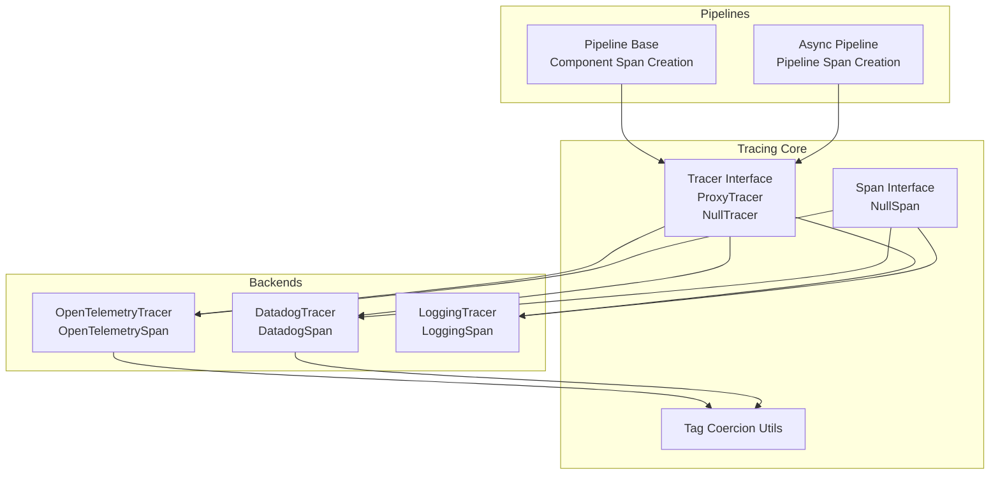
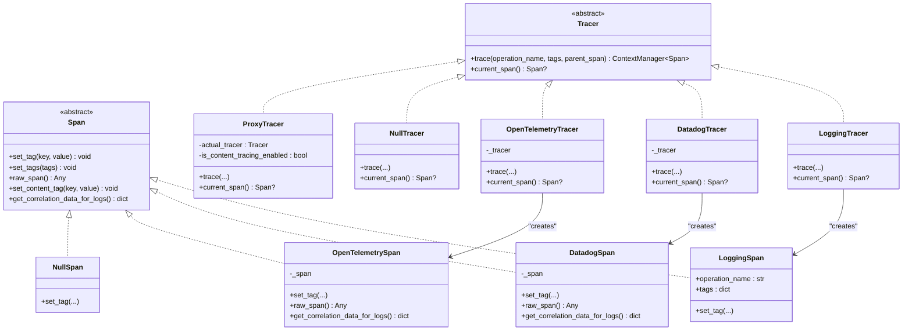
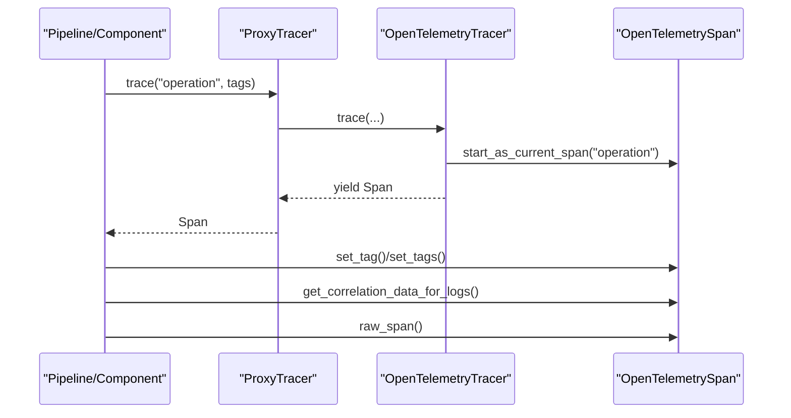
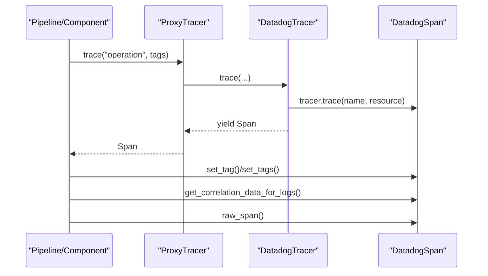
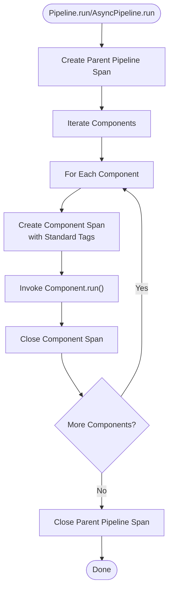
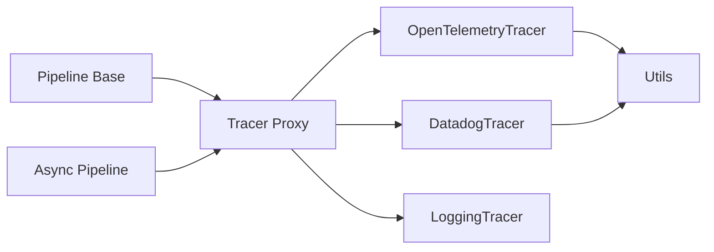

# Distributed Tracing

<cite>
**Referenced Files in This Document**
- [haystack/tracing/__init__.py](file://haystack/tracing/__init__.py)
- [haystack/tracing/tracer.py](file://haystack/tracing/tracer.py)
- [haystack/tracing/opentelemetry.py](file://haystack/tracing/opentelemetry.py)
- [haystack/tracing/datadog.py](file://haystack/tracing/datadog.py)
- [haystack/tracing/logging_tracer.py](file://haystack/tracing/logging_tracer.py)
- [haystack/tracing/utils.py](file://haystack/tracing/utils.py)
- [haystack/core/pipeline/base.py](file://haystack/core/pipeline/base.py)
- [haystack/core/pipeline/async_pipeline.py](file://haystack/core/pipeline/async_pipeline.py)
- [test/tracing/test_opentelemetry.py](file://test/tracing/test_opentelemetry.py)
- [test/core/pipeline/test_tracing.py](file://test/core/pipeline/test_tracing.py)
</cite>

## Table of Contents
1. [Introduction](#introduction)
2. [Project Structure](#project-structure)
3. [Core Components](#core-components)
4. [Architecture Overview](#architecture-overview)
5. [Detailed Component Analysis](#detailed-component-analysis)
6. [Dependency Analysis](#dependency-analysis)
7. [Performance Considerations](#performance-considerations)
8. [Troubleshooting Guide](#troubleshooting-guide)
9. [Conclusion](#conclusion)
10. [Appendices](#appendices)

## Introduction
This document explains Haystack’s distributed tracing implementation with a focus on OpenTelemetry and Datadog integrations, custom tracer configurations, and how tracing spans are created for pipeline execution, component invocations, and async operations. It also covers correlation ID propagation, configuration options for exporters and sampling, performance implications, security considerations, and practical setup examples for development and production.

## Project Structure
The tracing subsystem is organized around a small, extensible interface and pluggable backends:
- A generic tracer interface and proxy enable runtime switching and safe disabling.
- Backends implement the interface for OpenTelemetry and Datadog.
- Utilities provide tag coercion and log correlation helpers.
- Pipeline and async pipeline code integrate tracing into execution flows.

**Diagram sources**
- [haystack/tracing/tracer.py](file://haystack/tracing/tracer.py#L82-L166)
- [haystack/tracing/opentelemetry.py](file://haystack/tracing/opentelemetry.py#L46-L73)
- [haystack/tracing/datadog.py](file://haystack/tracing/datadog.py#L54-L96)
- [haystack/tracing/logging_tracer.py](file://haystack/tracing/logging_tracer.py#L34-L92)
- [haystack/tracing/utils.py](file://haystack/tracing/utils.py#L15-L66)
- [haystack/core/pipeline/base.py](file://haystack/core/pipeline/base.py#L879-L906)
- [haystack/core/pipeline/async_pipeline.py](file://haystack/core/pipeline/async_pipeline.py#L229-L238)

**Section sources**
- [haystack/tracing/__init__.py](file://haystack/tracing/__init__.py#L7-L17)
- [haystack/tracing/tracer.py](file://haystack/tracing/tracer.py#L19-L166)
- [haystack/tracing/opentelemetry.py](file://haystack/tracing/opentelemetry.py#L18-L73)
- [haystack/tracing/datadog.py](file://haystack/tracing/datadog.py#L23-L96)
- [haystack/tracing/logging_tracer.py](file://haystack/tracing/logging_tracer.py#L19-L92)
- [haystack/tracing/utils.py](file://haystack/tracing/utils.py#L15-L66)
- [haystack/core/pipeline/base.py](file://haystack/core/pipeline/base.py#L879-L906)
- [haystack/core/pipeline/async_pipeline.py](file://haystack/core/pipeline/async_pipeline.py#L229-L238)

## Core Components
- Tracer and Span abstractions define the instrumentation contract.
- ProxyTracer switches the active tracer without changing imports.
- NullTracer and NullSpan provide no-op behavior when tracing is disabled.
- OpenTelemetryTracer and DatadogTracer implement the backend-specific span creation and tagging.
- LoggingTracer offers a simple development-friendly tracer that logs spans and tags.
- Tag coercion utilities ensure backend-compatible attribute values.

Key behaviors:
- Automatic backend selection checks for existing OpenTelemetry or Datadog tracers.
- Environment flags control auto-enable and content tag inclusion.
- Pipelines create spans for component runs and async pipeline runs.

**Section sources**
- [haystack/tracing/tracer.py](file://haystack/tracing/tracer.py#L19-L166)
- [haystack/tracing/opentelemetry.py](file://haystack/tracing/opentelemetry.py#L46-L73)
- [haystack/tracing/datadog.py](file://haystack/tracing/datadog.py#L54-L96)
- [haystack/tracing/logging_tracer.py](file://haystack/tracing/logging_tracer.py#L34-L92)
- [haystack/tracing/utils.py](file://haystack/tracing/utils.py#L15-L66)

## Architecture Overview
The tracing architecture separates concerns between the instrumentation interface, backend implementations, and pipeline integration points. The global tracer proxy allows dynamic activation of backends and safe disabling.

**Diagram sources**
- [haystack/tracing/tracer.py](file://haystack/tracing/tracer.py#L19-L166)
- [haystack/tracing/opentelemetry.py](file://haystack/tracing/opentelemetry.py#L18-L73)
- [haystack/tracing/datadog.py](file://haystack/tracing/datadog.py#L23-L96)
- [haystack/tracing/logging_tracer.py](file://haystack/tracing/logging_tracer.py#L19-L92)

## Detailed Component Analysis

### Tracer and Span Interfaces
- Span supports single/multiple tag setting, content tag gating via environment, and correlation data extraction for logs.
- Tracer defines a context-manager-based trace method and a current span accessor.
- ProxyTracer delegates to the actual tracer and toggles content tracing based on environment.
- NullTracer and NullSpan provide no-op implementations to disable tracing without code changes.

**Section sources**
- [haystack/tracing/tracer.py](file://haystack/tracing/tracer.py#L19-L166)

### OpenTelemetry Backend
- OpenTelemetryTracer wraps an OpenTelemetry tracer, starts spans as the current span, and sets attributes after coercing values.
- OpenTelemetrySpan exposes raw span access and correlates logs via trace/space IDs.

**Diagram sources**
- [haystack/tracing/opentelemetry.py](file://haystack/tracing/opentelemetry.py#L46-L73)
- [haystack/tracing/tracer.py](file://haystack/tracing/tracer.py#L119-L135)

**Section sources**
- [haystack/tracing/opentelemetry.py](file://haystack/tracing/opentelemetry.py#L18-L73)
- [test/tracing/test_opentelemetry.py](file://test/tracing/test_opentelemetry.py#L71-L93)

### Datadog Backend
- DatadogTracer creates spans with optional resource naming tailored for component runs and sets tags with coercion.
- DatadogSpan provides correlation data via the Datadog log correlation context.

**Diagram sources**
- [haystack/tracing/datadog.py](file://haystack/tracing/datadog.py#L54-L96)

**Section sources**
- [haystack/tracing/datadog.py](file://haystack/tracing/datadog.py#L23-L96)

### LoggingTracer (Development)
- Logs operation names and tags when entering/exiting a trace context.
- Uses tag coercion for safe logging.

**Section sources**
- [haystack/tracing/logging_tracer.py](file://haystack/tracing/logging_tracer.py#L34-L92)
- [haystack/tracing/utils.py](file://haystack/tracing/utils.py#L15-L66)

### Tag Coercion and Security
- Tag values are coerced to primitive or JSON-serializable forms to satisfy backend constraints.
- Content tags (queries, documents, answers) are gated behind an environment flag to avoid leaking sensitive data.

**Section sources**
- [haystack/tracing/utils.py](file://haystack/tracing/utils.py#L15-L66)
- [haystack/tracing/tracer.py](file://haystack/tracing/tracer.py#L54-L72)

### Pipeline Execution Tracing
- Component spans are created for each component run with standardized tags (name, type, input/output specs).
- Async pipeline spans encapsulate the entire async run lifecycle.

**Diagram sources**
- [haystack/core/pipeline/base.py](file://haystack/core/pipeline/base.py#L879-L906)
- [haystack/core/pipeline/async_pipeline.py](file://haystack/core/pipeline/async_pipeline.py#L229-L238)

**Section sources**
- [haystack/core/pipeline/base.py](file://haystack/core/pipeline/base.py#L879-L906)
- [haystack/core/pipeline/async_pipeline.py](file://haystack/core/pipeline/async_pipeline.py#L229-L238)

### Correlation ID Propagation
- OpenTelemetry: correlation data includes trace and span IDs extracted from the underlying span context.
- Datadog: correlation data is retrieved via the official log correlation context method.

**Section sources**
- [haystack/tracing/opentelemetry.py](file://haystack/tracing/opentelemetry.py#L40-L44)
- [haystack/tracing/datadog.py](file://haystack/tracing/datadog.py#L47-L52)

## Dependency Analysis
- The tracing subsystem depends on the lazy import mechanism for optional backends.
- Pipelines import the global tracer proxy to create spans without coupling to a specific backend.
- Tests validate backend behavior and pipeline span creation.

**Diagram sources**
- [haystack/core/pipeline/base.py](file://haystack/core/pipeline/base.py#L17-L18)
- [haystack/core/pipeline/async_pipeline.py](file://haystack/core/pipeline/async_pipeline.py#L229-L238)
- [haystack/tracing/tracer.py](file://haystack/tracing/tracer.py#L166-L244)
- [haystack/tracing/opentelemetry.py](file://haystack/tracing/opentelemetry.py#L13-L16)
- [haystack/tracing/datadog.py](file://haystack/tracing/datadog.py#L13-L17)

**Section sources**
- [haystack/core/pipeline/base.py](file://haystack/core/pipeline/base.py#L17-L18)
- [haystack/core/pipeline/async_pipeline.py](file://haystack/core/pipeline/async_pipeline.py#L229-L238)
- [haystack/tracing/tracer.py](file://haystack/tracing/tracer.py#L166-L244)

## Performance Considerations
- Overhead: Creating spans and attributes adds CPU and memory overhead. Disable tracing in hot loops or when throughput is critical.
- Sampling: Configure backend sampling to reduce overhead. For OpenTelemetry, configure the SDK sampler; for Datadog, configure the agent or tracer sampling rate.
- Attribute volume: Avoid attaching large or sensitive payloads as span attributes. Use tag coercion and keep attributes minimal.
- Async tracing: Async pipelines create a single parent span; ensure downstream components still add meaningful tags to aid debugging without inflating span counts.
- Exporter batching and queuing: Tune exporter buffer sizes and flush intervals to balance latency and overhead.

[No sources needed since this section provides general guidance]

## Troubleshooting Guide
Common issues and resolutions:
- No traces appear:
  - Verify auto-enable behavior and environment flags.
  - Confirm a backend tracer is active before importing Haystack.
- Unexpectedly low or zero spans:
  - Check sampling configuration and exporter health.
  - Ensure spans are created inside the intended execution context.
- Sensitive data leakage:
  - Content tags are gated by an environment flag. Keep it disabled unless explicitly required.
- Log correlation not working:
  - For OpenTelemetry, confirm correlation data retrieval from the span context.
  - For Datadog, ensure the official log correlation context is used.

Validation references:
- Component span creation and tags in tests.
- OpenTelemetry span attribute serialization and correlation data.

**Section sources**
- [haystack/tracing/tracer.py](file://haystack/tracing/tracer.py#L184-L244)
- [test/core/pipeline/test_tracing.py](file://test/core/pipeline/test_tracing.py#L121-L144)
- [test/tracing/test_opentelemetry.py](file://test/tracing/test_opentelemetry.py#L71-L93)

## Conclusion
Haystack’s tracing system cleanly separates instrumentation from backend implementation, supports multiple providers, and integrates naturally with pipeline execution. Use environment flags to control content visibility, tune sampling and exporters for performance, and rely on correlation data to connect traces and logs across services.

[No sources needed since this section summarizes without analyzing specific files]

## Appendices

### Configuration Options and Setup Examples
- Environment flags:
  - Enable/disable auto-tracing globally.
  - Enable content tags for sensitive attributes.
- OpenTelemetry:
  - Configure the OpenTelemetry SDK and exporters (OTLP, Jaeger, Zipkin, etc.) externally; Haystack will detect and use an active tracer.
  - Adjust sampling and resource attributes via the SDK.
- Datadog:
  - Install and configure the Datadog tracer; Haystack detects enabled state and uses it.
  - Resource naming for component spans is handled automatically.
- Development:
  - Use LoggingTracer to print operation names and tags for quick diagnostics.

**Section sources**
- [haystack/tracing/tracer.py](file://haystack/tracing/tracer.py#L13-L15)
- [haystack/tracing/tracer.py](file://haystack/tracing/tracer.py#L184-L244)
- [haystack/tracing/logging_tracer.py](file://haystack/tracing/logging_tracer.py#L34-L52)

### Practical Examples
- Pipeline component run span creation and tags:
  - See standardized tags for component name, type, input/output specs.
- Async pipeline span creation:
  - Parent span encapsulates the entire async run with pipeline metadata.

**Section sources**
- [haystack/core/pipeline/base.py](file://haystack/core/pipeline/base.py#L879-L906)
- [haystack/core/pipeline/async_pipeline.py](file://haystack/core/pipeline/async_pipeline.py#L229-L238)
- [test/core/pipeline/test_tracing.py](file://test/core/pipeline/test_tracing.py#L121-L144)

### Security Considerations
- Content tags are gated by an environment flag to prevent accidental leakage of queries, documents, and answers.
- Avoid attaching large or sensitive payloads to spans; rely on tag coercion to sanitize values.
- Prefer backend-native filtering and redaction mechanisms.

**Section sources**
- [haystack/tracing/tracer.py](file://haystack/tracing/tracer.py#L54-L72)
- [haystack/tracing/utils.py](file://haystack/tracing/utils.py#L15-L66)