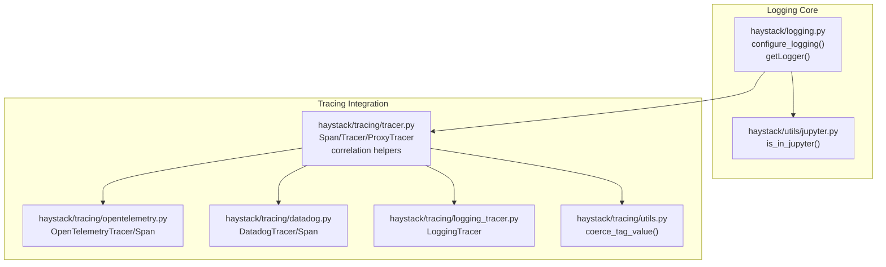
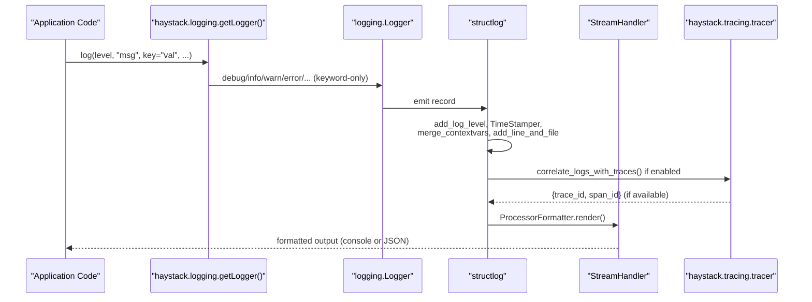
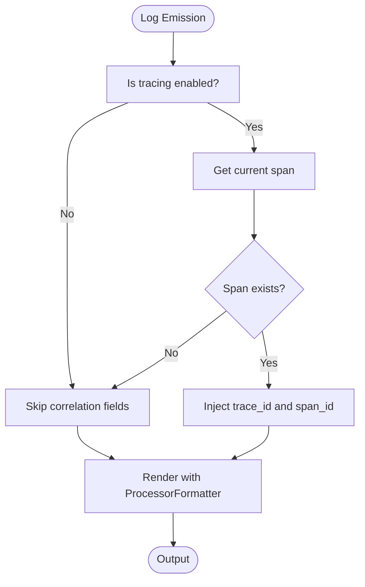
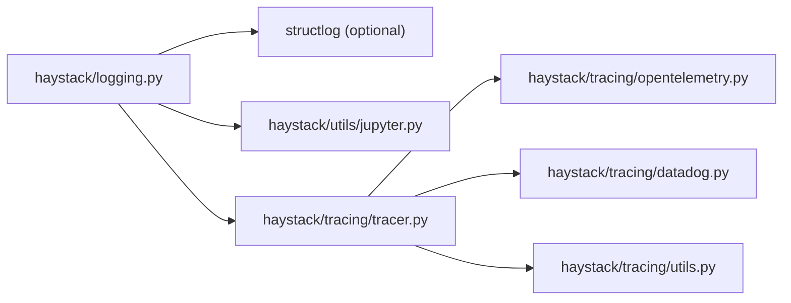

# Logging

<cite>
**Referenced Files in This Document**
- [logging.py](file://haystack/logging.py)
- [test_logging.py](file://test/test_logging.py)
- [tracer.py](file://haystack/tracing/tracer.py)
- [opentelemetry.py](file://haystack/tracing/opentelemetry.py)
- [datadog.py](file://haystack/tracing/datadog.py)
- [logging_tracer.py](file://haystack/tracing/logging_tracer.py)
- [utils.py](file://haystack/tracing/utils.py)
- [jupyter.py](file://haystack/utils/jupyter.py)
- [__init__.py](file://haystack/tracing/__init__.py)
</cite>

## Table of Contents
1. [Introduction](#introduction)
2. [Project Structure](#project-structure)
3. [Core Components](#core-components)
4. [Architecture Overview](#architecture-overview)
5. [Detailed Component Analysis](#detailed-component-analysis)
6. [Dependency Analysis](#dependency-analysis)
7. [Performance Considerations](#performance-considerations)
8. [Troubleshooting Guide](#troubleshooting-guide)
9. [Conclusion](#conclusion)
10. [Appendices](#appendices)

## Introduction
This document explains Haystack’s logging system with a focus on structured logging, correlation IDs injection, and log aggregation strategies. It covers configuration options, log levels, formatting patterns, and how logging integrates with tracing systems to maintain correlation between logs and traces. It also provides best practices for application-level logging, environment-specific configurations, custom log handlers, performance considerations, log rotation strategies, troubleshooting, and security/compliance guidance.

## Project Structure
The logging system is centered around a small set of modules:
- A configurable logger façade that enforces keyword-only arguments and structured logging
- Structured log formatting powered by structlog with automatic console vs JSON detection
- Integration with tracing systems to inject correlation IDs into logs
- Utilities to detect interactive environments and coerce tag values for tracing

**Diagram sources**
- [logging.py](file://haystack/logging.py#L298-L404)
- [jupyter.py](file://haystack/utils/jupyter.py#L6-L21)
- [tracer.py](file://haystack/tracing/tracer.py#L19-L80)
- [opentelemetry.py](file://haystack/tracing/opentelemetry.py#L46-L73)
- [datadog.py](file://haystack/tracing/datadog.py#L54-L96)
- [logging_tracer.py](file://haystack/tracing/logging_tracer.py#L34-L92)
- [utils.py](file://haystack/tracing/utils.py#L15-L66)

**Section sources**
- [logging.py](file://haystack/logging.py#L298-L404)
- [jupyter.py](file://haystack/utils/jupyter.py#L6-L21)
- [tracer.py](file://haystack/tracing/tracer.py#L19-L80)
- [opentelemetry.py](file://haystack/tracing/opentelemetry.py#L46-L73)
- [datadog.py](file://haystack/tracing/datadog.py#L54-L96)
- [logging_tracer.py](file://haystack/tracing/logging_tracer.py#L34-L92)
- [utils.py](file://haystack/tracing/utils.py#L15-L66)

## Core Components
- Structured logging façade
  - Enforces keyword-only arguments for all log methods
  - Uses keyword-based string interpolation to prevent loss of JSON-like content
  - Patches stack information to point to the actual caller
- Structured log formatting
  - Detects TTY and interactive environments to choose console or JSON rendering
  - Supports JSON output with exception rendering and correlation data
- Tracing integration
  - Adds correlation data (trace_id, span_id) to logs when a tracer is active
  - Integrates with OpenTelemetry and Datadog backends

Key configuration options:
- Environment variables
  - HAYSTACK_LOGGING_USE_JSON: forces JSON or console rendering
  - HAYSTACK_LOGGING_IGNORE_STRUCTLOG: bypasses structlog configuration
  - HAYSTACK_AUTO_TRACE_ENABLED: auto-enables tracing backends
  - HAYSTACK_CONTENT_TRACING_ENABLED: allows content tags in traces
- Programmatic configuration
  - configure_logging(use_json=None): chooses JSON/console based on environment and TTY detection

Log levels and formatting:
- Levels: debug, info, warning, error, exception, fatal, critical
- Formatting: ISO timestamps, module and line number, structured key-value pairs, optional JSON

**Section sources**
- [logging.py](file://haystack/logging.py#L136-L266)
- [logging.py](file://haystack/logging.py#L298-L404)
- [test_logging.py](file://test/test_logging.py#L43-L132)
- [test_logging.py](file://test/test_logging.py#L200-L334)
- [tracer.py](file://haystack/tracing/tracer.py#L13-L15)
- [tracer.py](file://haystack/tracing/tracer.py#L179-L204)

## Architecture Overview
The logging subsystem composes standard library logging with structlog processors and a custom ProcessorFormatter. It optionally enriches logs with correlation IDs from the active tracer.

**Diagram sources**
- [logging.py](file://haystack/logging.py#L240-L266)
- [logging.py](file://haystack/logging.py#L280-L296)
- [logging.py](file://haystack/logging.py#L354-L404)
- [tracer.py](file://haystack/tracing/tracer.py#L73-L79)

## Detailed Component Analysis

### Structured Logging Façade and Configuration
- Keyword-only enforcement ensures structured logging is the default and prevents positional interpolation mistakes
- String interpolation uses keyword arguments to avoid losing structured content (e.g., JSON strings)
- Stack level is adjusted so log locations reflect the actual caller, not internal wrappers
- Structlog configuration:
  - Shared processors: add_log_level, TimeStamper, merge_contextvars, add_line_and_file
  - Optional correlation processor when JSON mode is enabled
  - ConsoleRenderer for interactive terminals; JSONRenderer for non-TTY environments
  - ProcessorFormatter wraps standard logging records and adds extras

Environment detection:
- Interactive terminal detection via TTY, IPython, or Jupyter
- Automatic JSON mode selection unless overridden by HAYSTACK_LOGGING_USE_JSON

**Section sources**
- [logging.py](file://haystack/logging.py#L136-L266)
- [logging.py](file://haystack/logging.py#L298-L404)
- [jupyter.py](file://haystack/utils/jupyter.py#L6-L21)
- [test_logging.py](file://test/test_logging.py#L60-L198)
- [test_logging.py](file://test/test_logging.py#L200-L334)

### Correlation ID Injection and Tracing Integration
- Correlation processor reads the current span from the tracer and injects trace_id and span_id into logs
- Works with OpenTelemetry and Datadog tracers; falls back gracefully when no tracer is active
- Tag coercion utilities ensure values are compatible with tracing backends

**Diagram sources**
- [logging.py](file://haystack/logging.py#L280-L296)
- [tracer.py](file://haystack/tracing/tracer.py#L73-L79)
- [opentelemetry.py](file://haystack/tracing/opentelemetry.py#L40-L44)
- [datadog.py](file://haystack/tracing/datadog.py#L47-L52)

**Section sources**
- [logging.py](file://haystack/logging.py#L280-L296)
- [tracer.py](file://haystack/tracing/tracer.py#L73-L79)
- [opentelemetry.py](file://haystack/tracing/opentelemetry.py#L40-L44)
- [datadog.py](file://haystack/tracing/datadog.py#L47-L52)
- [test_logging.py](file://test/test_logging.py#L336-L410)

### Tracing Backends and Tag Coercion
- OpenTelemetryTracer/Span: exposes trace_id/span_id via span context
- DatadogTracer/Span: uses backend-specific correlation context
- Tag coercion utilities:
  - Primitive types preserved
  - Complex types serialized or coerced to strings
  - Fallback to string conversion with debug logging on failure

**Section sources**
- [opentelemetry.py](file://haystack/tracing/opentelemetry.py#L18-L44)
- [datadog.py](file://haystack/tracing/datadog.py#L23-L52)
- [utils.py](file://haystack/tracing/utils.py#L15-L66)

### Logging Tracer (Development/Debugging)
- A simple tracer that logs operation names and tags at debug level
- Useful for lightweight tracing during development without external backends

**Section sources**
- [logging_tracer.py](file://haystack/tracing/logging_tracer.py#L34-L92)

## Dependency Analysis
- haystack.logging depends on:
  - Standard logging
  - Optional structlog (when available)
  - Environment detection utilities (TTY/IPython/Jupyter)
  - Tracing subsystem for correlation
- Tracing subsystem depends on:
  - OpenTelemetry or Datadog backends (optional)
  - Tag coercion utilities

**Diagram sources**
- [logging.py](file://haystack/logging.py#L312-L323)
- [logging.py](file://haystack/logging.py#L354-L404)
- [jupyter.py](file://haystack/utils/jupyter.py#L6-L21)
- [tracer.py](file://haystack/tracing/tracer.py#L19-L80)
- [opentelemetry.py](file://haystack/tracing/opentelemetry.py#L46-L73)
- [datadog.py](file://haystack/tracing/datadog.py#L54-L96)
- [utils.py](file://haystack/tracing/utils.py#L15-L66)

**Section sources**
- [logging.py](file://haystack/logging.py#L312-L323)
- [logging.py](file://haystack/logging.py#L354-L404)
- [tracer.py](file://haystack/tracing/tracer.py#L19-L80)

## Performance Considerations
- Rendering choice:
  - Non-TTY environments default to JSON rendering for efficient ingestion
  - Interactive terminals use ConsoleRenderer for readability
- Exception rendering:
  - JSON mode disables local variable dumps in exceptions to reduce payload size
- Filtering:
  - Root logger level is respected; lower-level messages are dropped early
- Structlog overhead:
  - Bound logger and contextvar merging add minimal overhead; acceptable for most workloads
- Recommendations for high throughput:
  - Prefer JSON output and non-blocking handlers
  - Avoid excessive use of expensive extras or large objects in logs
  - Use appropriate log levels to minimize noise

**Section sources**
- [logging.py](file://haystack/logging.py#L333-L340)
- [logging.py](file://haystack/logging.py#L363-L372)
- [logging.py](file://haystack/logging.py#L358-L360)
- [test_logging.py](file://test/test_logging.py#L60-L198)

## Troubleshooting Guide
Common issues and resolutions:
- Logs missing in JSON mode
  - Ensure HAYSTACK_LOGGING_USE_JSON is set appropriately; confirm environment detection logic
- Unexpected console output in non-interactive environments
  - Override with HAYSTACK_LOGGING_USE_JSON=true or force JSON via configure_logging(use_json=True)
- Correlation IDs not appearing
  - Verify tracing is enabled and a tracer is active; confirm current span exists
  - Check that correlate_logs_with_traces is included in processors (only in JSON mode)
- Reserved keyword errors or interpolation failures
  - Use keyword-only arguments; avoid positional interpolation
  - Ensure structured content is passed as extras, not embedded in the message string
- Excessive local variables in exception logs
  - JSON mode intentionally hides locals; adjust if debugging locally

Operational checks:
- Confirm handler uniqueness to avoid duplicate outputs
- Validate root logger level and per-module overrides
- Use tests as references for expected behaviors

**Section sources**
- [test_logging.py](file://test/test_logging.py#L43-L132)
- [test_logging.py](file://test/test_logging.py#L200-L334)
- [test_logging.py](file://test/test_logging.py#L336-L410)
- [logging.py](file://haystack/logging.py#L395-L404)

## Conclusion
Haystack’s logging system provides a robust, structured, and trace-aware foundation for applications. It enforces best practices through keyword-only logging and safe interpolation, intelligently selects rendering modes based on the environment, and integrates seamlessly with tracing systems to correlate logs with traces. With clear configuration options and strong defaults, it supports development, staging, and production needs while maintaining performance and security.

## Appendices

### Best Practices for Application-Level Logging
- Always pass structured data as keyword arguments to log methods
- Avoid embedding structured content inside message strings; pass as extras
- Use appropriate log levels to control verbosity
- Leverage contextvars for cross-cutting attributes (e.g., tenant, request_id)
- Keep sensitive data out of logs; mask or redact where necessary

### Environment-Specific Configurations
- Development
  - Interactive terminals: console renderer for readability
  - Optional: enable content tracing tags via HAYSTACK_CONTENT_TRACING_ENABLED
- Staging
  - Non-TTY: JSON renderer with correlation IDs
  - Enable tracing auto-configuration via HAYSTACK_AUTO_TRACE_ENABLED
- Production
  - JSON renderer with exception rendering disabled for locals
  - Centralized log collection and rotation via external systems

### Log Aggregation Strategies
- Forward logs to centralized systems (e.g., ELK, Loki, CloudWatch) using JSON output
- Use correlation IDs (trace_id, span_id) to join logs with traces in dashboards
- Apply log filtering and enrichment at the collector or agent level

### Custom Log Handlers
- Extend the root logger with custom StreamHandler or FileHandler
- Ensure ProcessorFormatter is used for standard logging records when mixing stdlib and structlog
- Avoid adding duplicate handlers; the configuration logic prevents duplicates

### Security and Compliance
- Avoid logging sensitive information (tokens, passwords, PII)
- Redact or transform sensitive fields before logging
- Limit local variable exposure in exception logs (already disabled in JSON mode)
- Audit and review log retention policies to meet compliance requirements