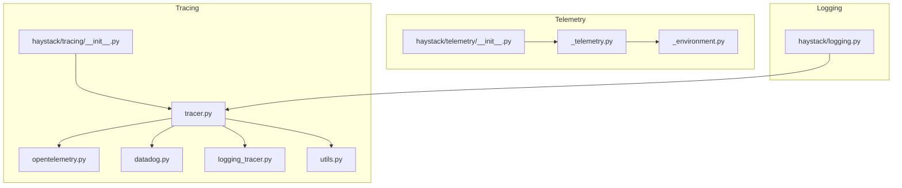
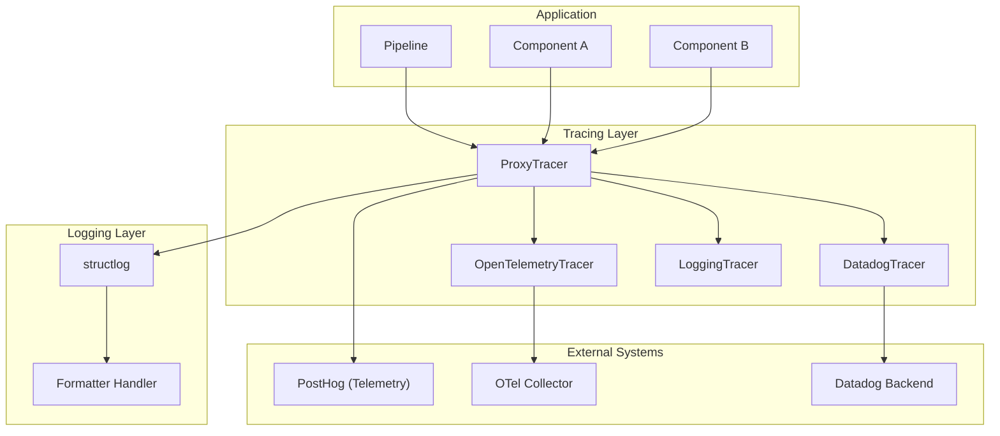
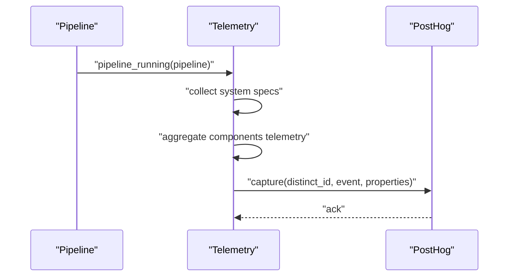
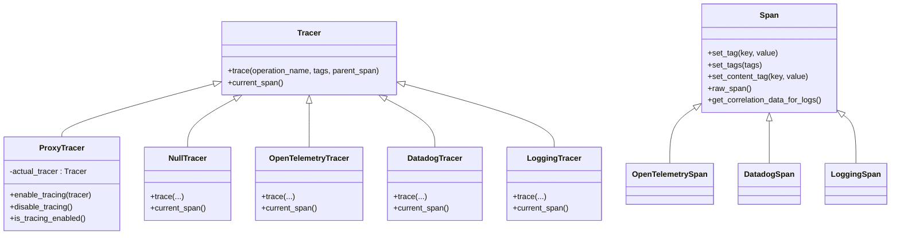
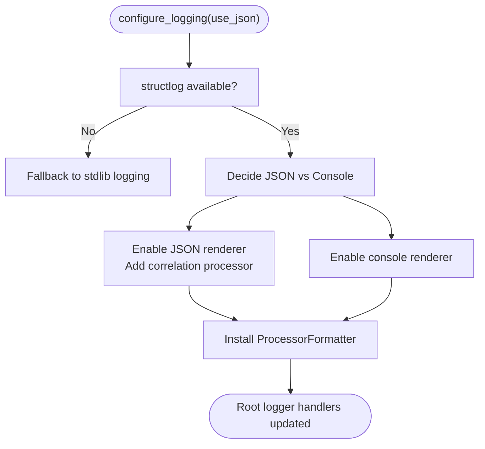
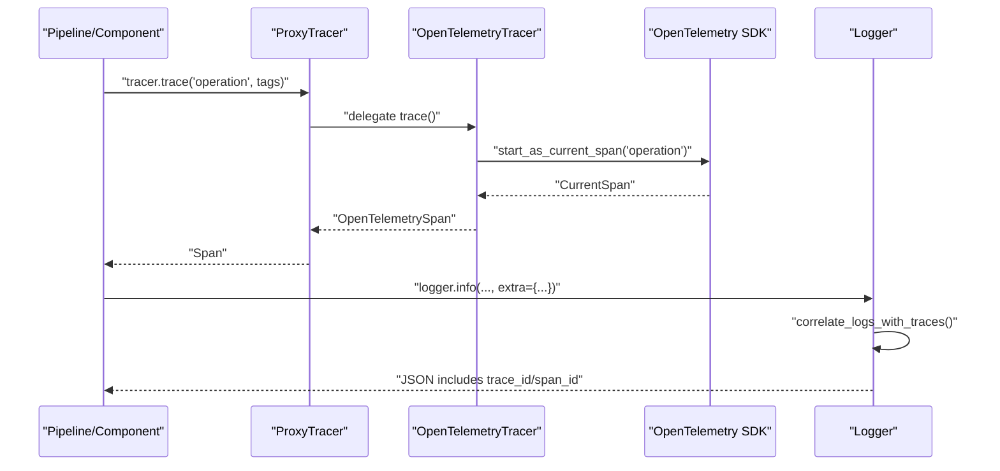
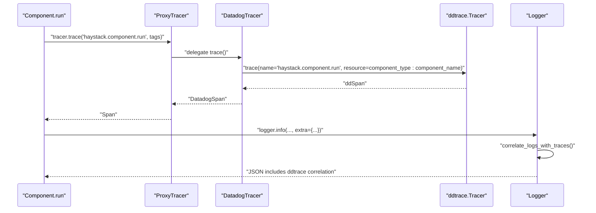
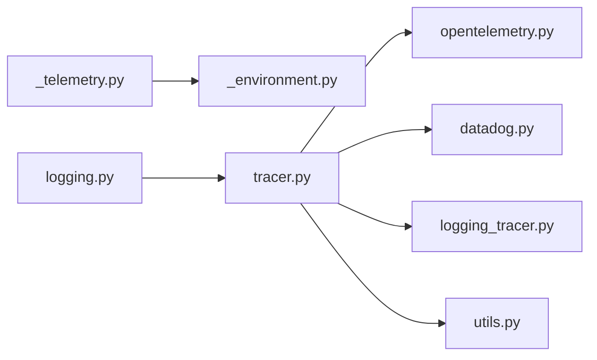

# Monitoring and Observability

<cite>
**Referenced Files in This Document**
- [haystack/telemetry/__init__.py](file://haystack/telemetry/__init__.py)
- [haystack/telemetry/_telemetry.py](file://haystack/telemetry/_telemetry.py)
- [haystack/telemetry/_environment.py](file://haystack/telemetry/_environment.py)
- [haystack/tracing/__init__.py](file://haystack/tracing/__init__.py)
- [haystack/tracing/tracer.py](file://haystack/tracing/tracer.py)
- [haystack/tracing/opentelemetry.py](file://haystack/tracing/opentelemetry.py)
- [haystack/tracing/datadog.py](file://haystack/tracing/datadog.py)
- [haystack/tracing/logging_tracer.py](file://haystack/tracing/logging_tracer.py)
- [haystack/tracing/utils.py](file://haystack/tracing/utils.py)
- [haystack/logging.py](file://haystack/logging.py)
- [test/test_telemetry.py](file://test/test_telemetry.py)
- [test/test_logging.py](file://test/test_logging.py)
- [.github/workflows/ci_metrics.yml](file://.github/workflows/ci_metrics.yml)
</cite>

## Table of Contents
1. [Introduction](#introduction)
2. [Project Structure](#project-structure)
3. [Core Components](#core-components)
4. [Architecture Overview](#architecture-overview)
5. [Detailed Component Analysis](#detailed-component-analysis)
6. [Dependency Analysis](#dependency-analysis)
7. [Performance Considerations](#performance-considerations)
8. [Troubleshooting Guide](#troubleshooting-guide)
9. [Conclusion](#conclusion)
10. [Appendices](#appendices)

## Introduction
This document explains Haystack’s monitoring and observability capabilities with a focus on telemetry, distributed tracing, and logging. It covers configuration, data collection, integrations with OpenTelemetry and Datadog, structured logging with correlation IDs, performance monitoring, alerting, and security considerations. Practical examples demonstrate how to set up monitoring, configure alerts, and troubleshoot pipeline issues.

## Project Structure
The observability features are organized into three main areas:
- Telemetry: anonymous usage analytics sent to a third-party service with opt-out capability.
- Tracing: pluggable tracing backends (OpenTelemetry, Datadog, and a logging tracer) with automatic detection and correlation helpers.
- Logging: structured logging with optional JSON output, correlation with traces, and strict keyword-only APIs to enforce structured logs.

**Diagram sources**
- [haystack/telemetry/__init__.py](file://haystack/telemetry/__init__.py#L1-L8)
- [haystack/telemetry/_telemetry.py](file://haystack/telemetry/_telemetry.py#L1-L192)
- [haystack/telemetry/_environment.py](file://haystack/telemetry/_environment.py#L1-L99)
- [haystack/tracing/__init__.py](file://haystack/tracing/__init__.py#L1-L17)
- [haystack/tracing/tracer.py](file://haystack/tracing/tracer.py#L1-L244)
- [haystack/tracing/opentelemetry.py](file://haystack/tracing/opentelemetry.py#L1-L73)
- [haystack/tracing/datadog.py](file://haystack/tracing/datadog.py#L1-L96)
- [haystack/tracing/logging_tracer.py](file://haystack/tracing/logging_tracer.py#L1-L92)
- [haystack/tracing/utils.py](file://haystack/tracing/utils.py#L1-L66)
- [haystack/logging.py](file://haystack/logging.py#L1-L404)

**Section sources**
- [haystack/telemetry/__init__.py](file://haystack/telemetry/__init__.py#L1-L8)
- [haystack/tracing/__init__.py](file://haystack/tracing/__init__.py#L1-L17)
- [haystack/logging.py](file://haystack/logging.py#L1-L404)

## Core Components
- Telemetry: Anonymous usage statistics sent to a hosted analytics service. It collects system metadata, pipeline run counts, and per-component telemetry data from components that expose a telemetry hook. Events are throttled to a minimum interval and can be opted out via an environment variable.
- Tracing: A pluggable tracer abstraction with three backends:
  - OpenTelemetry: Uses the OpenTelemetry SDK to create spans and propagate correlation data for logs.
  - Datadog: Integrates with ddtrace to create spans and set resource names for component runs.
  - LoggingTracer: A simple tracer that logs spans and tags to stdout for debugging.
- Logging: Structured logging with JSON output in production environments, correlation IDs injected automatically when tracing is enabled, and enforced keyword-only APIs to ensure structured logs.

**Section sources**
- [haystack/telemetry/_telemetry.py](file://haystack/telemetry/_telemetry.py#L34-L192)
- [haystack/tracing/tracer.py](file://haystack/tracing/tracer.py#L19-L244)
- [haystack/tracing/opentelemetry.py](file://haystack/tracing/opentelemetry.py#L18-L73)
- [haystack/tracing/datadog.py](file://haystack/tracing/datadog.py#L23-L96)
- [haystack/tracing/logging_tracer.py](file://haystack/tracing/logging_tracer.py#L19-L92)
- [haystack/logging.py](file://haystack/logging.py#L298-L404)

## Architecture Overview
The observability stack integrates at three layers:
- Telemetry: Periodic pipeline run events with component-level telemetry data.
- Tracing: Automatic backend selection and span tagging with content tracing toggle.
- Logging: Structured logs with correlation IDs and optional JSON rendering.

**Diagram sources**
- [haystack/tracing/tracer.py](file://haystack/tracing/tracer.py#L111-L244)
- [haystack/tracing/opentelemetry.py](file://haystack/tracing/opentelemetry.py#L46-L73)
- [haystack/tracing/datadog.py](file://haystack/tracing/datadog.py#L54-L96)
- [haystack/tracing/logging_tracer.py](file://haystack/tracing/logging_tracer.py#L34-L92)
- [haystack/logging.py](file://haystack/logging.py#L298-L404)
- [haystack/telemetry/_telemetry.py](file://haystack/telemetry/_telemetry.py#L99-L192)

## Detailed Component Analysis

### Telemetry
Telemetry collects anonymous usage statistics and sends them to a hosted analytics service. It:
- Generates a persistent user ID and stores it in a config file.
- Collects system specs once per process (OS, Python version, CPU count, containerization).
- Throttles events to a minimum interval and only sends when enabled.
- Aggregates pipeline run data and per-component telemetry hooks.

**Diagram sources**
- [haystack/telemetry/_telemetry.py](file://haystack/telemetry/_telemetry.py#L137-L176)
- [haystack/telemetry/_telemetry.py](file://haystack/telemetry/_telemetry.py#L99-L114)
- [haystack/telemetry/_environment.py](file://haystack/telemetry/_environment.py#L71-L99)

Key configuration and behavior:
- Environment variable to disable telemetry globally.
- Config file location for persistent user ID.
- Minimum interval between events to avoid spam.
- Per-component telemetry hook requirement.

**Section sources**
- [haystack/telemetry/_telemetry.py](file://haystack/telemetry/_telemetry.py#L24-L98)
- [haystack/telemetry/_telemetry.py](file://haystack/telemetry/_telemetry.py#L99-L192)
- [haystack/telemetry/_environment.py](file://haystack/telemetry/_environment.py#L71-L99)
- [test/test_telemetry.py](file://test/test_telemetry.py#L17-L66)

### Distributed Tracing
The tracing subsystem provides a unified interface for creating spans and tags, with automatic backend selection and content tracing controls.

**Diagram sources**
- [haystack/tracing/tracer.py](file://haystack/tracing/tracer.py#L82-L161)
- [haystack/tracing/opentelemetry.py](file://haystack/tracing/opentelemetry.py#L46-L73)
- [haystack/tracing/datadog.py](file://haystack/tracing/datadog.py#L54-L96)
- [haystack/tracing/logging_tracer.py](file://haystack/tracing/logging_tracer.py#L34-L92)

Behavior highlights:
- Automatic backend selection checks for active OpenTelemetry or Datadog tracers.
- Content tags are gated behind an environment variable to prevent sensitive data leakage.
- Tag coercion utilities ensure backend-compatible values.

**Section sources**
- [haystack/tracing/tracer.py](file://haystack/tracing/tracer.py#L111-L244)
- [haystack/tracing/opentelemetry.py](file://haystack/tracing/opentelemetry.py#L18-L73)
- [haystack/tracing/datadog.py](file://haystack/tracing/datadog.py#L23-L96)
- [haystack/tracing/logging_tracer.py](file://haystack/tracing/logging_tracer.py#L19-L92)
- [haystack/tracing/utils.py](file://haystack/tracing/utils.py#L15-L66)

### Logging
Logging is structured by default when structlog is installed, with optional JSON output for production and automatic correlation IDs when tracing is enabled.

**Diagram sources**
- [haystack/logging.py](file://haystack/logging.py#L298-L404)

Key features:
- Keyword-only APIs for log methods to enforce structured logging.
- Optional JSON rendering for production environments.
- Correlation IDs injected automatically when tracing is enabled.
- Stack level adjustments to point to the caller, not internal wrappers.

**Section sources**
- [haystack/logging.py](file://haystack/logging.py#L240-L404)
- [test/test_logging.py](file://test/test_logging.py#L336-L410)

### OpenTelemetry Integration
OpenTelemetry tracing is supported via a thin adapter that:
- Creates spans with the current tracer.
- Sets attributes with value coercion.
- Exposes correlation data for logs (trace_id, span_id).

**Diagram sources**
- [haystack/tracing/opentelemetry.py](file://haystack/tracing/opentelemetry.py#L51-L73)
- [haystack/logging.py](file://haystack/logging.py#L280-L296)

**Section sources**
- [haystack/tracing/opentelemetry.py](file://haystack/tracing/opentelemetry.py#L18-L73)
- [haystack/logging.py](file://haystack/logging.py#L280-L296)

### Datadog Integration
Datadog tracing sets resource names for component runs and exposes correlation data for logs.

**Diagram sources**
- [haystack/tracing/datadog.py](file://haystack/tracing/datadog.py#L72-L96)
- [haystack/logging.py](file://haystack/logging.py#L280-L296)

**Section sources**
- [haystack/tracing/datadog.py](file://haystack/tracing/datadog.py#L54-L96)
- [haystack/logging.py](file://haystack/logging.py#L280-L296)

### Logging Tracer (Debugging)
The logging tracer writes spans and tags to stdout for quick debugging without external dependencies.

**Section sources**
- [haystack/tracing/logging_tracer.py](file://haystack/tracing/logging_tracer.py#L34-L92)

## Dependency Analysis
Observability components are loosely coupled:
- Tracing backends implement a common interface and are selected automatically.
- Logging depends on tracing only when correlation is enabled.
- Telemetry is independent and does not rely on tracing or logging.

**Diagram sources**
- [haystack/telemetry/_telemetry.py](file://haystack/telemetry/_telemetry.py#L1-L192)
- [haystack/telemetry/_environment.py](file://haystack/telemetry/_environment.py#L1-L99)
- [haystack/tracing/tracer.py](file://haystack/tracing/tracer.py#L1-L244)
- [haystack/tracing/opentelemetry.py](file://haystack/tracing/opentelemetry.py#L1-L73)
- [haystack/tracing/datadog.py](file://haystack/tracing/datadog.py#L1-L96)
- [haystack/tracing/logging_tracer.py](file://haystack/tracing/logging_tracer.py#L1-L92)
- [haystack/tracing/utils.py](file://haystack/tracing/utils.py#L1-L66)
- [haystack/logging.py](file://haystack/logging.py#L1-L404)

**Section sources**
- [haystack/tracing/tracer.py](file://haystack/tracing/tracer.py#L111-L244)
- [haystack/logging.py](file://haystack/logging.py#L280-L296)

## Performance Considerations
- Telemetry throttling prevents excessive network calls and reduces overhead.
- Tag coercion avoids backend-specific serialization errors and keeps payload sizes manageable.
- Structured logging with JSON is recommended for production to improve parsing and reduce CPU overhead from string formatting.
- Content tracing is disabled by default to avoid leaking sensitive data and to minimize span size.

[No sources needed since this section provides general guidance]

## Troubleshooting Guide
Common issues and resolutions:
- Telemetry not sending:
  - Verify the environment variable to enable/disable telemetry.
  - Check the config file path and permissions for the persistent user ID.
  - Confirm network connectivity to the telemetry endpoint.
- Tracing not active:
  - Ensure a tracer backend is installed and active (OpenTelemetry or Datadog).
  - Confirm automatic detection runs before importing Haystack.
  - Check content tracing environment variable if sensitive tags are missing.
- Logs missing correlation IDs:
  - Enable JSON rendering in production.
  - Ensure tracing is enabled before configuring logging.
  - Verify that correlation processor is active when using JSON mode.

**Section sources**
- [test/test_telemetry.py](file://test/test_telemetry.py#L17-L66)
- [test/test_logging.py](file://test/test_logging.py#L336-L410)
- [haystack/logging.py](file://haystack/logging.py#L298-L404)
- [haystack/tracing/tracer.py](file://haystack/tracing/tracer.py#L184-L244)

## Conclusion
Haystack provides a flexible observability stack with opt-out telemetry, pluggable tracing backends, and structured logging with correlation. Use environment variables to tailor behavior to your deployment, and leverage correlation IDs to connect logs and traces for efficient debugging and monitoring.

[No sources needed since this section summarizes without analyzing specific files]

## Appendices

### Practical Setup Examples
- Enabling telemetry:
  - Set the environment variable to enable or disable telemetry globally.
  - Review the telemetry decorator usage around pipeline runs.
- Configuring logging:
  - Call the logging configuration function with JSON rendering for production.
  - Use keyword-only arguments to ensure structured logs.
- Setting up tracing:
  - Install and configure OpenTelemetry or Datadog.
  - Automatic detection will enable the appropriate tracer if available.
  - Optionally enable content tracing for debugging sensitive pipelines.

**Section sources**
- [haystack/telemetry/_telemetry.py](file://haystack/telemetry/_telemetry.py#L189-L192)
- [haystack/logging.py](file://haystack/logging.py#L298-L404)
- [haystack/tracing/tracer.py](file://haystack/tracing/tracer.py#L184-L244)

### Security and Privacy
- Telemetry is anonymous and can be opted out via environment variable.
- Content tracing is disabled by default; enable only when necessary and review sensitive data.
- Structured logging avoids embedding secrets in messages; use extra fields for structured data.

**Section sources**
- [haystack/telemetry/_telemetry.py](file://haystack/telemetry/_telemetry.py#L34-L43)
- [haystack/tracing/tracer.py](file://haystack/tracing/tracer.py#L54-L72)
- [haystack/logging.py](file://haystack/logging.py#L363-L372)

### External Integrations and Metrics Collection
- CI metrics collection via a GitHub Actions job that posts metrics to a Datadog site.
- Use this as a model to integrate custom metrics collection into your deployment pipeline.

**Section sources**
- [.github/workflows/ci_metrics.yml](file://.github/workflows/ci_metrics.yml#L1-L23)