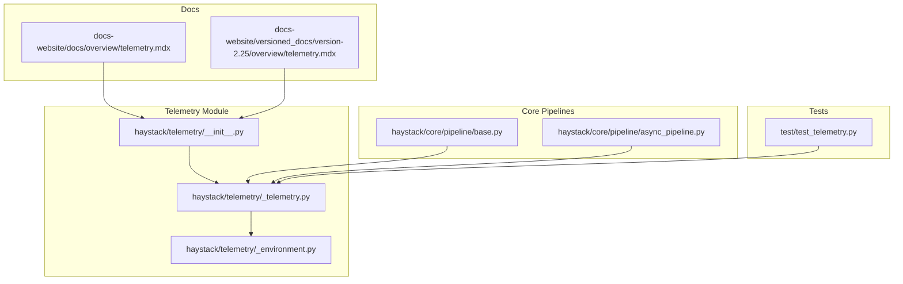
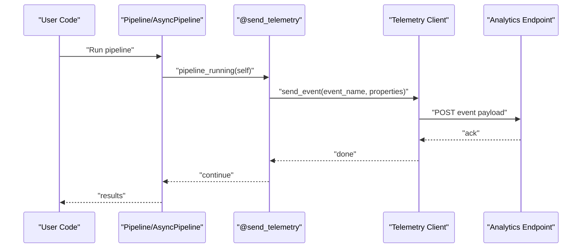
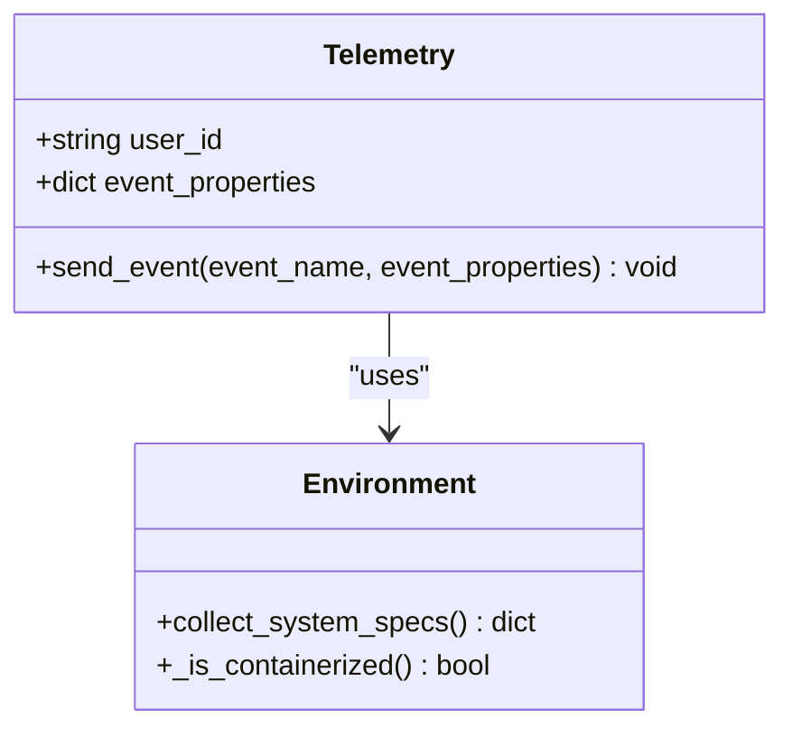
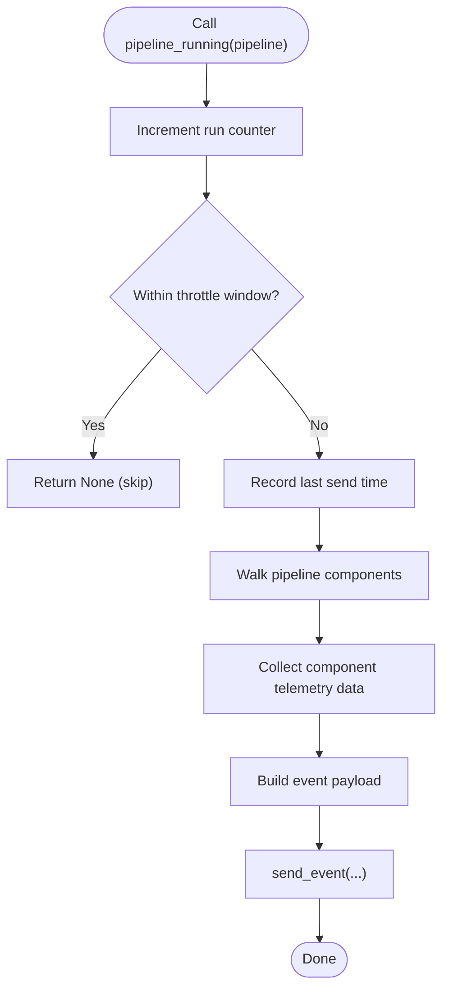
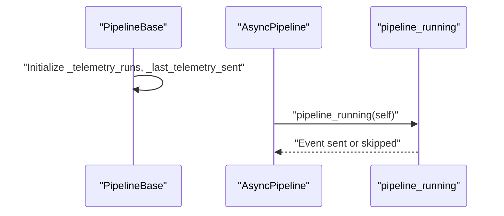
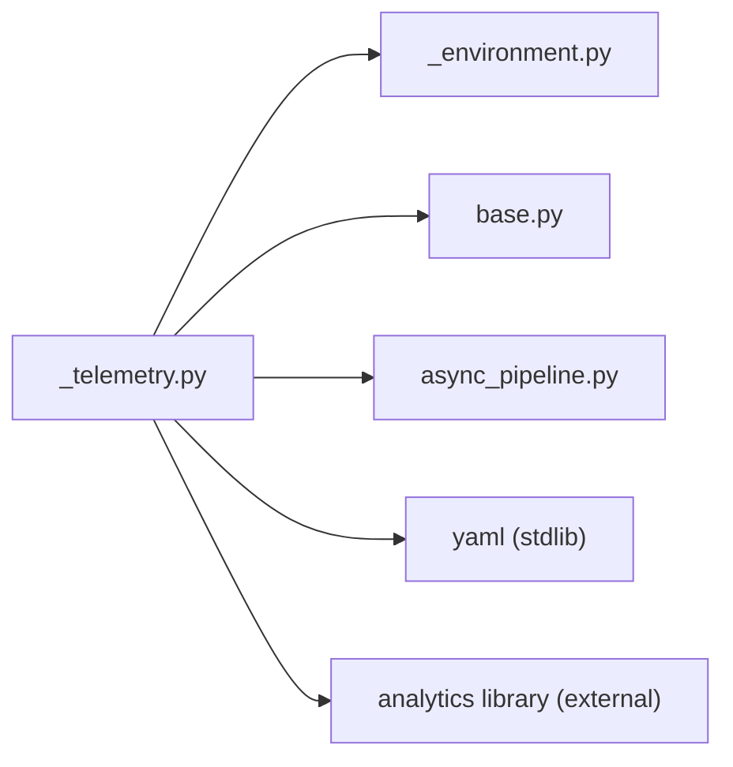

# Telemetry

<cite>
**Referenced Files in This Document**
- [__init__.py](file://haystack/telemetry/__init__.py)
- [_telemetry.py](file://haystack/telemetry/_telemetry.py)
- [_environment.py](file://haystack/telemetry/_environment.py)
- [base.py](file://haystack/core/pipeline/base.py)
- [async_pipeline.py](file://haystack/core/pipeline/async_pipeline.py)
- [test_telemetry.py](file://test/test_telemetry.py)
- [telemetry.mdx](file://docs-website/docs/overview/telemetry.mdx)
- [telemetry.mdx (versioned)](file://docs-website/versioned_docs/version-2.25/overview/telemetry.mdx)
</cite>

## Table of Contents
1. [Introduction](#introduction)
2. [Project Structure](#project-structure)
3. [Core Components](#core-components)
4. [Architecture Overview](#architecture-overview)
5. [Detailed Component Analysis](#detailed-component-analysis)
6. [Dependency Analysis](#dependency-analysis)
7. [Performance Considerations](#performance-considerations)
8. [Troubleshooting Guide](#troubleshooting-guide)
9. [Conclusion](#conclusion)
10. [Appendices](#appendices)

## Introduction
This document explains Haystack’s telemetry system: what data is collected, how it is transmitted, and how privacy is protected. It documents the telemetry API surface, including pipeline_running and tutorial_running, and describes environment variable configuration, data collection preferences, and privacy controls. It also covers performance characteristics, troubleshooting, and compliance considerations.

## Project Structure
The telemetry system is implemented in a small, focused module with two public APIs exposed via the telemetry package init. Supporting infrastructure includes environment detection and pipeline integration points.

**Diagram sources**
- [__init__.py](file://haystack/telemetry/__init__.py#L1-L8)
- [_telemetry.py](file://haystack/telemetry/_telemetry.py#L1-L192)
- [_environment.py](file://haystack/telemetry/_environment.py#L1-L99)
- [base.py](file://haystack/core/pipeline/base.py#L100-L113)
- [async_pipeline.py](file://haystack/core/pipeline/async_pipeline.py#L190-L201)
- [test_telemetry.py](file://test/test_telemetry.py#L1-L117)
- [telemetry.mdx](file://docs-website/docs/overview/telemetry.mdx#L1-L77)
- [telemetry.mdx (versioned)](file://docs-website/versioned_docs/version-2.25/overview/telemetry.mdx#L1-L77)

**Section sources**
- [__init__.py](file://haystack/telemetry/__init__.py#L1-L8)
- [_telemetry.py](file://haystack/telemetry/_telemetry.py#L1-L192)
- [_environment.py](file://haystack/telemetry/_environment.py#L1-L99)
- [base.py](file://haystack/core/pipeline/base.py#L100-L113)
- [async_pipeline.py](file://haystack/core/pipeline/async_pipeline.py#L190-L201)
- [test_telemetry.py](file://test/test_telemetry.py#L1-L117)
- [telemetry.mdx](file://docs-website/docs/overview/telemetry.mdx#L1-L77)
- [telemetry.mdx (versioned)](file://docs-website/versioned_docs/version-2.25/overview/telemetry.mdx#L1-L77)

## Core Components
- Telemetry client: initializes, persists a per-user anonymous identifier, collects environment metadata, and sends events to the configured analytics backend.
- Decorator and API: a decorator ensures telemetry calls are safe and non-intrusive, and two public functions expose telemetry capabilities:
  - pipeline_running: records pipeline runs and component-level telemetry data.
  - tutorial_running: records tutorial execution events.

Key behaviors:
- Anonymous user identification via a per-user UUID stored in a YAML config file under the user’s home directory.
- Environment metadata collected once per process (e.g., OS, Python version, containerization detection).
- Event throttling to avoid frequent transmissions.
- Optional opt-out via environment variable.

**Section sources**
- [_telemetry.py](file://haystack/telemetry/_telemetry.py#L24-L98)
- [_telemetry.py](file://haystack/telemetry/_telemetry.py#L99-L114)
- [_telemetry.py](file://haystack/telemetry/_telemetry.py#L116-L134)
- [_telemetry.py](file://haystack/telemetry/_telemetry.py#L137-L186)
- [__init__.py](file://haystack/telemetry/__init__.py#L7-L8)

## Architecture Overview
High-level telemetry flow:
- On import, the telemetry client is conditionally instantiated based on an environment variable.
- Pipeline run hooks trigger pipeline_running, which computes and throttles telemetry payloads.
- Component classes may contribute telemetry data via a standardized method.
- Events are sent asynchronously to the configured analytics endpoint.

**Diagram sources**
- [async_pipeline.py](file://haystack/core/pipeline/async_pipeline.py#L190-L201)
- [_telemetry.py](file://haystack/telemetry/_telemetry.py#L116-L134)
- [_telemetry.py](file://haystack/telemetry/_telemetry.py#L99-L114)

## Detailed Component Analysis

### Telemetry Client and Environment Collection
- Initialization:
  - Reads/writes a YAML config file containing a per-user UUID.
  - Disables noisy logs from the analytics library.
  - Collects environment metadata once per process.
- Event sending:
  - Merges environment metadata with event-specific properties.
  - Sends events to the configured analytics host.
- Environment metadata:
  - Includes OS family, machine, release, Python version, CPU count, and containerization detection.
  - Versions of optional libraries are recorded when available.

**Diagram sources**
- [_telemetry.py](file://haystack/telemetry/_telemetry.py#L45-L98)
- [_telemetry.py](file://haystack/telemetry/_telemetry.py#L99-L114)
- [_environment.py](file://haystack/telemetry/_environment.py#L71-L99)

**Section sources**
- [_telemetry.py](file://haystack/telemetry/_telemetry.py#L45-L98)
- [_telemetry.py](file://haystack/telemetry/_telemetry.py#L99-L114)
- [_environment.py](file://haystack/telemetry/_environment.py#L71-L99)

### Telemetry Decorator and Public API
- Decorator:
  - Wraps functions to send telemetry only when enabled.
  - Ensures failures do not interrupt normal execution.
- Public functions:
  - pipeline_running: increments run counters, throttles events, aggregates component telemetry data, and returns a structured payload.
  - tutorial_running: emits a tutorial execution event with a tutorial identifier.

**Diagram sources**
- [_telemetry.py](file://haystack/telemetry/_telemetry.py#L137-L186)
- [_telemetry.py](file://haystack/telemetry/_telemetry.py#L116-L134)

**Section sources**
- [_telemetry.py](file://haystack/telemetry/_telemetry.py#L116-L134)
- [_telemetry.py](file://haystack/telemetry/_telemetry.py#L137-L186)
- [test_telemetry.py](file://test/test_telemetry.py#L17-L66)

### Pipeline Integration Points
- Base pipeline stores telemetry counters and timestamps.
- Async pipeline triggers telemetry at the start of run.

**Diagram sources**
- [base.py](file://haystack/core/pipeline/base.py#L100-L113)
- [async_pipeline.py](file://haystack/core/pipeline/async_pipeline.py#L190-L201)
- [_telemetry.py](file://haystack/telemetry/_telemetry.py#L137-L186)

**Section sources**
- [base.py](file://haystack/core/pipeline/base.py#L100-L113)
- [async_pipeline.py](file://haystack/core/pipeline/async_pipeline.py#L190-L201)
- [_telemetry.py](file://haystack/telemetry/_telemetry.py#L137-L186)

## Dependency Analysis
- External dependencies:
  - Analytics library for event capture.
  - YAML for persistent configuration storage.
- Internal dependencies:
  - Environment collector for metadata.
  - Pipeline base classes for telemetry counters and throttling.

**Diagram sources**
- [_telemetry.py](file://haystack/telemetry/_telemetry.py#L1-L20)
- [_environment.py](file://haystack/telemetry/_environment.py#L1-L14)
- [base.py](file://haystack/core/pipeline/base.py#L100-L113)
- [async_pipeline.py](file://haystack/core/pipeline/async_pipeline.py#L190-L201)

**Section sources**
- [_telemetry.py](file://haystack/telemetry/_telemetry.py#L1-L20)
- [_environment.py](file://haystack/telemetry/_environment.py#L1-L14)
- [base.py](file://haystack/core/pipeline/base.py#L100-L113)
- [async_pipeline.py](file://haystack/core/pipeline/async_pipeline.py#L190-L201)

## Performance Considerations
- Event throttling: telemetry events are limited to a minimum interval to reduce network overhead.
- Lightweight operations: environment metadata is collected once per process; event sending is a single HTTP call per eligible event.
- Non-blocking: telemetry exceptions are caught and logged at debug level to avoid impacting pipeline execution.

[No sources needed since this section provides general guidance]

## Troubleshooting Guide
Common issues and resolutions:
- Telemetry not sending:
  - Verify the environment variable is set to disable telemetry; by default telemetry is enabled.
  - Check that the analytics library can reach the configured endpoint.
- Config file issues:
  - If the YAML config file cannot be written or read, telemetry logs a debug message and continues without persistent user ID.
- Component telemetry data errors:
  - If a component returns non-dictionary telemetry data, a type error is logged at debug level.
- Testing:
  - Unit tests demonstrate expected behavior for pipeline telemetry, including throttling and payload construction.

Practical checks:
- Confirm environment variable configuration for opting out.
- Review logs for debug messages related to telemetry initialization and event sending.

**Section sources**
- [_telemetry.py](file://haystack/telemetry/_telemetry.py#L78-L95)
- [_telemetry.py](file://haystack/telemetry/_telemetry.py#L112-L114)
- [test_telemetry.py](file://test/test_telemetry.py#L98-L117)
- [telemetry.mdx](file://docs-website/docs/overview/telemetry.mdx#L54-L77)

## Conclusion
Haystack’s telemetry system is designed to be unobtrusive, privacy-focused, and configurable. It collects anonymized environment and usage metadata, throttles transmissions, and can be easily disabled. The documented APIs and environment controls allow users to tailor telemetry behavior to their needs while maintaining compliance and minimizing performance impact.

[No sources needed since this section summarizes without analyzing specific files]

## Appendices

### Environment Variables and Configuration
- HAYSTACK_TELEMETRY_ENABLED:
  - Controls whether telemetry is enabled.
  - Default behavior is enabled when the variable is not set or evaluates to true.
  - To disable, set the variable to a false-like value.

**Section sources**
- [_telemetry.py](file://haystack/telemetry/_telemetry.py#L189-L192)
- [telemetry.mdx](file://docs-website/docs/overview/telemetry.mdx#L54-L77)

### What Data Is Collected and How It Is Transmitted
- Collected data:
  - Anonymous user identifier (UUID).
  - Environment metadata (OS, Python version, CPU count, containerization).
  - Pipeline run metadata (pipeline type, run count, component telemetry data).
- Transmission:
  - Events are sent to the configured analytics endpoint.
  - Logging is intentionally minimized to avoid noise.

**Section sources**
- [_telemetry.py](file://haystack/telemetry/_telemetry.py#L97-L114)
- [_environment.py](file://haystack/telemetry/_environment.py#L71-L99)
- [telemetry.mdx](file://docs-website/docs/overview/telemetry.mdx#L12-L24)

### Privacy and Security Considerations
- Anonymization:
  - No personally identifiable information is included in telemetry payloads.
  - Examples of excluded data: IP addresses, hostnames, file paths, queries, document contents.
- Controls:
  - Users can opt out via environment variable.
  - Telemetry exceptions are suppressed to avoid leaking internal errors.

**Section sources**
- [telemetry.mdx](file://docs-website/docs/overview/telemetry.mdx#L12-L24)
- [telemetry.mdx](file://docs-website/docs/overview/telemetry.mdx#L54-L77)
- [_telemetry.py](file://haystack/telemetry/_telemetry.py#L112-L114)

### Practical Examples
- Enabling telemetry:
  - Leave HAYSTACK_TELEMETRY_ENABLED unset or set to a true-like value.
- Disabling telemetry:
  - Set HAYSTACK_TELEMETRY_ENABLED to a false-like value.
- Integrating with external analytics platforms:
  - The telemetry client currently targets a specific analytics provider. There is no built-in mechanism to redirect telemetry to alternate providers. For advanced scenarios, consider implementing a custom wrapper or proxy outside the scope of the existing telemetry module.

**Section sources**
- [_telemetry.py](file://haystack/telemetry/_telemetry.py#L189-L192)
- [telemetry.mdx](file://docs-website/docs/overview/telemetry.mdx#L54-L77)