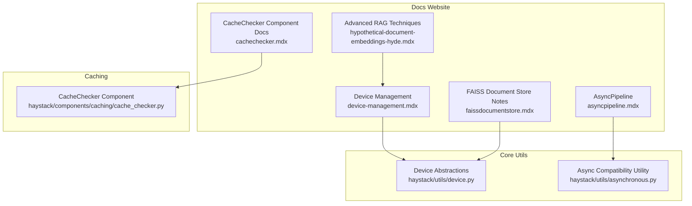
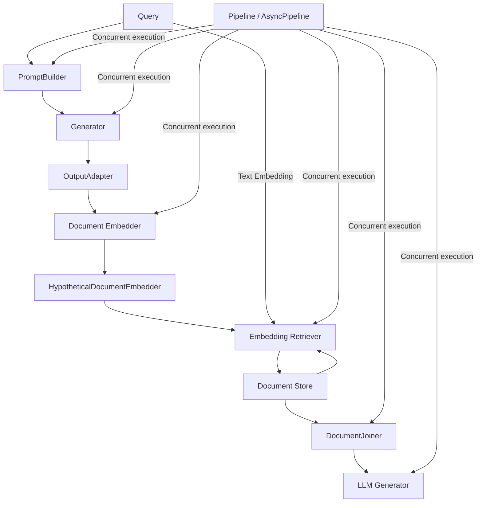
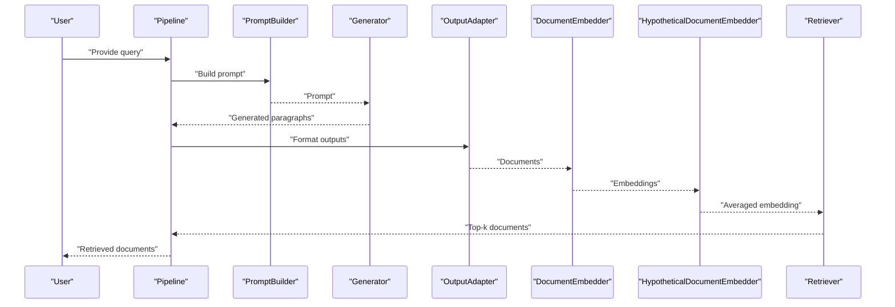
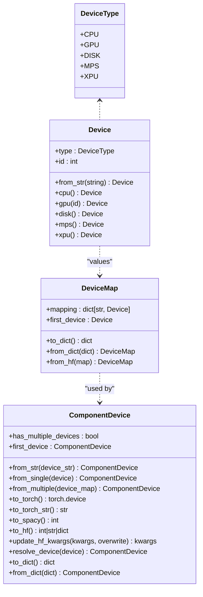
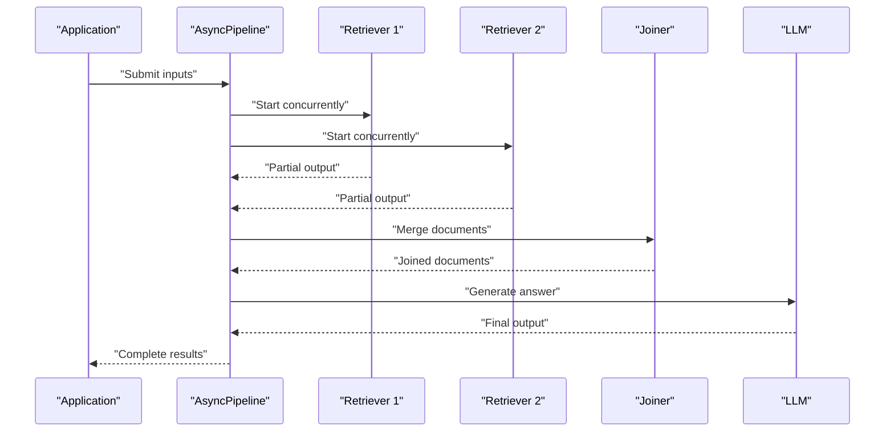
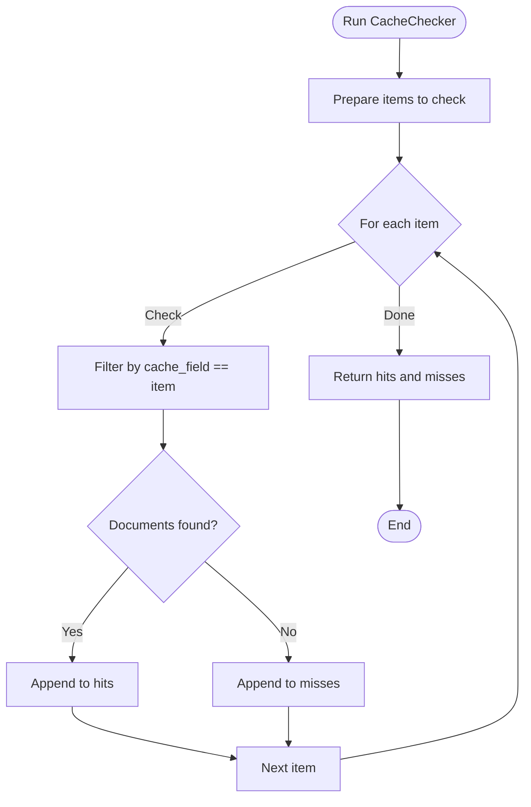
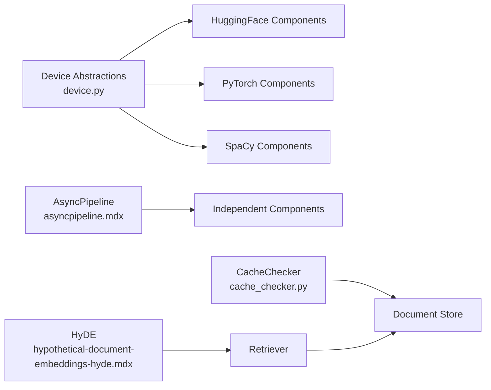

# Performance Optimization

<cite>
**Referenced Files in This Document**
- [advanced-rag-techniques.mdx](file://docs-website/docs/optimization/advanced-rag-techniques.mdx)
- [hypothetical-document-embeddings-hyde.mdx](file://docs-website/docs/optimization/advanced-rag-techniques/hypothetical-document-embeddings-hyde.mdx)
- [device-management.mdx](file://docs-website/docs/concepts/device-management.mdx)
- [asyncpipeline.mdx](file://docs-website/docs/concepts/pipelines/asyncpipeline.mdx)
- [device.py](file://haystack/utils/device.py)
- [asynchronous.py](file://haystack/utils/asynchronous.py)
- [cache_checker.py](file://haystack/components/caching/cache_checker.py)
- [cachechecker.mdx](file://docs-website/docs/pipeline-components/caching/cachechecker.mdx)
- [faissdocumentstore.mdx](file://docs-website/docs/document-stores/faissdocumentstore.mdx)
- [test_device.py](file://test/utils/test_device.py)
</cite>

## Table of Contents
1. [Introduction](#introduction)
2. [Project Structure](#project-structure)
3. [Core Components](#core-components)
4. [Architecture Overview](#architecture-overview)
5. [Detailed Component Analysis](#detailed-component-analysis)
6. [Dependency Analysis](#dependency-analysis)
7. [Performance Considerations](#performance-considerations)
8. [Troubleshooting Guide](#troubleshooting-guide)
9. [Conclusion](#conclusion)
10. [Appendices](#appendices)

## Introduction
This document consolidates Haystack performance optimization techniques with a focus on advanced Retrieval-Augmented Generation (RAG) strategies, resource management, and scaling approaches. It explains how to leverage Hypothetical Document Embeddings (HyDE) to improve retrieval quality, configure GPU acceleration and device management for optimal performance, adopt asynchronous execution patterns for concurrency, optimize memory usage for large-scale deployments, implement caching strategies at component and result levels, and apply practical tuning and profiling techniques to identify bottlenecks and implement targeted optimizations.

## Project Structure
The repository organizes performance-related content across:
- Documentation website sections for advanced RAG techniques, device management, and asynchronous pipelines
- Core utilities for device abstraction and asynchronous compatibility checks
- Caching components for result-level caching
- Document store guides for memory and threading considerations

**Diagram sources**
- [hypothetical-document-embeddings-hyde.mdx](file://docs-website/docs/optimization/advanced-rag-techniques/hypothetical-document-embeddings-hyde.mdx#L1-L111)
- [device-management.mdx](file://docs-website/docs/concepts/device-management.mdx#L1-L128)
- [asyncpipeline.mdx](file://docs-website/docs/concepts/pipelines/asyncpipeline.mdx#L1-L159)
- [device.py](file://haystack/utils/device.py#L1-L544)
- [asynchronous.py](file://haystack/utils/asynchronous.py#L1-L19)
- [cache_checker.py](file://haystack/components/caching/cache_checker.py#L1-L97)
- [cachechecker.mdx](file://docs-website/docs/pipeline-components/caching/cachechecker.mdx)
- [faissdocumentstore.mdx](file://docs-website/docs/document-stores/faissdocumentstore.mdx)

**Section sources**
- [advanced-rag-techniques.mdx](file://docs-website/docs/optimization/advanced-rag-techniques.mdx#L1-L20)
- [device-management.mdx](file://docs-website/docs/concepts/device-management.mdx#L1-L128)
- [asyncpipeline.mdx](file://docs-website/docs/concepts/pipelines/asyncpipeline.mdx#L1-L159)
- [device.py](file://haystack/utils/device.py#L1-L544)
- [asynchronous.py](file://haystack/utils/asynchronous.py#L1-L19)
- [cache_checker.py](file://haystack/components/caching/cache_checker.py#L1-L97)
- [cachechecker.mdx](file://docs-website/docs/pipeline-components/caching/cachechecker.mdx)
- [faissdocumentstore.mdx](file://docs-website/docs/document-stores/faissdocumentstore.mdx)

## Core Components
- Advanced RAG technique: Hypothetical Document Embeddings (HyDE) improves retrieval quality by generating synthetic documents from queries and averaging their embeddings before similarity search.
- Device management: A framework-agnostic abstraction for CPU/GPU/MPS/XPU/Disk devices, supporting single-device and multi-device mappings with automatic resolution and serialization.
- Asynchronous pipelines: Concurrent execution of independent components with synchronous, asynchronous, and incremental asynchronous generator modes, plus concurrency limits.
- Caching: CacheChecker component to detect cached documents by metadata field and separate hits from misses for downstream reuse.

**Section sources**
- [hypothetical-document-embeddings-hyde.mdx](file://docs-website/docs/optimization/advanced-rag-techniques/hypothetical-document-embeddings-hyde.mdx#L22-L104)
- [device-management.mdx](file://docs-website/docs/concepts/device-management.mdx#L16-L128)
- [asyncpipeline.mdx](file://docs-website/docs/concepts/pipelines/asyncpipeline.mdx#L21-L49)
- [cache_checker.py](file://haystack/components/caching/cache_checker.py#L11-L97)

## Architecture Overview
The performance architecture integrates advanced RAG techniques, device-aware components, asynchronous pipelines, and caching to minimize latency and maximize throughput.

**Diagram sources**
- [hypothetical-document-embeddings-hyde.mdx](file://docs-website/docs/optimization/advanced-rag-techniques/hypothetical-document-embeddings-hyde.mdx#L77-L104)
- [asyncpipeline.mdx](file://docs-website/docs/concepts/pipelines/asyncpipeline.mdx#L105-L159)

## Detailed Component Analysis

### Hypothetical Document Embeddings (HyDE)
HyDE enhances retrieval by generating synthetic documents from queries, encoding them into embeddings, averaging the vectors, and using the averaged embedding to retrieve semantically similar real documents.

**Diagram sources**
- [hypothetical-document-embeddings-hyde.mdx](file://docs-website/docs/optimization/advanced-rag-techniques/hypothetical-document-embeddings-hyde.mdx#L77-L104)

Practical guidance:
- Use HyDE when retrieval recall is low or domain-specific.
- Generate multiple synthetic documents per query and average embeddings to stabilize retrieval.
- Pair HyDE embeddings with dense embedding retrievers and a robust Document Store.

**Section sources**
- [hypothetical-document-embeddings-hyde.mdx](file://docs-website/docs/optimization/advanced-rag-techniques/hypothetical-document-embeddings-hyde.mdx#L14-L104)

### Device Management and GPU Acceleration
Device management abstracts device selection and mapping across frameworks, enabling GPU acceleration and multi-device placement for local models.

**Diagram sources**
- [device.py](file://haystack/utils/device.py#L19-L544)

Key capabilities:
- Automatic default device selection with precedence: GPU > XPU > MPS > CPU.
- Single-device and multi-device mappings for framework-specific deployment.
- Serialization/deserialization of device configurations for reproducibility.
- Integration hooks for framework-specific device parameters.

**Section sources**
- [device-management.mdx](file://docs-website/docs/concepts/device-management.mdx#L16-L128)
- [device.py](file://haystack/utils/device.py#L486-L544)
- [test_device.py](file://test/utils/test_device.py)

### Asynchronous Pipelines and Concurrency
AsyncPipeline enables concurrent execution of independent components, reducing end-to-end latency in complex workflows.

Concurrency controls:
- Maximum concurrency limit to cap resource usage.
- Three execution modes: synchronous run, asynchronous run, and asynchronous generator for incremental outputs.

**Diagram sources**
- [asyncpipeline.mdx](file://docs-website/docs/concepts/pipelines/asyncpipeline.mdx#L29-L49)

**Section sources**
- [asyncpipeline.mdx](file://docs-website/docs/concepts/pipelines/asyncpipeline.mdx#L12-L159)
- [asynchronous.py](file://haystack/utils/asynchronous.py#L9-L19)

### Caching Strategies
CacheChecker performs result-level caching by checking document metadata fields against a cache and returning hits and misses.

**Diagram sources**
- [cache_checker.py](file://haystack/components/caching/cache_checker.py#L74-L97)

Best practices:
- Use cache_field aligned to immutable identifiers (e.g., URL) to avoid stale reads.
- Integrate CacheChecker upstream of expensive components (e.g., embedders, retrievers) to skip redundant work.
- Combine with document store indexing and filtering for fast lookups.

**Section sources**
- [cache_checker.py](file://haystack/components/caching/cache_checker.py#L11-L97)
- [cachechecker.mdx](file://docs-website/docs/pipeline-components/caching/cachechecker.mdx)

## Dependency Analysis
Device management underpins component-level acceleration, while asynchronous pipelines orchestrate concurrency among independent components. Caching reduces repeated computation and I/O.

**Diagram sources**
- [device.py](file://haystack/utils/device.py#L310-L407)
- [asyncpipeline.mdx](file://docs-website/docs/concepts/pipelines/asyncpipeline.mdx#L23-L49)
- [cache_checker.py](file://haystack/components/caching/cache_checker.py#L74-L97)
- [hypothetical-document-embeddings-hyde.mdx](file://docs-website/docs/optimization/advanced-rag-techniques/hypothetical-document-embeddings-hyde.mdx#L22-L104)

**Section sources**
- [device.py](file://haystack/utils/device.py#L310-L407)
- [asyncpipeline.mdx](file://docs-website/docs/concepts/pipelines/asyncpipeline.mdx#L23-L49)
- [cache_checker.py](file://haystack/components/caching/cache_checker.py#L74-L97)
- [hypothetical-document-embeddings-hyde.mdx](file://docs-website/docs/optimization/advanced-rag-techniques/hypothetical-document-embeddings-hyde.mdx#L22-L104)

## Performance Considerations
- Advanced RAG
  - HyDE improves retrieval quality for out-of-domain queries by generating synthetic documents and averaging embeddings before similarity search.
  - Pair HyDE embeddings with dense embedding retrievers and a scalable Document Store.

- GPU Acceleration and Device Management
  - Prefer GPU as default device when available; fallback to MPS/XPU/CPU as appropriate.
  - Use multi-device mappings for models that support offload/partitioning to utilize multiple accelerators efficiently.
  - Serialize device configurations to ensure reproducible deployments.

- Asynchronous Execution
  - Enable concurrent execution for independent branches (e.g., multiple retrievers) to reduce latency.
  - Use asynchronous generator mode for progress monitoring and incremental outputs.
  - Apply concurrency limits to prevent resource contention.

- Memory Optimization
  - Reduce OpenMP runtime conflicts on macOS by setting OMP_NUM_THREADS appropriately when encountering multiple runtime errors.
  - Offload model weights to disk via device maps for frameworks that support it.
  - Warm up components (embedders, generators) to avoid cold-start overhead during first use.

- Caching
  - CacheChecker helps avoid recomputation by detecting existing documents via metadata fields.
  - Place CacheChecker early in pipelines to short-circuit expensive steps.

- Scalability
  - Horizontal scaling: distribute pipelines across nodes behind load balancers.
  - Resource allocation: allocate GPU resources proportionally to workload concurrency and model sizes.
  - Load balancing: route queries to pipeline instances with available capacity and minimal queue depth.

- Profiling and Bottleneck Identification
  - Use tracing and telemetry to measure component-level latencies and throughput.
  - Profile I/O-bound vs compute-bound stages to decide between concurrency, caching, or acceleration strategies.
  - Monitor OpenMP-related crashes and adjust threading settings accordingly.

**Section sources**
- [hypothetical-document-embeddings-hyde.mdx](file://docs-website/docs/optimization/advanced-rag-techniques/hypothetical-document-embeddings-hyde.mdx#L14-L104)
- [device-management.mdx](file://docs-website/docs/concepts/device-management.mdx#L45-L128)
- [asyncpipeline.mdx](file://docs-website/docs/concepts/pipelines/asyncpipeline.mdx#L14-L49)
- [cache_checker.py](file://haystack/components/caching/cache_checker.py#L11-L97)
- [faissdocumentstore.mdx](file://docs-website/docs/document-stores/faissdocumentstore.mdx)

## Troubleshooting Guide
- OpenMP Runtime Conflicts on macOS
  - Symptoms: initialization errors and resource tracker warnings when multiple runtimes are loaded.
  - Resolution: set OMP_NUM_THREADS to mitigate simultaneous thread pools and avoid corruption.
- Device Selection Issues
  - Ensure device availability and correct device strings; verify default device resolution order.
  - Validate device map serialization/deserialization for reproducibility.
- Asynchronous Compatibility
  - Confirm that component run_async methods accept coroutine-compatible callables.

**Section sources**
- [faissdocumentstore.mdx](file://docs-website/docs/document-stores/faissdocumentstore.mdx)
- [device-management.mdx](file://docs-website/docs/concepts/device-management.mdx#L32-L128)
- [asynchronous.py](file://haystack/utils/asynchronous.py#L9-L19)

## Conclusion
By combining HyDE for improved retrieval, robust device management for GPU acceleration, asynchronous pipelines for concurrency, and strategic caching, Haystack deployments can achieve significant performance gains. Proper profiling, careful resource allocation, and attention to platform-specific pitfalls (e.g., OpenMP) further enhance reliability and scalability.

## Appendices
- Practical examples and cookbook links for HyDE and other advanced RAG techniques are available in the documentation website entries referenced above.