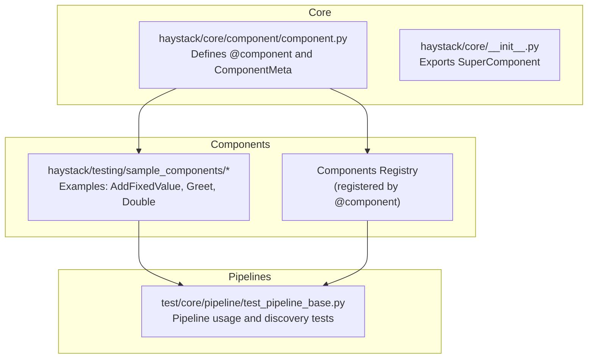
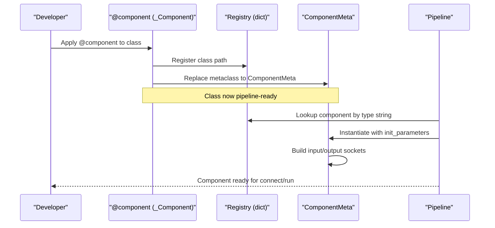
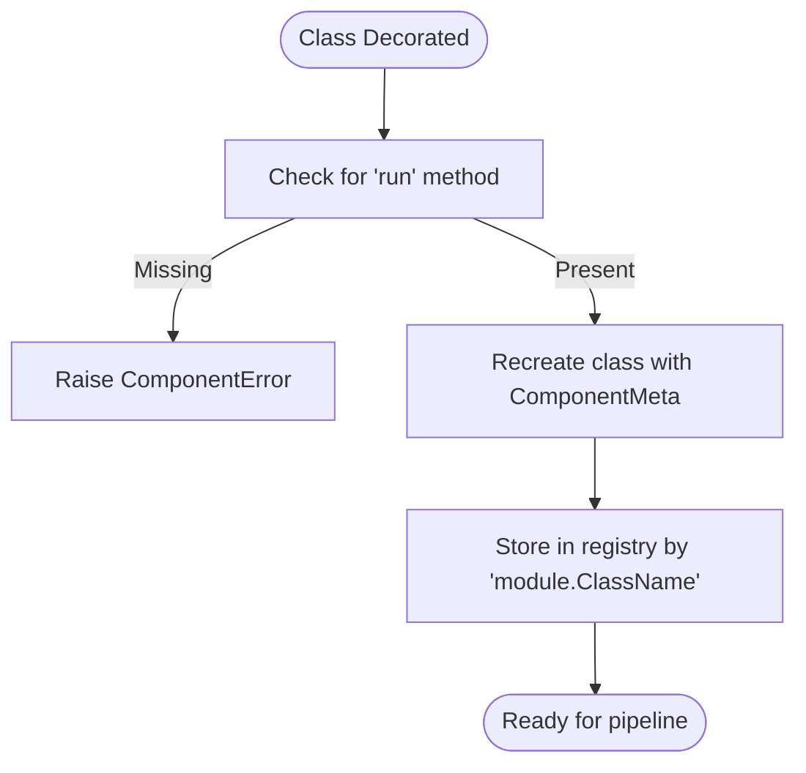
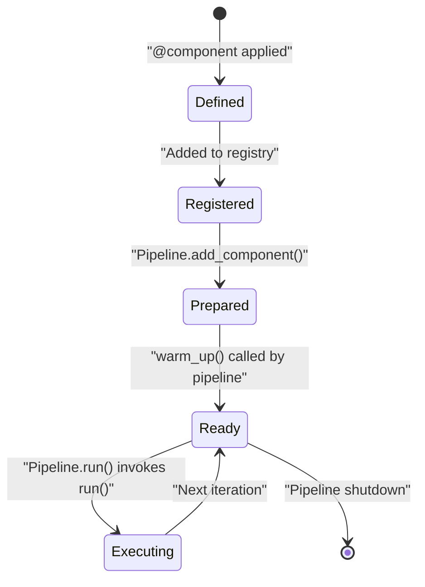
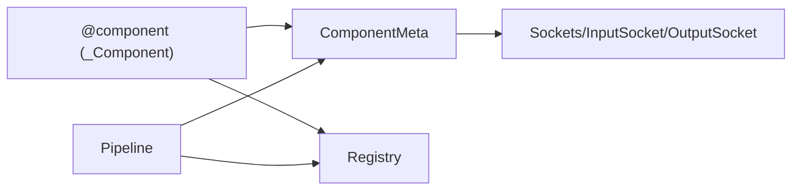

# Component Decorator

<cite>
**Referenced Files in This Document**
- [component.py](file://haystack/core/component/component.py)
- [__init__.py](file://haystack/core/__init__.py)
- [__init__.py](file://haystack/components/__init__.py)
- [add_value.py](file://haystack/testing/sample_components/add_value.py)
- [greet.py](file://haystack/testing/sample_components/greet.py)
- [double.py](file://haystack/testing/sample_components/double.py)
- [test_pipeline_base.py](file://test/core/pipeline/test_pipeline_base.py)
</cite>

## Table of Contents
1. [Introduction](#introduction)
2. [Project Structure](#project-structure)
3. [Core Components](#core-components)
4. [Architecture Overview](#architecture-overview)
5. [Detailed Component Analysis](#detailed-component-analysis)
6. [Dependency Analysis](#dependency-analysis)
7. [Performance Considerations](#performance-considerations)
8. [Troubleshooting Guide](#troubleshooting-guide)
9. [Conclusion](#conclusion)
10. [Appendices](#appendices)

## Introduction
This document explains the @component decorator system in Haystack and how to build pipeline-ready components. It covers the decorator contract, required and optional methods, initialization and lifecycle, registration and discovery, and best practices. Practical examples are drawn from the repository’s sample components and tests to illustrate correct usage patterns.

## Project Structure
The @component decorator lives in the core component module and powers pipeline-ready components across the library. Sample components demonstrate real-world usage, and tests show how pipelines consume components and how the registry enables discovery.

**Diagram sources**
- [component.py](file://haystack/core/component/component.py#L406-L644)
- [__init__.py](file://haystack/core/__init__.py#L5-L8)
- [add_value.py](file://haystack/testing/sample_components/add_value.py#L8-L25)
- [greet.py](file://haystack/testing/sample_components/greet.py#L13-L47)
- [double.py](file://haystack/testing/sample_components/double.py#L8-L20)
- [test_pipeline_base.py](file://test/core/pipeline/test_pipeline_base.py#L412-L473)

**Section sources**
- [component.py](file://haystack/core/component/component.py#L1-L645)
- [__init__.py](file://haystack/core/__init__.py#L5-L8)
- [__init__.py](file://haystack/components/__init__.py)

## Core Components
- @component decorator: Validates component contract, registers classes in a global registry, and injects runtime metadata (input/output sockets, async support, repr).
- ComponentMeta metaclass: Enforces method signatures, ensures async consistency, and prepares I/O sockets at instance creation time.
- Component protocol: A type-level marker for components (primarily for type checkers).

Key responsibilities:
- Contract enforcement: Presence of run, optional __init__ and warm_up, and consistent run/run_async signatures.
- Registry: Stores class paths for deserialization and discovery.
- I/O sockets: Automatically derives input/output sockets from run signature and optional decorators.

**Section sources**
- [component.py](file://haystack/core/component/component.py#L137-L185)
- [component.py](file://haystack/core/component/component.py#L187-L331)
- [component.py](file://haystack/core/component/component.py#L406-L644)

## Architecture Overview
The decorator system integrates with the pipeline at two levels:
- Component definition time: @component validates and registers.
- Pipeline consumption time: Components are discovered by class path and instantiated with init parameters.

**Diagram sources**
- [component.py](file://haystack/core/component/component.py#L572-L620)
- [component.py](file://haystack/core/component/component.py#L294-L330)
- [test_pipeline_base.py](file://test/core/pipeline/test_pipeline_base.py#L412-L473)

## Detailed Component Analysis

### Decorator Contract and Required Methods
- run(self, data): Mandatory. Performs the component’s work and returns a mapping conforming to declared outputs.
- __init__(self, **kwargs): Optional. Keep lightweight; avoid heavy initialization here. Use warm_up for heavy state.
- warm_up(self): Optional. Called by the pipeline before execution to prepare resources.

Additional constraints enforced by the decorator and metaclass:
- If run_async exists, it must be a coroutine and match run signature and defaults.
- If run has a **kwargs parameter, input types can be set dynamically; otherwise, run signature determines inputs.
- Output types must be declared either via @component.output_types on run/run_async or via set_output_types.

**Section sources**
- [component.py](file://haystack/core/component/component.py#L10-L74)
- [component.py](file://haystack/core/component/component.py#L352-L401)
- [component.py](file://haystack/core/component/component.py#L423-L533)

### Component Registration and Discovery
- Registration: The decorator records the class under its fully qualified path (module.ClassName) in an internal registry.
- Discovery: Pipelines deserialize components by reading the type string from configuration and resolving it via the registry.

**Diagram sources**
- [component.py](file://haystack/core/component/component.py#L572-L620)

**Section sources**
- [component.py](file://haystack/core/component/component.py#L572-L620)
- [test_pipeline_base.py](file://test/core/pipeline/test_pipeline_base.py#L412-L473)

### Component Lifecycle: From Instantiation to Pipeline Integration
- Definition: Apply @component and optionally @component.output_types.
- Registration: Class becomes discoverable via registry.
- Pipeline.add_component: Instance is validated and prepared (sockets built).
- Pipeline.run: warm_up is invoked per pipeline’s pre-execution logic; run executes with validated inputs.

**Diagram sources**
- [component.py](file://haystack/core/component/component.py#L294-L330)
- [test_pipeline_base.py](file://test/core/pipeline/test_pipeline_base.py#L756-L812)

**Section sources**
- [component.py](file://haystack/core/component/component.py#L294-L330)
- [test_pipeline_base.py](file://test/core/pipeline/test_pipeline_base.py#L756-L812)

### Practical Examples

#### Basic Component Decoration
- Example classes:
  - AddFixedValue: Demonstrates __init__ with a parameter and a typed run with @component.output_types.
  - Greet: Demonstrates __init__ with parameters and run that logs and passes through a value.
  - Double: Minimal component with a single input and output.

References:
- [add_value.py](file://haystack/testing/sample_components/add_value.py#L8-L25)
- [greet.py](file://haystack/testing/sample_components/greet.py#L13-L47)
- [double.py](file://haystack/testing/sample_components/double.py#L8-L20)

**Section sources**
- [add_value.py](file://haystack/testing/sample_components/add_value.py#L8-L25)
- [greet.py](file://haystack/testing/sample_components/greet.py#L13-L47)
- [double.py](file://haystack/testing/sample_components/double.py#L8-L20)

#### Parameter Handling in __init__
- Keep __init__ lightweight; store only JSON-serializable init_parameters.
- If you need complex objects, accept importable strings and convert in __init__; persist strings for serialization.

References:
- [component.py](file://haystack/core/component/component.py#L24-L41)

**Section sources**
- [component.py](file://haystack/core/component/component.py#L24-L41)

#### Proper Method Signatures
- run(self, ...): Must return a mapping whose keys match declared outputs.
- run_async(self, ...) (optional): Must mirror run signature and be a coroutine.

References:
- [component.py](file://haystack/core/component/component.py#L352-L401)

**Section sources**
- [component.py](file://haystack/core/component/component.py#L352-L401)

### Component Registry and Discovery
- Registry stores module.ClassName -> class mapping.
- Pipelines deserialize components from configuration by type string and resolve via registry.

References:
- [component.py](file://haystack/core/component/component.py#L599-L611)
- [test_pipeline_base.py](file://test/core/pipeline/test_pipeline_base.py#L412-L473)

**Section sources**
- [component.py](file://haystack/core/component/component.py#L599-L611)
- [test_pipeline_base.py](file://test/core/pipeline/test_pipeline_base.py#L412-L473)

### Difference Between @component and @component()
- Both forms are supported. The decorator normalizes both cases internally.
- Use @component when you do not need to pass arguments to the decorator; use @component() when you intend to pass arguments (though the current decorator does not require arguments).

References:
- [component.py](file://haystack/core/component/component.py#L622-L641)

**Section sources**
- [component.py](file://haystack/core/component/component.py#L622-L641)

## Dependency Analysis
The @component decorator depends on:
- ComponentMeta metaclass for instance-time validation and socket building.
- Sockets and types for input/output definitions.
- Registry for component discovery.

**Diagram sources**
- [component.py](file://haystack/core/component/component.py#L406-L644)
- [component.py](file://haystack/core/component/component.py#L187-L331)

**Section sources**
- [component.py](file://haystack/core/component/component.py#L406-L644)
- [component.py](file://haystack/core/component/component.py#L187-L331)

## Performance Considerations
- Keep __init__ minimal; defer heavy initialization to warm_up.
- Avoid expensive validations or model loading in __init__.
- Use warm_up for resource preparation; the pipeline orchestrates its invocation.

**Section sources**
- [component.py](file://haystack/core/component/component.py#L43-L45)

## Troubleshooting Guide
Common issues and resolutions:
- Missing run method: The decorator requires a run method; otherwise, a ComponentError is raised.
- Mismatched run/run_async signatures: If run_async exists, it must match run in parameter names, types, defaults, and kinds.
- Non-coroutine run_async: If run_async exists, it must be a coroutine; otherwise, a ComponentError is raised.
- Attempting to set input types on a component without **kwargs in run: Not allowed; the component must accept **kwargs or declare inputs via run signature.
- Attempting to set output types after using @component.output_types: Not allowed; choose one approach.
- Component not found during deserialization: Ensure the component class is imported and decorated before pipeline deserialization.

**Section sources**
- [component.py](file://haystack/core/component/component.py#L578-L581)
- [component.py](file://haystack/core/component/component.py#L277-L292)
- [component.py](file://haystack/core/component/component.py#L317-L320)
- [component.py](file://haystack/core/component/component.py#L440-L448)
- [component.py](file://haystack/core/component/component.py#L524-L532)
- [test_pipeline_base.py](file://test/core/pipeline/test_pipeline_base.py#L577-L586)

## Conclusion
The @component decorator is the foundation for building pipeline-ready components in Haystack. By adhering to the contract, using the registry for discovery, and following the lifecycle from definition to execution, you can create robust, maintainable components. Use the provided examples and tests as references for correct patterns.

## Appendices

### Best Practices for Component Naming
- Choose clear, descriptive names that reflect the component’s purpose.
- Avoid generic names; prefer domain-specific identifiers.
- Keep names concise yet meaningful for pipeline readability.

### Common Decorator Usage Patterns
- Minimal component: @component with run returning a mapping.
- Typed outputs: Use @component.output_types on run or run_async.
- Dynamic inputs: Use run with **kwargs and set_input_types in __init__.
- Async support: Provide run_async with matching signature and mark as coroutine.

[No sources needed since this section provides general guidance]