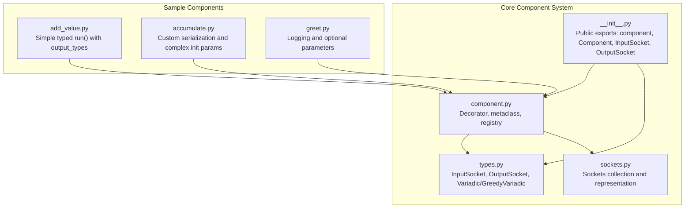
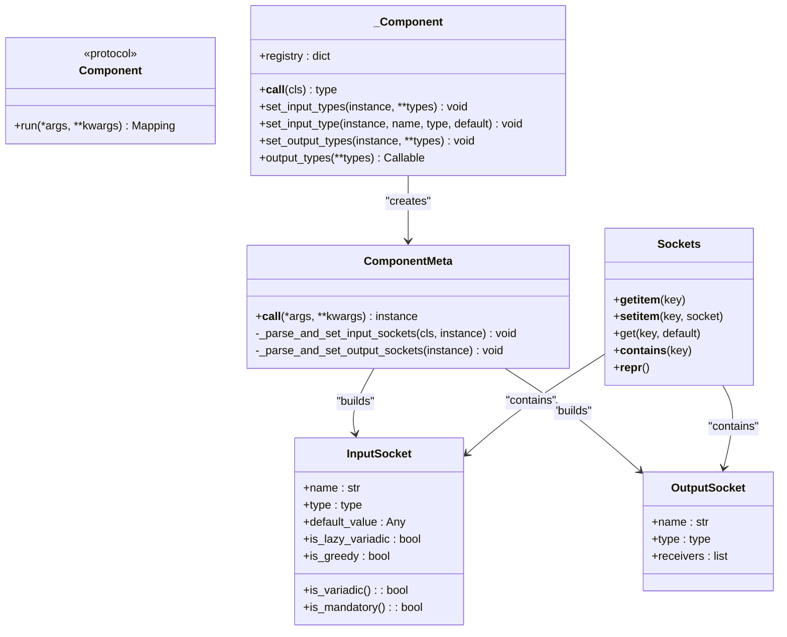
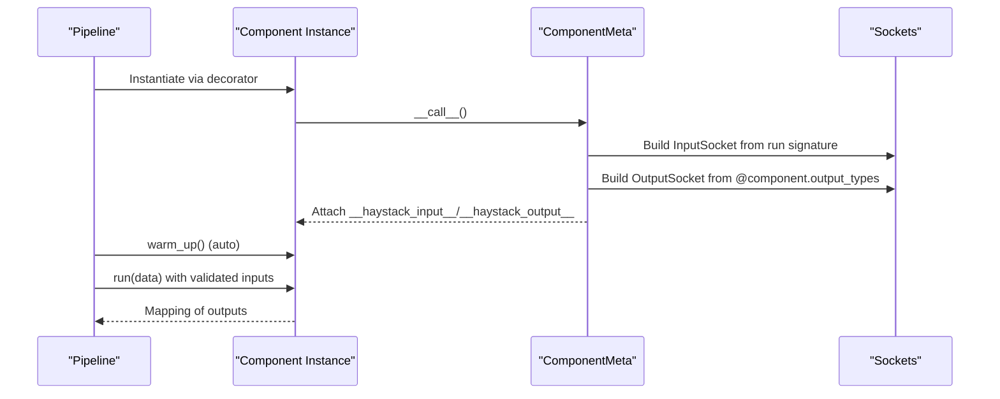
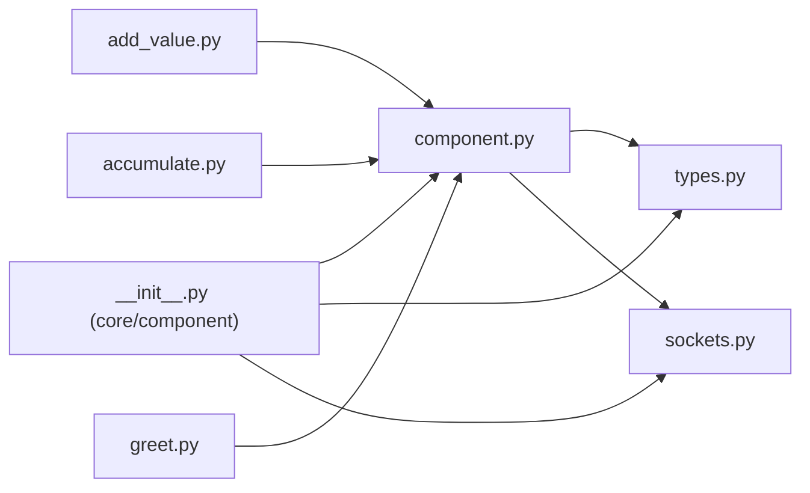

# Component Development

<cite>
**Referenced Files in This Document**
- [component.py](file://haystack/core/component/component.py)
- [types.py](file://haystack/core/component/types.py)
- [sockets.py](file://haystack/core/component/sockets.py)
- [__init__.py](file://haystack/core/component/__init__.py)
- [__init__.py](file://haystack/core/__init__.py)
- [add_value.py](file://haystack/testing/sample_components/add_value.py)
- [accumulate.py](file://haystack/testing/sample_components/accumulate.py)
- [greet.py](file://haystack/testing/sample_components/greet.py)
- [refactor-warm-up-components-c2777fef28a70b61.yaml](file://releasenotes/notes/refactor-warm-up-components-c2777fef28a70b61.yaml)
- [deprecate-greedy-argument-4b8c39572f5df25c.yaml](file://releasenotes/notes/deprecate-greedy-argument-4b8c39572f5df25c.yaml)
- [remove-deprecated-argument-from-component-decorator-9af6940bc60795d0.yaml](file://releasenotes/notes/remove-deprecated-argument-from-component-decorator-9af6940bc60795d0.yaml)
</cite>

## Table of Contents
1. [Introduction](#introduction)
2. [Project Structure](#project-structure)
3. [Core Components](#core-components)
4. [Architecture Overview](#architecture-overview)
5. [Detailed Component Analysis](#detailed-component-analysis)
6. [Dependency Analysis](#dependency-analysis)
7. [Performance Considerations](#performance-considerations)
8. [Troubleshooting Guide](#troubleshooting-guide)
9. [Conclusion](#conclusion)
10. [Appendices](#appendices)

## Introduction
This document explains how to develop components in Haystack, focusing on the component decorator pattern, the component contract, socket-based input/output specifications, lifecycle management, and best practices for building, testing, and integrating components into pipelines. It synthesizes the authoritative implementation from the core component system and demonstrates real-world patterns using sample components.

## Project Structure
The component system lives under the core component package and exposes the decorator and socket types via the public API. Sample components illustrate common patterns.

**Diagram sources**
- [component.py](file://haystack/core/component/component.py#L1-L645)
- [types.py](file://haystack/core/component/types.py#L1-L128)
- [sockets.py](file://haystack/core/component/sockets.py#L1-L144)
- [__init__.py](file://haystack/core/component/__init__.py#L1-L9)
- [add_value.py](file://haystack/testing/sample_components/add_value.py#L1-L25)
- [accumulate.py](file://haystack/testing/sample_components/accumulate.py#L1-L84)
- [greet.py](file://haystack/testing/sample_components/greet.py#L1-L47)

**Section sources**
- [__init__.py](file://haystack/core/component/__init__.py#L1-L9)
- [__init__.py](file://haystack/core/__init__.py#L1-L8)

## Core Components
This section documents the core building blocks for component development.

- Component decorator and registry
  - The decorator validates the presence of a run method, registers the component class in a registry keyed by module and class name, and ensures the class uses a special metaclass to build sockets and enforce compatibility.
  - The decorator supports usage with and without parentheses.
  - The metaclass performs pre-init hooking, input/output socket parsing, and async method validation.

- Socket-based I/O model
  - InputSocket and OutputSocket describe the typed interface of a component’s inputs and outputs.
  - Variadic and GreedyVariadic are specialized input types for collecting multiple values; GreedyVariadic triggers immediate execution upon first input.
  - Sockets is a dynamic container exposing sockets as attributes for convenient access and pretty-printing.

- Component contract
  - Required: run method that returns a mapping of output names to values.
  - Optional: __init__ for lightweight parameter setup; warm_up for initializing heavy resources; run_async for async execution.

**Section sources**
- [component.py](file://haystack/core/component/component.py#L1-L645)
- [types.py](file://haystack/core/component/types.py#L1-L128)
- [sockets.py](file://haystack/core/component/sockets.py#L1-L144)

## Architecture Overview
The component architecture centers on a decorator-driven registration and a metaclass that constructs typed sockets from method signatures and decorators. The pipeline consumes these sockets to connect components and orchestrate execution.

**Diagram sources**
- [component.py](file://haystack/core/component/component.py#L137-L330)
- [types.py](file://haystack/core/component/types.py#L36-L127)
- [sockets.py](file://haystack/core/component/sockets.py#L15-L144)

## Detailed Component Analysis

### Component Decorator Pattern
- Purpose: Mark a class as a component, register it, and transform it to use the ComponentMeta metaclass.
- Behavior:
  - Validates presence of run.
  - Registers the class in a global registry keyed by fully qualified name.
  - Overrides __repr__ to display inputs and outputs.
  - Ensures async method correctness if present.

- Usage patterns:
  - @component or @component().
  - Output types can be declared via @component.output_types on run or run_async.
  - Input types can be declared via set_input_types/set_input_type within __init__ when run accepts **kwargs.

**Section sources**
- [component.py](file://haystack/core/component/component.py#L572-L644)

### Component Contract and Lifecycle
- Required methods
  - run(self, data): Mandatory. Returns a mapping of output names to values. The data argument is a typed dataclass built from connected inputs and defaults.
- Optional methods
  - __init__(self, **kwargs): Lightweight initialization; store init_parameters for persistence.
  - warm_up(self): Called by the pipeline before execution to prepare heavy resources.
  - run_async(self, data): Optional async counterpart; must mirror run signature and types.

- Lifecycle
  - Initialization: __init__ is fast; defer heavy work to warm_up.
  - Warm-up: Pipeline auto-invokes warm_up on first use; manual calls are unnecessary.
  - Execution: Pipeline invokes run with a validated dataclass; return values map to output sockets.
  - Serialization: Implement to_dict/from_dict for complex parameters; ensure init parameters are JSON serializable.

**Section sources**
- [component.py](file://haystack/core/component/component.py#L10-L74)
- [refactor-warm-up-components-c2777fef28a70b61.yaml](file://releasenotes/notes/refactor-warm-up-components-c2777fef28a70b61.yaml#L1-L4)

### Socket-Based Input/Output Specification
- Input sockets
  - Derived from run method parameters: name, type annotation, default value.
  - Variadic inputs: Variadic marks lazy aggregation; GreedyVariadic triggers immediate execution.
  - Defaults: If no default is provided, the input is mandatory.
- Output sockets
  - Declared via @component.output_types on run or run_async.
  - If not decorated, set_output_types can be used inside __init__.
- Validation
  - run and run_async must have identical signatures and types.
  - run_async must be a coroutine.

**Diagram sources**
- [component.py](file://haystack/core/component/component.py#L294-L330)
- [component.py](file://haystack/core/component/component.py#L207-L293)
- [types.py](file://haystack/core/component/types.py#L36-L127)
- [sockets.py](file://haystack/core/component/sockets.py#L15-L144)

**Section sources**
- [component.py](file://haystack/core/component/component.py#L207-L293)
- [types.py](file://haystack/core/component/types.py#L17-L101)
- [deprecate-greedy-argument-4b8c39572f5df25c.yaml](file://releasenotes/notes/deprecate-greedy-argument-4b8c39572f5df25c.yaml#L1-L13)
- [remove-deprecated-argument-from-component-decorator-9af6940bc60795d0.yaml](file://releasenotes/notes/remove-deprecated-argument-from-component-decorator-9af6940bc60795d0.yaml#L1-L4)

### Practical Examples and Patterns
- Simple typed run with output_types
  - Demonstrates declaring inputs and outputs with type annotations and returning a mapping.
  - Reference: [add_value.py](file://haystack/testing/sample_components/add_value.py#L8-L25)

- Complex parameters and serialization
  - Demonstrates accepting non-basic types by storing importable string paths and resolving them at runtime; implements to_dict/from_dict for persistence.
  - Reference: [accumulate.py](file://haystack/testing/sample_components/accumulate.py#L20-L84)

- Logging and optional parameters
  - Demonstrates optional parameters and logging integration.
  - Reference: [greet.py](file://haystack/testing/sample_components/greet.py#L13-L47)

**Section sources**
- [add_value.py](file://haystack/testing/sample_components/add_value.py#L1-L25)
- [accumulate.py](file://haystack/testing/sample_components/accumulate.py#L1-L84)
- [greet.py](file://haystack/testing/sample_components/greet.py#L1-L47)

### Best Practices for Parameter Handling
- Keep __init__ lightweight; move heavy initialization to warm_up.
- Store init_parameters for persistence; ensure JSON serializability.
- Prefer string import paths for callables/classes; convert back to objects in __init__.
- Use optional parameters with defaults when appropriate; mark mandatory inputs without defaults.
- Validate parameter values early in __init__ or run to surface errors clearly.

**Section sources**
- [component.py](file://haystack/core/component/component.py#L24-L46)
- [accumulate.py](file://haystack/testing/sample_components/accumulate.py#L29-L42)

### Integration with the Pipeline System
- Components are discovered and registered via the decorator.
- Pipeline builds typed connections from sockets and orchestrates execution order, including cyclic graphs.
- Auto warm_up removes the need for manual invocation.

**Section sources**
- [component.py](file://haystack/core/component/component.py#L597-L611)
- [refactor-warm-up-components-c2777fef28a70b61.yaml](file://releasenotes/notes/refactor-warm-up-components-c2777fef28a70b61.yaml#L1-L4)

## Dependency Analysis
The component system composes several modules with clear responsibilities and minimal coupling.

**Diagram sources**
- [component.py](file://haystack/core/component/component.py#L1-L645)
- [types.py](file://haystack/core/component/types.py#L1-L128)
- [sockets.py](file://haystack/core/component/sockets.py#L1-L144)
- [__init__.py](file://haystack/core/component/__init__.py#L1-L9)
- [add_value.py](file://haystack/testing/sample_components/add_value.py#L1-L25)
- [accumulate.py](file://haystack/testing/sample_components/accumulate.py#L1-L84)
- [greet.py](file://haystack/testing/sample_components/greet.py#L1-L47)

**Section sources**
- [__init__.py](file://haystack/core/component/__init__.py#L1-L9)
- [component.py](file://haystack/core/component/component.py#L597-L611)

## Performance Considerations
- Keep __init__ minimal; defer expensive operations to warm_up.
- Use GreedyVariadic judiciously; it reduces waiting but increases scheduling overhead.
- Avoid double-initializations in warm_up; ensure idempotency.
- Prefer efficient data structures and avoid repeated heavy computations in run.

## Troubleshooting Guide
Common pitfalls and remedies:
- Missing run method: The decorator requires a run method; otherwise, a component error is raised.
- Mismatched run/run_async signatures: Both must have identical parameters, types, defaults, and kinds.
- Async method not a coroutine: run_async must be a coroutine; otherwise, a component error is raised.
- Overriding run parameters with set_input_types: Cannot override parameters declared in run; a component error is raised.
- Deprecated is_greedy argument: Replace with GreedyVariadic type and remove the argument.
- Variadic/GreedyVariadic type unpacking: Inner types are extracted for pipeline matching; ensure correct annotation usage.

**Section sources**
- [component.py](file://haystack/core/component/component.py#L578-L581)
- [component.py](file://haystack/core/component/component.py#L288-L292)
- [component.py](file://haystack/core/component/component.py#L318-L320)
- [component.py](file://haystack/core/component/component.py#L262-L266)
- [deprecate-greedy-argument-4b8c39572f5df25c.yaml](file://releasenotes/notes/deprecate-greedy-argument-4b8c39572f5df25c.yaml#L1-L13)
- [remove-deprecated-argument-from-component-decorator-9af6940bc60795d0.yaml](file://releasenotes/notes/remove-deprecated-argument-from-component-decorator-9af6940bc60795d0.yaml#L1-L4)

## Conclusion
Haystack’s component system provides a robust, type-safe framework for building modular pipeline components. By adhering to the component contract, leveraging the decorator and socket system, and following lifecycle best practices, developers can create reusable, testable, and maintainable components that integrate seamlessly with pipelines.

## Appendices

### Appendix A: Component Contract Summary
- Required
  - run(self, data): returns a mapping of outputs
- Optional
  - __init__(self, **kwargs): lightweight setup; persist init_parameters
  - warm_up(self): prepare heavy resources; auto-invoked by pipeline
  - run_async(self, data): async variant mirroring run

**Section sources**
- [component.py](file://haystack/core/component/component.py#L10-L74)

### Appendix B: Input/Output Socket Types
- InputSocket
  - name, type, default_value, is_lazy_variadic, is_greedy, is_variadic(), is_mandatory()
- OutputSocket
  - name, type, receivers
- Variadic and GreedyVariadic
  - Specialized annotations for multi-input handling; GreedyVariadic triggers immediate execution

**Section sources**
- [types.py](file://haystack/core/component/types.py#L36-L101)
- [types.py](file://haystack/core/component/types.py#L17-L29)