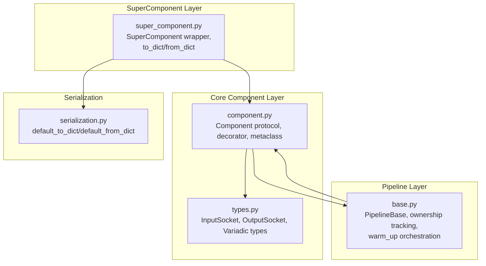
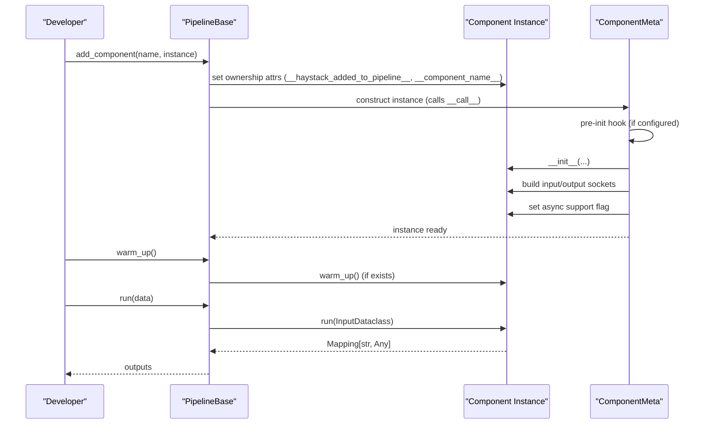
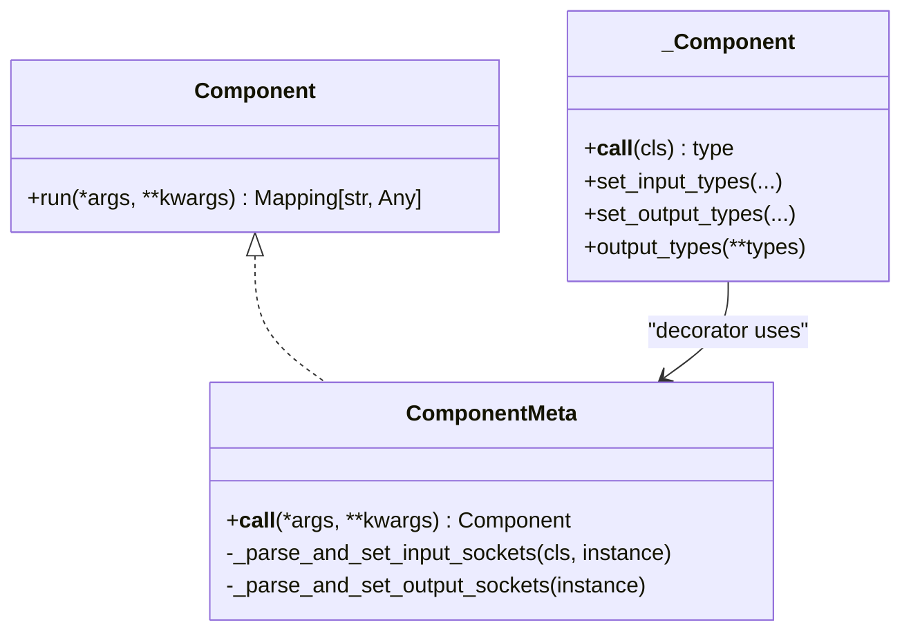
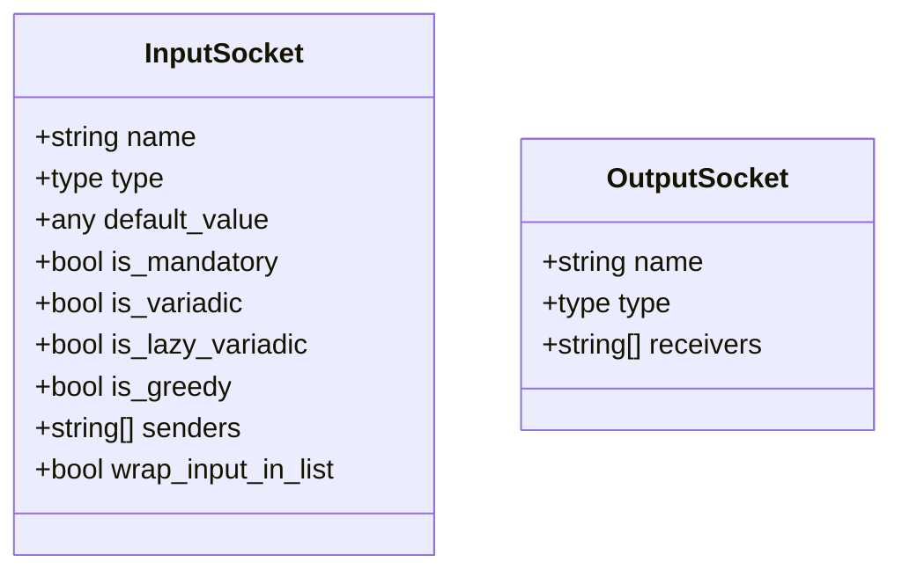
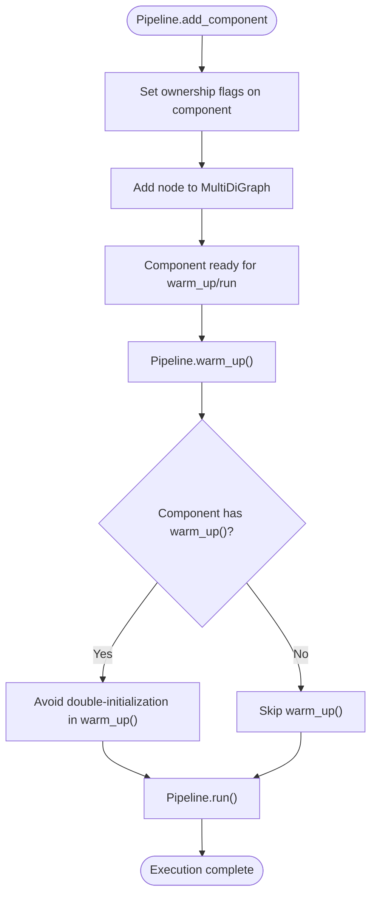
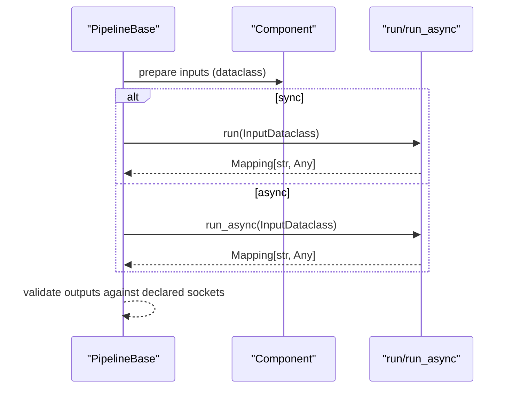
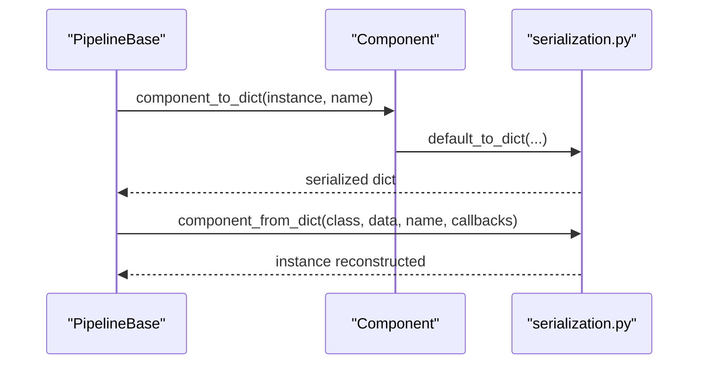
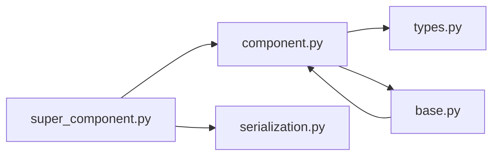

# Component Lifecycle

<cite>
**Referenced Files in This Document**
- [component.py](file://haystack/core/component/component.py)
- [types.py](file://haystack/core/component/types.py)
- [super_component.py](file://haystack/core/super_component/super_component.py)
- [base.py](file://haystack/core/pipeline/base.py)
- [serialization.py](file://haystack/core/serialization.py)
- [refactor-warm-up-components-c2777fef28a70b61.yaml](file://releasenotes/notesc2777fef28a70b61.yaml)
</cite>

## Table of Contents
1. [Introduction](#introduction)
2. [Project Structure](#project-structure)
3. [Core Components](#core-components)
4. [Architecture Overview](#architecture-overview)
5. [Detailed Component Analysis](#detailed-component-analysis)
6. [Dependency Analysis](#dependency-analysis)
7. [Performance Considerations](#performance-considerations)
8. [Troubleshooting Guide](#troubleshooting-guide)
9. [Conclusion](#conclusion)
10. [Appendices](#appendices)

## Introduction
This document explains the complete lifecycle of Haystack components from instantiation to pipeline execution, focusing on how components are constructed, validated, warmed up, executed, serialized, and cleaned up. It covers the contract that all components must follow, the roles of __init__, warm_up, run, and async variants, and how pipelines manage component ownership and resource initialization. Practical examples are provided for generators, retrievers, and custom components, along with debugging tips, best practices, and guidance for async execution.

## Project Structure
The component lifecycle is implemented across a few core modules:
- Core component contract and decorator: haystack/core/component/component.py
- Socket types and variadic inputs: haystack/core/component/types.py
- SuperComponent wrapper and serialization: haystack/core/super_component/super_component.py
- Pipeline orchestration and ownership tracking: haystack/core/pipeline/base.py
- Serialization utilities: haystack/core/serialization.py
- Release note confirming automatic warm-up behavior: releasenotes/.../refactor-warm-up-components-...yaml

**Diagram sources**
- [component.py](file://haystack/core/component/component.py#L136-L645)
- [types.py](file://haystack/core/component/types.py#L36-L128)
- [base.py](file://haystack/core/pipeline/base.py#L81-L438)
- [super_component.py](file://haystack/core/super_component/super_component.py#L35-L627)
- [serialization.py](file://haystack/core/serialization.py)

**Section sources**
- [component.py](file://haystack/core/component/component.py#L1-L645)
- [types.py](file://haystack/core/component/types.py#L1-L128)
- [base.py](file://haystack/core/pipeline/base.py#L1-L800)
- [super_component.py](file://haystack/core/super_component/super_component.py#L1-L627)

## Core Components
This section summarizes the component contract and lifecycle primitives.

- Component decorator and registration
  - All components must be decorated with @component to be recognized by pipelines and registered in the component registry.
  - The decorator validates the presence of a run method and registers the class globally for serialization/deserialization.

- Constructor (__init__)
  - Accept only basic Python types or JSON-serializable structures. If you need to accept classes or callables, accept a string import path and resolve it in __init__; serialize back to an importable string in to_dict().
  - __init__ must be lightweight; heavy initialization belongs in warm_up.

- Initialization parameters (init_parameters)
  - Components can store init_parameters for persistence. By default, the decorator captures constructor arguments. If you override init_parameters manually, ensure all values are JSON-serializable.

- Heavy resource initialization (warm_up)
  - Optional method called by Pipeline before graph execution.
  - Implementers must guard against double-initialization because Pipeline does not track which components were warmed up.

- Execution (run)
  - Mandatory method implementing the component’s main logic.
  - Receives a dataclass built from connected inputs and defaults; returns a mapping conforming to declared output sockets.

- Async execution (run_async)
  - Optional coroutine with identical parameter semantics to run.
  - Both run and run_async must declare the same outputs via the same output types.

- Ownership tracking and cleanup
  - PipelineBase sets __haystack_added_to_pipeline__ and __component_name__ on components upon addition.
  - Removing a component resets these references and clears socket senders/receivers.

**Section sources**
- [component.py](file://haystack/core/component/component.py#L14-L74)
- [component.py](file://haystack/core/component/component.py#L187-L330)
- [base.py](file://haystack/core/pipeline/base.py#L341-L437)

## Architecture Overview
The lifecycle spans three stages: construction/validation, ownership and warm-up, and execution.

**Diagram sources**
- [base.py](file://haystack/core/pipeline/base.py#L341-L437)
- [component.py](file://haystack/core/component/component.py#L294-L330)

## Detailed Component Analysis

### Component Contract and Decorator
- Protocol and runtime checks
  - Components must expose a run method; the protocol is runtime-checkable for type systems.
- Metaclass responsibilities
  - Validates run_async is a coroutine if present.
  - Parses run method signature to build input sockets and ensures run/run_async outputs match.
  - Sets ownership and async support flags on instances.
- Registry and serialization
  - The decorator registers components globally by qualified class name for deserialization.

**Diagram sources**
- [component.py](file://haystack/core/component/component.py#L136-L330)
- [component.py](file://haystack/core/component/component.py#L572-L645)

**Section sources**
- [component.py](file://haystack/core/component/component.py#L136-L330)
- [component.py](file://haystack/core/component/component.py#L572-L645)

### Sockets and Variadic Inputs
- InputSocket and OutputSocket define typed I/O with default values, variadic flags, and connection tracking.
- Variadic and greedy variadic inputs enable batching and eager triggering of components.

**Diagram sources**
- [types.py](file://haystack/core/component/types.py#L36-L128)

**Section sources**
- [types.py](file://haystack/core/component/types.py#L36-L128)

### Pipeline Ownership and Warm-Up Orchestration
- Ownership tracking
  - PipelineBase sets __haystack_added_to_pipeline__ and __component_name__ on components when added.
  - Prevents sharing components across pipelines.
- Warm-up behavior
  - Components that define warm_up are auto-run on first use, removing the need for manual calls and preventing errors in standalone usage.

**Diagram sources**
- [base.py](file://haystack/core/pipeline/base.py#L341-L437)
- [refactor-warm-up-components-c2777fef28a70b61.yaml](file://releasenotes/notesc2777fef28a70b61.yaml#L1-L4)

**Section sources**
- [base.py](file://haystack/core/pipeline/base.py#L341-L437)
- [refactor-warm-up-components-c2777fef28a70b61.yaml](file://releasenotes/notesc2777fef28a70b61.yaml#L1-L4)

### Execution Model: run and run_async
- run method
  - Receives a dataclass built from connected inputs and defaults; returns a mapping matching declared outputs.
- run_async method
  - Optional coroutine with identical parameter semantics to run.
  - Both must declare the same outputs; mismatches produce a detailed error.

**Diagram sources**
- [component.py](file://haystack/core/component/component.py#L207-L293)
- [base.py](file://haystack/core/pipeline/base.py#L646-L721)

**Section sources**
- [component.py](file://haystack/core/component/component.py#L207-L293)
- [base.py](file://haystack/core/pipeline/base.py#L646-L721)

### Serialization and Deserialization
- Component serialization
  - PipelineBase.to_dict serializes each component using component_to_dict.
  - Components must implement to_dict and rely on default_to_dict for robustness.
- Component deserialization
  - PipelineBase.from_dict reconstructs components using component_from_dict and the global registry.
  - Components must implement from_dict and rely on default_from_dict for robustness.
- SuperComponent serialization
  - SuperComponent.to_dict delegates to _to_super_component_dict, which serializes the wrapped pipeline and mappings.
  - SuperComponent.from_dict reconstructs the pipeline and reattaches mappings.

**Diagram sources**
- [base.py](file://haystack/core/pipeline/base.py#L148-L260)
- [serialization.py](file://haystack/core/serialization.py)

**Section sources**
- [base.py](file://haystack/core/pipeline/base.py#L148-L260)
- [super_component.py](file://haystack/core/super_component/super_component.py#L380-L489)

### Practical Examples

#### Generator Component Lifecycle
- __init__
  - Accept basic parameters; store init_parameters for persistence.
  - If loading heavy models, defer to warm_up.
- warm_up
  - Load model/checkpoint; guard against double-initialization.
- run
  - Accept input dataclass (e.g., prompt/messages); return mapping with generated replies.
- serialization
  - Implement to_dict/from_dict; ensure init_parameters are JSON-serializable.

#### Retriever Component Lifecycle
- __init__
  - Configure retrieval parameters; avoid loading embeddings here.
- warm_up
  - Initialize embedding backend/document store handles; guard against double-initialization.
- run
  - Receive query and optional filters; return mapping with retrieved documents.
- serialization
  - Persist minimal configuration; restore backend in warm_up.

#### Custom Component Lifecycle
- __init__
  - Use component.set_input_types/set_output_types or decorators to declare I/O.
  - Keep __init__ fast; move heavy work to warm_up.
- warm_up
  - Initialize caches, threads, or external clients; ensure idempotency.
- run
  - Merge inputs from connected components; apply logic; return outputs.
- serialization
  - Provide deterministic to_dict/from_dict; handle class/callable parameters via import paths.

[No sources needed since this subsection synthesizes patterns already covered in prior sections]

## Dependency Analysis
The following diagram shows how lifecycle-related modules depend on each other.

**Diagram sources**
- [component.py](file://haystack/core/component/component.py#L1-L645)
- [types.py](file://haystack/core/component/types.py#L1-L128)
- [base.py](file://haystack/core/pipeline/base.py#L1-L800)
- [super_component.py](file://haystack/core/super_component/super_component.py#L1-L627)
- [serialization.py](file://haystack/core/serialization.py)

**Section sources**
- [component.py](file://haystack/core/component/component.py#L1-L645)
- [types.py](file://haystack/core/component/types.py#L1-L128)
- [base.py](file://haystack/core/pipeline/base.py#L1-L800)
- [super_component.py](file://haystack/core/super_component/super_component.py#L1-L627)

## Performance Considerations
- Keep __init__ lightweight
  - Avoid loading models, opening files, or establishing network connections in __init__.
- Use warm_up for heavy initialization
  - Centralize resource allocation and guard against double-initialization.
- Minimize JSON-serializable init_parameters
  - Prefer compact, immutable configurations; defer heavy state to warm_up.
- Prefer async where appropriate
  - Use run_async for I/O-bound tasks; ensure run and run_async signatures match.

[No sources needed since this section provides general guidance]

## Troubleshooting Guide
Common pitfalls and remedies:
- Missing run method
  - Symptom: ComponentError indicating no run method.
  - Fix: Ensure the class decorated with @component has a run method.
- Mismatched run/run_async signatures
  - Symptom: Detailed error comparing signatures.
  - Fix: Align parameter names, types, defaults, and kinds; ensure identical outputs.
- Double-initialization in warm_up
  - Symptom: Resource leaks or inconsistent state.
  - Fix: Guard warm_up with a flag or sentinel to ensure idempotency.
- Sharing components across pipelines
  - Symptom: Error stating components cannot be shared.
  - Fix: Instantiate separate component objects for each pipeline.
- Non-JSON-serializable init_parameters
  - Symptom: Serialization failures.
  - Fix: Serialize classes/callables to importable strings; persist strings in init_parameters.
- Async method not a coroutine
  - Symptom: ComponentError stating run_async must be a coroutine.
  - Fix: Implement run_async as an async def and ensure it returns the same output shape.

**Section sources**
- [component.py](file://haystack/core/component/component.py#L207-L293)
- [component.py](file://haystack/core/component/component.py#L318-L320)
- [base.py](file://haystack/core/pipeline/base.py#L376-L381)

## Conclusion
Haystack’s component lifecycle is designed around a strict contract: lightweight constructors, guarded heavy initialization in warm_up, deterministic run/run_async execution, and robust serialization. Pipelines enforce ownership and orchestrate warm-up and execution, while the decorator and metaclass ensure I/O correctness and async consistency. Following the best practices and patterns outlined here will help you build reliable, maintainable components that integrate seamlessly with pipelines.

[No sources needed since this section summarizes without analyzing specific files]

## Appendices

### Appendix A: Lifecycle Debugging Checklist
- Confirm @component decorator is applied.
- Verify run method exists and returns a mapping matching declared outputs.
- Ensure run and run_async signatures are identical.
- Guard warm_up against double-initialization.
- Keep __init__ minimal; move heavy work to warm_up.
- Test serialization round-trip via to_dict/from_dict.
- Validate component ownership flags after adding to pipeline.

[No sources needed since this section provides general guidance]