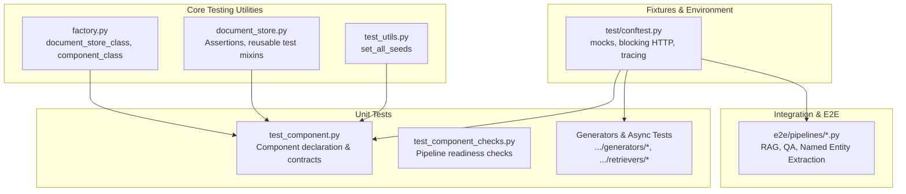
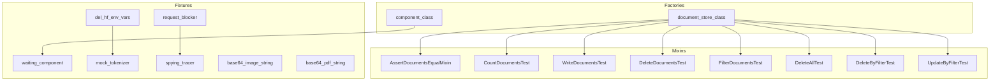
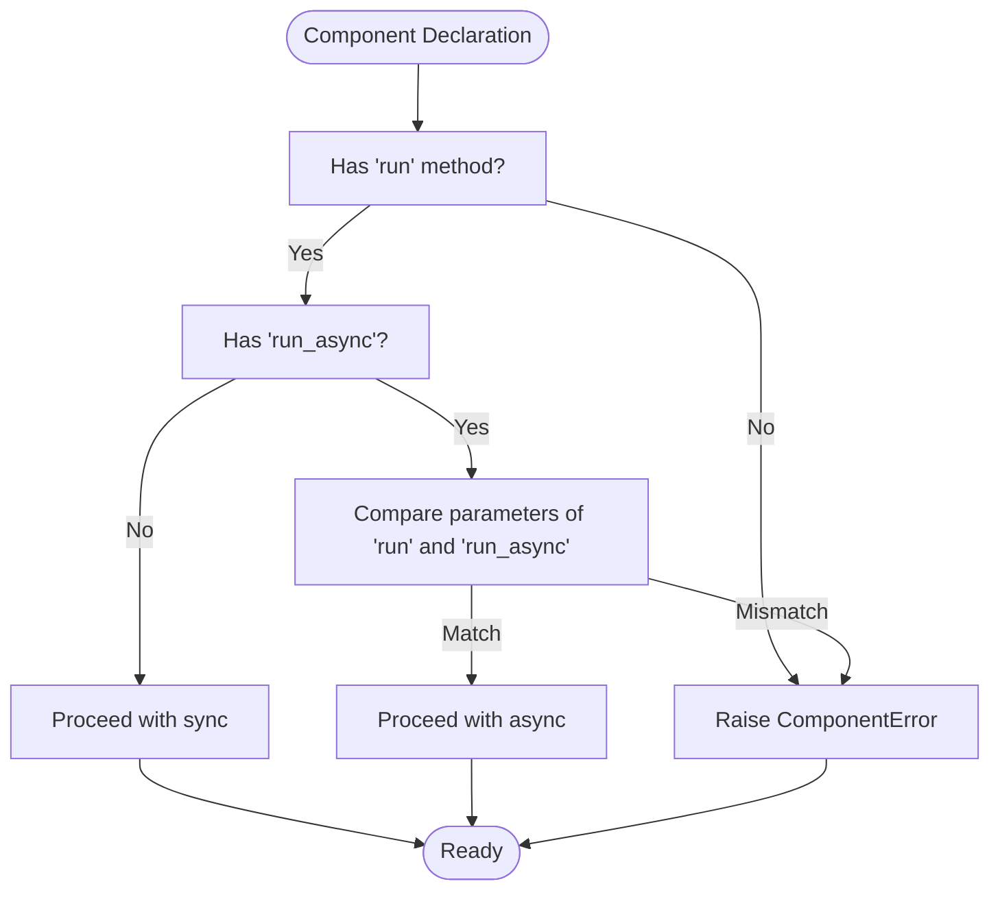
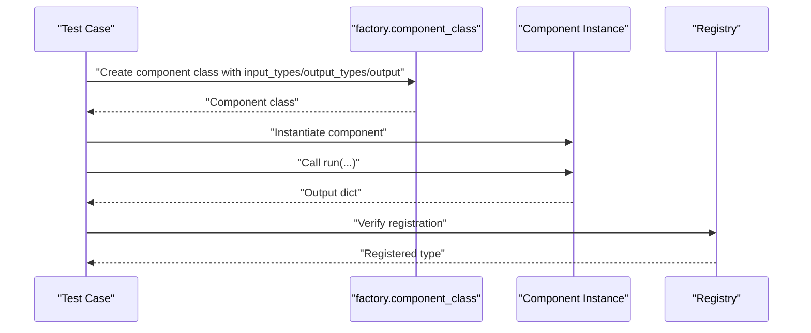
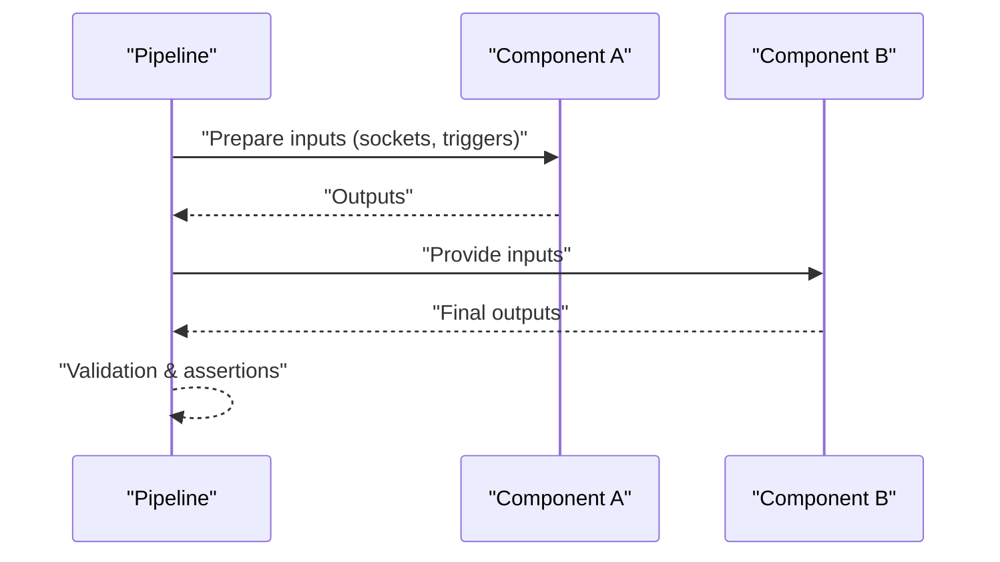
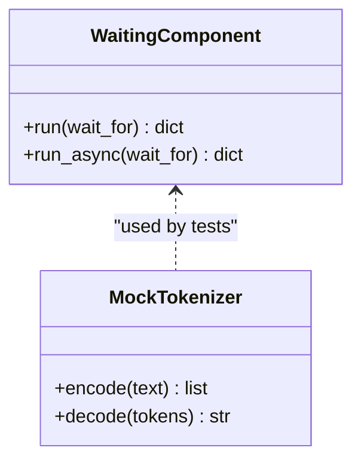
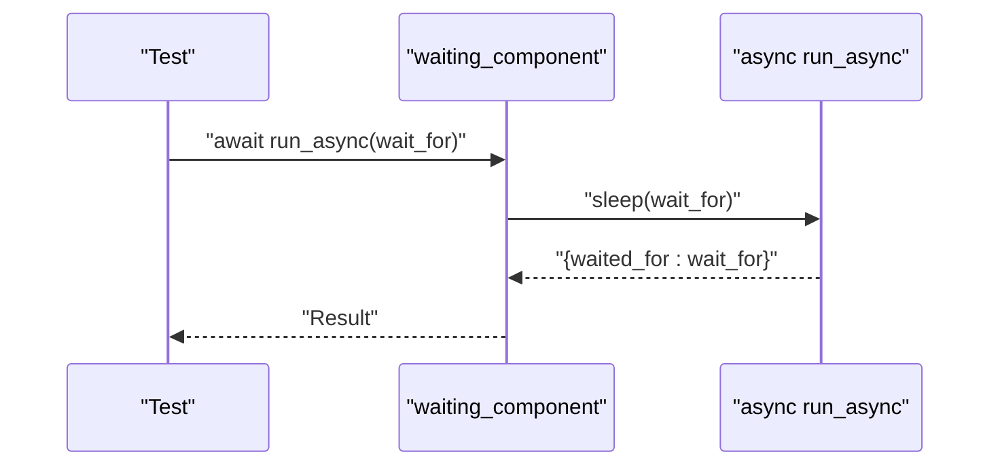
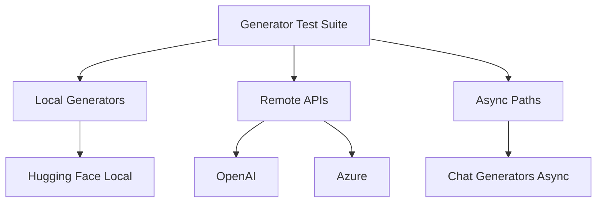
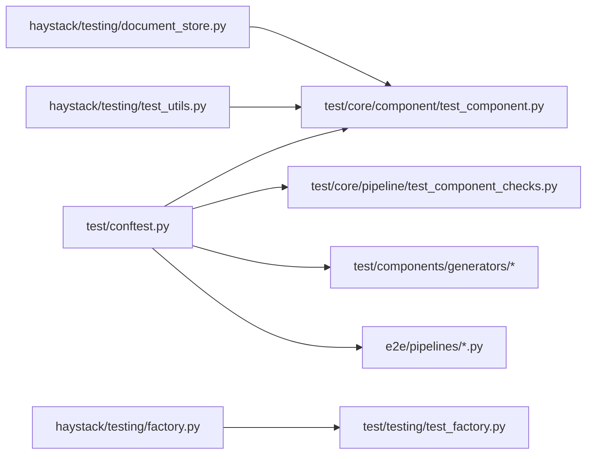

# Component Testing

<cite>
**Referenced Files in This Document**
- [factory.py](file://haystack/testing/factory.py)
- [document_store.py](file://haystack/testing/document_store.py)
- [test_utils.py](file://haystack/testing/test_utils.py)
- [test_factory.py](file://test/testing/test_factory.py)
- [conftest.py](file://test/conftest.py)
- [test_component.py](file://test/core/component/test_component.py)
- [test_component_checks.py](file://test/core/pipeline/test_component_checks.py)
- [test_openai_async.py](file://test/components/generators/chat/test_openai_async.py)
- [test_async_pipeline.py](file://test/core/pipeline/test_async_pipeline.py)
- [test_filter_retriever_async.py](file://test/components/retrievers/test_filter_retriever_async.py)
- [test_hugging_face_local_generator.py](file://test/components/generators/test_hugging_face_local_generator.py)
- [test_hugging_face_api.py](file://test/components/generators/test_hugging_face_api.py)
- [test_openai.py](file://test/components/generators/test_openai.py)
- [test_azure.py](file://test/components/generators/test_azure.py)
- [test_answer_builder.py](file://test/components/builders/test_answer_builder.py)
- [test_prompt_builder.py](file://test/components/builders/test_prompt_builder.py)
- [test_file_to_file_content.py](file://test/components/converters/test_file_to_file_content.py)
- [test_pytesseract_ocr_doc_converter.py](file://test/components/converters/image/test_pytesseract_ocr_doc_converter.py)
- [test_csv_to_document.py](file://test/components/converters/test_csv_to_document.py)
- [test_docx_file_to_document.py](file://test/components/converters/test_docx_file_to_document.py)
- [test_markdown_to_document.py](file://test/components/converters/test_markdown_to_document.py)
- [test_pdfminer_to_document.py](file://test/components/converters/test_pdfminer_to_document.py)
- [test_pptx_to_document.py](file://test/components/converters/test_pptx_to_document.py)
- [test_textfile_to_document.py](file://test/components/converters/test_textfile_to_document.py)
- [test_tika_doc_converter.py](file://test/components/converters/test_tika_doc_converter.py)
- [test_xlsx_to_document.py](file://test/components/converters/test_xlsx_to_document.py)
- [test_document_language_classifier.py](file://test/components/classifiers/test_document_language_classifier.py)
- [test_zero_shot_document_classifier.py](file://test/components/classifiers/test_zero_shot_document_classifier.py)
- [test_named_entity_extractor.py](file://test/e2e/pipelines/test_named_entity_extractor.py)
- [test_rag_pipelines_e2e.py](file://test/e2e/pipelines/test_rag_pipelines_e2e.py)
- [test_evaluation_pipeline.py](file://test/e2e/pipelines/test_evaluation_pipeline.py)
- [test_extractive_qa_pipeline.py](file://test/e2e/pipelines/test_extractive_qa_pipeline.py)
- [test_hybrid_doc_search_pipeline.py](file://test/e2e/pipelines/test_hybrid_doc_search_pipeline.py)
- [test_pdf_content_extraction_pipeline.py](file://test/e2e/pipelines/test_pdf_content_extraction_pipeline.py)
- [test_preprocessing_pipeline.py](file://test/e2e/pipelines/test_preprocessing_pipeline.py)
</cite>

## Table of Contents
1. [Introduction](#introduction)
2. [Project Structure](#project-structure)
3. [Core Components](#core-components)
4. [Architecture Overview](#architecture-overview)
5. [Detailed Component Analysis](#detailed-component-analysis)
6. [Dependency Analysis](#dependency-analysis)
7. [Performance Considerations](#performance-considerations)
8. [Troubleshooting Guide](#troubleshooting-guide)
9. [Conclusion](#conclusion)
10. [Appendices](#appendices)

## Introduction
This document explains how to test Haystack components effectively. It covers unit testing strategies for individual components (input validation, output verification, edge cases), testing factory utilities and helper functions, integration testing within pipelines, mock component creation, and test data preparation. It also details testing patterns for async components, generator components, and components with external dependencies. Finally, it provides guidance on organizing test suites, assertion patterns, component contract testing, error handling, performance validation, CI/CD integration, coverage expectations, and debugging failed tests.

## Project Structure
Testing in this repository is organized around:
- Core testing utilities under haystack/testing for factories and shared helpers
- Unit tests under test/ for components, pipelines, and core functionality
- E2E pipeline tests under e2e/ for realistic end-to-end scenarios
- Conftest fixtures under test/conftest.py to standardize environment and mocks

**Diagram sources**
- [factory.py](file://haystack/testing/factory.py#L13-L124)
- [document_store.py](file://haystack/testing/document_store.py#L30-L800)
- [test_utils.py](file://haystack/testing/test_utils.py#L13-L37)
- [test_component.py](file://test/core/component/test_component.py#L16-L200)
- [test_component_checks.py](file://test/core/pipeline/test_component_checks.py#L140-L200)
- [test_openai_async.py](file://test/components/generators/chat/test_openai_async.py#L1-L120)
- [test_async_pipeline.py](file://test/core/pipeline/test_async_pipeline.py#L1-L120)
- [test_filter_retriever_async.py](file://test/components/retrievers/test_filter_retriever_async.py#L1-L120)
- [conftest.py](file://test/conftest.py#L24-L110)

**Section sources**
- [factory.py](file://haystack/testing/factory.py#L1-L233)
- [document_store.py](file://haystack/testing/document_store.py#L1-L954)
- [test_utils.py](file://haystack/testing/test_utils.py#L1-L37)
- [test_component.py](file://test/core/component/test_component.py#L1-L200)
- [test_component_checks.py](file://test/core/pipeline/test_component_checks.py#L1-L200)
- [conftest.py](file://test/conftest.py#L1-L110)

## Core Components
This section focuses on the testing utilities and helpers that enable robust component testing.

- Factory utilities
  - document_store_class: Dynamically creates a DocumentStore-like class with configurable documents, counts, and extra fields. Useful for isolating tests against a fake store.
  - component_class: Dynamically creates a Component class with customizable input/output types and outputs. Enables quick mock components for unit tests.

- Shared test helpers
  - set_all_seeds: Ensures reproducible runs across random number generators and optional deterministic CUDA behavior.

- Reusable test mixins and assertions
  - AssertDocumentsEqualMixin: Provides a hook to override equality checks for Document lists, accommodating implementations that attach scores or other metadata.
  - CountDocumentsTest, WriteDocumentsTest, DeleteDocumentsTest, FilterDocumentsTest, DeleteAllTest, DeleteByFilterTest, UpdateByFilterTest: Mixins that encapsulate canonical test suites for DocumentStore capabilities, including duplicate policies, logical filters, and advanced delete semantics.

- Conftest fixtures
  - waiting_component: Provides a simple component with both sync and async run methods for timing-sensitive tests.
  - mock_tokenizer: A minimal Mock suitable for tokenization tasks.
  - request_blocker: Blocks outbound HTTP requests unless a specific integration marker is present.
  - spying_tracer: Enables tracing during tests and ensures cleanup afterward.
  - base64_image_string, base64_pdf_string: Pre-generated test assets for media conversions.
  - del_hf_env_vars: Removes Hugging Face tokens from environment to prevent unintended API calls.

**Section sources**
- [factory.py](file://haystack/testing/factory.py#L13-L124)
- [factory.py](file://haystack/testing/factory.py#L126-L233)
- [test_utils.py](file://haystack/testing/test_utils.py#L13-L37)
- [document_store.py](file://haystack/testing/document_store.py#L30-L800)
- [conftest.py](file://test/conftest.py#L24-L110)

## Architecture Overview
The testing architecture centers on:
- Factories to create deterministic, isolated test doubles
- Reusable mixins to enforce component contracts and behavior
- Fixtures to standardize environment setup and mocking
- Dedicated async and generator test suites to validate concurrency and external integrations

**Diagram sources**
- [factory.py](file://haystack/testing/factory.py#L13-L233)
- [document_store.py](file://haystack/testing/document_store.py#L30-L800)
- [conftest.py](file://test/conftest.py#L24-L110)

## Detailed Component Analysis

### Unit Testing Strategies for Individual Components
Key strategies validated by the test suite:
- Input validation and signature contracts
  - Components must declare a run method and, if exposing async, a proper run_async coroutine with identical parameters.
  - Mismatches between run and run_async parameters are rejected to maintain component contracts.
- Output verification
  - Tests assert return shapes and values, often using the registry to confirm component registration.
- Edge cases
  - Missing run method, incorrect async signatures, and mismatched parameters are explicitly tested and raise specific errors.

**Diagram sources**
- [test_component.py](file://test/core/component/test_component.py#L115-L194)

**Section sources**
- [test_component.py](file://test/core/component/test_component.py#L16-L200)

### Testing Factory Utilities and Helper Functions
- Factory usage patterns
  - document_store_class enables creating fake stores with specific documents, counts, and custom bases/fields.
  - component_class enables creating components with explicit input/output types and fixed outputs for deterministic tests.
- Validation via dedicated tests
  - The test suite validates default behavior, serialization/deserialization, and customization via bases and extra fields.

**Diagram sources**
- [test_factory.py](file://test/testing/test_factory.py#L62-L123)
- [factory.py](file://haystack/testing/factory.py#L126-L233)

**Section sources**
- [test_factory.py](file://test/testing/test_factory.py#L1-L123)
- [factory.py](file://haystack/testing/factory.py#L1-L233)

### Integration Testing Within Pipelines
- Pipeline readiness checks
  - Tests validate conditions such as mandatory inputs, triggers, and variadic socket resolution to ensure components run only when ready.
- E2E pipelines
  - End-to-end tests exercise realistic scenarios (RAG, QA, named entity extraction, hybrid search, preprocessing) to catch integration regressions.

**Diagram sources**
- [test_component_checks.py](file://test/core/pipeline/test_component_checks.py#L140-L200)
- [test_rag_pipelines_e2e.py](file://test/e2e/pipelines/test_rag_pipelines_e2e.py#L1-L120)
- [test_evaluation_pipeline.py](file://test/e2e/pipelines/test_evaluation_pipeline.py#L1-L120)
- [test_extractive_qa_pipeline.py](file://test/e2e/pipelines/test_extractive_qa_pipeline.py#L1-L120)
- [test_hybrid_doc_search_pipeline.py](file://test/e2e/pipelines/test_hybrid_doc_search_pipeline.py#L1-L120)
- [test_pdf_content_extraction_pipeline.py](file://test/e2e/pipelines/test_pdf_content_extraction_pipeline.py#L1-L120)
- [test_preprocessing_pipeline.py](file://test/e2e/pipelines/test_preprocessing_pipeline.py#L1-L120)

**Section sources**
- [test_component_checks.py](file://test/core/pipeline/test_component_checks.py#L1-L200)
- [test_rag_pipelines_e2e.py](file://test/e2e/pipelines/test_rag_pipelines_e2e.py#L1-L200)
- [test_evaluation_pipeline.py](file://test/e2e/pipelines/test_evaluation_pipeline.py#L1-L200)
- [test_extractive_qa_pipeline.py](file://test/e2e/pipelines/test_extractive_qa_pipeline.py#L1-L200)
- [test_hybrid_doc_search_pipeline.py](file://test/e2e/pipelines/test_hybrid_doc_search_pipeline.py#L1-L200)
- [test_pdf_content_extraction_pipeline.py](file://test/e2e/pipelines/test_pdf_content_extraction_pipeline.py#L1-L200)
- [test_preprocessing_pipeline.py](file://test/e2e/pipelines/test_preprocessing_pipeline.py#L1-L200)

### Mock Component Creation and Test Data Preparation
- Mocks and fixtures
  - waiting_component provides a component with both sync and async run methods for timing-sensitive tests.
  - mock_tokenizer simulates tokenization behavior for converter and generator tests.
  - request_blocker prevents accidental network calls outside integration tests.
  - Base64-encoded assets (image/PDF) support media conversion tests.
- Test data preparation
  - set_all_seeds ensures reproducibility across random operations and optional deterministic CUDA behavior.

**Diagram sources**
- [conftest.py](file://test/conftest.py#L24-L95)
- [test_utils.py](file://haystack/testing/test_utils.py#L13-L37)

**Section sources**
- [conftest.py](file://test/conftest.py#L24-L110)
- [test_utils.py](file://haystack/testing/test_utils.py#L13-L37)

### Testing Patterns for Async Components
- Async contracts
  - Components with async run must expose a coroutine with identical parameters to run.
- Test patterns
  - Use waiting_component to validate async scheduling and timing.
  - Dedicated async tests exist for generators and retrievers to ensure async paths behave correctly.

**Diagram sources**
- [conftest.py](file://test/conftest.py#L24-L38)
- [test_openai_async.py](file://test/components/generators/chat/test_openai_async.py#L1-L120)
- [test_async_pipeline.py](file://test/core/pipeline/test_async_pipeline.py#L1-L120)
- [test_filter_retriever_async.py](file://test/components/retrievers/test_filter_retriever_async.py#L1-L120)

**Section sources**
- [conftest.py](file://test/conftest.py#L24-L38)
- [test_openai_async.py](file://test/components/generators/chat/test_openai_async.py#L1-L120)
- [test_async_pipeline.py](file://test/core/pipeline/test_async_pipeline.py#L1-L120)
- [test_filter_retriever_async.py](file://test/components/retrievers/test_filter_retriever_async.py#L1-L120)

### Testing Generator Components and External Dependencies
- Local vs remote
  - Local generators (e.g., Hugging Face local) and remote APIs (OpenAI, Azure) are covered by separate test suites.
- External dependency safety
  - del_hf_env_vars removes tokens from environment to avoid unintended API calls.
  - request_blocker guards against accidental HTTP traffic in non-integration tests.
- Async generator tests
  - Async generator tests validate both sync and async execution paths.

**Diagram sources**
- [test_hugging_face_local_generator.py](file://test/components/generators/test_hugging_face_local_generator.py#L1-L120)
- [test_hugging_face_api.py](file://test/components/generators/test_hugging_face_api.py#L1-L120)
- [test_openai.py](file://test/components/generators/test_openai.py#L1-L120)
- [test_azure.py](file://test/components/generators/test_azure.py#L1-L120)
- [test_openai_async.py](file://test/components/generators/chat/test_openai_async.py#L1-L120)

**Section sources**
- [test_hugging_face_local_generator.py](file://test/components/generators/test_hugging_face_local_generator.py#L1-L120)
- [test_hugging_face_api.py](file://test/components/generators/test_hugging_face_api.py#L1-L120)
- [test_openai.py](file://test/components/generators/test_openai.py#L1-L120)
- [test_azure.py](file://test/components/generators/test_azure.py#L1-L120)
- [conftest.py](file://test/conftest.py#L98-L110)

### Testing Components with External Dependencies
- Environment isolation
  - del_hf_env_vars clears HF tokens to prevent API calls.
  - request_blocker blocks HTTP requests unless marked as integration.
- Asset-driven tests
  - Base64-encoded assets (images/PDF) enable converter tests without real network calls.

**Section sources**
- [conftest.py](file://test/conftest.py#L57-L110)

### Examples of Component Test Suites and Assertion Patterns
- Builders
  - Prompt builder and answer builder tests validate input composition and output formatting.
- Converters
  - Extensive converter tests cover CSV, DOCX, HTML, JSON, Markdown, MSG, PDF, PPTX, text files, and OCR-based image converters.
- Classifiers
  - Language classifier and zero-shot document classifier tests validate metadata and classification outputs.
- Retrievers
  - Async retriever tests ensure correct behavior for filter and window retrieval patterns.

**Section sources**
- [test_answer_builder.py](file://test/components/builders/test_answer_builder.py#L1-L120)
- [test_prompt_builder.py](file://test/components/builders/test_prompt_builder.py#L1-L120)
- [test_file_to_file_content.py](file://test/components/converters/test_file_to_file_content.py#L1-L120)
- [test_pytesseract_ocr_doc_converter.py](file://test/components/converters/image/test_pytesseract_ocr_doc_converter.py#L1-L120)
- [test_csv_to_document.py](file://test/components/converters/test_csv_to_document.py#L1-L120)
- [test_docx_file_to_document.py](file://test/components/converters/test_docx_file_to_document.py#L1-L120)
- [test_markdown_to_document.py](file://test/components/converters/test_markdown_to_document.py#L1-L120)
- [test_pdfminer_to_document.py](file://test/components/converters/test_pdfminer_to_document.py#L1-L120)
- [test_pptx_to_document.py](file://test/components/converters/test_pptx_to_document.py#L1-L120)
- [test_textfile_to_document.py](file://test/components/converters/test_textfile_to_document.py#L1-L120)
- [test_tika_doc_converter.py](file://test/components/converters/test_tika_doc_converter.py#L1-L120)
- [test_xlsx_to_document.py](file://test/components/converters/test_xlsx_to_document.py#L1-L120)
- [test_document_language_classifier.py](file://test/components/classifiers/test_document_language_classifier.py#L1-L120)
- [test_zero_shot_document_classifier.py](file://test/components/classifiers/test_zero_shot_document_classifier.py#L1-L120)
- [test_filter_retriever_async.py](file://test/components/retrievers/test_filter_retriever_async.py#L1-L120)

### Best Practices for Component Contracts, Error Handling, and Performance Validation
- Component contracts
  - Always validate presence and signature compatibility of run and run_async.
  - Register components and verify registry entries.
- Error handling
  - Expect specific ComponentError messages for invalid declarations or async mismatches.
  - Use request_blocker to surface accidental network calls as errors.
- Performance validation
  - Use waiting_component to measure timing and ensure async scheduling behaves as expected.
  - Leverage set_all_seeds to keep performance-sensitive tests reproducible.

**Section sources**
- [test_component.py](file://test/core/component/test_component.py#L115-L194)
- [conftest.py](file://test/conftest.py#L57-L83)
- [test_utils.py](file://haystack/testing/test_utils.py#L13-L37)

### CI/CD Integration, Coverage, and Debugging
- CI safeguards
  - Tracing disabled by default to avoid flakiness; enabled only via spying_tracer fixture when needed.
  - request_blocker prevents network calls in non-integration tests.
- Coverage
  - Aim for high coverage across component logic, async paths, and external integrations.
- Debugging
  - Use spying_tracer to capture traces and inspect execution flow.
  - Inspect component registry and run outputs to diagnose contract violations.

**Section sources**
- [conftest.py](file://test/conftest.py#L20-L22)
- [conftest.py](file://test/conftest.py#L74-L84)

## Dependency Analysis
This section maps key dependencies among testing utilities and test suites.

**Diagram sources**
- [conftest.py](file://test/conftest.py#L1-L110)
- [test_component.py](file://test/core/component/test_component.py#L1-L200)
- [test_component_checks.py](file://test/core/pipeline/test_component_checks.py#L1-L200)
- [test_openai_async.py](file://test/components/generators/chat/test_openai_async.py#L1-L120)
- [test_rag_pipelines_e2e.py](file://test/e2e/pipelines/test_rag_pipelines_e2e.py#L1-L120)
- [factory.py](file://haystack/testing/factory.py#L1-L233)
- [test_factory.py](file://test/testing/test_factory.py#L1-L123)
- [document_store.py](file://haystack/testing/document_store.py#L1-L954)
- [test_utils.py](file://haystack/testing/test_utils.py#L1-L37)

**Section sources**
- [conftest.py](file://test/conftest.py#L1-L110)
- [test_component.py](file://test/core/component/test_component.py#L1-L200)
- [test_component_checks.py](file://test/core/pipeline/test_component_checks.py#L1-L200)
- [factory.py](file://haystack/testing/factory.py#L1-L233)
- [test_factory.py](file://test/testing/test_factory.py#L1-L123)
- [document_store.py](file://haystack/testing/document_store.py#L1-L954)
- [test_utils.py](file://haystack/testing/test_utils.py#L1-L37)

## Performance Considerations
- Deterministic randomness
  - set_all_seeds ensures reproducible outcomes for tests relying on random behavior.
- Async timing
  - waiting_component helps validate async scheduling and latency without flaky sleeps.
- GPU determinism
  - Optional deterministic CUDA behavior can be enabled to reduce variance in GPU-dependent tests.

**Section sources**
- [test_utils.py](file://haystack/testing/test_utils.py#L13-L37)
- [conftest.py](file://test/conftest.py#L24-L38)

## Troubleshooting Guide
Common issues and resolutions:
- ComponentError for missing run or async signature mismatches
  - Ensure run and run_async signatures match exactly.
- Unexpected network calls
  - Verify request_blocker is active; mark integration tests appropriately.
- Non-reproducible results
  - Call set_all_seeds at the start of tests.
- Async tests hanging
  - Confirm async paths use awaiting and that waiting_component is used for timing validation.

**Section sources**
- [test_component.py](file://test/core/component/test_component.py#L115-L194)
- [conftest.py](file://test/conftest.py#L57-L83)
- [test_utils.py](file://haystack/testing/test_utils.py#L13-L37)

## Conclusion
This guide consolidates Haystack’s testing patterns and utilities into actionable strategies for unit, integration, and E2E testing. By leveraging factories, mixins, fixtures, and strict component contracts, teams can build reliable, maintainable, and performant tests across sync and async components, generators, and external integrations.

## Appendices
- Additional test categories to explore
  - Evaluators, routers, samplers, tools, and writers follow similar patterns and can be extended using the same factories and mixins.
- Extending existing component tests
  - Use component_class to create minimal test doubles for new components.
  - Adopt FilterDocumentsTest and related mixins to validate DocumentStore-like behavior quickly.