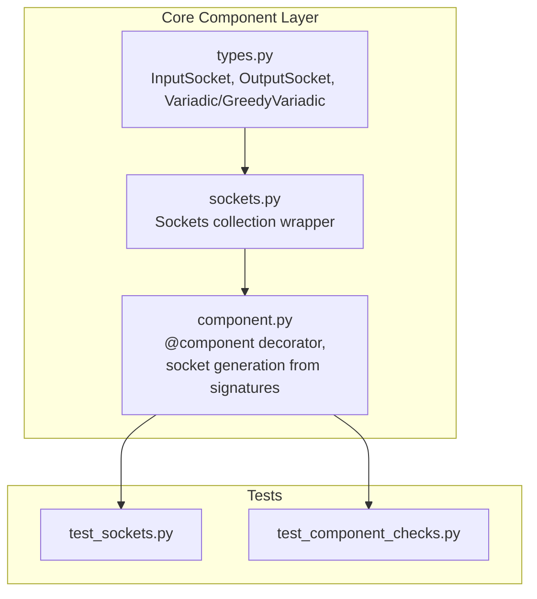
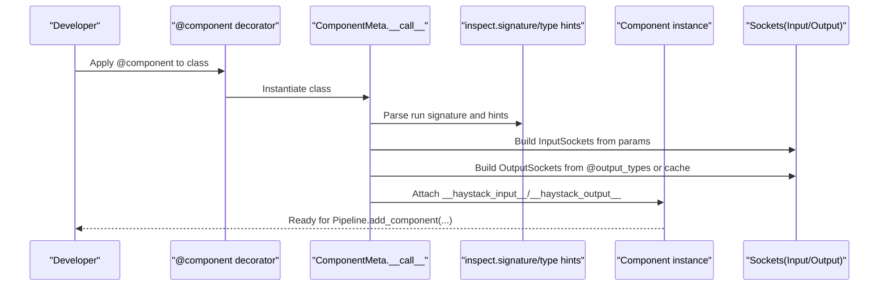
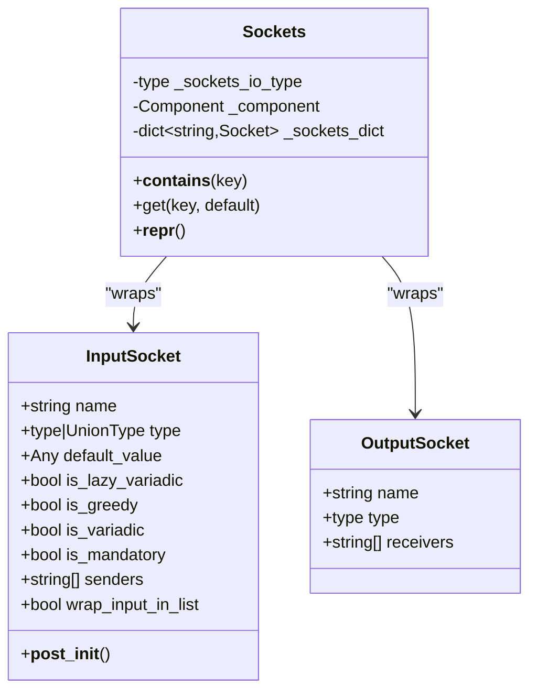
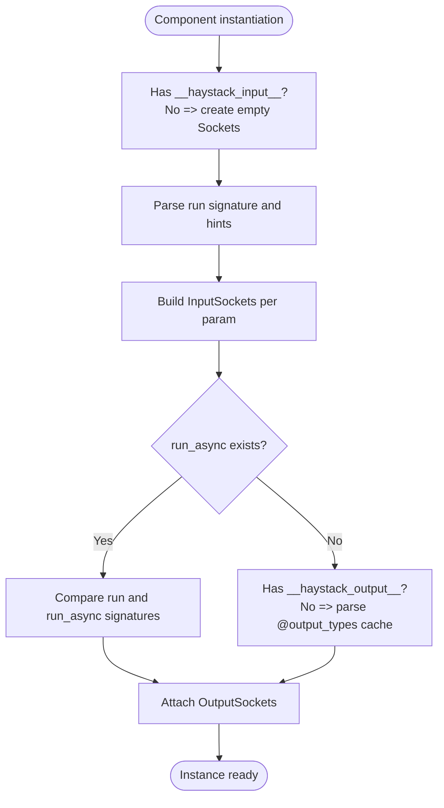
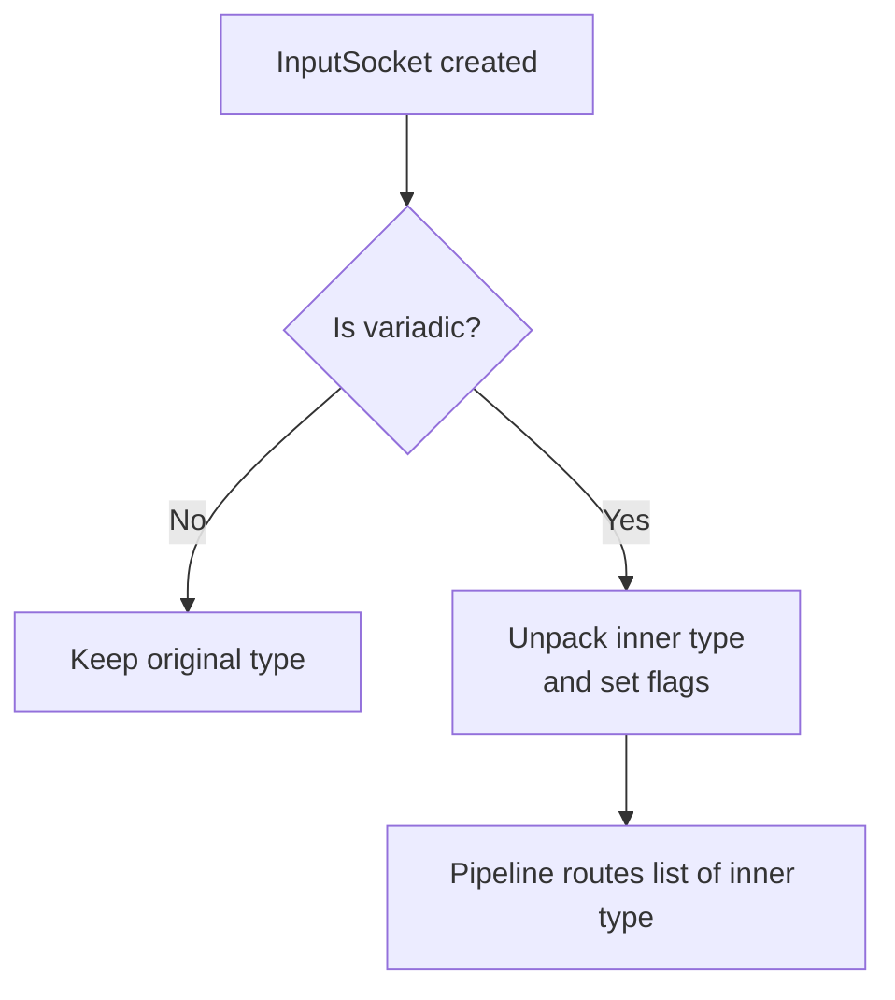
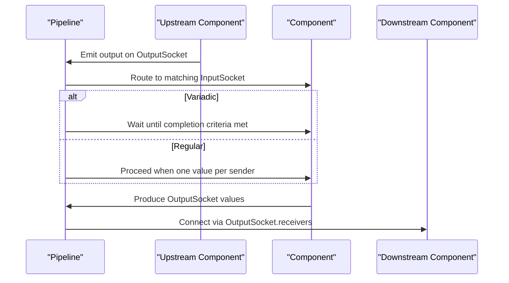
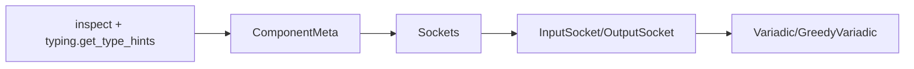

# Socket System

<cite>
**Referenced Files in This Document**
- [sockets.py](file://haystack/core/component/sockets.py)
- [types.py](file://haystack/core/component/types.py)
- [component.py](file://haystack/core/component/component.py)
- [test_sockets.py](file://test/core/component/test_sockets.py)
- [test_component_checks.py](file://test/core/pipeline/test_component_checks.py)
- [component_tool.py](file://haystack/tools/component_tool.py)
- [parameters_schema_utils.py](file://haystack/tools/parameters_schema_utils.py)
</cite>

## Table of Contents
1. [Introduction](#introduction)
2. [Project Structure](#project-structure)
3. [Core Components](#core-components)
4. [Architecture Overview](#architecture-overview)
5. [Detailed Component Analysis](#detailed-component-analysis)
6. [Dependency Analysis](#dependency-analysis)
7. [Performance Considerations](#performance-considerations)
8. [Troubleshooting Guide](#troubleshooting-guide)
9. [Conclusion](#conclusion)
10. [Appendices](#appendices)

## Introduction
This document explains the socket-based input/output system that defines component interfaces in Haystack. Sockets enable type-safe data flow between components by declaring typed inputs and outputs, supporting both automatic inference from method signatures and explicit manual configuration. It covers the InputSocket and OutputSocket classes, their properties and validation mechanisms, type annotations, default values, and parameter validation. It also details how sockets are generated from method signatures, how manual socket configuration works, and how sockets relate to component serialization and the pipeline execution engine. Practical guidance on debugging, common errors, and best practices is included.

## Project Structure
The socket system lives in the core component layer and integrates with the component decorator and pipeline execution. Key files:
- Core socket types and containers
  - [types.py](file://haystack/core/component/types.py): Defines InputSocket, OutputSocket, variadic aliases, and descriptors
  - [sockets.py](file://haystack/core/component/sockets.py): Provides the Sockets collection wrapper and helpers
- Component integration and generation
  - [component.py](file://haystack/core/component/component.py): Implements the @component decorator, socket generation from signatures, and output/input parsing
- Tests and validations
  - [test_sockets.py](file://test/core/component/test_sockets.py): Unit tests for sockets behavior
  - [test_component_checks.py](file://test/core/pipeline/test_component_checks.py): Validates socket semantics like variadic and sender relationships

**Diagram sources**
- [types.py](file://haystack/core/component/types.py#L1-L128)
- [sockets.py](file://haystack/core/component/sockets.py#L1-L144)
- [component.py](file://haystack/core/component/component.py#L1-L645)
- [test_sockets.py](file://test/core/component/test_sockets.py#L1-L88)
- [test_component_checks.py](file://test/core/pipeline/test_component_checks.py#L39-L548)

**Section sources**
- [types.py](file://haystack/core/component/types.py#L1-L128)
- [sockets.py](file://haystack/core/component/sockets.py#L1-L144)
- [component.py](file://haystack/core/component/component.py#L1-L645)
- [test_sockets.py](file://test/core/component/test_sockets.py#L1-L88)
- [test_component_checks.py](file://test/core/pipeline/test_component_checks.py#L39-L548)

## Core Components
This section introduces the central socket types and their roles.

- InputSocket
  - Purpose: Declares a typed input for a component with optional default, variadic flags, sender list, and wrapping behavior for lazy variadic inputs.
  - Key properties:
    - name: str
    - type: type | UnionType
    - default_value: Any (marker for mandatory vs optional)
    - is_lazy_variadic: computed from type annotation
    - is_greedy: computed from type annotation
    - is_variadic: convenience property combining lazy/greedy
    - is_mandatory: derived from default_value
    - senders: list[str] of upstream components
    - wrap_input_in_list: bool for lazy variadic wrapping
  - Validation and unpacking:
    - Detects variadic/greedy via metadata on annotated types
    - Unpacks inner type for variadic inputs to simplify pipeline matching

- OutputSocket
  - Purpose: Declares a typed output for a component with downstream receiver list.
  - Key properties:
    - name: str
    - type: type
    - receivers: list[str] of downstream components

- Sockets
  - Purpose: A wrapper around a dict of sockets that exposes them as attributes and supports lookup, containment, and pretty printing.
  - Notable behaviors:
    - Attribute access delegates to the underlying sockets dict
    - Supports get(key, default) and membership checks
    - Pretty-print shows Inputs or Outputs header followed by typed socket entries

**Section sources**
- [types.py](file://haystack/core/component/types.py#L36-L127)
- [sockets.py](file://haystack/core/component/sockets.py#L15-L144)

## Architecture Overview
The socket system is part of the component lifecycle orchestrated by the @component decorator. At instantiation, the metaclass inspects the component’s run method signature to build InputSockets, and it reads output type specifications to build OutputSockets. These sockets are attached to the component instance and later consumed by the pipeline to route data safely.

**Diagram sources**
- [component.py](file://haystack/core/component/component.py#L232-L330)
- [types.py](file://haystack/core/component/types.py#L36-L127)
- [sockets.py](file://haystack/core/component/sockets.py#L15-L144)

## Detailed Component Analysis

### InputSocket and OutputSocket Classes
This section examines the classes that define typed component I/O and their behavior.

**Diagram sources**
- [types.py](file://haystack/core/component/types.py#L36-L127)
- [sockets.py](file://haystack/core/component/sockets.py#L15-L144)

Key behaviors:
- Variadic detection and unpacking:
  - Lazy and greedy variadic types are detected via metadata on annotated types.
  - For variadic inputs, the inner type is extracted to simplify pipeline matching.
- Mandatory vs optional:
  - is_mandatory is true when default_value is unset.
- Attribute access:
  - Sockets exposes sockets as attributes for ergonomic access.

Validation and error conditions:
- Mismatched run/run_async signatures are detected and reported with a detailed diff.
- Cannot set input types on components without a kwargs parameter in run.
- Cannot call set_output_types on components already decorated with @output_types.

**Section sources**
- [types.py](file://haystack/core/component/types.py#L36-L127)
- [sockets.py](file://haystack/core/component/sockets.py#L15-L144)
- [component.py](file://haystack/core/component/component.py#L420-L532)
- [component.py](file://haystack/core/component/component.py#L361-L400)

### Automatic Socket Generation from Method Signatures
When a component does not explicitly configure inputs/outputs, the decorator infers them from the run method signature and type hints.

- Input sockets:
  - For each parameter in run (excluding self, *args, **kwargs), create an InputSocket from the annotation and default.
  - If defaults exist, they propagate to default_value.
  - If run_async exists, its signature must match run exactly (including kinds, defaults, and annotations).
- Output sockets:
  - If decorated with @output_types, the cache is copied to the instance.
  - If not decorated, outputs are inferred from the return mapping shape (handled elsewhere in the pipeline).

**Diagram sources**
- [component.py](file://haystack/core/component/component.py#L232-L330)
- [component.py](file://haystack/core/component/component.py#L208-L230)

**Section sources**
- [component.py](file://haystack/core/component/component.py#L232-L330)
- [component.py](file://haystack/core/component/component.py#L208-L230)

### Manual Socket Configuration
Components can manually specify inputs and outputs when using kwargs-based run methods or when precise control is needed.

- set_input_types(instance, **types):
  - Creates InputSockets for each provided name/type pair.
  - Enforces that the component’s run method accepts **kwargs.
- set_input_type(instance, name, type, default=_empty):
  - Adds or replaces a single input socket.
- set_output_types(instance, **types):
  - Creates OutputSockets for each provided name/type pair.
  - Enforces that the component is not already decorated with @output_types.

These methods attach Sockets collections to the instance for later pipeline consumption.

**Section sources**
- [component.py](file://haystack/core/component/component.py#L420-L532)

### Variadic and Greedy Variadic Semantics
Variadic inputs allow collecting multiple upstream values. GreedyVariadic triggers immediate execution upon receiving the first input, while lazy variadic waits for all senders to produce.

- Variadic detection:
  - Uses metadata on annotated types to detect lazy and greedy variants.
- Inner type unpacking:
  - For variadic inputs, the pipeline sees the inner element type.
- Sender relationships:
  - senders lists upstream components; used by pipeline completion logic.

**Diagram sources**
- [types.py](file://haystack/core/component/types.py#L76-L101)
- [test_component_checks.py](file://test/core/pipeline/test_component_checks.py#L39-L120)

**Section sources**
- [types.py](file://haystack/core/component/types.py#L17-L30)
- [types.py](file://haystack/core/component/types.py#L76-L101)
- [test_component_checks.py](file://test/core/pipeline/test_component_checks.py#L39-L120)

### Socket Inheritance and Overrides
- Explicitly configured sockets take precedence over inferred ones.
- If a component sets input types manually, those sockets cannot conflict with the run method’s parameters; mismatches raise an error.
- run and run_async must have identical signatures; otherwise, a detailed comparison error is raised.

Practical implication:
- Prefer explicit configuration when you need to override or extend inferred parameters.

**Section sources**
- [component.py](file://haystack/core/component/component.py#L258-L268)
- [component.py](file://haystack/core/component/component.py#L288-L292)

### Relationship Between Sockets and Component Serialization
- Components persist init parameters for serialization; sockets themselves are reconstructed at runtime from the component class and method signatures.
- The component registry stores the fully qualified class path to enable deserialization.

Implications:
- Changing method signatures or decorators affects socket definitions and thus component compatibility across versions.

**Section sources**
- [component.py](file://haystack/core/component/component.py#L594-L620)

### Integration with Pipeline Execution Engine
- Sockets drive pipeline routing:
  - Inputs: pipeline ensures all mandatory inputs are satisfied and variadic inputs meet completion criteria.
  - Outputs: pipeline routes outputs to downstream receivers based on OutputSocket.receivers.
- Completion logic:
  - Regular inputs require one value per sender.
  - Variadic inputs require values from all senders (lazy) or first input received (greedy).

**Diagram sources**
- [types.py](file://haystack/core/component/types.py#L112-L127)
- [test_component_checks.py](file://test/core/pipeline/test_component_checks.py#L532-L548)

**Section sources**
- [types.py](file://haystack/core/component/types.py#L112-L127)
- [test_component_checks.py](file://test/core/pipeline/test_component_checks.py#L532-L548)

## Dependency Analysis
The socket system depends on:
- Type introspection via inspect and typing.get_type_hints
- Variadic/GreedyVariadic annotations for variadic semantics
- Sockets collection wrapper for ergonomic attribute access
- Component decorator for attaching sockets to instances

**Diagram sources**
- [component.py](file://haystack/core/component/component.py#L232-L330)
- [types.py](file://haystack/core/component/types.py#L17-L30)

**Section sources**
- [component.py](file://haystack/core/component/component.py#L232-L330)
- [types.py](file://haystack/core/component/types.py#L17-L30)

## Performance Considerations
- Signature inspection occurs at component instantiation; keep run method signatures concise and avoid overly complex type hints to minimize overhead.
- Variadic inputs introduce additional coordination logic; prefer greedy variadic only when appropriate to reduce waiting.
- Attribute access on Sockets is O(1); dictionary updates are minimal and occur during decoration.

## Troubleshooting Guide
Common issues and resolutions:
- Mismatched run/run_async signatures:
  - Symptom: Detailed error listing differences in parameter names, types, defaults, or kinds.
  - Resolution: Align both methods’ signatures exactly.
  - Reference: [component.py](file://haystack/core/component/component.py#L361-L400)
- Attempting to set input types on non-kwargs components:
  - Symptom: ComponentError indicating the run method lacks a kwargs parameter.
  - Resolution: Add **kwargs to run or use explicit input configuration.
  - Reference: [component.py](file://haystack/core/component/component.py#L440-L443)
- Conflicting manual input configuration:
  - Symptom: Error when manual sockets differ from run method parameters.
  - Resolution: Ensure manual configuration matches run signature.
  - Reference: [component.py](file://haystack/core/component/component.py#L263-L265)
- No OutputSockets defined when connecting components:
  - Symptom: Informative error when sender has no outputs.
  - Resolution: Add @output_types or set_output_types to the sender.
  - Reference: [test_component_checks.py](file://test/core/pipeline/test_component_checks.py#L1-L3)

Debugging tips:
- Use repr on component instances to inspect current sockets.
- Verify variadic semantics by checking is_lazy_variadic and is_greedy flags.
- Confirm sender/receiver relationships via senders and receivers lists.

**Section sources**
- [component.py](file://haystack/core/component/component.py#L361-L400)
- [component.py](file://haystack/core/component/component.py#L440-L443)
- [component.py](file://haystack/core/component/component.py#L263-L265)
- [test_component_checks.py](file://test/core/pipeline/test_component_checks.py#L1-L3)

## Conclusion
The socket system provides a robust, type-safe foundation for component interfaces in Haystack. By combining automatic signature-based inference with manual configuration, it supports flexible component designs while ensuring predictable pipeline execution. Understanding InputSocket and OutputSocket properties, variadic semantics, and the decorator-driven lifecycle enables developers to build reliable, maintainable components.

## Appendices

### Socket Configuration Patterns
- kwargs-based components:
  - Use set_input_types/set_input_type to declare inputs and optionally set defaults.
  - Reference: [component.py](file://haystack/core/component/component.py#L420-L497)
- Explicit outputs:
  - Use @component.output_types or set_output_types to define outputs.
  - Reference: [component.py](file://haystack/core/component/component.py#L534-L532)
- Variadic inputs:
  - Use Variadic for lazy accumulation and GreedyVariadic for eager execution.
  - Reference: [types.py](file://haystack/core/component/types.py#L17-L30)
- Tool integration:
  - Tools rely on parameter schema utilities; ensure socket-compatible signatures for tool-based components.
  - References: [component_tool.py](file://haystack/tools/component_tool.py), [parameters_schema_utils.py](file://haystack/tools/parameters_schema_utils.py)