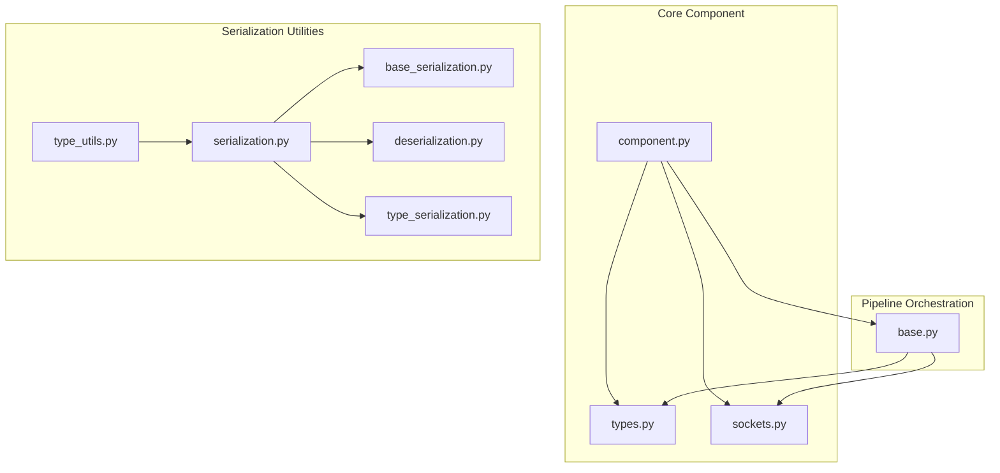
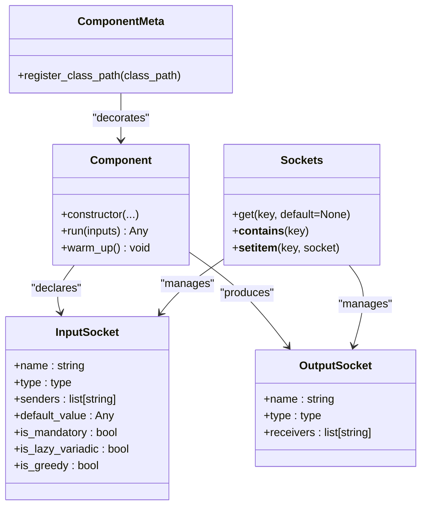
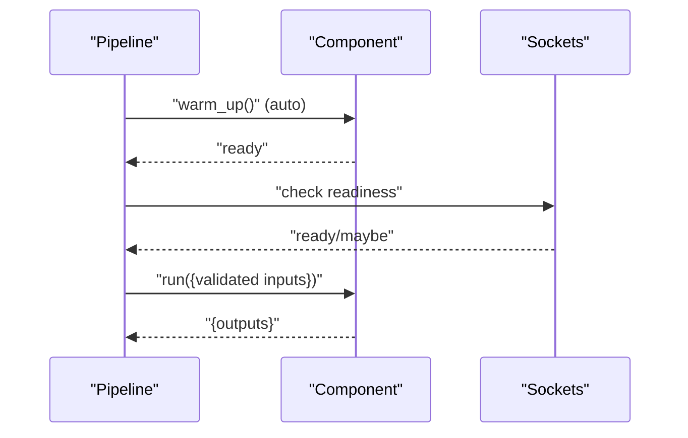
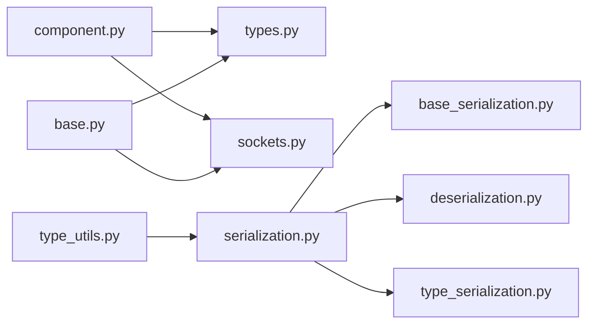

# Component Interfaces and Contracts

<cite>
**Referenced Files in This Document**
- [component.py](file://haystack/core/component/component.py)
- [types.py](file://haystack/core/component/types.py)
- [sockets.py](file://haystack/core/component/sockets.py)
- [_component.py](file://haystack/testing/factory/_component.py)
- [test_sockets.py](file://test/core/component/test_sockets.py)
- [test_component_checks.py](file://test/core/pipeline/test_component_checks.py)
- [base.py](file://haystack/core/pipeline/base.py)
- [serialization.py](file://haystack/core/serialization.py)
- [type_utils.py](file://haystack/core/type_utils.py)
- [base_serialization.py](file://haystack/utils/base_serialization.py)
- [deserialization.py](file://haystack/utils/deserialization.py)
- [type_serialization.py](file://haystack/utils/type_serialization.py)
- [test_pipeline_base.py](file://test/core/pipeline/test_pipeline_base.py)
- [test_pipeline_base.py](file://test/core/pipeline/test_pipeline_base.py)
- [refactor-warm-up-components-c2777fef28a70b61.yaml](file://releasenotes/notes/refactor-warm-up-components-c2777fef28a70b61.yaml)
- [remove-deprecated-argument-from-component-decorator-9af6940bc60795d0.yaml](file://releasenotes/notes/remove-deprecated-argument-from-component-decorator-9af6940bc60795d0.yaml)
</cite>

## Table of Contents
1. [Introduction](#introduction)
2. [Project Structure](#project-structure)
3. [Core Components](#core-components)
4. [Architecture Overview](#architecture-overview)
5. [Detailed Component Analysis](#detailed-component-analysis)
6. [Dependency Analysis](#dependency-analysis)
7. [Performance Considerations](#performance-considerations)
8. [Troubleshooting Guide](#troubleshooting-guide)
9. [Conclusion](#conclusion)
10. [Appendices](#appendices)

## Introduction
This document defines the component interfaces and contracts in Haystack. It explains the component protocol, socket system for input/output specification (including type safety, validation, and defaults), lifecycle contract (initialization, warm-up, execution, and serialization), registration and discovery mechanisms, serialization and deserialization interfaces, naming conventions, and compatibility/versioning considerations. It also provides guidance for maintaining interface consistency when extending the framework.

## Project Structure
The component system is centered around three core modules:
- Component definition and decorator: [component.py](file://haystack/core/component/component.py)
- Socket types and descriptors: [types.py](file://haystack/core/component/types.py) and [sockets.py](file://haystack/core/component/sockets.py)
- Pipeline orchestration and socket utilities: [base.py](file://haystack/core/pipeline/base.py)
- Serialization and type utilities: [serialization.py](file://haystack/core/serialization.py), [type_utils.py](file://haystack/core/type_utils.py), [base_serialization.py](file://haystack/utils/base_serialization.py), [deserialization.py](file://haystack/utils/deserialization.py), [type_serialization.py](file://haystack/utils/type_serialization.py)
- Tests validating sockets and readiness: [test_sockets.py](file://test/core/component/test_sockets.py), [test_component_checks.py](file://test/core/pipeline/test_component_checks.py), [test_pipeline_base.py](file://test/core/pipeline/test_pipeline_base.py)

**Diagram sources**
- [component.py](file://haystack/core/component/component.py#L589-L644)
- [types.py](file://haystack/core/component/types.py#L97-L127)
- [sockets.py](file://haystack/core/component/sockets.py#L76-L113)
- [base.py](file://haystack/core/pipeline/base.py#L1543-L1580)
- [serialization.py](file://haystack/core/serialization.py)
- [type_utils.py](file://haystack/core/type_utils.py)
- [base_serialization.py](file://haystack/utils/base_serialization.py)
- [deserialization.py](file://haystack/utils/deserialization.py)
- [type_serialization.py](file://haystack/utils/type_serialization.py)

**Section sources**
- [component.py](file://haystack/core/component/component.py#L589-L644)
- [types.py](file://haystack/core/component/types.py#L97-L127)
- [sockets.py](file://haystack/core/component/sockets.py#L76-L113)
- [base.py](file://haystack/core/pipeline/base.py#L1543-L1580)
- [serialization.py](file://haystack/core/serialization.py)
- [type_utils.py](file://haystack/core/type_utils.py)
- [base_serialization.py](file://haystack/utils/base_serialization.py)
- [deserialization.py](file://haystack/utils/deserialization.py)
- [type_serialization.py](file://haystack/utils/type_serialization.py)

## Core Components
This section documents the core interfaces and contracts that all Haystack components must satisfy.

- Component decorator and registration
  - Components are declared via a decorator that registers them globally for deserialization. The decorator saves the class path in a registry and logs registration events.
  - Registration ensures components can be reconstructed from serialized form.
  - See [component.py](file://haystack/core/component/component.py#L589-L644).

- Socket system
  - Input sockets: define typed inputs, sender relationships, and optional default values. Variadic sockets support lazy and greedy collection semantics.
  - Output sockets: define typed outputs and receiver lists.
  - Socket descriptors provide type introspection and normalization for variadic types.
  - See [types.py](file://haystack/core/component/types.py#L97-L127) and [sockets.py](file://haystack/core/component/sockets.py#L76-L113).

- Pipeline orchestration
  - Utilities manage socket readiness, variadic input aggregation, and writing to sockets.
  - See [base.py](file://haystack/core/pipeline/base.py#L1543-L1580).

- Lifecycle contract
  - Initialization: constructor and configuration.
  - Warm-up: optional method invoked automatically on first use.
  - Execution: main processing method with validated inputs.
  - Serialization: component-specific serialization and deserialization.
  - See [refactor-warm-up-components-c2777fef28a70b61.yaml](file://releasenotes/notes/refactor-warm-up-components-c2777fef28a70b61.yaml).

- Naming and identifiers
  - Components are identified by their fully qualified class path used during registration.
  - See [component.py](file://haystack/core/component/component.py#L589-L644).

**Section sources**
- [component.py](file://haystack/core/component/component.py#L589-L644)
- [types.py](file://haystack/core/component/types.py#L97-L127)
- [sockets.py](file://haystack/core/component/sockets.py#L76-L113)
- [base.py](file://haystack/core/pipeline/base.py#L1543-L1580)
- [refactor-warm-up-components-c2777fef28a70b61.yaml](file://releasenotes/notes/refactor-warm-up-components-c2777fef28a70b61.yaml)

## Architecture Overview
The component architecture centers on the decorator-driven registration, socket-based I/O contracts, and pipeline orchestration.

**Diagram sources**
- [component.py](file://haystack/core/component/component.py#L589-L644)
- [types.py](file://haystack/core/component/types.py#L97-L127)
- [sockets.py](file://haystack/core/component/sockets.py#L76-L113)

## Detailed Component Analysis

### Component Protocol and Interface Requirements
- Declaration and registration
  - Components are declared using a decorator that:
    - Replaces the class with a new type using a specific metaclass.
    - Registers the component under its fully qualified class path.
    - Overrides the default representation for consistent display.
  - Registration enables deserialization and discovery.
  - See [component.py](file://haystack/core/component/component.py#L589-L644).

- Interface contract
  - Components must expose:
    - A constructor accepting validated configuration.
    - An execution method that accepts a dictionary of validated inputs and returns a dictionary of outputs.
    - Optional warm-up hook for resource initialization.
  - The decorator enforces the presence of input/output socket definitions and metadata.
  - See [component.py](file://haystack/core/component/component.py#L589-L644).

**Section sources**
- [component.py](file://haystack/core/component/component.py#L589-L644)

### Socket System: Inputs and Outputs
- Input sockets
  - Typed inputs with optional defaults.
  - Sender tracking for pipeline connectivity.
  - Variadic support:
    - Lazy variadic collects all sender-provided values.
    - Greedy variadic consumes the first valid input and leaves others for subsequent runs.
  - Type descriptor normalizes variadic inner types for consistent validation.
  - See [types.py](file://haystack/core/component/types.py#L97-L127) and [sockets.py](file://haystack/core/component/sockets.py#L76-L113).

- Output sockets
  - Define the output type and list of receiving components.
  - Used by the pipeline to route data.
  - See [types.py](file://haystack/core/component/types.py#L112-L127).

- Socket containers
  - Sockets container supports dynamic updates and safe retrieval.
  - Enables runtime manipulation during component decoration.
  - See [sockets.py](file://haystack/core/component/sockets.py#L76-L113).

**Section sources**
- [types.py](file://haystack/core/component/types.py#L97-L127)
- [sockets.py](file://haystack/core/component/sockets.py#L76-L113)

### Type Safety, Validation, and Defaults
- Type safety
  - Input and output types are enforced at runtime via socket descriptors and pipeline checks.
  - Variadic inner types are normalized for consistent validation.
  - See [types.py](file://haystack/core/component/types.py#L97-L127).

- Validation
  - Socket readiness:
    - Mandatory sockets must be satisfied.
    - Optional sockets with defaults are acceptable when absent.
    - Variadic sockets require all senders to produce valid outputs (lazy) or at least one valid input (greedy).
  - Tests demonstrate readiness logic for various combinations.
  - See [test_component_checks.py](file://test/core/pipeline/test_component_checks.py#L268-L307) and [test_pipeline_base.py](file://test/core/pipeline/test_pipeline_base.py#L1435-L1464).

- Default values
  - Optional input sockets may specify default values; missing inputs are replaced accordingly.
  - See [test_component_checks.py](file://test/core/pipeline/test_component_checks.py#L268-L278).

**Section sources**
- [types.py](file://haystack/core/component/types.py#L97-L127)
- [test_component_checks.py](file://test/core/pipeline/test_component_checks.py#L268-L307)
- [test_pipeline_base.py](file://test/core/pipeline/test_pipeline_base.py#L1435-L1464)

### Component Lifecycle Contract
- Initialization
  - Constructor receives validated configuration; component attributes are set according to socket definitions.
- Warm-up
  - Optional warm_up hook is invoked automatically on first use to prepare resources.
  - See [refactor-warm-up-components-c2777fef28a70b61.yaml](file://releasenotes/notes/refactor-warm-up-components-c2777fef28a70b61.yaml).
- Execution
  - run(inputs) consumes validated inputs and produces outputs.
  - Variadic inputs are aggregated per lazy/greedy semantics.
  - See [base.py](file://haystack/core/pipeline/base.py#L1543-L1580) and [test_pipeline_base.py](file://test/core/pipeline/test_pipeline_base.py#L1435-L1464).
- Serialization
  - Components serialize and deserialize using the core serialization utilities.
  - See [serialization.py](file://haystack/core/serialization.py) and related utilities.

**Diagram sources**
- [refactor-warm-up-components-c2777fef28a70b61.yaml](file://releasenotes/notes/refactor-warm-up-components-c2777fef28a70b61.yaml)
- [base.py](file://haystack/core/pipeline/base.py#L1543-L1580)

**Section sources**
- [refactor-warm-up-components-c2777fef28a70b61.yaml](file://releasenotes/notes/refactor-warm-up-components-c2777fef28a70b61.yaml)
- [base.py](file://haystack/core/pipeline/base.py#L1543-L1580)
- [serialization.py](file://haystack/core/serialization.py)

### Component Registration and Discovery
- Registration
  - The decorator saves the component under its fully qualified class path in a global registry.
  - Duplicate registrations log a debug message and keep the last seen module.
  - See [component.py](file://haystack/core/component/component.py#L589-L644).

- Discovery
  - Deserialization reconstructs components using the registry keyed by class path.
  - Serialization writes the class path alongside component data.
  - See [serialization.py](file://haystack/core/serialization.py) and [base_serialization.py](file://haystack/utils/base_serialization.py).

**Section sources**
- [component.py](file://haystack/core/component/component.py#L589-L644)
- [serialization.py](file://haystack/core/serialization.py)
- [base_serialization.py](file://haystack/utils/base_serialization.py)

### Serialization and Deserialization Interfaces
- Component serialization
  - Components implement serialization logic to persist state and configuration.
  - Uses core serialization utilities and type serializers.
  - See [serialization.py](file://haystack/core/serialization.py), [type_serialization.py](file://haystack/utils/type_serialization.py).

- Deserialization
  - Reconstructs components from stored data using the registry and deserialization utilities.
  - See [deserialization.py](file://haystack/utils/deserialization.py) and [base_serialization.py](file://haystack/utils/base_serialization.py).

- Type utilities
  - Provides helpers for type introspection and safe serialization of complex types.
  - See [type_utils.py](file://haystack/core/type_utils.py).

**Section sources**
- [serialization.py](file://haystack/core/serialization.py)
- [deserialization.py](file://haystack/utils/deserialization.py)
- [base_serialization.py](file://haystack/utils/base_serialization.py)
- [type_serialization.py](file://haystack/utils/type_serialization.py)
- [type_utils.py](file://haystack/core/type_utils.py)

### Component Naming Conventions and Identifiers
- Fully qualified class path
  - Components are identified by their module path plus class name.
  - This convention ensures uniqueness and enables reliable registration and deserialization.
  - See [component.py](file://haystack/core/component/component.py#L589-L644).

**Section sources**
- [component.py](file://haystack/core/component/component.py#L589-L644)

### Examples of Implementation and Validation
- Socket containers usage
  - Demonstrates retrieving sockets, containment checks, and dynamic updates.
  - See [test_sockets.py](file://test/core/component/test_sockets.py#L59-L87).

- Socket readiness and variadic behavior
  - Validates mandatory vs optional sockets, default values, and lazy/greedy variadic semantics.
  - See [test_component_checks.py](file://test/core/pipeline/test_component_checks.py#L268-L307) and [test_pipeline_base.py](file://test/core/pipeline/test_pipeline_base.py#L1435-L1464).

**Section sources**
- [test_sockets.py](file://test/core/component/test_sockets.py#L59-L87)
- [test_component_checks.py](file://test/core/pipeline/test_component_checks.py#L268-L307)
- [test_pipeline_base.py](file://test/core/pipeline/test_pipeline_base.py#L1435-L1464)

### Compatibility Requirements and Versioning Considerations
- Deprecated APIs
  - Removal of deprecated arguments from the component decorator (e.g., is_greedy) encourages migration to newer variadic types.
  - See [remove-deprecated-argument-from-component-decorator-9af6940bc60795d0.yaml](file://releasenotes/notes/remove-deprecated-argument-from-component-decorator-9af6940bc60795d0.yaml).

- Consistency improvements
  - Changes to warm-up behavior improve consistency across the codebase.
  - See [refactor-warm-up-components-c2777fef28a70b61.yaml](file://releasenotes/notes/refactor-warm-up-components-c2777fef28a70b61.yaml).

**Section sources**
- [remove-deprecated-argument-from-component-decorator-9af6940bc60795d0.yaml](file://releasenotes/notes/remove-deprecated-argument-from-component-decorator-9af6940bc60795d0.yaml)
- [refactor-warm-up-components-c2777fef28a70b61.yaml](file://releasenotes/notes/refactor-warm-up-components-c2777fef28a70b61.yaml)

### Maintaining Interface Consistency When Extending the Framework
- Use the component decorator consistently to ensure registration and proper socket metadata.
- Keep input/output sockets typed and explicit; avoid ambiguous defaults.
- Normalize variadic types using supported descriptors to maintain validation consistency.
- Preserve backward-compatible serialization by keeping class paths stable and evolving types carefully.
- Validate readiness and variadic behavior in tests mirroring real pipeline scenarios.

[No sources needed since this section provides general guidance]

## Dependency Analysis
This section maps key dependencies among component-related modules.

**Diagram sources**
- [component.py](file://haystack/core/component/component.py#L589-L644)
- [types.py](file://haystack/core/component/types.py#L97-L127)
- [sockets.py](file://haystack/core/component/sockets.py#L76-L113)
- [base.py](file://haystack/core/pipeline/base.py#L1543-L1580)
- [serialization.py](file://haystack/core/serialization.py)
- [base_serialization.py](file://haystack/utils/base_serialization.py)
- [deserialization.py](file://haystack/utils/deserialization.py)
- [type_serialization.py](file://haystack/utils/type_serialization.py)
- [type_utils.py](file://haystack/core/type_utils.py)

**Section sources**
- [component.py](file://haystack/core/component/component.py#L589-L644)
- [types.py](file://haystack/core/component/types.py#L97-L127)
- [sockets.py](file://haystack/core/component/sockets.py#L76-L113)
- [base.py](file://haystack/core/pipeline/base.py#L1543-L1580)
- [serialization.py](file://haystack/core/serialization.py)
- [base_serialization.py](file://haystack/utils/base_serialization.py)
- [deserialization.py](file://haystack/utils/deserialization.py)
- [type_serialization.py](file://haystack/utils/type_serialization.py)
- [type_utils.py](file://haystack/core/type_utils.py)

## Performance Considerations
- Variadic input handling
  - Lazy variadic sockets collect all inputs; ensure upstream components do not flood memory unnecessarily.
  - Greedy variadic sockets consume only the first valid input; design pipelines to minimize repeated invocations.
- Socket readiness checks
  - Prefer minimal socket counts and clear defaults to reduce readiness computation overhead.
- Serialization cost
  - Keep serialized payloads compact; avoid serializing large transient data structures.

[No sources needed since this section provides general guidance]

## Troubleshooting Guide
- Socket readiness failures
  - Verify mandatory sockets are satisfied and optional sockets have defaults when absent.
  - Confirm variadic sockets have all senders produce valid outputs (lazy) or at least one valid input (greedy).
  - See [test_component_checks.py](file://test/core/pipeline/test_component_checks.py#L268-L307).

- Variadic input aggregation
  - Inspect lazy/greedy behavior and ensure inputs are written correctly to sockets.
  - See [base.py](file://haystack/core/pipeline/base.py#L1543-L1580) and [test_pipeline_base.py](file://test/core/pipeline/test_pipeline_base.py#L1435-L1464).

- Registration and deserialization issues
  - Ensure the fully qualified class path matches the registered entry.
  - Check that the registry contains the expected class path and that deserialization uses the correct module/class.
  - See [component.py](file://haystack/core/component/component.py#L589-L644) and [base_serialization.py](file://haystack/utils/base_serialization.py).

**Section sources**
- [test_component_checks.py](file://test/core/pipeline/test_component_checks.py#L268-L307)
- [base.py](file://haystack/core/pipeline/base.py#L1543-L1580)
- [test_pipeline_base.py](file://test/core/pipeline/test_pipeline_base.py#L1435-L1464)
- [component.py](file://haystack/core/component/component.py#L589-L644)
- [base_serialization.py](file://haystack/utils/base_serialization.py)

## Conclusion
Haystack’s component system enforces strong contracts through a decorator-driven registration, typed socket I/O, and pipeline-managed readiness and execution. Variadic inputs, defaults, and automatic warm-up simplify practical usage while preserving flexibility. Serialization and deserialization rely on stable class paths, ensuring robust persistence and discovery. Following the guidelines in this document helps maintain interface consistency and compatibility as the framework evolves.

[No sources needed since this section summarizes without analyzing specific files]

## Appendices
- Example references
  - Socket container usage: [test_sockets.py](file://test/core/component/test_sockets.py#L59-L87)
  - Socket readiness and variadic behavior: [test_component_checks.py](file://test/core/pipeline/test_component_checks.py#L268-L307), [test_pipeline_base.py](file://test/core/pipeline/test_pipeline_base.py#L1435-L1464)
  - Registration and warm-up behavior: [component.py](file://haystack/core/component/component.py#L589-L644), [refactor-warm-up-components-c2777fef28a70b61.yaml](file://releasenotes/notes/refactor-warm-up-components-c2777fef28a70b61.yaml)

[No sources needed since this section aggregates references already cited above]