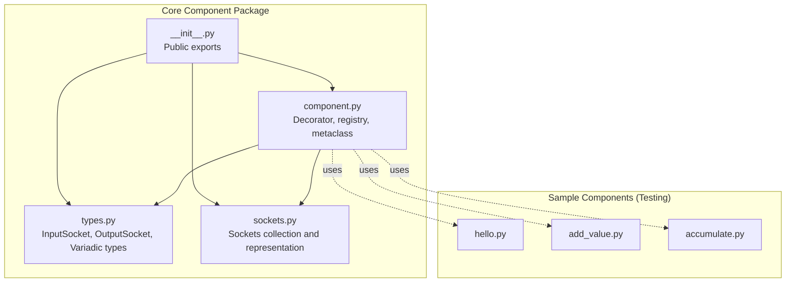
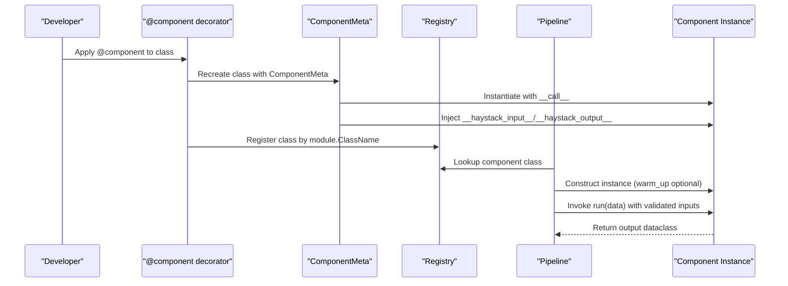
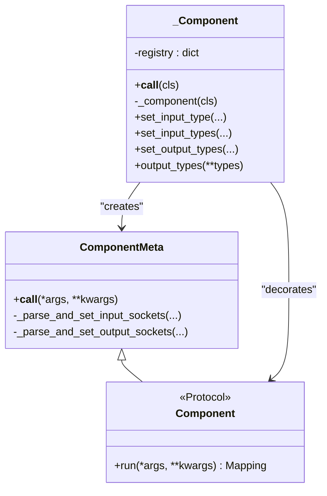
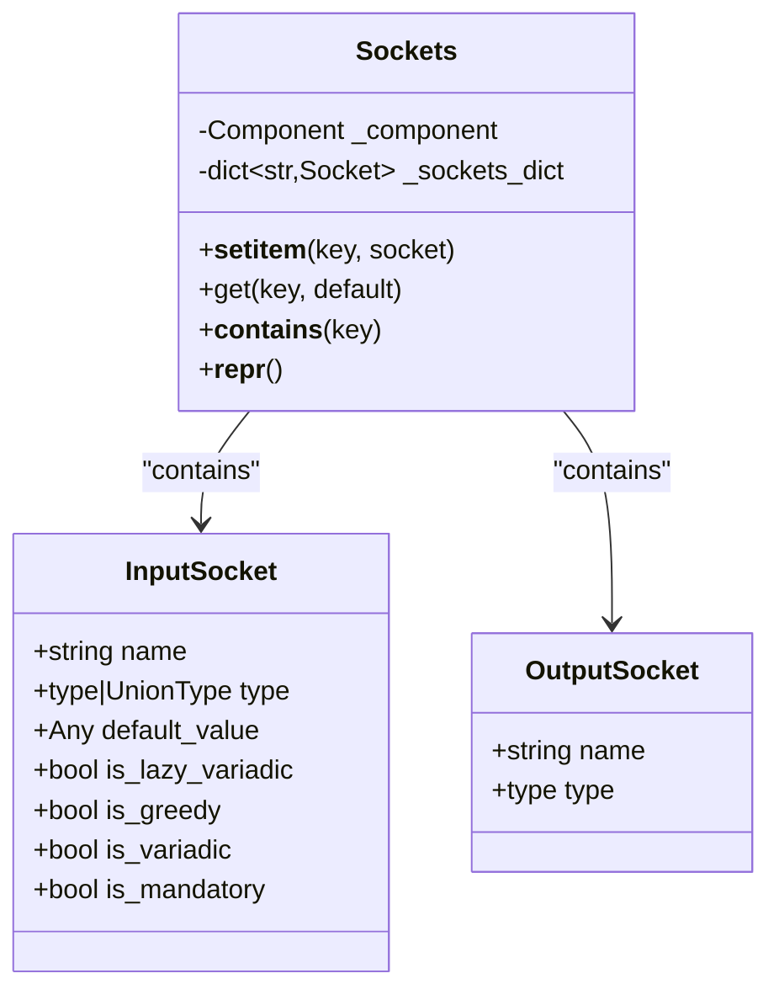
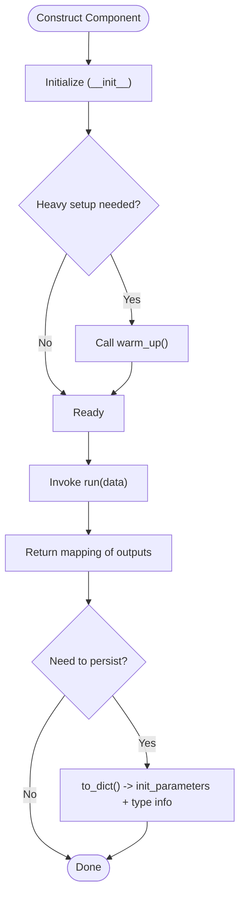
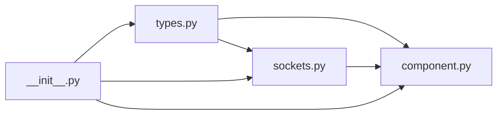

# Component System

<cite>
**Referenced Files in This Document**
- [component.py](file://haystack/core/component/component.py)
- [types.py](file://haystack/core/component/types.py)
- [sockets.py](file://haystack/core/component/sockets.py)
- [__init__.py](file://haystack/core/component/__init__.py)
- [accumulate.py](file://haystack/testing/sample_components/accumulate.py)
- [add_value.py](file://haystack/testing/sample_components/add_value.py)
- [hello.py](file://haystack/testing/sample_components/hello.py)
</cite>

## Table of Contents
1. [Introduction](#introduction)
2. [Project Structure](#project-structure)
3. [Core Components](#core-components)
4. [Architecture Overview](#architecture-overview)
5. [Detailed Component Analysis](#detailed-component-analysis)
6. [Dependency Analysis](#dependency-analysis)
7. [Performance Considerations](#performance-considerations)
8. [Troubleshooting Guide](#troubleshooting-guide)
9. [Conclusion](#conclusion)
10. [Appendices](#appendices)

## Introduction
This document explains Haystack’s component system architecture with a focus on the decorator pattern, registration mechanism, socket-based input/output specification, lifecycle, categories, composition patterns, and best practices for building custom components. It also covers interfaces, parameter specifications, return value contracts, testing strategies, debugging techniques, and extension guidelines.

## Project Structure
The component system is centered in the core component package. The public API exposes the decorator and socket types, while the implementation handles discovery, registration, and runtime orchestration.

**Diagram sources**
- [component.py](file://haystack/core/component/component.py#L1-L645)
- [types.py](file://haystack/core/component/types.py#L1-L128)
- [sockets.py](file://haystack/core/component/sockets.py#L1-L144)
- [__init__.py](file://haystack/core/component/__init__.py#L1-L9)
- [hello.py](file://haystack/testing/sample_components/hello.py#L1-L14)
- [add_value.py](file://haystack/testing/sample_components/add_value.py#L1-L25)
- [accumulate.py](file://haystack/testing/sample_components/accumulate.py#L1-L84)

**Section sources**
- [__init__.py](file://haystack/core/component/__init__.py#L1-L9)
- [component.py](file://haystack/core/component/component.py#L1-L645)
- [types.py](file://haystack/core/component/types.py#L1-L128)
- [sockets.py](file://haystack/core/component/sockets.py#L1-L144)

## Core Components
- Component decorator: Validates structure, registers classes, and ensures type-safe sockets.
- Socket types: Define typed inputs and outputs with metadata for variadic behavior and defaults.
- Sockets collection: Aggregates sockets per component and supports dynamic updates.
- Component protocol: Defines the minimal interface for runtime checks.

Key responsibilities:
- Registration: The decorator records component classes in a registry keyed by module-qualified class name.
- Discovery: Pipeline and other consumers rely on the registry to reconstruct components.
- Type safety: Input and output sockets capture type annotations and defaults; variadic variants enable flexible multi-input wiring.
- Lifecycle: Components expose initialization, optional warm-up, execution, and serialization hooks.

**Section sources**
- [component.py](file://haystack/core/component/component.py#L136-L185)
- [component.py](file://haystack/core/component/component.py#L406-L645)
- [types.py](file://haystack/core/component/types.py#L36-L128)
- [sockets.py](file://haystack/core/component/sockets.py#L15-L144)

## Architecture Overview
The component system uses a decorator-driven registration model with a metaclass to inject sockets and enforce contracts. At runtime, pipelines orchestrate component execution by connecting sockets and invoking run methods.

**Diagram sources**
- [component.py](file://haystack/core/component/component.py#L572-L645)
- [component.py](file://haystack/core/component/component.py#L294-L330)

## Detailed Component Analysis

### Decorator Pattern and Registration Mechanism
- The decorator validates presence of a run method and enforces the component contract.
- It rebuilds the class with a specialized metaclass to inject sockets and override __repr__.
- The registry stores module-qualified class paths to support serialization/deserialization.
- The metaclass also enforces symmetry between run and run_async signatures and validates async methods.

**Diagram sources**
- [component.py](file://haystack/core/component/component.py#L136-L185)
- [component.py](file://haystack/core/component/component.py#L187-L330)
- [component.py](file://haystack/core/component/component.py#L406-L645)

**Section sources**
- [component.py](file://haystack/core/component/component.py#L572-L645)
- [component.py](file://haystack/core/component/component.py#L294-L330)

### Socket-Based Input/Output Specification System
- InputSocket: Captures parameter name, type, default, and flags for variadic behavior (lazy/greedy).
- OutputSocket: Captures output name and type.
- Sockets: A collection wrapper that renders typed socket lists and supports dynamic updates.
- Variadic types: Lazy and greedy variadic containers are marked via annotations and unpacked to inner types.

**Diagram sources**
- [types.py](file://haystack/core/component/types.py#L36-L128)
- [sockets.py](file://haystack/core/component/sockets.py#L15-L144)

**Section sources**
- [types.py](file://haystack/core/component/types.py#L17-L128)
- [sockets.py](file://haystack/core/component/sockets.py#L15-L144)

### Component Lifecycle
- Initialization (__init__): Keep lightweight; defer heavy setup to warm_up.
- Warm-up (optional): Called by pipelines before execution to prepare models/backends.
- Execution (run): Mandatory method implementing component logic; returns a mapping conforming to declared outputs.
- Serialization: Components persist init_parameters and support to_dict/from_dict for registry-compatible reconstruction.

**Diagram sources**
- [component.py](file://haystack/core/component/component.py#L20-L74)
- [component.py](file://haystack/core/component/component.py#L49-L56)

**Section sources**
- [component.py](file://haystack/core/component/component.py#L20-L74)
- [component.py](file://haystack/core/component/component.py#L49-L56)

### Component Categories and Examples
Common categories include generators, retrievers, embedders, converters, rankers, joiners, and tools. While category-specific implementations live under dedicated folders, the core contract remains consistent across categories.

Representative examples from testing:
- Generators: Simple output-producing components (see hello).
- Arithmetic/computation: Value manipulation and accumulation (see add_value, accumulate).
- Joiners: Combine multiple inputs (see joiner components in testing package).

These examples demonstrate:
- Output type declarations via decorator.
- Parameterized constructors with JSON-serializable init_parameters.
- Consistent run method returning a mapping of outputs.

**Section sources**
- [hello.py](file://haystack/testing/sample_components/hello.py#L8-L14)
- [add_value.py](file://haystack/testing/sample_components/add_value.py#L8-L25)
- [accumulate.py](file://haystack/testing/sample_components/accumulate.py#L20-L84)

### Component Interfaces, Parameter Specifications, and Return Contracts
- Required interface: A run method returning a mapping of output names to values.
- Optional methods: warm_up for preparation; to_dict/from_dict for serialization.
- Parameter contract: __init__ accepts basic types; store init_parameters for persistence; avoid heavy work in __init__.
- Output contract: Outputs must match declared types; use @component.output_types or set_output_types to specify.

Best practices:
- Prefer explicit output types via decorator or set_output_types.
- Use defaults for optional inputs; mark mandatory parameters without defaults.
- For variadic inputs, choose lazy or greedy semantics based on pipeline scheduling needs.

**Section sources**
- [component.py](file://haystack/core/component/component.py#L58-L74)
- [types.py](file://haystack/core/component/types.py#L36-L128)

### Composition Patterns and Best Practices
- Wiring: Connect outputs to inputs using typed sockets; pipelines validate compatibility.
- Variadic inputs: Use Variadic or GreedyVariadic to collect multiple upstream values; greedy triggers earlier execution.
- Async support: If providing run_async, mirror run signature precisely; both must declare identical outputs.
- Defaults and overrides: Inputs from run signature take precedence; set_input_types can augment but not override run parameters.

**Section sources**
- [types.py](file://haystack/core/component/types.py#L17-L30)
- [component.py](file://haystack/core/component/component.py#L232-L293)

### Practical Examples and Integration
- Basic generator: A component that transforms input into a greeting string.
- Arithmetic component: Adds a fixed or supplied offset to numeric input.
- Accumulator: Maintains state across invocations and supports custom aggregation function via serialization.

Integration tips:
- Use @component.output_types to declare outputs.
- For complex constructors, serialize non-serializable parameters to importable strings and reconstruct in from_dict.
- Keep init fast; move model loading to warm_up.

**Section sources**
- [hello.py](file://haystack/testing/sample_components/hello.py#L8-L14)
- [add_value.py](file://haystack/testing/sample_components/add_value.py#L8-L25)
- [accumulate.py](file://haystack/testing/sample_components/accumulate.py#L20-L84)

## Dependency Analysis
The core component module composes three primary pieces:
- Types define socket models and variadic markers.
- Sockets aggregates and renders typed I/O views.
- Component orchestrates registration, discovery, and runtime behavior.

**Diagram sources**
- [types.py](file://haystack/core/component/types.py#L1-L128)
- [sockets.py](file://haystack/core/component/sockets.py#L1-L144)
- [component.py](file://haystack/core/component/component.py#L1-L645)
- [__init__.py](file://haystack/core/component/__init__.py#L1-L9)

**Section sources**
- [__init__.py](file://haystack/core/component/__init__.py#L1-L9)
- [component.py](file://haystack/core/component/component.py#L1-L645)
- [types.py](file://haystack/core/component/types.py#L1-L128)
- [sockets.py](file://haystack/core/component/sockets.py#L1-L144)

## Performance Considerations
- Keep __init__ lightweight; defer expensive initialization to warm_up.
- Use variadic inputs judiciously; greedy variadic can reduce wait times but may increase invocation frequency.
- Avoid double-initializations in warm_up; ensure idempotency.
- Prefer batch-friendly designs where multiple inputs are naturally grouped.

## Troubleshooting Guide
Common issues and remedies:
- Missing run method: Components must implement run; the decorator enforces this.
- Mismatched run/run_async signatures: Both must have identical parameters and defaults.
- Non-coroutine run_async: If present, must be a coroutine.
- Overriding run parameters: set_input_types cannot override parameters declared in run signature.
- Asynchronous constraints: Ensure async method signatures mirror sync counterparts.

Debugging tips:
- Inspect component __repr__ to see injected sockets and pipeline context.
- Verify registry entries by module-qualified class name.
- Validate output types against declared outputs.

**Section sources**
- [component.py](file://haystack/core/component/component.py#L572-L645)
- [component.py](file://haystack/core/component/component.py#L294-L330)
- [component.py](file://haystack/core/component/component.py#L361-L400)

## Conclusion
Haystack’s component system provides a robust, type-safe foundation for building modular pipelines. The decorator pattern centralizes validation and registration, while socket-based I/O enables precise connectivity and composition. By adhering to lifecycle and interface contracts, developers can extend the framework reliably and integrate custom components seamlessly.

## Appendices

### Component Lifecycle Reference
- Initialization: Accept only JSON-serializable parameters; store init_parameters for persistence.
- Warm-up: Prepare heavy resources; guard against double-initialization.
- Execution: Implement run to transform inputs into outputs; honor declared types.
- Serialization: Provide to_dict/from_dict for registry-compatible reconstruction.

**Section sources**
- [component.py](file://haystack/core/component/component.py#L20-L74)

### Socket Variadic Semantics
- Lazy variadic: Collects multiple inputs; waits for completeness before triggering.
- Greedy variadic: Triggers immediately upon first input; useful for streaming scenarios.

**Section sources**
- [types.py](file://haystack/core/component/types.py#L17-L30)