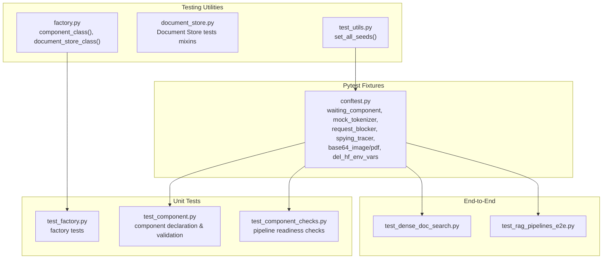
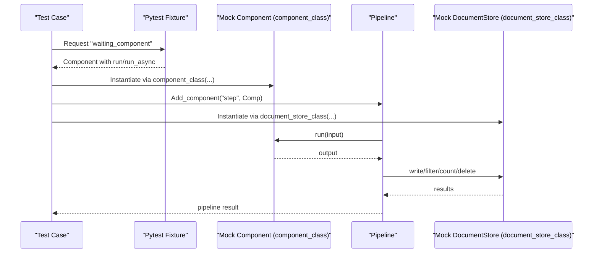
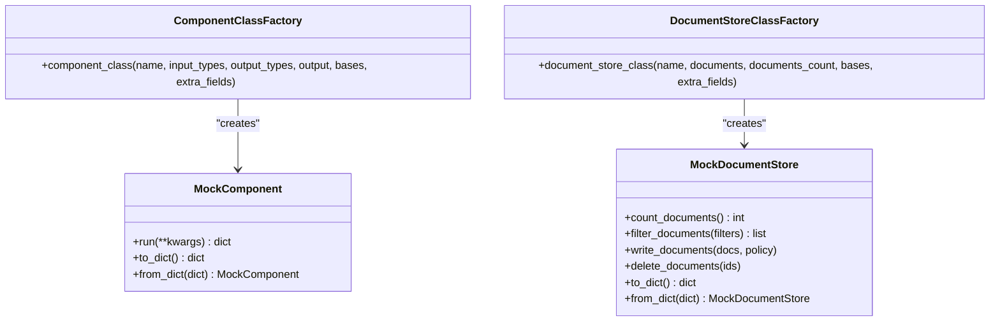
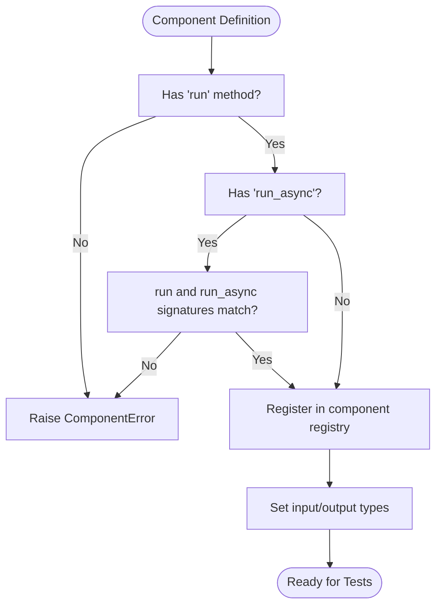
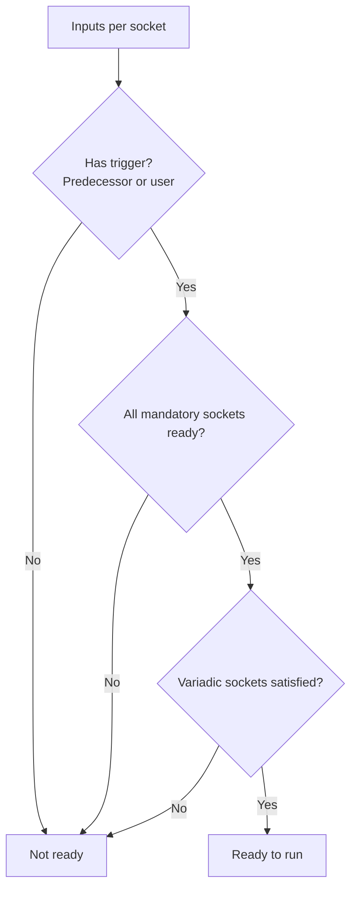
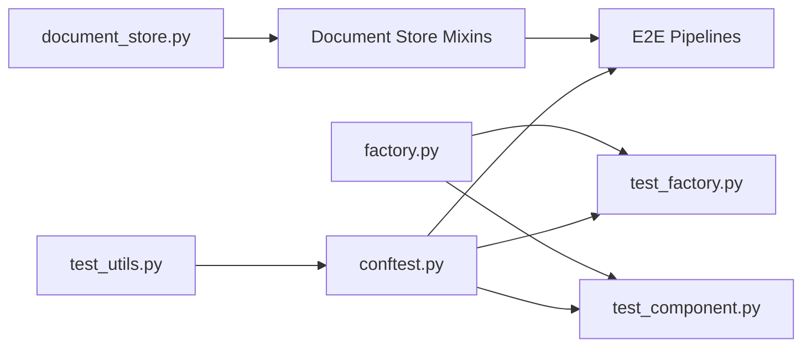

# Component Testing and Validation

<cite>
**Referenced Files in This Document**
- [factory.py](file://haystack/testing/factory.py)
- [document_store.py](file://haystack/testing/document_store.py)
- [test_utils.py](file://haystack/testing/test_utils.py)
- [conftest.py](file://test/conftest.py)
- [test_factory.py](file://test/testing/test_factory.py)
- [test_component.py](file://test/core/component/test_component.py)
- [test_component_checks.py](file://test/core/pipeline/test_component_checks.py)
- [test_dense_doc_search.py](file://e2e/pipelines/test_dense_doc_search.py)
- [test_rag_pipelines_e2e.py](file://e2e/pipelines/test_rag_pipelines_e2e.py)
</cite>

## Table of Contents
1. [Introduction](#introduction)
2. [Project Structure](#project-structure)
3. [Core Components](#core-components)
4. [Architecture Overview](#architecture-overview)
5. [Detailed Component Analysis](#detailed-component-analysis)
6. [Dependency Analysis](#dependency-analysis)
7. [Performance Considerations](#performance-considerations)
8. [Troubleshooting Guide](#troubleshooting-guide)
9. [Conclusion](#conclusion)
10. [Appendices](#appendices)

## Introduction
This document provides a comprehensive guide to testing and validating Haystack components across unit, integration, and end-to-end scopes. It explains the testing utilities and factories available for building reliable tests, demonstrates mock component creation and dependency injection, and covers validation techniques for inputs/outputs and error handling. It also includes patterns for asynchronous components and streaming scenarios, outlines testing best practices, and provides guidance for performance and benchmarking. Finally, it highlights common pitfalls and debugging techniques to streamline component development.

## Project Structure
Haystack’s testing ecosystem is organized around:
- Core testing utilities and factories for rapid test scaffolding
- Fixture-driven tests for components and pipelines
- End-to-end pipeline tests
- Shared fixtures for blocking external network calls and deterministic randomness

**Diagram sources**
- [factory.py](file://haystack/testing/factory.py#L126-L233)
- [document_store.py](file://haystack/testing/document_store.py#L44-L134)
- [test_utils.py](file://haystack/testing/test_utils.py#L13-L37)
- [conftest.py](file://test/conftest.py#L24-L110)
- [test_factory.py](file://test/testing/test_factory.py#L1-L123)
- [test_component.py](file://test/core/component/test_component.py#L16-L577)
- [test_component_checks.py](file://test/core/pipeline/test_component_checks.py#L140-L676)
- [test_dense_doc_search.py](file://e2e/pipelines/test_dense_doc_search.py)
- [test_rag_pipelines_e2e.py](file://e2e/pipelines/test_rag_pipelines_e2e.py)

**Section sources**
- [factory.py](file://haystack/testing/factory.py#L1-L233)
- [document_store.py](file://haystack/testing/document_store.py#L1-L954)
- [test_utils.py](file://haystack/testing/test_utils.py#L1-L37)
- [conftest.py](file://test/conftest.py#L1-L110)

## Core Components
This section introduces the primary testing utilities and factories that enable fast, robust component testing.

- Factory utilities for quick mock components and document stores:
  - component_class(): Creates a fully registered component class with configurable input/output types and outputs.
  - document_store_class(): Creates a lightweight, serializable DocumentStore subclass for testing storage operations.
- Document Store testing mixins: Provide reusable test suites for count, write, delete, filter, and advanced operations.
- Global test utilities:
  - set_all_seeds(): Ensures reproducible runs across Python, NumPy, and PyTorch when applicable.
- Pytest fixtures:
  - waiting_component: A simple component with sync and async run methods useful for timing and concurrency tests.
  - mock_tokenizer: A minimal mock encoder/decoder for text preprocessing tests.
  - request_blocker: Blocks accidental outbound HTTP calls in non-integration tests.
  - spying_tracer: Enables tracing instrumentation for pipeline execution validation.
  - base64_image_string/base64_pdf_string: Pre-encoded test assets for media conversion tests.
  - del_hf_env_vars: Removes Hugging Face credentials from the environment to prevent API calls during tests.

**Section sources**
- [factory.py](file://haystack/testing/factory.py#L126-L233)
- [document_store.py](file://haystack/testing/document_store.py#L44-L134)
- [test_utils.py](file://haystack/testing/test_utils.py#L13-L37)
- [conftest.py](file://test/conftest.py#L24-L110)

## Architecture Overview
The testing architecture centers on:
- Factory-based component and store creation for isolation and repeatability
- Fixture-driven tests that inject mocks and deterministic environments
- Pipeline readiness checks to validate component connectivity and data flow
- End-to-end tests that exercise real-world pipelines

**Diagram sources**
- [factory.py](file://haystack/testing/factory.py#L126-L233)
- [conftest.py](file://test/conftest.py#L24-L38)
- [test_component.py](file://test/core/component/test_component.py#L16-L60)

## Detailed Component Analysis

### Factory Utilities: component_class and document_store_class
These utilities simplify creating deterministic, serializable components and document stores for tests.

- component_class(name, input_types, output_types, output, bases, extra_fields):
  - Registers the class with the component registry
  - Sets input and output types and run behavior
  - Supports custom base classes and extra attributes
- document_store_class(name, documents, documents_count, bases, extra_fields):
  - Provides count_documents, filter_documents, write_documents, delete_documents
  - Serializes via to_dict/from_dict
  - Useful for validating pipeline I/O without a real backend

**Diagram sources**
- [factory.py](file://haystack/testing/factory.py#L126-L233)

**Section sources**
- [factory.py](file://haystack/testing/factory.py#L126-L233)
- [test_factory.py](file://test/testing/test_factory.py#L10-L123)

### Component Declaration and Validation
Tests validate correct component declaration, async support, input/output type registration, and error conditions.

Key validations include:
- Correct declaration with run and optional run_async
- Async run signature and parameter parity with run
- Input/Output type registration via decorators or setters
- Error conditions for missing run, mismatched signatures, and conflicting type declarations

**Diagram sources**
- [test_component.py](file://test/core/component/test_component.py#L115-L194)

**Section sources**
- [test_component.py](file://test/core/component/test_component.py#L16-L577)

### Pipeline Readiness and Socket Behavior
Pipeline readiness tests validate how components react to inputs, triggers, and variadic sockets.

Highlights:
- Trigger detection from predecessors vs. user input
- Mandatory vs. optional socket readiness
- Lazy and greedy variadic socket resolution
- Predecessor execution completeness across sockets

**Diagram sources**
- [test_component_checks.py](file://test/core/pipeline/test_component_checks.py#L140-L676)

**Section sources**
- [test_component_checks.py](file://test/core/pipeline/test_component_checks.py#L140-L676)

### Document Store Testing Mixins
Reusable test suites for storage operations:
- CountDocumentsTest: Validates counts on empty and non-empty stores
- WriteDocumentsTest: Validates duplicate policies and invalid inputs
- DeleteDocumentsTest: Validates deletion semantics
- FilterDocumentsTest: Validates comparison operators, logical operators, malformed filters
- DeleteAllTest and DeleteByFilterTest: Advanced deletion and filtering scenarios
- UpdateByFilterTest: Updates filtered documents (when supported)

These mixins encourage consistent validation across different DocumentStore implementations.

**Section sources**
- [document_store.py](file://haystack/testing/document_store.py#L44-L954)

### End-to-End Pipeline Testing
End-to-end tests validate realistic workflows:
- Dense document search pipeline tests
- RAG pipeline tests

These tests rely on shared fixtures to ensure reproducibility and safety (e.g., request_blocker, HF env cleanup).

**Section sources**
- [test_dense_doc_search.py](file://e2e/pipelines/test_dense_doc_search.py)
- [test_rag_pipelines_e2e.py](file://e2e/pipelines/test_rag_pipelines_e2e.py)
- [conftest.py](file://test/conftest.py#L57-L110)

## Dependency Analysis
Testing dependencies and coupling:
- Factory utilities are independent and can be imported directly in tests
- Document Store mixins depend on the DocumentStore protocol and common exceptions
- Component tests depend on the core component decorator and type registries
- Pipeline readiness tests depend on InputSocket/OutputSocket and pipeline checks
- End-to-end tests depend on shared fixtures and real pipeline configurations

**Diagram sources**
- [factory.py](file://haystack/testing/factory.py#L126-L233)
- [document_store.py](file://haystack/testing/document_store.py#L44-L954)
- [test_factory.py](file://test/testing/test_factory.py#L1-L123)
- [test_component.py](file://test/core/component/test_component.py#L16-L60)
- [conftest.py](file://test/conftest.py#L24-L110)
- [test_utils.py](file://haystack/testing/test_utils.py#L13-L37)

**Section sources**
- [factory.py](file://haystack/testing/factory.py#L126-L233)
- [document_store.py](file://haystack/testing/document_store.py#L44-L954)
- [test_factory.py](file://test/testing/test_factory.py#L1-L123)
- [test_component.py](file://test/core/component/test_component.py#L16-L60)
- [conftest.py](file://test/conftest.py#L24-L110)
- [test_utils.py](file://haystack/testing/test_utils.py#L13-L37)

## Performance Considerations
- Determinism: Use set_all_seeds to stabilize random behavior across tests.
- Network safety: request_blocker prevents unintended HTTP calls, ensuring tests remain fast and deterministic.
- Async and streaming: Prefer fixtures like waiting_component to measure timing and concurrency characteristics without flakiness.
- Benchmarking: While not built-in, adopt a pattern of measuring run_async durations and throughput in dedicated benchmarks outside unit tests.

[No sources needed since this section provides general guidance]

## Troubleshooting Guide
Common issues and debugging techniques:
- Missing run method or incorrect async signature: Tests raise explicit ComponentError; review component decorator usage and method signatures.
- Mismatched run/run_async parameters: Ensure identical signatures for synchronous and asynchronous variants.
- Conflicting type declarations: Avoid mixing decorators and manual setters; choose one approach consistently.
- Pipeline readiness failures: Inspect InputSocket senders, variadic socket resolution, and trigger conditions.
- External calls: If tests fail due to network, confirm request_blocker is active and not overridden by test markers.
- Environment variables: Remove HF tokens to avoid API calls; use del_hf_env_vars fixture in sensitive tests.

**Section sources**
- [test_component.py](file://test/core/component/test_component.py#L115-L194)
- [test_component_checks.py](file://test/core/pipeline/test_component_checks.py#L140-L676)
- [conftest.py](file://test/conftest.py#L57-L110)

## Conclusion
Haystack provides a robust testing toolkit centered on factories, mixins, and fixtures that enable thorough, deterministic, and scalable validation of components and pipelines. By leveraging component_class and document_store_class, applying pipeline readiness checks, and adhering to the shared fixture patterns, developers can build reliable unit, integration, and end-to-end tests. Combined with deterministic seeding and strict network safeguards, this approach ensures predictable, maintainable, and performant component development.

[No sources needed since this section summarizes without analyzing specific files]

## Appendices

### Testing Patterns and Best Practices
- Use component_class for quick, deterministic components in unit tests
- Use document_store_class for storage validation without external dependencies
- Apply set_all_seeds in conftest to ensure reproducibility
- Block outbound requests with request_blocker unless marked integration
- Validate both sync and async paths for components supporting run_async
- For streaming or async-heavy components, instrument with spying_tracer to observe execution flow
- Keep tests isolated: avoid global state; rely on fixtures and factories
- Prefer reusable mixins for DocumentStore tests to maintain consistency across implementations

[No sources needed since this section provides general guidance]