# Converters

<cite>
**Referenced Files in This Document**
- [__init__.py](file://haystack/components/converters/__init__.py)
- [utils.py](file://haystack/components/converters/utils.py)
- [txt.py](file://haystack/components/converters/txt.py)
- [html.py](file://haystack/components/converters/html.py)
- [pdfminer.py](file://haystack/components/converters/pdfminer.py)
- [pypdf.py](file://haystack/components/converters/pypdf.py)
- [docx.py](file://haystack/components/converters/docx.py)
- [xlsx.py](file://haystack/components/converters/xlsx.py)
- [pptx.py](file://haystack/components/converters/pptx.py)
- [csv.py](file://haystack/components/converters/csv.py)
- [json.py](file://haystack/components/converters/json.py)
- [multi_file_converter.py](file://haystack/components/converters/multi_file_converter.py)
</cite>

## Table of Contents
1. [Introduction](#introduction)
2. [Project Structure](#project-structure)
3. [Core Components](#core-components)
4. [Architecture Overview](#architecture-overview)
5. [Detailed Component Analysis](#detailed-component-analysis)
6. [Dependency Analysis](#dependency-analysis)
7. [Performance Considerations](#performance-considerations)
8. [Troubleshooting Guide](#troubleshooting-guide)
9. [Conclusion](#conclusion)
10. [Appendices](#appendices)

## Introduction
This document explains Haystack’s converter components that transform various file formats into Documents suitable for downstream retrieval and generation pipelines. It covers major converter families:
- Text converters
- HTML converters
- PDF converters (two implementations)
- Office document converters (DOCX, XLSX, PPTX)
- CSV converters
- JSON converters
- Multi-file converters

It details purpose, functionality, inputs/outputs, metadata handling, content extraction capabilities, encoding behavior, performance characteristics, error handling, and best practices. Practical pipeline usage patterns are included to guide selection and optimization.

## Project Structure
Converters live under haystack/components/converters and expose a unified interface via a lazy-imported registry. They share common utilities for source normalization and metadata handling.

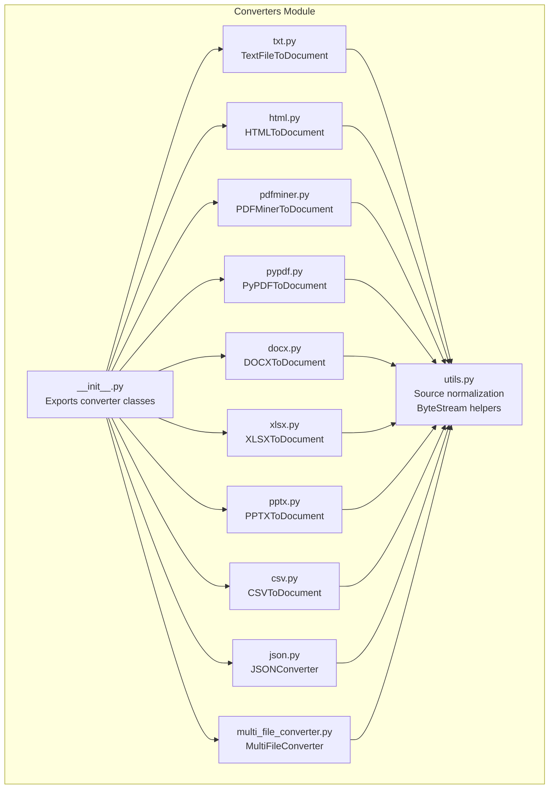

**Diagram sources**
- [__init__.py](file://haystack/components/converters/__init__.py#L10-L28)
- [utils.py](file://haystack/components/converters/utils.py#L11-L52)
- [txt.py](file://haystack/components/converters/txt.py#L16-L98)
- [html.py](file://haystack/components/converters/html.py#L20-L134)
- [pdfminer.py](file://haystack/components/converters/pdfminer.py#L26-L223)
- [pypdf.py](file://haystack/components/converters/pypdf.py#L50-L223)
- [docx.py](file://haystack/components/converters/docx.py#L119-L404)
- [xlsx.py](file://haystack/components/converters/xlsx.py#L25-L233)
- [pptx.py](file://haystack/components/converters/pptx.py#L23-L150)
- [csv.py](file://haystack/components/converters/csv.py#L20-L230)
- [json.py](file://haystack/components/converters/json.py#L21-L288)
- [multi_file_converter.py](file://haystack/components/converters/multi_file_converter.py#L37-L134)

**Section sources**
- [__init__.py](file://haystack/components/converters/__init__.py#L10-L28)
- [utils.py](file://haystack/components/converters/utils.py#L11-L52)

## Core Components
This section summarizes each converter family, their purpose, inputs/outputs, and key behaviors.

- Text converters
  - Purpose: Convert plain text files to Documents.
  - Inputs: sources (paths or ByteStream), optional meta.
  - Outputs: documents (Document list).
  - Encoding: defaults to UTF-8; respects ByteStream meta encoding.
  - Metadata: merges ByteStream meta and provided meta; optionally stores full path vs basename.
  - Typical use: ingestion of .txt, logs, or free-form text.

- HTML converters
  - Purpose: Extract textual content from HTML, optionally using Trafilatura.
  - Inputs: sources, optional meta, optional extraction_kwargs.
  - Outputs: documents.
  - Extraction customization: passes extraction_kwargs to Trafilatura extract.
  - Metadata: merges and normalizes metadata; shortens file_path if requested.
  - Typical use: web scraping, article extraction, cleaning HTML to text.

- PDF converters
  - PDFMinerToDocument
    - Purpose: Extract text from PDFs using pdfminer.six.
    - Inputs: sources, optional meta.
    - Outputs: documents.
    - Layout tuning: LAParams controls overlap, margins, ordering, vertical detection.
    - CID detection: reports undecoded CID characters to aid quality checks.
    - Typical use: structured text extraction from scanned or font-mapped PDFs.
  - PyPDFToDocument
    - Purpose: Extract text from PDFs using pypdf.
    - Inputs: sources, optional meta.
    - Outputs: documents.
    - Modes: plain or layout-aware extraction with configurable parameters.
    - Typical use: fast, reliable text extraction for most PDFs.

- Office document converters
  - DOCXToDocument
    - Purpose: Convert Word documents to Documents.
    - Inputs: sources, optional meta.
    - Options: table_format (markdown or csv), link_format (markdown/plain/none).
    - Metadata: includes core_properties as docx metadata.
    - Typical use: extracting text, preserving tables, handling hyperlinks.
  - XLSXToDocument
    - Purpose: Convert Excel spreadsheets to Documents (tables).
    - Inputs: sources, optional meta.
    - Options: table_format (csv/markdown), sheet selection, link_format (markdown/plain/none).
    - Behavior: one Document per sheet/table; supports hyperlink formatting.
    - Typical use: turning spreadsheets into queryable text form.
  - PPTXToDocument
    - Purpose: Convert PowerPoint slides to Documents.
    - Inputs: sources, optional meta.
    - Options: link_format (markdown/plain/none).
    - Typical use: indexing slide decks for search.

- CSV converters
  - Purpose: Convert CSV files to Documents.
  - Modes:
    - file: one Document per file with raw CSV text.
    - row: one Document per row using a specified content_column.
  - Inputs: sources, optional meta, content_column (required for row mode).
  - Outputs: documents.
  - Encoding: respects ByteStream meta encoding; validates delimiter/quotechar.
  - Memory: warns for large CSVs in row mode.
  - Typical use: transforming tabular logs or datasets into Documents.

- JSON converters
  - Purpose: Convert JSON files to Documents with flexible extraction.
  - Inputs: sources, optional meta.
  - Options: jq_schema (jq filter), content_key (scalar content), extra_meta_fields (* or set).
  - Behavior: applies jq filter if provided; extracts content_key from filtered object; merges selected metadata.
  - Typical use: indexing structured logs, API responses, or nested JSON records.

- Multi-file converters
  - Purpose: Route and convert heterogeneous files in a single pipeline.
  - Supported types: CSV, DOCX, HTML, JSON, MD, TEXT, PDF, PPTX, XLSX.
  - Behavior: builds an internal Pipeline with FileTypeRouter, per-type converters, and a DocumentJoiner.
  - Typical use: batch ingestion of mixed-format datasets.

**Section sources**
- [txt.py](file://haystack/components/converters/txt.py#L16-L98)
- [html.py](file://haystack/components/converters/html.py#L20-L134)
- [pdfminer.py](file://haystack/components/converters/pdfminer.py#L26-L223)
- [pypdf.py](file://haystack/components/converters/pypdf.py#L50-L223)
- [docx.py](file://haystack/components/converters/docx.py#L119-L404)
- [xlsx.py](file://haystack/components/converters/xlsx.py#L25-L233)
- [pptx.py](file://haystack/components/converters/pptx.py#L23-L150)
- [csv.py](file://haystack/components/converters/csv.py#L20-L230)
- [json.py](file://haystack/components/converters/json.py#L21-L288)
- [multi_file_converter.py](file://haystack/components/converters/multi_file_converter.py#L37-L134)

## Architecture Overview
The converters share a common input model and metadata strategy. Many rely on a shared utility to normalize inputs and metadata. Some converters (notably PDFMiner and PyPDF) require optional third-party libraries.

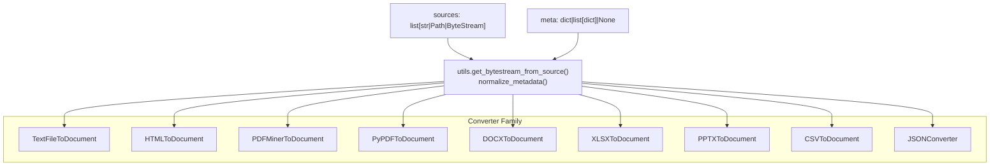

**Diagram sources**
- [utils.py](file://haystack/components/converters/utils.py#L11-L52)
- [txt.py](file://haystack/components/converters/txt.py#L53-L98)
- [html.py](file://haystack/components/converters/html.py#L74-L134)
- [pdfminer.py](file://haystack/components/converters/pdfminer.py#L158-L223)
- [pypdf.py](file://haystack/components/converters/pypdf.py#L173-L223)
- [docx.py](file://haystack/components/converters/docx.py#L193-L244)
- [xlsx.py](file://haystack/components/converters/xlsx.py#L91-L144)
- [pptx.py](file://haystack/components/converters/pptx.py#L107-L150)
- [csv.py](file://haystack/components/converters/csv.py#L80-L185)
- [json.py](file://haystack/components/converters/json.py#L249-L288)

## Detailed Component Analysis

### TextFileToDocument
- Purpose: Convert .txt files to Documents.
- Key behaviors:
  - Defaults to UTF-8 decoding; respects ByteStream meta encoding.
  - Merges metadata from ByteStream and provided meta; optionally shortens file_path.
  - Graceful error handling: logs warnings and skips unreadable sources.
- Typical use cases:
  - Ingestion of logs, notes, or unstructured text.
  - Preprocessing before embedding or search.

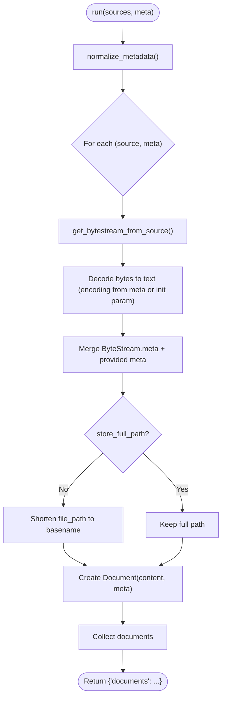

**Diagram sources**
- [txt.py](file://haystack/components/converters/txt.py#L53-L98)
- [utils.py](file://haystack/components/converters/utils.py#L32-L52)

**Section sources**
- [txt.py](file://haystack/components/converters/txt.py#L16-L98)
- [utils.py](file://haystack/components/converters/utils.py#L11-L52)

### HTMLToDocument
- Purpose: Extract text from HTML using Trafilatura.
- Key behaviors:
  - Accepts extraction_kwargs forwarded to Trafilatura extract.
  - Merges and normalizes metadata; shortens file_path if requested.
  - Logs and skips failures.
- Typical use cases:
  - Cleaning and indexing web pages or articles.

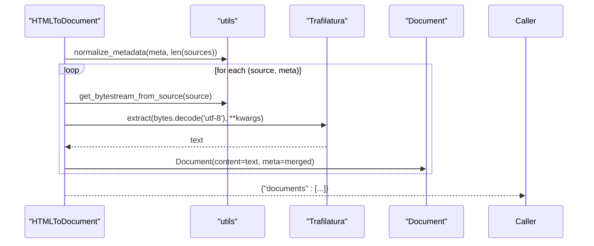

**Diagram sources**
- [html.py](file://haystack/components/converters/html.py#L74-L134)
- [utils.py](file://haystack/components/converters/utils.py#L32-L52)

**Section sources**
- [html.py](file://haystack/components/converters/html.py#L20-L134)
- [utils.py](file://haystack/components/converters/utils.py#L11-L52)

### PDFMinerToDocument
- Purpose: Extract text from PDFs using pdfminer.six.
- Key behaviors:
  - Configurable LAParams for layout analysis.
  - Detects undecoded CID characters to flag potential font issues.
  - Merges metadata and shortens file_path if requested.
- Typical use cases:
  - Extracting text from PDFs with complex layouts or non-standard encodings.

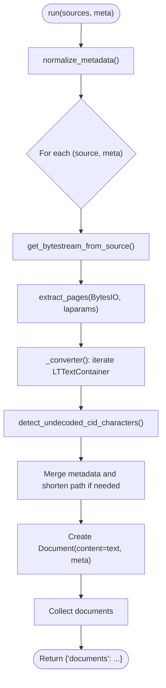

**Diagram sources**
- [pdfminer.py](file://haystack/components/converters/pdfminer.py#L158-L223)
- [utils.py](file://haystack/components/converters/utils.py#L32-L52)

**Section sources**
- [pdfminer.py](file://haystack/components/converters/pdfminer.py#L26-L223)
- [utils.py](file://haystack/components/converters/utils.py#L11-L52)

### PyPDFToDocument
- Purpose: Extract text from PDFs using pypdf.
- Key behaviors:
  - Supports plain and layout-aware extraction modes.
  - Exposes numerous parameters for orientation, spacing, and layout heuristics.
  - Merges metadata and shortens file_path if requested.
- Typical use cases:
  - Fast, reliable text extraction for most PDFs.

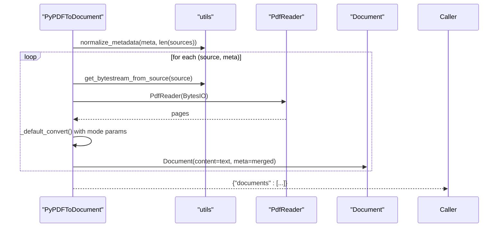

**Diagram sources**
- [pypdf.py](file://haystack/components/converters/pypdf.py#L173-L223)
- [utils.py](file://haystack/components/converters/utils.py#L32-L52)

**Section sources**
- [pypdf.py](file://haystack/components/converters/pypdf.py#L50-L223)
- [utils.py](file://haystack/components/converters/utils.py#L11-L52)

### DOCXToDocument
- Purpose: Convert Word documents to Documents.
- Key behaviors:
  - Options for table_format (markdown/csv) and link_format (markdown/plain/none).
  - Extracts core_properties and attaches as docx metadata.
  - Handles page breaks and hyperlinks.
- Typical use cases:
  - Indexing Word documents with tables and hyperlinks.

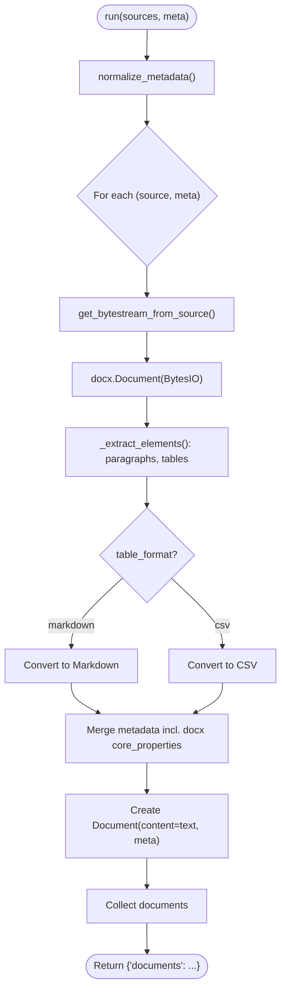

**Diagram sources**
- [docx.py](file://haystack/components/converters/docx.py#L193-L244)
- [utils.py](file://haystack/components/converters/utils.py#L32-L52)

**Section sources**
- [docx.py](file://haystack/components/converters/docx.py#L119-L404)
- [utils.py](file://haystack/components/converters/utils.py#L11-L52)

### XLSXToDocument
- Purpose: Convert Excel spreadsheets to Documents (tables).
- Key behaviors:
  - One Document per sheet/table; supports markdown or CSV output.
  - Optional sheet filtering and hyperlink formatting.
  - Merges metadata and shortens file_path if requested.
- Typical use cases:
  - Converting spreadsheets to queryable text.

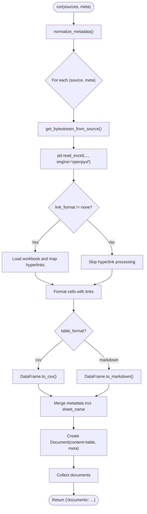

**Diagram sources**
- [xlsx.py](file://haystack/components/converters/xlsx.py#L91-L144)
- [utils.py](file://haystack/components/converters/utils.py#L32-L52)

**Section sources**
- [xlsx.py](file://haystack/components/converters/xlsx.py#L25-L233)
- [utils.py](file://haystack/components/converters/utils.py#L11-L52)

### PPTXToDocument
- Purpose: Convert PowerPoint presentations to Documents.
- Key behaviors:
  - Iterates slides/shapes; collects text frames and shape text.
  - Optional hyperlink formatting (markdown/plain/none).
  - Merges metadata and shortens file_path if requested.
- Typical use cases:
  - Indexing slide decks for search.

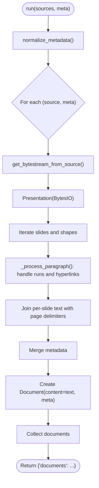

**Diagram sources**
- [pptx.py](file://haystack/components/converters/pptx.py#L107-L150)
- [utils.py](file://haystack/components/converters/utils.py#L32-L52)

**Section sources**
- [pptx.py](file://haystack/components/converters/pptx.py#L23-L150)
- [utils.py](file://haystack/components/converters/utils.py#L11-L52)

### CSVToDocument
- Purpose: Convert CSV files to Documents.
- Modes:
  - file: one Document per file with raw CSV text.
  - row: one Document per row using a specified content_column.
- Key behaviors:
  - Validates delimiter and quotechar.
  - In row mode, warns for large files and strictly validates presence of content_column.
  - Merges metadata and shortens file_path if requested.
- Typical use cases:
  - Transforming logs and datasets into Documents.

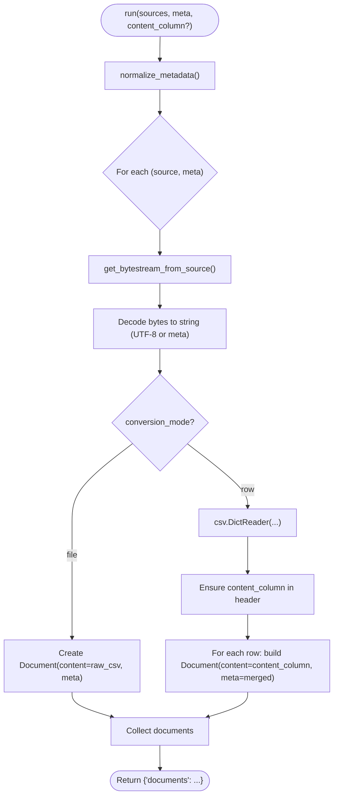

**Diagram sources**
- [csv.py](file://haystack/components/converters/csv.py#L80-L185)
- [utils.py](file://haystack/components/converters/utils.py#L32-L52)

**Section sources**
- [csv.py](file://haystack/components/converters/csv.py#L20-L230)
- [utils.py](file://haystack/components/converters/utils.py#L11-L52)

### JSONConverter
- Purpose: Convert JSON files to Documents with flexible extraction.
- Key behaviors:
  - Optional jq_schema to filter JSON; optional content_key to select scalar content.
  - Optional extra_meta_fields to extract additional fields; supports "*" to capture all.
  - Merges metadata and shortens file_path if requested.
- Typical use cases:
  - Indexing structured logs, API responses, or nested records.

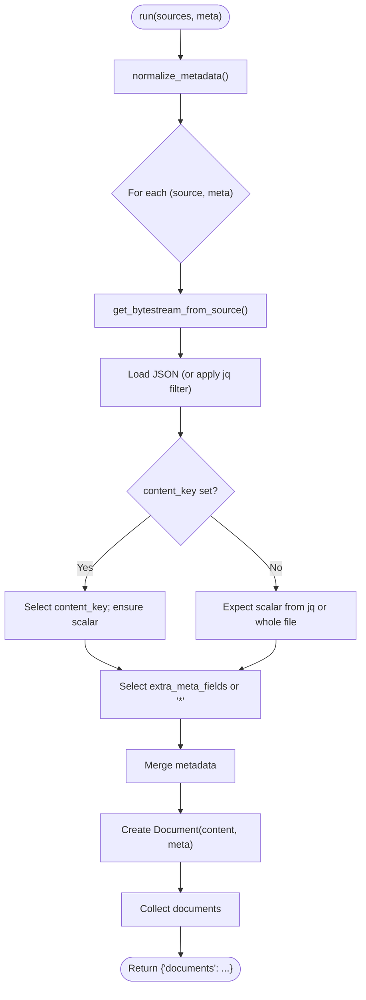

**Diagram sources**
- [json.py](file://haystack/components/converters/json.py#L249-L288)
- [utils.py](file://haystack/components/converters/utils.py#L32-L52)

**Section sources**
- [json.py](file://haystack/components/converters/json.py#L21-L288)
- [utils.py](file://haystack/components/converters/utils.py#L11-L52)

### MultiFileConverter
- Purpose: Unified entry point to convert multiple file types in one pipeline.
- Key behaviors:
  - Uses FileTypeRouter to dispatch by MIME type.
  - Routes to specialized converters (DOCX, HTML, JSON, MD, TEXT, PDF, PPTX, XLSX, CSV).
  - Joins outputs into a single Document list.
  - Exposes outputs for classified, unclassified, and failed sources.
- Typical use cases:
  - Batch ingestion of mixed-format datasets.

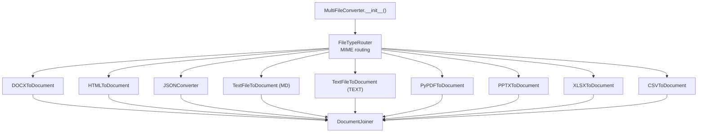

**Diagram sources**
- [multi_file_converter.py](file://haystack/components/converters/multi_file_converter.py#L37-L134)

**Section sources**
- [multi_file_converter.py](file://haystack/components/converters/multi_file_converter.py#L37-L134)

## Dependency Analysis
- Internal dependencies:
  - All converters depend on utils.get_bytestream_from_source() and utils.normalize_metadata().
  - Many converters depend on external libraries (e.g., pdfminer.six, pypdf, python-docx, openpyxl, python-pptx, jq, pandas, tabulate, trafilatura).
- Coupling:
  - Converters are cohesive around a single responsibility (format-specific extraction).
  - MultiFileConverter composes multiple converters behind a router and joiner, increasing coupling to those components.
- External dependencies:
  - Optional installs per converter; converters check availability and raise helpful messages.

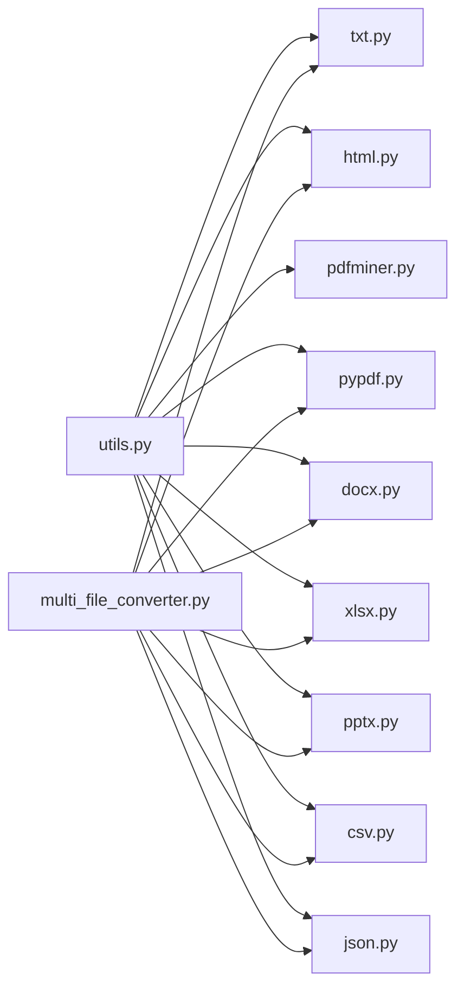

**Diagram sources**
- [utils.py](file://haystack/components/converters/utils.py#L11-L52)
- [txt.py](file://haystack/components/converters/txt.py#L16-L98)
- [html.py](file://haystack/components/converters/html.py#L20-L134)
- [pdfminer.py](file://haystack/components/converters/pdfminer.py#L26-L223)
- [pypdf.py](file://haystack/components/converters/pypdf.py#L50-L223)
- [docx.py](file://haystack/components/converters/docx.py#L119-L404)
- [xlsx.py](file://haystack/components/converters/xlsx.py#L25-L233)
- [pptx.py](file://haystack/components/converters/pptx.py#L23-L150)
- [csv.py](file://haystack/components/converters/csv.py#L20-L230)
- [json.py](file://haystack/components/converters/json.py#L21-L288)
- [multi_file_converter.py](file://haystack/components/converters/multi_file_converter.py#L37-L134)

**Section sources**
- [utils.py](file://haystack/components/converters/utils.py#L11-L52)
- [multi_file_converter.py](file://haystack/components/converters/multi_file_converter.py#L37-L134)

## Performance Considerations
- Encoding and I/O
  - Prefer passing ByteStream with accurate encoding in meta to avoid repeated detection.
  - For large CSVs in row mode, consider chunking or streaming strategies outside the converter to reduce memory pressure.
- PDF extraction
  - PyPDFToDocument offers layout-aware mode with additional overhead; choose plain mode for speed when layout fidelity is not required.
  - PDFMinerToDocument exposes fine-grained LAParams; tune to balance accuracy and performance.
- HTML extraction
  - Trafilatura extraction_kwargs can impact performance; keep include_* minimal when not needed.
- Tables
  - XLSXToDocument and DOCXToDocument produce larger Documents when using markdown; consider CSV for compactness when layout is not required.
- Multi-file conversion
  - MultiFileConverter builds an internal pipeline; warm up the pipeline once and reuse for batches to amortize initialization costs.

[No sources needed since this section provides general guidance]

## Troubleshooting Guide
- Common issues and remedies
  - Unsupported source type: ensure sources are str, Path, or ByteStream.
  - Encoding errors: set encoding in ByteStream meta or converter init; verify file encoding.
  - Missing content_column in CSV row mode: provide content_column in run().
  - Large CSV row mode: expect warnings; consider reducing file size or switching to file mode.
  - PDF text anomalies:
    - PDFMinerToDocument: watch for CID character detections; indicates missing ToUnicode maps.
    - PyPDFToDocument: adjust extraction_mode and related parameters for rotated or complex layouts.
  - JSON extraction:
    - Without jq_schema and content_key: initialization raises; provide at least one.
    - content_key must be a scalar; arrays/objects are skipped with warnings.
  - HTML extraction:
    - Trafilatura unavailable: install optional dependency; converter checks availability.
  - Multi-file conversion:
    - Unrecognized MIME types: ensure file extensions are registered; MultiFileConverter registers common XML Office extensions.

**Section sources**
- [csv.py](file://haystack/components/converters/csv.py#L140-L185)
- [json.py](file://haystack/components/converters/json.py#L138-L151)
- [pdfminer.py](file://haystack/components/converters/pdfminer.py#L132-L157)
- [pypdf.py](file://haystack/components/converters/pypdf.py#L158-L172)
- [html.py](file://haystack/components/converters/html.py#L113-L121)
- [multi_file_converter.py](file://haystack/components/converters/multi_file_converter.py#L73-L81)

## Conclusion
Haystack’s converter suite provides robust, extensible capabilities to transform diverse file formats into Documents. Select the converter aligned with your content type and quality needs, leverage metadata and encoding controls, and consider pipeline composition for multi-format ingestion. For best results, tune parameters per converter, monitor extraction quality signals (e.g., CID detections), and adopt row-mode CSV processing judiciously.

[No sources needed since this section summarizes without analyzing specific files]

## Appendices

### Practical Pipeline Patterns
- Text-only ingestion
  - Use TextFileToDocument for .txt and similar plain text formats.
- Web content
  - Use HTMLToDocument with extraction_kwargs tailored to your content (e.g., include_links, include_tables).
- PDF-centric workflows
  - Prefer PyPDFToDocument for speed; switch to PDFMinerToDocument when layout fidelity or CID detection is needed.
- Office documents
  - DOCX: enable markdown tables and hyperlinks for richer content.
  - XLSX: choose CSV for compactness or Markdown for readability.
  - PPTX: enable link formatting for clickable references.
- Tabular data
  - CSV: file mode for raw CSV; row mode for per-row Documents with a content_column.
- Structured JSON
  - Use JSONConverter with jq_schema and content_key to extract and index specific fields.
- Mixed-format ingestion
  - Use MultiFileConverter to route and join heterogeneous files in a single pipeline.

[No sources needed since this section provides general guidance]