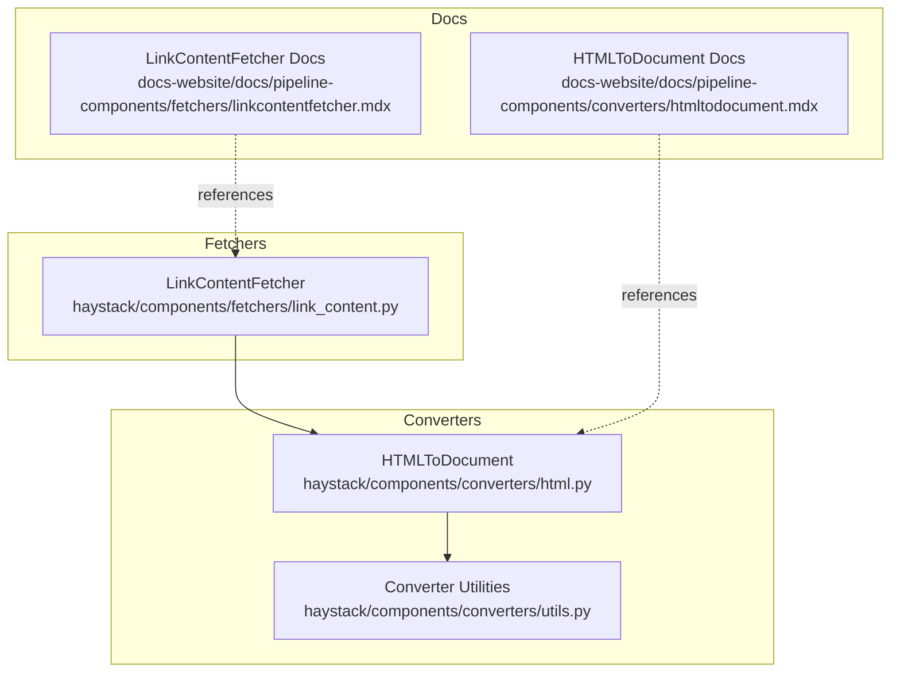
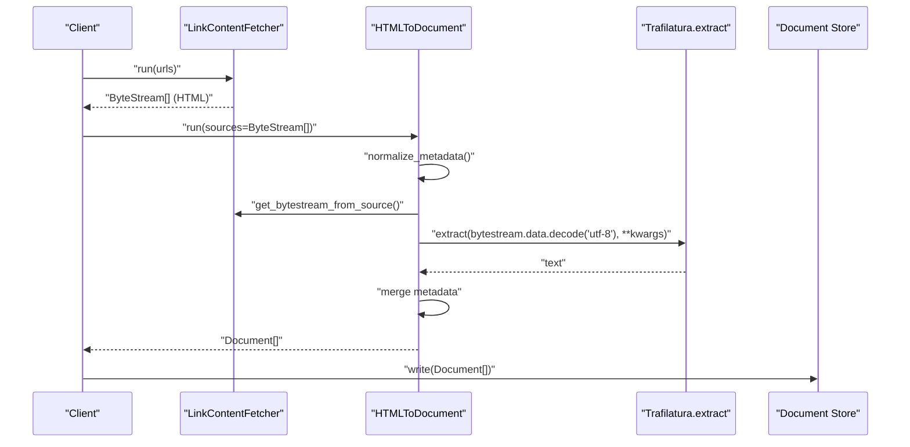
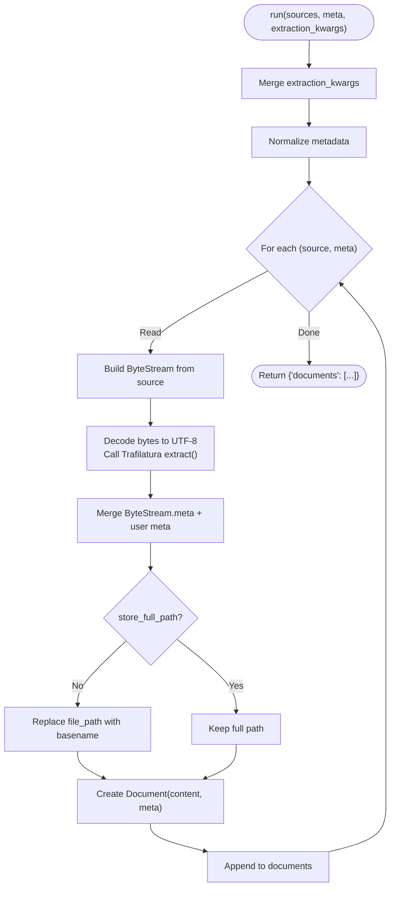
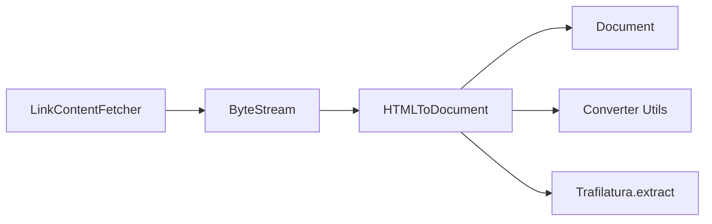

# HTML and Web Content Converters

<cite>
**Referenced Files in This Document**
- [html.py](file://haystack/components/converters/html.py)
- [utils.py](file://haystack/components/converters/utils.py)
- [link_content.py](file://haystack/components/fetchers/link_content.py)
- [htmltodocument.mdx](file://docs-website/docs/pipeline-components/converters/htmltodocument.mdx)
- [linkcontentfetcher.mdx](file://docs-website/docs/pipeline-components/fetchers/linkcontentfetcher.mdx)
</cite>

## Table of Contents
1. [Introduction](#introduction)
2. [Project Structure](#project-structure)
3. [Core Components](#core-components)
4. [Architecture Overview](#architecture-overview)
5. [Detailed Component Analysis](#detailed-component-analysis)
6. [Dependency Analysis](#dependency-analysis)
7. [Performance Considerations](#performance-considerations)
8. [Troubleshooting Guide](#troubleshooting-guide)
9. [Conclusion](#conclusion)
10. [Appendices](#appendices)

## Introduction
This document explains the HTML content conversion components in the project, focusing on extracting clean text content from HTML files and web pages. It covers the HTMLToDocument converter, the underlying extraction engine, and how it integrates with web content fetchers. You will learn how the converter parses HTML, filters out non-text elements, supports customization via extraction parameters, preserves metadata, and fits into end-to-end pipelines for indexing and retrieval.

## Project Structure
The relevant components for HTML and web content conversion are organized as follows:
- HTML conversion: haystack/components/converters/html.py
- Shared converter utilities: haystack/components/converters/utils.py
- Web content fetching: haystack/components/fetchers/link_content.py
- Documentation pages for HTMLToDocument and LinkContentFetcher: docs-website docs pages

**Diagram sources**
- [html.py](file://haystack/components/converters/html.py#L1-L134)
- [utils.py](file://haystack/components/converters/utils.py#L1-L52)
- [link_content.py](file://haystack/components/fetchers/link_content.py#L1-L470)
- [htmltodocument.mdx](file://docs-website/docs/pipeline-components/converters/htmltodocument.mdx#L1-L71)
- [linkcontentfetcher.mdx](file://docs-website/docs/pipeline-components/fetchers/linkcontentfetcher.mdx#L1-L200)

**Section sources**
- [html.py](file://haystack/components/converters/html.py#L1-L134)
- [utils.py](file://haystack/components/converters/utils.py#L1-L52)
- [link_content.py](file://haystack/components/fetchers/link_content.py#L1-L470)
- [htmltodocument.mdx](file://docs-website/docs/pipeline-components/converters/htmltodocument.mdx#L1-L71)
- [linkcontentfetcher.mdx](file://docs-website/docs/pipeline-components/fetchers/linkcontentfetcher.mdx#L1-L200)

## Core Components
- HTMLToDocument: Extracts clean text from HTML sources (files or ByteStream) and produces Documents. It delegates the heavy lifting to the Trafilatura extraction engine and normalizes metadata.
- Converter Utilities: Provides helpers to build ByteStream objects from various sources and to normalize metadata inputs.
- LinkContentFetcher: Retrieves content from URLs and returns ByteStream objects suitable for downstream converters like HTMLToDocument.

Key capabilities:
- Accepts file paths, Path objects, and ByteStream inputs.
- Merges metadata from sources and user-provided meta.
- Stores file path metadata (optionally full path vs. basename).
- Delegates extraction to Trafilatura with customizable parameters.
- Robust error handling: skips problematic sources and logs warnings.

**Section sources**
- [html.py](file://haystack/components/converters/html.py#L20-L134)
- [utils.py](file://haystack/components/converters/utils.py#L11-L52)
- [link_content.py](file://haystack/components/fetchers/link_content.py#L76-L342)

## Architecture Overview
End-to-end flow from raw HTML to Documents:
- Web scraping scenario: LinkContentFetcher retrieves HTML content from URLs and returns ByteStream objects.
- Local HTML files: HTMLToDocument reads local files or receives ByteStream inputs.
- Extraction: HTMLToDocument decodes bytes to UTF-8 and passes content to Trafilatura’s extract function.
- Metadata: Merges source metadata and optional user-provided metadata into Documents.

**Diagram sources**
- [link_content.py](file://haystack/components/fetchers/link_content.py#L227-L342)
- [html.py](file://haystack/components/converters/html.py#L74-L134)
- [utils.py](file://haystack/components/converters/utils.py#L11-L52)

## Detailed Component Analysis

### HTMLToDocument
Purpose:
- Convert HTML sources into Documents with clean text content.
- Support both file paths and ByteStream inputs.
- Allow customization of extraction via Trafilatura parameters.
- Preserve and enrich metadata.

Processing logic:
- Validates and merges extraction kwargs from constructor and run().
- Normalizes metadata to align with the number of sources.
- Builds ByteStream from each source and merges with normalized metadata.
- Decodes bytes to UTF-8 and runs Trafilatura extract.
- Produces a Document per successful extraction.

Extraction customization:
- Pass a dictionary of Trafilatura extract parameters via extraction_kwargs.
- Options are forwarded to the underlying extraction function.

Metadata handling:
- Merges ByteStream metadata with user-provided meta.
- Optionally stores only the file name or the full path in metadata.

Error handling:
- Skips unreadable or unconvertible sources and logs warnings.
- Continues processing remaining sources.

Output:
- Returns a dictionary with a "documents" key containing a list of Documents.

**Diagram sources**
- [html.py](file://haystack/components/converters/html.py#L74-L134)
- [utils.py](file://haystack/components/converters/utils.py#L32-L52)

**Section sources**
- [html.py](file://haystack/components/converters/html.py#L20-L134)
- [utils.py](file://haystack/components/converters/utils.py#L11-L52)

### Converter Utilities
Responsibilities:
- get_bytestream_from_source(): Converts file paths, Path objects, or existing ByteStream into a ByteStream, adding file_path metadata when appropriate.
- normalize_metadata(): Ensures meta is a list of dictionaries aligned with the number of sources.

Behavior:
- Validates input types and raises errors for unsupported types.
- Enforces length consistency between meta and sources.

**Section sources**
- [utils.py](file://haystack/components/converters/utils.py#L11-L52)

### LinkContentFetcher
Role:
- Fetches content from URLs and returns ByteStream objects.
- Supports retries, user-agent rotation, timeouts, and optional HTTP/2.
- Selects content handlers based on Content-Type.

Key behaviors:
- Synchronous and asynchronous modes.
- Multi-threaded fetching for multiple URLs.
- Content-type-aware handlers: text/* handled as text, text/html as binary, others as binary.
- Robust error handling with configurable raise_on_failure.

Integration with HTMLToDocument:
- Outputs ByteStream suitable for HTMLToDocument’s sources parameter.
- Metadata includes content_type and url for downstream enrichment.

**Section sources**
- [link_content.py](file://haystack/components/fetchers/link_content.py#L76-L470)

## Dependency Analysis
High-level dependencies:
- HTMLToDocument depends on Trafilatura for text extraction and on converter utilities for source normalization and metadata handling.
- LinkContentFetcher provides ByteStream outputs consumed by HTMLToDocument.
- Both components rely on the Document and ByteStream data classes.

**Diagram sources**
- [link_content.py](file://haystack/components/fetchers/link_content.py#L227-L342)
- [html.py](file://haystack/components/converters/html.py#L74-L134)
- [utils.py](file://haystack/components/converters/utils.py#L11-L52)

**Section sources**
- [html.py](file://haystack/components/converters/html.py#L1-L134)
- [utils.py](file://haystack/components/converters/utils.py#L1-L52)
- [link_content.py](file://haystack/components/fetchers/link_content.py#L1-L470)

## Performance Considerations
- Prefer asynchronous fetching for multiple URLs to reduce latency.
- Tune retry_attempts and timeout to balance reliability and speed.
- Use HTTP/2 when supported to improve throughput for many small requests.
- Limit extraction_kwargs to only necessary options to avoid overhead.
- For large pages, consider preprocessing steps (cleaning/splitting) after conversion.
- Batch URLs to leverage multi-threaded fetching; avoid single-URL overhead.

[No sources needed since this section provides general guidance]

## Troubleshooting Guide
Common issues and resolutions:
- Encoding problems: HTMLToDocument decodes bytes to UTF-8 before extraction. If you receive garbled text, verify the original HTML encoding and ensure consistent decoding upstream.
- Malformed HTML: Trafilatura is resilient; if extraction fails, the converter logs a warning and continues. Validate HTML sources or pre-clean them.
- Missing metadata: Ensure meta is provided as a dictionary or a list matching the number of sources.
- Full path vs. filename: Set store_full_path to control whether the full path is preserved in metadata.
- Web scraping failures: LinkContentFetcher retries with exponential backoff and rotates user agents. Adjust retry_attempts and user_agents as needed.

**Section sources**
- [html.py](file://haystack/components/converters/html.py#L107-L121)
- [link_content.py](file://haystack/components/fetchers/link_content.py#L183-L196)

## Conclusion
HTMLToDocument provides a robust, configurable pathway to transform HTML content into clean Documents, integrating seamlessly with LinkContentFetcher for web scraping and with preprocessing components for production pipelines. By leveraging Trafilatura extraction and careful metadata handling, it supports diverse HTML structures while maintaining reliability and performance.

[No sources needed since this section summarizes without analyzing specific files]

## Appendices

### Configuration Examples and Best Practices
- Basic usage with local HTML files:
  - See the HTMLToDocument documentation page for a minimal example.
- Pipelining with preprocessing:
  - See the HTMLToDocument documentation page for an indexing pipeline example.
- Web scraping pipeline:
  - Use LinkContentFetcher to retrieve HTML, then feed ByteStream objects to HTMLToDocument.
- Handling embedded scripts, styles, and metadata:
  - Trafilatura focuses on textual content; scripts and styles are filtered by default. Use extraction_kwargs to tailor behavior if needed.
- Output formatting and sanitization:
  - The converter returns plain text content. Apply DocumentCleaner and DocumentSplitter for post-processing.
- Complex layouts, tables, lists, and multimedia:
  - Trafilatura extracts readable text; for structured data, consider additional parsing or specialized converters.
- Dynamic content:
  - LinkContentFetcher performs static HTTP retrieval. For JavaScript-heavy sites, integrate a browser automation tool upstream of the converter.

**Section sources**
- [htmltodocument.mdx](file://docs-website/docs/pipeline-components/converters/htmltodocument.mdx#L24-L71)
- [linkcontentfetcher.mdx](file://docs-website/docs/pipeline-components/fetchers/linkcontentfetcher.mdx#L1-L200)