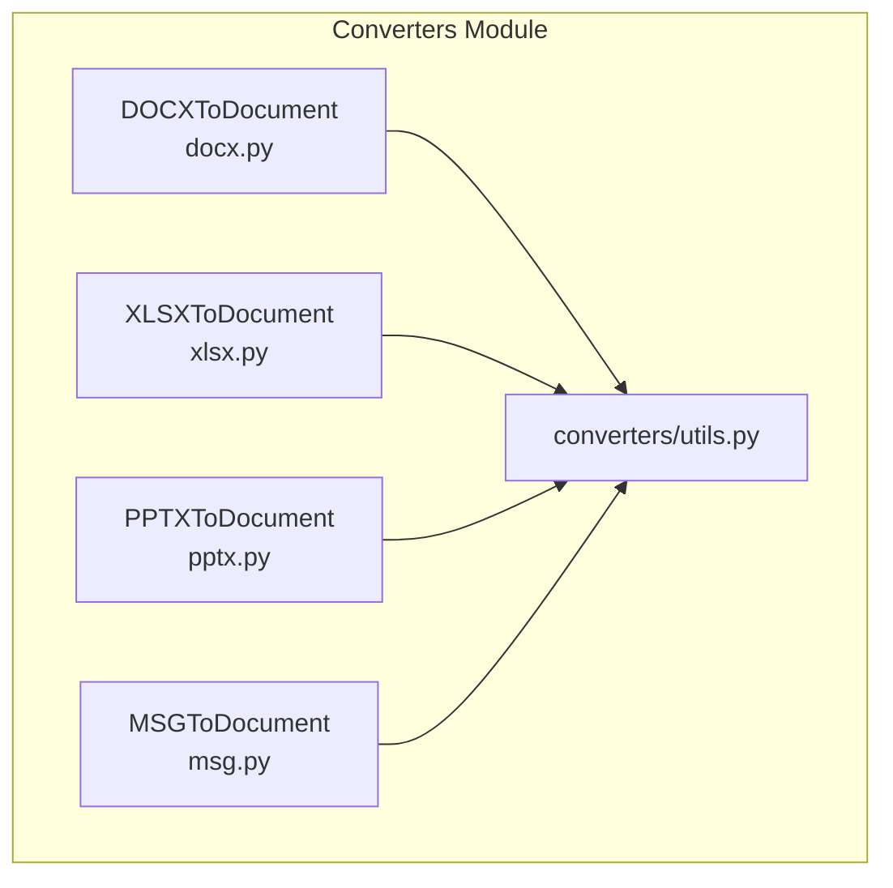
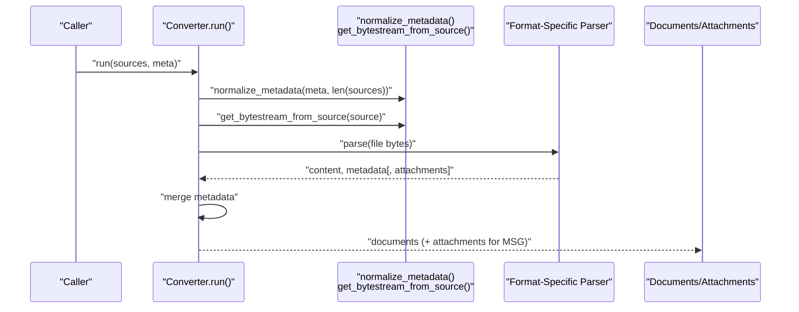
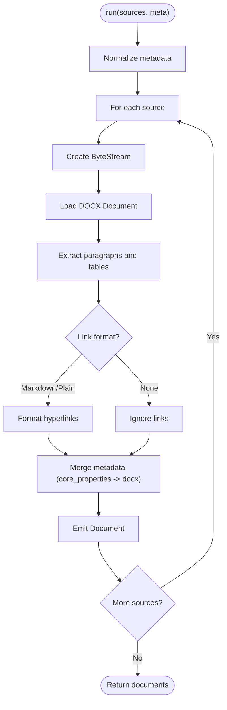
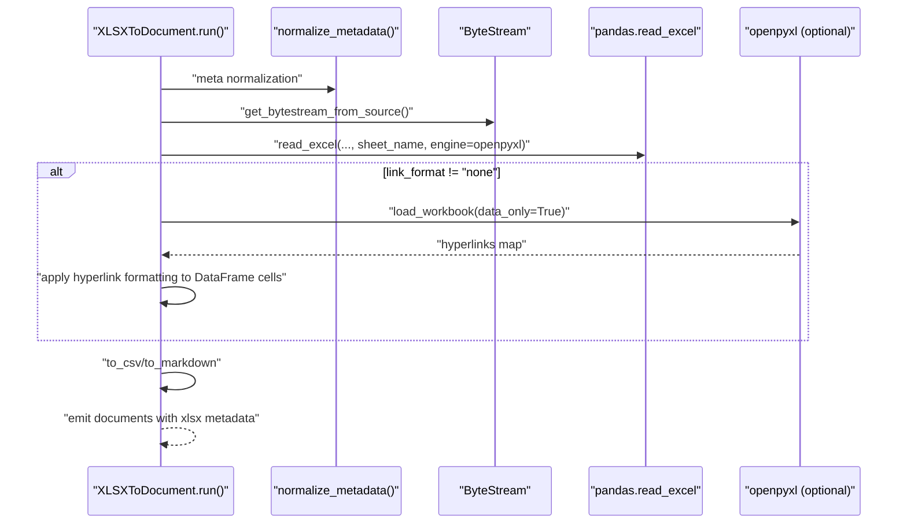
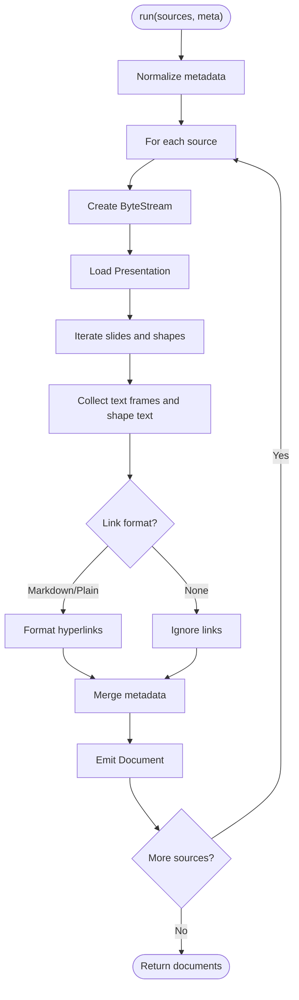
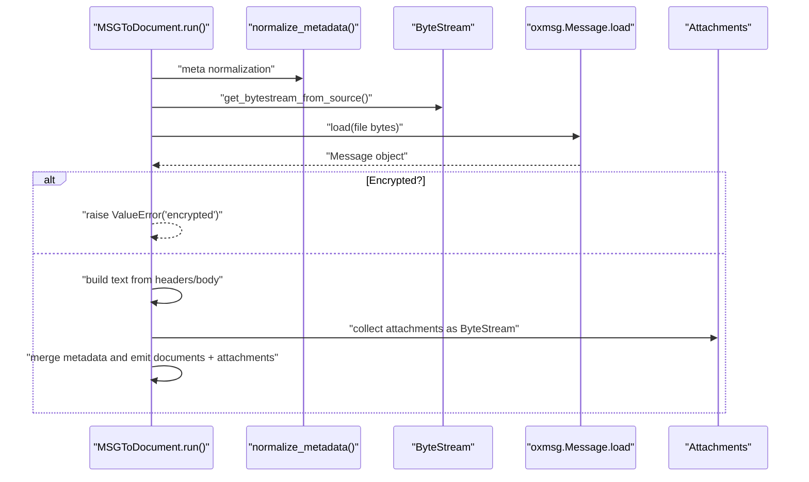
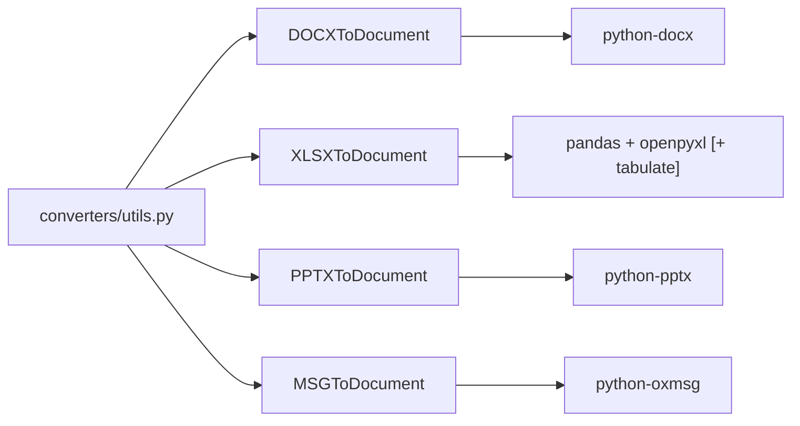

# Office Document Converters

<cite>
**Referenced Files in This Document**
- [docx.py](file://haystack/components/converters/docx.py)
- [xlsx.py](file://haystack/components/converters/xlsx.py)
- [pptx.py](file://haystack/components/converters/pptx.py)
- [msg.py](file://haystack/components/converters/msg.py)
- [utils.py](file://haystack/components/converters/utils.py)
- [__init__.py](file://haystack/components/converters/__init__.py)
- [test_docx_file_to_document.py](file://test/components/converters/test_docx_file_to_document.py)
- [test_xlsx_to_document.py](file://test/components/converters/test_xlsx_to_document.py)
- [test_pptx_to_document.py](file://test/components/converters/test_pptx_to_document.py)
- [test_msg_to_document.py](file://test/components/converters/test_msg_to_document.py)
</cite>

## Table of Contents
1. [Introduction](#introduction)
2. [Project Structure](#project-structure)
3. [Core Components](#core-components)
4. [Architecture Overview](#architecture-overview)
5. [Detailed Component Analysis](#detailed-component-analysis)
6. [Dependency Analysis](#dependency-analysis)
7. [Performance Considerations](#performance-considerations)
8. [Troubleshooting Guide](#troubleshooting-guide)
9. [Conclusion](#conclusion)
10. [Appendices](#appendices)

## Introduction
This document explains the Office document conversion components that transform Microsoft Office formats into Haystack Documents. It focuses on:
- DOCXToDocument: Extracts text, preserves page breaks, handles tables and links, and preserves metadata.
- XLSXToDocument: Converts Excel spreadsheets into tabular text (CSV or Markdown), supports per-cell link extraction, and sheet selection.
- PPTXToDocument: Extracts text from PowerPoint slides, including hyperlink formatting, and supports page-like separation between slides.
- MSGToDocument: Converts Outlook MSG emails into Documents, extracting headers, body, and attachments, with encryption detection.

The guide covers capabilities, metadata preservation, formatting retention, embedded object extraction, handling of complex layouts, and guidance for large files, memory management, and performance optimization.

## Project Structure
The converters are organized under haystack/components/converters. Each converter exposes a component decorated with @component and follows a consistent pattern:
- Accepts a list of sources (file paths, Path objects, or ByteStream)
- Normalizes optional metadata via a shared utility
- Converts each source into one or more Documents
- Optionally emits additional outputs (e.g., attachments for MSG)

**Diagram sources**
- [docx.py](file://haystack/components/converters/docx.py#L119-L243)
- [xlsx.py](file://haystack/components/converters/xlsx.py#L91-L143)
- [pptx.py](file://haystack/components/converters/pptx.py#L107-L149)
- [msg.py](file://haystack/components/converters/msg.py#L133-L192)
- [utils.py](file://haystack/components/converters/utils.py#L11-L51)

**Section sources**
- [__init__.py](file://haystack/components/converters/__init__.py#L10-L28)

## Core Components
- DOCXToDocument
  - Converts DOCX to Document, preserving page breaks and extracting tables and links.
  - Options: table_format (CSV or Markdown), link_format (Markdown, Plain, None), store_full_path.
  - Metadata: core_properties mapped into a nested "docx" field.
- XLSXToDocument
  - Converts Excel sheets to tabular text (CSV or Markdown).
  - Options: table_format, sheet_name selection, read_excel_kwargs, table_format_kwargs, link_format, store_full_path.
  - Behavior: reads with openpyxl, optionally enriches cells with hyperlinks when link_format is not "none".
- PPTXToDocument
  - Extracts text from slides, concatenating shapes with page breaks between slides.
  - Options: link_format, store_full_path.
- MSGToDocument
  - Converts MSG emails to Documents and extracts attachments.
  - Options: store_full_path.
  - Behavior: detects encrypted MSG and raises an error; otherwise extracts sender, recipients, CC/BCC, subject, body, and attachments.

**Section sources**
- [docx.py](file://haystack/components/converters/docx.py#L119-L192)
- [xlsx.py](file://haystack/components/converters/xlsx.py#L25-L90)
- [pptx.py](file://haystack/components/converters/pptx.py#L23-L57)
- [msg.py](file://haystack/components/converters/msg.py#L22-L54)

## Architecture Overview
All converters share a common flow:
- Normalize metadata
- For each source, create a ByteStream (file path or existing ByteStream)
- Parse the Office file using the appropriate library
- Build content (text, tables, or combined slide text)
- Merge metadata (ByteStream meta, provided meta, and format-specific metadata)
- Emit Documents (and attachments for MSG)

**Diagram sources**
- [docx.py](file://haystack/components/converters/docx.py#L194-L243)
- [xlsx.py](file://haystack/components/converters/xlsx.py#L91-L143)
- [pptx.py](file://haystack/components/converters/pptx.py#L107-L149)
- [msg.py](file://haystack/components/converters/msg.py#L133-L192)
- [utils.py](file://haystack/components/converters/utils.py#L32-L51)

## Detailed Component Analysis

### DOCXToDocument
Capabilities:
- Text extraction from paragraphs, preserving page breaks using a form feed delimiter.
- Table extraction to CSV or Markdown, maintaining relative ordering.
- Link extraction from paragraphs with configurable formats (Markdown, Plain, None).
- Metadata extraction from core_properties and embedding into a nested "docx" field.
- Robust error handling: logs warnings and skips unreadable sources.

Complex layouts:
- Page breaks are represented as a form feed character between paragraph fragments spanning page boundaries.
- Tables are emitted as structured text blocks, preserving header separators for Markdown.

Formatting retention:
- Hyperlink formatting controlled by link_format; plain text extraction supported.
- Core metadata retained (author, title, subject, keywords, language, identifiers, timestamps).

Embedded objects:
- Not extracted by this component; focus is on text and tables.

Usage example paths:
- [test_docx_file_to_document.py](file://test/components/converters/test_docx_file_to_document.py#L118-L147)

**Diagram sources**
- [docx.py](file://haystack/components/converters/docx.py#L194-L243)
- [docx.py](file://haystack/components/converters/docx.py#L245-L321)
- [docx.py](file://haystack/components/converters/docx.py#L323-L373)
- [docx.py](file://haystack/components/converters/docx.py#L375-L403)

**Section sources**
- [docx.py](file://haystack/components/converters/docx.py#L119-L192)
- [docx.py](file://haystack/components/converters/docx.py#L194-L243)
- [docx.py](file://haystack/components/converters/docx.py#L245-L321)
- [docx.py](file://haystack/components/converters/docx.py#L323-L373)
- [docx.py](file://haystack/components/converters/docx.py#L375-L403)
- [test_docx_file_to_document.py](file://test/components/converters/test_docx_file_to_document.py#L118-L179)

### XLSXToDocument
Capabilities:
- Reads one or all sheets; creates a Document per sheet when multiple sheets are present.
- Exports tables to CSV or Markdown using pandas and optional formatting kwargs.
- Optional hyperlink enrichment: when link_format is not "none", loads the workbook with openpyxl to discover hyperlinks and formats them into cell values.

Complex layouts:
- Empty rows/columns handled by pandas; headers are auto-generated as Excel-style column names.
- Multiple tables within a single sheet are represented as one contiguous table with gaps.

Formatting retention:
- CSV preserves commas and line terminators; Markdown uses pipe tables with separators.
- Hyperlink presence depends on link_format setting.

Embedded objects:
- Not extracted; focus is on tabular data.

Usage example paths:
- [test_xlsx_to_document.py](file://test/components/converters/test_xlsx_to_document.py#L21-L92)
- [test_xlsx_to_document.py](file://test/components/converters/test_xlsx_to_document.py#L149-L171)

**Diagram sources**
- [xlsx.py](file://haystack/components/converters/xlsx.py#L91-L143)
- [xlsx.py](file://haystack/components/converters/xlsx.py#L157-L232)
- [utils.py](file://haystack/components/converters/utils.py#L11-L29)

**Section sources**
- [xlsx.py](file://haystack/components/converters/xlsx.py#L25-L90)
- [xlsx.py](file://haystack/components/converters/xlsx.py#L91-L143)
- [xlsx.py](file://haystack/components/converters/xlsx.py#L157-L232)
- [test_xlsx_to_document.py](file://test/components/converters/test_xlsx_to_document.py#L21-L92)
- [test_xlsx_to_document.py](file://test/components/converters/test_xlsx_to_document.py#L149-L171)

### PPTXToDocument
Capabilities:
- Iterates through slides and shapes, collecting text frames and shape text.
- Concatenates text with a form feed delimiter between slides to simulate page separation.
- Hyperlink formatting controlled by link_format (Markdown, Plain, None).

Complex layouts:
- Text frames are processed paragraph by paragraph; runs within paragraphs are concatenated with hyperlink formatting applied when enabled.

Formatting retention:
- Hyperlink formatting controlled by link_format; plain text extraction supported.

Embedded objects:
- Not extracted by this component; focus is on textual content.

Usage example paths:
- [test_pptx_to_document.py](file://test/components/converters/test_pptx_to_document.py#L1-L50)

**Diagram sources**
- [pptx.py](file://haystack/components/converters/pptx.py#L107-L149)
- [pptx.py](file://haystack/components/converters/pptx.py#L68-L106)

**Section sources**
- [pptx.py](file://haystack/components/converters/pptx.py#L23-L57)
- [pptx.py](file://haystack/components/converters/pptx.py#L68-L106)
- [pptx.py](file://haystack/components/converters/pptx.py#L107-L149)

### MSGToDocument
Capabilities:
- Converts MSG emails into Documents, extracting sender, recipients, CC/BCC, subject, and body.
- Extracts attachments as ByteStream objects with metadata propagation.
- Encryption detection: raises an error if the MSG is encrypted.

Complex layouts:
- Email headers and body are concatenated; attachments are emitted separately.

Formatting retention:
- No rich formatting is preserved; focus is on textual content and attachment extraction.

Embedded objects:
- Attachments are extracted as separate ByteStream entries with parent metadata linkage.

Usage example paths:
- [test_msg_to_document.py](file://test/components/converters/test_msg_to_document.py#L1-L50)

**Diagram sources**
- [msg.py](file://haystack/components/converters/msg.py#L133-L192)
- [msg.py](file://haystack/components/converters/msg.py#L81-L131)

**Section sources**
- [msg.py](file://haystack/components/converters/msg.py#L22-L54)
- [msg.py](file://haystack/components/converters/msg.py#L81-L131)
- [msg.py](file://haystack/components/converters/msg.py#L133-L192)

## Dependency Analysis
- Shared utilities:
  - get_bytestream_from_source: accepts str/Path/ByteStream and returns a normalized ByteStream with file_path metadata.
  - normalize_metadata: ensures meta is a list of dicts matching the number of sources.
- Converter libraries:
  - DOCXToDocument: python-docx
  - XLSXToDocument: pandas, openpyxl, tabulate (when Markdown is used)
  - PPTXToDocument: python-pptx
  - MSGToDocument: python-oxmsg

**Diagram sources**
- [utils.py](file://haystack/components/converters/utils.py#L11-L51)
- [docx.py](file://haystack/components/converters/docx.py#L21-L28)
- [xlsx.py](file://haystack/components/converters/xlsx.py#L17-L22)
- [pptx.py](file://haystack/components/converters/pptx.py#L15-L18)
- [msg.py](file://haystack/components/converters/msg.py#L15-L16)

**Section sources**
- [utils.py](file://haystack/components/converters/utils.py#L11-L51)
- [docx.py](file://haystack/components/converters/docx.py#L21-L28)
- [xlsx.py](file://haystack/components/converters/xlsx.py#L17-L22)
- [pptx.py](file://haystack/components/converters/pptx.py#L15-L18)
- [msg.py](file://haystack/components/converters/msg.py#L15-L16)

## Performance Considerations
- Memory management
  - All converters read file bytes into memory via ByteStream and process incrementally:
    - DOCXToDocument: iterates document elements and builds a list of strings before joining.
    - XLSXToDocument: uses pandas DataFrames; consider specifying sheet_name to limit memory usage.
    - PPTXToDocument: iterates slides/shapes; concatenates text progressively.
    - MSGToDocument: loads the entire message; attachments are emitted as separate ByteStream objects.
  - Recommendation: process files in batches and avoid loading extremely large Office files entirely into memory when unnecessary.
- Large files
  - Prefer specifying sheet_name for XLSXToDocument to reduce parsing overhead.
  - For DOCX/PPTX, content is streamed via library APIs; still monitor memory during heavy hyperlink formatting.
- Formatting and rendering
  - Markdown export for XLSX requires tabulate; ensure it is installed only when needed.
  - Link formatting adds extra processing; disable link_format when not required.
- I/O and error handling
  - Converters log warnings and skip unreadable sources; batch processing should account for partial failures.

[No sources needed since this section provides general guidance]

## Troubleshooting Guide
Common issues and resolutions:
- Corrupted files
  - Symptoms: Warning logs indicating failure to read or convert; empty documents returned.
  - Resolution: Validate file integrity; retry with a verified copy.
  - References:
    - [docx.py](file://haystack/components/converters/docx.py#L214-L230)
    - [xlsx.py](file://haystack/components/converters/xlsx.py#L115-L130)
    - [pptx.py](file://haystack/components/converters/pptx.py#L129-L141)
    - [msg.py](file://haystack/components/converters/msg.py#L162-L174)
- Password-protected or encrypted documents
  - DOCX/XLSX/PPTX: Not supported by current converters; they rely on libraries that do not decrypt Office files.
  - MSG: Encrypted MSG raises a ValueError; decrypt the message externally or use a compatible client.
  - References:
    - [msg.py](file://haystack/components/converters/msg.py#L89-L91)
- Formatting inconsistencies across Office versions
  - DOCX: Page breaks and rendered fragments may vary; the component preserves page breaks using a form feed delimiter.
  - XLSX: Empty rows/columns are preserved; ensure downstream consumers handle missing values appropriately.
  - PPTX: Hyperlink formatting depends on link_format; verify expected output for Markdown vs Plain.
  - References:
    - [docx.py](file://haystack/components/converters/docx.py#L274-L297)
    - [xlsx.py](file://haystack/components/converters/xlsx.py#L168-L232)
    - [pptx.py](file://haystack/components/converters/pptx.py#L87-L105)
- Version compatibility
  - Ensure installed libraries match converter expectations:
    - DOCXToDocument: python-docx
    - XLSXToDocument: pandas, openpyxl, tabulate (Markdown export)
    - PPTXToDocument: python-pptx
    - MSGToDocument: python-oxmsg
  - References:
    - [docx.py](file://haystack/components/converters/docx.py#L21-L28)
    - [xlsx.py](file://haystack/components/converters/xlsx.py#L17-L22)
    - [pptx.py](file://haystack/components/converters/pptx.py#L15-L18)
    - [msg.py](file://haystack/components/converters/msg.py#L15-L16)

**Section sources**
- [docx.py](file://haystack/components/converters/docx.py#L214-L230)
- [xlsx.py](file://haystack/components/converters/xlsx.py#L115-L130)
- [pptx.py](file://haystack/components/converters/pptx.py#L129-L141)
- [msg.py](file://haystack/components/converters/msg.py#L89-L91)

## Conclusion
The Office document converters provide robust extraction of text, tables, and email content from Microsoft Office formats. They offer flexible formatting options, metadata preservation, and practical handling of complex layouts. For large files and production workloads, leverage sheet selection, selective hyperlink formatting, and batch processing to optimize performance and memory usage.

[No sources needed since this section summarizes without analyzing specific files]

## Appendices

### API Summary
- DOCXToDocument
  - Inputs: sources (list), meta (dict or list)
  - Outputs: documents (list)
  - Options: table_format, link_format, store_full_path
  - Metadata: nested "docx" with core_properties
- XLSXToDocument
  - Inputs: sources (list), meta (dict or list)
  - Outputs: documents (list)
  - Options: table_format, sheet_name, read_excel_kwargs, table_format_kwargs, link_format, store_full_path
  - Metadata: xlsx with sheet_name
- PPTXToDocument
  - Inputs: sources (list), meta (dict or list)
  - Outputs: documents (list)
  - Options: link_format, store_full_path
- MSGToDocument
  - Inputs: sources (list), meta (dict or list)
  - Outputs: documents (list), attachments (list)
  - Options: store_full_path

**Section sources**
- [docx.py](file://haystack/components/converters/docx.py#L119-L192)
- [xlsx.py](file://haystack/components/converters/xlsx.py#L25-L90)
- [pptx.py](file://haystack/components/converters/pptx.py#L23-L57)
- [msg.py](file://haystack/components/converters/msg.py#L22-L54)