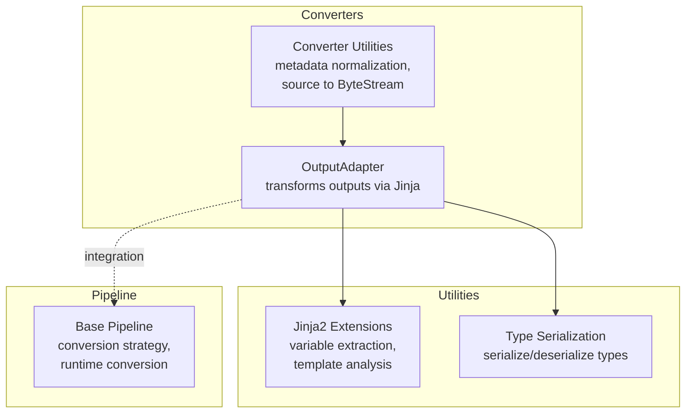
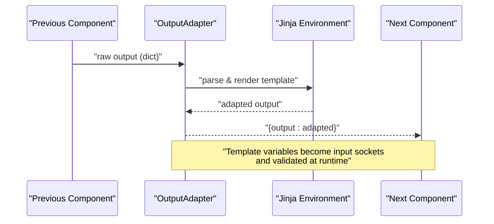
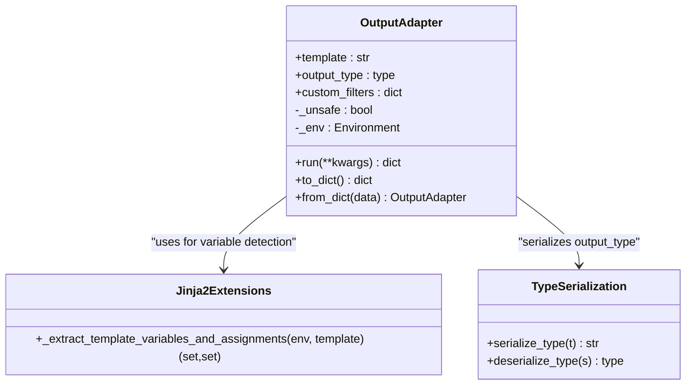
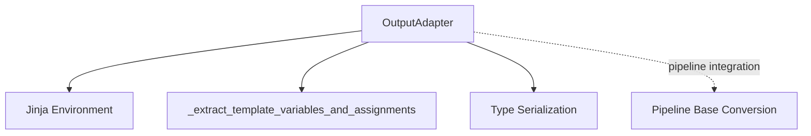

# Output Adapter and Utility Converters

<cite>
**Referenced Files in This Document**
- [output_adapter.py](file://haystack/components/converters/output_adapter.py)
- [test_output_adapter.py](file://test/components/converters/test_output_adapter.py)
- [outputadapter.mdx](file://docs-website/docs/pipeline-components/converters/outputadapter.mdx)
- [utils.py](file://haystack/components/converters/utils.py)
- [jinja2_extensions.py](file://haystack/utils/jinja2_extensions.py)
- [type_serialization.py](file://haystack/utils/type_serialization.py)
- [base.py](file://haystack/core/pipeline/base.py)
- [serialization.mdx](file://docs-website/docs/concepts/pipelines/serialization.mdx)
</cite>

## Table of Contents
1. [Introduction](#introduction)
2. [Project Structure](#project-structure)
3. [Core Components](#core-components)
4. [Architecture Overview](#architecture-overview)
5. [Detailed Component Analysis](#detailed-component-analysis)
6. [Dependency Analysis](#dependency-analysis)
7. [Performance Considerations](#performance-considerations)
8. [Troubleshooting Guide](#troubleshooting-guide)
9. [Conclusion](#conclusion)
10. [Appendices](#appendices)

## Introduction
This document focuses on the OutputAdapter converter and related utility conversion components in the Haystack library. OutputAdapter bridges pipeline components by transforming raw outputs into a structured format suitable for downstream consumers. It leverages Jinja templating to define flexible transformations, supports custom filters, and offers safe or unsafe rendering modes. Utility conversion helpers provide standardized metadata normalization and source-to-byte stream conversions, ensuring consistent input handling across converters.

## Project Structure
The OutputAdapter resides in the converters module alongside other conversion utilities. The documentation website provides component-specific guides, while tests validate behavior across typical and edge cases. Serialization utilities support robust type handling for complex output types.

**Diagram sources**
- [output_adapter.py](file://haystack/components/converters/output_adapter.py#L26-L180)
- [utils.py](file://haystack/components/converters/utils.py#L11-L52)
- [jinja2_extensions.py](file://haystack/utils/jinja2_extensions.py#L121-L135)
- [type_serialization.py](file://haystack/utils/type_serialization.py#L40-L86)
- [base.py](file://haystack/core/pipeline/base.py#L1329-L1349)

**Section sources**
- [output_adapter.py](file://haystack/components/converters/output_adapter.py#L1-L180)
- [utils.py](file://haystack/components/converters/utils.py#L1-L52)
- [jinja2_extensions.py](file://haystack/utils/jinja2_extensions.py#L1-L135)
- [type_serialization.py](file://haystack/utils/type_serialization.py#L1-L229)
- [base.py](file://haystack/core/pipeline/base.py#L1329-L1349)

## Core Components
- OutputAdapter: A component that renders a Jinja template to transform upstream outputs into a downstream-compatible format. It validates templates at initialization, detects input variables from the template, and supports custom filters. It can operate in safe or unsafe modes depending on the desired output types.
- Converter Utilities: Helper functions for normalizing metadata and converting various source types into a unified ByteStream for downstream converters.
- Jinja2 Extensions: Utilities for extracting variables and assignments from templates, enabling accurate input type inference and runtime validation.
- Type Serialization: Utilities for serializing and deserializing complex types (including generics) used as output_type in adapters and pipelines.

Key capabilities:
- Flexible data transformation using Jinja templates
- Safe rendering by default with sandboxed environment
- Unsafe mode for advanced output types (e.g., Document, Answer)
- Custom filters for domain-specific transformations
- Automatic input socket inference from template variables
- Robust serialization/deserialization of types and filters

**Section sources**
- [output_adapter.py](file://haystack/components/converters/output_adapter.py#L26-L180)
- [utils.py](file://haystack/components/converters/utils.py#L11-L52)
- [jinja2_extensions.py](file://haystack/utils/jinja2_extensions.py#L121-L135)
- [type_serialization.py](file://haystack/utils/type_serialization.py#L40-L86)

## Architecture Overview
OutputAdapter integrates into pipelines as a converter that standardizes outputs. It relies on Jinja2 for templating and uses utility modules for type handling and template analysis. The pipeline runtime applies conversion strategies when connecting components, complementing OutputAdapter’s explicit transformations.

**Diagram sources**
- [output_adapter.py](file://haystack/components/converters/output_adapter.py#L107-L142)
- [jinja2_extensions.py](file://haystack/utils/jinja2_extensions.py#L121-L135)
- [base.py](file://haystack/core/pipeline/base.py#L1329-L1349)

## Detailed Component Analysis

### OutputAdapter
OutputAdapter transforms component outputs into a structured form using Jinja templates. It:
- Parses and validates the template at initialization
- Infers required inputs from the template (excluding variables assigned inside via set)
- Supports custom filters registered at runtime
- Renders safely by default using a sandboxed environment; unsafe mode enables richer output types
- Serializes and deserializes itself and its filters for pipeline persistence

**Diagram sources**
- [output_adapter.py](file://haystack/components/converters/output_adapter.py#L26-L180)
- [jinja2_extensions.py](file://haystack/utils/jinja2_extensions.py#L121-L135)
- [type_serialization.py](file://haystack/utils/type_serialization.py#L40-L86)

Implementation highlights:
- Template validation and environment selection (safe vs unsafe)
- Variable detection to configure input sockets
- Runtime rendering with error handling and undefined checks
- Serialization of filters and output_type for pipeline persistence

Common use cases:
- Normalizing heterogeneous outputs into a uniform format
- Applying lightweight transformations (e.g., JSON parsing, filtering)
- Bridging components with mismatched schemas

Integration patterns:
- Pair with converters that require normalized metadata
- Preprocess outputs before routing or joining components
- Combine with ConditionalRouter for dynamic branching based on transformed outputs

**Section sources**
- [output_adapter.py](file://haystack/components/converters/output_adapter.py#L26-L180)
- [outputadapter.mdx](file://docs-website/docs/pipeline-components/converters/outputadapter.mdx#L1-L135)
- [test_output_adapter.py](file://test/components/converters/test_output_adapter.py#L25-L220)

### Converter Utilities
Converter utilities provide helper functions to standardize inputs for downstream converters:
- Metadata normalization: Ensures metadata is a list of dictionaries matching the number of sources
- Source-to-ByteStream conversion: Accepts file paths, strings, or existing ByteStream objects and enriches metadata

These utilities simplify building robust pipelines by reducing variability in input formats.

**Section sources**
- [utils.py](file://haystack/components/converters/utils.py#L11-L52)

### Jinja2 Extensions
Jinja2 extensions power OutputAdapter’s template variable detection:
- Extracts undeclared variables and assigned variables from the template AST
- Enables accurate input socket configuration and runtime validation

This ensures that OutputAdapter only requires the variables it needs and prevents silent failures due to missing inputs.

**Section sources**
- [jinja2_extensions.py](file://haystack/utils/jinja2_extensions.py#L121-L135)

### Type Serialization
Type serialization utilities enable robust handling of complex output types:
- Serialize generic types (e.g., list[str], typing.List[str]) to strings and back
- Support union types and nested generics
- Used by OutputAdapter to persist output_type across pipeline serialization

**Section sources**
- [type_serialization.py](file://haystack/utils/type_serialization.py#L40-L86)
- [output_adapter.py](file://haystack/components/converters/output_adapter.py#L144-L179)

## Dependency Analysis
OutputAdapter depends on:
- Jinja2 environment for templating and variable detection
- Type serialization utilities for output_type persistence
- Pipeline base for runtime conversion strategy integration

**Diagram sources**
- [output_adapter.py](file://haystack/components/converters/output_adapter.py#L82-L104)
- [jinja2_extensions.py](file://haystack/utils/jinja2_extensions.py#L121-L135)
- [type_serialization.py](file://haystack/utils/type_serialization.py#L40-L86)
- [base.py](file://haystack/core/pipeline/base.py#L1329-L1349)

**Section sources**
- [output_adapter.py](file://haystack/components/converters/output_adapter.py#L82-L104)
- [base.py](file://haystack/core/pipeline/base.py#L1329-L1349)

## Performance Considerations
- Prefer safe mode for most use cases to avoid overhead and security risks; unsafe mode adds evaluation logic and should be used judiciously.
- Keep templates concise and focused to minimize rendering cost.
- Use custom filters sparingly; heavy computations in filters can degrade performance.
- Leverage metadata normalization and ByteStream conversion early to reduce downstream processing overhead.
- When serializing pipelines, ensure output_type and filters are efficiently represented to avoid large serialized payloads.

## Troubleshooting Guide
Common issues and resolutions:
- Undefined variables in templates: OutputAdapter raises an exception when encountering undefined variables at runtime. Ensure all template variables are provided as inputs.
- Invalid template syntax: Initialization fails if the template is syntactically incorrect. Validate templates before deployment.
- Mismatched output types: If downstream components expect specific types, use unsafe mode or adjust the template to produce the required structure.
- Serialization problems: When persisting pipelines, ensure custom filters are serializable and output_type strings are valid type descriptors.

Operational tips:
- Use tests to validate transformations and error paths.
- Log template rendering warnings for unsafe mode usage.
- Verify input sockets inferred from the template align with actual upstream outputs.

**Section sources**
- [output_adapter.py](file://haystack/components/converters/output_adapter.py#L107-L142)
- [test_output_adapter.py](file://test/components/converters/test_output_adapter.py#L74-L92)
- [serialization.mdx](file://docs-website/docs/concepts/pipelines/serialization.mdx#L141-L191)

## Conclusion
OutputAdapter provides a powerful, flexible mechanism to transform and standardize component outputs within Haystack pipelines. By combining Jinja templating with robust type handling and utility helpers, it enables seamless interoperability across diverse components. Careful use of safe vs unsafe modes, custom filters, and serialization ensures reliable and efficient pipelines tailored to real-world data formats.

## Appendices

### Example Patterns
- Normalizing JSON-like outputs for downstream components requiring structured data
- Converting raw lists into scalars or aggregates using template expressions
- Integrating with converters that require normalized metadata and ByteStream inputs

### Extensibility Guidelines
- Extend OutputAdapter by adding custom filters for domain-specific transformations
- For complex output types, enable unsafe mode thoughtfully and validate inputs rigorously
- When building custom converters, adopt metadata normalization and ByteStream conversion utilities to maintain consistency

[No sources needed since this section provides general guidance]