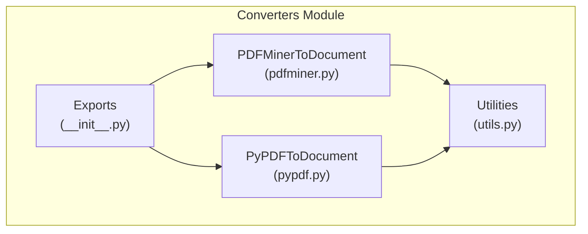
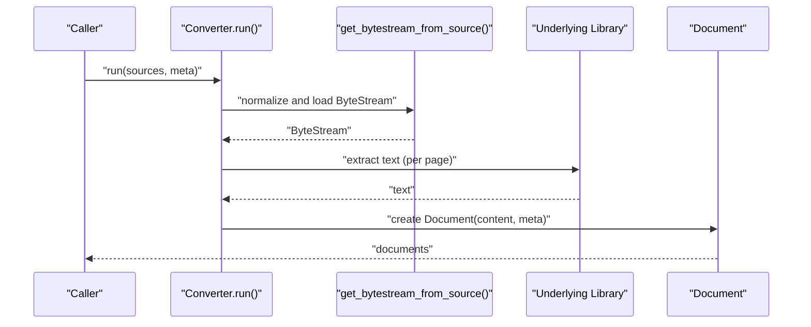
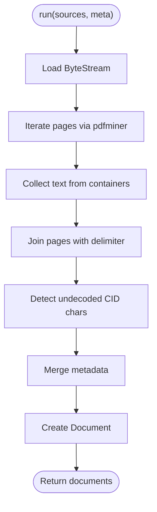
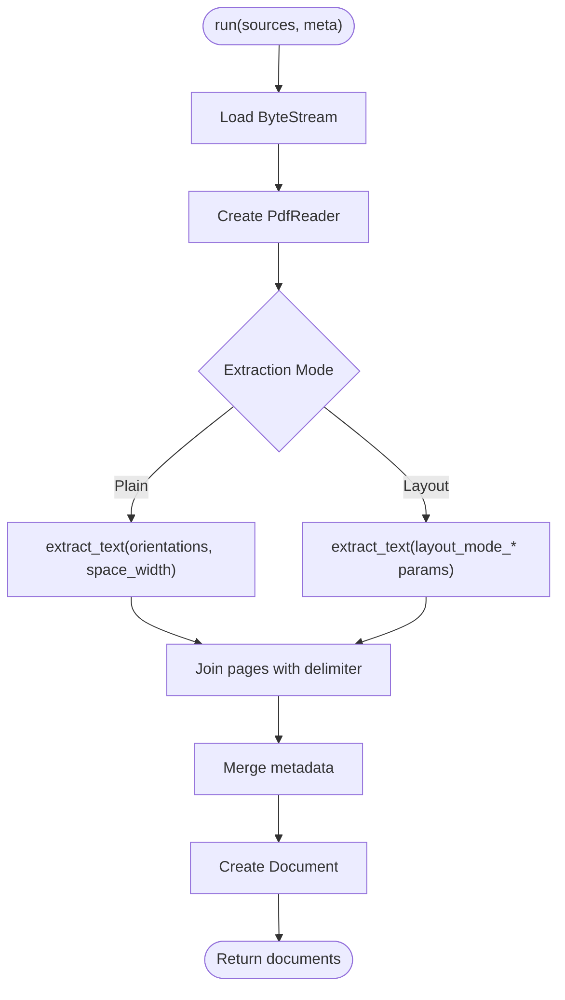
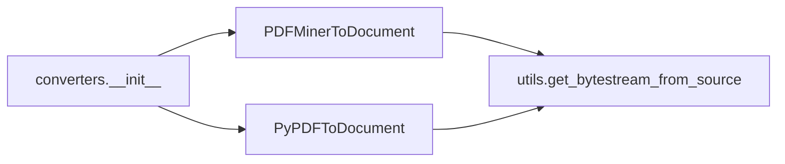

# PDF Document Converters

<cite>
**Referenced Files in This Document**
- [pdfminer.py](file://haystack/components/converters/pdfminer.py)
- [pypdf.py](file://haystack/components/converters/pypdf.py)
- [utils.py](file://haystack/components/converters/utils.py)
- [__init__.py](file://haystack/components/converters/__init__.py)
- [test_pdfminer_to_document.py](file://test/components/converters/test_pdfminer_to_document.py)
- [test_pypdf_to_document.py](file://test/components/converters/test_pypdf_to_document.py)
- [test_pdf_content_extraction_pipeline.py](file://e2e/pipelines/test_pdf_content_extraction_pipeline.py)
- [image_converters_api.md](file://docs-website/reference/haystack-api/image_converters_api.md)
</cite>

## Table of Contents
1. [Introduction](#introduction)
2. [Project Structure](#project-structure)
3. [Core Components](#core-components)
4. [Architecture Overview](#architecture-overview)
5. [Detailed Component Analysis](#detailed-component-analysis)
6. [Dependency Analysis](#dependency-analysis)
7. [Performance Considerations](#performance-considerations)
8. [Troubleshooting Guide](#troubleshooting-guide)
9. [Conclusion](#conclusion)
10. [Appendices](#appendices)

## Introduction
This document explains the PDF document conversion components in the repository, focusing on two converters:
- PDFMinerToDocument: a layout-aware text extractor using pdfminer.six
- PyPDFToDocument: a flexible text extractor using pypdf with plain and layout modes

It compares their approaches, algorithms, and capabilities, and provides guidance on choosing between them based on document complexity, layout preservation needs, and performance. It also covers metadata handling, page range selection, encryption handling, scanned PDFs, mixed content types, font rendering issues, and optimization strategies.

## Project Structure
The PDF conversion logic resides under haystack/components/converters. The key files are:
- PDFMinerToDocument implementation
- PyPDFToDocument implementation
- Converter utilities shared by multiple converters
- Public exports for converters
- Tests validating behavior and usage
- End-to-end pipeline examples

**Diagram sources**
- [pdfminer.py](file://haystack/components/converters/pdfminer.py#L26-L223)
- [pypdf.py](file://haystack/components/converters/pypdf.py#L50-L223)
- [utils.py](file://haystack/components/converters/utils.py#L11-L52)
- [__init__.py](file://haystack/components/converters/__init__.py#L10-L51)

**Section sources**
- [__init__.py](file://haystack/components/converters/__init__.py#L10-L51)

## Core Components
- PDFMinerToDocument
  - Uses pdfminer.six to parse page layouts and extract text while preserving logical grouping (pages, paragraphs, lines).
  - Provides CID character detection to flag missing ToUnicode maps for problematic fonts.
  - Supports metadata merging and optional path normalization.
- PyPDFToDocument
  - Uses pypdf’s PdfReader to extract text with two modes:
    - Plain mode: basic text extraction with orientation and spacing controls
    - Layout mode: experimental layout-aware extraction with vertical spacing, font-height weights, and rotation handling
  - Offers serialization/deserialization and extensive configuration for layout fidelity.

Both components:
- Accept file paths, Path objects, or ByteStream inputs
- Merge ByteStream metadata with user-provided metadata
- Normalize metadata lists to match the number of sources
- Log warnings and return empty content when extraction fails

**Section sources**
- [pdfminer.py](file://haystack/components/converters/pdfminer.py#L26-L223)
- [pypdf.py](file://haystack/components/converters/pypdf.py#L50-L223)
- [utils.py](file://haystack/components/converters/utils.py#L11-L52)

## Architecture Overview
High-level flow for both converters:
- Input sources are normalized to ByteStream
- Bytes are streamed to the underlying library
- Text is extracted per page and joined with page delimiters
- Metadata is merged and a Document is created

**Diagram sources**
- [pdfminer.py](file://haystack/components/converters/pdfminer.py#L158-L223)
- [pypdf.py](file://haystack/components/converters/pypdf.py#L173-L223)
- [utils.py](file://haystack/components/converters/utils.py#L11-L52)

## Detailed Component Analysis

### PDFMinerToDocument
- Approach
  - Iterates over pages via pdfminer’s extract_pages
  - Filters only textual containers and concatenates page texts with a page delimiter
  - Detects undecoded CID characters to highlight missing ToUnicode maps
- Layout preservation
  - Uses LAParams to tune overlap, margins, and ordering; supports vertical text detection and inclusion of figure text
- Text extraction algorithm
  - Walks the page tree, collects text from text containers, and joins pages
- Image handling
  - Does not extract raster images; focuses on textual content
- Table recognition
  - No built-in table detection; relies on text order from layout analysis
- Metadata and page range
  - Merges ByteStream metadata with user-provided metadata; no explicit page-range selection
- Encryption handling
  - Delegates to pdfminer; if decryption fails, extraction will fail and a warning is logged
- Font rendering issues
  - CID detection helps identify undecoded characters; consider adjusting LAParams for better text grouping
- Example usage
  - See tests for typical invocation and metadata merging

**Diagram sources**
- [pdfminer.py](file://haystack/components/converters/pdfminer.py#L106-L131)
- [pdfminer.py](file://haystack/components/converters/pdfminer.py#L132-L157)
- [pdfminer.py](file://haystack/components/converters/pdfminer.py#L158-L223)

**Section sources**
- [pdfminer.py](file://haystack/components/converters/pdfminer.py#L26-L223)
- [test_pdfminer_to_document.py](file://test/components/converters/test_pdfminer_to_document.py#L16-L243)

### PyPDFToDocument
- Approach
  - Uses PdfReader.page.extract_text with configurable modes:
    - Plain mode: orientation filtering, space width defaults
    - Layout mode: vertical spacing inference, font-height weights, rotation stripping with warnings
- Layout preservation
  - Layout mode attempts to preserve vertical spacing and paragraph-like blocks
  - Rotation handling is supported but flagged with warnings when enabled
- Text extraction algorithm
  - Iterates pages and extracts text with mode-specific parameters
- Image handling
  - Does not extract raster images; focuses on textual content
- Table recognition
  - No built-in table detection; layout mode may improve perceived structure
- Metadata and page range
  - Merges ByteStream metadata with user-provided metadata; no explicit page-range selection
- Encryption handling
  - Delegates to pypdf; errors are caught and logged with a warning
- Font rendering issues
  - Space width and layout weights can mitigate misalignment artifacts
- Example usage
  - See tests for mode configuration, serialization, and splitter integration

**Diagram sources**
- [pypdf.py](file://haystack/components/converters/pypdf.py#L158-L172)
- [pypdf.py](file://haystack/components/converters/pypdf.py#L173-L223)

**Section sources**
- [pypdf.py](file://haystack/components/converters/pypdf.py#L50-L223)
- [test_pypdf_to_document.py](file://test/components/converters/test_pypdf_to_document.py#L21-L239)

### Converter Utilities
- get_bytestream_from_source
  - Normalizes inputs to ByteStream, attaches file_path to metadata
- normalize_metadata
  - Ensures metadata list length matches sources count and validates types

**Section sources**
- [utils.py](file://haystack/components/converters/utils.py#L11-L52)

### End-to-End Usage Example
- The end-to-end pipeline demonstrates converting PDFs to documents, splitting by page, routing by length, enriching short pages, and writing to a document store.

**Section sources**
- [test_pdf_content_extraction_pipeline.py](file://e2e/pipelines/test_pdf_content_extraction_pipeline.py#L24-L91)

## Dependency Analysis
- Internal dependencies
  - Both converters depend on utilities for input normalization and metadata handling
  - Exports are centralized in the converters module initializer
- External dependencies
  - PDFMinerToDocument depends on pdfminer.six
  - PyPDFToDocument depends on pypdf
- Coupling and cohesion
  - Converters are cohesive around a single responsibility (PDF to Document)
  - Low coupling to external libraries via lazy imports

**Diagram sources**
- [pdfminer.py](file://haystack/components/converters/pdfminer.py#L12-L14)
- [pypdf.py](file://haystack/components/converters/pypdf.py#L11-L14)
- [utils.py](file://haystack/components/converters/utils.py#L11-L29)
- [__init__.py](file://haystack/components/converters/__init__.py#L10-L51)

**Section sources**
- [__init__.py](file://haystack/components/converters/__init__.py#L10-L51)

## Performance Considerations
- Memory usage
  - Both converters stream bytes into memory-mapped buffers; large documents increase peak memory
  - Prefer splitting pipelines to process smaller chunks (e.g., page-wise) when possible
- Layout mode overhead
  - PyPDFToDocument’s layout mode performs additional computations; use plain mode for speed when layout is not required
- Parallelism
  - Consider batching sources and leveraging downstream components’ parallelism (e.g., splitters, writers)
- Page range selection
  - These converters do not expose page-range selection; filter sources externally or post-process documents
- Scanned PDFs
  - These converters extract only embedded text; scanned PDFs require OCR preprocessing before text extraction
- Font rendering
  - For PDFMinerToDocument, undecoded CID characters indicate missing ToUnicode maps; adjust LAParams or pre-process fonts
  - For PyPDFToDocument, tune space width and layout weights to improve readability

[No sources needed since this section provides general guidance]

## Troubleshooting Guide
- Empty or missing text
  - Non-text-searchable PDFs will produce empty content; verify source or apply OCR preprocessing
- Undecoded CID characters (PDFMinerToDocument)
  - Indicates missing ToUnicode maps; review font embedding or adjust layout parameters
- Rotation artifacts (PyPDFToDocument)
  - Layout mode strips rotated text by default; disable stripping cautiously and monitor warnings
- Metadata conflicts
  - User-supplied metadata overrides overlapping keys from ByteStream; verify merged metadata
- Page breaks
  - Both converters insert page delimiters; verify splitter behavior if expecting page-level granularity
- Encryption
  - Extraction failures often stem from unsupported encryption; confirm credentials or decrypt prior to conversion

**Section sources**
- [test_pdfminer_to_document.py](file://test/components/converters/test_pdfminer_to_document.py#L150-L161)
- [test_pypdf_to_document.py](file://test/components/converters/test_pypdf_to_document.py#L184-L193)
- [pdfminer.py](file://haystack/components/converters/pdfminer.py#L207-L218)
- [pypdf.py](file://haystack/components/converters/pypdf.py#L203-L207)

## Conclusion
- Choose PDFMinerToDocument when:
  - Layout-aware grouping is desired and you want CID diagnostics
  - You prefer a mature layout parser with fine-grained LAParams control
- Choose PyPDFToDocument when:
  - You need flexibility between plain and layout modes
  - You want built-in serialization and robust defaults
- For scanned or non-text-searchable PDFs, integrate OCR before applying either converter.
- For page-range selection, filter sources or post-process documents.
- For optimal performance, prefer plain mode when layout is unnecessary, and consider page-level processing to reduce memory pressure.

[No sources needed since this section summarizes without analyzing specific files]

## Appendices

### Choosing Between PDFMinerToDocument and PyPDFToDocument
- Use PDFMinerToDocument if:
  - You need strong layout grouping and paragraph detection
  - You want CID diagnostics to catch font issues early
- Use PyPDFToDocument if:
  - You need experimental layout mode with adjustable weights and spacing
  - You prefer straightforward serialization and mode switching

**Section sources**
- [pdfminer.py](file://haystack/components/converters/pdfminer.py#L26-L223)
- [pypdf.py](file://haystack/components/converters/pypdf.py#L50-L223)

### Handling Images and Tables
- Images
  - These converters focus on text; use PDFToImageContent to extract page images and pair with text extraction
- Tables
  - No built-in table detection; consider post-processing text with table-aware parsers or OCR pipelines

**Section sources**
- [image_converters_api.md](file://docs-website/reference/haystack-api/image_converters_api.md#L268-L298)

### Page Range Selection
- Not supported by these converters
- Workaround: filter sources externally or split documents after conversion

[No sources needed since this section provides general guidance]