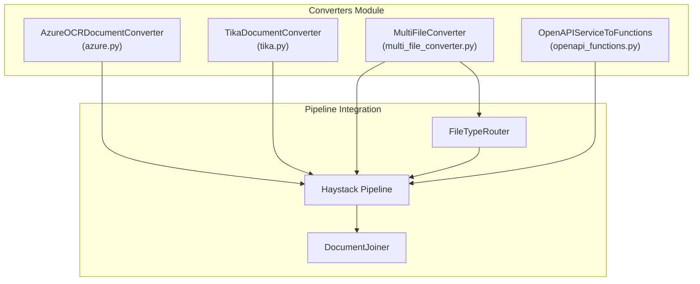
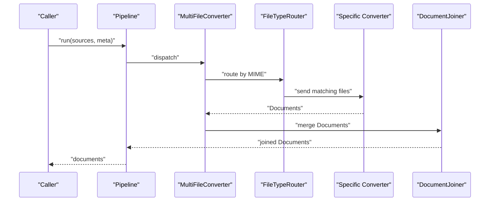
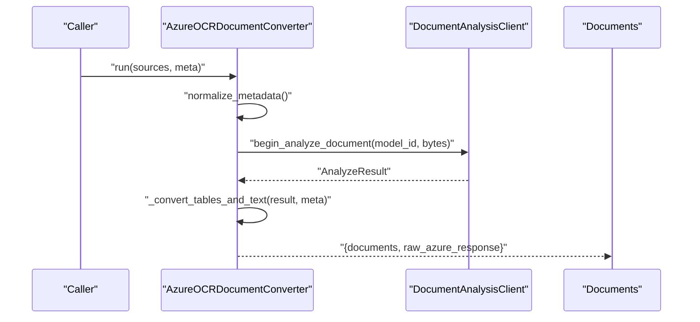
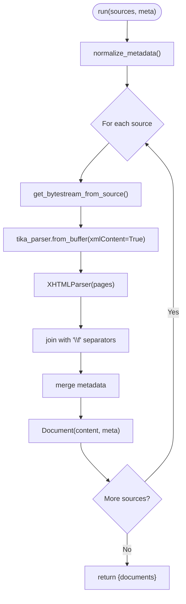
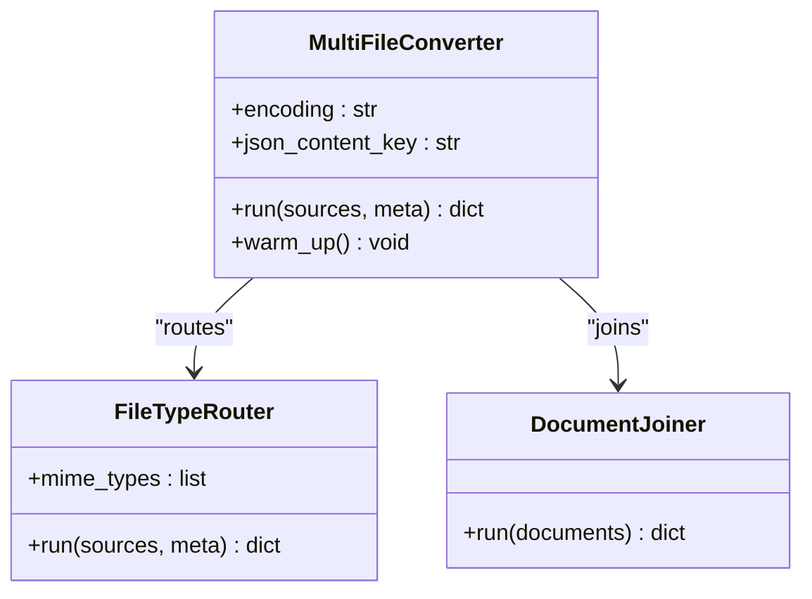
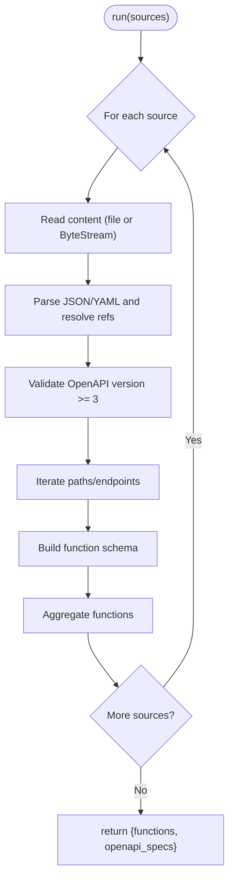
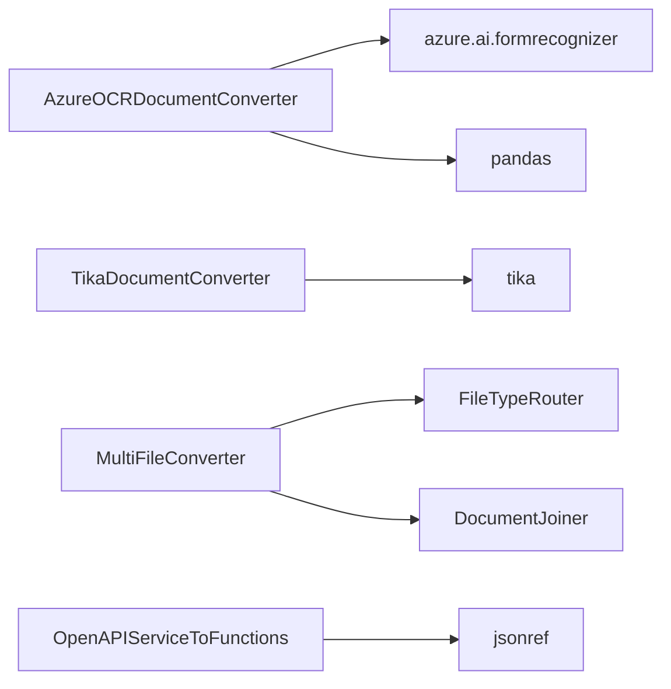

# Specialized and OCR Converters

<cite>
**Referenced Files in This Document**
- [azure.py](file://haystack/components/converters/azure.py)
- [tika.py](file://haystack/components/converters/tika.py)
- [multi_file_converter.py](file://haystack/components/converters/multi_file_converter.py)
- [openapi_functions.py](file://haystack/components/converters/openapi_functions.py)
- [__init__.py](file://haystack/components/converters/__init__.py)
- [azureocrdocumentconverter.mdx](file://docs-website/docs/pipeline-components/converters/azureocrdocumentconverter.mdx)
- [multifileconverter.mdx](file://docs-website/docs/pipeline-components/converters/multifileconverter.mdx)
- [openapiservicetofunctions.mdx](file://docs-website/docs/pipeline-components/converters/openapiservicetofunctions.mdx)
- [test_azure_ocr_doc_converter.py](file://test/components/converters/test_azure_ocr_doc_converter.py)
- [test_tika_doc_converter.py](file://test/components/converters/test_tika_doc_converter.py)
- [test_multi_file_converter.py](file://test/components/converters/test_multi_file_converter.py)
</cite>

## Table of Contents
1. [Introduction](#introduction)
2. [Project Structure](#project-structure)
3. [Core Components](#core-components)
4. [Architecture Overview](#architecture-overview)
5. [Detailed Component Analysis](#detailed-component-analysis)
6. [Dependency Analysis](#dependency-analysis)
7. [Performance Considerations](#performance-considerations)
8. [Troubleshooting Guide](#troubleshooting-guide)
9. [Conclusion](#conclusion)
10. [Appendices](#appendices)

## Introduction
This document focuses on four specialized converter components in the Haystack ecosystem:
- Azure OCR Document Converter: Cloud-based OCR for scanned documents and images.
- Tika Document Converter: Universal document processing via Apache Tika.
- MultiFileConverter: Batch processing multiple file types through a unified pipeline.
- OpenAPI Service To Functions: Dynamic function generation for OpenAI-style function calling from OpenAPI 3.x specs.

It explains configuration, supported formats, metadata handling, authentication, performance tuning, error handling, rate limiting, and cost optimization strategies for cloud-based services.

## Project Structure
The converters are implemented as individual components under the converters module. Each component exposes a run method compatible with Haystack’s component interface and integrates with the broader pipeline ecosystem.

**Diagram sources**
- [azure.py](file://haystack/components/converters/azure.py#L29-L194)
- [tika.py](file://haystack/components/converters/tika.py#L52-L144)
- [multi_file_converter.py](file://haystack/components/converters/multi_file_converter.py#L37-L134)
- [openapi_functions.py](file://haystack/components/converters/openapi_functions.py#L22-L258)

**Section sources**
- [__init__.py](file://haystack/components/converters/__init__.py)
- [azure.py](file://haystack/components/converters/azure.py#L29-L194)
- [tika.py](file://haystack/components/converters/tika.py#L52-L144)
- [multi_file_converter.py](file://haystack/components/converters/multi_file_converter.py#L37-L134)
- [openapi_functions.py](file://haystack/components/converters/openapi_functions.py#L22-L258)

## Core Components
- AzureOCRDocumentConverter: Performs OCR using Azure Document Intelligence, extracting text and tabular data, with configurable reading order and context preservation.
- TikaDocumentConverter: Parses diverse document formats via a running Tika server, returning structured text with page boundaries.
- MultiFileConverter: A super component orchestrating a pipeline to route and convert multiple file types to Documents.
- OpenAPIServiceToFunctions: Translates OpenAPI 3.x specifications into function definitions suitable for OpenAI-style function calling.

**Section sources**
- [azure.py](file://haystack/components/converters/azure.py#L29-L194)
- [tika.py](file://haystack/components/converters/tika.py#L52-L144)
- [multi_file_converter.py](file://haystack/components/converters/multi_file_converter.py#L37-L134)
- [openapi_functions.py](file://haystack/components/converters/openapi_functions.py#L22-L258)

## Architecture Overview
The converters integrate with Haystack’s component framework and pipeline orchestration. MultiFileConverter composes multiple downstream converters behind a routing layer and joins outputs. Azure and Tika converters operate independently, while OpenAPI conversion produces function schemas consumable by LLMs.

**Diagram sources**
- [multi_file_converter.py](file://haystack/components/converters/multi_file_converter.py#L84-L123)

## Detailed Component Analysis

### Azure OCR Document Converter
Purpose:
- Extract text and tabular data from PDFs, images, and office documents using Azure Document Intelligence.
- Support configurable reading order (natural vs. single-column) and context-aware table metadata.

Key configuration:
- endpoint: Azure resource endpoint.
- api_key: Secret credential.
- model_id: Model identifier (default prebuilt-read).
- preceding_context_len, following_context_len: Table context window sizes.
- merge_multiple_column_headers: Merge multi-row headers into one.
- page_layout: natural or single_column.
- threshold_y: Column grouping threshold (inches for PDF, pixels for images).
- store_full_path: Whether to keep full paths in metadata.

Processing logic:
- Iterates sources, resolves ByteStream, invokes Document Analysis client, collects AnalyzeResult, converts tables and text into Documents, and attaches metadata.

Output:
- documents: List of Documents (text and CSV-like tables).
- raw_azure_response: Raw AnalyzeResult dicts for diagnostics.

**Diagram sources**
- [azure.py](file://haystack/components/converters/azure.py#L119-L161)
- [azure.py](file://haystack/components/converters/azure.py#L195-L211)

Practical configuration examples:
- Authentication: Provide endpoint and API key via environment variables or constructor parameters.
- Languages: Select appropriate model_id per region/language support; consult Azure documentation for model capabilities.
- Output formats: Natural reading order preserves page boundaries; single-column enforces a unified column layout.
- Metadata: Full path control via store_full_path; additional metadata merged per source.

Performance tips:
- Batch multiple pages per request to reduce overhead.
- Use single_column mode with tuned threshold_y for dense text layouts.
- Cache or reuse clients where feasible.

Error handling:
- Skips unreadable sources and logs warnings.
- Logs when no text paragraphs are detected.

Cost optimization:
- Prefer prebuilt-read for broad compatibility.
- Limit concurrent requests and implement retry/backoff.
- Monitor response sizes and pagination thresholds.

**Section sources**
- [azure.py](file://haystack/components/converters/azure.py#L62-L118)
- [azure.py](file://haystack/components/converters/azure.py#L119-L161)
- [azure.py](file://haystack/components/converters/azure.py#L195-L487)
- [azureocrdocumentconverter.mdx](file://docs-website/docs/pipeline-components/converters/azureocrdocumentconverter.mdx)

### Tika Document Converter
Purpose:
- Universal document parsing via Apache Tika server, returning structured text with page separators.

Key configuration:
- tika_url: Tika server endpoint (default http://localhost:9998/tika).
- store_full_path: Metadata path policy.

Processing logic:
- Reads each source into ByteStream, sends buffer to Tika with xmlContent enabled, parses XHTML pages, reconstructs text with page separators.

Supported formats:
- Broad document formats handled by Tika (e.g., PDF, DOCX, RTF, ZIP archives).

**Diagram sources**
- [tika.py](file://haystack/components/converters/tika.py#L91-L144)

Practical configuration examples:
- Run a Tika server locally or remotely; configure tika_url accordingly.
- Use meta to propagate ingestion timestamps or source identifiers.

Performance tips:
- Ensure Tika server is reachable and optimized for throughput.
- Consider chunking large archives or PDFs to reduce memory spikes.

Error handling:
- Skips sources that fail parsing and logs warnings.

**Section sources**
- [tika.py](file://haystack/components/converters/tika.py#L77-L90)
- [tika.py](file://haystack/components/converters/tika.py#L91-L144)

### MultiFileConverter
Purpose:
- Unified batch conversion of multiple file types (CSV, DOCX, HTML, JSON, Markdown, Plain Text, PDF, PPTX, XLSX) using a routed pipeline.

Key configuration:
- encoding: Text encodings for text-based conversions.
- json_content_key: Field name for JSON content extraction.

Pipeline composition:
- FileTypeRouter routes by MIME type.
- Downstream converters handle each type.
- DocumentJoiner merges outputs.

**Diagram sources**
- [multi_file_converter.py](file://haystack/components/converters/multi_file_converter.py#L37-L134)

Practical configuration examples:
- Provide a list of heterogeneous files; metadata is normalized and merged per source.
- Adjust encoding for legacy text files.

Performance tips:
- Leverage routing to avoid unnecessary conversions.
- Use DocumentJoiner to consolidate results efficiently.

Error handling:
- Outputs unclassified and failed channels for diagnostics.

**Section sources**
- [multi_file_converter.py](file://haystack/components/converters/multi_file_converter.py#L37-L134)
- [multifileconverter.mdx](file://docs-website/docs/pipeline-components/converters/multifileconverter.mdx)

### OpenAPI Service To Functions
Purpose:
- Convert OpenAPI 3.x specifications into function definitions compatible with OpenAI-style function calling.

Key configuration:
- Accepts local file paths or ByteStream inputs in JSON or YAML.
- Resolves JSON references automatically.

Processing logic:
- Validates minimum OpenAPI version.
- Iterates paths and endpoints to build function schemas with names, descriptions, and parameter schemas.
- Returns both function definitions and resolved OpenAPI specs.

**Diagram sources**
- [openapi_functions.py](file://haystack/components/converters/openapi_functions.py#L56-L115)
- [openapi_functions.py](file://haystack/components/converters/openapi_functions.py#L117-L151)
- [openapi_functions.py](file://haystack/components/converters/openapi_functions.py#L232-L257)

Practical configuration examples:
- Provide a single-file or multi-file list of OpenAPI specs.
- Ensure each endpoint has a unique operationId and a description/summary.

Performance tips:
- Keep OpenAPI specs concise and avoid deeply nested references.
- Validate schemas upstream to reduce runtime parsing overhead.

Error handling:
- Raises ValueError for invalid specs or missing fields.
- Emits warnings for unsupported or empty sources.

**Section sources**
- [openapi_functions.py](file://haystack/components/converters/openapi_functions.py#L22-L115)
- [openapi_functions.py](file://haystack/components/converters/openapi_functions.py#L117-L258)
- [openapiservicetofunctions.mdx](file://docs-website/docs/pipeline-components/converters/openapiservicetofunctions.mdx)

## Dependency Analysis
- AzureOCRDocumentConverter depends on Azure Form Recognizer SDK and pandas for tabular export.
- TikaDocumentConverter depends on the tika library and a running Tika server.
- MultiFileConverter composes FileTypeRouter and multiple downstream converters plus DocumentJoiner.
- OpenAPIServiceToFunctions depends on jsonref and supports JSON/YAML inputs.

**Diagram sources**
- [azure.py](file://haystack/components/converters/azure.py#L21-L26)
- [tika.py](file://haystack/components/converters/tika.py#L16-L17)
- [multi_file_converter.py](file://haystack/components/converters/multi_file_converter.py#L10-L21)
- [openapi_functions.py](file://haystack/components/converters/openapi_functions.py#L18-L19)

**Section sources**
- [azure.py](file://haystack/components/converters/azure.py#L21-L26)
- [tika.py](file://haystack/components/converters/tika.py#L16-L17)
- [multi_file_converter.py](file://haystack/components/converters/multi_file_converter.py#L10-L21)
- [openapi_functions.py](file://haystack/components/converters/openapi_functions.py#L18-L19)

## Performance Considerations
- Azure OCR:
  - Use batch requests judiciously; large multi-page documents increase latency.
  - Tune threshold_y for single_column mode to balance readability and accuracy.
  - Reuse connections and manage concurrency to avoid throttling.
- Tika:
  - Ensure Tika server is provisioned with adequate CPU/RAM for concurrent requests.
  - Consider splitting very large archives or PDFs into smaller chunks.
- MultiFileConverter:
  - Minimize redundant conversions by leveraging routing and early exits.
  - Use DocumentJoiner to consolidate results efficiently.
- OpenAPI To Functions:
  - Pre-validate and simplify OpenAPI specs to reduce runtime processing.
  - Cache resolved specs when reused frequently.

[No sources needed since this section provides general guidance]

## Troubleshooting Guide
Common issues and resolutions:
- Azure OCR:
  - Authentication failures: Verify endpoint and API key; ensure environment variables are set.
  - No text detected: Confirm model_id supports the document type; switch to natural layout if needed.
  - Rate limits/throttling: Implement retries with exponential backoff; monitor quotas.
- Tika:
  - Server unreachable: Confirm tika_url is correct and server is running.
  - Parsing errors: Validate file integrity; try alternative parsers or servers.
- MultiFileConverter:
  - Unrecognized MIME types: Add custom mappings or ensure standard extensions are present.
  - Missing outputs: Check DocumentJoiner connections and ensure all branches produce Documents.
- OpenAPI To Functions:
  - Invalid spec: Ensure OpenAPI version >= 3 and each endpoint has operationId and description.
  - Empty function list: Verify schemas define properties or parameters.

**Section sources**
- [azure.py](file://haystack/components/converters/azure.py#L142-L146)
- [tika.py](file://haystack/components/converters/tika.py#L114-L134)
- [openapi_functions.py](file://haystack/components/converters/openapi_functions.py#L133-L143)
- [test_azure_ocr_doc_converter.py](file://test/components/converters/test_azure_ocr_doc_converter.py)
- [test_tika_doc_converter.py](file://test/components/converters/test_tika_doc_converter.py)
- [test_multi_file_converter.py](file://test/components/converters/test_multi_file_converter.py)

## Conclusion
These converters enable robust, scalable document processing across diverse formats and environments. Azure OCR excels at multi-language, multi-page OCR with contextual awareness; Tika offers broad compatibility for structured text extraction; MultiFileConverter streamlines heterogeneous file ingestion; and OpenAPI To Functions bridges external APIs with LLM function calling. Proper configuration, monitoring, and optimization are essential for production-grade reliability and cost control.

[No sources needed since this section summarizes without analyzing specific files]

## Appendices
- Additional documentation references:
  - Azure OCR Document Converter: [azureocrdocumentconverter.mdx](file://docs-website/docs/pipeline-components/converters/azureocrdocumentconverter.mdx)
  - MultiFileConverter: [multifileconverter.mdx](file://docs-website/docs/pipeline-components/converters/multifileconverter.mdx)
  - OpenAPI Service To Functions: [openapiservicetofunctions.mdx](file://docs-website/docs/pipeline-components/converters/openapiservicetofunctions.mdx)

[No sources needed since this section aggregates links without analyzing specific files]