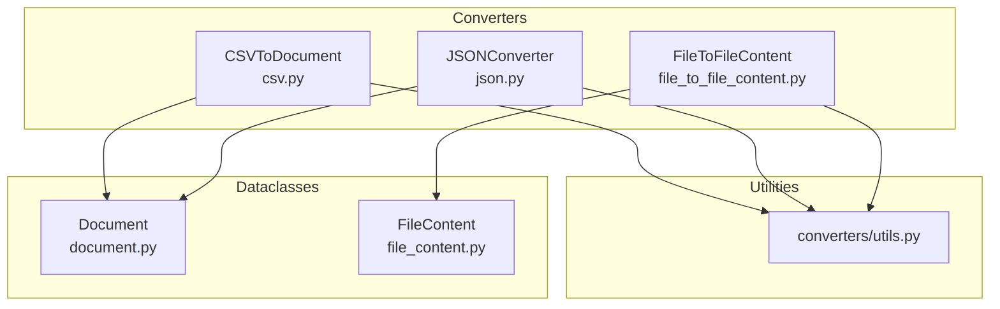
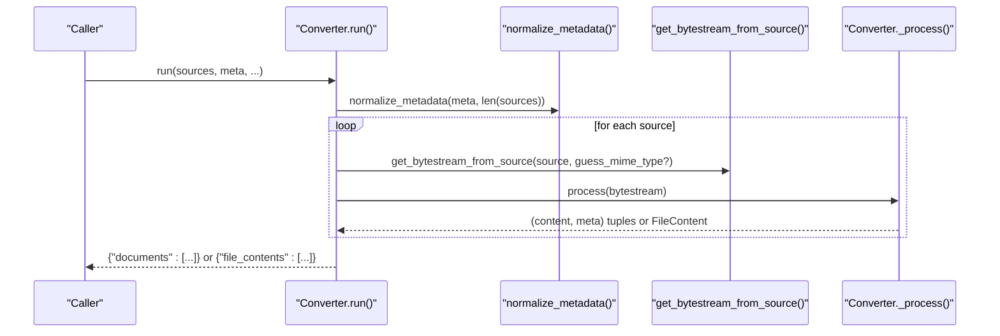
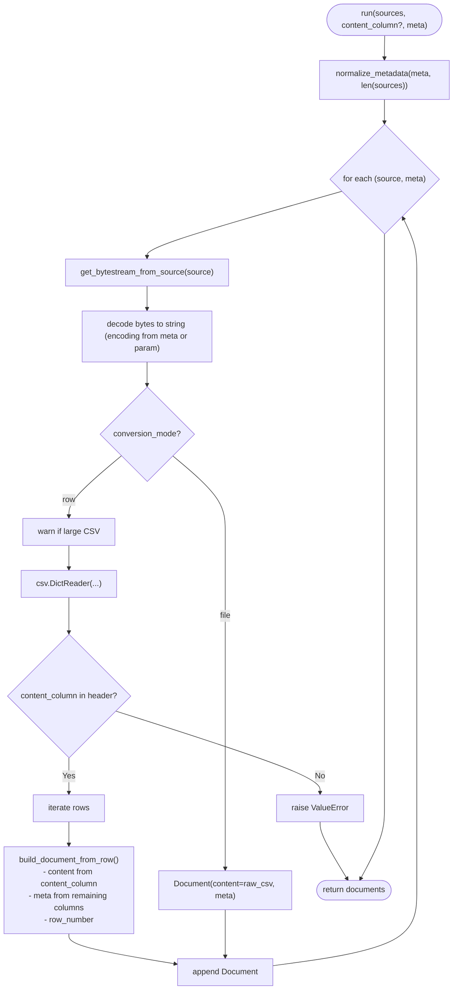
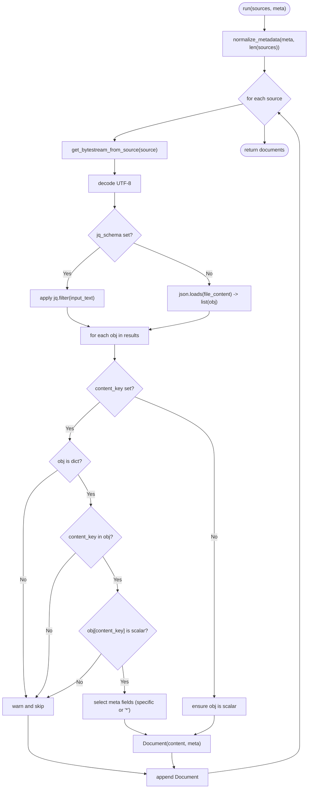
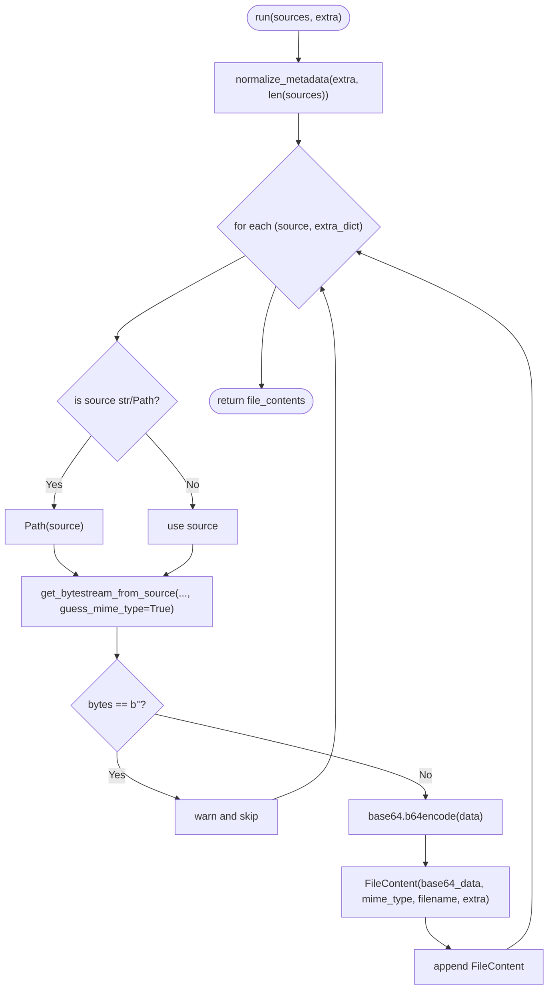
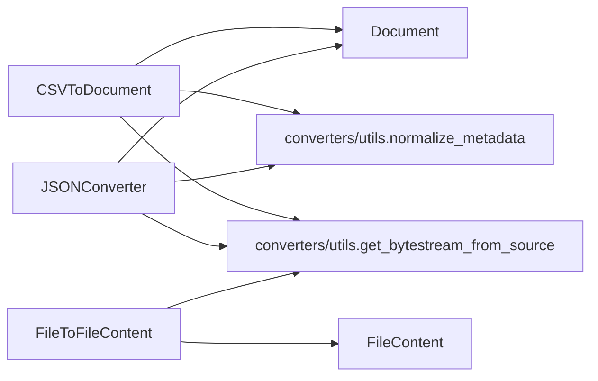

# Structured Data Format Converters

<cite>
**Referenced Files in This Document**
- [csv.py](file://haystack/components/converters/csv.py)
- [json.py](file://haystack/components/converters/json.py)
- [file_to_file_content.py](file://haystack/components/converters/file_to_file_content.py)
- [utils.py](file://haystack/components/converters/utils.py)
- [file_content.py](file://haystack/dataclasses/file_content.py)
- [document.py](file://haystack/dataclasses/document.py)
- [test_csv_to_document.py](file://test/components/converters/test_csv_to_document.py)
- [test_json.py](file://test/components/converters/test_json.py)
- [test_file_to_file_content.py](file://test/components/converters/test_file_to_file_content.py)
</cite>

## Table of Contents
1. [Introduction](#introduction)
2. [Project Structure](#project-structure)
3. [Core Components](#core-components)
4. [Architecture Overview](#architecture-overview)
5. [Detailed Component Analysis](#detailed-component-analysis)
6. [Dependency Analysis](#dependency-analysis)
7. [Performance Considerations](#performance-considerations)
8. [Troubleshooting Guide](#troubleshooting-guide)
9. [Conclusion](#conclusion)

## Introduction
This document explains the structured data format conversion components in the Haystack ecosystem with a focus on:
- CSVToDocument: converting CSV files to Documents, including header handling, delimiter detection, and row-to-document mapping.
- JSONConverter: extracting content from JSON with jq filtering, nested object handling, array processing, and schema validation.
- FileToFileContent: extracting raw file content and preparing FileContent objects for multimodal scenarios.

It covers data transformation patterns, metadata enrichment, content normalization, and practical guidance for handling large datasets, memory optimization, and performance tuning. It also includes troubleshooting advice for malformed data, encoding issues, and schema evolution.

## Project Structure
The converters live under haystack/components/converters and rely on shared utilities and dataclasses:
- Converter implementations: CSV, JSON, FileToFileContent
- Shared utilities: get_bytestream_from_source, normalize_metadata
- Output dataclasses: Document, FileContent

**Diagram sources**
- [csv.py](file://haystack/components/converters/csv.py#L20-L230)
- [json.py](file://haystack/components/converters/json.py#L21-L288)
- [file_to_file_content.py](file://haystack/components/converters/file_to_file_content.py#L19-L94)
- [utils.py](file://haystack/components/converters/utils.py#L11-L52)
- [document.py](file://haystack/dataclasses/document.py#L47-L190)
- [file_content.py](file://haystack/dataclasses/file_content.py#L21-L177)

**Section sources**
- [csv.py](file://haystack/components/converters/csv.py#L1-L230)
- [json.py](file://haystack/components/converters/json.py#L1-L288)
- [file_to_file_content.py](file://haystack/components/converters/file_to_file_content.py#L1-L94)
- [utils.py](file://haystack/components/converters/utils.py#L1-L52)
- [document.py](file://haystack/dataclasses/document.py#L1-L190)
- [file_content.py](file://haystack/dataclasses/file_content.py#L1-L177)

## Core Components
- CSVToDocument: Converts CSV sources into Documents. Supports two modes:
  - file mode: one Document per file with raw CSV text.
  - row mode: one Document per row with a configurable content column and metadata enrichment.
- JSONConverter: Extracts content from JSON sources using jq filters or direct keys, with optional metadata extraction and schema validation.
- FileToFileContent: Produces FileContent objects from file paths or ByteStreams, handling base64 encoding and MIME type detection.

Key capabilities:
- Header handling and delimiter detection for CSV.
- Row-to-document mapping with metadata collision avoidance.
- Nested object handling and array processing for JSON.
- Schema validation and error handling for malformed inputs.
- Metadata enrichment and content normalization across formats.
- Binary data handling and base64 encoding for FileContent.

**Section sources**
- [csv.py](file://haystack/components/converters/csv.py#L20-L230)
- [json.py](file://haystack/components/converters/json.py#L21-L288)
- [file_to_file_content.py](file://haystack/components/converters/file_to_file_content.py#L19-L94)

## Architecture Overview
The converters share a common pattern:
- Accept a list of sources (file paths, Path objects, or ByteStreams).
- Normalize metadata to a list aligned with sources.
- Convert each source to a normalized form (ByteStream) and process it.
- Produce outputs in a standardized dictionary with a single key (documents or file_contents).

**Diagram sources**
- [csv.py](file://haystack/components/converters/csv.py#L80-L184)
- [json.py](file://haystack/components/converters/json.py#L249-L287)
- [file_to_file_content.py](file://haystack/components/converters/file_to_file_content.py#L43-L93)
- [utils.py](file://haystack/components/converters/utils.py#L32-L52)

## Detailed Component Analysis

### CSVToDocument
Capabilities:
- Encoding handling: defaults to UTF-8; respects ByteStream encoding metadata.
- Modes:
  - file: produces one Document per file with raw CSV text.
  - row: requires content_column; each row becomes a Document; remaining columns go to metadata with collision-safe keys.
- Delimiter and quote handling: passed to csv.DictReader; validates single-character inputs.
- Metadata enrichment: merges ByteStream meta, user-provided meta, and row-derived metadata (including row_number).
- Error handling: warnings for unreadable sources; strict validation for row mode (missing content_column, invalid header, reader failures).

Processing logic highlights:
- Validates delimiter and quotechar length.
- Decodes bytes to string using configured or ByteStream encoding.
- In row mode, warns for large files and raises on reader failure.
- Builds documents with safe string normalization and metadata deduplication.

**Diagram sources**
- [csv.py](file://haystack/components/converters/csv.py#L80-L230)

**Section sources**
- [csv.py](file://haystack/components/converters/csv.py#L20-L230)
- [utils.py](file://haystack/components/converters/utils.py#L11-L52)
- [document.py](file://haystack/dataclasses/document.py#L47-L190)
- [test_csv_to_document.py](file://test/components/converters/test_csv_to_document.py#L104-L222)

### JSONConverter
Capabilities:
- jq filtering: optional jq_schema to extract arrays or nested objects; requires jq dependency when used.
- Content selection: content_key extracts a scalar value from filtered objects.
- Metadata extraction: extra_meta_fields supports specific keys or wildcard "*" to include all non-content fields.
- Schema validation: strict checks for object/array types and presence of content_key.
- Metadata enrichment: merges ByteStream meta, user-provided meta, and extracted metadata.

Processing logic highlights:
- Validates initialization constraints (either jq_schema or content_key must be set).
- Decodes UTF-8; logs warnings and skips on decoding or filter errors.
- Applies jq filter or loads entire file; iterates over extracted objects.
- Ensures content is scalar; collects metadata according to extra_meta_fields.

**Diagram sources**
- [json.py](file://haystack/components/converters/json.py#L249-L287)

**Section sources**
- [json.py](file://haystack/components/converters/json.py#L21-L288)
- [utils.py](file://haystack/components/converters/utils.py#L11-L52)
- [document.py](file://haystack/dataclasses/document.py#L47-L190)
- [test_json.py](file://test/components/converters/test_json.py#L69-L519)

### FileToFileContent
Capabilities:
- Converts file paths or ByteStreams into FileContent objects.
- Base64 encodes binary data; guesses MIME type when not provided.
- Attaches optional extra metadata per source.
- Handles empty streams and invalid sources gracefully.

Processing logic highlights:
- Normalizes extra metadata to align with sources.
- Uses get_bytestream_from_source with mime type guessing.
- Skips empty streams; warns and continues.
- Encodes data to base64 and constructs FileContent.

**Diagram sources**
- [file_to_file_content.py](file://haystack/components/converters/file_to_file_content.py#L43-L93)

**Section sources**
- [file_to_file_content.py](file://haystack/components/converters/file_to_file_content.py#L19-L94)
- [utils.py](file://haystack/components/converters/utils.py#L11-L52)
- [file_content.py](file://haystack/dataclasses/file_content.py#L21-L177)
- [test_file_to_file_content.py](file://test/components/converters/test_file_to_file_content.py#L15-L125)

## Dependency Analysis
- CSVToDocument depends on:
  - csv module for DictReader and delimiter/quotechar handling.
  - converters/utils for ByteStream creation and metadata normalization.
  - Document for output.
- JSONConverter depends on:
  - jq library (lazy-imported) for filtering.
  - converters/utils for ByteStream creation and metadata normalization.
  - Document for output.
- FileToFileContent depends on:
  - converters/utils for ByteStream creation and metadata normalization.
  - FileContent for output.

**Diagram sources**
- [csv.py](file://haystack/components/converters/csv.py#L11-L13)
- [json.py](file://haystack/components/converters/json.py#L10-L13)
- [file_to_file_content.py](file://haystack/components/converters/file_to_file_content.py#L9-L11)
- [utils.py](file://haystack/components/converters/utils.py#L11-L52)
- [document.py](file://haystack/dataclasses/document.py#L47-L190)
- [file_content.py](file://haystack/dataclasses/file_content.py#L21-L177)

**Section sources**
- [csv.py](file://haystack/components/converters/csv.py#L1-L230)
- [json.py](file://haystack/components/converters/json.py#L1-L288)
- [file_to_file_content.py](file://haystack/components/converters/file_to_file_content.py#L1-L94)
- [utils.py](file://haystack/components/converters/utils.py#L1-L52)

## Performance Considerations
- CSV row mode:
  - Memory warning threshold is set for large files; consider chunking or streaming for very large CSVs.
  - Strict row processing: any row or reader failure aborts processing.
- JSON processing:
  - jq filtering adds overhead; ensure filters are efficient.
  - Large JSON arrays are processed iteratively; schema validation avoids unnecessary work on invalid objects.
- File content:
  - Base64 encoding increases payload size; consider compression or streaming when applicable.
  - MIME type guessing can be expensive; provide explicit mime_type when known.
- General:
  - Normalize metadata once per run to avoid repeated allocations.
  - Prefer ByteStream inputs when metadata is already available to reduce filesystem access.

[No sources needed since this section provides general guidance]

## Troubleshooting Guide
Common issues and resolutions:
- CSV encoding problems:
  - Ensure the correct encoding is set or present in ByteStream meta; otherwise decoding will fail.
  - Tests demonstrate codec errors when mismatched.
- CSV row mode requirements:
  - content_column must be provided and present in the header; otherwise a ValueError is raised.
  - Reader failures raise RuntimeError; verify delimiter and quotechar settings.
- JSON schema issues:
  - Either jq_schema or content_key must be set; otherwise initialization fails.
  - Non-scalar content_key values are skipped; ensure target is a scalar.
  - jq filter errors cause warnings and skipping; validate filters.
- File content:
  - Empty streams are skipped with a warning; ensure sources contain data.
  - Invalid source types produce warnings; ensure sources are str, Path, or ByteStream.
  - Missing or invalid MIME type can cause downstream provider issues; provide mime_type when known.

**Section sources**
- [test_csv_to_document.py](file://test/components/converters/test_csv_to_document.py#L60-L93)
- [test_csv_to_document.py](file://test/components/converters/test_csv_to_document.py#L104-L222)
- [test_json.py](file://test/components/converters/test_json.py#L69-L90)
- [test_json.py](file://test/components/converters/test_json.py#L201-L258)
- [test_file_to_file_content.py](file://test/components/converters/test_file_to_file_content.py#L80-L125)

## Conclusion
These converters provide robust, extensible mechanisms for transforming structured data into Documents or FileContent objects:
- CSVToDocument offers flexible CSV processing with strict row mode and careful metadata handling.
- JSONConverter enables powerful extraction via jq with strong schema validation and metadata enrichment.
- FileToFileContent prepares binary content for multimodal workflows with base64 encoding and MIME type awareness.

Adopt the recommended patterns for metadata normalization, error handling, and performance tuning to build reliable pipelines for large-scale conversions.