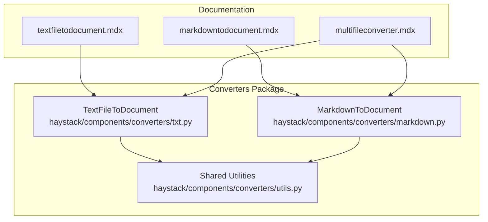
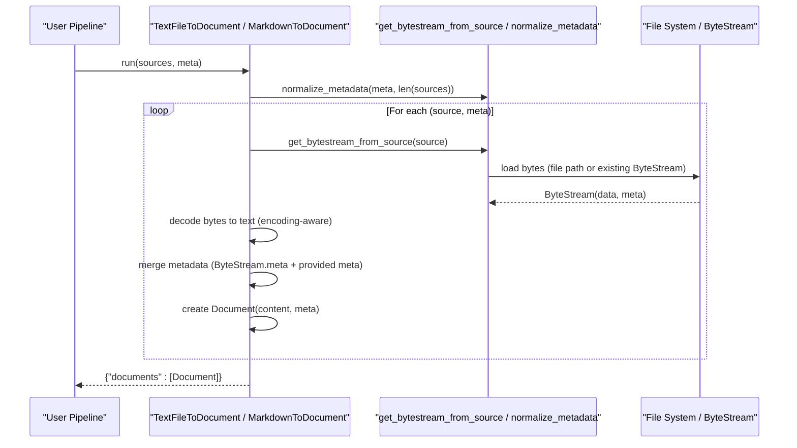
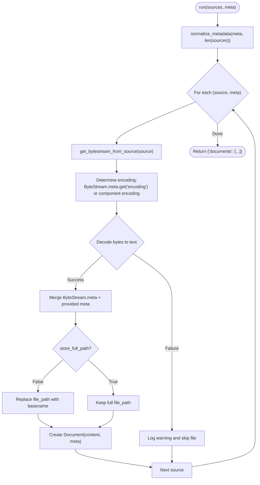
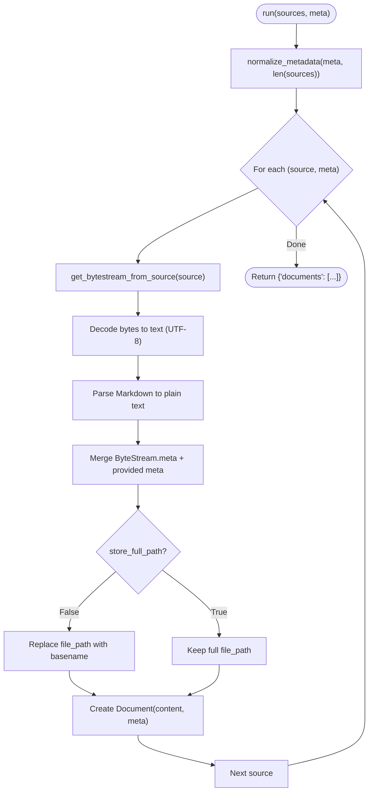
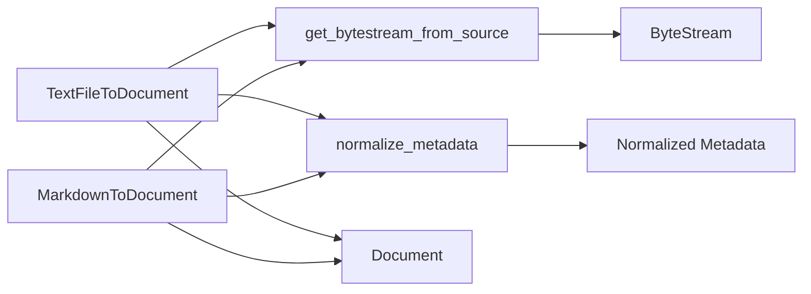

# Text File Converters

<cite>
**Referenced Files in This Document**
- [txt.py](file://haystack/components/converters/txt.py)
- [markdown.py](file://haystack/components/converters/markdown.py)
- [utils.py](file://haystack/components/converters/utils.py)
- [textfiletodocument.mdx](file://docs-website/docs/pipeline-components/converters/textfiletodocument.mdx)
- [markdowntodocument.mdx](file://docs-website/docs/pipeline-components/converters/markdowntodocument.mdx)
- [multifileconverter.mdx](file://docs-website/docs/pipeline-components/converters/multifileconverter.mdx)
- [simplify-textfiletodocument-c9d2fb7ed2c848ed.yaml](file://releasenotes\notes\simplify-textfiletodocument-c9d2fb7ed2c848ed.yaml)
- [single-meta-in-markdown2document-082bae7b20bd605d.yaml](file://releasenotes\notes\single-meta-in-markdown2document-082bae7b20bd605d.yaml)
</cite>

## Table of Contents
1. [Introduction](#introduction)
2. [Project Structure](#project-structure)
3. [Core Components](#core-components)
4. [Architecture Overview](#architecture-overview)
5. [Detailed Component Analysis](#detailed-component-analysis)
6. [Dependency Analysis](#dependency-analysis)
7. [Performance Considerations](#performance-considerations)
8. [Troubleshooting Guide](#troubleshooting-guide)
9. [Conclusion](#conclusion)
10. [Appendices](#appendices)

## Introduction
This document explains the text file conversion components in Haystack, focusing on TextFileToDocument and MarkdownToDocument. These components transform raw text and Markdown files into Document objects suitable for downstream retrieval and indexing pipelines. The guide covers conversion mechanics, encoding handling, metadata merging, content formatting options, and practical configuration tips for typical use cases such as log files, documentation, and note-taking app exports. Guidance on handling large files, memory optimization, and robust error handling for corrupted or malformed inputs is also included.

## Project Structure
The converters are implemented under the converters package and integrated via lazy imports. The relevant files for this document are:
- TextFileToDocument: [txt.py](file://haystack/components/converters/txt.py)
- MarkdownToDocument: [markdown.py](file://haystack/components/converters/markdown.py)
- Shared utilities for source handling and metadata normalization: [utils.py](file://haystack/components/converters/utils.py)

**Diagram sources**
- [txt.py](file://haystack/components/converters/txt.py#L1-L98)
- [markdown.py](file://haystack/components/converters/markdown.py#L1-L117)
- [utils.py](file://haystack/components/converters/utils.py#L1-L52)
- [textfiletodocument.mdx](file://docs-website/docs/pipeline-components/converters/textfiletodocument.mdx#L1-L60)
- [markdowntodocument.mdx](file://docs-website/docs/pipeline-components/converters/markdowntodocument.mdx#L1-L70)
- [multifileconverter.mdx](file://docs-website/docs/pipeline-components/converters/multifileconverter.mdx#L30-L50)

**Section sources**
- [txt.py](file://haystack/components/converters/txt.py#L1-L98)
- [markdown.py](file://haystack/components/converters/markdown.py#L1-L117)
- [utils.py](file://haystack/components/converters/utils.py#L1-L52)
- [textfiletodocument.mdx](file://docs-website/docs/pipeline-components/converters/textfiletodocument.mdx#L1-L60)
- [markdowntodocument.mdx](file://docs-website/docs/pipeline-components/converters/markdowntodocument.mdx#L1-L70)
- [multifileconverter.mdx](file://docs-website/docs/pipeline-components/converters/multifileconverter.mdx#L30-L50)

## Core Components
- TextFileToDocument: Converts plain text files into Document objects. Supports configurable encoding and optional metadata attachment. It reads from file paths or ByteStream inputs and decodes content using the specified or inferred encoding.
- MarkdownToDocument: Converts Markdown files into plain text Documents. Uses markdown-it-py and mdit_plain to render Markdown to plain text. Provides options to enable table-to-single-line rendering and to show a progress bar during conversion.

Key capabilities:
- Accepts file paths, Path objects, or ByteStream inputs.
- Merges metadata from ByteStream and user-provided meta.
- Handles encoding explicitly for text decoding and defaults to UTF-8 when unspecified.
- Produces Document objects with content and metadata.

**Section sources**
- [txt.py](file://haystack/components/converters/txt.py#L16-L98)
- [markdown.py](file://haystack/components/converters/markdown.py#L24-L117)
- [utils.py](file://haystack/components/converters/utils.py#L11-L52)

## Architecture Overview
Both components share a common pattern:
- Normalize metadata to a list aligned with the number of sources.
- Iterate over sources, build a ByteStream when needed, decode content, merge metadata, and produce a Document.

**Diagram sources**
- [txt.py](file://haystack/components/converters/txt.py#L53-L98)
- [markdown.py](file://haystack/components/converters/markdown.py#L60-L117)
- [utils.py](file://haystack/components/converters/utils.py#L11-L52)

## Detailed Component Analysis

### TextFileToDocument
Purpose:
- Extract text content from plain text files and produce Document objects.

Conversion process:
- Accepts a list of sources (paths, Path objects, or ByteStream).
- Normalizes metadata to align with sources.
- Builds a ByteStream per source and decodes bytes to text using the configured encoding or the encoding specified in the ByteStream metadata.
- Merges ByteStream metadata with user-provided metadata.
- Stores either the full path or just the filename in metadata based on configuration.

Encoding handling:
- Default encoding is UTF-8.
- If a ByteStream carries an encoding in its metadata, it overrides the component’s encoding setting.

Metadata preservation:
- Merges ByteStream.meta and provided meta.
- Optionally replaces file_path with the basename if store_full_path is disabled.

Output Document structure:
- content: decoded text string.
- meta: merged metadata dictionary (including file_path, mime_type, and any user-provided fields).

Common configurations:
- Set encoding explicitly for legacy encodings (e.g., latin-1, cp1252).
- Enable store_full_path to preserve absolute paths for downstream filtering.
- Attach global or per-source metadata via the meta parameter.

Practical examples:
- Indexing documentation files with custom metadata.
- Processing log files with specific encodings and adding ingestion timestamps.
- Handling mixed encodings by passing ByteStream objects with per-file encoding hints.

**Diagram sources**
- [txt.py](file://haystack/components/converters/txt.py#L53-L98)
- [utils.py](file://haystack/components/converters/utils.py#L11-L52)

**Section sources**
- [txt.py](file://haystack/components/converters/txt.py#L16-L98)
- [utils.py](file://haystack/components/converters/utils.py#L11-L52)
- [textfiletodocument.mdx](file://docs-website/docs/pipeline-components/converters/textfiletodocument.mdx#L1-L60)
- [multifileconverter.mdx](file://docs-website/docs/pipeline-components/converters/multifileconverter.mdx#L30-L50)
- [simplify-textfiletodocument-c9d2fb7ed2c848ed.yaml](file://releasenotes\notes\simplify-textfiletodocument-c9d2fb7ed2c848ed.yaml#L1-L3)

### MarkdownToDocument
Purpose:
- Convert Markdown files into plain text Documents for indexing.

Conversion process:
- Accepts a list of sources (paths, Path objects, or ByteStream).
- Normalizes metadata to align with sources.
- Builds a ByteStream per source and decodes bytes to text using UTF-8.
- Renders Markdown to plain text using markdown-it-py with mdit_plain renderer.
- Optionally enables table parsing to collapse tables into a single line.
- Merges metadata and creates Document objects.

Encoding handling:
- Forces UTF-8 decoding for Markdown content.

Metadata preservation:
- Merges ByteStream.meta and provided meta.
- Optionally replaces file_path with the basename if store_full_path is disabled.

Output Document structure:
- content: plain text extracted from Markdown.
- meta: merged metadata dictionary (including file_path, mime_type, and any user-provided fields).

Common configurations:
- Enable table_to_single_line to simplify table content for downstream processing.
- Disable progress_bar for quiet operation in batch conversions.
- Attach metadata such as source URL, date added, or document category.

Practical examples:
- Indexing documentation repositories exported as Markdown.
- Converting note-taking app exports (e.g., Obsidian, Roam) to plain text for semantic search.
- Batch processing changelogs and release notes.

**Diagram sources**
- [markdown.py](file://haystack/components/converters/markdown.py#L60-L117)
- [utils.py](file://haystack/components/converters/utils.py#L11-L52)

**Section sources**
- [markdown.py](file://haystack/components/converters/markdown.py#L24-L117)
- [utils.py](file://haystack/components/converters/utils.py#L11-L52)
- [markdowntodocument.mdx](file://docs-website/docs/pipeline-components/converters/markdowntodocument.mdx#L1-L70)
- [single-meta-in-markdown2document-082bae7b20bd605d.yaml](file://releasenotes\notes\single-meta-in-markdown2document-082bae7b20bd605d.yaml#L1-L4)

## Dependency Analysis
- Both components rely on shared utilities:
  - get_bytestream_from_source: builds a ByteStream from file paths or accepts an existing ByteStream.
  - normalize_metadata: ensures meta is a list of dictionaries matching the number of sources.
- TextFileToDocument:
  - Decodes content using the effective encoding (ByteStream meta or component parameter).
  - Produces Document objects with merged metadata.
- MarkdownToDocument:
  - Requires markdown-it-py and mdit_plain (lazy-import guarded).
  - Renders Markdown to plain text and produces Document objects with merged metadata.

**Diagram sources**
- [txt.py](file://haystack/components/converters/txt.py#L53-L98)
- [markdown.py](file://haystack/components/converters/markdown.py#L60-L117)
- [utils.py](file://haystack/components/converters/utils.py#L11-L52)

**Section sources**
- [txt.py](file://haystack/components/converters/txt.py#L9-L11)
- [markdown.py](file://haystack/components/converters/markdown.py#L11-L18)
- [utils.py](file://haystack/components/converters/utils.py#L11-L52)

## Performance Considerations
- Prefer ByteStream inputs for large files to avoid repeated filesystem reads and to leverage in-memory buffers.
- Use store_full_path=False to reduce metadata size when only filenames are needed.
- For MarkdownToDocument, disable progress_bar in production runs to minimize overhead.
- Batch sources to reduce per-call overhead; the components iterate linearly over sources.
- Memory optimization:
  - Avoid loading entire files into memory unnecessarily; the components operate on ByteStream data.
  - For very large files, consider splitting into smaller chunks upstream or using streaming pipelines.
- Encoding selection:
  - Explicitly set encoding in ByteStream meta for mixed-encoding batches to prevent repeated fallback attempts.

[No sources needed since this section provides general guidance]

## Troubleshooting Guide
Common issues and resolutions:
- Corrupted or unreadable files:
  - Both components log warnings and skip problematic sources instead of failing the entire batch. Review logs to identify skipped files.
- Encoding mismatches:
  - Ensure ByteStream meta contains the correct encoding for non-UTF-8 files. If absent, set the component’s encoding parameter.
- Mismatched metadata length:
  - When providing meta as a list, ensure its length equals the number of sources; otherwise, a ValueError is raised.
- Missing Markdown dependencies:
  - Install markdown-it-py and mdit_plain as documented; the component checks for these dependencies lazily.

Operational tips:
- Add ingestion timestamps and source identifiers to meta to aid debugging and provenance.
- For log files with special characters, explicitly set encoding to match the log format (e.g., latin-1, cp1252).
- For documentation and note-taking exports, enable table_to_single_line in MarkdownToDocument to simplify table content.

**Section sources**
- [txt.py](file://haystack/components/converters/txt.py#L74-L98)
- [markdown.py](file://haystack/components/converters/markdown.py#L84-L117)
- [utils.py](file://haystack/components/converters/utils.py#L32-L52)

## Conclusion
TextFileToDocument and MarkdownToDocument provide robust, metadata-rich conversion of plain text and Markdown files into Document objects. Their design emphasizes flexibility in encoding, metadata handling, and compatibility with ByteStream inputs. By configuring encoding, metadata, and path storage appropriately, you can efficiently index diverse content such as logs, documentation, and note-taking exports while maintaining resilience against malformed inputs.

[No sources needed since this section summarizes without analyzing specific files]

## Appendices

### Practical Configuration Examples
- Plain text files:
  - Use TextFileToDocument with encoding set to match the file’s encoding.
  - Attach meta such as source_url, date_added, and category.
  - Example reference: [textfiletodocument.mdx](file://docs-website/docs/pipeline-components/converters/textfiletodocument.mdx#L25-L60)
- Markdown files:
  - Use MarkdownToDocument with table_to_single_line enabled for simplified table content.
  - Attach meta such as document_type, version, or author.
  - Example reference: [markdowntodocument.mdx](file://docs-website/docs/pipeline-components/converters/markdowntodocument.mdx#L25-L70)
- Multi-file conversion:
  - Combine with MultiFileConverter to apply a default encoding to TXT/CSV/MD files; per-file ByteStream encoding overrides the default.
  - Example reference: [multifileconverter.mdx](file://docs-website/docs/pipeline-components/converters/multifileconverter.mdx#L30-L50)

### Output Document Fields
- content: extracted text (decoded bytes for TextFileToDocument; plain text for MarkdownToDocument).
- meta: merged metadata including file_path, mime_type, and any user-provided fields.

**Section sources**
- [txt.py](file://haystack/components/converters/txt.py#L90-L96)
- [markdown.py](file://haystack/components/converters/markdown.py#L108-L114)