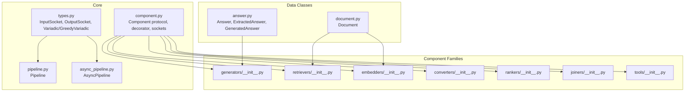
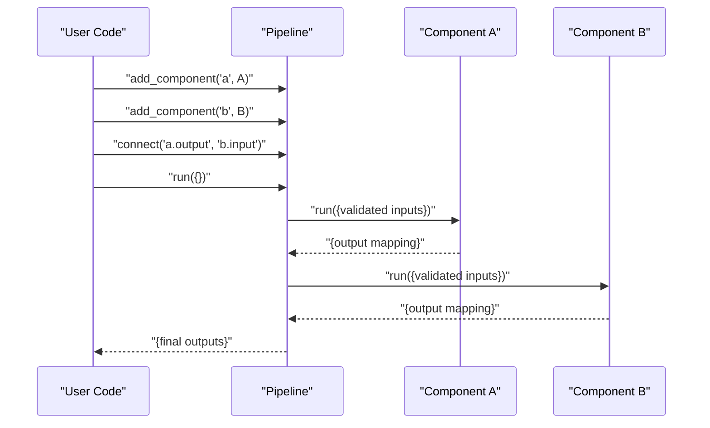
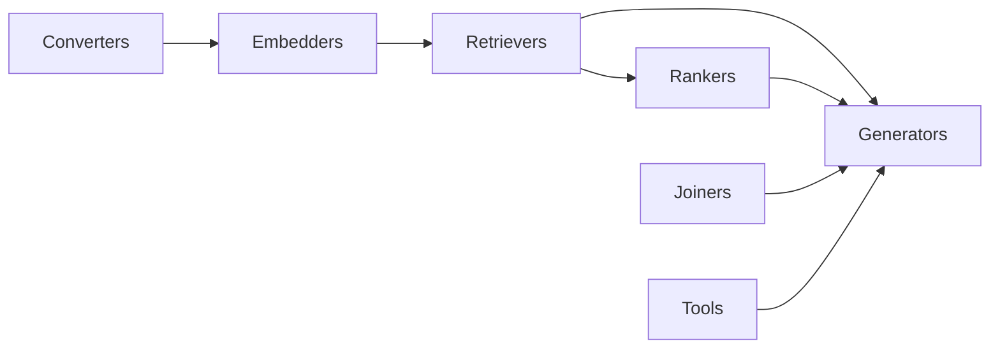

# Core Component Categories

<cite>
**Referenced Files in This Document**
- [haystack/core/component/component.py](file://haystack/core/component/component.py)
- [haystack/core/component/types.py](file://haystack/core/component/types.py)
- [haystack/dataclasses/document.py](file://haystack/dataclasses/document.py)
- [haystack/dataclasses/answer.py](file://haystack/dataclasses/answer.py)
- [haystack/components/generators/__init__.py](file://haystack/components/generators/__init__.py)
- [haystack/components/retrievers/__init__.py](file://haystack/components/retrievers/__init__.py)
- [haystack/components/embedders/__init__.py](file://haystack/components/embedders/__init__.py)
- [haystack/components/converters/__init__.py](file://haystack/components/converters/__init__.py)
- [haystack/components/rankers/__init__.py](file://haystack/components/rankers/__init__.py)
- [haystack/components/joiners/__init__.py](file://haystack/components/joiners/__init__.py)
- [haystack/components/tools/__init__.py](file://haystack/components/tools/__init__.py)
- [haystack/core/pipeline/pipeline.py](file://haystack/core/pipeline/pipeline.py)
- [haystack/core/pipeline/async_pipeline.py](file://haystack/core/pipeline/async_pipeline.py)
</cite>

## Table of Contents
1. [Introduction](#introduction)
2. [Project Structure](#project-structure)
3. [Core Components](#core-components)
4. [Architecture Overview](#architecture-overview)
5. [Detailed Component Analysis](#detailed-component-analysis)
6. [Dependency Analysis](#dependency-analysis)
7. [Performance Considerations](#performance-considerations)
8. [Troubleshooting Guide](#troubleshooting-guide)
9. [Conclusion](#conclusion)
10. [Appendices](#appendices)

## Introduction
This document explains Haystack’s core component categories and how they fit together in pipelines. It focuses on:
- Generators (text/chat completion)
- Retrievers (semantic/keyword search)
- Embedders (text/image embeddings)
- Converters (file format processing)
- Rankers (document scoring)
- Joiners (result combination)
- Tools (external service integration)

It covers purpose, functionality, common interfaces, parameters, return patterns, typical pipeline configurations, selection criteria, integration patterns, performance considerations, and optimization strategies.

## Project Structure
Haystack organizes components by functional family under haystack/components/<family>. Each family exposes a lazy importer for optional integrations and internal submodules. Core component contracts and data models live under haystack/core and haystack/dataclasses.

**Diagram sources**
- [haystack/core/component/component.py](file://haystack/core/component/component.py#L1-L645)
- [haystack/core/component/types.py](file://haystack/core/component/types.py#L1-L128)
- [haystack/core/pipeline/pipeline.py](file://haystack/core/pipeline/pipeline.py)
- [haystack/core/pipeline/async_pipeline.py](file://haystack/core/pipeline/async_pipeline.py)
- [haystack/dataclasses/document.py](file://haystack/dataclasses/document.py#L1-L190)
- [haystack/dataclasses/answer.py](file://haystack/dataclasses/answer.py#L1-L139)
- [haystack/components/generators/__init__.py](file://haystack/components/generators/__init__.py#L1-L27)
- [haystack/components/retrievers/__init__.py](file://haystack/components/retrievers/__init__.py#L1-L30)
- [haystack/components/embedders/__init__.py](file://haystack/components/embedders/__init__.py#L1-L45)
- [haystack/components/converters/__init__.py](file://haystack/components/converters/__init__.py#L1-L51)
- [haystack/components/rankers/__init__.py](file://haystack/components/rankers/__init__.py)
- [haystack/components/joiners/__init__.py](file://haystack/components/joiners/__init__.py)
- [haystack/components/tools/__init__.py](file://haystack/components/tools/__init__.py)

**Section sources**
- [haystack/core/component/component.py](file://haystack/core/component/component.py#L1-L645)
- [haystack/core/component/types.py](file://haystack/core/component/types.py#L1-L128)
- [haystack/dataclasses/document.py](file://haystack/dataclasses/document.py#L1-L190)
- [haystack/dataclasses/answer.py](file://haystack/dataclasses/answer.py#L1-L139)
- [haystack/components/generators/__init__.py](file://haystack/components/generators/__init__.py#L1-L27)
- [haystack/components/retrievers/__init__.py](file://haystack/components/retrievers/__init__.py#L1-L30)
- [haystack/components/embedders/__init__.py](file://haystack/components/embedders/__init__.py#L1-L45)
- [haystack/components/converters/__init__.py](file://haystack/components/converters/__init__.py#L1-L51)

## Core Components
All Haystack components implement a shared contract:
- Decoration: Declared with a decorator that registers them and validates structure.
- Inputs/Outputs: Defined via typed sockets; inputs come from upstream components; outputs are consumed by downstream components.
- Execution: The run method performs the core logic and returns a mapping of output names to values.
- Optional warm_up: Heavy initialization can be deferred until pipeline warm-up.
- Optional async: Components may expose run_async with matching signature.

Common patterns:
- Parameters: Passed via __init__ and stored in init_parameters for persistence.
- Return pattern: A single mapping from output names to values; output types are declared or inferred from annotations.
- Variadic inputs: LazyVariadic and GreedyVariadic enable flexible multi-input wiring.

**Section sources**
- [haystack/core/component/component.py](file://haystack/core/component/component.py#L58-L74)
- [haystack/core/component/types.py](file://haystack/core/component/types.py#L36-L128)

## Architecture Overview
The pipeline orchestrates component execution. Components declare typed inputs/outputs; the pipeline resolves connections and invokes run (and optionally run_async) with validated inputs.

**Diagram sources**
- [haystack/core/pipeline/pipeline.py](file://haystack/core/pipeline/pipeline.py)
- [haystack/core/component/component.py](file://haystack/core/component/component.py#L58-L74)
- [haystack/core/component/types.py](file://haystack/core/component/types.py#L36-L128)

## Detailed Component Analysis

### Generators (text/chat completion)
Purpose:
- Generate text or structured outputs from prompts and context.

Typical use cases:
- Open-ended Q&A, summarization, classification, translation, and creative writing.
- Image generation via specialized variants.

Interfaces and parameters:
- Inputs: Typically include prompt and optional context/document lists.
- Outputs: Usually include generated text and metadata (e.g., model info, usage stats).
- Parameters: Model name, temperature, max tokens, repetition penalty, and provider-specific settings.

Return value pattern:
- Standardized answer containers (e.g., generated answers) carrying the produced text, query, and related documents.

Integration patterns:
- Connect retrievers’ documents to generator inputs.
- Use joiners to merge multiple generations when needed.

Selection criteria:
- Cost/performance trade-offs (local vs. cloud), quality benchmarks, latency, and provider lock-in.
- Support for structured outputs and safety controls.

Practical pipeline example:
- Retrieve top-k documents → pass documents and query to generator → collect GeneratedAnswer.

Performance considerations:
- Batch prompts when supported; reuse warmed models; tune max tokens and temperature.
- Prefer local models for low-latency scenarios; use managed APIs for higher quality.

Optimization strategies:
- Prompt caching, output filtering, and early stopping.
- Asynchronous execution for concurrent generations.

**Section sources**
- [haystack/components/generators/__init__.py](file://haystack/components/generators/__init__.py#L1-L27)
- [haystack/dataclasses/answer.py](file://haystack/dataclasses/answer.py#L90-L139)

### Retrievers (semantic/keyword search)
Purpose:
- Locate relevant documents for a given query using semantic similarity or lexical matching.

Typical use cases:
- Dense retrieval with embeddings, sparse BM25, hybrid approaches, and multi-query strategies.
- Window-based retrieval around answer spans.

Interfaces and parameters:
- Inputs: Query text and optional filters/metadata.
- Outputs: Ranked list of Documents with scores.
- Parameters: Top-K, filters, scale scores, window sizes, and model-specific settings.

Return value pattern:
- List of Documents ordered by relevance; each Document carries content, metadata, and a score.

Integration patterns:
- Feed queries to retrievers; connect outputs to embedders or generators.
- Combine multiple retrievers via joiners.

Selection criteria:
- Accuracy vs. speed; support for filters and sparse/dense hybrid modes.

Practical pipeline example:
- Query → Retriever → Documents.

Performance considerations:
- Index size and dimensionality; use approximate nearest neighbor libraries; pre-filter via metadata.

Optimization strategies:
- Pre-compute and cache embeddings; apply filters early; tune top-K and similarity thresholds.

**Section sources**
- [haystack/components/retrievers/__init__.py](file://haystack/components/retrievers/__init__.py#L1-L30)
- [haystack/dataclasses/document.py](file://haystack/dataclasses/document.py#L48-L190)

### Embedders (text/image embeddings)
Purpose:
- Produce dense or sparse vector representations for text and images.

Typical use cases:
- Semantic search, clustering, and similarity computation.
- Dense and sparse retrieval pipelines.

Interfaces and parameters:
- Inputs: Texts or images; optional batch handling.
- Outputs: Dense vectors or sparse vectors per input.
- Parameters: Model choice, normalization, pooling strategies, and device placement.

Return value pattern:
- Embedding fields attached to Documents or standalone vectors.

Integration patterns:
- Connect converters to text/image inputs; feed vectors to retrievers or rankers.

Selection criteria:
- Quality, speed, and memory footprint; choose dense vs. sparse depending on index capabilities.

Practical pipeline example:
- Text/Image → Embedder → Documents with embeddings.

Performance considerations:
- Batch size, quantization, and GPU utilization.

Optimization strategies:
- Quantize vectors; cache frequent embeddings; offload to accelerators.

**Section sources**
- [haystack/components/embedders/__init__.py](file://haystack/components/embedders/__init__.py#L1-L45)
- [haystack/dataclasses/document.py](file://haystack/dataclasses/document.py#L64-L70)

### Converters (file format processing)
Purpose:
- Transform raw files into Documents for downstream processing.

Typical use cases:
- PDFs, DOCX, XLSX, HTML, JSON, CSV, and more.

Interfaces and parameters:
- Inputs: Files, streams, or URLs; format-specific options.
- Outputs: Document objects with content and metadata.

Return value pattern:
- Single Document or list of Documents.

Integration patterns:
- Place before embedders or retrievers; handle multi-file conversion when needed.

Selection criteria:
- Supported formats, accuracy, and performance.

Practical pipeline example:
- File → Converter → Document(s).

Performance considerations:
- Streaming large files; parallel conversion; memory limits.

Optimization strategies:
- Chunk large files; use fast parsers; cache OCR when applicable.

**Section sources**
- [haystack/components/converters/__init__.py](file://haystack/components/converters/__init__.py#L1-L51)

### Rankers (document scoring)
Purpose:
- Refine and re-score retrieved documents using cross-encoders or reranking models.

Typical use cases:
- Improve precision by re-ranking top-K candidates against the query.

Interfaces and parameters:
- Inputs: Query and candidate Documents.
- Outputs: Re-ranked Documents with updated scores.

Return value pattern:
- Ordered list of Documents with recalibrated scores.

Integration patterns:
- Connect retriever outputs to ranker inputs; replace top-K with reranked list.

Selection criteria:
- Quality gain vs. latency; batch reranking capability.

Practical pipeline example:
- Retrieved Documents → Ranker → Re-ranked Documents.

Performance considerations:
- Batch size and model throughput; consider caching repeated queries.

Optimization strategies:
- Warm-up models; batch rerank; early exit heuristics.

**Section sources**
- [haystack/components/rankers/__init__.py](file://haystack/components/rankers/__init__.py)

### Joiners (result combination)
Purpose:
- Merge outputs from multiple components into unified structures.

Typical use cases:
- Combine documents from multiple retrievers, concatenate text, or merge metadata.

Interfaces and parameters:
- Inputs: Multiple heterogeneous inputs (e.g., lists of Documents, texts).
- Outputs: Unified structures (e.g., combined Documents, concatenated text).

Return value pattern:
- Single consolidated output suitable for downstream components.

Integration patterns:
- Join multiple retriever results or generator outputs.

Selection criteria:
- Preservation of metadata and ordering; deduplication strategies.

Practical pipeline example:
- Retriever A → Joiner → Combined Documents; Retriever B → Joiner → Final Documents.

Performance considerations:
- Deduplication cost; ordering preservation.

Optimization strategies:
- Efficient merging algorithms; streaming joins for large sets.

**Section sources**
- [haystack/components/joiners/__init__.py](file://haystack/components/joiners/__init__.py)

### Tools (external service integration)
Purpose:
- Wrap external APIs or functions as components for use in pipelines.

Typical use cases:
- Tool invocation for actions (e.g., database queries, web searches) within reasoning loops.

Interfaces and parameters:
- Inputs: Tool-specific parameters; outputs: Tool-defined results.
- Parameters: Authentication, timeouts, retry policies.

Return value pattern:
- Structured tool response suitable for downstream components.

Integration patterns:
- Use tools inside agents or pipelines requiring external actions.

Selection criteria:
- Reliability, rate limits, and error handling.

Practical pipeline example:
- Agent decides to call a tool → Tool component executes → Result fed to next stage.

Performance considerations:
- Network latency; retries; circuit breakers.

Optimization strategies:
- Connection pooling; caching; async invocation.

**Section sources**
- [haystack/components/tools/__init__.py](file://haystack/components/tools/__init__.py)

## Dependency Analysis
Component families are decoupled and wired via typed sockets. The core component system enforces input/output contracts, enabling flexible composition.

**Diagram sources**
- [haystack/core/component/component.py](file://haystack/core/component/component.py#L58-L74)
- [haystack/core/component/types.py](file://haystack/core/component/types.py#L36-L128)
- [haystack/components/generators/__init__.py](file://haystack/components/generators/__init__.py#L1-L27)
- [haystack/components/retrievers/__init__.py](file://haystack/components/retrievers/__init__.py#L1-L30)
- [haystack/components/embedders/__init__.py](file://haystack/components/embedders/__init__.py#L1-L45)
- [haystack/components/converters/__init__.py](file://haystack/components/converters/__init__.py#L1-L51)
- [haystack/components/rankers/__init__.py](file://haystack/components/rankers/__init__.py)
- [haystack/components/joiners/__init__.py](file://haystack/components/joiners/__init__.py)
- [haystack/components/tools/__init__.py](file://haystack/components/tools/__init__.py)

## Performance Considerations
- Warm-up: Use warm_up for heavy models and backends.
- Batch processing: Prefer batching for embedders, rankers, and generators.
- Indexing and caching: Cache embeddings and frequent queries; use efficient indices.
- Asynchrony: Use async pipelines and components where supported.
- I/O and parsing: Stream large files; avoid loading entire datasets into memory.
- Selection: Choose components aligned with workload characteristics (accuracy vs. speed).

[No sources needed since this section provides general guidance]

## Troubleshooting Guide
- Component contract violations: Ensure run method presence and correct output mapping.
- Input/Output mismatches: Verify socket types and defaults; use variadic sockets for flexible multi-input wiring.
- Serialization issues: Keep init parameters JSON-serializable; rely on provided serialization helpers.
- Async signature mismatches: Ensure run and run_async signatures match exactly.

**Section sources**
- [haystack/core/component/component.py](file://haystack/core/component/component.py#L58-L74)
- [haystack/core/component/types.py](file://haystack/core/component/types.py#L36-L128)

## Conclusion
Haystack’s component model provides a uniform, composable framework across modalities and tasks. By adhering to the component contract, leveraging typed sockets, and selecting appropriate components for each stage, you can build robust, scalable pipelines for retrieval-augmented generation, document processing, and external service orchestration.

[No sources needed since this section summarizes without analyzing specific files]

## Appendices

### Common Interfaces and Patterns
- Component decorator and registration
- InputSocket and OutputSocket with variadic support
- Data classes for Documents and Answers
- Pipeline orchestration and async execution

**Section sources**
- [haystack/core/component/component.py](file://haystack/core/component/component.py#L58-L74)
- [haystack/core/component/types.py](file://haystack/core/component/types.py#L36-L128)
- [haystack/dataclasses/document.py](file://haystack/dataclasses/document.py#L48-L190)
- [haystack/dataclasses/answer.py](file://haystack/dataclasses/answer.py#L90-L139)
- [haystack/core/pipeline/pipeline.py](file://haystack/core/pipeline/pipeline.py)
- [haystack/core/pipeline/async_pipeline.py](file://haystack/core/pipeline/async_pipeline.py)