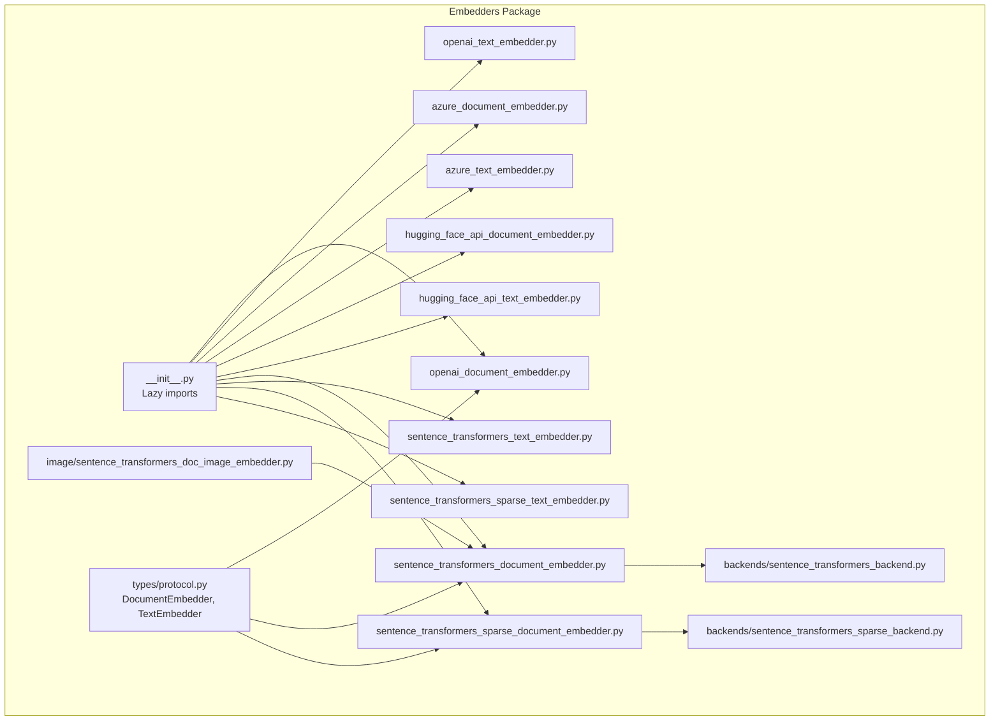
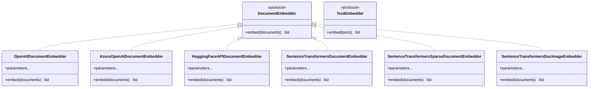
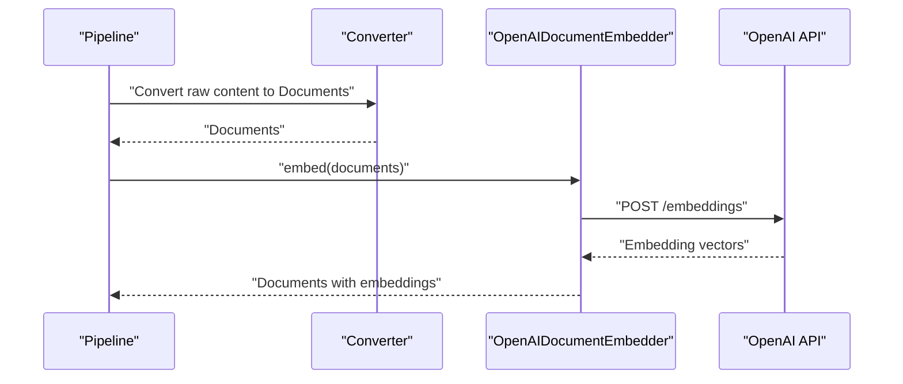
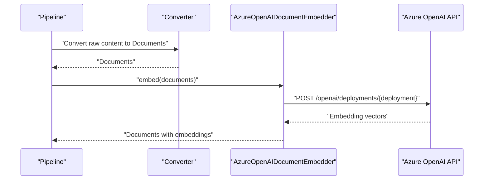
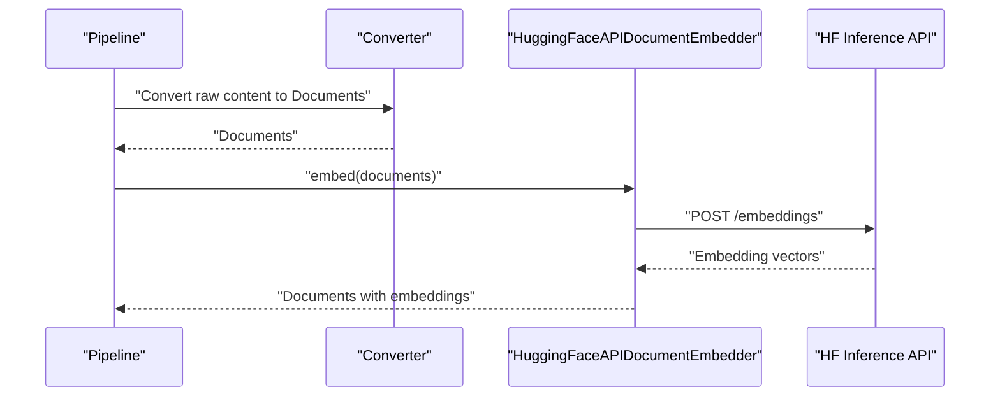
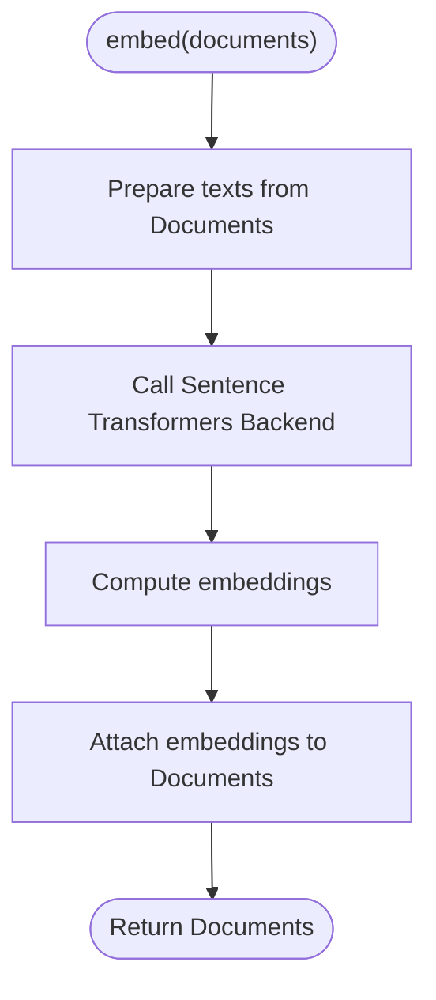
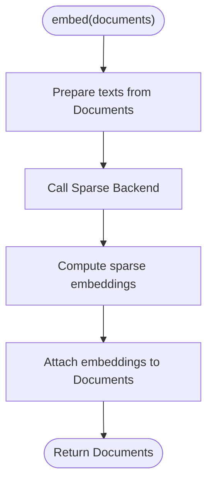
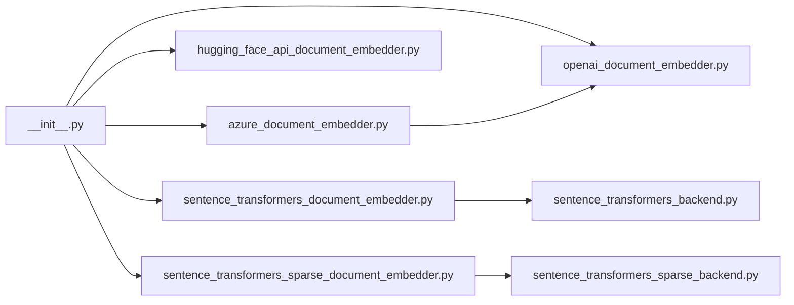

# Document Embedders

<cite>
**Referenced Files in This Document**
- [__init__.py](file://haystack/components/embedders/__init__.py)
- [protocol.py](file://haystack/components/embedders/types/protocol.py)
- [openai_document_embedder.py](file://haystack/components/embedders/openai_document_embedder.py)
- [openai_text_embedder.py](file://haystack/components/embedders/openai_text_embedder.py)
- [azure_document_embedder.py](file://haystack/components/embedders/azure_document_embedder.py)
- [azure_text_embedder.py](file://haystack/components/embedders/azure_text_embedder.py)
- [hugging_face_api_document_embedder.py](file://haystack/components/embedders/hugging_face_api_document_embedder.py)
- [hugging_face_api_text_embedder.py](file://haystack/components/embedders/hugging_face_api_text_embedder.py)
- [sentence_transformers_document_embedder.py](file://haystack/components/embedders/sentence_transformers_document_embedder.py)
- [sentence_transformers_text_embedder.py](file://haystack/components/embedders/sentence_transformers_text_embedder.py)
- [sentence_transformers_sparse_document_embedder.py](file://haystack/components/embedders/sentence_transformers_sparse_document_embedder.py)
- [sentence_transformers_sparse_text_embedder.py](file://haystack/components/embedders/sentence_transformers_sparse_text_embedder.py)
- [sentence_transformers_backend.py](file://haystack/components/embedders/backends/sentence_transformers_backend.py)
- [sentence_transformers_sparse_backend.py](file://haystack/components/embedders/backends/sentence_transformers_sparse_backend.py)
- [sentence_transformers_doc_image_embedder.py](file://haystack/components/embedders/image/sentence_transformers_doc_image_embedder.py)
- [test_openai_document_embedder.py](file://test/components/embedders/test_openai_document_embedder.py)
- [test_azure_document_embedder.py](file://test/components/embedders/test_azure_document_embedder.py)
- [test_hugging_face_api_document_embedder.py](file://test/components/embedders/test_hugging_face_api_document_embedder.py)
- [test_sentence_transformers_document_embedder.py](file://test/components/embedders/test_sentence_transformers_document_embedder.py)
- [test_sentence_transformers_sparse_document_embedder.py](file://test/components/embedders/test_sentence_transformers_sparse_document_embedder.py)
- [test_sentence_transformers_doc_image_embedder.py](file://test/components/embedders/image/test_sentence_transformers_doc_image_embedder.py)
- [amazonbedrocktextembedder.mdx](file://docs-website/docs/pipeline-components/embedders/amazonbedrocktextembedder.mdx)
- [amazonbedrockdocumentembedder.mdx](file://docs-website/docs/pipeline-components/embedders/amazonbedrockdocumentembedder.mdx)
- [coheretextembedder.mdx](file://docs-website/docs/pipeline-components/embedders/coheretextembedder.mdx)
- [coheredocumentembedder.mdx](file://docs-website/docs/pipeline-components/embedders/coheredocumentembedder.mdx)
- [coheredocumentimageembedder.mdx](file://docs-website/docs/pipeline-components/embedders/coheredocumentimageembedder.mdx)
- [choosing-the-right-embedder.mdx](file://docs-website/docs/pipeline-components/embedders/choosing-the-right-embedder.mdx)
- [external-integrations-embedders.mdx](file://docs-website/docs/pipeline-components/embedders/external-integrations-embedders.mdx)
- [fastembedtextembedder.mdx](file://docs-website/docs/pipeline-components/embedders/fastembedtextembedder.mdx)
- [fastembeddocumentembedder.mdx](file://docs-website/docs/pipeline-components/embedders/fastembeddocumentembedder.mdx)
- [fastembedsparsedocumentembedder.mdx](file://docs-website/docs/pipeline-components/embedders/fastembedsparsedocumentembedder.mdx)
- [fastembedsparsetextembedder.mdx](file://docs-website/docs/pipeline-components/embedders/fastembedsparsetextembedder.mdx)
- [googlegenaitextembedder.mdx](file://docs-website/docs/pipeline-components/embedders/googlegenaitextembedder.mdx)
- [googlegenaidocumentembedder.mdx](file://docs-website/docs/pipeline-components/embedders/googlegenaidocumentembedder.mdx)
- [huggingfaceapidocumentembedder.mdx](file://docs-website/docs/pipeline-components/embedders/huggingfaceapidocumentembedder.mdx)
- [huggingfaceapitextembedder.mdx](file://docs-website/docs/pipeline-components/embedders/huggingfaceapitextembedder.mdx)
- [jinatextembedder.mdx](file://docs-website/docs/pipeline-components/embedders/jinatextembedder.mdx)
- [mistraldocumentembedder.mdx](file://docs-website/docs/pipeline-components/embedders/mistraldocumentembedder.mdx)
- [mistraltextembedder.mdx](file://docs-website/docs/pipeline-components/embedders/mistraltextembedder.mdx)
- [nvidiadocumentembedder.mdx](file://docs-website/docs/pipeline-components/embedders/nvidiadocumentembedder.mdx)
- [nvidiatextembedder.mdx](file://docs-website/docs/pipeline-components/embedders/nvidiatextembedder.mdx)
- [ollamadocumentembedder.mdx](file://docs-website/docs/pipeline-components/embedders/ollamadocumentembedder.mdx)
- [ollamatextembedder.mdx](file://docs-website/docs/pipeline-components/embedders/ollamatextembedder.mdx)
- [optimumdocumentembedder.mdx](file://docs-website/docs/pipeline-components/embedders/optimumdocumentembedder.mdx)
- [optimumtextembedder.mdx](file://docs-website/docs/pipeline-components/embedders/optimumtextembedder.mdx)
- [sentencetransformersdocumentembedder.mdx](file://docs-website/docs/pipeline-components/embedders/sentencetransformersdocumentembedder.mdx)
- [sentencetransformerstextembedder.mdx](file://docs-website/docs/pipeline-components/embedders/sentencetransformerstextembedder.mdx)
- [sentencetransformersdocumentimageembedder.mdx](file://docs-website/docs/pipeline-components/embedders/sentencetransformersdocumentimageembedder.mdx)
- [stackitdocumentembedder.mdx](file://docs-website/docs/pipeline-components/embedders/stackitdocumentembedder.mdx)
- [stackittextembedder.mdx](file://docs-website/docs/pipeline-components/embedders/stackittextembedder.mdx)
- [vertexaidocumentembedder.mdx](file://docs-website/docs/pipeline-components/embedders/vertexaidocumentembedder.mdx)
- [vertexaitextembedder.mdx](file://docs-website/docs/pipeline-components/embedders/vertexaitextembedder.mdx)
- [watsonxdocumentembedder.mdx](file://docs-website/docs/pipeline-components/embedders/watsonxdocumentembedder.mdx)
- [watsonxtextembedder.mdx](file://docs-website/docs/pipeline-components/embedders/watsonxtextembedder.mdx)
</cite>

## Table of Contents
1. [Introduction](#introduction)
2. [Project Structure](#project-structure)
3. [Core Components](#core-components)
4. [Architecture Overview](#architecture-overview)
5. [Detailed Component Analysis](#detailed-component-analysis)
6. [Dependency Analysis](#dependency-analysis)
7. [Performance Considerations](#performance-considerations)
8. [Troubleshooting Guide](#troubleshooting-guide)
9. [Conclusion](#conclusion)
10. [Appendices](#appendices)

## Introduction
This document explains the document embedder ecosystem in Haystack, focusing on the common interface, invocation relationships, and provider-specific behaviors. It covers both built-in local and cloud-native embedders, outlines input/output semantics, and provides practical guidance for configuring pipelines that process PDFs, images, HTML, and mixed-media documents. Provider-specific topics include authentication, rate limits, costs, and multimodal capabilities where applicable.

## Project Structure
Haystack organizes embedders under a single package with lazy imports and a shared protocol. The core structure exposes:
- A common protocol for document and text embedders
- Concrete implementations for OpenAI, Azure OpenAI, Hugging Face API, and Sentence Transformers (dense and sparse)
- Optional image embedders for document-image scenarios
- Extensive documentation for additional providers (Cohere, Jina, Mistral, NVIDIA, Ollama, FastEmbed, Optimum, Amazon Bedrock, Google GenAI, Vertex AI, Watsonx, StackIT) available in the documentation website

**Diagram sources**
- [__init__.py](file://haystack/components/embedders/__init__.py#L10-L21)
- [protocol.py](file://haystack/components/embedders/types/protocol.py#L9-L31)
- [openai_document_embedder.py](file://haystack/components/embedders/openai_document_embedder.py#L21-L21)
- [azure_document_embedder.py](file://haystack/components/embedders/azure_document_embedder.py#L18-L18)
- [hugging_face_api_document_embedder.py](file://haystack/components/embedders/hugging_face_api_document_embedder.py#L24-L24)
- [sentence_transformers_document_embedder.py](file://haystack/components/embedders/sentence_transformers_document_embedder.py#L17-L17)
- [sentence_transformers_sparse_document_embedder.py](file://haystack/components/embedders/sentence_transformers_sparse_document_embedder.py#L17-L17)
- [sentence_transformers_doc_image_embedder.py](file://haystack/components/embedders/image/sentence_transformers_doc_image_embedder.py#L1-L200)
- [sentence_transformers_backend.py](file://haystack/components/embedders/backends/sentence_transformers_backend.py#L1-L200)
- [sentence_transformers_sparse_backend.py](file://haystack/components/embedders/backends/sentence_transformers_sparse_backend.py#L1-L200)

**Section sources**
- [__init__.py](file://haystack/components/embedders/__init__.py#L10-L45)
- [protocol.py](file://haystack/components/embedders/types/protocol.py#L9-L31)

## Core Components
- DocumentEmbedder and TextEmbedder protocols define the common interface contract for all embedders.
- OpenAI and Azure OpenAI embedders share a similar design, with Azure variants inheriting from OpenAI counterparts.
- Sentence Transformers embedders support dense and sparse embeddings, with dedicated backends for efficient inference.
- Hugging Face API embedders enable cloud-hosted models via API calls.
- Image embedders augment document pipelines with image-based embeddings.

Key interface elements:
- Input: documents (or text) with optional metadata
- Output: embeddings per document/text with optional metadata propagation
- Options: embedding dimensions, normalization, pooling strategy (where applicable)
- Invocation: call the embedder component in a pipeline stage after converting/preprocessing content

Provider coverage in this repository:
- OpenAI (document and text)
- Azure OpenAI (document and text)
- Hugging Face API (document and text)
- Sentence Transformers (document, text, sparse document, sparse text)
- Sentence Transformers image embedder for document-image scenarios

Providers documented in the website (external integrations):
- Cohere, Jina, Mistral, NVIDIA, Ollama, FastEmbed, Optimum, Amazon Bedrock, Google GenAI, Vertex AI, Watsonx, StackIT

**Section sources**
- [protocol.py](file://haystack/components/embedders/types/protocol.py#L9-L31)
- [openai_document_embedder.py](file://haystack/components/embedders/openai_document_embedder.py#L21-L21)
- [azure_document_embedder.py](file://haystack/components/embedders/azure_document_embedder.py#L18-L18)
- [hugging_face_api_document_embedder.py](file://haystack/components/embedders/hugging_face_api_document_embedder.py#L24-L24)
- [sentence_transformers_document_embedder.py](file://haystack/components/embedders/sentence_transformers_document_embedder.py#L17-L17)
- [sentence_transformers_sparse_document_embedder.py](file://haystack/components/embedders/sentence_transformers_sparse_document_embedder.py#L17-L17)
- [sentence_transformers_doc_image_embedder.py](file://haystack/components/embedders/image/sentence_transformers_doc_image_embedder.py#L1-L200)

## Architecture Overview
The embedder architecture follows a layered pattern:
- Protocol layer defines the interface contract
- Implementation layer provides provider-specific logic
- Backend layer optimizes local inference (Sentence Transformers)
- Optional image embedder augments document pipelines

**Diagram sources**
- [protocol.py](file://haystack/components/embedders/types/protocol.py#L9-L31)
- [openai_document_embedder.py](file://haystack/components/embedders/openai_document_embedder.py#L21-L21)
- [azure_document_embedder.py](file://haystack/components/embedders/azure_document_embedder.py#L18-L18)
- [hugging_face_api_document_embedder.py](file://haystack/components/embedders/hugging_face_api_document_embedder.py#L24-L24)
- [sentence_transformers_document_embedder.py](file://haystack/components/embedders/sentence_transformers_document_embedder.py#L17-L17)
- [sentence_transformers_sparse_document_embedder.py](file://haystack/components/embedders/sentence_transformers_sparse_document_embedder.py#L17-L17)
- [sentence_transformers_doc_image_embedder.py](file://haystack/components/embedders/image/sentence_transformers_doc_image_embedder.py#L1-L200)

## Detailed Component Analysis

### OpenAI Document Embedder
- Purpose: Compute embeddings for a batch of documents using OpenAI’s model.
- Inputs: documents (supports text content), optional metadata propagation.
- Outputs: embeddings per document, optionally with metadata attached.
- Key parameters: model name, dimensions, normalize embeddings, batch size, timeout, max retries.
- Invocation: call embed method after preparing documents (e.g., after a converter).
- Typical pipeline stages: Converter → OpenAIDocumentEmbedder → Document Store.

**Diagram sources**
- [openai_document_embedder.py](file://haystack/components/embedders/openai_document_embedder.py#L21-L21)
- [test_openai_document_embedder.py](file://test/components/embedders/test_openai_document_embedder.py#L15-L120)

**Section sources**
- [openai_document_embedder.py](file://haystack/components/embedders/openai_document_embedder.py#L21-L21)
- [test_openai_document_embedder.py](file://test/components/embedders/test_openai_document_embedder.py#L15-L120)

### Azure OpenAI Document Embedder
- Purpose: Same as OpenAI variant but targets Azure OpenAI endpoints.
- Inherits behavior from OpenAI embedder; differences lie in endpoint configuration and authentication.
- Inputs/outputs identical to OpenAI variant.
- Invocation: same pipeline pattern.

**Diagram sources**
- [azure_document_embedder.py](file://haystack/components/embedders/azure_document_embedder.py#L18-L18)
- [test_azure_document_embedder.py](file://test/components/embedders/test_azure_document_embedder.py#L16-L120)

**Section sources**
- [azure_document_embedder.py](file://haystack/components/embedders/azure_document_embedder.py#L18-L18)
- [test_azure_document_embedder.py](file://test/components/embedders/test_azure_document_embedder.py#L16-L120)

### Hugging Face API Document Embedder
- Purpose: Leverages Hugging Face’s hosted inference API for embeddings.
- Inputs: documents (text), optional metadata.
- Outputs: embeddings per document.
- Key parameters: model identifier, API URL, API token, wait time, max retries.
- Invocation: embed after conversion.

**Diagram sources**
- [hugging_face_api_document_embedder.py](file://haystack/components/embedders/hugging_face_api_document_embedder.py#L24-L24)
- [test_hugging_face_api_document_embedder.py](file://test/components/embedders/test_hugging_face_api_document_embedder.py#L32-L120)

**Section sources**
- [hugging_face_api_document_embedder.py](file://haystack/components/embedders/hugging_face_api_document_embedder.py#L24-L24)
- [test_hugging_face_api_document_embedder.py](file://test/components/embedders/test_hugging_face_api_document_embedder.py#L32-L120)

### Sentence Transformers Document Embedder
- Purpose: Local, efficient dense embeddings using sentence-transformers models.
- Inputs: documents (text), optional metadata.
- Outputs: embeddings per document.
- Backend: optimized backend for inference.
- Options: pooling strategy, normalize vectors, device selection, batch size tuning.

**Diagram sources**
- [sentence_transformers_document_embedder.py](file://haystack/components/embedders/sentence_transformers_document_embedder.py#L17-L17)
- [sentence_transformers_backend.py](file://haystack/components/embedders/backends/sentence_transformers_backend.py#L1-L200)

**Section sources**
- [sentence_transformers_document_embedder.py](file://haystack/components/embedders/sentence_transformers_document_embedder.py#L17-L17)
- [sentence_transformers_backend.py](file://haystack/components/embedders/backends/sentence_transformers_backend.py#L1-L200)

### Sentence Transformers Sparse Document Embedder
- Purpose: Sparse embeddings for retrieval efficiency and explainability.
- Inputs/outputs same as dense variant.
- Backend: sparse backend implementation.

**Diagram sources**
- [sentence_transformers_sparse_document_embedder.py](file://haystack/components/embedders/sentence_transformers_sparse_document_embedder.py#L17-L17)
- [sentence_transformers_sparse_backend.py](file://haystack/components/embedders/backends/sentence_transformers_sparse_backend.py#L1-L200)

**Section sources**
- [sentence_transformers_sparse_document_embedder.py](file://haystack/components/embedders/sentence_transformers_sparse_document_embedder.py#L17-L17)
- [sentence_transformers_sparse_backend.py](file://haystack/components/embedders/backends/sentence_transformers_sparse_backend.py#L1-L200)

### Sentence Transformers Text Embedder
- Purpose: Compute embeddings for plain text inputs.
- Inputs: list of texts, optional metadata.
- Outputs: embeddings per text.

**Section sources**
- [sentence_transformers_text_embedder.py](file://haystack/components/embedders/sentence_transformers_text_embedder.py#L16-L16)

### Sentence Transformers Sparse Text Embedder
- Purpose: Sparse embeddings for text inputs.

**Section sources**
- [sentence_transformers_sparse_text_embedder.py](file://haystack/components/embedders/sentence_transformers_sparse_text_embedder.py#L17-L17)

### Sentence Transformers Document-Image Embedder
- Purpose: Compute embeddings for document images (e.g., scanned PDF pages).
- Inputs: documents containing image content.
- Outputs: embeddings per document-image.

**Section sources**
- [sentence_transformers_doc_image_embedder.py](file://haystack/components/embedders/image/sentence_transformers_doc_image_embedder.py#L1-L200)
- [test_sentence_transformers_doc_image_embedder.py](file://test/components/embedders/image/test_sentence_transformers_doc_image_embedder.py#L1-L200)

## Dependency Analysis
- Lazy imports in the package initializer ensure only requested embedders are loaded.
- Sentence Transformers embedders depend on dedicated backends for inference.
- Azure embedders inherit from OpenAI embedders, reducing duplication while adapting endpoints and auth.

**Diagram sources**
- [__init__.py](file://haystack/components/embedders/__init__.py#L10-L45)
- [azure_document_embedder.py](file://haystack/components/embedders/azure_document_embedder.py#L18-L18)
- [openai_document_embedder.py](file://haystack/components/embedders/openai_document_embedder.py#L21-L21)
- [sentence_transformers_document_embedder.py](file://haystack/components/embedders/sentence_transformers_document_embedder.py#L17-L17)
- [sentence_transformers_sparse_document_embedder.py](file://haystack/components/embedders/sentence_transformers_sparse_document_embedder.py#L17-L17)
- [sentence_transformers_backend.py](file://haystack/components/embedders/backends/sentence_transformers_backend.py#L1-L200)
- [sentence_transformers_sparse_backend.py](file://haystack/components/embedders/backends/sentence_transformers_sparse_backend.py#L1-L200)

**Section sources**
- [__init__.py](file://haystack/components/embedders/__init__.py#L10-L45)

## Performance Considerations
- Batch size: Larger batches reduce overhead but increase memory usage. Tune per GPU/CPU capacity.
- Device selection: Prefer GPU for Sentence Transformers when available.
- Normalization: Enable cosine normalization for similarity search to reduce downstream compute.
- Sparse embeddings: Reduce storage and improve recall in retrieval-heavy pipelines.
- Pipeline stages: Place embedders after converters to minimize redundant conversions.

[No sources needed since this section provides general guidance]

## Troubleshooting Guide
Common issues and remedies:
- Authentication failures: Verify API keys and permissions for cloud providers.
- Rate limits: Implement retry with backoff and consider provider quotas.
- Dimension mismatches: Ensure embedding dimensions match the downstream index.
- Memory spikes: Reduce batch size or offload to CPU/GPU as appropriate.
- Metadata loss: Confirm metadata propagation settings in the embedder configuration.

**Section sources**
- [test_openai_document_embedder.py](file://test/components/embedders/test_openai_document_embedder.py#L15-L120)
- [test_azure_document_embedder.py](file://test/components/embedders/test_azure_document_embedder.py#L16-L120)
- [test_hugging_face_api_document_embedder.py](file://test/components/embedders/test_hugging_face_api_document_embedder.py#L32-L120)
- [test_sentence_transformers_document_embedder.py](file://test/components/embedders/test_sentence_transformers_document_embedder.py#L15-L120)
- [test_sentence_transformers_sparse_document_embedder.py](file://test/components/embedders/test_sentence_transformers_sparse_document_embedder.py#L22-L120)

## Conclusion
Haystack’s embedder ecosystem offers a flexible, extensible foundation for document embeddings across local and cloud providers. The protocol-driven design ensures consistent behavior, while provider-specific adapters handle authentication, endpoints, and advanced features. For complex or specialized needs, the documentation website enumerates additional providers (Cohere, Jina, Mistral, NVIDIA, Ollama, FastEmbed, Optimum, Amazon Bedrock, Google GenAI, Vertex AI, Watsonx, StackIT) that integrate via external packages.

[No sources needed since this section summarizes without analyzing specific files]

## Appendices

### Practical Pipeline Scenarios
- PDFs: Convert PDF to text/images → embedder → store embeddings
- Images: Extract image content → embedder → store embeddings
- HTML: Convert HTML to text → embedder → store embeddings
- Mixed media: Combine text and image embeddings (e.g., document-image embedder) → store embeddings

[No sources needed since this section provides general guidance]

### Provider-Specific Notes (from documentation)
- Amazon Bedrock: Supports multiple models; authentication via AWS credentials; text and document variants available.
- Cohere: Text/document/image embedders; API-based; supports multilingual models.
- Jina: Cloud-hosted embeddings; text/document variants.
- Mistral: API-based; text/document variants.
- NVIDIA: API-based; text/document variants.
- Ollama: Local or remote server; text/document variants.
- FastEmbed: Lightweight, fast; text/document/sparse variants.
- Optimum: Optimized inference; text/document variants.
- Google GenAI: Text/document variants; API-based.
- Vertex AI: Google Cloud; text/document variants.
- Watsonx: IBM Cloud; text/document variants.
- StackIT: Managed service; text/document variants.

**Section sources**
- [amazonbedrocktextembedder.mdx](file://docs-website/docs/pipeline-components/embedders/amazonbedrocktextembedder.mdx#L19-L31)
- [amazonbedrockdocumentembedder.mdx](file://docs-website/docs/pipeline-components/embedders/amazonbedrockdocumentembedder.mdx#L1-L200)
- [coheretextembedder.mdx](file://docs-website/docs/pipeline-components/embedders/coheretextembedder.mdx#L1-L200)
- [coheredocumentembedder.mdx](file://docs-website/docs/pipeline-components/embedders/coheredocumentembedder.mdx#L1-L200)
- [coheredocumentimageembedder.mdx](file://docs-website/docs/pipeline-components/embedders/coheredocumentimageembedder.mdx#L1-L200)
- [external-integrations-embedders.mdx](file://docs-website/docs/pipeline-components/embedders/external-integrations-embedders.mdx#L1-L200)
- [fastembedtextembedder.mdx](file://docs-website/docs/pipeline-components/embedders/fastembedtextembedder.mdx#L1-L200)
- [fastembeddocumentembedder.mdx](file://docs-website/docs/pipeline-components/embedders/fastembeddocumentembedder.mdx#L1-L200)
- [fastembedsparsedocumentembedder.mdx](file://docs-website/docs/pipeline-components/embedders/fastembedsparsedocumentembedder.mdx#L1-L200)
- [fastembedsparsetextembedder.mdx](file://docs-website/docs/pipeline-components/embedders/fastembedsparsetextembedder.mdx#L1-L200)
- [googlegenaitextembedder.mdx](file://docs-website/docs/pipeline-components/embedders/googlegenaitextembedder.mdx#L1-L200)
- [googlegenaidocumentembedder.mdx](file://docs-website/docs/pipeline-components/embedders/googlegenaidocumentembedder.mdx#L1-L200)
- [huggingfaceapidocumentembedder.mdx](file://docs-website/docs/pipeline-components/embedders/huggingfaceapidocumentembedder.mdx#L1-L200)
- [huggingfaceapitextembedder.mdx](file://docs-website/docs/pipeline-components/embedders/huggingfaceapitextembedder.mdx#L1-L200)
- [jinatextembedder.mdx](file://docs-website/docs/pipeline-components/embedders/jinatextembedder.mdx#L1-L200)
- [mistraldocumentembedder.mdx](file://docs-website/docs/pipeline-components/embedders/mistraldocumentembedder.mdx#L1-L200)
- [mistraltextembedder.mdx](file://docs-website/docs/pipeline-components/embedders/mistraltextembedder.mdx#L1-L200)
- [nvidiadocumentembedder.mdx](file://docs-website/docs/pipeline-components/embedders/nvidiadocumentembedder.mdx#L1-L200)
- [nvidiatextembedder.mdx](file://docs-website/docs/pipeline-components/embedders/nvidiatextembedder.mdx#L1-L200)
- [ollamadocumentembedder.mdx](file://docs-website/docs/pipeline-components/embedders/ollamadocumentembedder.mdx#L1-L200)
- [ollamatextembedder.mdx](file://docs-website/docs/pipeline-components/embedders/ollamatextembedder.mdx#L1-L200)
- [optimumdocumentembedder.mdx](file://docs-website/docs/pipeline-components/embedders/optimumdocumentembedder.mdx#L1-L200)
- [optimumtextembedder.mdx](file://docs-website/docs/pipeline-components/embedders/optimumtextembedder.mdx#L1-L200)
- [sentencetransformersdocumentembedder.mdx](file://docs-website/docs/pipeline-components/embedders/sentencetransformersdocumentembedder.mdx#L1-L200)
- [sentencetransformerstextembedder.mdx](file://docs-website/docs/pipeline-components/embedders/sentencetransformerstextembedder.mdx#L1-L200)
- [sentencetransformersdocumentimageembedder.mdx](file://docs-website/docs/pipeline-components/embedders/sentencetransformersdocumentimageembedder.mdx#L1-L200)
- [stackitdocumentembedder.mdx](file://docs-website/docs/pipeline-components/embedders/stackitdocumentembedder.mdx#L1-L200)
- [stackittextembedder.mdx](file://docs-website/docs/pipeline-components/embedders/stackittextembedder.mdx#L1-L200)
- [vertexaidocumentembedder.mdx](file://docs-website/docs/pipeline-components/embedders/vertexaidocumentembedder.mdx#L1-L200)
- [vertexaitextembedder.mdx](file://docs-website/docs/pipeline-components/embedders/vertexaitextembedder.mdx#L1-L200)
- [watsonxdocumentembedder.mdx](file://docs-website/docs/pipeline-components/embedders/watsonxdocumentembedder.mdx#L1-L200)
- [watsonxtextembedder.mdx](file://docs-website/docs/pipeline-components/embedders/watsonxtextembedder.mdx#L1-L200)

### Choosing the Right Embedder
- Accuracy vs. latency: Dense embeddings generally offer higher accuracy; sparse embeddings trade speed for efficiency.
- Budget: Cloud APIs incur costs per token; local models reduce cost but require hardware.
- Multimodality: Use document-image embedders for scanned documents; text-only embedders otherwise.
- Latency constraints: Sentence Transformers with GPU and tuned batch sizes; cloud embedders with connection pooling.

**Section sources**
- [choosing-the-right-embedder.mdx](file://docs-website/docs/pipeline-components/embedders/choosing-the-right-embedder.mdx#L1-L200)