# Embedders

<cite>
**Referenced Files in This Document**
- [haystack/components/embedders/__init__.py](file://haystack/components/embedders/__init__.py)
- [haystack/components/embedders/openai_text_embedder.py](file://haystack/components/embedders/openai_text_embedder.py)
- [haystack/components/embedders/openai_document_embedder.py](file://haystack/components/embedders/openai_document_embedder.py)
- [haystack/components/embedders/azure_text_embedder.py](file://haystack/components/embedders/azure_text_embedder.py)
- [haystack/components/embedders/sentence_transformers_text_embedder.py](file://haystack/components/embedders/sentence_transformers_text_embedder.py)
- [haystack/components/embedders/sentence_transformers_document_embedder.py](file://haystack/components/embedders/sentence_transformers_document_embedder.py)
- [haystack/components/embedders/sentence_transformers_sparse_text_embedder.py](file://haystack/components/embedders/sentence_transformers_sparse_text_embedder.py)
- [haystack/components/embedders/sentence_transformers_sparse_document_embedder.py](file://haystack/components/embedders/sentence_transformers_sparse_document_embedder.py)
- [haystack/components/embedders/hugging_face_api_text_embedder.py](file://haystack/components/embedders/hugging_face_api_text_embedder.py)
- [haystack/components/embedders/backends/sentence_transformers_backend.py](file://haystack/components/embedders/backends/sentence_transformers_backend.py)
- [haystack/dataclasses/document.py](file://haystack/dataclasses/document.py)
- [haystack/dataclasses/image_content.py](file://haystack/dataclasses/image_content.py)
- [haystack/components/embedders/types/protocol.py](file://haystack/components/embedders/types/protocol.py)
</cite>

## Table of Contents
1. [Introduction](#introduction)
2. [Project Structure](#project-structure)
3. [Core Components](#core-components)
4. [Architecture Overview](#architecture-overview)
5. [Detailed Component Analysis](#detailed-component-analysis)
6. [Dependency Analysis](#dependency-analysis)
7. [Performance Considerations](#performance-considerations)
8. [Troubleshooting Guide](#troubleshooting-guide)
9. [Conclusion](#conclusion)
10. [Appendices](#appendices)

## Introduction
This document explains Haystack’s embedder components that produce dense and sparse vector representations of text and documents. It covers major families:
- OpenAI text/document embedders
- Azure OpenAI text/document embedders
- Sentence Transformers text/document embedders and sparse variants
- Hugging Face API text embedders

It describes purpose, inputs/outputs, common configuration options (such as dimensions, normalization, and batch processing), provider-specific features, and typical pipeline usage patterns for text embedding, document embedding, and image embedding. It also provides guidance on selecting the right embedder for different use cases and optimizing performance.

## Project Structure
Embedders live under haystack/components/embedders and are lazily imported via a central initializer. They implement a common component interface and often share protocols for text and document embedding.

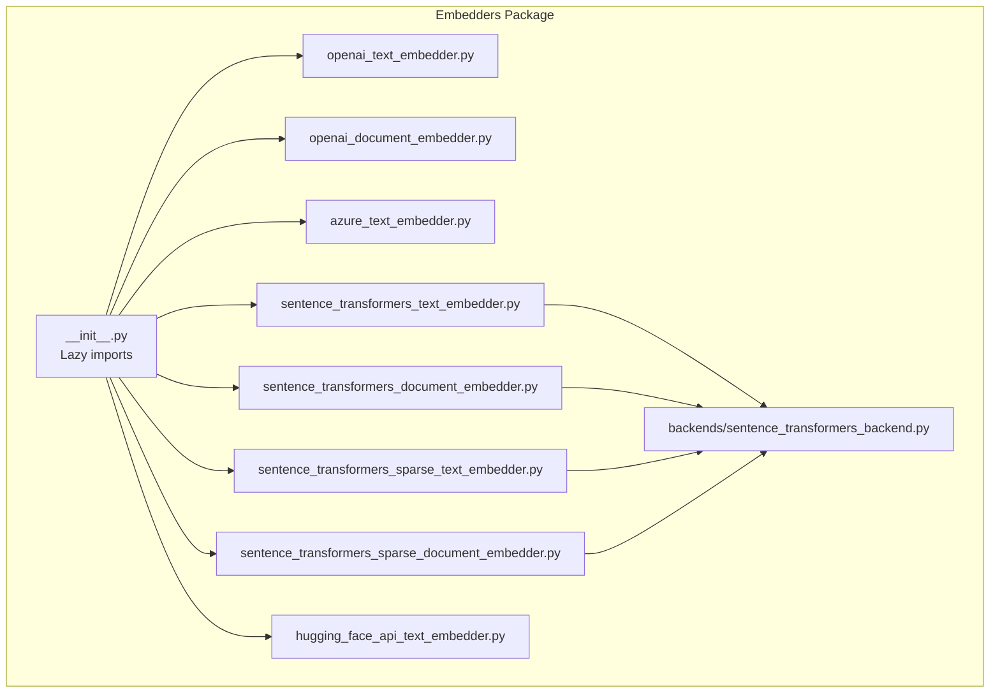

**Diagram sources**
- [haystack/components/embedders/__init__.py](file://haystack/components/embedders/__init__.py#L10-L21)
- [haystack/components/embedders/openai_text_embedder.py](file://haystack/components/embedders/openai_text_embedder.py#L16-L211)
- [haystack/components/embedders/openai_document_embedder.py](file://haystack/components/embedders/openai_document_embedder.py#L21-L352)
- [haystack/components/embedders/azure_text_embedder.py](file://haystack/components/embedders/azure_text_embedder.py#L16-L193)
- [haystack/components/embedders/sentence_transformers_text_embedder.py](file://haystack/components/embedders/sentence_transformers_text_embedder.py#L16-L242)
- [haystack/components/embedders/sentence_transformers_document_embedder.py](file://haystack/components/embedders/sentence_transformers_document_embedder.py#L17-L270)
- [haystack/components/embedders/sentence_transformers_sparse_text_embedder.py](file://haystack/components/embedders/sentence_transformers_sparse_text_embedder.py#L17-L198)
- [haystack/components/embedders/sentence_transformers_sparse_document_embedder.py](file://haystack/components/embedders/sentence_transformers_sparse_document_embedder.py#L17-L237)
- [haystack/components/embedders/hugging_face_api_text_embedder.py](file://haystack/components/embedders/hugging_face_api_text_embedder.py#L19-L259)
- [haystack/components/embedders/backends/sentence_transformers_backend.py](file://haystack/components/embedders/backends/sentence_transformers_backend.py#L18-L117)

**Section sources**
- [haystack/components/embedders/__init__.py](file://haystack/components/embedders/__init__.py#L10-L45)

## Core Components
This section summarizes the primary embedder families and their roles.

- OpenAI Text Embedder
  - Purpose: Embed a single string using OpenAI models.
  - Inputs: text (str)
  - Outputs: embedding (list[float]), optional meta (model info, usage)
  - Key options: model, dimensions, prefix/suffix, timeouts, retries, http client kwargs
  - Typical use: query embedding in retrieval pipelines

- OpenAI Document Embedder
  - Purpose: Batch embed a list of Documents using OpenAI models.
  - Inputs: documents (list[Document])
  - Outputs: documents (with embedding field set), meta (model, usage)
  - Key options: model, dimensions, batch_size, meta_fields_to_embed, embedding_separator, progress bar, raise_on_failure
  - Typical use: indexing pipelines to embed documents before writing to a document store

- Azure OpenAI Text Embedder
  - Purpose: Same as OpenAI Text Embedder but targets Azure-deployed models.
  - Inputs: text (str)
  - Outputs: embedding (list[float]), optional meta
  - Key options: azure_endpoint, api_version, azure_deployment, dimensions, auth (API key or AD token), timeouts, headers, token provider
  - Typical use: enterprise deployments behind Azure OpenAI

- Sentence Transformers Text/Document Embedders
  - Purpose: Local, offline embeddings using Sentence Transformers models.
  - Inputs: text (str) or documents (list[Document])
  - Outputs: embedding (list[float]) or documents with embedding
  - Key options: model, device, token (private HF models), prefix/suffix, batch_size, progress bar, normalize_embeddings, truncate_dim, precision, encode_kwargs, backend (torch/onnx/openvino), revision
  - Typical use: privacy-sensitive or offline scenarios; supports quantized embeddings for performance

- Sentence Transformers Sparse Text/Document Embedders
  - Purpose: Sparse embeddings using SPLADE-style models.
  - Inputs: text (str) or documents (list[Document])
  - Outputs: sparse_embedding (SparseEmbedding) or documents with sparse_embedding
  - Key options: model, device, token, prefix/suffix, meta_fields_to_embed, embedding_separator, trust_remote_code, local_files_only, model_kwargs/tokenizer_kwargs/config_kwargs, backend, revision
  - Typical use: sparse retrieval setups

- Hugging Face API Text Embedder
  - Purpose: Embed text via Hugging Face APIs (Serverless Inference API, Inference Endpoints, Self-hosted Text Embeddings Inference).
  - Inputs: text (str)
  - Outputs: embedding (list[float])
  - Key options: api_type, api_params (model or url), token, prefix/suffix, truncate, normalize
  - Typical use: leveraging hosted or self-hosted inference servers

Common interfaces and data structures:
- TextEmbedder and DocumentEmbedder protocols define the expected run signatures and outputs.
- Documents carry dense embeddings in the embedding field and sparse embeddings in the sparse_embedding field.

**Section sources**
- [haystack/components/embedders/openai_text_embedder.py](file://haystack/components/embedders/openai_text_embedder.py#L16-L211)
- [haystack/components/embedders/openai_document_embedder.py](file://haystack/components/embedders/openai_document_embedder.py#L21-L352)
- [haystack/components/embedders/azure_text_embedder.py](file://haystack/components/embedders/azure_text_embedder.py#L16-L193)
- [haystack/components/embedders/sentence_transformers_text_embedder.py](file://haystack/components/embedders/sentence_transformers_text_embedder.py#L16-L242)
- [haystack/components/embedders/sentence_transformers_document_embedder.py](file://haystack/components/embedders/sentence_transformers_document_embedder.py#L17-L270)
- [haystack/components/embedders/sentence_transformers_sparse_text_embedder.py](file://haystack/components/embedders/sentence_transformers_sparse_text_embedder.py#L17-L198)
- [haystack/components/embedders/sentence_transformers_sparse_document_embedder.py](file://haystack/components/embedders/sentence_transformers_sparse_document_embedder.py#L17-L237)
- [haystack/components/embedders/hugging_face_api_text_embedder.py](file://haystack/components/embedders/hugging_face_api_text_embedder.py#L19-L259)
- [haystack/components/embedders/types/protocol.py](file://haystack/components/embedders/types/protocol.py#L10-L52)
- [haystack/dataclasses/document.py](file://haystack/dataclasses/document.py#L47-L71)

## Architecture Overview
The embedders follow a consistent component pattern: they accept inputs, prepare prompts (prefix/suffix), optionally batch and transform inputs, call the underlying provider/client, and return structured outputs. Some embedders inherit from shared base classes to reuse common logic (e.g., Azure embedders inherit from OpenAI embedders).

```mermaid
classDiagram
class TextEmbedder {
+run(text : str) dict
}
class DocumentEmbedder {
+run(documents : list[Document]) dict
}
class OpenAITextEmbedder {
+run(text : str) dict
+run_async(text : str) dict
-client
-async_client
}
class OpenAIDocumentEmbedder {
+run(documents : list[Document]) dict
+run_async(documents : list[Document]) dict
-client
-async_client
}
class AzureOpenAITextEmbedder {
+run(text : str) dict
+run_async(text : str) dict
-client
-async_client
}
class SentenceTransformersTextEmbedder {
+run(text : str) dict
+warm_up() void
}
class SentenceTransformersDocumentEmbedder {
+run(documents : list[Document]) dict
+warm_up() void
}
class SentenceTransformersSparseTextEmbedder {
+run(text : str) dict
+warm_up() void
}
class SentenceTransformersSparseDocumentEmbedder {
+run(documents : list[Document]) dict
+warm_up() void
}
class HuggingFaceAPITextEmbedder {
+run(text : str) dict
+run_async(text : str) dict
}
TextEmbedder <|.. OpenAITextEmbedder
TextEmbedder <|.. AzureOpenAITextEmbedder
TextEmbedder <|.. SentenceTransformersTextEmbedder
TextEmbedder <|.. SentenceTransformersSparseTextEmbedder
TextEmbedder <|.. HuggingFaceAPITextEmbedder
DocumentEmbedder <|.. OpenAIDocumentEmbedder
DocumentEmbedder <|.. SentenceTransformersDocumentEmbedder
DocumentEmbedder <|.. SentenceTransformersSparseDocumentEmbedder
```

**Diagram sources**
- [haystack/components/embedders/types/protocol.py](file://haystack/components/embedders/types/protocol.py#L10-L52)
- [haystack/components/embedders/openai_text_embedder.py](file://haystack/components/embedders/openai_text_embedder.py#L16-L211)
- [haystack/components/embedders/openai_document_embedder.py](file://haystack/components/embedders/openai_document_embedder.py#L21-L352)
- [haystack/components/embedders/azure_text_embedder.py](file://haystack/components/embedders/azure_text_embedder.py#L16-L193)
- [haystack/components/embedders/sentence_transformers_text_embedder.py](file://haystack/components/embedders/sentence_transformers_text_embedder.py#L16-L242)
- [haystack/components/embedders/sentence_transformers_document_embedder.py](file://haystack/components/embedders/sentence_transformers_document_embedder.py#L17-L270)
- [haystack/components/embedders/sentence_transformers_sparse_text_embedder.py](file://haystack/components/embedders/sentence_transformers_sparse_text_embedder.py#L17-L198)
- [haystack/components/embedders/sentence_transformers_sparse_document_embedder.py](file://haystack/components/embedders/sentence_transformers_sparse_document_embedder.py#L17-L237)
- [haystack/components/embedders/hugging_face_api_text_embedder.py](file://haystack/components/embedders/hugging_face_api_text_embedder.py#L19-L259)

## Detailed Component Analysis

### OpenAI Text Embedder
- Purpose: Embed a single string using OpenAI embeddings.
- Inputs: text (str)
- Outputs: embedding (list[float]), meta (model, usage)
- Key options:
  - model: model name
  - dimensions: requested output dimensions (supported by newer models)
  - prefix/suffix: prepended/appended to input text
  - timeouts/retries: client configuration
  - http_client_kwargs: customize underlying HTTP client
- Typical use: query embedding in retrieval pipelines.

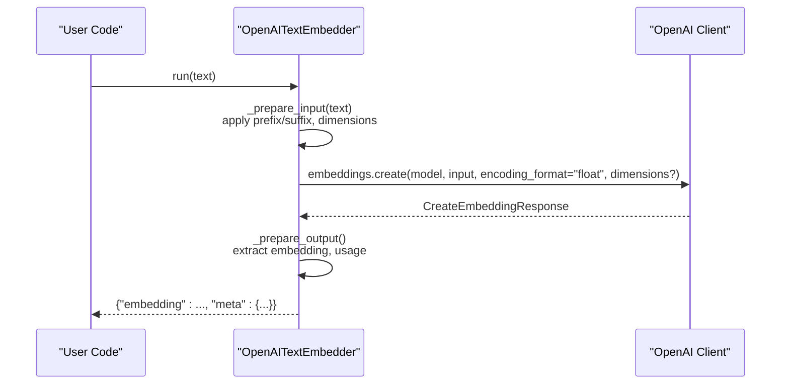

**Diagram sources**
- [haystack/components/embedders/openai_text_embedder.py](file://haystack/components/embedders/openai_text_embedder.py#L158-L190)

**Section sources**
- [haystack/components/embedders/openai_text_embedder.py](file://haystack/components/embedders/openai_text_embedder.py#L16-L211)

### OpenAI Document Embedder
- Purpose: Batch embed a list of Documents using OpenAI embeddings.
- Inputs: documents (list[Document])
- Outputs: documents (with embedding set), meta (model, usage)
- Key options:
  - batch_size: controls batching
  - meta_fields_to_embed + embedding_separator: include metadata in embedding input
  - progress_bar: show progress
  - raise_on_failure: fail fast vs. continue on error
  - dimensions: per-request
- Typical use: indexing pipelines.

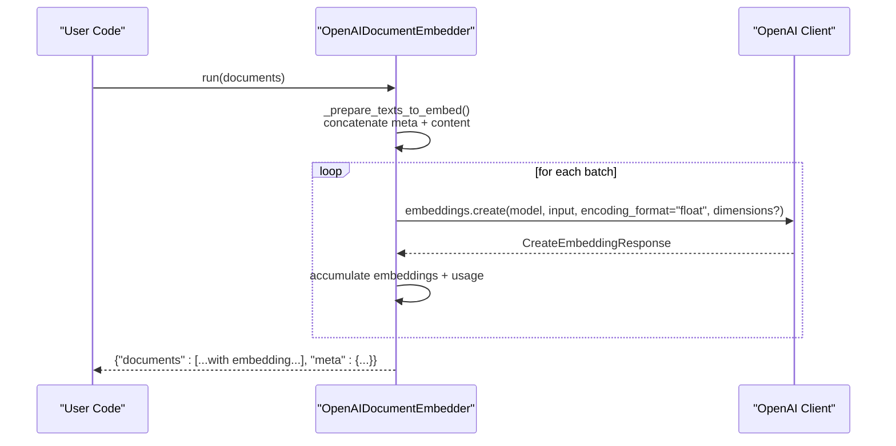

**Diagram sources**
- [haystack/components/embedders/openai_document_embedder.py](file://haystack/components/embedders/openai_document_embedder.py#L188-L242)

**Section sources**
- [haystack/components/embedders/openai_document_embedder.py](file://haystack/components/embedders/openai_document_embedder.py#L21-L352)

### Azure OpenAI Text Embedder
- Purpose: Same as OpenAI Text Embedder but targets Azure-deployed models.
- Inputs: text (str)
- Outputs: embedding (list[float]), meta (model, usage)
- Key options:
  - azure_endpoint, api_version, azure_deployment
  - dimensions
  - auth: api_key or azure_ad_token
  - timeouts/retries, default_headers, azure_ad_token_provider, http_client_kwargs
- Typical use: enterprise Azure OpenAI environments.

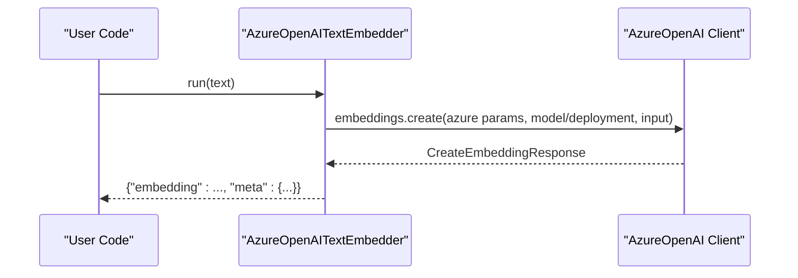

**Diagram sources**
- [haystack/components/embedders/azure_text_embedder.py](file://haystack/components/embedders/azure_text_embedder.py#L129-L147)

**Section sources**
- [haystack/components/embedders/azure_text_embedder.py](file://haystack/components/embedders/azure_text_embedder.py#L16-L193)

### Sentence Transformers Text Embedder
- Purpose: Local embeddings using Sentence Transformers.
- Inputs: text (str)
- Outputs: embedding (list[float])
- Key options:
  - model, device, token, prefix/suffix
  - batch_size, progress_bar
  - normalize_embeddings, truncate_dim, precision
  - encode_kwargs, backend (torch/onnx/openvino), revision
- Typical use: offline/embed locally; quantized embeddings for speed/memory.

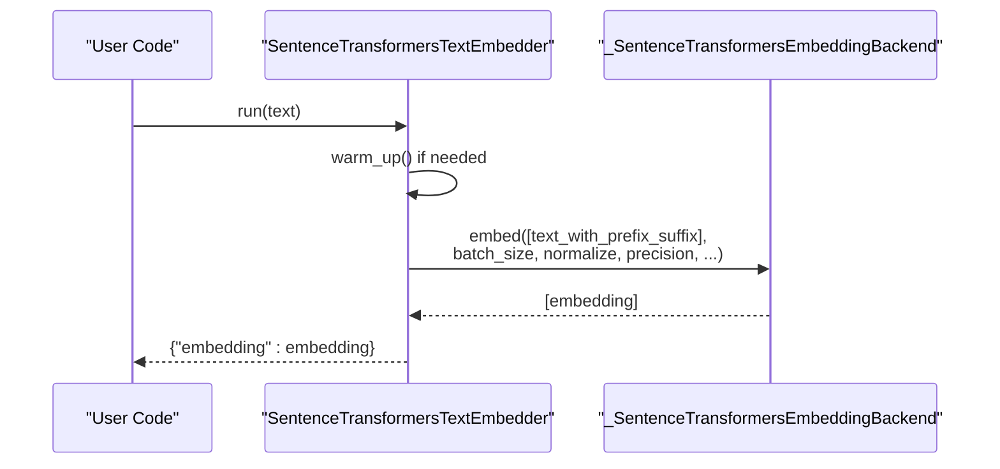

**Diagram sources**
- [haystack/components/embedders/sentence_transformers_text_embedder.py](file://haystack/components/embedders/sentence_transformers_text_embedder.py#L189-L241)
- [haystack/components/embedders/backends/sentence_transformers_backend.py](file://haystack/components/embedders/backends/sentence_transformers_backend.py#L77-L117)

**Section sources**
- [haystack/components/embedders/sentence_transformers_text_embedder.py](file://haystack/components/embedders/sentence_transformers_text_embedder.py#L16-L242)
- [haystack/components/embedders/backends/sentence_transformers_backend.py](file://haystack/components/embedders/backends/sentence_transformers_backend.py#L18-L117)

### Sentence Transformers Document Embedder
- Purpose: Batch embed Documents using Sentence Transformers.
- Inputs: documents (list[Document])
- Outputs: documents (with embedding)
- Key options:
  - meta_fields_to_embed + embedding_separator
  - normalize_embeddings, precision, truncate_dim
  - backend, revision, trust_remote_code, local_files_only
- Typical use: indexing pipelines with local models.

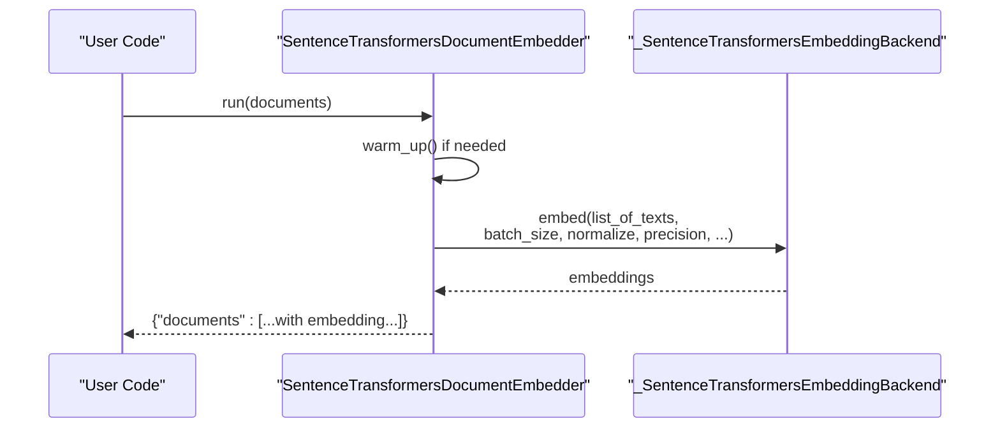

**Diagram sources**
- [haystack/components/embedders/sentence_transformers_document_embedder.py](file://haystack/components/embedders/sentence_transformers_document_embedder.py#L204-L269)
- [haystack/components/embedders/backends/sentence_transformers_backend.py](file://haystack/components/embedders/backends/sentence_transformers_backend.py#L77-L117)

**Section sources**
- [haystack/components/embedders/sentence_transformers_document_embedder.py](file://haystack/components/embedders/sentence_transformers_document_embedder.py#L17-L270)
- [haystack/components/embedders/backends/sentence_transformers_backend.py](file://haystack/components/embedders/backends/sentence_transformers_backend.py#L18-L117)

### Sentence Transformers Sparse Text/Document Embedders
- Purpose: Produce sparse embeddings using SPLADE-style models.
- Inputs: text (str) or documents (list[Document])
- Outputs: sparse_embedding (SparseEmbedding) or documents with sparse_embedding
- Key options:
  - model, device, token, prefix/suffix
  - meta_fields_to_embed, embedding_separator
  - trust_remote_code, local_files_only, backend, revision
- Typical use: sparse retrieval pipelines.

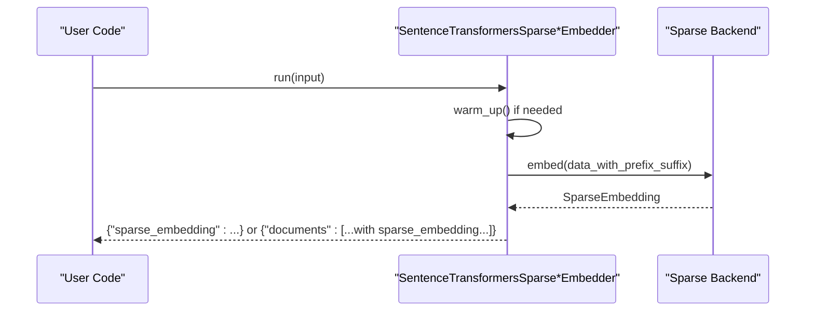

**Diagram sources**
- [haystack/components/embedders/sentence_transformers_sparse_text_embedder.py](file://haystack/components/embedders/sentence_transformers_sparse_text_embedder.py#L151-L197)
- [haystack/components/embedders/sentence_transformers_sparse_document_embedder.py](file://haystack/components/embedders/sentence_transformers_sparse_document_embedder.py#L177-L236)

**Section sources**
- [haystack/components/embedders/sentence_transformers_sparse_text_embedder.py](file://haystack/components/embedders/sentence_transformers_sparse_text_embedder.py#L17-L198)
- [haystack/components/embedders/sentence_transformers_sparse_document_embedder.py](file://haystack/components/embedders/sentence_transformers_sparse_document_embedder.py#L17-L237)

### Hugging Face API Text Embedder
- Purpose: Embed text via Hugging Face APIs (Serverless, Endpoints, Self-hosted TEI).
- Inputs: text (str)
- Outputs: embedding (list[float])
- Key options:
  - api_type: serverless_inference_api, inference_endpoints, text_embeddings_inference
  - api_params: model (serverless) or url (endpoints/tei)
  - token, prefix/suffix
  - truncate, normalize (ignored for serverless)
- Typical use: leveraging hosted or self-hosted inference.

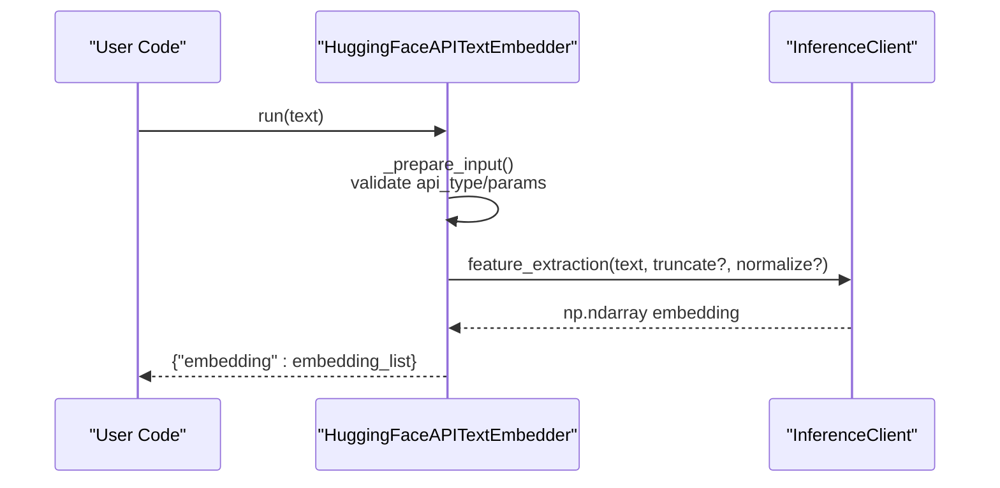

**Diagram sources**
- [haystack/components/embedders/hugging_face_api_text_embedder.py](file://haystack/components/embedders/hugging_face_api_text_embedder.py#L150-L230)

**Section sources**
- [haystack/components/embedders/hugging_face_api_text_embedder.py](file://haystack/components/embedders/hugging_face_api_text_embedder.py#L19-L259)

### Image Embedding with Sentence Transformers
Sentence Transformers supports image inputs via the SentenceTransformer.encode method. Documents can carry image content via the blob field, and the backend can encode images alongside text.

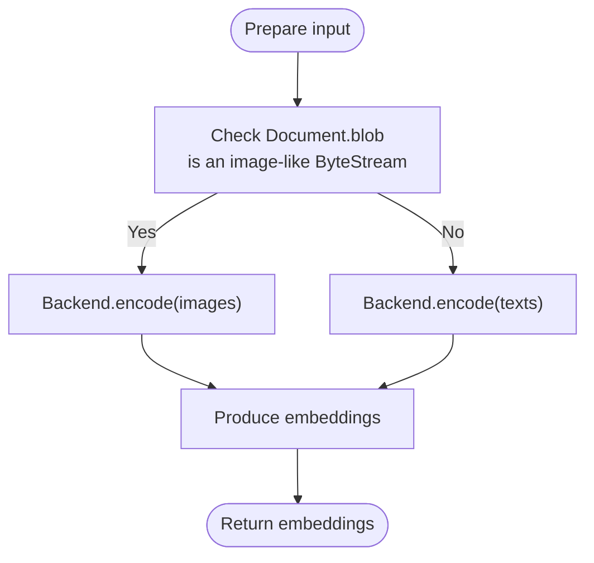

**Diagram sources**
- [haystack/components/embedders/backends/sentence_transformers_backend.py](file://haystack/components/embedders/backends/sentence_transformers_backend.py#L113-L117)
- [haystack/dataclasses/document.py](file://haystack/dataclasses/document.py#L65-L69)
- [haystack/dataclasses/image_content.py](file://haystack/dataclasses/image_content.py#L15-L247)

**Section sources**
- [haystack/components/embedders/backends/sentence_transformers_backend.py](file://haystack/components/embedders/backends/sentence_transformers_backend.py#L77-L117)
- [haystack/dataclasses/document.py](file://haystack/dataclasses/document.py#L65-L71)
- [haystack/dataclasses/image_content.py](file://haystack/dataclasses/image_content.py#L15-L247)

## Dependency Analysis
- Lazy imports in the embedders package centralize component availability and reduce startup overhead.
- Sentence Transformers embedders depend on a backend factory that caches and instantiates SentenceTransformer models with specific parameters.
- Azure embedders inherit from OpenAI embedders to reuse HTTP client and async patterns.

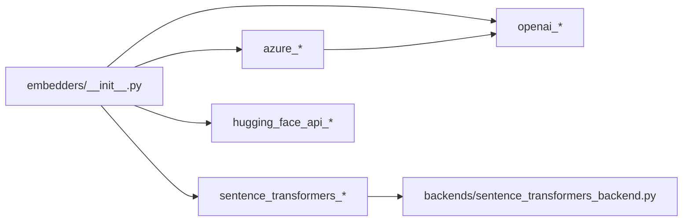

**Diagram sources**
- [haystack/components/embedders/__init__.py](file://haystack/components/embedders/__init__.py#L10-L45)
- [haystack/components/embedders/backends/sentence_transformers_backend.py](file://haystack/components/embedders/backends/sentence_transformers_backend.py#L18-L75)

**Section sources**
- [haystack/components/embedders/__init__.py](file://haystack/components/embedders/__init__.py#L10-L45)
- [haystack/components/embedders/backends/sentence_transformers_backend.py](file://haystack/components/embedders/backends/sentence_transformers_backend.py#L18-L75)

## Performance Considerations
- Batch processing
  - OpenAI Document Embedder and Sentence Transformers Document Embedders support configurable batch sizes to improve throughput.
  - Progress bars can be disabled to reduce overhead when not needed.
- Quantization and precision
  - Sentence Transformers supports quantized embeddings (e.g., int8/uint8/binary/ubinary) to reduce memory and latency.
  - truncate_dim can be used to reduce embedding dimensionality; use carefully and ensure model compatibility.
- Asynchronous execution
  - OpenAI and Hugging Face API embedders expose async run methods for concurrent processing.
- Backend acceleration
  - Sentence Transformers supports ONNX and OpenVINO backends for improved performance on CPU/GPU.
- Network and timeouts
  - Configure timeouts and retries appropriately for cloud providers to balance reliability and latency.

[No sources needed since this section provides general guidance]

## Troubleshooting Guide
- Type mismatches
  - Text embedders reject non-string inputs; use Document embedders for lists of Documents.
- Provider-specific errors
  - OpenAI Document Embedder can raise on failure or continue depending on raise_on_failure; inspect logs for partial failures.
  - Azure embedders require either an API key or an Azure AD token and a valid endpoint.
  - Hugging Face API embedders validate api_type and api_params; ensure correct model/url and token.
- Embedding shapes
  - Hugging Face API embedders expect a 1D or (1 x D) shaped array; unexpected shapes raise errors.
- Device and model loading
  - Sentence Transformers embedders require proper device selection and may need revision/local_files_only flags for private/self-hosted models.

**Section sources**
- [haystack/components/embedders/openai_text_embedder.py](file://haystack/components/embedders/openai_text_embedder.py#L158-L163)
- [haystack/components/embedders/openai_document_embedder.py](file://haystack/components/embedders/openai_document_embedder.py#L222-L229)
- [haystack/components/embedders/azure_text_embedder.py](file://haystack/components/embedders/azure_text_embedder.py#L106-L112)
- [haystack/components/embedders/hugging_face_api_text_embedder.py](file://haystack/components/embedders/hugging_face_api_text_embedder.py#L150-L173)
- [haystack/components/embedders/hugging_face_api_text_embedder.py](file://haystack/components/embedders/hugging_face_api_text_embedder.py#L222-L227)

## Conclusion
Haystack offers a broad set of embedders to suit diverse deployment needs:
- OpenAI/Azure for managed cloud embeddings
- Sentence Transformers for local/offline and quantized scenarios
- Sparse embeddings for specialized retrieval setups
- Hugging Face API for flexible hosting options

Choose embedders based on environment constraints, latency and cost targets, and retrieval strategy. Combine embedders with appropriate backends and batch sizes to optimize performance.

[No sources needed since this section summarizes without analyzing specific files]

## Appendices

### Common Interfaces and Output Shapes
- TextEmbedder.run(text: str) -> dict with "embedding" (list[float]) and optional keys
- DocumentEmbedder.run(documents: list[Document]) -> dict with "documents" (list[Document] with embedding or sparse_embedding) and optional keys

**Section sources**
- [haystack/components/embedders/types/protocol.py](file://haystack/components/embedders/types/protocol.py#L10-L52)

### Practical Pipeline Usage Patterns
- Text embedding
  - Use OpenAITextEmbedder or AzureOpenAITextEmbedder for query vectors.
  - Use SentenceTransformersTextEmbedder for local queries.
- Document embedding
  - Use OpenAIDocumentEmbedder or SentenceTransformersDocumentEmbedder in indexing pipelines.
  - Optionally include metadata fields to enrich embeddings.
- Image embedding
  - Use SentenceTransformersDocumentEmbedder with Documents whose blob carries image data; backend supports image inputs.

**Section sources**
- [haystack/components/embedders/openai_text_embedder.py](file://haystack/components/embedders/openai_text_embedder.py#L16-L211)
- [haystack/components/embedders/azure_text_embedder.py](file://haystack/components/embedders/azure_text_embedder.py#L16-L193)
- [haystack/components/embedders/sentence_transformers_text_embedder.py](file://haystack/components/embedders/sentence_transformers_text_embedder.py#L16-L242)
- [haystack/components/embedders/sentence_transformers_document_embedder.py](file://haystack/components/embedders/sentence_transformers_document_embedder.py#L17-L270)
- [haystack/components/embedders/backends/sentence_transformers_backend.py](file://haystack/components/embedders/backends/sentence_transformers_backend.py#L113-L117)
- [haystack/dataclasses/document.py](file://haystack/dataclasses/document.py#L65-L69)