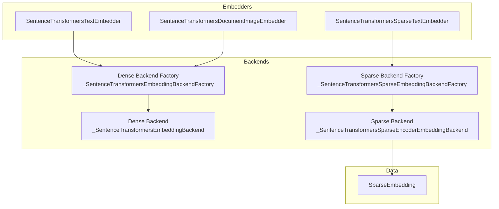
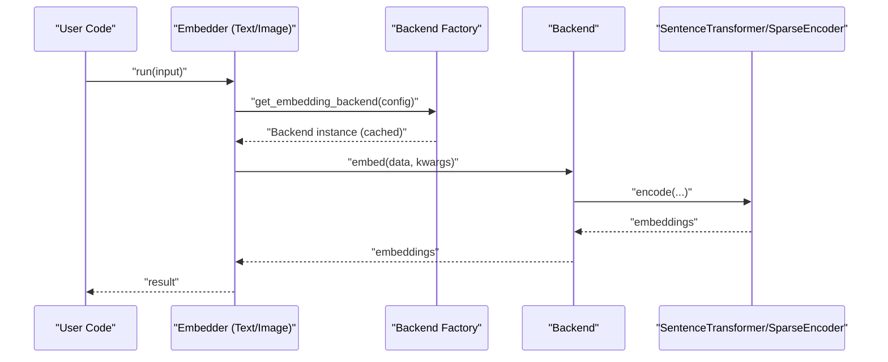
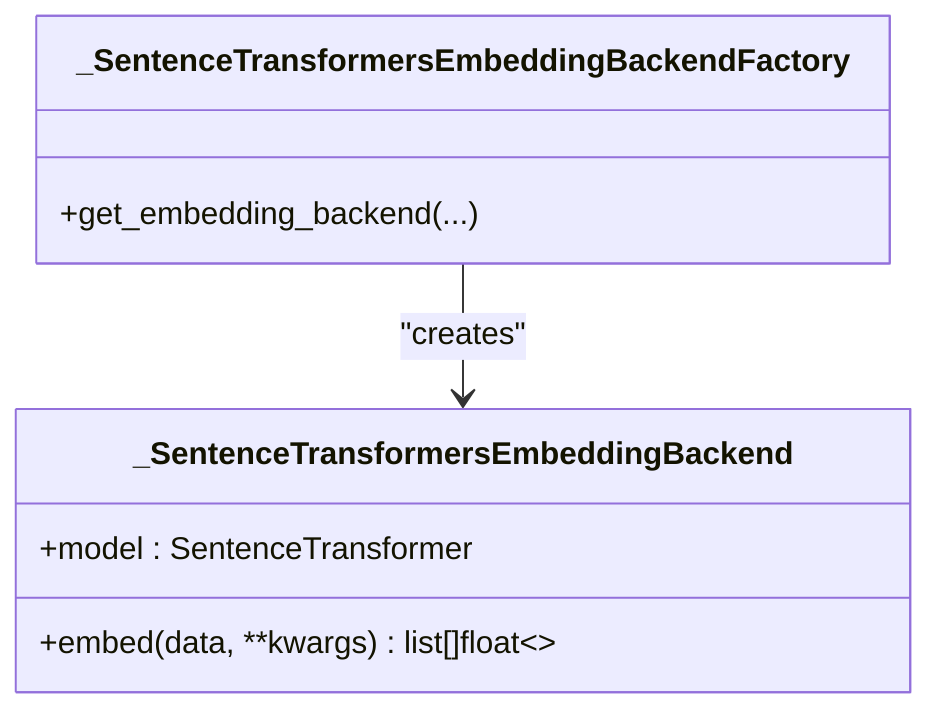
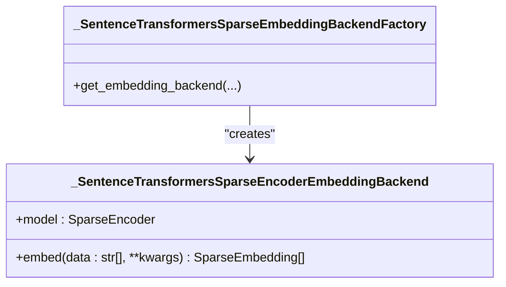
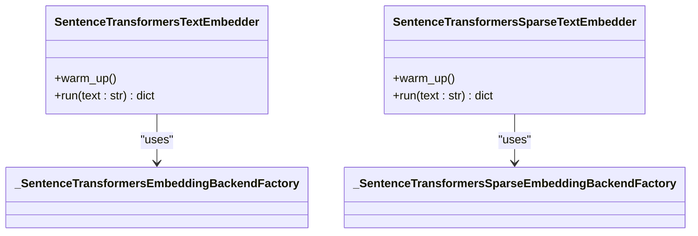
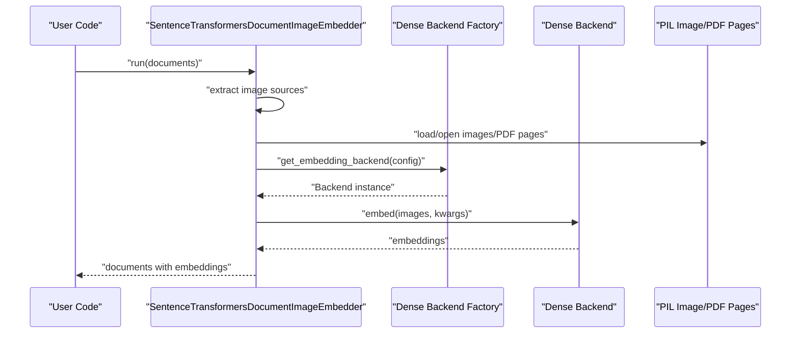
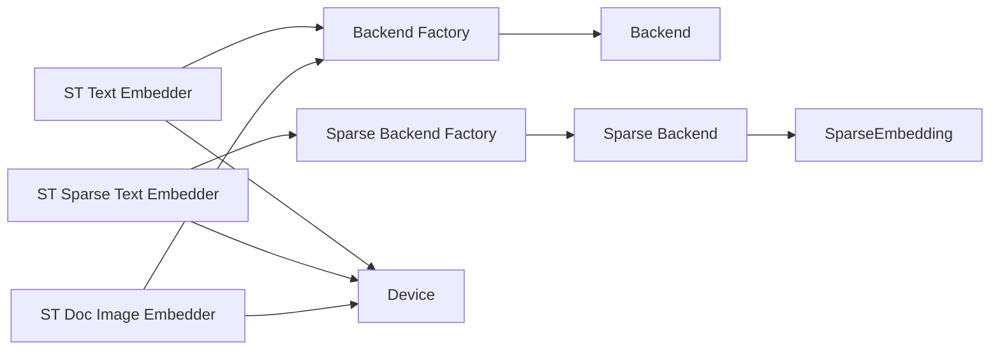
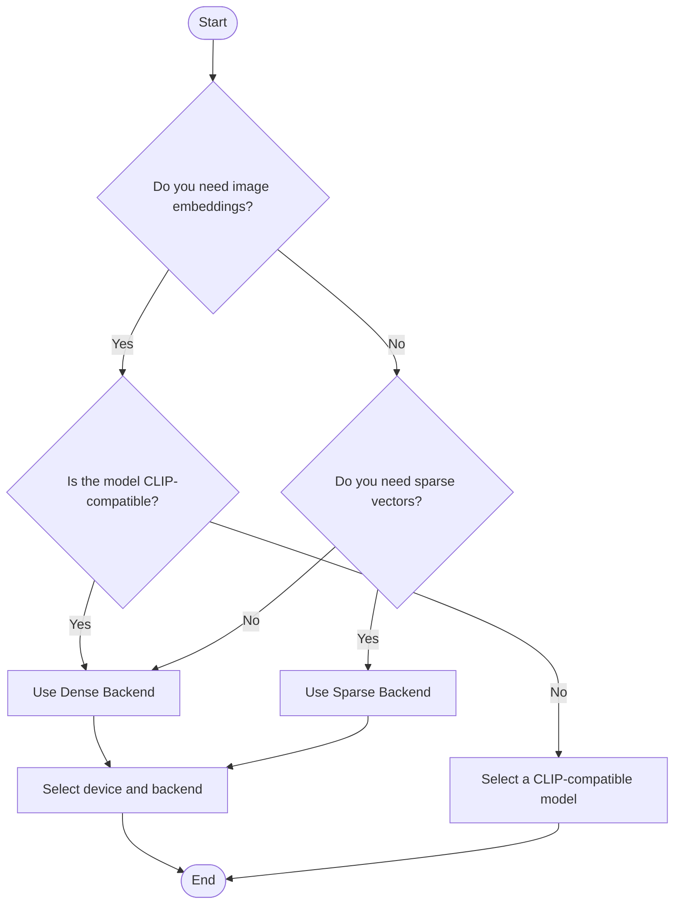

# Embedding Backends

<cite>
**Referenced Files in This Document**
- [sentence_transformers_backend.py](file://haystack/components/embedders/backends/sentence_transformers_backend.py)
- [sentence_transformers_sparse_backend.py](file://haystack/components/embedders/backends/sentence_transformers_sparse_backend.py)
- [sentence_transformers_text_embedder.py](file://haystack/components/embedders/sentence_transformers_text_embedder.py)
- [sentence_transformers_sparse_text_embedder.py](file://haystack/components/embedders/sentence_transformers_sparse_text_embedder.py)
- [sentence_transformers_doc_image_embedder.py](file://haystack/components/embedders/image/sentence_transformers_doc_image_embedder.py)
- [sparse_embedding.py](file://haystack/dataclasses/sparse_embedding.py)
- [protocol.py](file://haystack/components/embedders/types/protocol.py)
- [device.py](file://haystack/utils/device.py)
- [__init__.py](file://haystack/components/embedders/__init__.py)
- [test_sentence_transformers_sparse_embedding_backend.py](file://test/components/embedders/test_sentence_transformers_sparse_embedding_backend.py)
- [test_sentence_transformers_sparse_text_embedder.py](file://test/components/embedders/test_sentence_transformers_sparse_text_embedder.py)
</cite>

## Table of Contents
1. [Introduction](#introduction)
2. [Project Structure](#project-structure)
3. [Core Components](#core-components)
4. [Architecture Overview](#architecture-overview)
5. [Detailed Component Analysis](#detailed-component-analysis)
6. [Dependency Analysis](#dependency-analysis)
7. [Performance Considerations](#performance-considerations)
8. [Troubleshooting Guide](#troubleshooting-guide)
9. [Conclusion](#conclusion)
10. [Appendices](#appendices)

## Introduction
This document explains how Haystack implements and integrates embedding backends, focusing on dense and sparse text embeddings and image embeddings powered by Sentence Transformers. It covers the backend architecture, selection criteria, performance characteristics, hardware acceleration, and practical configuration guidance. It also describes how embedders relate to backends, how to switch backends safely, and how to manage resources and scale effectively.

## Project Structure
The embedding subsystem is organized around:
- Backend factories and backend implementations for dense and sparse Sentence Transformers
- Embedder components that expose a uniform interface for text and image embedding
- A shared sparse embedding dataclass
- A device abstraction for hardware selection and acceleration

**Diagram sources**
- [sentence_transformers_text_embedder.py](file://haystack/components/embedders/sentence_transformers_text_embedder.py#L16-L242)
- [sentence_transformers_sparse_text_embedder.py](file://haystack/components/embedders/sentence_transformers_sparse_text_embedder.py#L17-L198)
- [sentence_transformers_doc_image_embedder.py](file://haystack/components/embedders/image/sentence_transformers_doc_image_embedder.py#L27-L290)
- [sentence_transformers_backend.py](file://haystack/components/embedders/backends/sentence_transformers_backend.py#L18-L117)
- [sentence_transformers_sparse_backend.py](file://haystack/components/embedders/backends/sentence_transformers_sparse_backend.py#L16-L123)
- [sparse_embedding.py](file://haystack/dataclasses/sparse_embedding.py#L11-L53)

**Section sources**
- [__init__.py](file://haystack/components/embedders/__init__.py#L10-L45)
- [protocol.py](file://haystack/components/embedders/types/protocol.py#L10-L52)

## Core Components
- Dense Sentence Transformers backend: encapsulates a SentenceTransformer model and exposes a unified embed method for strings and images.
- Sparse Sentence Transformers backend: encapsulates a SparseEncoder model and returns SparseEmbedding objects.
- Text embedders:
  - SentenceTransformersTextEmbedder: dense embeddings for text
  - SentenceTransformersSparseTextEmbedder: sparse embeddings for text
- Image embedder:
  - SentenceTransformersDocumentImageEmbedder: dense embeddings for images and PDF pages via CLIP-compatible models
- Sparse embedding dataclass: a compact representation of sparse vectors with indices and values
- Device utilities: a cross-platform abstraction for CPU/GPU/MPS/XPU selection and conversion to framework-specific formats

Key capabilities:
- Backend factory pattern ensures reuse of initialized models per configuration
- Backend supports “torch”, “onnx”, and “openvino” backends for acceleration
- Sparse embeddings are returned as a dedicated dataclass for downstream retrieval
- Image embedder supports PDF-to-image conversion and batched embedding

**Section sources**
- [sentence_transformers_backend.py](file://haystack/components/embedders/backends/sentence_transformers_backend.py#L18-L117)
- [sentence_transformers_sparse_backend.py](file://haystack/components/embedders/backends/sentence_transformers_sparse_backend.py#L16-L123)
- [sentence_transformers_text_embedder.py](file://haystack/components/embedders/sentence_transformers_text_embedder.py#L16-L242)
- [sentence_transformers_sparse_text_embedder.py](file://haystack/components/embedders/sentence_transformers_sparse_text_embedder.py#L17-L198)
- [sentence_transformers_doc_image_embedder.py](file://haystack/components/embedders/image/sentence_transformers_doc_image_embedder.py#L27-L290)
- [sparse_embedding.py](file://haystack/dataclasses/sparse_embedding.py#L11-L53)
- [device.py](file://haystack/utils/device.py#L246-L454)

## Architecture Overview
The embedder components delegate to backend factories, which manage model instances and caching keyed by configuration. The backends call Sentence Transformers APIs to produce dense or sparse embeddings. Image embedders additionally handle PDF conversion and image loading.

**Diagram sources**
- [sentence_transformers_text_embedder.py](file://haystack/components/embedders/sentence_transformers_text_embedder.py#L189-L241)
- [sentence_transformers_doc_image_embedder.py](file://haystack/components/embedders/image/sentence_transformers_doc_image_embedder.py#L199-L290)
- [sentence_transformers_backend.py](file://haystack/components/embedders/backends/sentence_transformers_backend.py#L18-L117)
- [sentence_transformers_sparse_backend.py](file://haystack/components/embedders/backends/sentence_transformers_sparse_backend.py#L16-L123)

## Detailed Component Analysis

### Dense Sentence Transformers Backend
- Factory caches backend instances keyed by model and configuration to avoid redundant initialization.
- Backend wraps SentenceTransformer and exposes embed for strings and images.
- Supports device selection and multiple backends (“torch”, “onnx”, “openvino”).

**Diagram sources**
- [sentence_transformers_backend.py](file://haystack/components/embedders/backends/sentence_transformers_backend.py#L18-L117)

**Section sources**
- [sentence_transformers_backend.py](file://haystack/components/embedders/backends/sentence_transformers_backend.py#L18-L117)

### Sparse Sentence Transformers Backend
- Factory caches sparse encoder backends keyed by configuration.
- Backend wraps SparseEncoder and returns SparseEmbedding objects.
- Encodes to sparse tensors and converts to indices/values.

**Diagram sources**
- [sentence_transformers_sparse_backend.py](file://haystack/components/embedders/backends/sentence_transformers_sparse_backend.py#L16-L123)

**Section sources**
- [sentence_transformers_sparse_backend.py](file://haystack/components/embedders/backends/sentence_transformers_sparse_backend.py#L16-L123)
- [sparse_embedding.py](file://haystack/dataclasses/sparse_embedding.py#L11-L53)

### Text Embedders
- SentenceTransformersTextEmbedder: dense embeddings for text with configurable device, precision, normalization, and backend.
- SentenceTransformersSparseTextEmbedder: sparse embeddings for text returning SparseEmbedding.

**Diagram sources**
- [sentence_transformers_text_embedder.py](file://haystack/components/embedders/sentence_transformers_text_embedder.py#L16-L242)
- [sentence_transformers_sparse_text_embedder.py](file://haystack/components/embedders/sentence_transformers_sparse_text_embedder.py#L17-L198)

**Section sources**
- [sentence_transformers_text_embedder.py](file://haystack/components/embedders/sentence_transformers_text_embedder.py#L16-L242)
- [sentence_transformers_sparse_text_embedder.py](file://haystack/components/embedders/sentence_transformers_sparse_text_embedder.py#L17-L198)

### Image Embedder
- SentenceTransformersDocumentImageEmbedder: computes embeddings for images and PDF pages using CLIP-compatible models.
- Handles metadata-driven image discovery, PDF-to-image conversion, and batched embedding.

**Diagram sources**
- [sentence_transformers_doc_image_embedder.py](file://haystack/components/embedders/image/sentence_transformers_doc_image_embedder.py#L219-L290)
- [sentence_transformers_backend.py](file://haystack/components/embedders/backends/sentence_transformers_backend.py#L18-L117)

**Section sources**
- [sentence_transformers_doc_image_embedder.py](file://haystack/components/embedders/image/sentence_transformers_doc_image_embedder.py#L27-L290)

### Backend Selection Criteria
- Dense vs sparse: choose dense for dense-vector retrieval and sparse for sparse-vector retrieval.
- Model capability: image embeddings require CLIP-compatible models.
- Hardware: select device and backend according to available accelerators.
- Precision and quantization: adjust precision for speed/memory trade-offs.
- Batch size and progress bar: tune for throughput and observability.

**Section sources**
- [sentence_transformers_text_embedder.py](file://haystack/components/embedders/sentence_transformers_text_embedder.py#L53-L114)
- [sentence_transformers_doc_image_embedder.py](file://haystack/components/embedders/image/sentence_transformers_doc_image_embedder.py#L77-L133)
- [sentence_transformers_sparse_text_embedder.py](file://haystack/components/embedders/sentence_transformers_sparse_text_embedder.py#L51-L88)

### Backend-Specific Optimizations
- Backend factory caching avoids repeated model loads.
- Backend supports “torch”, “onnx”, and “openvino” backends for acceleration.
- Precision controls enable quantized embeddings for reduced size and faster computation.
- Truncate dimension and normalization can improve retrieval quality and performance.

**Section sources**
- [sentence_transformers_backend.py](file://haystack/components/embedders/backends/sentence_transformers_backend.py#L18-L75)
- [sentence_transformers_text_embedder.py](file://haystack/components/embedders/sentence_transformers_text_embedder.py#L98-L114)

### Hardware Acceleration Support
- Device selection via ComponentDevice supports CPU, CUDA, MPS, and XPU.
- Automatic default device detection prioritizes GPU/XPU/MPS/CPU.
- Backend factory passes device strings to Sentence Transformers.

**Section sources**
- [device.py](file://haystack/utils/device.py#L246-L523)
- [sentence_transformers_text_embedder.py](file://haystack/components/embedders/sentence_transformers_text_embedder.py#L116-L134)
- [sentence_transformers_doc_image_embedder.py](file://haystack/components/embedders/image/sentence_transformers_doc_image_embedder.py#L138-L151)

### Relationship Between Backends and Embedders
- Embedders depend on backend factories for model lifecycle management.
- Backends encapsulate Sentence Transformers specifics and expose a simple embed interface.
- Image embedder reuses the dense backend for CLIP-compatible models.

**Section sources**
- [sentence_transformers_text_embedder.py](file://haystack/components/embedders/sentence_transformers_text_embedder.py#L189-L241)
- [sentence_transformers_doc_image_embedder.py](file://haystack/components/embedders/image/sentence_transformers_doc_image_embedder.py#L199-L290)
- [sentence_transformers_backend.py](file://haystack/components/embedders/backends/sentence_transformers_backend.py#L18-L117)

### Practical Configuration Examples
Note: The following describe configuration steps without reproducing code. See the referenced files for exact parameter names and defaults.

- Dense text embedding:
  - Set model, device, precision, normalization, and backend.
  - Optionally set truncate_dim and encode_kwargs.
  - Warm up the component before running.
  - Reference: [sentence_transformers_text_embedder.py](file://haystack/components/embedders/sentence_transformers_text_embedder.py#L37-L114)

- Sparse text embedding:
  - Set model, device, and backend.
  - Warm up the component before running.
  - Expect a SparseEmbedding result.
  - Reference: [sentence_transformers_sparse_text_embedder.py](file://haystack/components/embedders/sentence_transformers_sparse_text_embedder.py#L38-L88)

- Image embedding:
  - Set model (CLIP-compatible), device, batch size, and precision.
  - Configure file_path_meta_field and root_path for image/PDF sources.
  - Warm up the component before running.
  - Reference: [sentence_transformers_doc_image_embedder.py](file://haystack/components/embedders/image/sentence_transformers_doc_image_embedder.py#L59-L133)

- Backend switching:
  - Change backend parameter to “onnx” or “openvino”.
  - Ensure compatible model and environment.
  - Reference: [sentence_transformers_backend.py](file://haystack/components/embedders/backends/sentence_transformers_backend.py#L38-L39)

**Section sources**
- [sentence_transformers_text_embedder.py](file://haystack/components/embedders/sentence_transformers_text_embedder.py#L37-L114)
- [sentence_transformers_sparse_text_embedder.py](file://haystack/components/embedders/sentence_transformers_sparse_text_embedder.py#L38-L88)
- [sentence_transformers_doc_image_embedder.py](file://haystack/components/embedders/image/sentence_transformers_doc_image_embedder.py#L59-L133)
- [sentence_transformers_backend.py](file://haystack/components/embedders/backends/sentence_transformers_backend.py#L38-L39)

## Dependency Analysis
- Embedders depend on backend factories for model instantiation and caching.
- Backends depend on Sentence Transformers libraries and device configuration.
- Sparse embedding dataclass is consumed by sparse embedders and returned to callers.
- Device utilities centralize device resolution and conversion.

**Diagram sources**
- [sentence_transformers_text_embedder.py](file://haystack/components/embedders/sentence_transformers_text_embedder.py#L189-L241)
- [sentence_transformers_sparse_text_embedder.py](file://haystack/components/embedders/sentence_transformers_sparse_text_embedder.py#L151-L198)
- [sentence_transformers_doc_image_embedder.py](file://haystack/components/embedders/image/sentence_transformers_doc_image_embedder.py#L199-L290)
- [sentence_transformers_backend.py](file://haystack/components/embedders/backends/sentence_transformers_backend.py#L18-L117)
- [sentence_transformers_sparse_backend.py](file://haystack/components/embedders/backends/sentence_transformers_sparse_backend.py#L16-L123)
- [sparse_embedding.py](file://haystack/dataclasses/sparse_embedding.py#L11-L53)
- [device.py](file://haystack/utils/device.py#L246-L454)

**Section sources**
- [__init__.py](file://haystack/components/embedders/__init__.py#L10-L45)
- [protocol.py](file://haystack/components/embedders/types/protocol.py#L10-L52)

## Performance Considerations
- Caching: backend factories prevent reloading models; reuse components across runs.
- Batch size: increase batch_size for throughput; monitor memory.
- Precision: quantized embeddings reduce size and improve speed at potential accuracy cost.
- Normalization: enables cosine similarity-friendly embeddings.
- Backend choice: “onnx” and “openvino” can accelerate inference depending on environment.
- Device selection: prefer GPU/XPU/MPS when available; fallback to CPU otherwise.
- Truncate dimension: use when models support Matryoshka learning; affects downstream retrieval quality.

[No sources needed since this section provides general guidance]

## Troubleshooting Guide
Common issues and resolutions:
- Incorrect input types:
  - Dense text embedder expects a string; passing a list raises a TypeError.
  - Sparse text embedder expects a string; passing a list raises a TypeError.
  - Image embedder expects a list of Documents; passing a string raises a TypeError.
  - References:
    - [sentence_transformers_text_embedder.py](file://haystack/components/embedders/sentence_transformers_text_embedder.py#L222-L226)
    - [sentence_transformers_sparse_text_embedder.py](file://haystack/components/embedders/sentence_transformers_sparse_text_embedder.py#L183-L188)
    - [sentence_transformers_doc_image_embedder.py](file://haystack/components/embedders/image/sentence_transformers_doc_image_embedder.py#L230-L234)

- PDF conversion failures:
  - If image extraction fails for some documents, a runtime error is raised with affected document IDs.
  - Reference: [sentence_transformers_doc_image_embedder.py](file://haystack/components/embedders/image/sentence_transformers_doc_image_embedder.py#L265-L267)

- Backend initialization and caching:
  - Factory caches backends by configuration; warm_up ensures initialization.
  - Reference: [test_sentence_transformers_sparse_embedding_backend.py](file://test/components/embedders/test_sentence_transformers_sparse_embedding_backend.py#L17-L35)

- Sparse encoding behavior:
  - Factory creates distinct instances for different configurations.
  - Backend encodes to sparse tensors and converts to SparseEmbedding.
  - Reference: [test_sentence_transformers_sparse_embedding_backend.py](file://test/components/embedders/test_sentence_transformers_sparse_embedding_backend.py#L61-L104)

**Section sources**
- [sentence_transformers_text_embedder.py](file://haystack/components/embedders/sentence_transformers_text_embedder.py#L222-L226)
- [sentence_transformers_sparse_text_embedder.py](file://haystack/components/embedders/sentence_transformers_sparse_text_embedder.py#L183-L188)
- [sentence_transformers_doc_image_embedder.py](file://haystack/components/embedders/image/sentence_transformers_doc_image_embedder.py#L230-L267)
- [test_sentence_transformers_sparse_embedding_backend.py](file://test/components/embedders/test_sentence_transformers_sparse_embedding_backend.py#L17-L35)
- [test_sentence_transformers_sparse_embedding_backend.py](file://test/components/embedders/test_sentence_transformers_sparse_embedding_backend.py#L61-L104)

## Conclusion
Haystack’s embedding backends provide a clean separation between embedder components and model backends. The factory pattern optimizes resource usage, while device abstractions and backend choices enable efficient deployment across diverse hardware. Dense and sparse backends serve different retrieval needs, and the image embedder extends capabilities to multimodal scenarios. By tuning batch sizes, precision, normalization, and backends, teams can balance performance, memory footprint, and accuracy.

[No sources needed since this section summarizes without analyzing specific files]

## Appendices

### Backend Selection Decision Flow

[No sources needed since this diagram shows conceptual workflow, not actual code structure]