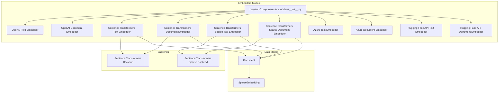
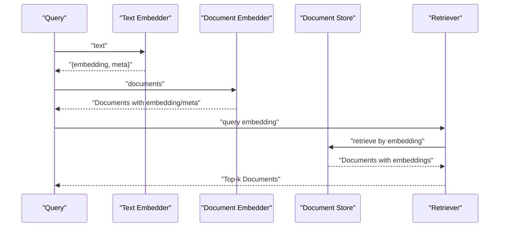
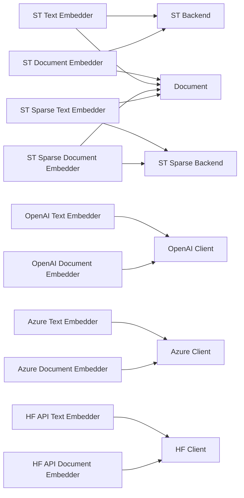

# Embedding Best Practices

<cite>
**Referenced Files in This Document**
- [__init__.py](file://haystack/components/embedders/__init__.py)
- [openai_text_embedder.py](file://haystack/components/embedders/openai_text_embedder.py)
- [sentence_transformers_text_embedder.py](file://haystack/components/embedders/sentence_transformers_text_embedder.py)
- [sentence_transformers_document_embedder.py](file://haystack/components/embedders/sentence_transformers_document_embedder.py)
- [sentence_transformers_sparse_text_embedder.py](file://haystack/components/embedders/sentence_transformers_sparse_text_embedder.py)
- [sentence_transformers_sparse_document_embedder.py](file://haystack/components/embedders/sentence_transformers_sparse_document_embedder.py)
- [azure_text_embedder.py](file://haystack/components/embedders/azure_text_embedder.py)
- [azure_document_embedder.py](file://haystack/components/embedders/azure_document_embedder.py)
- [hugging_face_api_text_embedder.py](file://haystack/components/embedders/hugging_face_api_text_embedder.py)
- [hugging_face_api_document_embedder.py](file://haystack/components/embedders/hugging_face_api_document_embedder.py)
- [sentence_transformers_backend.py](file://haystack/components/embedders/backends/sentence_transformers_backend.py)
- [sentence_transformers_sparse_backend.py](file://haystack/components/embedders/backends/sentence_transformers_sparse_backend.py)
- [document.py](file://haystack/dataclasses/document.py)
- [sparse_embedding.py](file://haystack/dataclasses/sparse_embedding.py)
- [embedders_api.md](file://docs-website/reference/haystack-api/embedders_api.md)
- [optimum.md](file://docs-website/reference/integrations-api/optimum.md)
- [test_pipeline_crash_regular_pipeline_snapshot_is_raised.py](file://test/core/pipeline/test_pipeline_crash_regular_pipeline_snapshot_is_raised.py)
- [hypothetical-document-embeddings-hyde.mdx](file://docs-website/docs/optimization/advanced-rag-techniques/hypothetical-document-embeddings-hyde.mdx)
- [fix-docstrings-normalize-embedding-fd2dba50ba9e51a1.yaml](file://releasenotes/notes/fix-docstrings-normalize-embedding-fd2dba50ba9e51a1.yaml)
- [change-metadata-to-meta-0fada93f04628c79.yaml](file://releasenotes/notes/change-metadata-to-meta-0fada93f04628c79.yaml)
- [patch-1-34479efe3bea0e4f.yaml](file://releasenotes/notes/patch-1-34479efe3bea0e4f.yaml)
- [openai-text-embedder-8f06cf0bf29e6752.yaml](file://releasenotes/notes/openai-text-embedder-8f06cf0bf29e6752.yaml)
</cite>

## Table of Contents
1. [Introduction](#introduction)
2. [Project Structure](#project-structure)
3. [Core Components](#core-components)
4. [Architecture Overview](#architecture-overview)
5. [Detailed Component Analysis](#detailed-component-analysis)
6. [Dependency Analysis](#dependency-analysis)
7. [Performance Considerations](#performance-considerations)
8. [Troubleshooting Guide](#troubleshooting-guide)
9. [Conclusion](#conclusion)
10. [Appendices](#appendices)

## Introduction
This document consolidates embedding best practices in Haystack, focusing on selecting appropriate embedders, assessing embedding quality, managing dimensionality and normalization, optimizing batch processing and memory, handling metadata and filtering, and designing robust pipelines. It synthesizes implementation details from the embedders ecosystem, data models, and release notes to provide actionable guidance for production-grade RAG and retrieval systems.

## Project Structure
Haystack’s embedders are organized under a central module that lazily exposes multiple providers and backends. The embedders support both dense and sparse embeddings, integrate with cloud APIs, and expose consistent interfaces for text and document inputs. Supporting dataclasses define the Document model and sparse embeddings, while documentation and release notes capture normalization behavior, metadata conventions, and reliability improvements.

**Diagram sources**
- [__init__.py](file://haystack/components/embedders/__init__.py#L10-L44)
- [sentence_transformers_text_embedder.py](file://haystack/components/embedders/sentence_transformers_text_embedder.py)
- [sentence_transformers_document_embedder.py](file://haystack/components/embedders/sentence_transformers_document_embedder.py)
- [sentence_transformers_sparse_text_embedder.py](file://haystack/components/embedders/sentence_transformers_sparse_text_embedder.py)
- [sentence_transformers_sparse_document_embedder.py](file://haystack/components/embedders/sentence_transformers_sparse_document_embedder.py)
- [openai_text_embedder.py](file://haystack/components/embedders/openai_text_embedder.py)
- [azure_text_embedder.py](file://haystack/components/embedders/azure_text_embedder.py)
- [hugging_face_api_text_embedder.py](file://haystack/components/embedders/hugging_face_api_text_embedder.py)
- [sentence_transformers_backend.py](file://haystack/components/embedders/backends/sentence_transformers_backend.py)
- [sentence_transformers_sparse_backend.py](file://haystack/components/embedders/backends/sentence_transformers_sparse_backend.py)
- [document.py](file://haystack/dataclasses/document.py#L48-L70)
- [sparse_embedding.py](file://haystack/dataclasses/sparse_embedding.py#L12-L23)

**Section sources**
- [__init__.py](file://haystack/components/embedders/__init__.py#L10-L44)

## Core Components
- Embedder families:
  - OpenAI: text and document variants supporting optional dimensions and usage metadata.
  - Azure OpenAI: text and document variants for enterprise cloud deployments.
  - Hugging Face API: text and document variants leveraging hosted inference.
  - Sentence Transformers: local dense and sparse embedders backed by transformer models.
- Data model:
  - Document supports dense embeddings, sparse embeddings, and arbitrary metadata.
  - SparseEmbedding encapsulates indices/values pairs with validation.
- Normalization and metadata:
  - Release notes confirm normalization behavior via docstrings and API references.
  - Metadata fields renamed consistently to meta across embedders.

Key implementation references:
- OpenAI text embedder run and async run methods, dimensions and usage metadata.
- Sentence Transformers embedders and sparse embedders.
- Azure and Hugging Face API embedders.
- Document and SparseEmbedding dataclasses.

**Section sources**
- [openai_text_embedder.py](file://haystack/components/embedders/openai_text_embedder.py#L172-L204)
- [sentence_transformers_text_embedder.py](file://haystack/components/embedders/sentence_transformers_text_embedder.py)
- [sentence_transformers_document_embedder.py](file://haystack/components/embedders/sentence_transformers_document_embedder.py)
- [sentence_transformers_sparse_text_embedder.py](file://haystack/components/embedders/sentence_transformers_sparse_text_embedder.py)
- [sentence_transformers_sparse_document_embedder.py](file://haystack/components/embedders/sentence_transformers_sparse_document_embedder.py)
- [azure_text_embedder.py](file://haystack/components/embedders/azure_text_embedder.py)
- [azure_document_embedder.py](file://haystack/components/embedders/azure_document_embedder.py)
- [hugging_face_api_text_embedder.py](file://haystack/components/embedders/hugging_face_api_text_embedder.py)
- [hugging_face_api_document_embedder.py](file://haystack/components/embedders/hugging_face_api_document_embedder.py)
- [document.py](file://haystack/dataclasses/document.py#L48-L70)
- [sparse_embedding.py](file://haystack/dataclasses/sparse_embedding.py#L12-L23)
- [fix-docstrings-normalize-embedding-fd2dba50ba9e51a1.yaml](file://releasenotes/notes/fix-docstrings-normalize-embedding-fd2dba50ba9e51a1.yaml#L1-L3)
- [embedders_api.md](file://docs-website/reference/haystack-api/embedders_api.md#L622-L658)
- [embedders_api.md](file://docs-website/reference/haystack-api/embedders_api.md#L1048-L1081)
- [embedders_api.md](file://docs-website/reference/haystack-api/embedders_api.md#L1451-L1482)
- [optimum.md](file://docs-website/reference/integrations-api/optimum.md#L160-L183)
- [optimum.md](file://docs-website/reference/integrations-api/optimum.md#L328-L345)

## Architecture Overview
The embedding pipeline integrates embedders with retrievers and document stores. Embedders produce dense or sparse vectors attached to Documents. Retrievers consume these embeddings for similarity search, optionally filtered by metadata. Backends encapsulate model loading and inference for local embedders.

**Diagram sources**
- [openai_text_embedder.py](file://haystack/components/embedders/openai_text_embedder.py#L172-L204)
- [sentence_transformers_text_embedder.py](file://haystack/components/embedders/sentence_transformers_text_embedder.py)
- [sentence_transformers_document_embedder.py](file://haystack/components/embedders/sentence_transformers_document_embedder.py)
- [document.py](file://haystack/dataclasses/document.py#L48-L70)

## Detailed Component Analysis

### Embedder Selection Criteria
- Use OpenAI embedders for strong out-of-the-box quality and managed scaling; configure dimensions and monitor usage metadata.
- Use Azure embedders for enterprise environments requiring regional compliance and quotas.
- Use Hugging Face API embedders for provider-agnostic access to hosted models.
- Use Sentence Transformers embedders for local control, reproducibility, and customization; choose sparse variants for retrieval efficiency.

Best-practice anchors:
- OpenAI text embedder run method and dimensions parameter.
- Sentence Transformers dense and sparse embedders.
- Azure and Hugging Face API embedders.

**Section sources**
- [openai_text_embedder.py](file://haystack/components/embedders/openai_text_embedder.py#L168-L170)
- [openai_text_embedder.py](file://haystack/components/embedders/openai_text_embedder.py#L172-L204)
- [sentence_transformers_text_embedder.py](file://haystack/components/embedders/sentence_transformers_text_embedder.py)
- [sentence_transformers_document_embedder.py](file://haystack/components/embedders/sentence_transformers_document_embedder.py)
- [sentence_transformers_sparse_text_embedder.py](file://haystack/components/embedders/sentence_transformers_sparse_text_embedder.py)
- [sentence_transformers_sparse_document_embedder.py](file://haystack/components/embedders/sentence_transformers_sparse_document_embedder.py)
- [azure_text_embedder.py](file://haystack/components/embedders/azure_text_embedder.py)
- [azure_document_embedder.py](file://haystack/components/embedders/azure_document_embedder.py)
- [hugging_face_api_text_embedder.py](file://haystack/components/embedders/hugging_face_api_text_embedder.py)
- [hugging_face_api_document_embedder.py](file://haystack/components/embedders/hugging_face_api_document_embedder.py)

### Embedding Quality Assessment
- Normalize embeddings when comparing similarity across models/datasets to ensure fair distance metrics.
- Use standardized evaluation pipelines to measure downstream retrieval effectiveness.
- For hybrid setups, combine dense and sparse embeddings to improve recall and precision trade-offs.

Evidence and references:
- Normalization behavior documented across embedders API references.
- Sparse embeddings supported for efficient retrieval.
- Example of averaging multiple embeddings for hypothetical document embeddings.

**Section sources**
- [embedders_api.md](file://docs-website/reference/haystack-api/embedders_api.md#L622-L658)
- [embedders_api.md](file://docs-website/reference/haystack-api/embedders_api.md#L1048-L1081)
- [embedders_api.md](file://docs-website/reference/haystack-api/embedders_api.md#L1451-L1482)
- [optimum.md](file://docs-website/reference/integrations-api/optimum.md#L160-L183)
- [optimum.md](file://docs-website/reference/integrations-api/optimum.md#L328-L345)
- [sparse_embedding.py](file://haystack/dataclasses/sparse_embedding.py#L12-L23)
- [hypothetical-document-embeddings-hyde.mdx](file://docs-website/docs/optimization/advanced-rag-techniques/hypothetical-document-embeddings-hyde.mdx#L64-L95)

### Dimensionality and Normalization
- Configure embedding dimensions when supported by the provider (e.g., OpenAI).
- Apply L2 normalization to embeddings to constrain vector magnitude for stable similarity computation.
- Prefer sparse embeddings for large vocabularies to reduce memory footprint and improve indexing performance.

**Section sources**
- [openai_text_embedder.py](file://haystack/components/embedders/openai_text_embedder.py#L168-L170)
- [embedders_api.md](file://docs-website/reference/haystack-api/embedders_api.md#L622-L658)
- [embedders_api.md](file://docs-website/reference/haystack-api/embedders_api.md#L1048-L1081)
- [embedders_api.md](file://docs-website/reference/haystack-api/embedders_api.md#L1451-L1482)
- [optimum.md](file://docs-website/reference/integrations-api/optimum.md#L160-L183)
- [optimum.md](file://docs-website/reference/integrations-api/optimum.md#L328-L345)
- [sparse_embedding.py](file://haystack/dataclasses/sparse_embedding.py#L12-L23)

### Batch Processing Optimization and Memory Management
- Batch process multiple texts/documents per embedder call to amortize overhead and maximize throughput.
- Monitor and cap batch sizes to avoid memory pressure; adjust based on model size and hardware constraints.
- For local Sentence Transformers embedders, leverage backend initialization and warm-up patterns to stabilize latency.

**Section sources**
- [sentence_transformers_backend.py](file://haystack/components/embedders/backends/sentence_transformers_backend.py)
- [sentence_transformers_sparse_backend.py](file://haystack/components/embedders/backends/sentence_transformers_sparse_backend.py)

### Metadata Handling and Filtering
- Store metadata in the Document meta field; rename from legacy metadata to meta across embedders.
- Attach metadata alongside embeddings to enable post-retrieval filtering and routing.
- Use consistent metadata keys to facilitate downstream filtering and analytics.

**Section sources**
- [change-metadata-to-meta-0fada93f04628c79.yaml](file://releasenotes/notes/change-metadata-to-meta-0fada93f04628c79.yaml#L1-L6)
- [document.py](file://haystack/dataclasses/document.py#L48-L70)

### Embedding Storage Optimization
- Dense embeddings: store vectors with appropriate numeric precision; consider quantization where supported by the document store.
- Sparse embeddings: store indices/values pairs efficiently; ensure indexing backends support sparse vector operations.
- Attach embeddings to Documents to minimize duplication and maintain referential integrity.

**Section sources**
- [document.py](file://haystack/dataclasses/document.py#L48-L70)
- [sparse_embedding.py](file://haystack/dataclasses/sparse_embedding.py#L12-L23)

### Pipeline Design, Error Handling, and Monitoring
- Design pipelines with clear boundaries between preprocessing, embedding, retrieval, and generation stages.
- Handle partial failures during batch embedding gracefully; log errors and continue processing remaining items.
- Capture pipeline snapshots on exceptions to aid debugging and observability.

**Section sources**
- [patch-1-34479efe3bea0e4f.yaml](file://releasenotes/notes/patch-1-34479efe3bea0e4f.yaml#L1-L5)
- [test_pipeline_crash_regular_pipeline_snapshot_is_raised.py](file://test/core/pipeline/test_pipeline_crash_regular_pipeline_snapshot_is_raised.py#L32-L107)

## Dependency Analysis
Embedders depend on:
- Provider SDKs (OpenAI, Azure, Hugging Face) for remote inference.
- Local model backends (Sentence Transformers) for on-prem inference.
- Document data model for carrying embeddings and metadata.

**Diagram sources**
- [sentence_transformers_text_embedder.py](file://haystack/components/embedders/sentence_transformers_text_embedder.py)
- [sentence_transformers_document_embedder.py](file://haystack/components/embedders/sentence_transformers_document_embedder.py)
- [sentence_transformers_sparse_text_embedder.py](file://haystack/components/embedders/sentence_transformers_sparse_text_embedder.py)
- [sentence_transformers_sparse_document_embedder.py](file://haystack/components/embedders/sentence_transformers_sparse_document_embedder.py)
- [openai_text_embedder.py](file://haystack/components/embedders/openai_text_embedder.py)
- [azure_text_embedder.py](file://haystack/components/embedders/azure_text_embedder.py)
- [hugging_face_api_text_embedder.py](file://haystack/components/embedders/hugging_face_api_text_embedder.py)
- [document.py](file://haystack/dataclasses/document.py#L48-L70)

**Section sources**
- [__init__.py](file://haystack/components/embedders/__init__.py#L10-L44)

## Performance Considerations
- Choose embedder families aligned with your latency and cost targets.
- Normalize embeddings to ensure comparable distances across models.
- Use sparse embeddings for large-scale retrieval to reduce memory and I/O costs.
- Warm up local models and tune batch sizes to balance throughput and latency.
- Monitor provider usage and quota limits; plan for fallbacks and retries.

[No sources needed since this section provides general guidance]

## Troubleshooting Guide
Common pitfalls and remedies:
- Partial batch failures: ensure graceful error handling and continue processing remaining items.
- Metadata mismatch: verify meta vs. metadata conventions and ensure consistent field names.
- Dimension mismatches: confirm configured dimensions match downstream retriever expectations.
- Normalization inconsistencies: align normalization behavior across embedders and retrievers.

Debugging strategies:
- Inspect pipeline snapshots on exceptions to capture intermediate outputs.
- Log provider usage metadata for cost and rate-limit visibility.
- Validate embedding shapes and norms before retrieval.

**Section sources**
- [patch-1-34479efe3bea0e4f.yaml](file://releasenotes/notes/patch-1-34479efe3bea0e4f.yaml#L1-L5)
- [change-metadata-to-meta-0fada93f04628c79.yaml](file://releasenotes/notes/change-metadata-to-meta-0fada93f04628c79.yaml#L1-L6)
- [openai_text_embedder.py](file://haystack/components/embedders/openai_text_embedder.py#L168-L170)
- [test_pipeline_crash_regular_pipeline_snapshot_is_raised.py](file://test/core/pipeline/test_pipeline_crash_regular_pipeline_snapshot_is_raised.py#L32-L107)

## Conclusion
Selecting the right embedder depends on accuracy, latency, budget, and operational constraints. Normalize embeddings, manage metadata consistently, and optimize batch processing and memory usage. Use sparse embeddings where feasible, and design resilient pipelines with clear error handling and monitoring. Align provider capabilities with downstream retrieval and evaluation to achieve robust, scalable systems.

[No sources needed since this section summarizes without analyzing specific files]

## Appendices

### Case Studies and Real-World Examples
- Hybrid dense-sparse retrieval: Combine dense embeddings with sparse representations to improve recall and precision.
- Hypothetical document embeddings: Aggregate multiple embeddings to synthesize a representative vector for improved retrieval stability.

**Section sources**
- [hypothetical-document-embeddings-hyde.mdx](file://docs-website/docs/optimization/advanced-rag-techniques/hypothetical-document-embeddings-hyde.mdx#L64-L95)

### Embedder Feature Highlights
- OpenAI embedders: optional dimensions and usage metadata.
- Sentence Transformers: dense and sparse variants with backend-backed inference.
- Azure and Hugging Face API: cloud-hosted inference with provider-specific configuration.

**Section sources**
- [openai-text-embedder-8f06cf0bf29e6752.yaml](file://releasenotes/notes/openai-text-embedder-8f06cf0bf29e6752.yaml#L1-L5)
- [openai_text_embedder.py](file://haystack/components/embedders/openai_text_embedder.py#L168-L170)
- [sentence_transformers_text_embedder.py](file://haystack/components/embedders/sentence_transformers_text_embedder.py)
- [sentence_transformers_sparse_text_embedder.py](file://haystack/components/embedders/sentence_transformers_sparse_text_embedder.py)
- [azure_text_embedder.py](file://haystack/components/embedders/azure_text_embedder.py)
- [hugging_face_api_text_embedder.py](file://haystack/components/embedders/hugging_face_api_text_embedder.py)