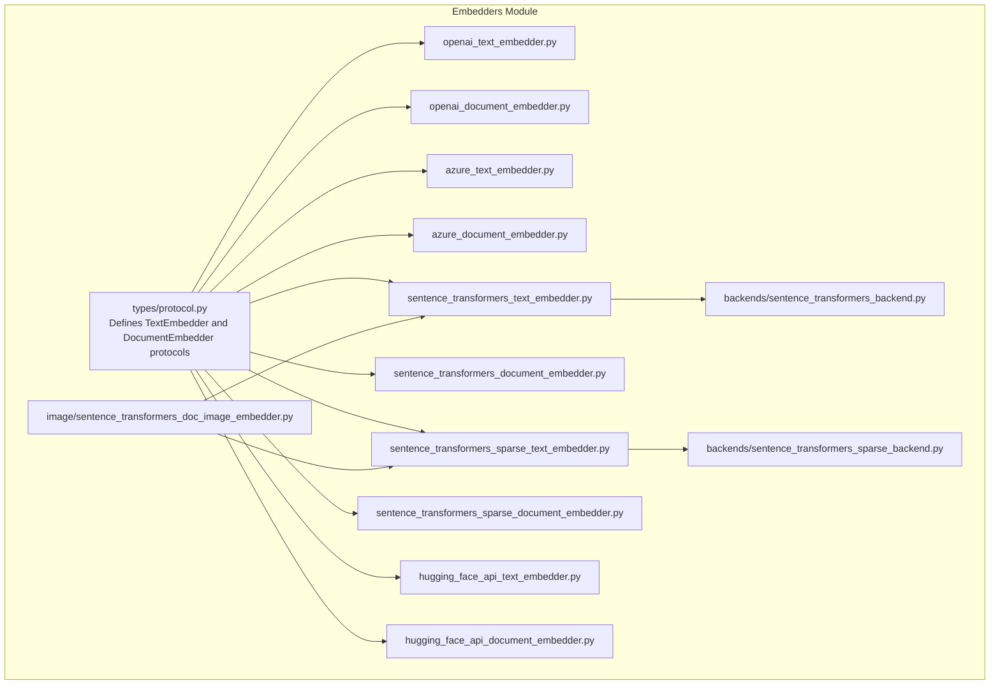
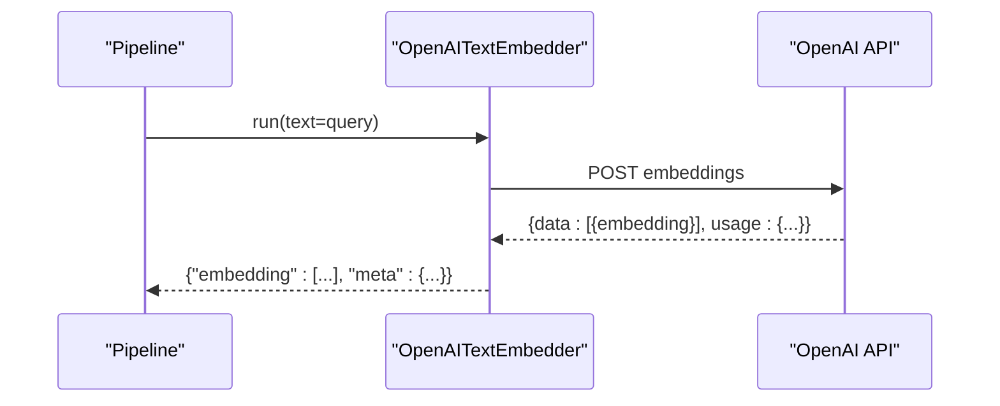
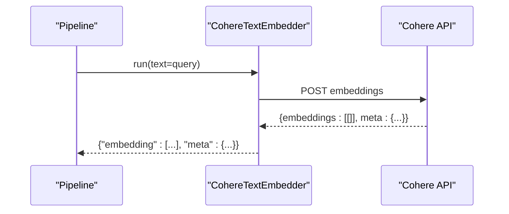
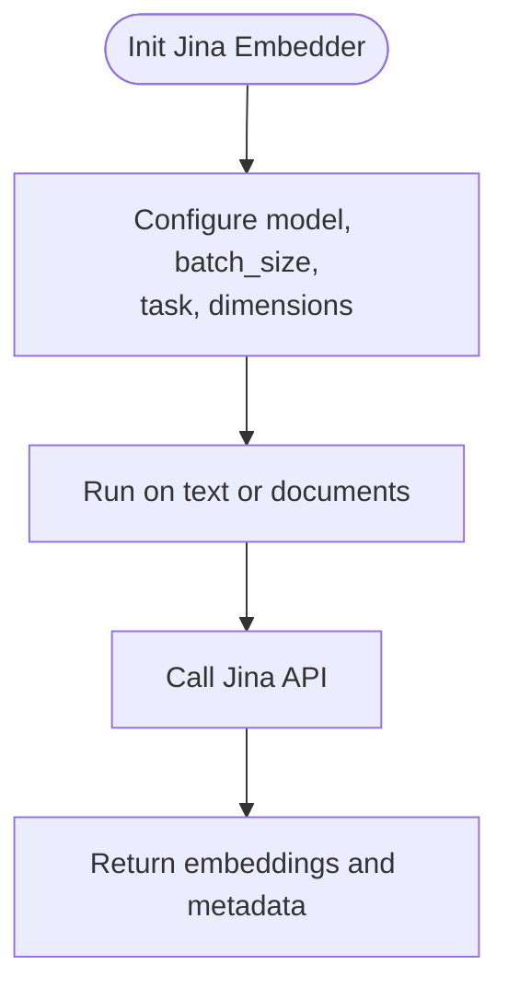
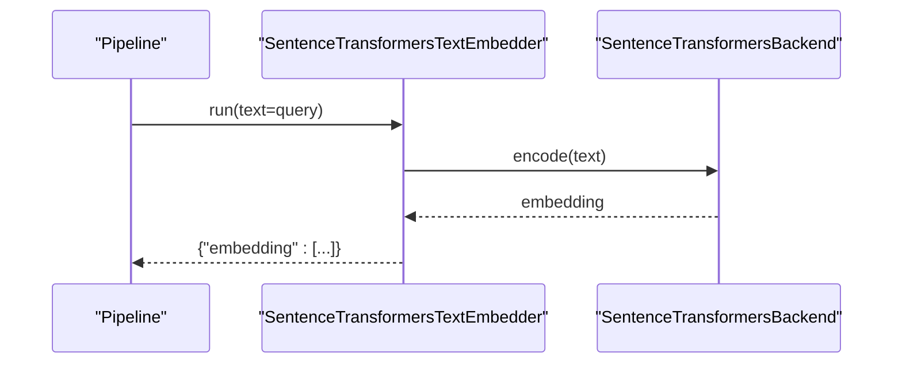
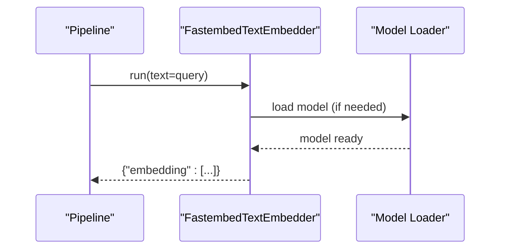
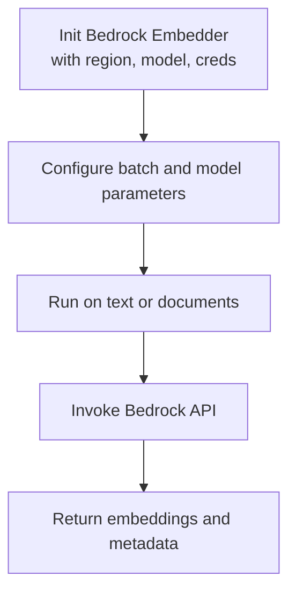
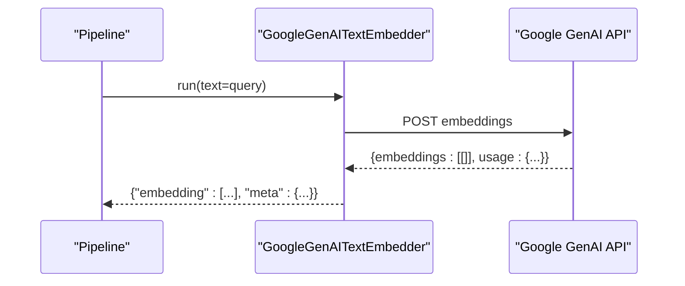
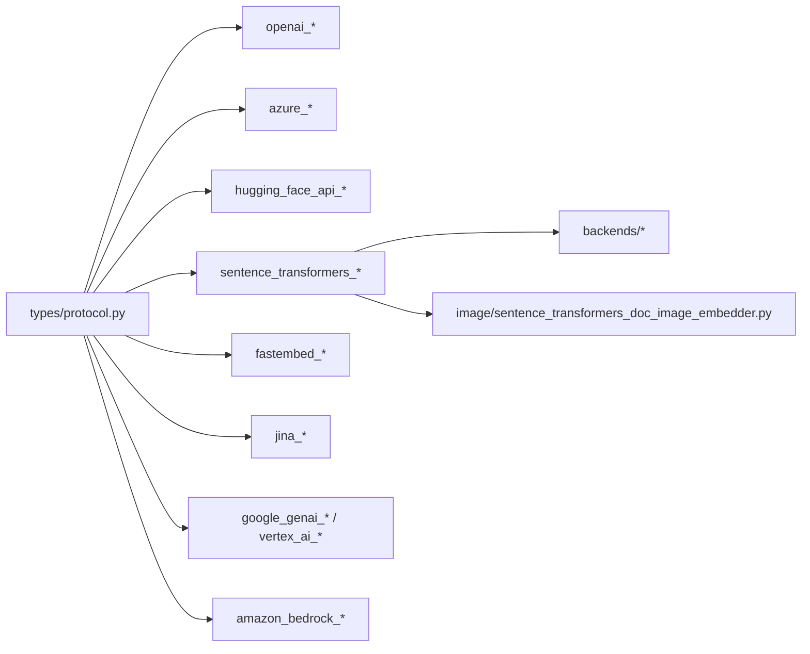

# Text Embedders

<cite>
**Referenced Files in This Document**
- [haystack/components/embedders/__init__.py](file://haystack/components/embedders/__init__.py)
- [haystack/components/embedders/types/protocol.py](file://haystack/components/embedders/types/protocol.py)
- [haystack/components/embedders/openai_text_embedder.py](file://haystack/components/embedders/openai_text_embedder.py)
- [haystack/components/embedders/openai_document_embedder.py](file://haystack/components/embedders/openai_document_embedder.py)
- [haystack/components/embedders/azure_text_embedder.py](file://haystack/components/embedders/azure_text_embedder.py)
- [haystack/components/embedders/azure_document_embedder.py](file://haystack/components/embedders/azure_document_embedder.py)
- [haystack/components/embedders/sentence_transformers_text_embedder.py](file://haystack/components/embedders/sentence_transformers_text_embedder.py)
- [haystack/components/embedders/sentence_transformers_document_embedder.py](file://haystack/components/embedders/sentence_transformers_document_embedder.py)
- [haystack/components/embedders/sentence_transformers_sparse_text_embedder.py](file://haystack/components/embedders/sentence_transformers_sparse_text_embedder.py)
- [haystack/components/embedders/sentence_transformers_sparse_document_embedder.py](file://haystack/components/embedders/sentence_transformers_sparse_document_embedder.py)
- [haystack/components/embedders/backends/sentence_transformers_backend.py](file://haystack/components/embedders/backends/sentence_transformers_backend.py)
- [haystack/components/embedders/backends/sentence_transformers_sparse_backend.py](file://haystack/components/embedders/backends/sentence_transformers_sparse_backend.py)
- [haystack/components/embedders/image/sentence_transformers_doc_image_embedder.py](file://haystack/components/embedders/image/sentence_transformers_doc_image_embedder.py)
- [haystack/components/embedders/hugging_face_api_text_embedder.py](file://haystack/components/embedders/hugging_face_api_text_embedder.py)
- [haystack/components/embedders/hugging_face_api_document_embedder.py](file://haystack/components/embedders/hugging_face_api_document_embedder.py)
- [docs-website/docs/pipeline-components/embedders/fastembeddocumentembedder.mdx](file://docs-website/docs/pipeline-components/embedders/fastembeddocumentembedder.mdx)
- [docs-website/docs/pipeline-components/embedders/fastembedtextembedder.mdx](file://docs-website/docs/pipeline-components/embedders/fastembedtextembedder.mdx)
- [docs-website/reference/integrations-api/jina.md](file://docs-website/reference/integrations-api/jina.md)
- [docs-website/versioned_docs/version-2.25/pipeline-components/embedders/coheredocumentembedder.mdx](file://docs-website/versioned_docs/version-2.25/pipeline-components/embedders/coheredocumentembedder.mdx)
- [docs-website/versioned_docs/version-2.25/pipeline-components/embedders/googlegenaitextembedder.mdx](file://docs-website/versioned_docs/version-2.25/pipeline-components/embedders/googlegenaitextembedder.mdx)
- [docs-website/versioned_docs/version-2.18/pipeline-components/embedders/vertexaidocumentembedder.mdx](file://docs-website/versioned_docs/version-2.18/pipeline-components/embedders/vertexaidocumentembedder.mdx)
- [docs-website/reference_versioned_docs/version-2.24/integrations-api/amazon_bedrock.md](file://docs-website/reference_versioned_docs/version-2.24/integrations-api/amazon_bedrock.md)
</cite>

## Table of Contents
1. [Introduction](#introduction)
2. [Project Structure](#project-structure)
3. [Core Components](#core-components)
4. [Architecture Overview](#architecture-overview)
5. [Detailed Component Analysis](#detailed-component-analysis)
6. [Dependency Analysis](#dependency-analysis)
7. [Performance Considerations](#performance-considerations)
8. [Troubleshooting Guide](#troubleshooting-guide)
9. [Conclusion](#conclusion)
10. [Appendices](#appendices)

## Introduction
This document explains Haystack’s text embedder ecosystem: the common interface, provider implementations, invocation patterns, and practical configuration for building retrieval pipelines. It covers both built-in local embedders and external provider integrations, including OpenAI, Azure OpenAI, Cohere, Jina, Mistral, NVIDIA, Ollama, Sentence Transformers, FastEmbed, Optimum, Amazon Bedrock, Google GenAI, Vertex AI, Watsonx, and StackIT. For each provider, we summarize input parameters (text, documents, batch processing), embedding dimensions, normalization options, output formats, and typical pipeline usage. We also provide guidance on performance, batching, memory, and selection criteria based on accuracy, latency, and cost.

## Project Structure
Haystack organizes embedders under a dedicated module with a shared protocol and backend abstractions. The public API exposes embedders grouped by provider and capability (text vs document). A protocol defines the common interface for all embedders.

**Diagram sources**
- [haystack/components/embedders/types/protocol.py](file://haystack/components/embedders/types/protocol.py#L1-L60)
- [haystack/components/embedders/openai_text_embedder.py](file://haystack/components/embedders/openai_text_embedder.py#L1-L200)
- [haystack/components/embedders/openai_document_embedder.py](file://haystack/components/embedders/openai_document_embedder.py#L1-L200)
- [haystack/components/embedders/azure_text_embedder.py](file://haystack/components/embedders/azure_text_embedder.py#L1-L200)
- [haystack/components/embedders/azure_document_embedder.py](file://haystack/components/embedders/azure_document_embedder.py#L1-L200)
- [haystack/components/embedders/sentence_transformers_text_embedder.py](file://haystack/components/embedders/sentence_transformers_text_embedder.py#L1-L200)
- [haystack/components/embedders/sentence_transformers_document_embedder.py](file://haystack/components/embedders/sentence_transformers_document_embedder.py#L1-L200)
- [haystack/components/embedders/sentence_transformers_sparse_text_embedder.py](file://haystack/components/embedders/sentence_transformers_sparse_text_embedder.py#L1-L200)
- [haystack/components/embedders/sentence_transformers_sparse_document_embedder.py](file://haystack/components/embedders/sentence_transformers_sparse_document_embedder.py#L1-L200)
- [haystack/components/embedders/backends/sentence_transformers_backend.py](file://haystack/components/embedders/backends/sentence_transformers_backend.py#L1-L200)
- [haystack/components/embedders/backends/sentence_transformers_sparse_backend.py](file://haystack/components/embedders/backends/sentence_transformers_sparse_backend.py#L1-L200)
- [haystack/components/embedders/image/sentence_transformers_doc_image_embedder.py](file://haystack/components/embedders/image/sentence_transformers_doc_image_embedder.py#L1-L200)
- [haystack/components/embedders/hugging_face_api_text_embedder.py](file://haystack/components/embedders/hugging_face_api_text_embedder.py#L1-L200)
- [haystack/components/embedders/hugging_face_api_document_embedder.py](file://haystack/components/embedders/hugging_face_api_document_embedder.py#L1-L200)

**Section sources**
- [haystack/components/embedders/__init__.py](file://haystack/components/embedders/__init__.py#L1-L200)
- [haystack/components/embedders/types/protocol.py](file://haystack/components/embedders/types/protocol.py#L1-L60)

## Core Components
The embedder protocol defines two primary capabilities:
- TextEmbedder: produces a single embedding vector from a text string.
- DocumentEmbedder: produces embeddings for one or more Documents, often combining text and metadata.

Key common parameters across providers include:
- Input: text (single string) or documents (list of Documents)
- Batch processing: configurable batch size
- Output: embedding(s) and optional metadata (provider-dependent)
- Dimensions: model-specific; some providers support explicit dimension overrides
- Normalization: optional vector normalization depending on provider/model

Typical pipeline roles:
- Indexing pipeline: DocumentEmbedder writes embeddings into a document store
- Query pipeline: TextEmbedder converts queries into embeddings for retrieval

**Section sources**
- [haystack/components/embedders/types/protocol.py](file://haystack/components/embedders/types/protocol.py#L1-L60)

## Architecture Overview
The embedder ecosystem follows a layered design:
- Protocol layer: shared interface contracts
- Provider implementations: per-provider logic for authentication, request shaping, and response parsing
- Backends: local model backends (e.g., Sentence Transformers) and optional sparse variants
- Integrations: third-party APIs (OpenAI, Cohere, Jina, Google GenAI/Vertex, Amazon Bedrock)

```mermaid
classDiagram
class TextEmbedder {
+run(text) dict
}
class DocumentEmbedder {
+run(documents) dict
}
class OpenAITextEmbedder {
+run(text) dict
}
class OpenAIDocumentEmbedder {
+run(documents) dict
}
class AzureOpenAITextEmbedder {
+run(text) dict
}
class AzureOpenAIDocumentEmbedder {
+run(documents) dict
}
class SentenceTransformersTextEmbedder {
+run(text) dict
}
class SentenceTransformersDocumentEmbedder {
+run(documents) dict
}
class SentenceTransformersSparseTextEmbedder {
+run(text) dict
}
class SentenceTransformersSparseDocumentEmbedder {
+run(documents) dict
}
class HuggingFaceAPITextEmbedder {
+run(text) dict
}
class HuggingFaceAPIDocumentEmbedder {
+run(documents) dict
}
TextEmbedder <|.. OpenAITextEmbedder
DocumentEmbedder <|.. OpenAIDocumentEmbedder
TextEmbedder <|.. AzureOpenAITextEmbedder
DocumentEmbedder <|.. AzureOpenAIDocumentEmbedder
TextEmbedder <|.. SentenceTransformersTextEmbedder
DocumentEmbedder <|.. SentenceTransformersDocumentEmbedder
TextEmbedder <|.. SentenceTransformersSparseTextEmbedder
DocumentEmbedder <|.. SentenceTransformersSparseDocumentEmbedder
TextEmbedder <|.. HuggingFaceAPITextEmbedder
DocumentEmbedder <|.. HuggingFaceAPIDocumentEmbedder
```

**Diagram sources**
- [haystack/components/embedders/types/protocol.py](file://haystack/components/embedders/types/protocol.py#L1-L60)
- [haystack/components/embedders/openai_text_embedder.py](file://haystack/components/embedders/openai_text_embedder.py#L1-L200)
- [haystack/components/embedders/openai_document_embedder.py](file://haystack/components/embedders/openai_document_embedder.py#L1-L200)
- [haystack/components/embedders/azure_text_embedder.py](file://haystack/components/embedders/azure_text_embedder.py#L1-L200)
- [haystack/components/embedders/azure_document_embedder.py](file://haystack/components/embedders/azure_document_embedder.py#L1-L200)
- [haystack/components/embedders/sentence_transformers_text_embedder.py](file://haystack/components/embedders/sentence_transformers_text_embedder.py#L1-L200)
- [haystack/components/embedders/sentence_transformers_document_embedder.py](file://haystack/components/embedders/sentence_transformers_document_embedder.py#L1-L200)
- [haystack/components/embedders/sentence_transformers_sparse_text_embedder.py](file://haystack/components/embedders/sentence_transformers_sparse_text_embedder.py#L1-L200)
- [haystack/components/embedders/sentence_transformers_sparse_document_embedder.py](file://haystack/components/embedders/sentence_transformers_sparse_document_embedder.py#L1-L200)
- [haystack/components/embedders/hugging_face_api_text_embedder.py](file://haystack/components/embedders/hugging_face_api_text_embedder.py#L1-L200)
- [haystack/components/embedders/hugging_face_api_document_embedder.py](file://haystack/components/embedders/hugging_face_api_document_embedder.py#L1-L200)

## Detailed Component Analysis

### OpenAI and Azure OpenAI
- OpenAI Text Embedder
  - Inputs: text (string)
  - Batch: handled internally by provider SDK
  - Dimensions: model-specific; some models allow specifying dimensions
  - Normalization: depends on model; consult provider documentation
  - Authentication: API key via environment or constructor
  - Typical usage: convert query text to embedding for retrieval
- OpenAI Document Embedder
  - Inputs: documents (list)
  - Batch: handled internally by provider SDK
  - Dimensions: model-specific
  - Normalization: depends on model
  - Authentication: API key via environment or constructor
  - Typical usage: embed indexed documents and write to document store

- Azure OpenAI
  - Same interface as OpenAI but targets Azure endpoints
  - Additional configuration: resource name, deployment name, API version
  - Authentication: Azure credentials and API key
  - Typical usage identical to OpenAI variants

**Diagram sources**
- [haystack/components/embedders/openai_text_embedder.py](file://haystack/components/embedders/openai_text_embedder.py#L1-L200)
- [haystack/components/embedders/openai_document_embedder.py](file://haystack/components/embedders/openai_document_embedder.py#L1-L200)
- [haystack/components/embedders/azure_text_embedder.py](file://haystack/components/embedders/azure_text_embedder.py#L1-L200)
- [haystack/components/embedders/azure_document_embedder.py](file://haystack/components/embedders/azure_document_embedder.py#L1-L200)

**Section sources**
- [haystack/components/embedders/openai_text_embedder.py](file://haystack/components/embedders/openai_text_embedder.py#L1-L200)
- [haystack/components/embedders/openai_document_embedder.py](file://haystack/components/embedders/openai_document_embedder.py#L1-L200)
- [haystack/components/embedders/azure_text_embedder.py](file://haystack/components/embedders/azure_text_embedder.py#L1-L200)
- [haystack/components/embedders/azure_document_embedder.py](file://haystack/components/embedders/azure_document_embedder.py#L1-L200)

### Cohere
- Cohere Text Embedder and Document Embedder
  - Inputs: text or documents
  - Batch: supports batch processing
  - Dimensions: model-specific
  - Normalization: depends on model
  - Authentication: API key via environment or constructor
  - Typical usage: embed documents for indexing and queries for retrieval

**Diagram sources**
- [docs-website/versioned_docs/version-2.25/pipeline-components/embedders/coheredocumentembedder.mdx](file://docs-website/versioned_docs/version-2.25/pipeline-components/embedders/coheredocumentembedder.mdx#L87-L135)

**Section sources**
- [docs-website/versioned_docs/version-2.25/pipeline-components/embedders/coheredocumentembedder.mdx](file://docs-website/versioned_docs/version-2.25/pipeline-components/embedders/coheredocumentembedder.mdx#L87-L135)

### Jina
- Jina Text Embedder and Document Embedder
  - Inputs: text or documents
  - Batch: configurable batch size
  - Model: defaults to a multimodal embedding model
  - Task and dimensions: optional parameters
  - Authentication: API key via environment or constructor
  - Typical usage: embed documents and queries for retrieval

**Diagram sources**
- [docs-website/reference/integrations-api/jina.md](file://docs-website/reference/integrations-api/jina.md#L144-L160)

**Section sources**
- [docs-website/reference/integrations-api/jina.md](file://docs-website/reference/integrations-api/jina.md#L144-L160)

### Mistral, NVIDIA, Ollama
- These providers are integrated via Haystack Integrations and expose TextEmbedder and DocumentEmbedder components.
- Inputs: text or documents
- Batch: configurable
- Dimensions: model-specific
- Normalization: model-specific
- Authentication: provider-specific keys/secrets
- Typical usage: embed documents for indexing and queries for retrieval

[No sources needed since this section summarizes integrations without analyzing specific files]

### Sentence Transformers (Local)
- SentenceTransformers Text Embedder and Document Embedder
  - Inputs: text or documents
  - Backend: local model via Sentence Transformers
  - Sparse variants available for retrieval efficiency
  - Batch: configurable
  - Dimensions: model-specific
  - Normalization: optional via backend
  - Typical usage: local inference for privacy and latency

**Diagram sources**
- [haystack/components/embedders/sentence_transformers_text_embedder.py](file://haystack/components/embedders/sentence_transformers_text_embedder.py#L1-L200)
- [haystack/components/embedders/backends/sentence_transformers_backend.py](file://haystack/components/embedders/backends/sentence_transformers_backend.py#L1-L200)

**Section sources**
- [haystack/components/embedders/sentence_transformers_text_embedder.py](file://haystack/components/embedders/sentence_transformers_text_embedder.py#L1-L200)
- [haystack/components/embedders/sentence_transformers_document_embedder.py](file://haystack/components/embedders/sentence_transformers_document_embedder.py#L1-L200)
- [haystack/components/embedders/backends/sentence_transformers_backend.py](file://haystack/components/embedders/backends/sentence_transformers_backend.py#L1-L200)
- [haystack/components/embedders/sentence_transformers_sparse_text_embedder.py](file://haystack/components/embedders/sentence_transformers_sparse_text_embedder.py#L1-L200)
- [haystack/components/embedders/sentence_transformers_sparse_document_embedder.py](file://haystack/components/embedders/sentence_transformers_sparse_document_embedder.py#L1-L200)
- [haystack/components/embedders/backends/sentence_transformers_sparse_backend.py](file://haystack/components/embedders/backends/sentence_transformers_sparse_backend.py#L1-L200)

### FastEmbed (Local)
- FastEmbed Text Embedder and Document Embedder
  - Inputs: text or documents
  - Backend: optimized local models
  - Batch: configurable
  - Warm-up: optional model loading step
  - Dimensions: model-specific
  - Normalization: model-specific
  - Typical usage: fast local embeddings for low-latency scenarios

**Diagram sources**
- [docs-website/docs/pipeline-components/embedders/fastembedtextembedder.mdx](file://docs-website/docs/pipeline-components/embedders/fastembedtextembedder.mdx#L91-L128)
- [docs-website/docs/pipeline-components/embedders/fastembeddocumentembedder.mdx](file://docs-website/docs/pipeline-components/embedders/fastembeddocumentembedder.mdx#L87-L135)

**Section sources**
- [docs-website/docs/pipeline-components/embedders/fastembedtextembedder.mdx](file://docs-website/docs/pipeline-components/embedders/fastembedtextembedder.mdx#L91-L128)
- [docs-website/docs/pipeline-components/embedders/fastembeddocumentembedder.mdx](file://docs-website/docs/pipeline-components/embedders/fastembeddocumentembedder.mdx#L87-L135)

### Optimum (Local)
- Optimum-backed embedders enable ONNX/OpenVINO acceleration for local inference.
- Inputs: text or documents
- Backend: model compiled via Optimum
- Batch: configurable
- Dimensions: model-specific
- Normalization: model-specific
- Typical usage: efficient local inference on CPU/GPU

[No sources needed since this section provides general guidance]

### Amazon Bedrock
- Amazon Bedrock Text Embedder and Document Embedder
  - Inputs: text or documents
  - Batch: handled by provider
  - Authentication: AWS credentials via environment or constructor
  - Region and model: required parameters
  - Typical usage: cloud-hosted embeddings with enterprise-grade SLAs

**Diagram sources**
- [docs-website/reference_versioned_docs/version-2.24/integrations-api/amazon_bedrock.md](file://docs-website/reference_versioned_docs/version-2.24/integrations-api/amazon_bedrock.md#L344-L348)

**Section sources**
- [docs-website/reference_versioned_docs/version-2.24/integrations-api/amazon_bedrock.md](file://docs-website/reference_versioned_docs/version-2.24/integrations-api/amazon_bedrock.md#L344-L348)

### Google GenAI and Vertex AI
- Google GenAI Text Embedder and Document Embedder
  - Inputs: text or documents
  - Batch: handled by provider
  - Authentication: API key via environment or constructor
  - Model: provider-specific model names
  - Typical usage: embeddings via Google AI/Vertex
- Vertex AI Text Embedder and Document Embedder
  - Inputs: text or documents
  - Batch: handled by provider
  - Authentication: service account or environment credentials
  - Model: provider-specific model names
  - Typical usage: enterprise Vertex AI embeddings

**Diagram sources**
- [docs-website/versioned_docs/version-2.25/pipeline-components/embedders/googlegenaitextembedder.mdx](file://docs-website/versioned_docs/version-2.25/pipeline-components/embedders/googlegenaitextembedder.mdx#L85-L126)

**Section sources**
- [docs-website/versioned_docs/version-2.25/pipeline-components/embedders/googlegenaitextembedder.mdx](file://docs-website/versioned_docs/version-2.25/pipeline-components/embedders/googlegenaitextembedder.mdx#L85-L126)
- [docs-website/versioned_docs/version-2.18/pipeline-components/embedders/vertexaidocumentembedder.mdx](file://docs-website/versioned_docs/version-2.18/pipeline-components/embedders/vertexaidocumentembedder.mdx#L72-L118)

### Watsonx and StackIT
- These providers are integrated via Haystack Integrations and expose TextEmbedder and DocumentEmbedder components.
- Inputs: text or documents
- Batch: configurable
- Dimensions: model-specific
- Normalization: model-specific
- Authentication: provider-specific keys/secrets
- Typical usage: embed documents and queries for retrieval

[No sources needed since this section summarizes integrations without analyzing specific files]

## Dependency Analysis
Embedder implementations depend on:
- Protocol contracts for consistent interfaces
- Provider SDKs or HTTP clients for remote APIs
- Local backends (Sentence Transformers, FastEmbed, Optimum) for on-prem inference
- Optional image embedding backends for multimodal scenarios

**Diagram sources**
- [haystack/components/embedders/types/protocol.py](file://haystack/components/embedders/types/protocol.py#L1-L60)
- [haystack/components/embedders/openai_text_embedder.py](file://haystack/components/embedders/openai_text_embedder.py#L1-L200)
- [haystack/components/embedders/openai_document_embedder.py](file://haystack/components/embedders/openai_document_embedder.py#L1-L200)
- [haystack/components/embedders/azure_text_embedder.py](file://haystack/components/embedders/azure_text_embedder.py#L1-L200)
- [haystack/components/embedders/azure_document_embedder.py](file://haystack/components/embedders/azure_document_embedder.py#L1-L200)
- [haystack/components/embedders/hugging_face_api_text_embedder.py](file://haystack/components/embedders/hugging_face_api_text_embedder.py#L1-L200)
- [haystack/components/embedders/hugging_face_api_document_embedder.py](file://haystack/components/embedders/hugging_face_api_document_embedder.py#L1-L200)
- [haystack/components/embedders/sentence_transformers_text_embedder.py](file://haystack/components/embedders/sentence_transformers_text_embedder.py#L1-L200)
- [haystack/components/embedders/backends/sentence_transformers_backend.py](file://haystack/components/embedders/backends/sentence_transformers_backend.py#L1-L200)
- [haystack/components/embedders/image/sentence_transformers_doc_image_embedder.py](file://haystack/components/embedders/image/sentence_transformers_doc_image_embedder.py#L1-L200)
- [haystack/components/embedders/sentence_transformers_sparse_text_embedder.py](file://haystack/components/embedders/sentence_transformers_sparse_text_embedder.py#L1-L200)
- [haystack/components/embedders/backends/sentence_transformers_sparse_backend.py](file://haystack/components/embedders/backends/sentence_transformers_sparse_backend.py#L1-L200)
- [docs-website/docs/pipeline-components/embedders/fastembedtextembedder.mdx](file://docs-website/docs/pipeline-components/embedders/fastembedtextembedder.mdx#L91-L128)
- [docs-website/reference/integrations-api/jina.md](file://docs-website/reference/integrations-api/jina.md#L144-L160)
- [docs-website/versioned_docs/version-2.25/pipeline-components/embedders/googlegenaitextembedder.mdx](file://docs-website/versioned_docs/version-2.25/pipeline-components/embedders/googlegenaitextembedder.mdx#L85-L126)
- [docs-website/versioned_docs/version-2.18/pipeline-components/embedders/vertexaidocumentembedder.mdx](file://docs-website/versioned_docs/version-2.18/pipeline-components/embedders/vertexaidocumentembedder.mdx#L72-L118)
- [docs-website/reference_versioned_docs/version-2.24/integrations-api/amazon_bedrock.md](file://docs-website/reference_versioned_docs/version-2.24/integrations-api/amazon_bedrock.md#L344-L348)

**Section sources**
- [haystack/components/embedders/__init__.py](file://haystack/components/embedders/__init__.py#L1-L200)
- [haystack/components/embedders/types/protocol.py](file://haystack/components/embedders/types/protocol.py#L1-L60)

## Performance Considerations
- Batch size optimization
  - Increase batch_size for throughput; tune based on provider limits and memory
  - Remote providers: respect rate limits and backoff policies
  - Local providers: balance batch size against GPU/CPU memory
- Latency
  - Local embedders (Sentence Transformers, FastEmbed, Optimum) reduce network latency
  - Cloud providers may introduce latency; consider warm-up and connection pooling
- Memory usage
  - Large batch sizes and high-dimensional embeddings increase memory footprint
  - Sparse embeddings can reduce memory and improve recall efficiency
- Normalization
  - Some providers normalize embeddings; ensure downstream similarity computation aligns
- Cost
  - Remote providers charge per token or request; monitor usage and set quotas
  - Local providers eliminate per-request costs but require hardware investment

[No sources needed since this section provides general guidance]

## Troubleshooting Guide
- Authentication failures
  - Verify API keys/secrets are set in environment variables or passed to constructors
  - For Azure and AWS, confirm endpoint URLs, regions, and deployment names
- Rate limits and throttling
  - Implement retries with exponential backoff
  - Reduce batch size or spread workload over time
- Dimension mismatches
  - Ensure document store embedding dimension matches embedder output
  - Some providers allow overriding dimensions; validate model compatibility
- Local model loading
  - For FastEmbed and Sentence Transformers, pre-warm models to avoid cold-start latency
- Network errors
  - Check proxy/firewall settings; ensure outbound access to provider endpoints

[No sources needed since this section provides general guidance]

## Conclusion
Haystack’s embedder ecosystem offers a unified interface across many providers and modalities. Choose local embedders for privacy and latency, and cloud providers for scale and managed infrastructure. Select models and dimensions based on retrieval quality, and optimize batch size and memory to meet performance goals. Monitor provider usage to control costs and plan capacity accordingly.

[No sources needed since this section summarizes without analyzing specific files]

## Appendices

### Practical Pipeline Examples
- Cohere indexing and query pipelines
  - Index documents with Cohere Document Embedder
  - Convert queries with Cohere Text Embedder and retrieve top-matching documents
- FastEmbed indexing and query pipelines
  - Use FastEmbed Document Embedder and Text Embedder in the same pattern
- OpenAI/Azure OpenAI pipelines
  - Similar to Cohere; swap provider components while keeping the same pipeline structure
- Jina pipelines
  - Configure model, batch size, and optional dimensions; embed and retrieve as above
- Google GenAI/Vertex AI pipelines
  - Set API keys and model names; embed and retrieve similarly
- Amazon Bedrock pipelines
  - Configure AWS credentials and region; embed and retrieve as above

**Section sources**
- [docs-website/versioned_docs/version-2.25/pipeline-components/embedders/coheredocumentembedder.mdx](file://docs-website/versioned_docs/version-2.25/pipeline-components/embedders/coheredocumentembedder.mdx#L87-L135)
- [docs-website/docs/pipeline-components/embedders/fastembedtextembedder.mdx](file://docs-website/docs/pipeline-components/embedders/fastembedtextembedder.mdx#L91-L128)
- [docs-website/docs/pipeline-components/embedders/fastembeddocumentembedder.mdx](file://docs-website/docs/pipeline-components/embedders/fastembeddocumentembedder.mdx#L87-L135)
- [docs-website/versioned_docs/version-2.25/pipeline-components/embedders/googlegenaitextembedder.mdx](file://docs-website/versioned_docs/version-2.25/pipeline-components/embedders/googlegenaitextembedder.mdx#L85-L126)
- [docs-website/versioned_docs/version-2.18/pipeline-components/embedders/vertexaidocumentembedder.mdx](file://docs-website/versioned_docs/version-2.18/pipeline-components/embedders/vertexaidocumentembedder.mdx#L72-L118)
- [docs-website/reference_versioned_docs/version-2.24/integrations-api/amazon_bedrock.md](file://docs-website/reference_versioned_docs/version-2.24/integrations-api/amazon_bedrock.md#L344-L348)
- [docs-website/reference/integrations-api/jina.md](file://docs-website/reference/integrations-api/jina.md#L144-L160)