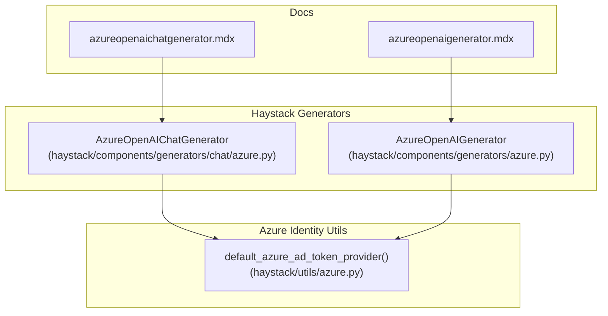
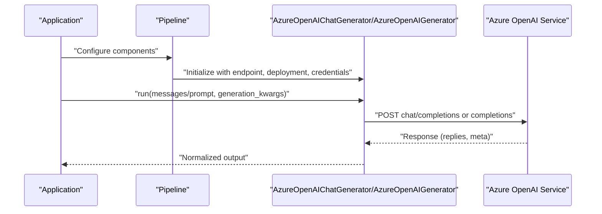
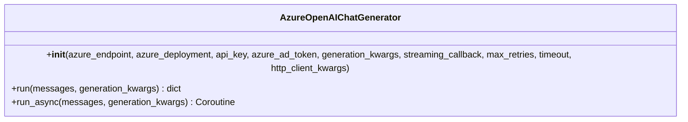
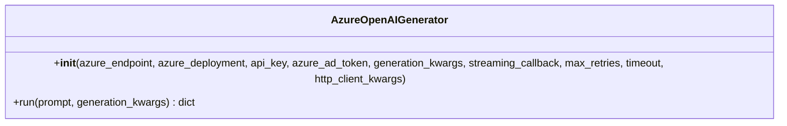
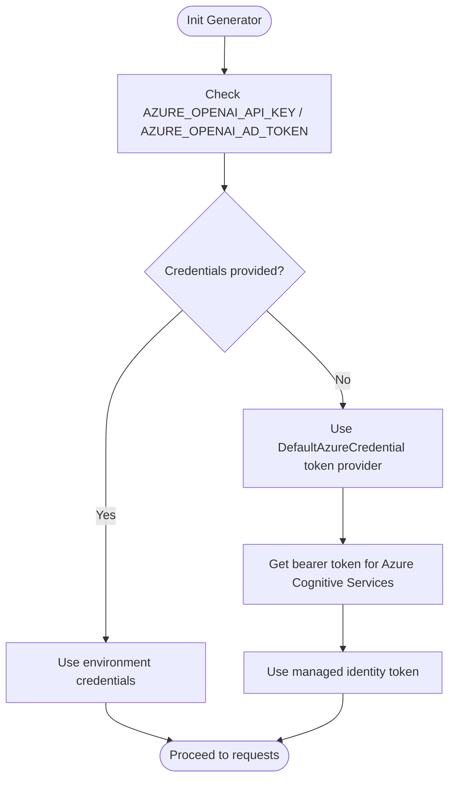
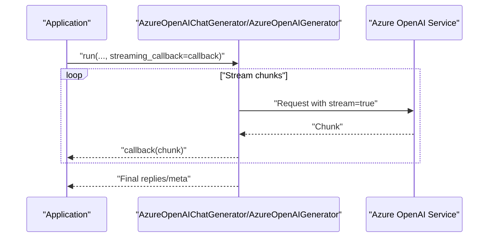
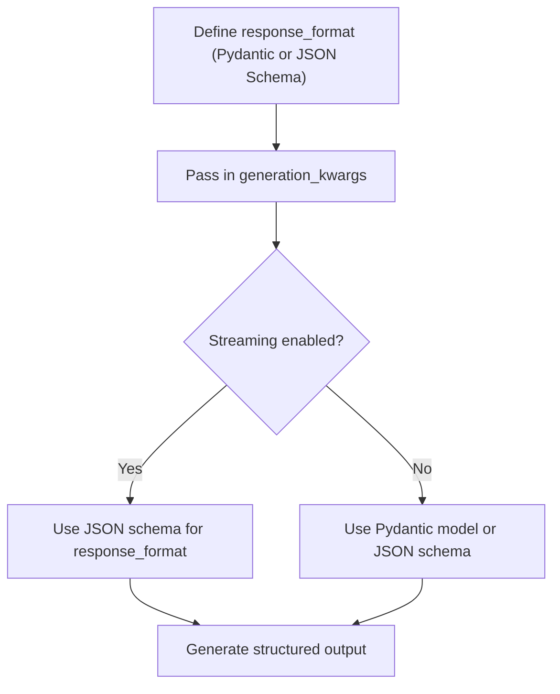
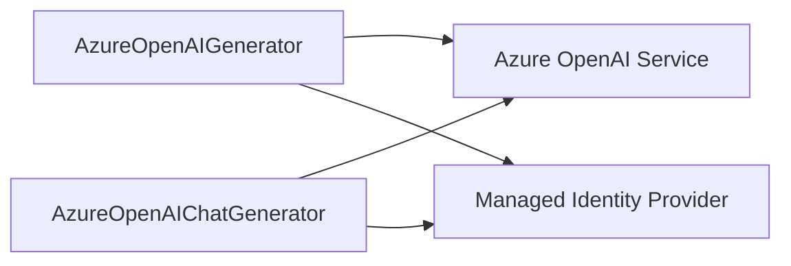

# Azure OpenAI Generators

<cite>
**Referenced Files in This Document**
- [azureopenaichatgenerator.mdx](file://docs-website/docs/pipeline-components/generators/azureopenaichatgenerator.mdx)
- [azureopenaigenerator.mdx](file://docs-website/docs/pipeline-components/generators/azureopenaigenerator.mdx)
- [azure.py](file://haystack/components/generators/azure.py)
- [azure_chat.py](file://haystack/components/generators/chat/azure.py)
- [azure.py](file://haystack/utils/azure.py)
- [max_retries-for-AzureOpenAIChatGenerator-9e49b4c7bec5c72b.yaml](file://releasenotes/notes/max_retries-for-AzureOpenAIChatGenerator-9e49b4c7bec5c72b.yaml)
- [run-async-azure-54450f0c2495f5c8.yaml](file://releasenotes/notes/run-async-azure-54450f0c2495f5c8.yaml)
- [add-openai-client-config-generators-59a66f69c0733013.yaml](file://releasenotes/notes/add-openai-client-config-generators-59a66f69c0733013.yaml)
- [max-retries-for-AzureOpenAIGenerator-0f1a1807dd2af041.yaml](file://releasenotes/notes/max-retries-for-AzureOpenAIGenerator-0f1a1807dd2af041.yaml)
</cite>

## Table of Contents
1. [Introduction](#introduction)
2. [Project Structure](#project-structure)
3. [Core Components](#core-components)
4. [Architecture Overview](#architecture-overview)
5. [Detailed Component Analysis](#detailed-component-analysis)
6. [Dependency Analysis](#dependency-analysis)
7. [Performance Considerations](#performance-considerations)
8. [Troubleshooting Guide](#troubleshooting-guide)
9. [Conclusion](#conclusion)
10. [Appendices](#appendices)

## Introduction
This document explains the Azure OpenAI generator components in the Haystack ecosystem: AzureOpenAIChatGenerator and AzureOpenAIGenerator. It covers how they integrate with Azure OpenAI Service, authentication via Azure credentials and managed identity, endpoint and model configuration, streaming and structured outputs, and operational guidance such as retries, timeouts, async execution, and HTTP client customization. Practical examples demonstrate pipeline usage and configuration.

## Project Structure
The Azure OpenAI generators are implemented as Haystack components and documented in the docs website. The implementation files live under haystack/components/generators and haystack/components/generators/chat. Utility helpers for Azure identity are under haystack/utils.

**Diagram sources**
- [azure.py](file://haystack/components/generators/azure.py#L1-L200)
- [azure_chat.py](file://haystack/components/generators/chat/azure.py#L1-L200)
- [azureopenaigenerator.mdx](file://docs-website/docs/pipeline-components/generators/azureopenaigenerator.mdx#L1-L142)
- [azureopenaichatgenerator.mdx](file://docs-website/docs/pipeline-components/generators/azureopenaichatgenerator.mdx#L1-L212)
- [azure.py](file://haystack/utils/azure.py#L1-L17)

**Section sources**
- [azureopenaichatgenerator.mdx](file://docs-website/docs/pipeline-components/generators/azureopenaichatgenerator.mdx#L1-L212)
- [azureopenaigenerator.mdx](file://docs-website/docs/pipeline-components/generators/azureopenaigenerator.mdx#L1-L142)
- [azure.py](file://haystack/components/generators/azure.py#L1-L200)
- [azure_chat.py](file://haystack/components/generators/chat/azure.py#L1-L200)
- [azure.py](file://haystack/utils/azure.py#L1-L17)

## Core Components
- AzureOpenAIChatGenerator: Designed for chat-style interactions using OpenAI models deployed via Azure. Accepts a list of ChatMessage objects and supports structured outputs, streaming, multimodal inputs, and async execution.
- AzureOpenAIGenerator: Designed for text generation tasks using Azure-deployed OpenAI models. Accepts a plain prompt string, supports streaming, and integrates with pipeline components like PromptBuilder and retrievers.

Key configuration aspects:
- Authentication: API key via environment variable or initialization parameter; Azure Active Directory token via environment variable or initialization parameter; managed identity token provider available.
- Endpoint and Deployment: Azure endpoint URL and azure_deployment (model deployment name) are required for Azure OpenAI Service.
- Generation parameters: Pass-through of generation_kwargs to Azure OpenAI service; supports response_format for structured outputs; streaming_callback for streaming; max_retries and timeout for resilience; http_client_kwargs for advanced HTTP configuration.

**Section sources**
- [azureopenaichatgenerator.mdx](file://docs-website/docs/pipeline-components/generators/azureopenaichatgenerator.mdx#L10-L125)
- [azureopenaigenerator.mdx](file://docs-website/docs/pipeline-components/generators/azureopenaigenerator.mdx#L10-L98)
- [azure.py](file://haystack/utils/azure.py#L11-L17)

## Architecture Overview
High-level integration flow for Azure OpenAI generators:
- Components initialize with Azure endpoint, deployment name, and credentials.
- Components translate Haystack-native inputs (messages or prompts) into Azure OpenAI-compatible requests.
- Requests leverage Azure OpenAI Service endpoints and authentication.
- Responses are normalized back into Haystack outputs (replies and metadata).

**Diagram sources**
- [azureopenaichatgenerator.mdx](file://docs-website/docs/pipeline-components/generators/azureopenaichatgenerator.mdx#L25-L50)
- [azureopenaigenerator.mdx](file://docs-website/docs/pipeline-components/generators/azureopenaigenerator.mdx#L25-L50)

## Detailed Component Analysis

### AzureOpenAIChatGenerator
- Purpose: Chat completions with Azure OpenAI models.
- Inputs: List of ChatMessage objects; optional generation_kwargs including response_format for structured outputs.
- Outputs: Replies and metadata; supports streaming via streaming_callback.
- Authentication: Supports AZURE_OPENAI_API_KEY and AZURE_OPENAI_AD_TOKEN environment variables or initialization parameters; managed identity token provider available.
- Model and Endpoint: azure_deployment specifies the model deployment; azure_endpoint sets the Azure OpenAI endpoint.
- Advanced features: Structured outputs with Pydantic models or JSON schemas; streaming; async run_async; configurable retries and timeouts; HTTP client customization via http_client_kwargs.

**Diagram sources**
- [azure_chat.py](file://haystack/components/generators/chat/azure.py#L1-L200)

**Section sources**
- [azureopenaichatgenerator.mdx](file://docs-website/docs/pipeline-components/generators/azureopenaichatgenerator.mdx#L10-L125)
- [run-async-azure-54450f0c2495f5c8.yaml](file://releasenotes/notes/run-async-azure-54450f0c2495f5c8.yaml#L1-L6)
- [max_retries-for-AzureOpenAIChatGenerator-9e49b4c7bec5c72b.yaml](file://releasenotes/notes/max_retries-for-AzureOpenAIChatGenerator-9e49b4c7bec5c72b.yaml#L1-L4)
- [add-openai-client-config-generators-59a66f69c0733013.yaml](file://releasenotes/notes/add-openai-client-config-generators-59a66f69c0733013.yaml#L1-L4)

### AzureOpenAIGenerator
- Purpose: Text generation with Azure OpenAI models.
- Inputs: Single prompt string; optional generation_kwargs; supports streaming_callback.
- Outputs: Replies and metadata; streaming supported for single response (n=1).
- Authentication: Supports AZURE_OPENAI_API_KEY and AZURE_OPENAI_AD_TOKEN environment variables or initialization parameters; managed identity token provider available.
- Model and Endpoint: azure_deployment and azure_endpoint configuration.
- Advanced features: Streaming; configurable retries and timeouts; HTTP client customization via http_client_kwargs.

**Diagram sources**
- [azure.py](file://haystack/components/generators/azure.py#L1-L200)

**Section sources**
- [azureopenaigenerator.mdx](file://docs-website/docs/pipeline-components/generators/azureopenaigenerator.mdx#L10-L98)
- [max-retries-for-AzureOpenAIGenerator-0f1a1807dd2af041.yaml](file://releasenotes/notes/max-retries-for-AzureOpenAIGenerator-0f1a1807dd2af041.yaml#L1-L9)
- [add-openai-client-config-generators-59a66f69c0733013.yaml](file://releasenotes/notes/add-openai-client-config-generators-59a66f69c0733013.yaml#L1-L4)

### Authentication and Managed Identity
- Environment variables: AZURE_OPENAI_API_KEY and AZURE_OPENAI_AD_TOKEN are commonly used.
- Programmatic parameters: api_key and azure_ad_token can be passed during initialization.
- Managed identity: A helper returns a bearer token provider using DefaultAzureCredential with the Azure Cognitive Services scope, enabling managed identity authentication without secrets.

**Diagram sources**
- [azureopenaichatgenerator.mdx](file://docs-website/docs/pipeline-components/generators/azureopenaichatgenerator.mdx#L31-L43)
- [azureopenaigenerator.mdx](file://docs-website/docs/pipeline-components/generators/azureopenaigenerator.mdx#L31-L43)
- [azure.py](file://haystack/utils/azure.py#L11-L17)

**Section sources**
- [azureopenaichatgenerator.mdx](file://docs-website/docs/pipeline-components/generators/azureopenaichatgenerator.mdx#L31-L43)
- [azureopenaigenerator.mdx](file://docs-website/docs/pipeline-components/generators/azureopenaigenerator.mdx#L31-L43)
- [azure.py](file://haystack/utils/azure.py#L11-L17)

### Streaming Support
- Both components support streaming via streaming_callback.
- For structured outputs with streaming, use a JSON schema instead of a Pydantic model.
- Streaming is supported only when generating a single response (n=1).

**Diagram sources**
- [azureopenaichatgenerator.mdx](file://docs-website/docs/pipeline-components/generators/azureopenaichatgenerator.mdx#L100-L125)
- [azureopenaigenerator.mdx](file://docs-website/docs/pipeline-components/generators/azureopenaigenerator.mdx#L49-L55)

**Section sources**
- [azureopenaichatgenerator.mdx](file://docs-website/docs/pipeline-components/generators/azureopenaichatgenerator.mdx#L92-L125)
- [azureopenaigenerator.mdx](file://docs-website/docs/pipeline-components/generators/azureopenaigenerator.mdx#L49-L55)

### Structured Outputs
- Define response_format in generation_kwargs to constrain model output to a schema or Pydantic model.
- Model compatibility varies; consult Azure documentation for supported models and limitations.
- Streaming with structured outputs requires a JSON schema.

**Diagram sources**
- [azureopenaichatgenerator.mdx](file://docs-website/docs/pipeline-components/generators/azureopenaichatgenerator.mdx#L51-L98)

**Section sources**
- [azureopenaichatgenerator.mdx](file://docs-website/docs/pipeline-components/generators/azureopenaichatgenerator.mdx#L51-L98)

### Async Execution
- AzureOpenAIChatGenerator exposes run_async using AsyncAzureOpenAI, returning a coroutine for awaiting.

**Section sources**
- [run-async-azure-54450f0c2495f5c8.yaml](file://releasenotes/notes/run-async-azure-54450f0c2495f5c8.yaml#L1-L6)

### HTTP Client Configuration
- Both chat and text generators support http_client_kwargs to customize HTTP client behavior (e.g., proxies, SSL).

**Section sources**
- [add-openai-client-config-generators-59a66f69c0733013.yaml](file://releasenotes/notes/add-openai-client-config-generators-59a66f69c0733013.yaml#L1-L4)

### Retry and Timeout Controls
- AzureOpenAIChatGenerator: max_retries and timeout parameters added for resilience.
- AzureOpenAIGenerator: max_retries and timeout defaults inferred from environment variables or set to sensible values.

**Section sources**
- [max_retries-for-AzureOpenAIChatGenerator-9e49b4c7bec5c72b.yaml](file://releasenotes/notes/max_retries-for-AzureOpenAIChatGenerator-9e49b4c7bec5c72b.yaml#L1-L4)
- [max-retries-for-AzureOpenAIGenerator-0f1a1807dd2af041.yaml](file://releasenotes/notes/max-retries-for-AzureOpenAIGenerator-0f1a1807dd2af041.yaml#L1-L9)

## Dependency Analysis
- Components depend on Azure OpenAI endpoints and credentials.
- AzureOpenAIChatGenerator optionally depends on a managed identity token provider for authentication.
- Both components accept generation_kwargs and streaming_callback, enabling flexible behavior.

**Diagram sources**
- [azure.py](file://haystack/utils/azure.py#L11-L17)
- [azureopenaichatgenerator.mdx](file://docs-website/docs/pipeline-components/generators/azureopenaichatgenerator.mdx#L25-L50)
- [azureopenaigenerator.mdx](file://docs-website/docs/pipeline-components/generators/azureopenaigenerator.mdx#L25-L50)

**Section sources**
- [azure.py](file://haystack/utils/azure.py#L11-L17)
- [azureopenaichatgenerator.mdx](file://docs-website/docs/pipeline-components/generators/azureopenaichatgenerator.mdx#L25-L50)
- [azureopenaigenerator.mdx](file://docs-website/docs/pipeline-components/generators/azureopenaigenerator.mdx#L25-L50)

## Performance Considerations
- Prefer environment variables for credentials to avoid passing secrets in code.
- Use streaming for real-time feedback and reduced perceived latency.
- Tune max_retries and timeout to balance reliability and latency.
- Use http_client_kwargs for proxy or TLS configurations when required by your environment.
- For batch-like scenarios, orchestrate multiple runs with controlled concurrency and rate limits.

[No sources needed since this section provides general guidance]

## Troubleshooting Guide
Common issues and resolutions:
- Authentication failures: Verify AZURE_OPENAI_API_KEY or AZURE_OPENAI_AD_TOKEN; confirm endpoint and deployment names; ensure managed identity has the correct scope.
- Wrong model deployment: Confirm azure_deployment matches the model deployment name in Azure.
- Streaming not working: Ensure n=1 for single-response streaming; for structured outputs with streaming, use a JSON schema.
- Structured outputs mismatch: Check model compatibility; older models require JSON mode via {"type": "json_object"}.
- Network restrictions: Configure http_client_kwargs for proxies or SSL; ensure outbound access to Azure OpenAI endpoints.
- Retries and timeouts: Adjust max_retries and timeout to handle transient errors or slow responses.

**Section sources**
- [azureopenaichatgenerator.mdx](file://docs-website/docs/pipeline-components/generators/azureopenaichatgenerator.mdx#L92-L125)
- [azureopenaigenerator.mdx](file://docs-website/docs/pipeline-components/generators/azureopenaigenerator.mdx#L49-L55)
- [max_retries-for-AzureOpenAIChatGenerator-9e49b4c7bec5c72b.yaml](file://releasenotes/notes/max_retries-for-AzureOpenAIChatGenerator-9e49b4c7bec5c72b.yaml#L1-L4)
- [max-retries-for-AzureOpenAIGenerator-0f1a1807dd2af041.yaml](file://releasenotes/notes/max-retries-for-AzureOpenAIGenerator-0f1a1807dd2af041.yaml#L1-L9)
- [add-openai-client-config-generators-59a66f69c0733013.yaml](file://releasenotes/notes/add-openai-client-config-generators-59a66f69c0733013.yaml#L1-L4)

## Conclusion
AzureOpenAIChatGenerator and AzureOpenAIGenerator integrate seamlessly with Azure OpenAI Service, supporting robust authentication (API key, AAD token, managed identity), flexible configuration (endpoint, deployment, generation kwargs), streaming, structured outputs, async execution, and resilient networking. Use the provided documentation and release notes to configure and optimize these components for production pipelines.

[No sources needed since this section summarizes without analyzing specific files]

## Appendices

### Practical Pipeline Examples
- Chat pipeline with ChatPromptBuilder and AzureOpenAIChatGenerator.
- Text generation pipeline with PromptBuilder and AzureOpenAIGenerator.

Refer to the usage sections in the documentation for concrete pipeline setups.

**Section sources**
- [azureopenaichatgenerator.mdx](file://docs-website/docs/pipeline-components/generators/azureopenaichatgenerator.mdx#L180-L212)
- [azureopenaigenerator.mdx](file://docs-website/docs/pipeline-components/generators/azureopenaigenerator.mdx#L100-L142)