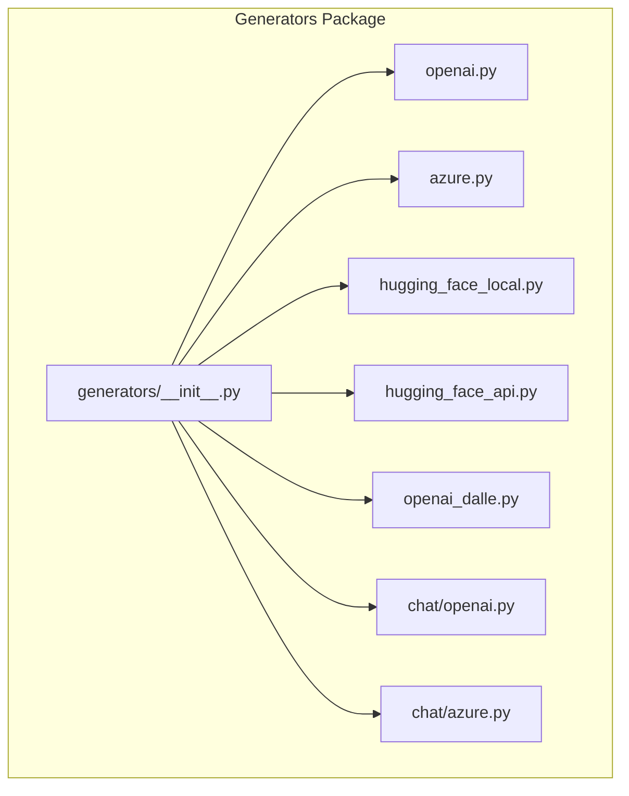
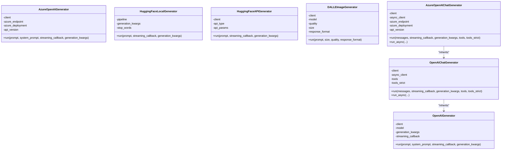
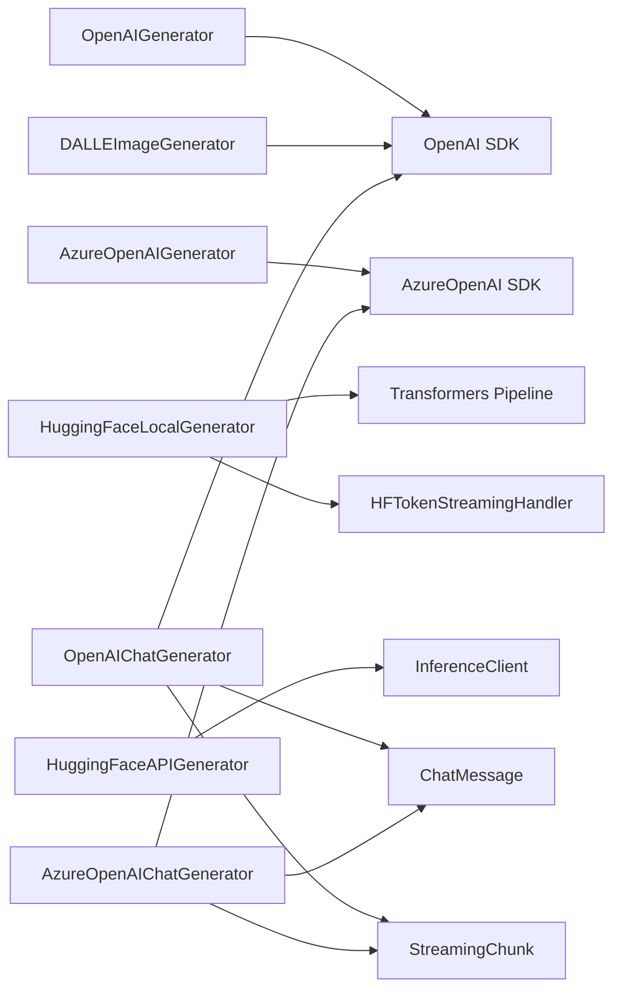

# Generators

<cite>
**Referenced Files in This Document**
- [generators/__init__.py](file://haystack/components/generators/__init__.py)
- [openai.py](file://haystack/components/generators/openai.py)
- [azure.py](file://haystack/components/generators/azure.py)
- [hugging_face_local.py](file://haystack/components/generators/hugging_face_local.py)
- [hugging_face_api.py](file://haystack/components/generators/hugging_face_api.py)
- [openai_dalle.py](file://haystack/components/generators/openai_dalle.py)
- [chat_message.py](file://haystack/dataclasses/chat_message.py)
- [streaming_chunk.py](file://haystack/dataclasses/streaming_chunk.py)
- [hf.py](file://haystack/utils/hf.py)
- [openai.py (chat)](file://haystack/components/generators/chat/openai.py)
- [azure.py (chat)](file://haystack/components/generators/chat/azure.py)
</cite>

## Table of Contents
1. [Introduction](#introduction)
2. [Project Structure](#project-structure)
3. [Core Components](#core-components)
4. [Architecture Overview](#architecture-overview)
5. [Detailed Component Analysis](#detailed-component-analysis)
6. [Dependency Analysis](#dependency-analysis)
7. [Performance Considerations](#performance-considerations)
8. [Troubleshooting Guide](#troubleshooting-guide)
9. [Conclusion](#conclusion)

## Introduction
This document explains Haystack’s generator components that power text generation, chat completion, and image generation. It covers the major families:
- OpenAI text and chat generators
- Azure OpenAI text and chat generators
- Hugging Face local and API generators
- DALL·E image generators

It describes purpose, inputs/outputs, streaming, configuration, provider-specific features, authentication, rate-limiting considerations, performance optimization, cost management, selection guidance, and troubleshooting.

## Project Structure
Haystack organizes generator components under a dedicated package. The public entry point exposes a lazy importer that loads the concrete implementations on demand. Chat-specific variants live under a nested chat module.

**Diagram sources**
- [generators/__init__.py](file://haystack/components/generators/__init__.py#L10-L26)
- [openai.py](file://haystack/components/generators/openai.py#L31-L32)
- [azure.py](file://haystack/components/generators/azure.py#L17-L18)
- [hugging_face_local.py](file://haystack/components/generators/hugging_face_local.py#L24-L25)
- [hugging_face_api.py](file://haystack/components/generators/hugging_face_api.py#L36-L37)
- [openai_dalle.py](file://haystack/components/generators/openai_dalle.py#L16-L17)
- [openai.py (chat)](file://haystack/components/generators/chat/openai.py#L53-L54)
- [azure.py (chat)](file://haystack/components/generators/chat/azure.py#L27-L28)

**Section sources**
- [generators/__init__.py](file://haystack/components/generators/__init__.py#L10-L26)

## Core Components
- OpenAI text generator: Generates plain text using OpenAI models with optional streaming and system prompts.
- Azure OpenAI text generator: Same as above, but targets Azure OpenAI deployments with endpoint and token options.
- Hugging Face local generator: Runs text-generation models locally using Transformers pipelines with optional streaming and stop words.
- Hugging Face API generator: Uses Hugging Face Inference Endpoints or self-hosted Text Generation Inference with streaming support.
- DALL·E image generator: Generates images from text prompts using OpenAI DALL·E models with configurable size, quality, and response format.
- OpenAI chat generator: Full-featured chat generator with structured outputs, tool calling, streaming, and async support.
- Azure OpenAI chat generator: Equivalent to the OpenAI chat generator but for Azure deployments.

Key shared concepts:
- Streaming via a unified callback interface that emits typed chunks.
- ChatMessage-based inputs/outputs for chat-capable generators.
- Configuration via constructor parameters, environment variables, and runtime overrides.

**Section sources**
- [openai.py](file://haystack/components/generators/openai.py#L31-L271)
- [azure.py](file://haystack/components/generators/azure.py#L17-L216)
- [hugging_face_local.py](file://haystack/components/generators/hugging_face_local.py#L24-L266)
- [hugging_face_api.py](file://haystack/components/generators/hugging_face_api.py#L36-L303)
- [openai_dalle.py](file://haystack/components/generators/openai_dalle.py#L16-L167)
- [openai.py (chat)](file://haystack/components/generators/chat/openai.py#L53-L725)
- [azure.py (chat)](file://haystack/components/generators/chat/azure.py#L27-L281)

## Architecture Overview
The generator ecosystem follows a consistent pattern:
- Components expose a run method with optional streaming_callback and generation_kwargs.
- Chat-capable components accept and emit ChatMessage objects.
- StreamingCallbackT receives StreamingChunk objects enriched with metadata and optional tool-call deltas.
- Providers are configured via secrets, base URLs, timeouts, retries, and HTTP client customization.

**Diagram sources**
- [openai.py](file://haystack/components/generators/openai.py#L31-L271)
- [azure.py](file://haystack/components/generators/azure.py#L17-L216)
- [hugging_face_local.py](file://haystack/components/generators/hugging_face_local.py#L24-L266)
- [hugging_face_api.py](file://haystack/components/generators/hugging_face_api.py#L36-L303)
- [openai_dalle.py](file://haystack/components/generators/openai_dalle.py#L16-L167)
- [openai.py (chat)](file://haystack/components/generators/chat/openai.py#L53-L725)
- [azure.py (chat)](file://haystack/components/generators/chat/azure.py#L27-L281)

## Detailed Component Analysis

### OpenAI Text Generator
Purpose:
- Generate plain text using OpenAI models with optional system prompts and streaming.

Inputs:
- prompt: string
- system_prompt: optional string
- generation_kwargs: dict of OpenAI parameters (e.g., temperature, max_completion_tokens)
- streaming_callback: optional callback receiving StreamingChunk

Outputs:
- replies: list of strings
- meta: list of dicts with model, index, finish_reason, usage

Streaming:
- Enforced single-response streaming (n=1). Emits StreamingChunk progressively.

Configuration:
- api_key, api_base_url, organization, timeout, max_retries, http_client_kwargs
- Environment variables OPENAI_TIMEOUT and OPENAI_MAX_RETRIES influence defaults

Typical use cases:
- Summarization, classification, extraction, instruction-following tasks

**Section sources**
- [openai.py](file://haystack/components/generators/openai.py#L31-L271)
- [streaming_chunk.py](file://haystack/dataclasses/streaming_chunk.py#L107-L138)

### Azure OpenAI Text Generator
Purpose:
- Same as OpenAI text generator but targets Azure OpenAI deployments.

Inputs/Outputs:
- Same as OpenAI text generator

Configuration:
- azure_endpoint, api_version, azure_deployment, api_key or azure_ad_token
- default_headers, azure_ad_token_provider, timeout, max_retries, http_client_kwargs

Authentication:
- Supports API key or Azure AD token; endpoint auto-resolved from environment

**Section sources**
- [azure.py](file://haystack/components/generators/azure.py#L17-L216)

### Hugging Face Local Generator
Purpose:
- Run text-generation models locally using Transformers pipelines.

Inputs:
- prompt: string
- generation_kwargs: pipeline parameters (e.g., max_new_tokens, temperature)
- stop_words: optional list to halt generation
- streaming_callback: optional streaming via HFTokenStreamingHandler

Outputs:
- replies: list of strings

Configuration:
- model, task, device, token, huggingface_pipeline_kwargs
- stop_words conflicts with manual stopping_criteria in generation_kwargs

Notes:
- Requires transformers installation
- Supports streaming with stop-word filtering

**Section sources**
- [hugging_face_local.py](file://haystack/components/generators/hugging_face_local.py#L24-L266)
- [hf.py](file://haystack/utils/hf.py#L383-L455)

### Hugging Face API Generator
Purpose:
- Use paid Inference Endpoints or self-hosted Text Generation Inference.

Inputs:
- prompt: string
- generation_kwargs: parameters forwarded to InferenceClient
- streaming_callback: optional streaming

Outputs:
- replies: list of strings
- meta: list of dicts with finish_reason, model, usage

Configuration:
- api_type: "inference_endpoints", "text_generation_inference", "serverless_inference_api"
- api_params: url or model depending on api_type
- token, stop_words

Notes:
- Serverless Inference API generative support may be deprecated; prefer chat generator for generative models.

**Section sources**
- [hugging_face_api.py](file://haystack/components/generators/hugging_face_api.py#L36-L303)

### DALL·E Image Generator
Purpose:
- Generate images from text prompts using OpenAI DALL·E.

Inputs:
- prompt: string
- size, quality, response_format: optional overrides

Outputs:
- images: list of URLs or base64 JSON strings
- revised_prompt: string

Configuration:
- model (dall-e-2 or dall-e-3), quality, size, response_format, api_key, api_base_url, organization, timeout, max_retries, http_client_kwargs

**Section sources**
- [openai_dalle.py](file://haystack/components/generators/openai_dalle.py#L16-L167)

### OpenAI Chat Generator
Purpose:
- Full-featured chat with structured outputs, tool calling, streaming, and async support.

Inputs:
- messages: list of ChatMessage
- generation_kwargs: OpenAI chat parameters
- tools: Tool or Toolset list; tools_strict toggles strict schema enforcement
- streaming_callback: optional sync or async callback

Outputs:
- replies: list of ChatMessage (assistant role, optional tool calls)

Streaming:
- Converts ChatCompletionChunks to StreamingChunk, mapping finish reasons and tool-call deltas

Structured outputs:
- response_format can be a JSON schema or Pydantic model; parse endpoint used when not streaming

Async:
- run_async uses AsyncOpenAI client and AsyncStream

**Section sources**
- [openai.py (chat)](file://haystack/components/generators/chat/openai.py#L53-L725)
- [chat_message.py](file://haystack/dataclasses/chat_message.py#L272-L606)
- [streaming_chunk.py](file://haystack/dataclasses/streaming_chunk.py#L107-L138)

### Azure OpenAI Chat Generator
Purpose:
- Equivalent to OpenAI chat generator but for Azure deployments.

Configuration:
- azure_endpoint, api_version, azure_deployment, api_key or azure_ad_token
- tools, tools_strict, streaming_callback, async support

**Section sources**
- [azure.py (chat)](file://haystack/components/generators/chat/azure.py#L27-L281)

## Dependency Analysis
High-level dependencies:
- Generators depend on provider SDKs (OpenAI, Hugging Face) and HTTP clients.
- Chat generators depend on ChatMessage and StreamingChunk dataclasses.
- Local Hugging Face generator depends on Transformers and a streaming handler wrapper.

**Diagram sources**
- [openai.py](file://haystack/components/generators/openai.py#L8-L26)
- [azure.py](file://haystack/components/generators/azure.py#L8-L14)
- [hugging_face_local.py](file://haystack/components/generators/hugging_face_local.py#L17-L21)
- [hugging_face_api.py](file://haystack/components/generators/hugging_face_api.py#L24-L30)
- [openai_dalle.py](file://haystack/components/generators/openai_dalle.py#L8-L13)
- [openai.py (chat)](file://haystack/components/generators/chat/openai.py#L11-L48)
- [azure.py (chat)](file://haystack/components/generators/chat/azure.py#L9-L24)
- [chat_message.py](file://haystack/dataclasses/chat_message.py#L272-L606)
- [streaming_chunk.py](file://haystack/dataclasses/streaming_chunk.py#L107-L138)
- [hf.py](file://haystack/utils/hf.py#L383-L455)

**Section sources**
- [openai.py](file://haystack/components/generators/openai.py#L8-L26)
- [azure.py](file://haystack/components/generators/azure.py#L8-L14)
- [hugging_face_local.py](file://haystack/components/generators/hugging_face_local.py#L17-L21)
- [hugging_face_api.py](file://haystack/components/generators/hugging_face_api.py#L24-L30)
- [openai_dalle.py](file://haystack/components/generators/openai_dalle.py#L8-L13)
- [openai.py (chat)](file://haystack/components/generators/chat/openai.py#L11-L48)
- [azure.py (chat)](file://haystack/components/generators/chat/azure.py#L9-L24)
- [chat_message.py](file://haystack/dataclasses/chat_message.py#L272-L606)
- [streaming_chunk.py](file://haystack/dataclasses/streaming_chunk.py#L107-L138)
- [hf.py](file://haystack/utils/hf.py#L383-L455)

## Performance Considerations
- Streaming:
  - Prefer streaming for long generations to reduce latency and memory footprint.
  - Ensure single-response streaming (n=1) when using streaming callbacks.
- Token limits:
  - Tune max_completion_tokens and overall context window to avoid truncation.
- Model selection:
  - Choose smaller models for fast iteration; reserve larger models for higher quality.
- Local vs. hosted:
  - Local Hugging Face models require sufficient GPU/CPU resources; consider quantization or adapters.
- Retry/backoff:
  - Adjust max_retries and timeout for provider stability.
- HTTP client:
  - Configure http_client_kwargs for proxies, concurrency, and connection pooling.
- Cost control:
  - Monitor usage and set budgets; prefer lower-cost models for routine tasks.
  - Use structured outputs to reduce retries caused by malformed JSON.

[No sources needed since this section provides general guidance]

## Troubleshooting Guide
Common issues and resolutions:
- Missing credentials:
  - OpenAI: Provide api_key or set OPENAI_API_KEY; Azure: provide azure_endpoint and api_key or azure_ad_token.
- Streaming conflicts:
  - Cannot stream multiple responses (n>1); set n=1 when streaming.
- Invalid URLs or models:
  - Hugging Face API requires a valid URL or model identifier depending on api_type.
- Stop words vs. stopping criteria:
  - Hugging Face local: do not set both stop_words and stopping_criteria in generation_kwargs.
- Tool call parsing:
  - Malformed tool call arguments may be skipped; enable tools_strict to enforce schema.
- Truncated completions:
  - Finish reason “length” indicates truncation; increase max tokens.
- Rate limits and quotas:
  - Implement retry with backoff; monitor provider dashboards; consider queued requests.

**Section sources**
- [openai.py](file://haystack/components/generators/openai.py#L240-L244)
- [hugging_face_api.py](file://haystack/components/generators/hugging_face_api.py#L137-L163)
- [hugging_face_local.py](file://haystack/components/generators/hugging_face_local.py#L110-L115)
- [openai.py (chat)](file://haystack/components/generators/chat/openai.py#L591-L599)
- [openai.py (chat)](file://haystack/components/generators/chat/openai.py#L553-L567)

## Conclusion
Haystack’s generator components provide a unified, extensible interface across providers and modalities. Select the appropriate generator based on your environment (cloud vs. local), modality (text, chat, image), and advanced needs (streaming, tool calling, structured outputs). Apply the performance and cost best practices outlined above to optimize reliability and efficiency.