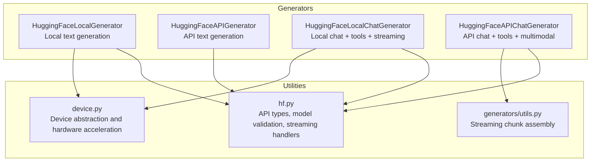
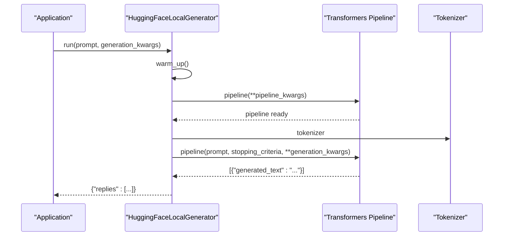
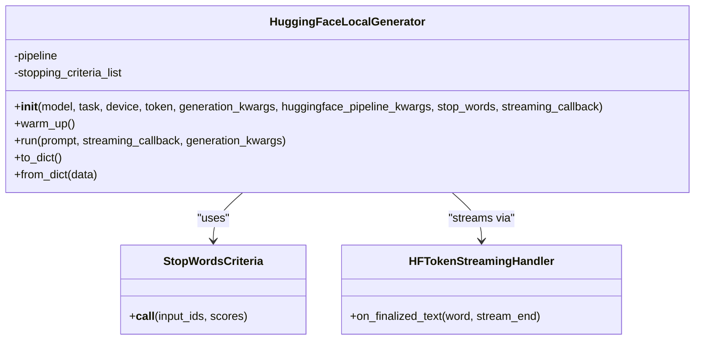
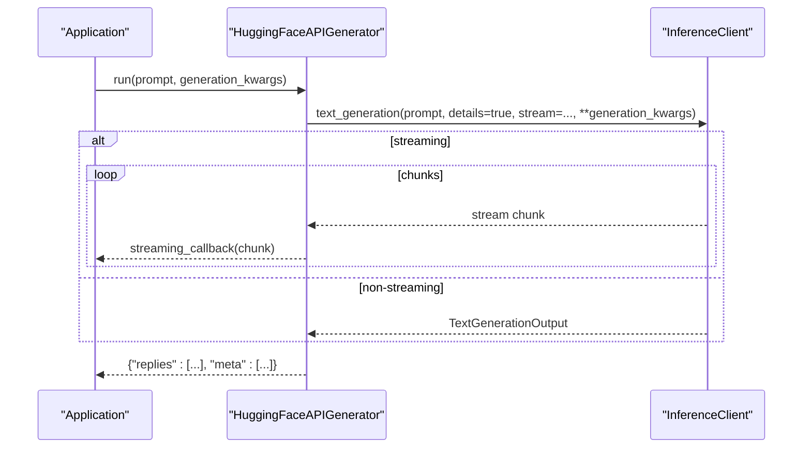
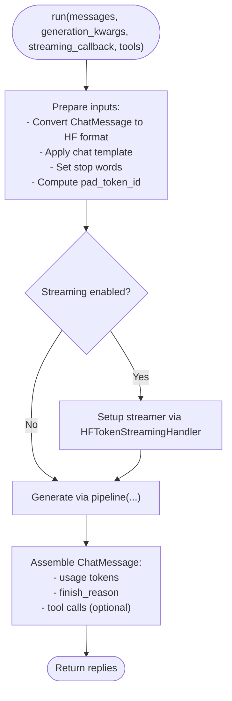
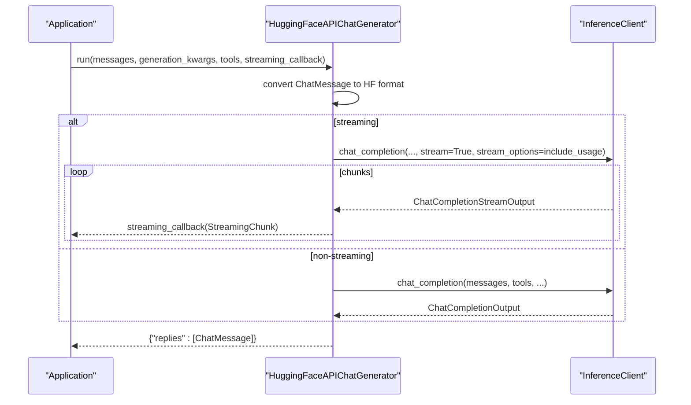
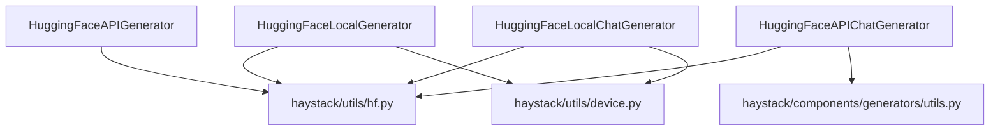

# Hugging Face Generators

<cite>
**Referenced Files in This Document**
- [hugging_face_local.py](file://haystack/components/generators/hugging_face_local.py)
- [hugging_face_api.py](file://haystack/components/generators/hugging_face_api.py)
- [hugging_face_local.py (chat)](file://haystack/components/generators/chat/hugging_face_local.py)
- [hugging_face_api.py (chat)](file://haystack/components/generators/chat/hugging_face_api.py)
- [hf.py](file://haystack/utils/hf.py)
- [device.py](file://haystack/utils/device.py)
- [utils.py](file://haystack/components/generators/utils.py)
- [test_hugging_face_local_generator.py](file://test/components/generators/test_hugging_face_local_generator.py)
- [test_hugging_face_local.py](file://test/components/generators/chat/test_hugging_face_local.py)
- [pyproject.toml](file://pyproject.toml)
</cite>

## Table of Contents
1. [Introduction](#introduction)
2. [Project Structure](#project-structure)
3. [Core Components](#core-components)
4. [Architecture Overview](#architecture-overview)
5. [Detailed Component Analysis](#detailed-component-analysis)
6. [Dependency Analysis](#dependency-analysis)
7. [Performance Considerations](#performance-considerations)
8. [Troubleshooting Guide](#troubleshooting-guide)
9. [Conclusion](#conclusion)
10. [Appendices](#appendices)

## Introduction
This document explains the Hugging Face generator components in the Haystack project. It covers both local and API-based generators:
- HuggingFaceLocalGenerator: runs text-generation models locally using Transformers pipelines.
- HuggingFaceAPIGenerator: invokes Hugging Face APIs (serverless, inference endpoints, or self-hosted TGI) for text generation.
- HuggingFaceLocalChatGenerator: runs chat-style models locally with support for tool calls, streaming, and chat templates.
- HuggingFaceAPIChatGenerator: invokes Hugging Face APIs for chat-style completions, including multimodal inputs and tool/function calling.

It documents model loading, tokenizer configuration, hardware acceleration, authentication, model selection, inference optimization, streaming, batching, memory management, compatibility, quantization, and practical usage patterns.

## Project Structure
The Hugging Face generator components are organized under:
- haystack/components/generators/: local and API text generation generators
- haystack/components/generators/chat/: chat-style local and API generators
- haystack/utils/hf.py: shared utilities for Hugging Face integration (API types, model validation, streaming handlers, device mapping)
- haystack/utils/device.py: device abstraction and hardware acceleration support
- haystack/components/generators/utils.py: streaming utilities for assembling ChatMessage from streaming chunks

**Diagram sources**
- [hugging_face_local.py](file://haystack/components/generators/hugging_face_local.py#L24-L266)
- [hugging_face_api.py](file://haystack/components/generators/hugging_face_api.py#L36-L303)
- [hugging_face_local.py (chat)](file://haystack/components/generators/chat/hugging_face_local.py#L88-L665)
- [hugging_face_api.py (chat)](file://haystack/components/generators/chat/hugging_face_api.py#L215-L693)
- [hf.py](file://haystack/utils/hf.py#L35-L455)
- [device.py](file://haystack/utils/device.py#L246-L544)
- [utils.py](file://haystack/components/generators/utils.py#L78-L172)

**Section sources**
- [hugging_face_local.py](file://haystack/components/generators/hugging_face_local.py#L1-L266)
- [hugging_face_api.py](file://haystack/components/generators/hugging_face_api.py#L1-L303)
- [hugging_face_local.py (chat)](file://haystack/components/generators/chat/hugging_face_local.py#L1-L665)
- [hugging_face_api.py (chat)](file://haystack/components/generators/chat/hugging_face_api.py#L1-L693)
- [hf.py](file://haystack/utils/hf.py#L1-L455)
- [device.py](file://haystack/utils/device.py#L1-L544)
- [utils.py](file://haystack/components/generators/utils.py#L1-L172)

## Core Components
- HuggingFaceLocalGenerator
  - Loads a Transformers pipeline locally, supports stop words, streaming, and generation kwargs.
  - Uses resolve_hf_pipeline_kwargs to infer task and device, and sets defaults like return_full_text and max_new_tokens.
- HuggingFaceAPIGenerator
  - Invokes Hugging Face APIs (serverless, inference endpoints, TGI) via InferenceClient.
  - Supports stop sequences, streaming, and returns replies plus metadata.
- HuggingFaceLocalChatGenerator
  - Runs chat models with chat templates, tool calls, stop words, and streaming.
  - Provides sync and async run methods, tool parsing, and token usage calculation.
- HuggingFaceAPIChatGenerator
  - Uses InferenceClient.chat_completion for chat-style completions.
  - Supports multimodal inputs (text + images), tool/function calling, and streaming.

Key shared utilities:
- hf.py: API types, model validation, stop words criteria, streaming handlers, device mapping helpers.
- device.py: Device abstraction, automatic device selection, and conversion to HF formats.
- generators/utils.py: Streaming chunk assembly into ChatMessage, printing utilities.

**Section sources**
- [hugging_face_local.py](file://haystack/components/generators/hugging_face_local.py#L24-L266)
- [hugging_face_api.py](file://haystack/components/generators/hugging_face_api.py#L36-L303)
- [hugging_face_local.py (chat)](file://haystack/components/generators/chat/hugging_face_local.py#L88-L665)
- [hugging_face_api.py (chat)](file://haystack/components/generators/chat/hugging_face_api.py#L215-L693)
- [hf.py](file://haystack/utils/hf.py#L35-L455)
- [device.py](file://haystack/utils/device.py#L246-L544)
- [utils.py](file://haystack/components/generators/utils.py#L78-L172)

## Architecture Overview
High-level flow for each generator type:

- Local text generation (HuggingFaceLocalGenerator):
  - Resolve pipeline kwargs (model, task, device, token)
  - Warm up pipeline and optional stop words criteria
  - Generate with merged generation kwargs and optional streaming

- API text generation (HuggingFaceAPIGenerator):
  - Validate API type and parameters
  - Build InferenceClient
  - Call text_generation with streaming or non-streaming

- Local chat (HuggingFaceLocalChatGenerator):
  - Prepare inputs: convert ChatMessage to HF format, apply chat template, set stop words
  - Generate with optional streaming and tool parsing
  - Assemble ChatMessage with usage and finish reason

- API chat (HuggingFaceAPIChatGenerator):
  - Convert ChatMessage to HF format (including multimodal parts)
  - Call chat_completion with tools and streaming
  - Assemble ChatMessage with tool calls and reasoning

**Diagram sources**
- [hugging_face_local.py](file://haystack/components/generators/hugging_face_local.py#L138-L266)
- [hf.py](file://haystack/utils/hf.py#L324-L455)

**Section sources**
- [hugging_face_local.py](file://haystack/components/generators/hugging_face_local.py#L138-L266)
- [hugging_face_api.py](file://haystack/components/generators/hugging_face_api.py#L210-L303)
- [hugging_face_local.py (chat)](file://haystack/components/generators/chat/hugging_face_local.py#L350-L665)
- [hugging_face_api.py (chat)](file://haystack/components/generators/chat/hugging_face_api.py#L452-L693)

## Detailed Component Analysis

### HuggingFaceLocalGenerator
- Purpose: run text-generation models locally via Transformers pipeline.
- Key features:
  - Task inference and validation (supports text-generation; text2text-generation is deprecated)
  - Device resolution and model kwargs serialization/deserialization
  - Stop words via StoppingCriteriaList
  - Streaming via HFTokenStreamingHandler
  - Generation kwargs defaults and merging
- Important behaviors:
  - Automatically sets return_full_text=False for text-generation
  - Enforces max_new_tokens default
  - Prevents conflicting stop_words and stopping_criteria
  - Supports serialization/deserialization of model kwargs (e.g., torch.dtype)

**Diagram sources**
- [hugging_face_local.py](file://haystack/components/generators/hugging_face_local.py#L24-L266)
- [hf.py](file://haystack/utils/hf.py#L330-L455)

**Section sources**
- [hugging_face_local.py](file://haystack/components/generators/hugging_face_local.py#L24-L266)
- [hf.py](file://haystack/utils/hf.py#L178-L220)
- [device.py](file://haystack/utils/device.py#L246-L407)

### HuggingFaceAPIGenerator
- Purpose: invoke Hugging Face APIs for text generation.
- Supported API types:
  - text_generation_inference
  - inference_endpoints
  - serverless_inference_api (note: serverless may not support text-generation endpoint anymore)
- Key features:
  - Validates model availability and type
  - Builds InferenceClient with token and URL/model
  - Supports stop sequences and streaming
  - Returns replies and metadata (finish_reason, usage)

**Diagram sources**
- [hugging_face_api.py](file://haystack/components/generators/hugging_face_api.py#L210-L303)
- [hf.py](file://haystack/utils/hf.py#L35-L67)

**Section sources**
- [hugging_face_api.py](file://haystack/components/generators/hugging_face_api.py#L36-L303)
- [hf.py](file://haystack/utils/hf.py#L222-L255)

### HuggingFaceLocalChatGenerator
- Purpose: run chat models locally with chat templates, tool calls, and streaming.
- Key features:
  - Task validation and chat template application
  - Stop words via StoppingCriteriaList
  - Tool parsing with default or custom parser
  - Streaming via HFTokenStreamingHandler (sync) and AsyncHFTokenStreamingHandler (async)
  - Token usage calculation and finish reason mapping
  - Async run method with thread pool executor for async calls

**Diagram sources**
- [hugging_face_local.py (chat)](file://haystack/components/generators/chat/hugging_face_local.py#L540-L665)
- [hf.py](file://haystack/utils/hf.py#L330-L455)

**Section sources**
- [hugging_face_local.py (chat)](file://haystack/components/generators/chat/hugging_face_local.py#L88-L665)
- [utils.py](file://haystack/components/generators/utils.py#L78-L172)

### HuggingFaceAPIChatGenerator
- Purpose: invoke Hugging Face APIs for chat-style completions.
- Features:
  - Multimodal inputs (text + images)
  - Tool/function calling with conversion helpers
  - Streaming via chat_completion stream
  - Finish reason mapping and usage extraction
  - Async and sync run methods

**Diagram sources**
- [hugging_face_api.py (chat)](file://haystack/components/generators/chat/hugging_face_api.py#L452-L693)
- [utils.py](file://haystack/components/generators/utils.py#L78-L172)

**Section sources**
- [hugging_face_api.py (chat)](file://haystack/components/generators/chat/hugging_face_api.py#L215-L693)
- [utils.py](file://haystack/components/generators/utils.py#L78-L172)

## Dependency Analysis
- External libraries:
  - transformers[torch]: local model loading, pipelines, tokenizers, streaming
  - huggingface_hub>=0.27.0: API clients (InferenceClient, AsyncInferenceClient), model info
- Internal dependencies:
  - hf.py: API types, model validation, stop words criteria, streaming handlers, device mapping
  - device.py: ComponentDevice abstraction and device map resolution
  - generators/utils.py: streaming chunk assembly and printing utilities

**Diagram sources**
- [hugging_face_local.py](file://haystack/components/generators/hugging_face_local.py#L1-L122)
- [hugging_face_api.py](file://haystack/components/generators/hugging_face_api.py#L24-L31)
- [hugging_face_local.py (chat)](file://haystack/components/generators/chat/hugging_face_local.py#L1-L47)
- [hugging_face_api.py (chat)](file://haystack/components/generators/chat/hugging_face_api.py#L24-L51)
- [hf.py](file://haystack/utils/hf.py#L1-L455)
- [device.py](file://haystack/utils/device.py#L1-L544)
- [utils.py](file://haystack/components/generators/utils.py#L1-L172)

**Section sources**
- [pyproject.toml](file://pyproject.toml#L94-L95)
- [hf.py](file://haystack/utils/hf.py#L25-L31)
- [device.py](file://haystack/utils/device.py#L12-L17)

## Performance Considerations
- Hardware acceleration and device mapping:
  - Automatic device selection prefers GPU, XPU, MPS, then CPU.
  - Device maps enable multi-device inference and weight offloading.
  - resolve_hf_device_map updates model_kwargs with device_map for quantized loading.
- Quantization and memory:
  - model_kwargs can include quantization options (e.g., 4-bit) and compute dtype.
  - Tests demonstrate load_in_4bit and bnb_4bit_* settings serialization.
- Streaming vs. batching:
  - Streaming reduces latency for long generations; batching is handled by underlying clients.
  - For chat, streaming is restricted to single response (num_return_sequences=1) when enabled.
- Generation kwargs:
  - Defaults include max_new_tokens and return_full_text adjustments.
  - Stop words and stopping_criteria are mutually exclusive.
- Token usage:
  - Chat generators compute prompt/completion/total tokens and expose usage metadata.

[No sources needed since this section provides general guidance]

## Troubleshooting Guide
Common issues and resolutions:
- Task validation errors:
  - text2text-generation is not supported with Transformers v5+ for local chat generator.
- Conflicting stop configurations:
  - Cannot set both stop_words and stopping_criteria in generation_kwargs.
- Invalid API type or parameters:
  - Ensure api_type is one of supported types and required parameters (model or url) are provided.
  - For serverless, model must be a valid generation model.
- URL validation:
  - Inference endpoints and TGI require a valid HTTP(S) URL.
- Streaming constraints:
  - Streaming requires num_return_sequences=1; warnings are logged if overridden.
- Device conflicts:
  - If both device and device_map are provided, device is ignored and a warning is logged.
- Token usage:
  - Usage metadata may vary by provider; fallback defaults are applied when missing.

**Section sources**
- [hugging_face_local.py](file://haystack/components/generators/hugging_face_local.py#L110-L116)
- [hugging_face_local.py (chat)](file://haystack/components/generators/chat/hugging_face_local.py#L224-L238)
- [hugging_face_api.py](file://haystack/components/generators/hugging_face_api.py#L137-L163)
- [hugging_face_api.py (chat)](file://haystack/components/generators/chat/hugging_face_api.py#L362-L383)
- [hf.py](file://haystack/utils/hf.py#L144-L176)

## Conclusion
The Hugging Face generator components in Haystack provide flexible, production-ready options for both local and API-based text and chat generation. They support modern features like streaming, tool/function calling, multimodal inputs, and robust device management. Choose local generators for privacy and offline control, and API generators for scalability and managed infrastructure. Proper configuration of device mapping, quantization, and generation kwargs ensures optimal performance and reliability.

[No sources needed since this section summarizes without analyzing specific files]

## Appendices

### Practical Usage Patterns
- Local text generation:
  - Instantiate HuggingFaceLocalGenerator with model and generation kwargs.
  - Call run with a prompt; optionally provide streaming_callback.
- Hosted inference endpoints:
  - Use HuggingFaceAPIGenerator with api_type="inference_endpoints" and url.
  - Or use HuggingFaceAPIChatGenerator with api_type="inference_endpoints".
- Self-hosted TGI:
  - Use api_type="text_generation_inference" with url pointing to TGI server.
- Chat-style conversations:
  - Use HuggingFaceLocalChatGenerator with a list of ChatMessage objects.
  - Optionally enable tools and streaming.
- Authentication:
  - Provide token via Secret.from_env_var or Secret.from_token.
  - For API generators, token is passed to InferenceClient.

**Section sources**
- [hugging_face_local.py](file://haystack/components/generators/hugging_face_local.py#L47-L123)
- [hugging_face_api.py](file://haystack/components/generators/hugging_face_api.py#L96-L130)
- [hugging_face_local.py (chat)](file://haystack/components/generators/chat/hugging_face_local.py#L125-L190)
- [hugging_face_api.py (chat)](file://haystack/components/generators/chat/hugging_face_api.py#L313-L355)

### Model Compatibility and Selection
- Supported tasks:
  - text-generation for decoder-only models (e.g., GPT-style)
  - text2text-generation is deprecated; use text-generation for encoder-decoder models
- Model validation:
  - check_valid_model validates model existence and type on Hugging Face Hub
- Chat templates:
  - Local chat generator supports custom chat_template and enable_thinking for thinking-capable models

**Section sources**
- [hugging_face_local.py](file://haystack/components/generators/hugging_face_local.py#L15-L15)
- [hugging_face_local.py (chat)](file://haystack/components/generators/chat/hugging_face_local.py#L50-L50)
- [hf.py](file://haystack/utils/hf.py#L222-L255)

### Streaming, Batch Processing, and Memory Management
- Streaming:
  - Local: HFTokenStreamingHandler and AsyncHFTokenStreamingHandler
  - API: InferenceClient chat_completion stream
- Batch processing:
  - Underlying clients handle batching; adjust generation kwargs accordingly
- Memory management:
  - Device maps and quantization options reduce memory footprint
  - Tests show 4-bit quantization and dtype serialization

**Section sources**
- [hugging_face_local.py](file://haystack/components/generators/hugging_face_local.py#L239-L258)
- [hugging_face_api.py](file://haystack/components/generators/hugging_face_api.py#L242-L249)
- [hugging_face_local.py (chat)](file://haystack/components/generators/chat/hugging_face_local.py#L495-L523)
- [hugging_face_api.py (chat)](file://haystack/components/generators/chat/hugging_face_api.py#L555-L582)
- [test_hugging_face_local_generator.py](file://test/components/generators/test_hugging_face_local_generator.py#L166-L200)
- [test_hugging_face_local.py](file://test/components/generators/chat/test_hugging_face_local.py#L173-L200)

### Hardware Acceleration and Device Mapping
- Automatic device selection:
  - Prefer GPU > XPU > MPS > CPU
- Device maps:
  - Multi-device deployments and weight offloading
- Converting to HF formats:
  - ComponentDevice.to_hf() resolves device or device_map for Transformers

**Section sources**
- [device.py](file://haystack/utils/device.py#L486-L523)
- [hf.py](file://haystack/utils/hf.py#L144-L176)
- [hugging_face_local.py (chat)](file://haystack/components/generators/chat/hugging_face_local.py#L208-L210)