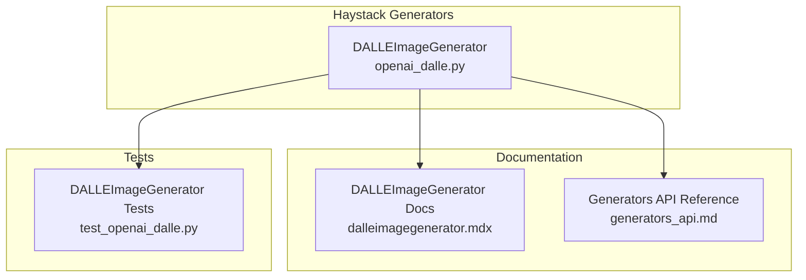
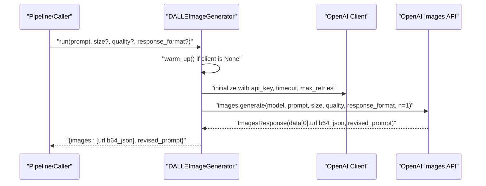
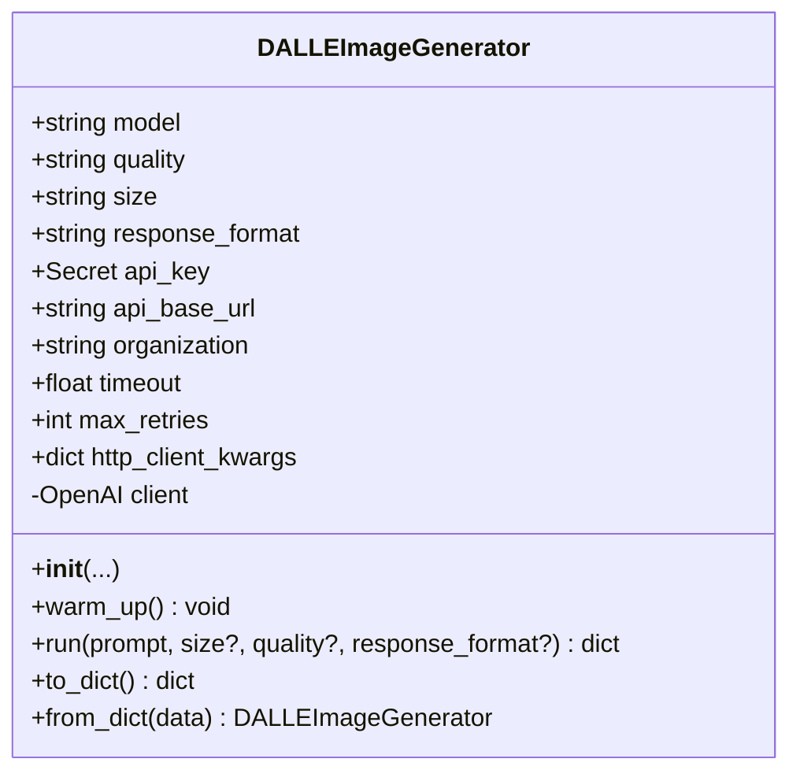
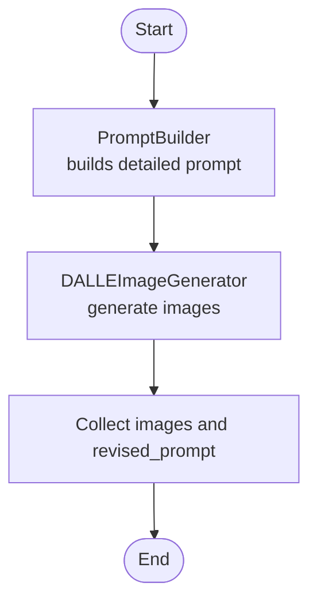
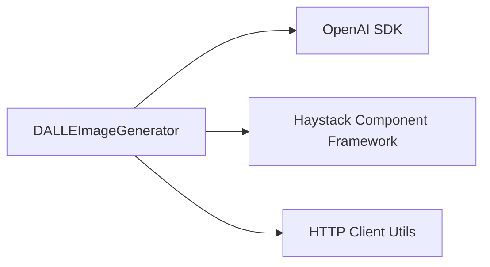

# Image Generators

<cite>
**Referenced Files in This Document**
- [openai_dalle.py](file://haystack/components/generators/openai_dalle.py)
- [dalleimagegenerator.mdx](file://docs-website/docs/pipeline-components/generators/dalleimagegenerator.mdx)
- [generators_api.md](file://docs-website/reference/haystack-api/generators_api.md)
- [test_openai_dalle.py](file://test/components/generators/test_openai_dalle.py)
</cite>

## Table of Contents
1. [Introduction](#introduction)
2. [Project Structure](#project-structure)
3. [Core Components](#core-components)
4. [Architecture Overview](#architecture-overview)
5. [Detailed Component Analysis](#detailed-component-analysis)
6. [Dependency Analysis](#dependency-analysis)
7. [Performance Considerations](#performance-considerations)
8. [Troubleshooting Guide](#troubleshooting-guide)
9. [Conclusion](#conclusion)
10. [Appendices](#appendices)

## Introduction
This document explains the image generation capabilities centered on the DALLEImageGenerator component that integrates with OpenAI’s DALL-E service. It covers model selection (DALL-E 2 vs DALL-E 3), quality settings, supported image sizes, and output formats (URL vs base64). It also documents authentication via OpenAI API keys, prompt engineering techniques, best practices, and how to integrate image generation into retrieval-augmented generation (RAG) pipelines. Guidance on rate limits, costs, safety filtering, content moderation, ethical considerations, troubleshooting, and optimization strategies is included.

## Project Structure
The DALLEImageGenerator lives under the Haystack generators module and is documented in the pipeline components and API reference documentation. Tests validate initialization, serialization, and runtime behavior.

**Diagram sources**
- [openai_dalle.py](file://haystack/components/generators/openai_dalle.py#L16-L167)
- [dalleimagegenerator.mdx](file://docs-website/docs/pipeline-components/generators/dalleimagegenerator.mdx#L1-L98)
- [generators_api.md](file://docs-website/reference/haystack-api/generators_api.md#L2144-L2265)
- [test_openai_dalle.py](file://test/components/generators/test_openai_dalle.py#L1-L162)

**Section sources**
- [openai_dalle.py](file://haystack/components/generators/openai_dalle.py#L1-L167)
- [dalleimagegenerator.mdx](file://docs-website/docs/pipeline-components/generators/dalleimagegenerator.mdx#L1-L98)
- [generators_api.md](file://docs-website/reference/haystack-api/generators_api.md#L2144-L2265)
- [test_openai_dalle.py](file://test/components/generators/test_openai_dalle.py#L1-L162)

## Core Components
- DALLEImageGenerator: A component that generates images from text prompts using OpenAI’s DALL-E API. It supports model selection (DALL-E 2 or DALL-E 3), quality (standard or hd), size (multiple resolutions depending on model), and response format (URL or base64). It authenticates using an OpenAI API key and exposes lifecycle hooks for client initialization and serialization.

Key behaviors:
- Defaults: DALL-E 3, standard quality, 1024x1024, URL output.
- Authentication: Environment variable OPENAI_API_KEY by default; can be overridden via constructor.
- Runtime overrides: size, quality, and response_format can be provided per-run.
- Outputs: images (list of URLs or base64 strings), revised_prompt (if returned by OpenAI).

**Section sources**
- [openai_dalle.py](file://haystack/components/generators/openai_dalle.py#L34-L82)
- [openai_dalle.py](file://haystack/components/generators/openai_dalle.py#L97-L135)
- [dalleimagegenerator.mdx](file://docs-website/docs/pipeline-components/generators/dalleimagegenerator.mdx#L27-L37)
- [generators_api.md](file://docs-website/reference/haystack-api/generators_api.md#L2161-L2237)

## Architecture Overview
The DALLEImageGenerator integrates with the OpenAI client library and exposes a standardized component interface. It lazily initializes the OpenAI client on first use and delegates image generation to the OpenAI API.

**Diagram sources**
- [openai_dalle.py](file://haystack/components/generators/openai_dalle.py#L83-L95)
- [openai_dalle.py](file://haystack/components/generators/openai_dalle.py#L119-L135)

## Detailed Component Analysis

### DALLEImageGenerator Class
The component is implemented as a Haystack @component with explicit output types and supports serialization/deserialization.

Behavior highlights:
- Initialization parameters define defaults for model, quality, size, response_format, and client configuration.
- warm_up creates the OpenAI client with resolved API key, optional base URL, organization, timeouts, retries, and a configured HTTP client.
- run resolves per-call overrides, invokes the OpenAI images API, and returns images and revised prompt.

**Diagram sources**
- [openai_dalle.py](file://haystack/components/generators/openai_dalle.py#L34-L82)
- [openai_dalle.py](file://haystack/components/generators/openai_dalle.py#L83-L95)
- [openai_dalle.py](file://haystack/components/generators/openai_dalle.py#L97-L135)
- [openai_dalle.py](file://haystack/components/generators/openai_dalle.py#L137-L167)

**Section sources**
- [openai_dalle.py](file://haystack/components/generators/openai_dalle.py#L16-L167)
- [generators_api.md](file://docs-website/reference/haystack-api/generators_api.md#L2144-L2265)

### Model Selection: DALL-E 2 vs DALL-E 3
- Supported models: dall-e-2 and dall-e-3.
- Size constraints vary by model; the component validates allowed sizes against the selected model.

Best practice:
- Choose dall-e-3 for higher fidelity and support for wider aspect ratios (1792x1024, 1024x1792).
- Use dall-e-2 when targeting square outputs only (256x256, 512x512, 1024x1024).

**Section sources**
- [openai_dalle.py](file://haystack/components/generators/openai_dalle.py#L50-L54)
- [dalleimagegenerator.mdx](file://docs-website/docs/pipeline-components/generators/dalleimagegenerator.mdx#L29)

### Quality Settings
- quality accepts standard or hd.
- hd increases visual fidelity at the cost of higher resource usage and potential latency.

**Section sources**
- [openai_dalle.py](file://haystack/components/generators/openai_dalle.py#L51-L51)
- [generators_api.md](file://docs-website/reference/haystack-api/generators_api.md#L2185-L2185)

### Image Dimensions and Output Formats
- Allowed sizes differ by model; the component enforces valid combinations.
- response_format supports url and b64_json.
- When response_format=url, images contain URLs; when b64_json, images contain base64-encoded JSON strings.

Practical guidance:
- Use url for downstream storage and CDN delivery.
- Use b64_json when embedding images directly in systems that cannot fetch external URLs.

**Section sources**
- [openai_dalle.py](file://haystack/components/generators/openai_dalle.py#L52-L55)
- [openai_dalle.py](file://haystack/components/generators/openai_dalle.py#L115-L117)
- [generators_api.md](file://docs-website/reference/haystack-api/generators_api.md#L2187-L2189)
- [generators_api.md](file://docs-website/reference/haystack-api/generators_api.md#L2189-L2189)

### Authentication and Configuration
- Default API key source: OPENAI_API_KEY environment variable.
- Override via api_key constructor argument (e.g., Secret.from_token(...) or Secret.from_env_var(...)).
- Optional OpenAI base URL, organization, timeout, max_retries, and HTTP client customization.

Security tips:
- Prefer Secret.from_env_var for production deployments.
- Limit environment exposure and rotate keys regularly.

**Section sources**
- [openai_dalle.py](file://haystack/components/generators/openai_dalle.py#L40-L46)
- [openai_dalle.py](file://haystack/components/generators/openai_dalle.py#L77-L79)
- [dalleimagegenerator.mdx](file://docs-website/docs/pipeline-components/generators/dalleimagegenerator.mdx#L31-L35)

### Prompt Engineering and Best Practices
- Provide detailed, specific prompts describing subjects, styles, lighting, color palettes, composition, and additional details.
- Use revised_prompt to refine subsequent generations when OpenAI suggests improvements.
- Keep prompts concise yet descriptive to improve coherence and reduce revisions.

Example pattern:
- Combine a PromptBuilder with DALLEImageGenerator to template rich prompts for consistent results.

**Section sources**
- [dalleimagegenerator.mdx](file://docs-website/docs/pipeline-components/generators/dalleimagegenerator.mdx#L52-L97)

### Integrating Into RAG Pipelines
- Place DALLEImageGenerator after a PromptBuilder or similar text-producing component.
- Connect the prompt output to the generator’s prompt input.
- Collect images and revised_prompt for downstream steps (e.g., multimodal retrieval, annotation, or display).

**Diagram sources**
- [dalleimagegenerator.mdx](file://docs-website/docs/pipeline-components/generators/dalleimagegenerator.mdx#L57-L96)

## Dependency Analysis
The component depends on:
- OpenAI Python SDK for API calls.
- Haystack component framework for @component decorator and serialization helpers.
- HTTP client utilities for configurable transport.

**Diagram sources**
- [openai_dalle.py](file://haystack/components/generators/openai_dalle.py#L8-L13)

**Section sources**
- [openai_dalle.py](file://haystack/components/generators/openai_dalle.py#L8-L13)

## Performance Considerations
- Response format trade-offs:
  - url: smaller payload, leverages CDN delivery, reduces memory footprint.
  - b64_json: larger payload, avoids extra network fetch, useful for offline/embedded scenarios.
- Quality hd increases compute and latency compared to standard.
- Size impacts bandwidth and storage; choose the smallest size that meets quality needs.
- Configure timeout and max_retries according to SLAs and network conditions.
- Use warm_up to pre-initialize the client and avoid cold-start latency in production.

[No sources needed since this section provides general guidance]

## Troubleshooting Guide
Common issues and remedies:
- Missing or invalid API key:
  - Ensure OPENAI_API_KEY is set or pass api_key explicitly.
  - Verify key permissions and quota.
- Invalid size for selected model:
  - Confirm size is allowed for the chosen model (dall-e-2 vs dall-e-3).
- Unexpected empty outputs:
  - Check response_format and inspect revised_prompt for OpenAI suggestions.
- Network timeouts or retries:
  - Adjust timeout and max_retries; consider http_client_kwargs for proxies or custom transports.
- Serialization/deserialization:
  - Use to_dict/from_dict to persist and restore component configuration.

Validation references:
- Tests cover initialization defaults, parameter overrides, serialization, and run outputs.

**Section sources**
- [test_openai_dalle.py](file://test/components/generators/test_openai_dalle.py#L23-L162)
- [openai_dalle.py](file://haystack/components/generators/openai_dalle.py#L137-L167)

## Conclusion
DALLEImageGenerator provides a robust, configurable pathway to generate images from text prompts using OpenAI’s DALL-E. By selecting appropriate models, quality, sizes, and response formats, and by following prompt engineering and safety best practices, teams can integrate reliable image generation into RAG pipelines and broader multimodal applications. Proper configuration of authentication, timeouts, and retries ensures resilient deployments.

[No sources needed since this section summarizes without analyzing specific files]

## Appendices

### API Reference Summary
- Initialization parameters: model, quality, size, response_format, api_key, api_base_url, organization, timeout, max_retries, http_client_kwargs.
- Run parameters: prompt, plus optional per-call overrides for size, quality, response_format.
- Outputs: images (URL or base64), revised_prompt.

**Section sources**
- [generators_api.md](file://docs-website/reference/haystack-api/generators_api.md#L2161-L2237)

### Rate Limits, Costs, and Usage Guidelines
- Rate limits and pricing are governed by OpenAI; consult OpenAI billing and quotas.
- Cost optimization strategies:
  - Prefer url output to offload storage and bandwidth.
  - Use standard quality unless hd is required.
  - Choose the smallest viable size.
  - Batch prompts thoughtfully and reuse prompts when possible.
  - Monitor revised_prompt to minimize iterations.

[No sources needed since this section provides general guidance]

### Safety Filtering, Content Moderation, and Ethical Considerations
- OpenAI applies content filters; use revised_prompt to guide safer prompts.
- Apply upstream content safety checks (e.g., toxicity filters) on prompts.
- Avoid generating illegal, harmful, or unethical content; align with applicable laws and ethical guidelines.
- Log and audit image generation requests and outputs for governance.

[No sources needed since this section provides general guidance]