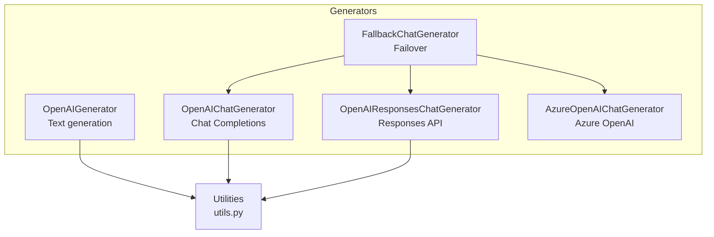
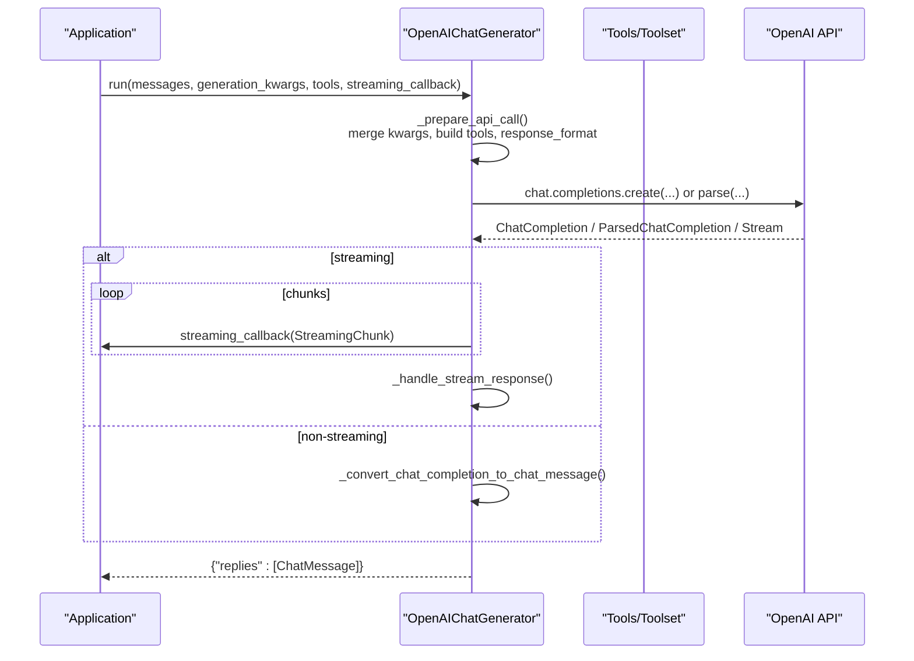
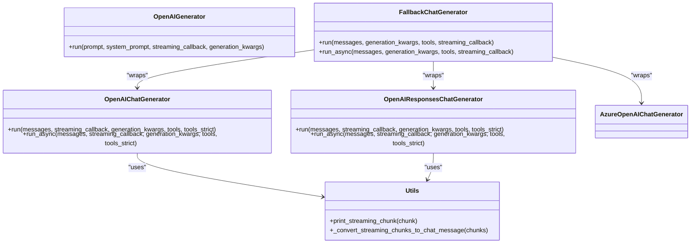

# OpenAI Generators

<cite>
**Referenced Files in This Document**
- [openai.py](file://haystack/components/generators/openai.py)
- [openai.py](file://haystack/components/generators/chat/openai.py)
- [openai_responses.py](file://haystack/components/generators/chat/openai_responses.py)
- [fallback.py](file://haystack/components/generators/chat/fallback.py)
- [utils.py](file://haystack/components/generators/utils.py)
- [protocol.py](file://haystack/components/generators/chat/types/protocol.py)
- [azure.py](file://haystack/components/generators/chat/azure.py)
- [test_openai.py](file://test/components/generators/test_openai.py)
- [test_openai.py](file://test/components/generators/chat/test_openai.py)
- [test_openai_responses.py](file://test/components/generators/chat/test_openai_responses.py)
- [test_azure.py](file://test/components/generators/chat/test_azure.py)
</cite>

## Table of Contents
1. [Introduction](#introduction)
2. [Project Structure](#project-structure)
3. [Core Components](#core-components)
4. [Architecture Overview](#architecture-overview)
5. [Detailed Component Analysis](#detailed-component-analysis)
6. [Dependency Analysis](#dependency-analysis)
7. [Performance Considerations](#performance-considerations)
8. [Troubleshooting Guide](#troubleshooting-guide)
9. [Conclusion](#conclusion)
10. [Appendices](#appendices)

## Introduction
This document explains the OpenAI generator components in Haystack: OpenAIGenerator, OpenAIChatGenerator, OpenAIResponsesChatGenerator, and FallbackChatGenerator. It covers their purposes, input/output parameters, configuration options, authentication, model selection, temperature settings, response formatting, streaming, rate limiting, cost management, provider-specific features (function/tool use and structured outputs), practical examples, and production best practices.

## Project Structure
The OpenAI-related generator components live under the generators module:
- Text generation: OpenAIGenerator (non-chat)
- Chat generation: OpenAIChatGenerator (standard Chat Completions)
- Responses API: OpenAIResponsesChatGenerator (reasoning, structured outputs, tool calls)
- Fallback orchestration: FallbackChatGenerator (retry/failover across multiple chat generators)
- Utilities: streaming helpers and conversion utilities
- Azure variant: AzureOpenAIChatGenerator (Azure OpenAI service)
- Type protocol: ChatGenerator interface contract

**Diagram sources**
- [openai.py](file://haystack/components/generators/openai.py#L31-L271)
- [openai.py](file://haystack/components/generators/chat/openai.py#L53-L725)
- [openai_responses.py](file://haystack/components/generators/chat/openai_responses.py#L46-L904)
- [fallback.py](file://haystack/components/generators/chat/fallback.py#L19-L246)
- [utils.py](file://haystack/components/generators/utils.py#L78-L172)
- [azure.py](file://haystack/components/generators/chat/azure.py#L27-L281)

**Section sources**
- [openai.py](file://haystack/components/generators/openai.py#L31-L271)
- [openai.py](file://haystack/components/generators/chat/openai.py#L53-L725)
- [openai_responses.py](file://haystack/components/generators/chat/openai_responses.py#L46-L904)
- [fallback.py](file://haystack/components/generators/chat/fallback.py#L19-L246)
- [utils.py](file://haystack/components/generators/utils.py#L78-L172)
- [azure.py](file://haystack/components/generators/chat/azure.py#L27-L281)

## Core Components
- OpenAIGenerator: Generates plain text from a string prompt. Supports streaming via callbacks and standard OpenAI parameters (e.g., temperature, max_completion_tokens).
- OpenAIChatGenerator: Chat completions with ChatMessage inputs/outputs, streaming, tools, structured outputs, and async support.
- OpenAIResponsesChatGenerator: Responses API with reasoning summaries, structured outputs, tool calls, and streaming (with limitations).
- FallbackChatGenerator: Wraps multiple chat generators and tries them sequentially until one succeeds, aggregating metadata about attempts.
- AzureOpenAIChatGenerator: Azure-hosted OpenAI models with endpoint, deployment, and optional Azure AD token provider support.

**Section sources**
- [openai.py](file://haystack/components/generators/openai.py#L31-L271)
- [openai.py](file://haystack/components/generators/chat/openai.py#L53-L725)
- [openai_responses.py](file://haystack/components/generators/chat/openai_responses.py#L46-L904)
- [fallback.py](file://haystack/components/generators/chat/fallback.py#L19-L246)
- [azure.py](file://haystack/components/generators/chat/azure.py#L27-L281)

## Architecture Overview
High-level flow for chat generation with tool calls and structured outputs:

**Diagram sources**
- [openai.py](file://haystack/components/generators/chat/openai.py#L300-L453)
- [openai.py](file://haystack/components/generators/chat/openai.py#L455-L515)
- [openai.py](file://haystack/components/generators/chat/openai.py#L517-L725)

## Detailed Component Analysis

### OpenAIGenerator
Purpose:
- Generate plain text from a string prompt using OpenAI models.
- Supports streaming via a callback and standard OpenAI parameters.

Key parameters:
- api_key: Secret via env var or explicit token.
- model: Model name (defaults to a specific model).
- streaming_callback: Callback receiving StreamingChunk.
- api_base_url, organization: Endpoint and org settings.
- system_prompt: Optional system prompt injected at runtime.
- generation_kwargs: Parameters forwarded to OpenAI (e.g., temperature, max_completion_tokens).
- timeout, max_retries: Client-level controls; can be set via env vars.
- http_client_kwargs: Configure httpx client.

Inputs:
- prompt: str
- system_prompt: optional str
- streaming_callback: optional callable
- generation_kwargs: optional dict

Outputs:
- replies: list[str]
- meta: list[dict] with model, index, finish_reason, usage

Streaming behavior:
- Enforced single response when streaming (n=1).
- Converts chunks to ChatMessage internally and returns text.

Authentication and environment:
- Uses OPENAI_API_KEY by default.
- Respects OPENAI_TIMEOUT and OPENAI_MAX_RETRIES.

Rate limiting and retries:
- Controlled by client-level max_retries and timeout.
- Retries handled by the OpenAI client.

Cost management:
- Monitor usage via meta["usage"].
- Tune temperature, max_completion_tokens, and stop sequences to reduce token consumption.

Practical example (text generation):
- Instantiate OpenAIGenerator with api_key and model.
- Call run(prompt) for non-streaming or pass streaming_callback for streaming.

**Section sources**
- [openai.py](file://haystack/components/generators/openai.py#L64-L143)
- [openai.py](file://haystack/components/generators/openai.py#L187-L271)
- [test_openai.py](file://test/components/generators/test_openai.py#L134-L200)

### OpenAIChatGenerator
Purpose:
- Chat completions with ChatMessage inputs/outputs.
- Supports streaming, tools, structured outputs, async execution, and warm-up hooks.

Key parameters:
- api_key, model, streaming_callback, api_base_url, organization, generation_kwargs, timeout, max_retries, tools, tools_strict, http_client_kwargs.

Supported models:
- Includes a curated list of supported model names.

Inputs:
- messages: list[ChatMessage]
- streaming_callback: optional callable
- generation_kwargs: optional dict
- tools: optional ToolsType or Toolset
- tools_strict: optional bool

Outputs:
- replies: list[ChatMessage] with text, tool_calls, reasoning, and meta (including finish_reason, usage).

Structured outputs:
- response_format accepts Pydantic models or JSON schema.
- Non-streaming: uses parse endpoint; streaming: uses create endpoint with response_format.

Tools:
- Converts Haystack Tool/Toolset definitions to OpenAI function tools.
- Supports strict schema adherence (tools_strict).
- Handles malformed tool call arguments gracefully.

Async support:
- run_async() mirrors run() with async streaming callback.

Streaming behavior:
- Converts chunks to StreamingChunk and reassembles into ChatMessage.
- Handles tool_calls deltas and reasoning deltas.

Authentication and environment:
- Uses OPENAI_API_KEY by default.
- Respects OPENAI_TIMEOUT and OPENAI_MAX_RETRIES.

Rate limiting and retries:
- Managed by client-level settings.

Cost management:
- Monitor usage via meta["usage"].
- Use response_format to reduce retries by guiding model output.

Practical example (chat completion):
- Prepare ChatMessage list.
- Optionally attach tools and response_format.
- Call run() or run_async() with streaming_callback for streaming.

**Section sources**
- [openai.py](file://haystack/components/generators/chat/openai.py#L117-L225)
- [openai.py](file://haystack/components/generators/chat/openai.py#L300-L453)
- [openai.py](file://haystack/components/generators/chat/openai.py#L455-L515)
- [openai.py](file://haystack/components/generators/chat/openai.py#L517-L725)
- [test_openai.py](file://test/components/generators/chat/test_openai.py#L188-L200)

### OpenAIResponsesChatGenerator
Purpose:
- Responses API integration with reasoning summaries, structured outputs, and tool calls.
- Supports streaming (with caveats) and async execution.

Key parameters:
- api_key, model, streaming_callback, api_base_url, organization, generation_kwargs, timeout, max_retries, tools, tools_strict, http_client_kwargs.

Generation kwargs highlights:
- reasoning: dict with effort, summary, generate_summary.
- text_format: Pydantic model or JSON schema for structured outputs.
- text: JSON schema for structured outputs (alternative to text_format).
- previous_response_id: Multi-turn conversations.

Inputs:
- messages: list[ChatMessage]
- streaming_callback: optional callable
- generation_kwargs: optional dict
- tools: optional ToolsType, Toolset, or OpenAI/MCP tool dicts
- tools_strict: optional bool

Outputs:
- replies: list[ChatMessage] with text, tool_calls, reasoning, and meta.

Streaming behavior:
- Streams reasoning, function_call names, function_call arguments, and text deltas.
- Reassembly into ChatMessage preserves reasoning and tool_calls.

Authentication and environment:
- Uses OPENAI_API_KEY by default.
- Respects OPENAI_TIMEOUT and OPENAI_MAX_RETRIES.

Notes:
- Structured outputs with streaming are not supported in this component.
- Tool calls are strict by default in Responses API; tools_strict can relax schema.

Practical example (reasoning + structured outputs):
- Set generation_kwargs with reasoning and text_format.
- Call run() or run_async() with streaming_callback.

**Section sources**
- [openai_responses.py](file://haystack/components/generators/chat/openai_responses.py#L77-L191)
- [openai_responses.py](file://haystack/components/generators/chat/openai_responses.py#L289-L432)
- [openai_responses.py](file://haystack/components/generators/chat/openai_responses.py#L434-L506)
- [openai_responses.py](file://haystack/components/generators/chat/openai_responses.py#L508-L706)
- [test_openai_responses.py](file://test/components/generators/chat/test_openai_responses.py#L104-L149)

### FallbackChatGenerator
Purpose:
- Sequentially tries multiple chat generators until one succeeds.
- Aggregates metadata about attempts and failures.

Behavior:
- Accepts a non-empty list of ChatGenerator components.
- For each generator, forwards messages, generation_kwargs, tools, and streaming_callback.
- On failure, logs and continues to next generator.
- Raises RuntimeError if all fail.

Async support:
- run_async() tries generators concurrently via asyncio if available.

Metadata:
- successful_chat_generator_index, successful_chat_generator_class, total_attempts, failed_chat_generators.

Practical example (failover):
- Wrap OpenAIChatGenerator, AzureOpenAIChatGenerator, and others.
- Call run() or run_async() and rely on automatic failover.

**Section sources**
- [fallback.py](file://haystack/components/generators/chat/fallback.py#L19-L246)
- [protocol.py](file://haystack/components/generators/chat/types/protocol.py#L10-L32)

### AzureOpenAIChatGenerator
Purpose:
- Azure-hosted OpenAI models with endpoint, deployment, and optional Azure AD token provider.

Key parameters:
- azure_endpoint, api_version, azure_deployment, api_key, azure_ad_token, organization, streaming_callback, timeout, max_retries, generation_kwargs, default_headers, tools, tools_strict, azure_ad_token_provider, http_client_kwargs.

Authentication:
- Supports API key or Azure AD token.
- Validates presence of endpoint and credentials.

Model selection:
- Uses azure_deployment as model identifier.

Practical example (Azure):
- Provide azure_endpoint and azure_deployment.
- Optionally set azure_ad_token_provider for dynamic tokens.

**Section sources**
- [azure.py](file://haystack/components/generators/chat/azure.py#L74-L204)
- [azure.py](file://haystack/components/generators/chat/azure.py#L206-L281)
- [test_azure.py](file://test/components/generators/chat/test_azure.py#L77-L131)

## Dependency Analysis
Relationships among components and utilities:

**Diagram sources**
- [openai.py](file://haystack/components/generators/openai.py#L31-L271)
- [openai.py](file://haystack/components/generators/chat/openai.py#L53-L725)
- [openai_responses.py](file://haystack/components/generators/chat/openai_responses.py#L46-L904)
- [fallback.py](file://haystack/components/generators/chat/fallback.py#L19-L246)
- [utils.py](file://haystack/components/generators/utils.py#L78-L172)

**Section sources**
- [openai.py](file://haystack/components/generators/openai.py#L31-L271)
- [openai.py](file://haystack/components/generators/chat/openai.py#L53-L725)
- [openai_responses.py](file://haystack/components/generators/chat/openai_responses.py#L46-L904)
- [fallback.py](file://haystack/components/generators/chat/fallback.py#L19-L246)
- [utils.py](file://haystack/components/generators/utils.py#L78-L172)

## Performance Considerations
- Streaming vs. non-streaming:
  - Streaming reduces perceived latency but increases overhead; ensure streaming_callback is efficient.
  - For multiple responses (n>1), streaming is disallowed in OpenAIGenerator and OpenAIChatGenerator.
- Token control:
  - Use max_completion_tokens and stop sequences to bound cost and latency.
  - For structured outputs, response_format reduces retries and improves determinism.
- Concurrency:
  - Prefer run_async() for I/O-bound workloads.
  - FallbackChatGenerator can improve availability; ensure generators implement timeouts.
- Network tuning:
  - Adjust timeout and max_retries via environment variables or constructor parameters.
  - Use http_client_kwargs to configure proxies and TLS verification.

[No sources needed since this section provides general guidance]

## Troubleshooting Guide
Common issues and resolutions:
- Missing API key:
  - Ensure OPENAI_API_KEY (or AZURE_OPENAI_API_KEY/AZURE_OPENAI_AD_TOKEN for Azure) is set.
- Streaming conflicts:
  - n>1 is incompatible with streaming; set n=1 when streaming.
- Malformed tool call arguments:
  - The components log warnings and skip malformed tool calls; enable tools_strict to enforce strict schema.
- Rate limits and server errors:
  - Configure max_retries and timeout; consider FallbackChatGenerator for resilience.
- Cost spikes:
  - Monitor meta["usage"] and tune temperature, max_completion_tokens, and stop conditions.
- Structured outputs:
  - For OpenAIChatGenerator, non-streaming parse endpoint is used; streaming requires JSON schema (not Pydantic model).
  - For OpenAIResponsesChatGenerator, structured outputs with streaming are not supported.

**Section sources**
- [openai.py](file://haystack/components/generators/chat/openai.py#L553-L567)
- [openai.py](file://haystack/components/generators/chat/openai.py#L589-L600)
- [openai.py](file://haystack/components/generators/chat/openai.py#L470-L471)
- [openai.py](file://haystack/components/generators/openai.py#L242-L243)
- [openai_responses.py](file://haystack/components/generators/chat/openai_responses.py#L128-L133)
- [fallback.py](file://haystack/components/generators/chat/fallback.py#L41-L47)

## Conclusion
Haystack’s OpenAI generator suite offers flexible, production-ready building blocks for text generation, chat, reasoning, and tool use. Choose the appropriate generator based on your needs: OpenAIGenerator for simple text, OpenAIChatGenerator for chat with tools and structured outputs, OpenAIResponsesChatGenerator for reasoning and Responses API features, and FallbackChatGenerator for resilient multi-provider deployments. Combine these with careful configuration of timeouts, retries, and structured outputs to achieve reliability and cost efficiency.

[No sources needed since this section summarizes without analyzing specific files]

## Appendices

### Practical Examples Index
- Text generation with OpenAIGenerator:
  - [test_openai.py](file://test/components/generators/test_openai.py#L134-L200)
- Chat completion with OpenAIChatGenerator:
  - [test_openai.py](file://test/components/generators/chat/test_openai.py#L188-L200)
- Structured outputs with OpenAIChatGenerator:
  - [test_openai.py](file://test/components/generators/chat/test_openai.py#L120-L152)
- Reasoning and structured outputs with OpenAIResponsesChatGenerator:
  - [test_openai_responses.py](file://test/components/generators/chat/test_openai_responses.py#L104-L149)
- Azure OpenAI deployment:
  - [test_azure.py](file://test/components/generators/chat/test_azure.py#L77-L131)

### Streaming Callback Utility
- print_streaming_chunk displays tool calls, tool results, assistant text, and reasoning during streaming.
- Used in tests and examples to visualize streaming behavior.

**Section sources**
- [utils.py](file://haystack/components/generators/utils.py#L13-L76)
- [test_openai.py](file://test/components/generators/test_openai.py#L145-L184)
- [test_openai.py](file://test/components/generators/chat/test_openai.py#L73-L109)
- [test_openai_responses.py](file://test/components/generators/chat/test_openai_responses.py#L87-L102)