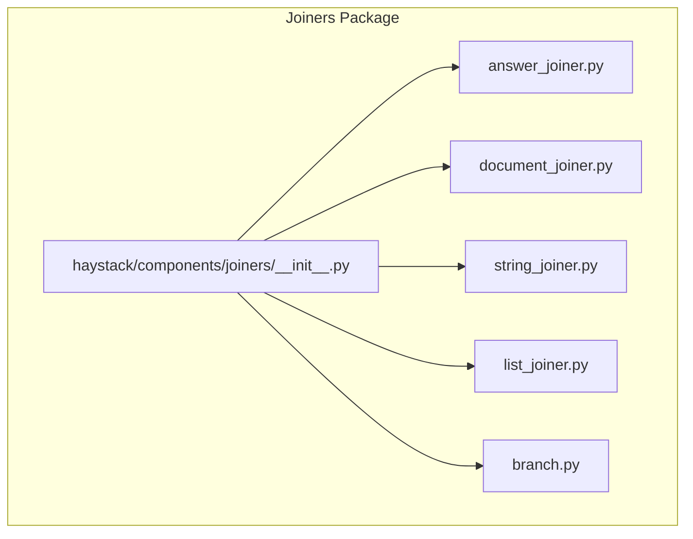
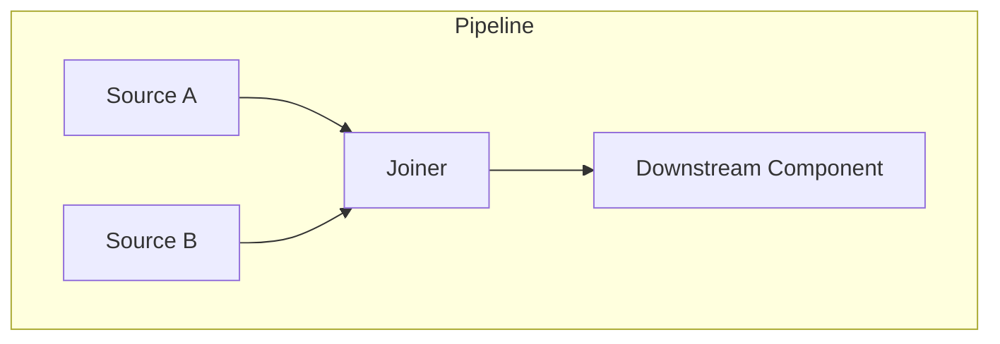
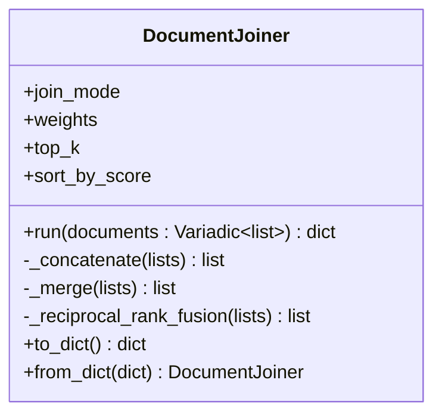
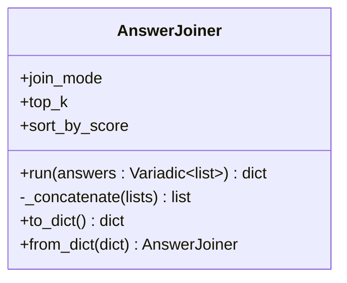
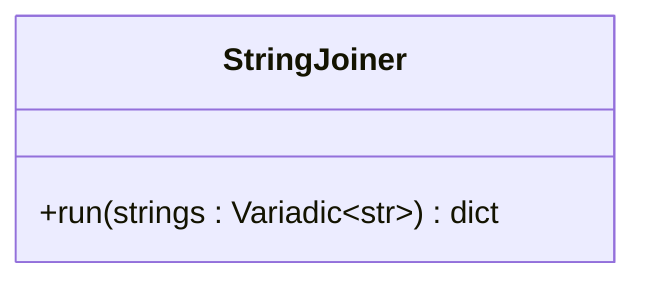
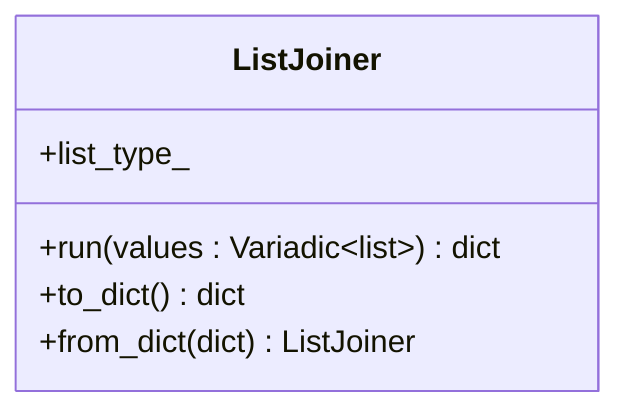
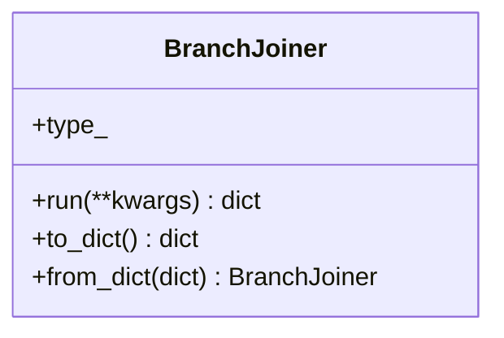
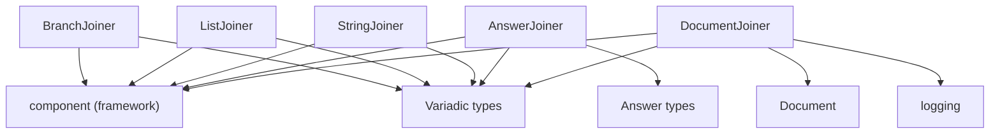

# Joiners

<cite>
**Referenced Files in This Document**
- [__init__.py](file://haystack/components/joiners/__init__.py)
- [answer_joiner.py](file://haystack/components/joiners/answer_joiner.py)
- [document_joiner.py](file://haystack/components/joiners/document_joiner.py)
- [string_joiner.py](file://haystack/components/joiners/string_joiner.py)
- [list_joiner.py](file://haystack/components/joiners/list_joiner.py)
- [branch.py](file://haystack/components/joiners/branch.py)
- [joiners_api.yml](file://pydoc/joiners_api.yml)
- [test_answer_joiner.py](file://test/components/joiners/test_answer_joiner.py)
- [test_document_joiner.py](file://test/components/joiners/test_document_joiner.py)
- [test_string_joiner.py](file://test/components/joiners/test_string_joiner.py)
- [test_list_joiner.py](file://test/components/joiners/test_list_joiner.py)
- [test_branch_joiner.py](file://test/components/joiners/test_branch_joiner.py)
</cite>

## Table of Contents
1. [Introduction](#introduction)
2. [Project Structure](#project-structure)
3. [Core Components](#core-components)
4. [Architecture Overview](#architecture-overview)
5. [Detailed Component Analysis](#detailed-component-analysis)
6. [Dependency Analysis](#dependency-analysis)
7. [Performance Considerations](#performance-considerations)
8. [Troubleshooting Guide](#troubleshooting-guide)
9. [Conclusion](#conclusion)
10. [Appendices](#appendices)

## Introduction
This document explains Haystack’s joiner components that combine outputs from multiple pipeline branches or sources into unified structures. It covers the major families:
- Document joiners: merge and rank multiple document lists using configurable strategies.
- String joiners: collect strings from various components into a single list.
- List joiners: flatten multiple lists of the same or mixed types into one flat list.
- Answer joiners: combine multiple lists of answers into a single ordered list.
- Branch joiners: reconcile multiple pipeline branches into a single output stream.

It details interfaces, input/output parameters, joining strategies, conflict resolution, ordering, performance, and best practices for selecting and tuning joiners in real-world pipelines.

## Project Structure
The joiners are organized under a dedicated package with lazy imports and a central API definition. The package exposes five primary joiner types, each implementing a simple component interface with a run method and optional serialization support.

**Diagram sources**
- [__init__.py](file://haystack/components/joiners/__init__.py#L10-L26)

**Section sources**
- [__init__.py](file://haystack/components/joiners/__init__.py#L1-L27)
- [joiners_api.yml](file://pydoc/joiners_api.yml#L1-L13)

## Core Components
This section summarizes each joiner family, their purpose, and typical use cases.

- DocumentJoiner
  - Purpose: Merge multiple lists of documents into one list using configurable strategies.
  - Strategies: concatenate, merge, reciprocal rank fusion (RRF), distribution-based rank fusion (DBSF).
  - Typical use: Combine BM25 and embedding retriever results; deduplicate and optionally re-rank.
  - Key parameters: join_mode, weights, top_k, sort_by_score.

- AnswerJoiner
  - Purpose: Combine multiple lists of answers (generated or extracted) into a single list.
  - Strategy: concatenate (flattens inputs).
  - Typical use: Aggregate outputs from multiple LLMs or extractors before a single reader or formatter.
  - Key parameters: join_mode, top_k, sort_by_score.

- StringJoiner
  - Purpose: Collect strings from different components into a list of strings.
  - Typical use: Gather prompts or text fragments from multiple PromptBuilder outputs.
  - Key parameters: none (variadic string inputs).

- ListJoiner
  - Purpose: Flatten multiple lists of the same or mixed types into one flat list.
  - Typical use: Merge heterogeneous lists (e.g., ChatMessage and GeneratedAnswer) into a single list.
  - Key parameters: list_type_ (optional type hint for type safety).

- BranchJoiner
  - Purpose: Merge multiple pipeline branches into a single output stream by forwarding the first received value.
  - Typical use: Converge router-driven branches or handle loopbacks after validation.
  - Key parameters: type_ (data type for input/output).

**Section sources**
- [document_joiner.py](file://haystack/components/joiners/document_joiner.py#L44-L85)
- [answer_joiner.py](file://haystack/components/joiners/answer_joiner.py#L41-L85)
- [string_joiner.py](file://haystack/components/joiners/string_joiner.py#L10-L40)
- [list_joiner.py](file://haystack/components/joiners/list_joiner.py#L13-L65)
- [branch.py](file://haystack/components/joiners/branch.py#L12-L86)

## Architecture Overview
The joiners follow a consistent component pattern: they accept variadic inputs via the component framework, process them according to their strategy, and return a single structured output. They integrate seamlessly into pipelines and support serialization/deserialization.

[No sources needed since this diagram shows conceptual workflow, not actual code structure]

## Detailed Component Analysis

### DocumentJoiner
DocumentJoiner merges multiple lists of documents using four strategies:
- concatenate: Deduplicates by ID, keeps the highest-scoring document per ID.
- merge: Computes a weighted sum of scores for duplicates and merges them.
- reciprocal_rank_fusion: Scores are aggregated using a reciprocal-rank formula with normalization.
- distribution_based_rank_fusion: Rescales scores per list using mean and stddev, then picks the highest per ID.

**Diagram sources**
- [document_joiner.py](file://haystack/components/joiners/document_joiner.py#L44-L128)

Key behaviors:
- Duplicate handling: By ID; highest score retained for concatenate; weighted sum for merge.
- Ranking: Optional global sorting by score; documents without scores treated as -infinity.
- Normalization: RRF scores normalized by the maximum possible score for fair comparison.
- Ordering: Output preserves deterministic order; top_k trims results.

Common use cases:
- Hybrid retrieval: Combine BM25 and dense retriever outputs.
- Ensemble reranking: Merge multiple candidate sets with weights or fusion.

Conflict resolution:
- concatenate: Highest score wins.
- merge: Weighted aggregation.
- RRF: Rank-based fusion with tunable weights.
- DBSF: Per-list score normalization then highest-per-ID selection.

**Section sources**
- [document_joiner.py](file://haystack/components/joiners/document_joiner.py#L87-L161)
- [document_joiner.py](file://haystack/components/joiners/document_joiner.py#L163-L256)
- [test_document_joiner.py](file://test/components/joiners/test_document_joiner.py#L120-L190)
- [test_document_joiner.py](file://test/components/joiners/test_document_joiner.py#L191-L249)
- [test_document_joiner.py](file://test/components/joiners/test_document_joiner.py#L274-L313)

### AnswerJoiner
AnswerJoiner flattens multiple lists of answers into a single list. Sorting by score and top-k trimming are supported.

**Diagram sources**
- [answer_joiner.py](file://haystack/components/joiners/answer_joiner.py#L41-L111)

Behavior:
- Current strategy: concatenate (flattens inputs).
- Sorting: Descending by score; documents without scores placed last.
- Trimming: top_k applied after sorting.

Typical use:
- Aggregating answers from multiple generators or extractors before a single reader or formatter.

**Section sources**
- [answer_joiner.py](file://haystack/components/joiners/answer_joiner.py#L87-L139)
- [test_answer_joiner.py](file://test/components/joiners/test_answer_joiner.py#L83-L97)

### StringJoiner
StringJoiner collects strings from multiple components into a single list. It simply forwards inputs as-is.

**Diagram sources**
- [string_joiner.py](file://haystack/components/joiners/string_joiner.py#L10-L56)

Typical use:
- Gathering prompts or text fragments from multiple PromptBuilder outputs.

**Section sources**
- [string_joiner.py](file://haystack/components/joiners/string_joiner.py#L42-L56)
- [test_string_joiner.py](file://test/components/joiners/test_string_joiner.py#L24-L37)

### ListJoiner
ListJoiner flattens multiple lists into one flat list. An optional type hint ensures type safety for downstream components.

**Diagram sources**
- [list_joiner.py](file://haystack/components/joiners/list_joiner.py#L13-L102)

Behavior:
- Flattening: Uses chained iteration to produce a single list.
- Type safety: Optional list_type_ enforces uniform list element types at runtime wiring.

Typical use:
- Merging heterogeneous lists (e.g., ChatMessage and GeneratedAnswer) into a single list for downstream processing.

**Section sources**
- [list_joiner.py](file://haystack/components/joiners/list_joiner.py#L67-L112)
- [test_list_joiner.py](file://test/components/joiners/test_list_joiner.py#L89-L120)

### BranchJoiner
BranchJoiner merges multiple pipeline branches into a single output by forwarding the first received value. It enforces a single input to maintain deterministic convergence.

**Diagram sources**
- [branch.py](file://haystack/components/joiners/branch.py#L12-L129)

Behavior:
- Single-input enforcement: Raises if zero or more than one input is provided.
- Forwarding: Returns the first input value as the output.

Typical use:
- Converging router-driven branches or handling loopbacks after validation.

**Section sources**
- [branch.py](file://haystack/components/joiners/branch.py#L88-L129)
- [test_branch_joiner.py](file://test/components/joiners/test_branch_joiner.py#L28-L31)

## Dependency Analysis
Joiners depend on the component framework and shared types. DocumentJoiner additionally logs informational messages when sorting documents without scores.

**Diagram sources**
- [document_joiner.py](file://haystack/components/joiners/document_joiner.py#L12-L15)
- [answer_joiner.py](file://haystack/components/joiners/answer_joiner.py#L11-L13)
- [string_joiner.py](file://haystack/components/joiners/string_joiner.py#L6-L7)
- [list_joiner.py](file://haystack/components/joiners/list_joiner.py#L8-L10)
- [branch.py](file://haystack/components/joiners/branch.py#L7-L9)

**Section sources**
- [document_joiner.py](file://haystack/components/joiners/document_joiner.py#L12-L15)
- [answer_joiner.py](file://haystack/components/joiners/answer_joiner.py#L11-L13)
- [string_joiner.py](file://haystack/components/joiners/string_joiner.py#L6-L7)
- [list_joiner.py](file://haystack/components/joiners/list_joiner.py#L8-L10)
- [branch.py](file://haystack/components/joiners/branch.py#L7-L9)

## Performance Considerations
- Complexity
  - DocumentJoiner concatenate: O(N) to group by ID plus O(M) to select best per ID, where N is total items and M is unique IDs.
  - DocumentJoiner merge: O(N) to accumulate weighted scores plus O(M) to rebuild list.
  - DocumentJoiner RRF: O(N) to compute weighted reciprocal ranks plus O(M) to normalize and rebuild.
  - DocumentJoiner DBSF: O(N) to rescale per list plus O(N) to pick best per ID.
  - AnswerJoiner concatenate: O(N) to flatten.
  - StringJoiner: O(N) to build list.
  - ListJoiner: O(N) to chain inputs.
  - BranchJoiner: O(1) to forward the first value.
- Memory
  - DocumentJoiner strategies that merge or fuse allocate maps for scores and documents; memory scales with unique IDs.
  - ListJoiner allocates a single flat list; memory scales linearly with total inputs.
  - Answer/String/Branch joiners allocate minimal intermediate structures proportional to input counts.
- Sorting and trimming
  - Sorting by score adds O(M log M) overhead; top_k reduces output size to K.
- Recommendations
  - Prefer concatenate for simple deduplication and minimal overhead.
  - Use merge or RRF when combining multiple ranked sources; tune weights to emphasize trusted sources.
  - Use DBSF when lists have different score distributions; it normalizes per-list scales.
  - Limit top_k early to reduce downstream processing cost.
  - Avoid unnecessary sorting when order preservation is acceptable.

[No sources needed since this section provides general guidance]

## Troubleshooting Guide
- Unsupported join mode
  - DocumentJoiner raises a ValueError for unknown modes; ensure join_mode is one of the supported values.
  - AnswerJoiner raises a ValueError for unknown modes; currently supports concatenate.
- Empty inputs
  - All joiners handle empty lists gracefully and return empty outputs.
- Sorting documents without scores
  - DocumentJoiner logs an info message indicating documents with missing scores are treated as -infinity during sorting.
- BranchJoiner input count
  - BranchJoiner enforces exactly one input; multiple or zero inputs raise a ValueError.
- Pipeline wiring
  - ListJoiner requires compatible types when list_type_ is set; mismatches cause connection errors.
  - Ensure downstream components expect the correct output type (e.g., list vs single item).

**Section sources**
- [document_joiner.py](file://haystack/components/joiners/document_joiner.py#L31-L41)
- [answer_joiner.py](file://haystack/components/joiners/answer_joiner.py#L28-L38)
- [document_joiner.py](file://haystack/components/joiners/document_joiner.py#L150-L154)
- [branch.py](file://haystack/components/joiners/branch.py#L127-L128)
- [test_list_joiner.py](file://test/components/joiners/test_list_joiner.py#L121-L156)

## Conclusion
Haystack’s joiners provide flexible mechanisms to combine pipeline outputs across documents, answers, strings, lists, and branches. Select strategies based on data characteristics and pipeline goals:
- Use DocumentJoiner with concatenate for fast deduplication, merge for weighted aggregation, RRF for robust rank fusion, or DBSF for normalized comparisons.
- Use AnswerJoiner to unify answer lists and optionally sort by score.
- Use StringJoiner to collect textual fragments.
- Use ListJoiner to flatten heterogeneous lists safely with optional type hints.
- Use BranchJoiner to converge branches deterministically.

Tune parameters like weights, top_k, and sort_by_score to balance quality, performance, and memory usage.

[No sources needed since this section summarizes without analyzing specific files]

## Appendices

### Practical Pipeline Patterns
- Hybrid retrieval with DocumentJoiner
  - Connect BM25 and embedding retrievers to a single DocumentJoiner; configure join_mode to merge or RRF; apply top_k and sort_by_score.
- Multi-generator answer aggregation with AnswerJoiner
  - Route outputs from multiple generators to AnswerJoiner; optionally sort by score and limit top_k.
- Prompt assembly with StringJoiner
  - Connect multiple PromptBuilder outputs to StringJoiner; forward the resulting list to a generator or writer.
- Mixed-type list merging with ListJoiner
  - Merge lists of different element types (e.g., ChatMessage and GeneratedAnswer) into a single list for downstream processing.
- Loop handling with BranchJoiner
  - After validation or error handling, feed the corrected data back into BranchJoiner to converge branches before continuing.

[No sources needed since this section provides general guidance]