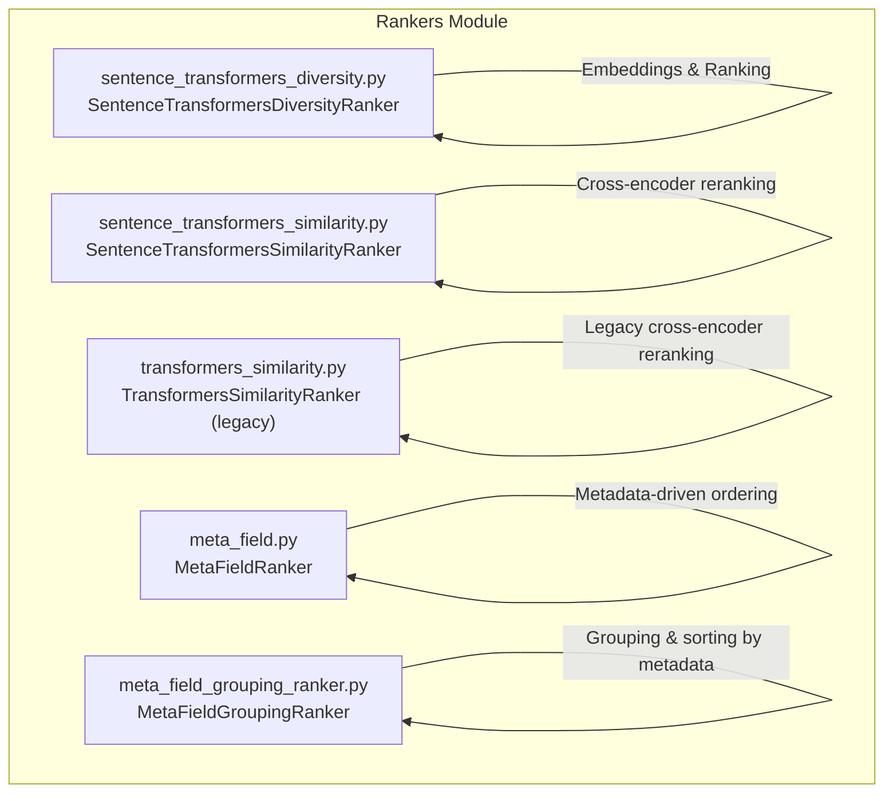
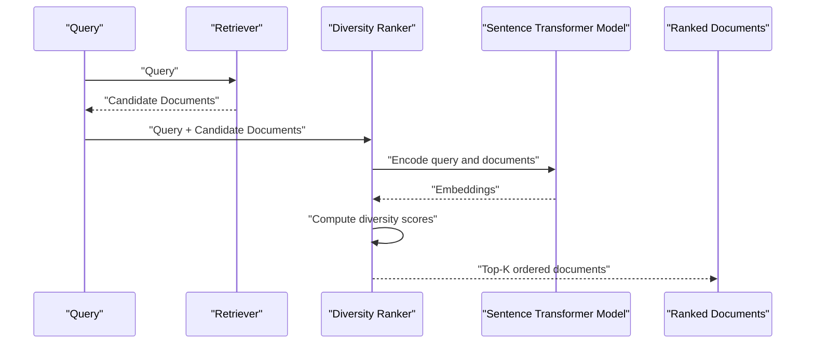
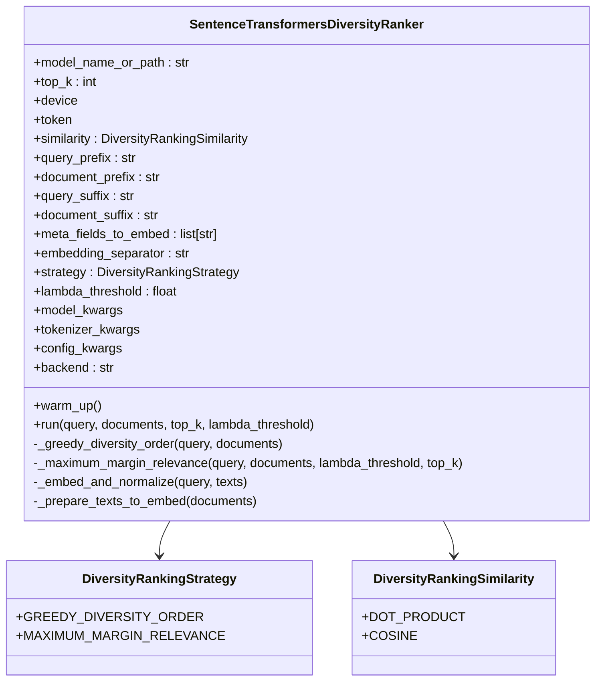
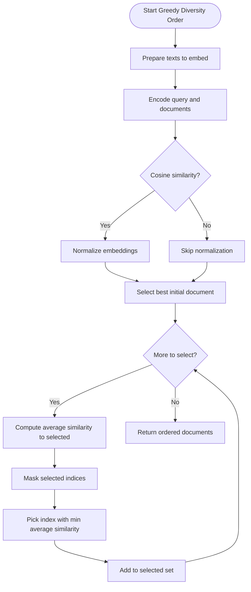
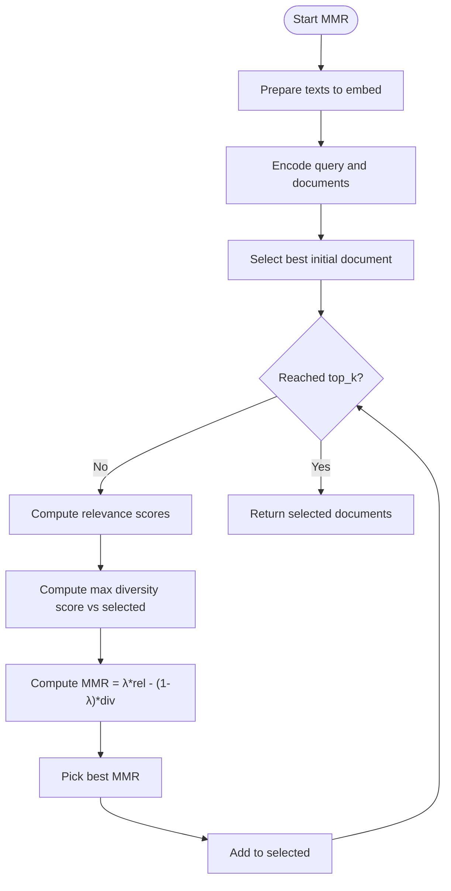
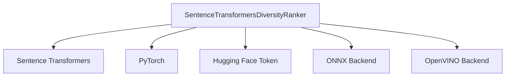

# Diversity Rankers

<cite>
**Referenced Files in This Document**
- [sentence_transformers_diversity.py](file://haystack/components/rankers/sentence_transformers_diversity.py)
- [test_sentence_transformers_diversity.py](file://test/components/rankers/test_sentence_transformers_diversity.py)
- [sentence_transformers_similarity.py](file://haystack/components/rankers/sentence_transformers_similarity.py)
- [transformers_similarity.py](file://haystack/components/rankers/transformers_similarity.py)
- [meta_field.py](file://haystack/components/rankers/meta_field.py)
- [meta_field_grouping_ranker.py](file://haystack/components/rankers/meta_field_grouping_ranker.py)
- [__init__.py](file://haystack/components/rankers/__init__.py)
</cite>

## Table of Contents
1. [Introduction](#introduction)
2. [Project Structure](#project-structure)
3. [Core Components](#core-components)
4. [Architecture Overview](#architecture-overview)
5. [Detailed Component Analysis](#detailed-component-analysis)
6. [Dependency Analysis](#dependency-analysis)
7. [Performance Considerations](#performance-considerations)
8. [Troubleshooting Guide](#troubleshooting-guide)
9. [Conclusion](#conclusion)
10. [Appendices](#appendices)

## Introduction
This document explains the diversity-based ranking capabilities in Haystack, focusing on the SentenceTransformersDiversityRanker. It covers how the component maximizes diversity in ranked results, the diversity scoring mechanisms, the Maximum Margin Relevance (MMR) algorithm, and practical strategies for balancing relevance and variety. It also provides guidance on configuration, parameter tuning, integration with retrieval components, and performance best practices.

## Project Structure
The diversity ranking functionality resides in the rankers module alongside other ranking components. The SentenceTransformersDiversityRanker is complemented by similarity-based rankers and metadata-based rankers that can be combined in pipelines.

**Diagram sources**
- [sentence_transformers_diversity.py](file://haystack/components/rankers/sentence_transformers_diversity.py#L74-L428)
- [sentence_transformers_similarity.py](file://haystack/components/rankers/sentence_transformers_similarity.py#L21-L296)
- [transformers_similarity.py](file://haystack/components/rankers/transformers_similarity.py#L25-L327)
- [meta_field.py](file://haystack/components/rankers/meta_field.py#L19-L429)
- [meta_field_grouping_ranker.py](file://haystack/components/rankers/meta_field_grouping_ranker.py#L13-L123)

**Section sources**
- [__init__.py](file://haystack/components/rankers/__init__.py#L10-L34)

## Core Components
- SentenceTransformersDiversityRanker: Implements two diversity strategies:
  - Greedy Diversity Order: Maximizes overall diversity by iteratively selecting documents that minimize average similarity to already selected documents.
  - Maximum Margin Relevance (MMR): Balances relevance to the query and diversity from already selected documents using a tunable trade-off parameter.
- Supporting rankers:
  - SentenceTransformersSimilarityRanker: Cross-encoder reranking for strong relevance scoring.
  - TransformersSimilarityRanker: Legacy cross-encoder reranking (deprecated in favor of SentenceTransformersSimilarityRanker).
  - MetaFieldRanker and MetaFieldGroupingRanker: Metadata-driven ranking and grouping strategies that can be combined with diversity ranking.

Key capabilities:
- Embedding-based ranking using Sentence Transformers.
- Configurable similarity metrics (dot product or cosine).
- Prefix/suffix injection for query/document text.
- Optional metadata embedding via concatenation.
- Backend selection (torch, ONNX, OpenVINO) for model acceleration.
- Deduplication by document ID with score retention.

**Section sources**
- [sentence_transformers_diversity.py](file://haystack/components/rankers/sentence_transformers_diversity.py#L74-L195)
- [sentence_transformers_similarity.py](file://haystack/components/rankers/sentence_transformers_similarity.py#L21-L141)
- [transformers_similarity.py](file://haystack/components/rankers/transformers_similarity.py#L25-L148)
- [meta_field.py](file://haystack/components/rankers/meta_field.py#L19-L108)
- [meta_field_grouping_ranker.py](file://haystack/components/rankers/meta_field_grouping_ranker.py#L13-L74)

## Architecture Overview
The diversity ranker integrates into pipelines as a post-retrieval or post-reranking stage. It can be used independently or chained with other rankers and metadata-based components.

**Diagram sources**
- [sentence_transformers_diversity.py](file://haystack/components/rankers/sentence_transformers_diversity.py#L389-L428)

## Detailed Component Analysis

### SentenceTransformersDiversityRanker
Implements two strategies for diversity-aware ranking:
- Greedy Diversity Order: Starts with the most similar document to the query, then iteratively selects the next document that minimizes average similarity to the already selected set.
- Maximum Margin Relevance (MMR): Iteratively selects documents that maximize a trade-off between relevance to the query and diversity from previously selected documents, controlled by a lambda threshold parameter.

**Diagram sources**
- [sentence_transformers_diversity.py](file://haystack/components/rankers/sentence_transformers_diversity.py#L19-L195)

#### Greedy Diversity Order
- Embeddings are computed for query and candidate documents.
- Starts with the most similar document to the query.
- Iteratively selects the next document that minimizes the average similarity to the already selected set.
- Normalizes embeddings when using cosine similarity.

**Diagram sources**
- [sentence_transformers_diversity.py](file://haystack/components/rankers/sentence_transformers_diversity.py#L276-L320)

**Section sources**
- [sentence_transformers_diversity.py](file://haystack/components/rankers/sentence_transformers_diversity.py#L276-L333)

#### Maximum Margin Relevance (MMR)
- Computes relevance as the similarity between the query and each candidate.
- Diversity is measured as the maximum similarity between the candidate and any already selected document.
- The MMR score balances relevance and diversity using a lambda threshold:
  - lambda near 0: favors diversity.
  - lambda near 1: favors relevance.
- Iteratively selects the candidate with the highest MMR score until top_k is reached.

**Diagram sources**
- [sentence_transformers_diversity.py](file://haystack/components/rankers/sentence_transformers_diversity.py#L335-L381)

**Section sources**
- [sentence_transformers_diversity.py](file://haystack/components/rankers/sentence_transformers_diversity.py#L335-L386)

#### Input Parameters and Behavior
- model: Sentence Transformers model identifier or path.
- top_k: Number of top documents to return.
- device: Target device for model execution.
- token: Hugging Face token for private models.
- similarity: "dot_product" or "cosine".
- query_prefix/query_suffix: Text prepended/appended to the query before encoding.
- document_prefix/document_suffix: Text prepended/appended to each document before encoding.
- meta_fields_to_embed: Metadata keys to include in the embedding text.
- embedding_separator: Separator used to join metadata and content.
- strategy: "greedy_diversity_order" or "maximum_margin_relevance".
- lambda_threshold: Trade-off parameter for MMR (0–1).
- model_kwargs/tokenizer_kwargs/config_kwargs: Model loading parameters.
- backend: "torch", "onnx", or "openvino".

Validation and defaults:
- top_k must be positive; otherwise raises an error.
- lambda_threshold must be within [0, 1] when using MMR strategy.
- Unknown strategy or similarity values raise errors.

**Section sources**
- [sentence_transformers_diversity.py](file://haystack/components/rankers/sentence_transformers_diversity.py#L115-L195)
- [sentence_transformers_diversity.py](file://haystack/components/rankers/sentence_transformers_diversity.py#L383-L428)

#### Practical Configuration Examples
- Greedy diversity order:
  - Use when you want a diverse set that maximizes variety across candidates.
  - Good for exploratory search or content discovery.
- MMR with lambda_threshold tuned:
  - lambda ≈ 0: highly diverse, may reduce immediate relevance.
  - lambda ≈ 1: highly relevant, may reduce variety.
  - lambda ≈ 0.5: balanced relevance and diversity.

Integration tips:
- Combine with retrieval components to diversify candidate sets.
- Use meta_fields_to_embed to incorporate metadata signals (e.g., freshness, category) into diversity computation.
- Adjust top_k to control output size and downstream processing cost.

**Section sources**
- [test_sentence_transformers_diversity.py](file://test/components/rankers/test_sentence_transformers_diversity.py#L514-L700)

#### Related Rankers and Metadata Strategies
- SentenceTransformersSimilarityRanker: Cross-encoder reranking for strong relevance scoring; can be used before diversity ranking to refine candidate relevance.
- TransformersSimilarityRanker: Legacy cross-encoder reranking (deprecated).
- MetaFieldRanker: Metadata-driven ranking with modes like reciprocal rank fusion or linear score; can be combined with diversity ranking.
- MetaFieldGroupingRanker: Groups and sorts documents by metadata keys; useful for presentation or downstream processing after diversity ranking.

**Section sources**
- [sentence_transformers_similarity.py](file://haystack/components/rankers/sentence_transformers_similarity.py#L21-L141)
- [transformers_similarity.py](file://haystack/components/rankers/transformers_similarity.py#L25-L148)
- [meta_field.py](file://haystack/components/rankers/meta_field.py#L19-L108)
- [meta_field_grouping_ranker.py](file://haystack/components/rankers/meta_field_grouping_ranker.py#L13-L74)

## Dependency Analysis
- Internal dependencies:
  - Uses Sentence Transformers for embeddings.
  - Uses PyTorch tensors for efficient similarity computations.
  - Utilizes Haystack utilities for device management and serialization.
- External dependencies:
  - Sentence Transformers library for model loading and encoding.
  - Hugging Face token support for private models.
  - Optional ONNX/OpenVINO backends for acceleration.

**Diagram sources**
- [sentence_transformers_diversity.py](file://haystack/components/rankers/sentence_transformers_diversity.py#L14-L16)
- [sentence_transformers_diversity.py](file://haystack/components/rankers/sentence_transformers_diversity.py#L202-L210)

**Section sources**
- [sentence_transformers_diversity.py](file://haystack/components/rankers/sentence_transformers_diversity.py#L14-L210)

## Performance Considerations
- Embedding cost:
  - Greedy diversity order computes pairwise similarities incrementally; complexity grows with the number of candidates.
  - MMR iterates over candidates and compares against selected set; complexity increases with candidate count and top_k.
- Backend acceleration:
  - Backend selection ("torch", "onnx", "openvino") affects latency and throughput.
  - ONNX/OpenVINO backends can reduce latency on CPU/GPU deployments.
- Batch sizing and device:
  - Larger top_k increases memory and compute load.
  - Using GPU accelerates embedding and similarity computations.
- Normalization overhead:
  - Cosine normalization adds extra compute; consider dot product when acceptable.

Best practices:
- Tune top_k to limit downstream processing costs.
- Prefer ONNX/OpenVINO backends for production deployments.
- Use meta_fields_to_embed judiciously to avoid excessive text lengths.
- Warm up the model before heavy inference to avoid cold-start latency.

[No sources needed since this section provides general guidance]

## Troubleshooting Guide
Common issues and resolutions:
- Invalid similarity or strategy:
  - The component validates similarity and strategy strings; unknown values raise errors.
- Invalid top_k:
  - top_k must be > 0; otherwise raises an error.
- Lambda threshold out of range:
  - When using MMR, lambda must be within [0, 1]; otherwise raises an error.
- Empty or minimal document sets:
  - The component handles empty inputs gracefully and returns an empty list.
- Deduplication behavior:
  - Documents with duplicate IDs are deduplicated, keeping the one with the highest score if present.

**Section sources**
- [sentence_transformers_diversity.py](file://haystack/components/rankers/sentence_transformers_diversity.py#L238-L241)
- [sentence_transformers_diversity.py](file://haystack/components/rankers/sentence_transformers_diversity.py#L383-L386)
- [sentence_transformers_diversity.py](file://haystack/components/rankers/sentence_transformers_diversity.py#L417-L418)
- [test_sentence_transformers_diversity.py](file://test/components/rankers/test_sentence_transformers_diversity.py#L238-L254)
- [test_sentence_transformers_diversity.py](file://test/components/rankers/test_sentence_transformers_diversity.py#L354-L386)

## Conclusion
The SentenceTransformersDiversityRanker offers robust mechanisms to promote diversity in ranked results. Its greedy diversity order and MMR strategies enable flexible control over the relevance-diversity trade-off. Combined with metadata-driven ranking and cross-encoder reranking, it fits naturally into Haystack pipelines to optimize both relevance and variety across applications such as recommendation systems, news feed diversification, and search result variety optimization.

[No sources needed since this section summarizes without analyzing specific files]

## Appendices

### Use Cases and Tuning Guidelines
- Recommendation systems:
  - Use MMR with moderate lambda (e.g., 0.5–0.7) to balance personalization with exploration.
- News feed diversification:
  - Prefer greedy diversity order or MMR with lambda near 0 to surface varied topics.
- Search result variety optimization:
  - Start with MMR and adjust lambda based on user feedback and engagement metrics.

[No sources needed since this section provides general guidance]