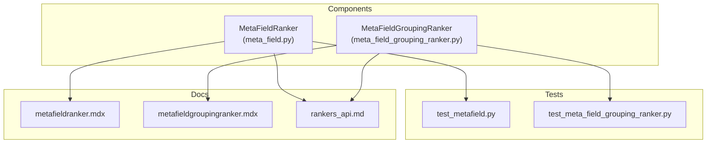
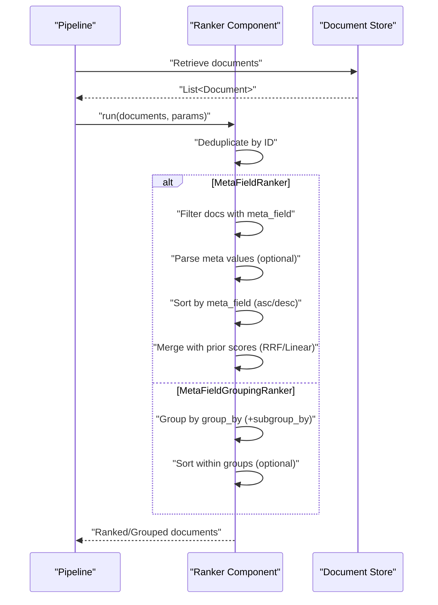
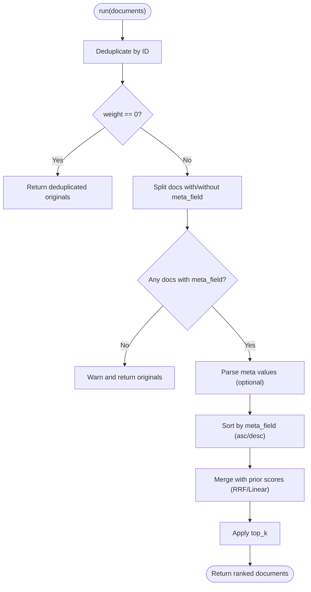
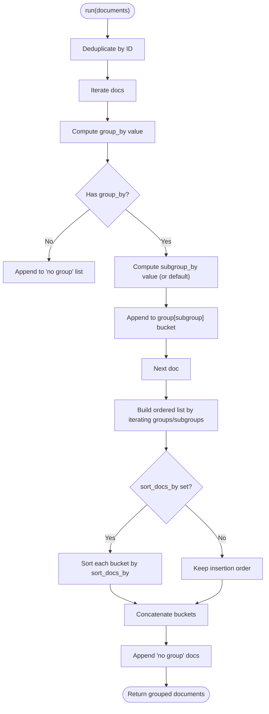
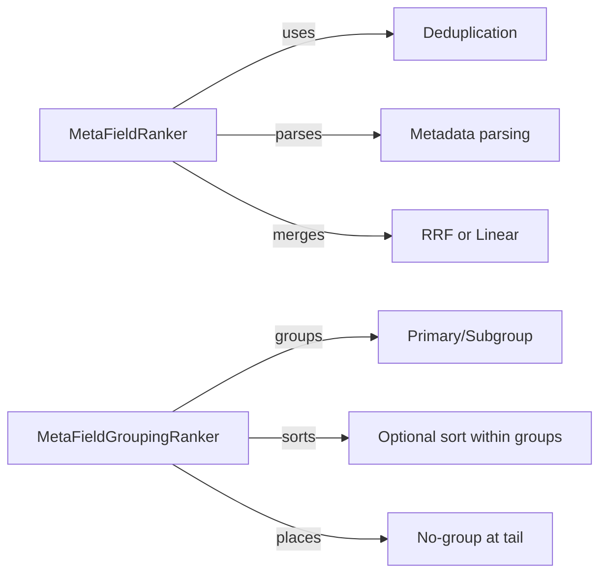

# Meta Field Rankers

<cite>
**Referenced Files in This Document**
- [meta_field.py](file://haystack/components/rankers/meta_field.py)
- [meta_field_grouping_ranker.py](file://haystack/components/rankers/meta_field_grouping_ranker.py)
- [test_metafield.py](file://test/components/rankers/test_metafield.py)
- [test_meta_field_grouping_ranker.py](file://test/components/rankers/test_meta_field_grouping_ranker.py)
- [metafieldranker.mdx](file://docs-website/docs/pipeline-components/rankers/metafieldranker.mdx)
- [metafieldgroupingranker.mdx](file://docs-website/docs/pipeline-components/rankers/metafieldgroupingranker.mdx)
- [rankers_api.md](file://docs-website/reference/haystack-api/rankers_api.md)
</cite>

## Table of Contents
1. [Introduction](#introduction)
2. [Project Structure](#project-structure)
3. [Core Components](#core-components)
4. [Architecture Overview](#architecture-overview)
5. [Detailed Component Analysis](#detailed-component-analysis)
6. [Dependency Analysis](#dependency-analysis)
7. [Performance Considerations](#performance-considerations)
8. [Troubleshooting Guide](#troubleshooting-guide)
9. [Conclusion](#conclusion)
10. [Appendices](#appendices)

## Introduction
This document explains meta field–based ranking components in Haystack with a focus on:
- MetaFieldRanker: sorts and merges document rankings using a single metadata field, supporting configurable weights and ranking modes.
- MetaFieldGroupingRanker: groups and reorders documents by one or more metadata keys, optionally sorting within groups.

It covers metadata field selection criteria, scoring weight assignment, ranking aggregation methods, input parameters, tie-breaking, and practical examples for chronological sorting, expert-based ranking, content freshness, and category-based prioritization. It also includes configuration patterns, performance considerations for large collections, and integration strategies with retrieval and document store components.

## Project Structure
The relevant implementation and documentation live in:
- Components: haystack/components/rankers/
- Tests: test/components/rankers/
- Documentation: docs-website/docs/pipeline-components/rankers/
- API Reference: docs-website/reference/haystack-api/rankers_api.md

**Diagram sources**
- [meta_field.py](file://haystack/components/rankers/meta_field.py#L18-L430)
- [meta_field_grouping_ranker.py](file://haystack/components/rankers/meta_field_grouping_ranker.py#L12-L124)
- [test_metafield.py](file://test/components/rankers/test_metafield.py#L1-L307)
- [test_meta_field_grouping_ranker.py](file://test/components/rankers/test_meta_field_grouping_ranker.py#L1-L183)
- [metafieldranker.mdx](file://docs-website/docs/pipeline-components/rankers/metafieldranker.mdx#L1-L92)
- [metafieldgroupingranker.mdx](file://docs-website/docs/pipeline-components/rankers/metafieldgroupingranker.mdx#L1-L131)
- [rankers_api.md](file://docs-website/reference/haystack-api/rankers_api.md#L261-L500)

**Section sources**
- [meta_field.py](file://haystack/components/rankers/meta_field.py#L18-L430)
- [meta_field_grouping_ranker.py](file://haystack/components/rankers/meta_field_grouping_ranker.py#L12-L124)
- [test_metafield.py](file://test/components/rankers/test_metafield.py#L1-L307)
- [test_meta_field_grouping_ranker.py](file://test/components/rankers/test_meta_field_grouping_ranker.py#L1-L183)
- [metafieldranker.mdx](file://docs-website/docs/pipeline-components/rankers/metafieldranker.mdx#L1-L92)
- [metafieldgroupingranker.mdx](file://docs-website/docs/pipeline-components/rankers/metafieldgroupingranker.mdx#L1-L131)
- [rankers_api.md](file://docs-website/reference/haystack-api/rankers_api.md#L261-L500)

## Core Components
- MetaFieldRanker
  - Sorts documents by a specified metadata field (ascending/descending).
  - Supports merging with existing document scores via:
    - Reciprocal Rank Fusion (RRF)
    - Linear score combination
  - Weight parameter balances contribution of metadata-based ranking vs. prior scores.
  - Handles missing metadata via drop/top/bottom strategies.
  - Optional parsing of metadata values to float, int, or date for correct ordering.

- MetaFieldGroupingRanker
  - Groups documents by a primary metadata key and optionally by a secondary key.
  - Optionally sorts documents within each group/subgroup by a third key.
  - Places documents without group keys at the end of the final list.

Both components deduplicate documents by ID before processing, keeping the document with the highest score when present.

**Section sources**
- [meta_field.py](file://haystack/components/rankers/meta_field.py#L18-L430)
- [meta_field_grouping_ranker.py](file://haystack/components/rankers/meta_field_grouping_ranker.py#L12-L124)
- [test_metafield.py](file://test/components/rankers/test_metafield.py#L77-L100)
- [test_meta_field_grouping_ranker.py](file://test/components/rankers/test_meta_field_grouping_ranker.py#L152-L169)

## Architecture Overview
High-level flow for each component:

**Diagram sources**
- [meta_field.py](file://haystack/components/rankers/meta_field.py#L163-L327)
- [meta_field_grouping_ranker.py](file://haystack/components/rankers/meta_field_grouping_ranker.py#L77-L123)

## Detailed Component Analysis

### MetaFieldRanker
- Purpose: Sort and merge document rankings using a single metadata field.
- Key behaviors:
  - Metadata field selection: meta_field must match a key present in Document.meta.
  - Sorting order: ascending or descending.
  - Ranking aggregation:
    - Reciprocal Rank Fusion: combines ranks using a fixed constant and a mixing weight.
    - Linear score: expects prior scores in [0,1]; scales metadata rank to [0,1] and mixes.
  - Weight: [0,1] where 0 disables metadata influence, 0.5 balances both, 1 relies solely on metadata.
  - Missing metadata policy: drop, top, bottom.
  - Metadata value type parsing: float, int, date (requires string values).
  - Deduplication: removes duplicate IDs, preferring higher-scoring instances.

**Diagram sources**
- [meta_field.py](file://haystack/components/rankers/meta_field.py#L234-L327)

**Section sources**
- [meta_field.py](file://haystack/components/rankers/meta_field.py#L44-L109)
- [meta_field.py](file://haystack/components/rankers/meta_field.py#L163-L327)
- [meta_field.py](file://haystack/components/rankers/meta_field.py#L372-L430)
- [test_metafield.py](file://test/components/rankers/test_metafield.py#L14-L29)
- [test_metafield.py](file://test/components/rankers/test_metafield.py#L31-L58)
- [test_metafield.py](file://test/components/rankers/test_metafield.py#L60-L68)
- [test_metafield.py](file://test/components/rankers/test_metafield.py#L70-L75)
- [test_metafield.py](file://test/components/rankers/test_metafield.py#L101-L106)
- [test_metafield.py](file://test/components/rankers/test_metafield.py#L108-L113)
- [test_metafield.py](file://test/components/rankers/test_metafield.py#L121-L142)
- [test_metafield.py](file://test/components/rankers/test_metafield.py#L144-L154)
- [test_metafield.py](file://test/components/rankers/test_metafield.py#L156-L184)
- [test_metafield.py](file://test/components/rankers/test_metafield.py#L211-L231)
- [test_metafield.py](file://test/components/rankers/test_metafield.py#L257-L270)
- [test_metafield.py](file://test/components/rankers/test_metafield.py#L272-L306)

#### Practical Examples
- Chronological sorting (publication date)
  - Set meta_field to a date-like string, meta_value_type to date, sort_order to descending.
  - Use weight to blend with prior scores; RRF or linear depending on score ranges.
- Expert-based ranking (author reputation)
  - Use numeric meta_field (e.g., reputation), sort_order ascending or descending.
  - Normalize prior scores to [0,1] if using linear mode.
- Content freshness optimization
  - Use recentness score or recency meta; combine with retrieval scores using RRF or linear.
- Custom metadata attributes
  - Any sortable numeric or string meta; ensure consistent types or enable parsing.

Integration tips:
- Place after a retriever in a RAG pipeline.
- Use top_k to limit downstream processing cost.
- Configure missing_meta to keep or remove documents lacking the key.

### MetaFieldGroupingRanker
- Purpose: Group and reorder documents by one or more metadata keys, optionally sorting within groups.
- Key behaviors:
  - group_by: primary grouping key.
  - subgroup_by: optional secondary grouping key.
  - sort_docs_by: optional key to sort within each group/subgroup.
  - Documents without a group key are appended at the end.
  - Deduplication by ID occurs before grouping.

**Diagram sources**
- [meta_field_grouping_ranker.py](file://haystack/components/rankers/meta_field_grouping_ranker.py#L77-L123)

**Section sources**
- [meta_field_grouping_ranker.py](file://haystack/components/rankers/meta_field_grouping_ranker.py#L60-L75)
- [meta_field_grouping_ranker.py](file://haystack/components/rankers/meta_field_grouping_ranker.py#L77-L123)
- [test_meta_field_grouping_ranker.py](file://test/components/rankers/test_meta_field_grouping_ranker.py#L42-L94)
- [test_meta_field_grouping_ranker.py](file://test/components/rankers/test_meta_field_grouping_ranker.py#L117-L133)
- [test_meta_field_grouping_ranker.py](file://test/components/rankers/test_meta_field_grouping_ranker.py#L135-L150)
- [test_meta_field_grouping_ranker.py](file://test/components/rankers/test_meta_field_grouping_ranker.py#L152-L168)

#### Practical Examples
- Category-based prioritization
  - group_by by category; optionally subgroup_by by subcategory; sort_docs_by by internal priority.
- Document chunk ordering
  - group_by by document/part identifier; subgroup_by by chapter/section; sort_docs_by by page/split_id.

Integration tips:
- Use after retrieval to produce a coherent document order for downstream LLM processing.
- Combine with other rankers to refine relevance and structure.

## Dependency Analysis
- Both components are decorated as @component and return a dictionary with a "documents" key.
- Both perform deduplication by ID before processing.
- MetaFieldRanker depends on:
  - Sorting and merging logic with configurable modes and weights.
  - Optional parsing of metadata values to numeric/date types.
- MetaFieldGroupingRanker depends on:
  - Hierarchical grouping and optional per-group sorting.

**Diagram sources**
- [meta_field.py](file://haystack/components/rankers/meta_field.py#L252-L327)
- [meta_field_grouping_ranker.py](file://haystack/components/rankers/meta_field_grouping_ranker.py#L95-L123)

**Section sources**
- [meta_field.py](file://haystack/components/rankers/meta_field.py#L252-L327)
- [meta_field_grouping_ranker.py](file://haystack/components/rankers/meta_field_grouping_ranker.py#L95-L123)

## Performance Considerations
- Complexity
  - MetaFieldRanker: O(n log n) dominated by sorting; merging adds linear passes.
  - MetaFieldGroupingRanker: O(n log n) for sorting within groups; worst-case grows with number of groups and items per group.
- Memory
  - Temporary lists for grouped buckets and sorted sublists; minimal extra structure otherwise.
- Deduplication cost
  - Single pass by ID with score comparison; negligible overhead compared to sorting.
- Recommendations
  - Use top_k to bound output size early.
  - Prefer numeric or date metadata for efficient sorting; avoid heterogeneous types.
  - Enable meta_value_type parsing only when all values are strings.
  - For very large collections, consider pre-filtering or indexing strategies upstream.

[No sources needed since this section provides general guidance]

## Troubleshooting Guide
Common issues and resolutions:
- No documents returned
  - Ensure meta_field exists in at least some documents; otherwise the component warns and returns originals.
- Mixed or unsortable types
  - Sorting may fail if types are incompatible; the component logs a warning and falls back to original order.
- Parsing errors
  - If meta_value_type is set, all values must be strings; otherwise parsing is skipped with a warning.
- Score range warnings (linear mode)
  - Scores outside [0,1] are clamped and logged; ensure prior scores are normalized.
- Parameter validation
  - Invalid weight, ranking_mode, sort_order, missing_meta, or meta_value_type raises ValueError.

**Section sources**
- [meta_field.py](file://haystack/components/rankers/meta_field.py#L262-L313)
- [meta_field.py](file://haystack/components/rankers/meta_field.py#L340-L368)
- [meta_field.py](file://haystack/components/rankers/meta_field.py#L394-L398)
- [test_metafield.py](file://test/components/rankers/test_metafield.py#L121-L142)
- [test_metafield.py](file://test/components/rankers/test_metafield.py#L156-L184)
- [test_metafield.py](file://test/components/rankers/test_metafield.py#L234-L243)

## Conclusion
MetaFieldRanker and MetaFieldGroupingRanker provide lightweight, flexible mechanisms to incorporate metadata into document ranking and organization:
- MetaFieldRanker excels at blending retrieval scores with metadata-driven signals using configurable weights and modes.
- MetaFieldGroupingRanker excels at structuring retrieved documents into coherent, ordered sequences for downstream tasks.

Together, they support diverse use cases—from chronological and expert-based ranking to freshness optimization and hierarchical categorization—while maintaining simplicity and performance.

[No sources needed since this section summarizes without analyzing specific files]

## Appendices

### API and Parameter Reference
- MetaFieldRanker
  - Initialization parameters: meta_field, weight, top_k, ranking_mode, sort_order, missing_meta, meta_value_type.
  - Run parameters: documents, top_k, weight, ranking_mode, sort_order, missing_meta, meta_value_type.
  - Modes: reciprocal_rank_fusion, linear_score.
  - Behavior: deduplication, parsing, sorting, merging, top_k selection.

- MetaFieldGroupingRanker
  - Initialization parameters: group_by, subgroup_by, sort_docs_by.
  - Run parameters: documents.
  - Behavior: deduplication, grouping, optional per-group sorting, appending documents without group.

**Section sources**
- [rankers_api.md](file://docs-website/reference/haystack-api/rankers_api.md#L287-L409)
- [rankers_api.md](file://docs-website/reference/haystack-api/rankers_api.md#L458-L500)
- [metafieldranker.mdx](file://docs-website/docs/pipeline-components/rankers/metafieldranker.mdx#L12-L23)
- [metafieldgroupingranker.mdx](file://docs-website/docs/pipeline-components/rankers/metafieldgroupingranker.mdx#L12-L23)