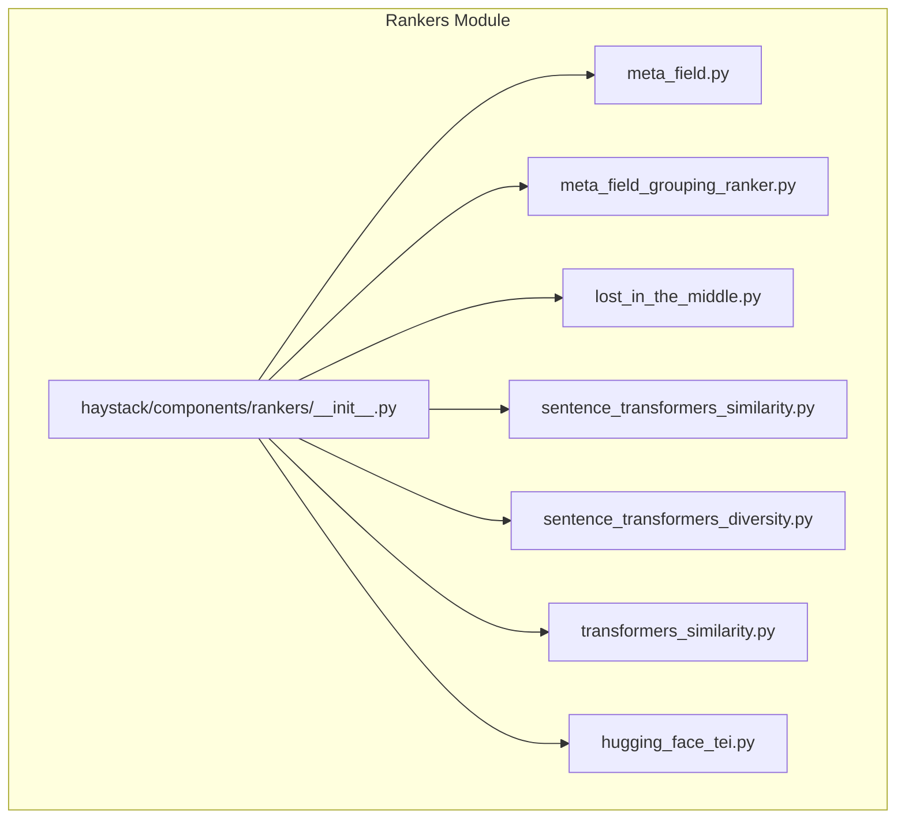
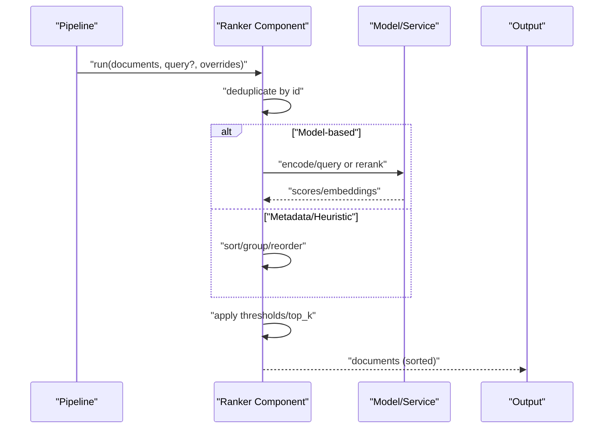
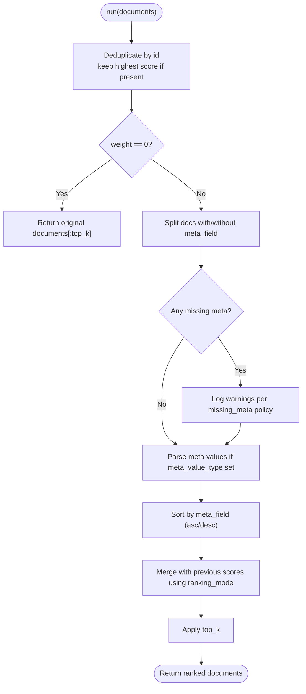
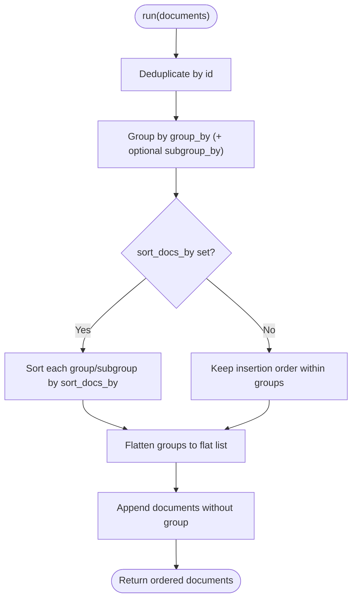
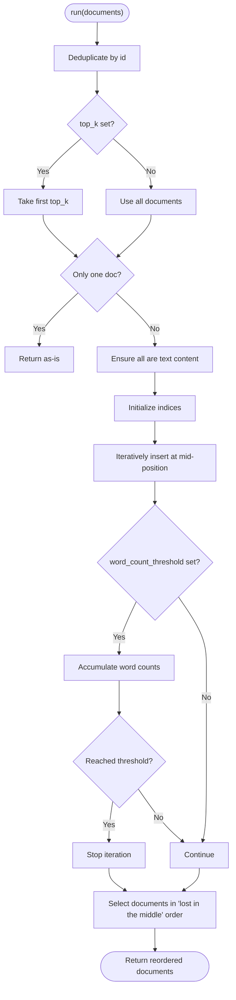
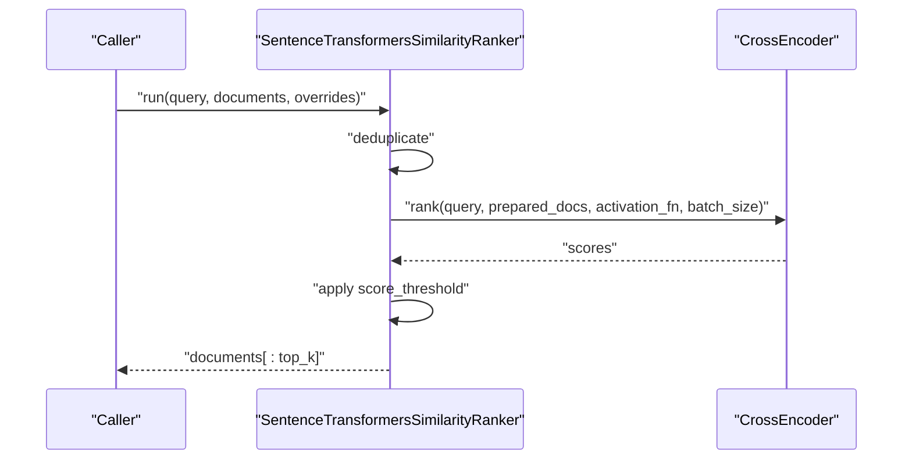
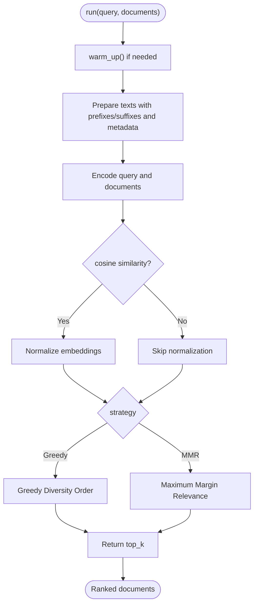
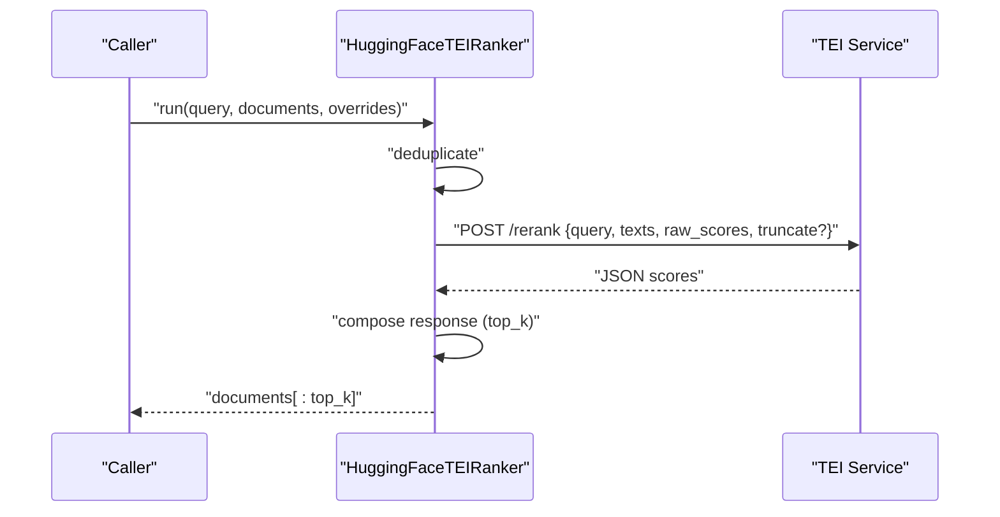
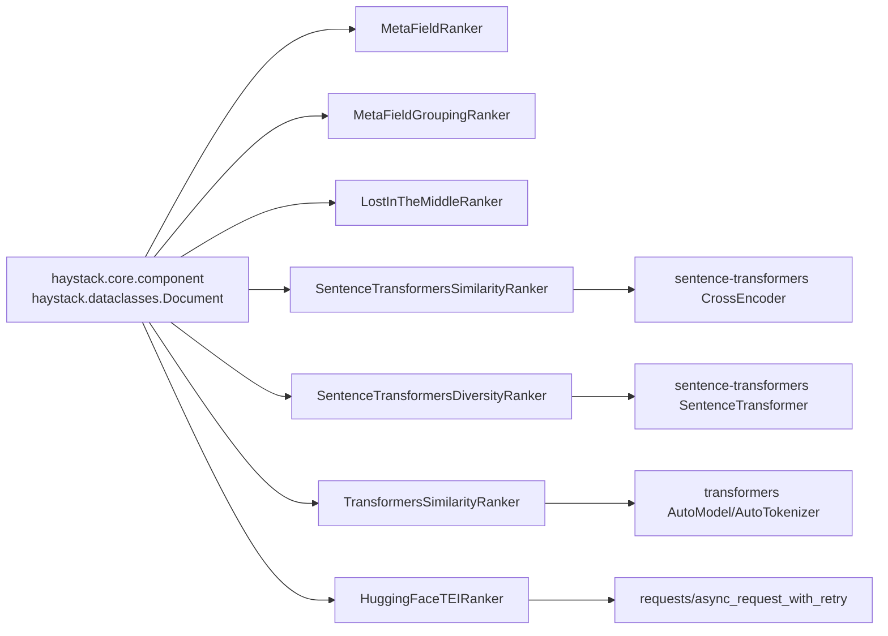

# Rankers

<cite>
**Referenced Files in This Document**
- [haystack/components/rankers/__init__.py](file://haystack/components/rankers/__init__.py)
- [haystack/components/rankers/meta_field.py](file://haystack/components/rankers/meta_field.py)
- [haystack/components/rankers/meta_field_grouping_ranker.py](file://haystack/components/rankers/meta_field_grouping_ranker.py)
- [haystack/components/rankers/lost_in_the_middle.py](file://haystack/components/rankers/lost_in_the_middle.py)
- [haystack/components/rankers/sentence_transformers_similarity.py](file://haystack/components/rankers/sentence_transformers_similarity.py)
- [haystack/components/rankers/sentence_transformers_diversity.py](file://haystack/components/rankers/sentence_transformers_diversity.py)
- [haystack/components/rankers/transformers_similarity.py](file://haystack/components/rankers/transformers_similarity.py)
- [haystack/components/rankers/hugging_face_tei.py](file://haystack/components/rankers/hugging_face_tei.py)
- [docs-website/docs/pipeline-components/rankers.mdx](file://docs-website/docs/pipeline-components/rankers.mdx)
- [docs-website/docs/pipeline-components/rankers/choosing-the-right-ranker.mdx](file://docs-website/docs/pipeline-components/rankers/choosing-the-right-ranker.mdx)
- [test/components/rankers/test_metafield.py](file://test/components/rankers/test_metafield.py)
</cite>

## Table of Contents
1. [Introduction](#introduction)
2. [Project Structure](#project-structure)
3. [Core Components](#core-components)
4. [Architecture Overview](#architecture-overview)
5. [Detailed Component Analysis](#detailed-component-analysis)
6. [Dependency Analysis](#dependency-analysis)
7. [Performance Considerations](#performance-considerations)
8. [Troubleshooting Guide](#troubleshooting-guide)
9. [Conclusion](#conclusion)
10. [Appendices](#appendices)

## Introduction
This document explains Haystack’s ranker components and how to select and configure them for effective document ranking. Rankers reorder retrieved documents based on additional signals beyond basic vector similarity—such as semantic similarity, metadata ordering, grouping, or position-aware heuristics—to improve downstream tasks like question answering or summarization.

Rankers fit into a standard pipeline after retrieval and before generation or reading:
- Retrieve candidates with a Retriever
- Reorder them with a Ranker
- Pass the refined list to a Generator or Reader

## Project Structure
The rankers are organized under a dedicated module with lazy imports to optimize startup and dependency loading. The module exposes multiple ranker implementations, including similarity-based, diversity-based, metadata-based, and external API-based rankers.

**Diagram sources**
- [haystack/components/rankers/__init__.py](file://haystack/components/rankers/__init__.py#L10-L34)

**Section sources**
- [haystack/components/rankers/__init__.py](file://haystack/components/rankers/__init__.py#L1-L35)

## Core Components
Haystack provides the following major families of rankers:

- Similarity rankers
  - SentenceTransformersSimilarityRanker: Semantic similarity using cross-encoders with optional scaling and thresholds.
  - TransformersSimilarityRanker: Legacy cross-encoder ranker with sigmoid scaling and calibration.
  - HuggingFaceTEIRanker: External TEI API-based reranking with retries and truncation support.

- Diversity rankers
  - SentenceTransformersDiversityRanker: Greedy diversity order and Maximum Margin Relevance (MMR) strategies.

- Meta-field rankers
  - MetaFieldRanker: Sorts by a specified metadata field with configurable merge modes and missing-meta behavior.
  - MetaFieldGroupingRanker: Groups and flattens documents by metadata keys for improved downstream processing.

- Specialized rankers
  - LostInTheMiddleRanker: Heuristic reordering to mitigate position bias by placing relevant content at the start/end and less relevant in the middle.

Typical usage involves passing a query and a list of Documents, then receiving a ranked list. Many rankers support top_k, score thresholds, and optional parameter overrides at runtime.

**Section sources**
- [docs-website/docs/pipeline-components/rankers.mdx](file://docs-website/docs/pipeline-components/rankers.mdx#L12-L27)
- [haystack/components/rankers/meta_field.py](file://haystack/components/rankers/meta_field.py#L18-L42)
- [haystack/components/rankers/meta_field_grouping_ranker.py](file://haystack/components/rankers/meta_field_grouping_ranker.py#L12-L58)
- [haystack/components/rankers/lost_in_the_middle.py](file://haystack/components/rankers/lost_in_the_middle.py#L10-L38)
- [haystack/components/rankers/sentence_transformers_similarity.py](file://haystack/components/rankers/sentence_transformers_similarity.py#L20-L40)
- [haystack/components/rankers/sentence_transformers_diversity.py](file://haystack/components/rankers/sentence_transformers_diversity.py#L73-L113)
- [haystack/components/rankers/transformers_similarity.py](file://haystack/components/rankers/transformers_similarity.py#L24-L50)
- [haystack/components/rankers/hugging_face_tei.py](file://haystack/components/rankers/hugging_face_tei.py#L29-L60)

## Architecture Overview
Rankers share a common pattern:
- Accept Documents (and optionally a query)
- Deduplicate by ID (keeping the highest-scoring variant if present)
- Apply ranking logic (semantic similarity, diversity, metadata ordering, or heuristics)
- Optionally filter by top_k or score thresholds
- Return a sorted list of Documents with scores where applicable

[No sources needed since this diagram shows conceptual workflow, not actual code structure]

## Detailed Component Analysis

### MetaFieldRanker
Purpose
- Orders documents by a specified metadata field, supporting ascending/descending sorts and merging with existing scores via weighted combination.

Key behaviors
- Deduplicates by ID, keeping the highest-scoring document when present.
- Supports parsing numeric and date metadata for correct ordering.
- Merges ranking with previous scores using Reciprocal Rank Fusion or linear combination.
- Handles missing metadata by dropping, placing at top, or placing at bottom.

Common parameters
- meta_field: Name of the metadata key to sort by.
- weight: Blend ratio between previous scores and meta-field ordering.
- ranking_mode: "reciprocal_rank_fusion" or "linear_score".
- sort_order: "ascending" or "descending".
- missing_meta: "drop", "top", or "bottom".
- meta_value_type: "float", "int", "date", or None.

Scoring and ranking strategy
- Sort by meta-field values; merge with existing scores using a weighted combination strategy.

Typical use cases
- Prioritize by recency, rating, category, or custom business metrics.
- Combine with retrieval scores to enforce domain rules.

**Diagram sources**
- [haystack/components/rankers/meta_field.py](file://haystack/components/rankers/meta_field.py#L163-L327)

**Section sources**
- [haystack/components/rankers/meta_field.py](file://haystack/components/rankers/meta_field.py#L18-L42)
- [haystack/components/rankers/meta_field.py](file://haystack/components/rankers/meta_field.py#L44-L108)
- [haystack/components/rankers/meta_field.py](file://haystack/components/rankers/meta_field.py#L163-L233)
- [haystack/components/rankers/meta_field.py](file://haystack/components/rankers/meta_field.py#L372-L429)
- [test/components/rankers/test_metafield.py](file://test/components/rankers/test_metafield.py#L13-L29)

### MetaFieldGroupingRanker
Purpose
- Groups documents by a primary metadata key and optionally a secondary key, then flattens them into a single ordered list. Documents without a group are appended at the end.

Key behaviors
- Deduplicates by ID.
- Groups by group_by; optionally subgroups by subgroup_by.
- Optionally sorts within groups by sort_docs_by.

Common parameters
- group_by: Primary metadata key for grouping.
- subgroup_by: Optional secondary key.
- sort_docs_by: Optional key to sort within groups.

Typical use cases
- Keep related chunks or splits together (e.g., same file/page).
- Improve LLM performance by coherent input blocks.

**Diagram sources**
- [haystack/components/rankers/meta_field_grouping_ranker.py](file://haystack/components/rankers/meta_field_grouping_ranker.py#L77-L123)

**Section sources**
- [haystack/components/rankers/meta_field_grouping_ranker.py](file://haystack/components/rankers/meta_field_grouping_ranker.py#L12-L58)
- [haystack/components/rankers/meta_field_grouping_ranker.py](file://haystack/components/rankers/meta_field_grouping_ranker.py#L60-L90)

### LostInTheMiddleRanker
Purpose
- Reorders documents to mitigate position bias in long-context models by placing relevant content at the beginning and end, with less relevant content in the middle.

Key behaviors
- Assumes prior relevance ordering; does not require a query.
- Supports word-count threshold to cap total context size.
- Validates that documents are textual.

Common parameters
- word_count_threshold: Upper bound on total words across selected documents.
- top_k: Maximum number of documents to return.

Typical use cases
- Preparing LLM prompts with balanced context distribution.
- Mitigating recall loss when models have limited context windows.

**Diagram sources**
- [haystack/components/rankers/lost_in_the_middle.py](file://haystack/components/rankers/lost_in_the_middle.py#L63-L137)

**Section sources**
- [haystack/components/rankers/lost_in_the_middle.py](file://haystack/components/rankers/lost_in_the_middle.py#L10-L38)
- [haystack/components/rankers/lost_in_the_middle.py](file://haystack/components/rankers/lost_in_the_middle.py#L40-L61)
- [haystack/components/rankers/lost_in_the_middle.py](file://haystack/components/rankers/lost_in_the_middle.py#L63-L87)

### SentenceTransformersSimilarityRanker
Purpose
- Semantic similarity ranking using cross-encoders. Supports scaling raw logits and applying score thresholds.

Key behaviors
- Loads a cross-encoder model (supports torch, ONNX, OpenVINO backends).
- Prepares query/document pairs with optional prefixes/suffixes and metadata embedding.
- Ranks using cross-encoder scores and applies optional sigmoid scaling.

Common parameters
- model: Cross-encoder model name or path.
- device: Target device for inference.
- token: Hugging Face token for private models.
- top_k: Number of top documents to return.
- query_prefix/query_suffix/document_prefix/document_suffix: Instruction prefixes/suffixes.
- meta_fields_to_embed: Metadata fields to include in the text.
- embedding_separator: Separator for metadata concatenation.
- scale_score: Apply sigmoid scaling to logits.
- score_threshold: Minimum score to keep a document.
- trust_remote_code: Allow custom models/scripts.
- model_kwargs/tokenizer_kwargs/config_kwargs: Model configuration.
- backend: Backend choice ("torch", "onnx", "openvino").
- batch_size: Batch size for inference.

Typical use cases
- Improving retrieval ranking with strong semantic signals.
- Integrating with CPU/GPU backends and quantized deployments.

**Diagram sources**
- [haystack/components/rankers/sentence_transformers_similarity.py](file://haystack/components/rankers/sentence_transformers_similarity.py#L214-L296)

**Section sources**
- [haystack/components/rankers/sentence_transformers_similarity.py](file://haystack/components/rankers/sentence_transformers_similarity.py#L20-L40)
- [haystack/components/rankers/sentence_transformers_similarity.py](file://haystack/components/rankers/sentence_transformers_similarity.py#L42-L117)
- [haystack/components/rankers/sentence_transformers_similarity.py](file://haystack/components/rankers/sentence_transformers_similarity.py#L214-L248)

### SentenceTransformersDiversityRanker
Purpose
- Diversity-aware ranking using Sentence Transformers embeddings. Two strategies:
  - Greedy Diversity Order: Maximizes average similarity reduction among selected documents.
  - Maximum Margin Relevance (MMR): Balances relevance and diversity with a tunable lambda.

Key behaviors
- Embeds query and documents using a Sentence Transformer model.
- Normalizes embeddings for cosine similarity when requested.
- Applies chosen strategy and returns top_k.

Common parameters
- model: Sentence Transformer model name or path.
- top_k: Number of top documents to return.
- device: Target device.
- token: Hugging Face token.
- similarity: "dot_product" or "cosine".
- query_prefix/query_suffix/document_prefix/document_suffix: Instruction prefixes/suffixes.
- meta_fields_to_embed/embedding_separator: Metadata inclusion.
- strategy: "greedy_diversity_order" or "maximum_margin_relevance".
- lambda_threshold: Trade-off parameter for MMR (0–1).
- model_kwargs/tokenizer_kwargs/config_kwargs/backend: Model configuration.

Typical use cases
- Reduce redundancy in retrieved sets.
- Broad coverage across topics while preserving relevance.

**Diagram sources**
- [haystack/components/rankers/sentence_transformers_diversity.py](file://haystack/components/rankers/sentence_transformers_diversity.py#L389-L428)

**Section sources**
- [haystack/components/rankers/sentence_transformers_diversity.py](file://haystack/components/rankers/sentence_transformers_diversity.py#L73-L113)
- [haystack/components/rankers/sentence_transformers_diversity.py](file://haystack/components/rankers/sentence_transformers_diversity.py#L115-L172)
- [haystack/components/rankers/sentence_transformers_diversity.py](file://haystack/components/rankers/sentence_transformers_diversity.py#L276-L320)
- [haystack/components/rankers/sentence_transformers_diversity.py](file://haystack/components/rankers/sentence_transformers_diversity.py#L335-L381)

### TransformersSimilarityRanker (Legacy)
Purpose
- Legacy cross-encoder ranker built on Transformers. Superseded by SentenceTransformersSimilarityRanker.

Key behaviors
- Loads a classification model and tokenizer.
- Builds query-document pairs with optional metadata.
- Uses DataLoader for batching and optional sigmoid scaling with a calibration factor.

Common parameters
- model: Cross-encoder model name or path.
- device: Target device.
- token: Hugging Face token.
- top_k: Number of top documents to return.
- query_prefix/document_prefix: Instruction prefixes.
- meta_fields_to_embed/embedding_separator: Metadata inclusion.
- scale_score: Enable sigmoid scaling.
- calibration_factor: Factor for sigmoid scaling.
- score_threshold: Minimum score to keep.
- model_kwargs/tokenizer_kwargs/batch_size: Model configuration.

Typical use cases
- Historical pipelines; migrate to SentenceTransformersSimilarityRanker for richer features.

**Section sources**
- [haystack/components/rankers/transformers_similarity.py](file://haystack/components/rankers/transformers_similarity.py#L24-L50)
- [haystack/components/rankers/transformers_similarity.py](file://haystack/components/rankers/transformers_similarity.py#L52-L111)
- [haystack/components/rankers/transformers_similarity.py](file://haystack/components/rankers/transformers_similarity.py#L221-L257)

### HuggingFaceTEIRanker
Purpose
- External TEI API-based reranking. Supports raw scores, truncation, and retries.

Key behaviors
- Sends query and texts to a TEI endpoint (/rerank).
- Supports bearer token authorization and configurable timeouts/retries.
- Processes JSON responses into ranked Documents.

Common parameters
- url: Base URL of the TEI service.
- top_k: Number of top documents to return.
- raw_scores: Include raw scores in payload.
- timeout/max_retries/retry_status_codes: Network behavior.
- token: Authorization token.

Typical use cases
- Offload reranking to managed TEI endpoints or self-hosted instances.

**Diagram sources**
- [haystack/components/rankers/hugging_face_tei.py](file://haystack/components/rankers/hugging_face_tei.py#L167-L225)

**Section sources**
- [haystack/components/rankers/hugging_face_tei.py](file://haystack/components/rankers/hugging_face_tei.py#L29-L60)
- [haystack/components/rankers/hugging_face_tei.py](file://haystack/components/rankers/hugging_face_tei.py#L62-L94)
- [haystack/components/rankers/hugging_face_tei.py](file://haystack/components/rankers/hugging_face_tei.py#L167-L225)

## Dependency Analysis
Rankers depend on:
- Haystack core abstractions (Document, component decorator, serialization helpers)
- Optional ML frameworks (sentence-transformers, transformers)
- External services (TEI endpoints)

**Diagram sources**
- [haystack/components/rankers/sentence_transformers_similarity.py](file://haystack/components/rankers/sentence_transformers_similarity.py#L15-L17)
- [haystack/components/rankers/sentence_transformers_diversity.py](file://haystack/components/rankers/sentence_transformers_diversity.py#L14-L16)
- [haystack/components/rankers/transformers_similarity.py](file://haystack/components/rankers/transformers_similarity.py#L15-L19)
- [haystack/components/rankers/hugging_face_tei.py](file://haystack/components/rankers/hugging_face_tei.py#L13)

**Section sources**
- [haystack/components/rankers/__init__.py](file://haystack/components/rankers/__init__.py#L10-L34)

## Performance Considerations
- Cross-encoder models (SentenceTransformersSimilarityRanker, TransformersSimilarityRanker, TEI) are more accurate but compute-intensive. Prefer smaller models or quantized backends (ONNX/OpenVINO) for CPU-only environments.
- Batch size impacts throughput vs. memory; tune based on hardware.
- Score scaling (sigmoid) and thresholds can reduce post-processing overhead.
- Diversity strategies add computational cost; use greedy order for speed or MMR for balance.
- Deduplication avoids redundant scoring; keep it enabled.
- TEI endpoints introduce network latency; consider proximity and retry policies.

[No sources needed since this section provides general guidance]

## Troubleshooting Guide
Common issues and resolutions
- Invalid parameters
  - top_k must be > 0; weight in [0,1]; ranking_mode/sort_order/mode values validated.
- Missing or incompatible metadata
  - MetaFieldRanker warns and falls back when meta values are missing or unsortable; ensure consistent types or enable parsing.
- Non-textual content
  - LostInTheMiddleRanker requires text content; ensure all documents are textual.
- TEI API errors
  - Unexpected response formats or server errors raise explicit exceptions; verify endpoint URL, token, and payload.

Validation and tests
- Tests demonstrate correct ranking behavior, weight blending, ascending/descending sorts, and deduplication semantics.

**Section sources**
- [haystack/components/rankers/meta_field.py](file://haystack/components/rankers/meta_field.py#L110-L160)
- [haystack/components/rankers/lost_in_the_middle.py](file://haystack/components/rankers/lost_in_the_middle.py#L52-L57)
- [haystack/components/rankers/hugging_face_tei.py](file://haystack/components/rankers/hugging_face_tei.py#L144-L154)
- [test/components/rankers/test_metafield.py](file://test/components/rankers/test_metafield.py#L186-L200)

## Conclusion
Choose a ranker family based on your needs:
- Similarity: SentenceTransformersSimilarityRanker for robust semantic ranking; TEI for managed inference.
- Diversity: SentenceTransformersDiversityRanker for reduced redundancy.
- Metadata-driven ordering: MetaFieldRanker for business rules; MetaFieldGroupingRanker for coherent grouping.
- Position-aware reordering: LostInTheMiddleRanker for LLM context preparation.

Tune parameters like top_k, thresholds, and weighting to balance quality, latency, and cost. Validate with representative datasets and monitor downstream performance.

[No sources needed since this section summarizes without analyzing specific files]

## Appendices

### Practical Pipeline Configurations
- Semantic ranking pipeline
  - Retriever → SentenceTransformersSimilarityRanker → Generator/Reader
- Diversity pipeline
  - Retriever → SentenceTransformersDiversityRanker → Generator/Reader
- Metadata-first pipeline
  - Retriever → MetaFieldRanker → SentenceTransformersSimilarityRanker → Generator/Reader
- Grouped context pipeline
  - Retriever → MetaFieldGroupingRanker → LostInTheMiddleRanker → Generator/Reader

[No sources needed since this section provides general guidance]