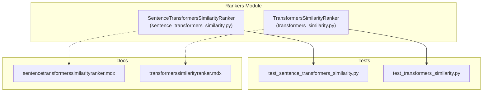
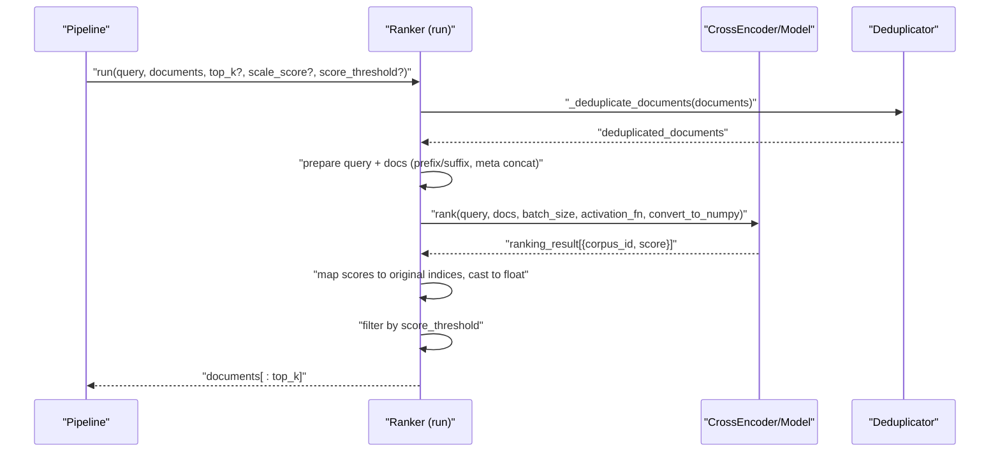
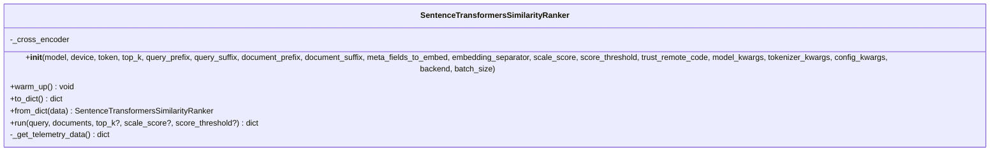
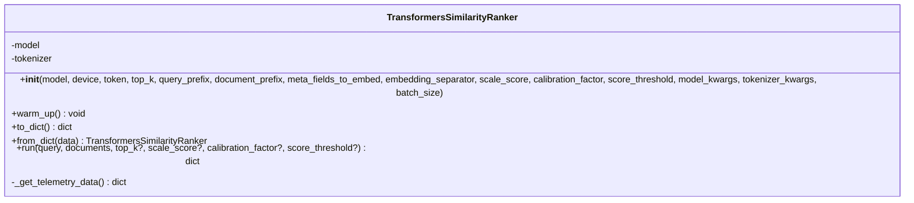
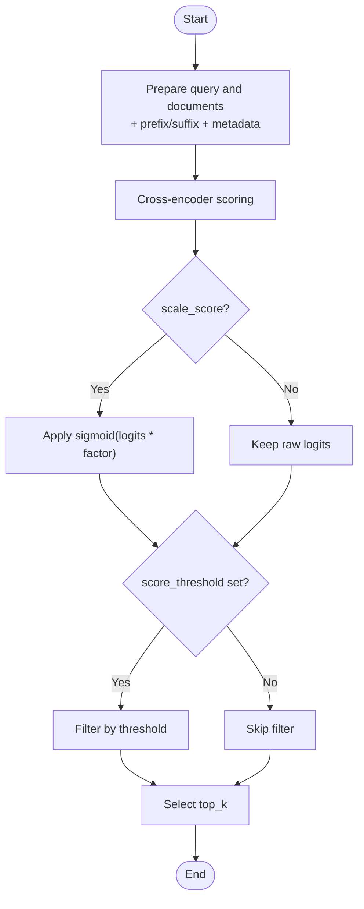
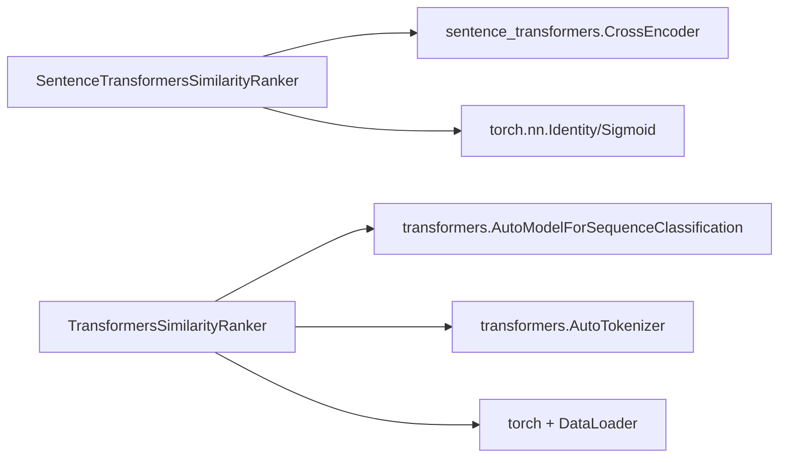

# Similarity Rankers

<cite>
**Referenced Files in This Document**
- [sentence_transformers_similarity.py](file://haystack/components/rankers/sentence_transformers_similarity.py)
- [transformers_similarity.py](file://haystack/components/rankers/transformers_similarity.py)
- [test_sentence_transformers_similarity.py](file://test/components/rankers/test_sentence_transformers_similarity.py)
- [test_transformers_similarity.py](file://test/components/rankers/test_transformers_similarity.py)
- [sentencetransformerssimilarityranker.mdx](file://docs-website/docs/pipeline-components/rankers/sentencetransformerssimilarityranker.mdx)
- [transformerssimilarityranker.mdx](file://docs-website/docs/pipeline-components/rankers/transformerssimilarityranker.mdx)
- [rankers_api.yml](file://pydoc/rankers_api.yml)
</cite>

## Table of Contents
1. [Introduction](#introduction)
2. [Project Structure](#project-structure)
3. [Core Components](#core-components)
4. [Architecture Overview](#architecture-overview)
5. [Detailed Component Analysis](#detailed-component-analysis)
6. [Dependency Analysis](#dependency-analysis)
7. [Performance Considerations](#performance-considerations)
8. [Troubleshooting Guide](#troubleshooting-guide)
9. [Conclusion](#conclusion)
10. [Appendices](#appendices)

## Introduction
This document explains the similarity-based ranker components in Haystack focused on semantic similarity scoring and ranking. It covers:
- SentenceTransformersSimilarityRanker: modern cross-encoder ranker backed by Sentence Transformers with optional backend acceleration (torch, ONNX, OpenVINO).
- TransformersSimilarityRanker: legacy cross-encoder ranker built on the Transformers library; superseded by the Sentence Transformers variant.

You will learn how these components compute similarity, how to configure them, how to tune parameters for performance and accuracy, and how to integrate them into retrieval pipelines such as RAG.

## Project Structure
The similarity rankers live under haystack/components/rankers and are accompanied by unit tests and documentation pages.

**Diagram sources**
- [sentence_transformers_similarity.py](file://haystack/components/rankers/sentence_transformers_similarity.py#L20-L297)
- [transformers_similarity.py](file://haystack/components/rankers/transformers_similarity.py#L24-L328)
- [test_sentence_transformers_similarity.py](file://test/components/rankers/test_sentence_transformers_similarity.py#L17-L475)
- [test_transformers_similarity.py](file://test/components/rankers/test_transformers_similarity.py#L18-L423)
- [sentencetransformerssimilarityranker.mdx](file://docs-website/docs/pipeline-components/rankers/sentencetransformerssimilarityranker.mdx#L1-L111)
- [transformerssimilarityranker.mdx](file://docs-website/docs/pipeline-components/rankers/transformerssimilarityranker.mdx#L1-L114)

**Section sources**
- [sentence_transformers_similarity.py](file://haystack/components/rankers/sentence_transformers_similarity.py#L1-L297)
- [transformers_similarity.py](file://haystack/components/rankers/transformers_similarity.py#L1-L328)
- [test_sentence_transformers_similarity.py](file://test/components/rankers/test_sentence_transformers_similarity.py#L1-L475)
- [test_transformers_similarity.py](file://test/components/rankers/test_transformers_similarity.py#L1-L423)
- [sentencetransformerssimilarityranker.mdx](file://docs-website/docs/pipeline-components/rankers/sentencetransformerssimilarityranker.mdx#L1-L111)
- [transformerssimilarityranker.mdx](file://docs-website/docs/pipeline-components/rankers/transformerssimilarityranker.mdx#L1-L114)

## Core Components
- SentenceTransformersSimilarityRanker
  - Purpose: Ranks documents by semantic similarity using a cross-encoder model via Sentence Transformers.
  - Key features: configurable model, device, backend (torch/ONNX/OpenVINO), optional trust_remote_code, prefix/suffix injection, metadata embedding, score scaling, threshold filtering, batch processing, and deduplication.
  - Typical usage: post-retrieval ranking in RAG or search pipelines.

- TransformersSimilarityRanker (Legacy)
  - Purpose: Same ranking goal but implemented with the Transformers library.
  - Status: Deprecated in favor of SentenceTransformersSimilarityRanker; kept for backward compatibility.
  - Key differences: explicit calibration_factor for sigmoid scaling; manual batching via DataLoader; device_map resolution; additional serialization/deserialization logic.

**Section sources**
- [sentence_transformers_similarity.py](file://haystack/components/rankers/sentence_transformers_similarity.py#L20-L297)
- [transformers_similarity.py](file://haystack/components/rankers/transformers_similarity.py#L24-L328)
- [sentencetransformerssimilarityranker.mdx](file://docs-website/docs/pipeline-components/rankers/sentencetransformerssimilarityranker.mdx#L1-L111)
- [transformerssimilarityranker.mdx](file://docs-website/docs/pipeline-components/rankers/transformerssimilarityranker.mdx#L1-L114)

## Architecture Overview
Both rankers operate similarly:
- Prepare query and documents (prefix/suffix, metadata concatenation).
- Encode pairs using a cross-encoder model.
- Compute similarity scores (logits or scaled logits).
- Sort by score, apply threshold, and return top-k results.

**Diagram sources**
- [sentence_transformers_similarity.py](file://haystack/components/rankers/sentence_transformers_similarity.py#L213-L297)
- [transformers_similarity.py](file://haystack/components/rankers/transformers_similarity.py#L221-L328)

## Detailed Component Analysis

### SentenceTransformersSimilarityRanker
- Initialization parameters
  - model: model name or path for the cross-encoder.
  - device: target device; resolved to torch string internally.
  - token: Hugging Face token for private models.
  - top_k: number of results to return.
  - query_prefix/query_suffix/document_prefix/document_suffix: inject instructions or formatting around query/doc text.
  - meta_fields_to_embed: include metadata values into the document text before encoding.
  - embedding_separator: separator to join metadata and content.
  - scale_score: whether to apply sigmoid scaling to raw logits.
  - score_threshold: filter out results below threshold.
  - trust_remote_code: allow custom models/scripts.
  - model_kwargs/tokenizer_kwargs/config_kwargs: pass-through to underlying libraries.
  - backend: "torch"|"onnx"|"openvino".
  - batch_size: inference batch size.

- Scoring and ranking logic
  - Deduplicate documents by id, keeping the highest-scoring duplicate if present.
  - Build prepared query and prepared documents (prefix/suffix + metadata + content).
  - Select activation function: Sigmoid if scale_score else Identity.
  - Call cross-encoder rank with batch_size and activation_fn.
  - Convert corpus_id/scores to original document order, cast scores to Python floats, apply threshold, slice to top_k.

- Practical configuration examples
  - Basic usage with defaults and a small top_k for downstream components.
  - Using trust_remote_code for custom models.
  - Adjusting model_kwargs for quantization (e.g., 4-bit) and dtype.
  - Using different backends (ONNX/OpenVINO) for acceleration.

- Integration patterns
  - Place after a retriever; set retriever.top_k to limit candidates.
  - Combine with embedding components that populate Document.content and optional metadata fields.

- API reference
  - See the rankers API documentation for parameter details and signatures.

**Section sources**
- [sentence_transformers_similarity.py](file://haystack/components/rankers/sentence_transformers_similarity.py#L42-L142)
- [sentence_transformers_similarity.py](file://haystack/components/rankers/sentence_transformers_similarity.py#L213-L297)
- [test_sentence_transformers_similarity.py](file://test/components/rankers/test_sentence_transformers_similarity.py#L113-L192)
- [sentencetransformerssimilarityranker.mdx](file://docs-website/docs/pipeline-components/rankers/sentencetransformerssimilarityranker.mdx#L45-L111)
- [rankers_api.yml](file://pydoc/rankers_api.yml)

#### Class Diagram

**Diagram sources**
- [sentence_transformers_similarity.py](file://haystack/components/rankers/sentence_transformers_similarity.py#L20-L297)

### TransformersSimilarityRanker (Legacy)
- Initialization parameters
  - model: model name or path for the cross-encoder.
  - device: device override; resolved to device_map when applicable.
  - token: Hugging Face token for private models.
  - top_k: number of results to return.
  - query_prefix/document_prefix/meta_fields_to_embed/embedding_separator: same purpose as above.
  - scale_score: enable sigmoid scaling.
  - calibration_factor: multiplier for logits inside sigmoid; required when scale_score is True.
  - score_threshold: filter threshold.
  - model_kwargs/tokenizer_kwargs: pass-through to Transformers.
  - batch_size: batching for inference.

- Scoring and ranking logic
  - Warm-up loads model and tokenizer; resolves device/device_map.
  - Builds query-document pairs with prefixes and metadata concatenation.
  - Tokenizes batches and iterates over DataLoader.
  - Collects logits, optionally scales with sigmoid(calibration_factor * logits).
  - Sorts by score, attaches scores to documents, applies threshold and top_k.

- Important differences vs SentenceTransformersSimilarityRanker
  - Explicit calibration_factor for sigmoid scaling.
  - Manual DataLoader and tensor stacking for batching.
  - Device map resolution and warnings when both device and device_map are provided.

- Integration patterns
  - Same as SentenceTransformersSimilarityRanker; however, prefer the newer component.

**Section sources**
- [transformers_similarity.py](file://haystack/components/rankers/transformers_similarity.py#L52-L149)
- [transformers_similarity.py](file://haystack/components/rankers/transformers_similarity.py#L221-L328)
- [test_transformers_similarity.py](file://test/components/rankers/test_transformers_similarity.py#L42-L115)
- [transformerssimilarityranker.mdx](file://docs-website/docs/pipeline-components/rankers/transformerssimilarityranker.mdx#L1-L114)

#### Class Diagram

**Diagram sources**
- [transformers_similarity.py](file://haystack/components/rankers/transformers_similarity.py#L24-L328)

### Ranking Workflow Details
- Input preparation
  - Prefix/suffix injection for query and documents.
  - Metadata embedding via meta_fields_to_embed and embedding_separator.
- Similarity scoring
  - Cross-encoder computes a relevance score for each query-document pair.
  - Optional sigmoid scaling transforms logits into a probability-like range.
- Thresholding and selection
  - Filter by score_threshold.
  - Keep top_k results.
- Output
  - Documents list ordered from most to least similar.

**Diagram sources**
- [sentence_transformers_similarity.py](file://haystack/components/rankers/sentence_transformers_similarity.py#L262-L296)
- [transformers_similarity.py](file://haystack/components/rankers/transformers_similarity.py#L279-L327)

## Dependency Analysis
- External libraries
  - Sentence Transformers: CrossEncoder for fast cross-encoding and ranking.
  - Transformers: AutoModelForSequenceClassification and AutoTokenizer for legacy implementation.
  - Torch: inference and tensor operations.
- Internal utilities
  - ComponentDevice and Secret for device and token handling.
  - Serialization helpers for model/tokenizer/config kwargs.
  - Deduplication utility for document ids.

**Diagram sources**
- [sentence_transformers_similarity.py](file://haystack/components/rankers/sentence_transformers_similarity.py#L15-L17)
- [transformers_similarity.py](file://haystack/components/rankers/transformers_similarity.py#L15-L19)

**Section sources**
- [sentence_transformers_similarity.py](file://haystack/components/rankers/sentence_transformers_similarity.py#L1-L20)
- [transformers_similarity.py](file://haystack/components/rankers/transformers_similarity.py#L1-L21)

## Performance Considerations
- Batch size
  - Increase batch_size for throughput; decrease if encountering memory issues.
- Backend selection
  - SentenceTransformersSimilarityRanker supports "torch", "onnx", "openvino". Choose based on deployment needs.
- Quantization and dtype
  - Use model_kwargs to enable quantization (e.g., 4-bit) and compute dtype adjustments.
- Device placement
  - Set device appropriately; for multi-GPU scenarios, leverage device_map (TransformersSimilarityRanker).
- Deduplication
  - Documents are deduplicated by id before ranking; avoid redundant inputs to reduce work.
- Retrieval synergy
  - Lower retriever.top_k reduces candidate count for the ranker, improving latency.

[No sources needed since this section provides general guidance]

## Troubleshooting Guide
- Invalid top_k
  - Both components validate that top_k > 0; adjust accordingly.
- Missing calibration_factor
  - TransformersSimilarityRanker requires calibration_factor when scale_score is True.
- Empty documents list
  - Both components return an empty documents list when input is empty.
- Score scaling behavior
  - SentenceTransformersSimilarityRanker uses Sigmoid when scale_score is True; TransformersSimilarityRanker uses sigmoid(logits * calibration_factor).
- Device conflicts
  - TransformersSimilarityRanker warns if both device and device_map are provided; device_map takes precedence.
- Backend-specific behavior
  - SentenceTransformersSimilarityRanker backend parameter controls runtime acceleration; ensure compatible model and environment.

**Section sources**
- [sentence_transformers_similarity.py](file://haystack/components/rankers/sentence_transformers_similarity.py#L120-L122)
- [sentence_transformers_similarity.py](file://haystack/components/rankers/sentence_transformers_similarity.py#L259-L261)
- [transformers_similarity.py](file://haystack/components/rankers/transformers_similarity.py#L142-L148)
- [transformers_similarity.py](file://haystack/components/rankers/transformers_similarity.py#L274-L277)
- [test_sentence_transformers_similarity.py](file://test/components/rankers/test_sentence_transformers_similarity.py#L267-L273)
- [test_transformers_similarity.py](file://test/components/rankers/test_transformers_similarity.py#L310-L318)

## Conclusion
- Prefer SentenceTransformersSimilarityRanker for new projects due to its modern interface, backend options, and additional features.
- Use TransformersSimilarityRanker only for legacy integrations; plan migration to the Sentence Transformers variant.
- Tune parameters like top_k, batch_size, scale_score, score_threshold, and backend to balance quality and performance.
- Integrate with retrievers and embedding components to build effective RAG and search pipelines.

[No sources needed since this section summarizes without analyzing specific files]

## Appendices

### Practical Configuration Examples
- Configure SentenceTransformersSimilarityRanker with a custom model, device, and backend:
  - Set model to a cross-encoder checkpoint.
  - Set device to CPU/GPU.
  - Choose backend among "torch", "onnx", "openvino".
  - Optionally enable trust_remote_code for custom models.
  - Adjust model_kwargs for quantization and dtype.
- Configure TransformersSimilarityRanker with device_map and calibration:
  - Provide device_map for multi-device setups.
  - Set scale_score=True and supply calibration_factor.
  - Control batch_size to fit memory constraints.

**Section sources**
- [test_sentence_transformers_similarity.py](file://test/components/rankers/test_sentence_transformers_similarity.py#L113-L192)
- [test_transformers_similarity.py](file://test/components/rankers/test_transformers_similarity.py#L42-L115)
- [sentencetransformerssimilarityranker.mdx](file://docs-website/docs/pipeline-components/rankers/sentencetransformerssimilarityranker.mdx#L35-L43)
- [transformerssimilarityranker.mdx](file://docs-website/docs/pipeline-components/rankers/transformerssimilarityranker.mdx#L37-L47)

### API Reference
- Consult the rankers API documentation for detailed parameter lists, types, and method signatures.

**Section sources**
- [rankers_api.yml](file://pydoc/rankers_api.yml)