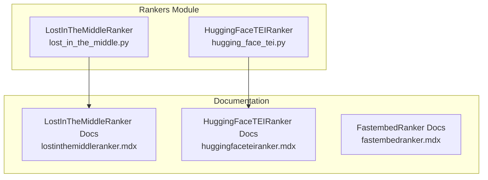
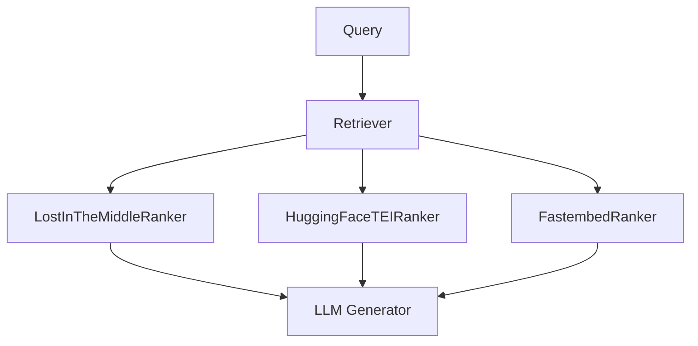
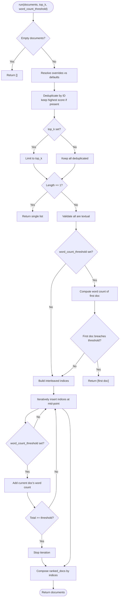
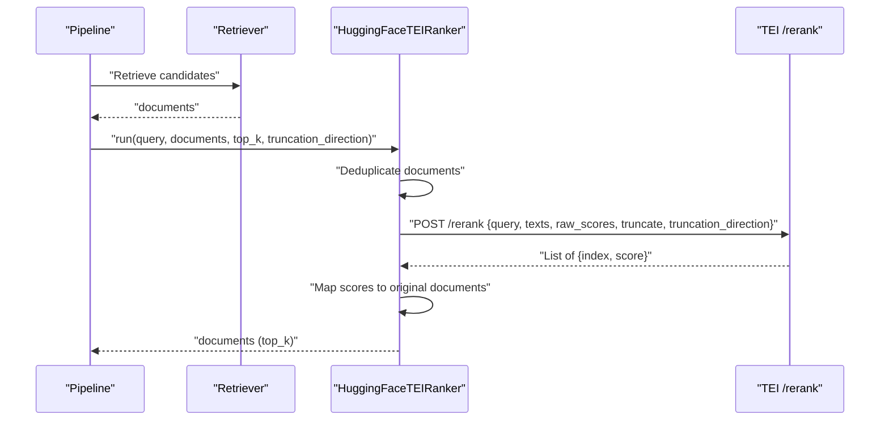
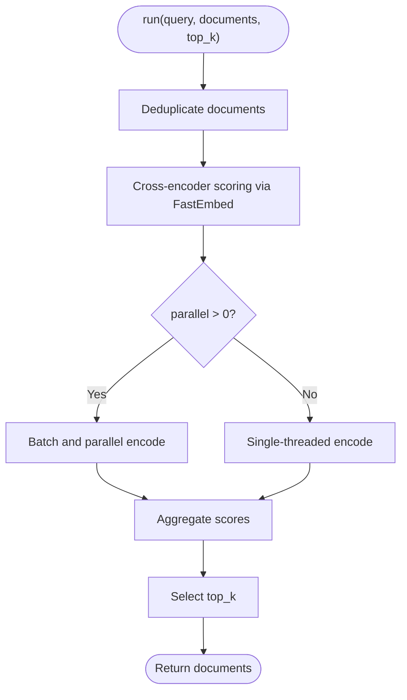
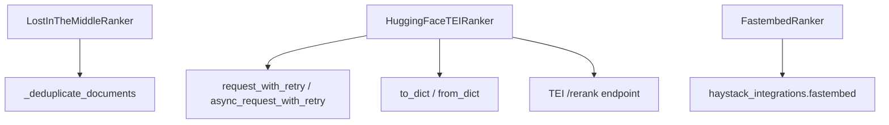

# Specialized Rankers

<cite>
**Referenced Files in This Document**
- [lost_in_the_middle.py](file://haystack/components/rankers/lost_in_the_middle.py)
- [hugging_face_tei.py](file://haystack/components/rankers/hugging_face_tei.py)
- [lostinthemiddleranker.mdx](file://docs-website/docs/pipeline-components/rankers/lostinthemiddleranker.mdx)
- [huggingfaceteiranker.mdx](file://docs-website/docs/pipeline-components/rankers/huggingfaceteiranker.mdx)
- [fastembedranker.mdx](file://docs-website/docs/pipeline-components/rankers/fastembedranker.mdx)
</cite>

## Table of Contents
1. [Introduction](#introduction)
2. [Project Structure](#project-structure)
3. [Core Components](#core-components)
4. [Architecture Overview](#architecture-overview)
5. [Detailed Component Analysis](#detailed-component-analysis)
6. [Dependency Analysis](#dependency-analysis)
7. [Performance Considerations](#performance-considerations)
8. [Troubleshooting Guide](#troubleshooting-guide)
9. [Conclusion](#conclusion)
10. [Appendices](#appendices)

## Introduction
This document focuses on three specialized ranking components designed for distinct use cases:
- LostInTheMiddleRanker: Mitigates position bias in long-context retrieval by strategically placing the most and least relevant documents at the beginning and end of the list, with careful control over total word count and top-k selection.
- HuggingFaceTEIRanker: Integrates with a Text Embedding Inference (TEI) API to rerank candidate documents by semantic similarity to a query, supporting retries, timeouts, optional raw scores, and truncation direction.
- FastembedRanker: Performs efficient cross-encoder reranking using ONNX-backed models via the FastEmbed integration, optimized for CPU environments and configurable threading/batching for throughput.

Each component’s algorithmic approach, configuration options, and deployment patterns are explained with practical examples and diagrams.

## Project Structure
The specialized rankers are implemented as Haystack components under the rankers module and documented in the docs-website. The following diagram maps the relevant files and their roles.

**Diagram sources**
- [lost_in_the_middle.py](file://haystack/components/rankers/lost_in_the_middle.py#L1-L138)
- [hugging_face_tei.py](file://haystack/components/rankers/hugging_face_tei.py#L1-L285)
- [lostinthemiddleranker.mdx](file://docs-website/docs/pipeline-components/rankers/lostinthemiddleranker.mdx#L1-L114)
- [huggingfaceteiranker.mdx](file://docs-website/docs/pipeline-components/rankers/huggingfaceteiranker.mdx#L1-L105)
- [fastembedranker.mdx](file://docs-website/docs/pipeline-components/rankers/fastembedranker.mdx#L1-L116)

**Section sources**
- [lost_in_the_middle.py](file://haystack/components/rankers/lost_in_the_middle.py#L1-L138)
- [hugging_face_tei.py](file://haystack/components/rankers/hugging_face_tei.py#L1-L285)
- [lostinthemiddleranker.mdx](file://docs-website/docs/pipeline-components/rankers/lostinthemiddleranker.mdx#L1-L114)
- [huggingfaceteiranker.mdx](file://docs-website/docs/pipeline-components/rankers/huggingfaceteiranker.mdx#L1-L105)
- [fastembedranker.mdx](file://docs-website/docs/pipeline-components/rankers/fastembedranker.mdx#L1-L116)

## Core Components
- LostInTheMiddleRanker
  - Purpose: Reorder pre-ranked documents so that the most and least relevant items appear near the beginning and end of the list, reducing position bias in long-context LLM prompts.
  - Key parameters: word_count_threshold, top_k.
  - Behavior: Deduplicates by ID, validates text content, constructs a “lost in the middle” interleaving pattern, and optionally caps by word count or top_k.
- HuggingFaceTEIRanker
  - Purpose: Rerank documents using a TEI API endpoint, supporting raw scores, truncation direction, timeouts, retries, and optional bearer token authorization.
  - Key parameters: url, top_k, raw_scores, timeout, max_retries, retry_status_codes, token.
  - Behavior: Sends a POST request to /rerank with query and texts; composes results into Document objects with scores.
- FastembedRanker
  - Purpose: Cross-encoder reranking using ONNX-backed models via FastEmbed integration, suitable for CPU deployments and configurable threading/batching.
  - Key parameters: model, cache_dir, threads, parallel, batch_size.
  - Behavior: Integrates with haystack_integrations to run cross-encoder models for semantic similarity scoring.

**Section sources**
- [lost_in_the_middle.py](file://haystack/components/rankers/lost_in_the_middle.py#L40-L138)
- [hugging_face_tei.py](file://haystack/components/rankers/hugging_face_tei.py#L62-L285)
- [fastembedranker.mdx](file://docs-website/docs/pipeline-components/rankers/fastembedranker.mdx#L1-L116)

## Architecture Overview
The following diagram shows how each ranker fits into a typical retrieval-augmented pipeline and how they interact with external services or local models.

**Diagram sources**
- [lost_in_the_middle.py](file://haystack/components/rankers/lost_in_the_middle.py#L10-L138)
- [hugging_face_tei.py](file://haystack/components/rankers/hugging_face_tei.py#L29-L285)
- [huggingfaceteiranker.mdx](file://docs-website/docs/pipeline-components/rankers/huggingfaceteiranker.mdx#L68-L104)
- [fastembedranker.mdx](file://docs-website/docs/pipeline-components/rankers/fastembedranker.mdx#L81-L115)

## Detailed Component Analysis

### LostInTheMiddleRanker
- Algorithm summary
  - Input documents are deduplicated by ID, keeping the highest-scoring variant if present.
  - Validates that all documents are textual.
  - Builds an interleaved index list that alternates toward the center to place early and late positions as most/least relevant.
  - Optionally enforces a word_count_threshold by counting tokens in document contents and stopping when the cumulative word count reaches or exceeds the threshold.
  - Returns top_k documents (or all if unspecified) in the constructed order.
- Positioning strategy
  - Places the most relevant documents at the beginning and end of the list.
  - Places the least relevant documents in the middle to reduce dominance by early or late placement.
- Input parameters
  - word_count_threshold: Upper bound on total words across selected documents.
  - top_k: Maximum number of documents to return.
- Error handling
  - Raises ValueError for invalid thresholds or non-positive top_k.
  - Raises ValueError if any document lacks textual content.
- Practical example
  - Use in a pipeline after a retriever to prepare long-context prompts for an LLM, controlling total token budget via word_count_threshold.

**Diagram sources**
- [lost_in_the_middle.py](file://haystack/components/rankers/lost_in_the_middle.py#L62-L138)

**Section sources**
- [lost_in_the_middle.py](file://haystack/components/rankers/lost_in_the_middle.py#L40-L138)
- [lostinthemiddleranker.mdx](file://docs-website/docs/pipeline-components/rankers/lostinthemiddleranker.mdx#L30-L114)

### HuggingFaceTEIRanker
- Algorithm summary
  - Deduplicates incoming documents by ID.
  - Constructs a payload with query and texts; optionally sets truncate and truncation_direction.
  - Sends a POST request to the TEI /rerank endpoint with optional Authorization header.
  - Parses the response into a list of scored documents and returns top_k.
- Positioning strategy
  - Uses TEI reranking scores; the component does not alter positional layout beyond returning top_k.
- Input parameters
  - url: Base URL of the TEI reranking service.
  - top_k: Maximum number of documents to return.
  - raw_scores: Whether to include raw scores in the payload.
  - timeout: Request timeout in seconds.
  - max_retries: Number of retry attempts for transient failures.
  - retry_status_codes: HTTP status codes eligible for retry.
  - token: Secret for bearer token authorization.
  - truncation_direction: Left or Right truncation direction when input exceeds model limits.
- Error handling
  - Raises RuntimeError for API error responses.
  - Raises TypeError for unexpected response formats.
  - Raises network exceptions for request failures.
- Practical example
  - Use after a BM25 retriever to improve semantic ordering; configure token and timeout for reliability.

**Diagram sources**
- [hugging_face_tei.py](file://haystack/components/rankers/hugging_face_tei.py#L166-L285)

**Section sources**
- [hugging_face_tei.py](file://haystack/components/rankers/hugging_face_tei.py#L62-L285)
- [huggingfaceteiranker.mdx](file://docs-website/docs/pipeline-components/rankers/huggingfaceteiranker.mdx#L25-L105)

### FastembedRanker
- Algorithm summary
  - Uses cross-encoder models via FastEmbed integration to compute relevance scores between query and documents.
  - Supports CPU-based ONNX runtime with configurable threading and optional data-parallel encoding for throughput.
- Positioning strategy
  - Returns documents ordered by computed relevance scores; top_k controls the number of returned results.
- Input parameters
  - model: Cross-encoder model identifier.
  - cache_dir: Directory to cache downloaded model files.
  - threads: Threads per ONNXRuntime session.
  - parallel: Data-parallel encoding factor (0=all cores, >0 explicit count, None=default threading).
  - batch_size: Batch size for parallel encoding.
- Practical example
  - Use after a BM25 retriever to refine rankings; tune parallel and batch_size for dataset-scale offline encoding.

**Diagram sources**
- [fastembedranker.mdx](file://docs-website/docs/pipeline-components/rankers/fastembedranker.mdx#L45-L116)

**Section sources**
- [fastembedranker.mdx](file://docs-website/docs/pipeline-components/rankers/fastembedranker.mdx#L24-L116)

## Dependency Analysis
- Internal dependencies
  - LostInTheMiddleRanker depends on document deduplication utilities and performs in-memory reordering.
  - HuggingFaceTEIRanker depends on HTTP request utilities with retry logic and serializes/deserializes itself.
- External dependencies
  - HuggingFaceTEIRanker integrates with a TEI API endpoint; optional bearer token authorization and configurable retry policy.
  - FastembedRanker relies on the FastEmbed integration package for cross-encoder scoring.

**Diagram sources**
- [lost_in_the_middle.py](file://haystack/components/rankers/lost_in_the_middle.py#L6-L8)
- [hugging_face_tei.py](file://haystack/components/rankers/hugging_face_tei.py#L10-L13)
- [huggingfaceteiranker.mdx](file://docs-website/docs/pipeline-components/rankers/huggingfaceteiranker.mdx#L36-L36)

**Section sources**
- [lost_in_the_middle.py](file://haystack/components/rankers/lost_in_the_middle.py#L6-L8)
- [hugging_face_tei.py](file://haystack/components/rankers/hugging_face_tei.py#L10-L13)
- [huggingfaceteiranker.mdx](file://docs-website/docs/pipeline-components/rankers/huggingfaceteiranker.mdx#L36-L36)

## Performance Considerations
- LostInTheMiddleRanker
  - Time complexity: O(n^2) in worst-case due to repeated insertion into a list; acceptable for moderate n. Memory overhead proportional to n.
  - Use word_count_threshold to cap token usage for downstream LLMs.
- HuggingFaceTEIRanker
  - Network-bound; latency dominated by request/response and model inference time at the TEI endpoint.
  - Configure timeout and max_retries to handle transient failures; enable raw_scores only when needed to reduce payload size.
  - Use truncation_direction to avoid exceeding model context limits.
- FastembedRanker
  - CPU-friendly via ONNX; adjust threads for single-node performance.
  - Use parallel and batch_size for large-scale offline encoding to improve throughput.

[No sources needed since this section provides general guidance]

## Troubleshooting Guide
- LostInTheMiddleRanker
  - Symptom: ValueError for invalid top_k or word_count_threshold.
  - Resolution: Ensure positive integer values; verify documents are textual.
- HuggingFaceTEIRanker
  - Symptom: RuntimeError indicating API error.
  - Resolution: Check url, token, and endpoint availability; review error_type and error message in the API response.
  - Symptom: TypeError due to unexpected response format.
  - Resolution: Validate TEI endpoint returns a list of score dictionaries.
  - Symptom: Network failures.
  - Resolution: Increase timeout and max_retries; confirm retry_status_codes align with your environment.
- FastembedRanker
  - Symptom: Model download/cache issues.
  - Resolution: Set cache_dir appropriately; ensure permissions and disk space.
  - Symptom: Slow performance.
  - Resolution: Tune threads, parallel, and batch_size; validate model choice for your workload.

**Section sources**
- [lost_in_the_middle.py](file://haystack/components/rankers/lost_in_the_middle.py#L52-L104)
- [hugging_face_tei.py](file://haystack/components/rankers/hugging_face_tei.py#L144-L154)
- [huggingfaceteiranker.mdx](file://docs-website/docs/pipeline-components/rankers/huggingfaceteiranker.mdx#L36-L36)

## Conclusion
- LostInTheMiddleRanker is ideal for mitigating position bias in long-context LLM prompting by strategically placing relevant and irrelevant content at the edges of the context window.
- HuggingFaceTEIRanker enables scalable, distributed reranking via TEI, with robust retry and authorization support.
- FastembedRanker offers efficient cross-encoder reranking on standard CPUs, with tunable threading and batching for performance.

Choose the ranker aligned with your infrastructure and performance goals, and combine them with retrievers and LLMs to build effective RAG pipelines.

[No sources needed since this section summarizes without analyzing specific files]

## Appendices
- Deployment considerations
  - LostInTheMiddleRanker: Deploy as a lightweight in-pipeline component; pair with retrievers that already sort by rough relevance.
  - HuggingFaceTEIRanker: Run TEI behind load balancers or cloud endpoints; secure with tokens; monitor latency and error rates.
  - FastembedRanker: Pre-warm model caches; scale horizontally with parallel and batch_size for batch jobs.

[No sources needed since this section provides general guidance]