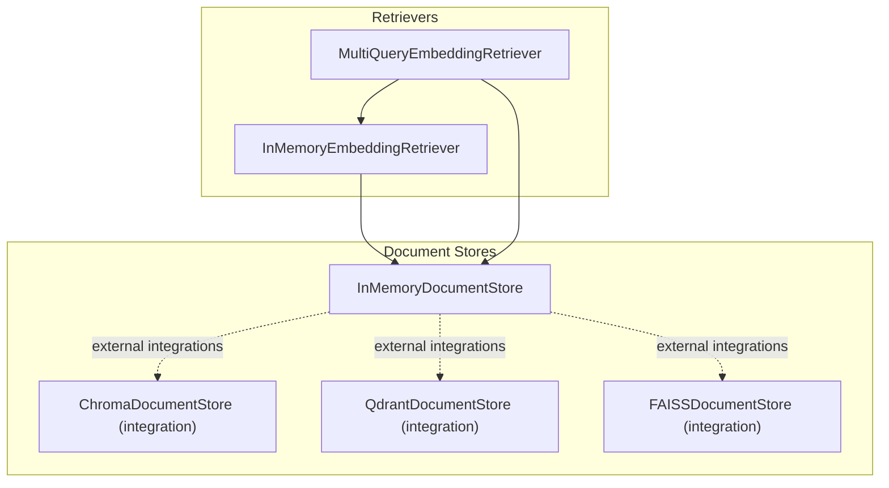
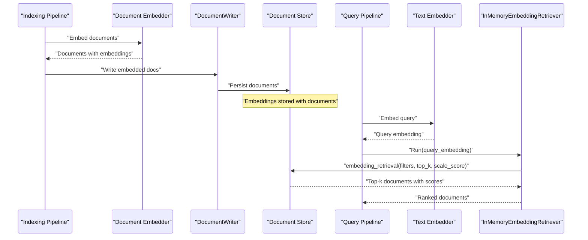
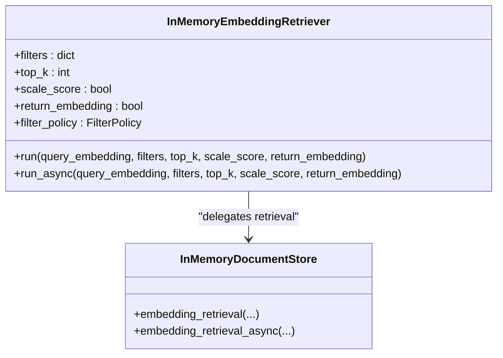
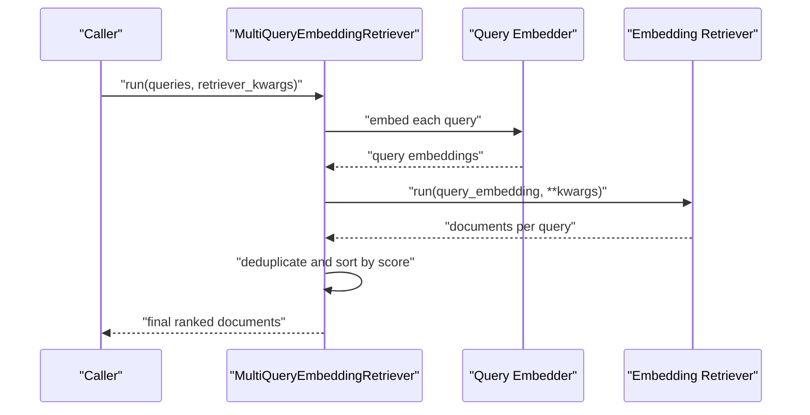
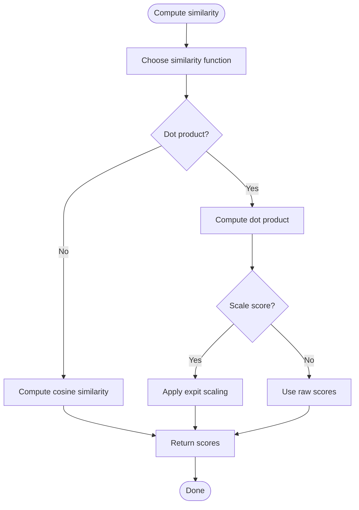
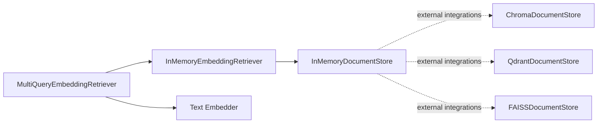

# Embedding-Based Retrievers

<cite>
**Referenced Files in This Document**
- [embedding_retriever.py](file://haystack/components/retrievers/in_memory/embedding_retriever.py)
- [multi_query_embedding_retriever.py](file://haystack/components/retrievers/multi_query_embedding_retriever.py)
- [__init__.py](file://haystack/components/retrievers/__init__.py)
- [document_store.py](file://haystack/document_stores/in_memory/document_store.py)
- [test_in_memory.py](file://test/document_stores/test_in_memory.py)
- [test_in_memory_embedding_retriever.py](file://test/components/retrievers/test_in_memory_embedding_retriever.py)
- [test_multi_query_embedding_retriever.py](file://test/components/retrievers/test_multi_query_embedding_retriever.py)
- [qdrant-document-store.mdx](file://docs-website/docs/document-stores/qdrant-document-store.mdx)
- [chromadocumentstore.mdx](file://docs-website/docs/document-stores/chromadocumentstore.mdx)
- [faiss.md](file://docs-website/reference/integrations-api/faiss.md)
</cite>

## Table of Contents
1. [Introduction](#introduction)
2. [Project Structure](#project-structure)
3. [Core Components](#core-components)
4. [Architecture Overview](#architecture-overview)
5. [Detailed Component Analysis](#detailed-component-analysis)
6. [Dependency Analysis](#dependency-analysis)
7. [Performance Considerations](#performance-considerations)
8. [Troubleshooting Guide](#troubleshooting-guide)
9. [Conclusion](#conclusion)
10. [Appendices](#appendices)

## Introduction
This document explains embedding-based retrievers: how they compute vector similarities between queries and stored document embeddings, and how to configure and deploy them effectively. It covers:
- Local development with the InMemoryEmbeddingRetriever
- Query expansion via MultiQueryEmbeddingRetriever
- Integrations with cloud/vector databases (Chroma, Qdrant, FAISS)
- Embedding computation, similarity scoring (cosine similarity, dot product), and performance optimization
- Practical setup examples, dimension configuration, metadata filtering, batch processing, and memory management for production

## Project Structure
The embedding retriever ecosystem spans three main areas:
- Retrievers: In-memory embedding retriever and multi-query embedding retriever
- Document stores: InMemoryDocumentStore (local), plus external vector stores (Chroma, Qdrant, FAISS)
- Tests and documentation: Examples and validations for retriever behavior and similarity scoring

**Diagram sources**
- [embedding_retriever.py](file://haystack/components/retrievers/in_memory/embedding_retriever.py#L12-L237)
- [multi_query_embedding_retriever.py](file://haystack/components/retrievers/multi_query_embedding_retriever.py#L15-L167)
- [document_store.py](file://haystack/document_stores/in_memory/document_store.py#L59-L200)
- [qdrant-document-store.mdx](file://docs-website/docs/document-stores/qdrant-document-store.mdx#L1-L47)
- [chromadocumentstore.mdx](file://docs-website/docs/document-stores/chromadocumentstore.mdx#L1-L31)
- [faiss.md](file://docs-website/reference/integrations-api/faiss.md#L405-L455)

**Section sources**
- [__init__.py](file://haystack/components/retrievers/__init__.py#L10-L29)

## Core Components
- InMemoryEmbeddingRetriever: Retrieves documents by semantic similarity against stored embeddings in memory. Supports filters, top-k selection, score scaling, and optional return of embeddings.
- MultiQueryEmbeddingRetriever: Expands a list of text queries into embeddings and runs them in parallel against a retriever, deduplicating and ranking results.
- InMemoryDocumentStore: Provides embedding similarity computation and retrieval with configurable similarity function (dot product or cosine), and optional score scaling.

Key capabilities:
- Similarity scoring: dot product and cosine similarity
- Metadata filtering: REPLACE or MERGE policies
- Async retrieval support
- Batch-friendly design via multi-query expansion

**Section sources**
- [embedding_retriever.py](file://haystack/components/retrievers/in_memory/embedding_retriever.py#L51-L96)
- [embedding_retriever.py](file://haystack/components/retrievers/in_memory/embedding_retriever.py#L136-L185)
- [multi_query_embedding_retriever.py](file://haystack/components/retrievers/multi_query_embedding_retriever.py#L75-L86)
- [document_store.py](file://haystack/document_stores/in_memory/document_store.py#L64-L124)

## Architecture Overview
The embedding retrieval pipeline connects embedders (document and text) to retrievers backed by a document store. For local development, the InMemoryDocumentStore is used; for production, external vector stores integrate similarly.

**Diagram sources**
- [embedding_retriever.py](file://haystack/components/retrievers/in_memory/embedding_retriever.py#L136-L185)
- [document_store.py](file://haystack/document_stores/in_memory/document_store.py#L64-L124)

## Detailed Component Analysis

### InMemoryEmbeddingRetriever
Purpose:
- Performs semantic retrieval using stored document embeddings and a provided query embedding.

Behavior highlights:
- Accepts runtime filters and merges with initialization filters depending on filter policy
- Supports top-k selection and optional score scaling
- Can return embeddings alongside documents

**Diagram sources**
- [embedding_retriever.py](file://haystack/components/retrievers/in_memory/embedding_retriever.py#L12-L237)
- [document_store.py](file://haystack/document_stores/in_memory/document_store.py#L64-L124)

**Section sources**
- [embedding_retriever.py](file://haystack/components/retrievers/in_memory/embedding_retriever.py#L51-L96)
- [embedding_retriever.py](file://haystack/components/retrievers/in_memory/embedding_retriever.py#L136-L185)
- [embedding_retriever.py](file://haystack/components/retrievers/in_memory/embedding_retriever.py#L187-L237)

### MultiQueryEmbeddingRetriever
Purpose:
- Expand a list of text queries into embeddings and run them in parallel against a retriever, combining and deduplicating results.

Key points:
- Uses a ThreadPoolExecutor to parallelize query processing
- De-duplicates and sorts results by score
- Supports warm-up for embedder and retriever

**Diagram sources**
- [multi_query_embedding_retriever.py](file://haystack/components/retrievers/multi_query_embedding_retriever.py#L100-L126)
- [multi_query_embedding_retriever.py](file://haystack/components/retrievers/multi_query_embedding_retriever.py#L128-L141)

**Section sources**
- [multi_query_embedding_retriever.py](file://haystack/components/retrievers/multi_query_embedding_retriever.py#L75-L86)
- [multi_query_embedding_retriever.py](file://haystack/components/retrievers/multi_query_embedding_retriever.py#L100-L126)
- [multi_query_embedding_retriever.py](file://haystack/components/retrievers/multi_query_embedding_retriever.py#L128-L141)

### InMemoryDocumentStore: Embedding Retrieval and Similarity Scoring
Highlights:
- Configurable similarity function: dot product or cosine
- Optional score scaling for dot product
- Internal helpers compute similarity scores and support async retrieval

**Diagram sources**
- [document_store.py](file://haystack/document_stores/in_memory/document_store.py#L64-L124)
- [test_in_memory.py](file://test/document_stores/test_in_memory.py#L489-L511)

**Section sources**
- [document_store.py](file://haystack/document_stores/in_memory/document_store.py#L64-L124)
- [test_in_memory.py](file://test/document_stores/test_in_memory.py#L489-L511)

## Dependency Analysis
- InMemoryEmbeddingRetriever depends on InMemoryDocumentStore for retrieval and similarity computation.
- MultiQueryEmbeddingRetriever composes a retriever and a text embedder; it orchestrates parallel execution and post-processing.
- External vector stores (Chroma, Qdrant, FAISS) integrate via their respective document store implementations and share the same embedding retrieval semantics.

**Diagram sources**
- [embedding_retriever.py](file://haystack/components/retrievers/in_memory/embedding_retriever.py#L12-L237)
- [multi_query_embedding_retriever.py](file://haystack/components/retrievers/multi_query_embedding_retriever.py#L15-L167)
- [document_store.py](file://haystack/document_stores/in_memory/document_store.py#L59-L200)
- [qdrant-document-store.mdx](file://docs-website/docs/document-stores/qdrant-document-store.mdx#L1-L47)
- [chromadocumentstore.mdx](file://docs-website/docs/document-stores/chromadocumentstore.mdx#L1-L31)
- [faiss.md](file://docs-website/reference/integrations-api/faiss.md#L405-L455)

**Section sources**
- [__init__.py](file://haystack/components/retrievers/__init__.py#L10-L29)

## Performance Considerations
- Similarity scoring
  - Dot product vs cosine: choose based on model characteristics; cosine normalizes vectors, while dot product preserves magnitude.
  - Score scaling: dot product scores can be scaled using a sigmoid-like transform to constrain scores to [0,1].
- Parallelism
  - MultiQueryEmbeddingRetriever uses a thread pool to embed and retrieve per query concurrently.
- Memory management
  - InMemoryDocumentStore keeps everything in RAM; monitor memory usage for large collections.
  - Consider FAISS for large-scale scenarios requiring efficient indexing and disk persistence.
- Batch processing
  - Prefer multi-query expansion to amortize embedding costs across related queries.
- Metadata filtering
  - Use MERGE to combine initialization and runtime filters; REPLACE to override filters per query.

[No sources needed since this section provides general guidance]

## Troubleshooting Guide
Common issues and checks:
- Invalid top_k: Ensure top_k > 0; otherwise, an error is raised.
- Wrong document store type: InMemoryEmbeddingRetriever requires an InMemoryDocumentStore.
- Filters not applied: Verify filter policy (REPLACE vs MERGE) and filter correctness.
- Unexpected scores: Confirm similarity function and scaling settings.
- Concurrency problems: Ensure proper executor lifecycle and avoid blocking operations inside the thread pool.

**Section sources**
- [embedding_retriever.py](file://haystack/components/retrievers/in_memory/embedding_retriever.py#L84-L96)
- [embedding_retriever.py](file://haystack/components/retrievers/in_memory/embedding_retriever.py#L166-L169)
- [test_in_memory_embedding_retriever.py](file://test/components/retrievers/test_in_memory_embedding_retriever.py#L66-L90)

## Conclusion
Embedding-based retrievers enable fast, semantic search by comparing query and document embeddings. For local development, InMemoryEmbeddingRetriever paired with InMemoryDocumentStore offers simplicity and speed. For production, expand to external vector stores (Chroma, Qdrant, FAISS) while preserving the same retrieval interface. Combine multi-query expansion with parallel execution to improve recall and throughput, and tune similarity scoring and filtering to meet your accuracy and latency goals.

[No sources needed since this section summarizes without analyzing specific files]

## Appendices

### Practical Setup Examples and Configuration

- Local development with InMemoryDocumentStore and InMemoryEmbeddingRetriever
  - Embed documents and write them to the store
  - Embed queries and pass the embedding to the retriever
  - Configure similarity function and top-k

  See example usage in documentation:
  - [In a pipeline](file://docs-website/versioned_docs/version-2.19/pipeline-components/embedders/sentencetransformersdocumentembedder.mdx#L100-L143)

- MultiQueryEmbeddingRetriever with parallel query expansion
  - Provide a retriever and a text embedder
  - Supply a list of queries; results are deduplicated and sorted

  See example usage in tests:
  - [Test initialization and usage](file://test/components/retrievers/test_multi_query_embedding_retriever.py#L66-L90)

- External vector database integrations
  - Chroma: Install the integration and initialize a ChromaDocumentStore
    - [Chroma setup](file://docs-website/docs/document-stores/chromadocumentstore.mdx#L22-L31)
  - Qdrant: Install the integration and initialize a QdrantDocumentStore
    - [Qdrant setup](file://docs-website/docs/document-stores/qdrant-document-store.mdx#L23-L47)
  - FAISS: Use FAISSDocumentStore for large-scale retrieval with persistent indices
    - [FAISS API reference](file://docs-website/reference/integrations-api/faiss.md#L405-L455)

- Embedding dimensions and model selection
  - Choose models that produce embeddings compatible with your vector store’s configured dimensionality
  - Some integrations expose parameters to adjust precision or truncate dimensions for memory savings

[No sources needed since this section aggregates references already cited above]