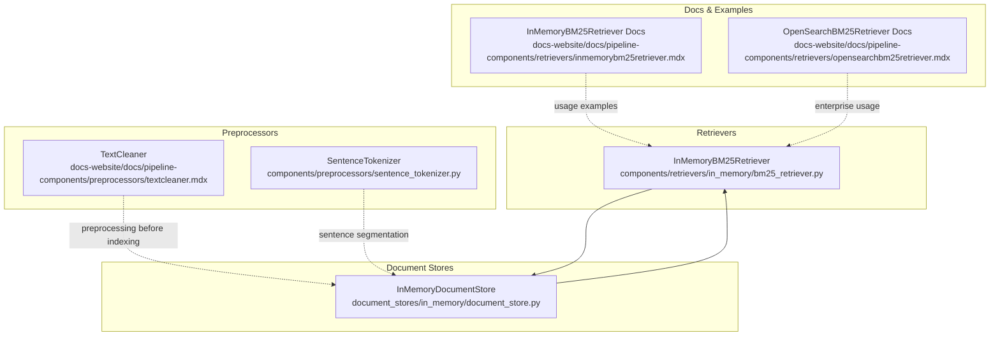
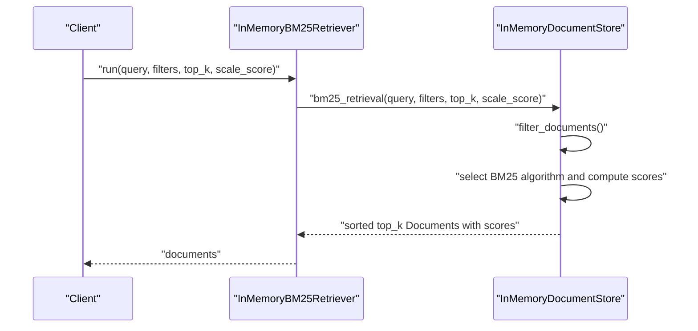
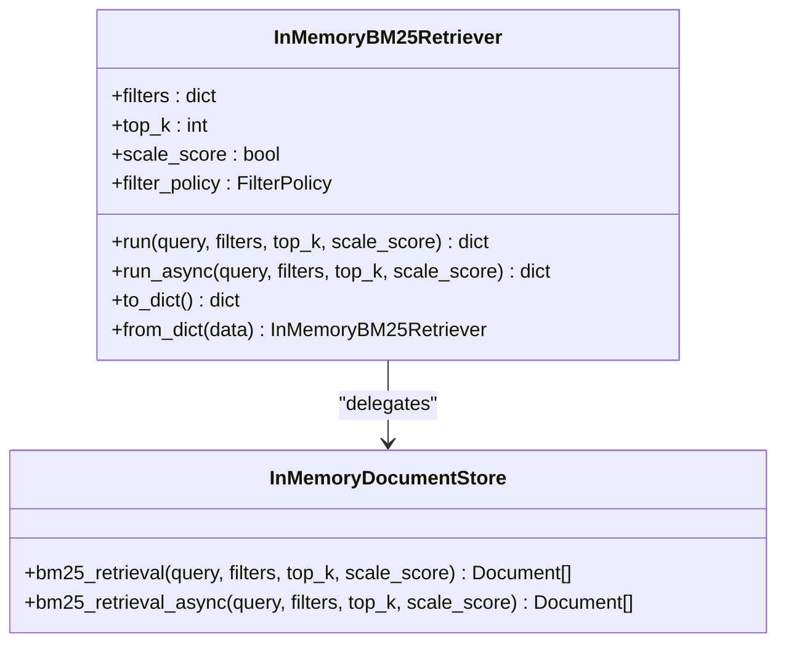
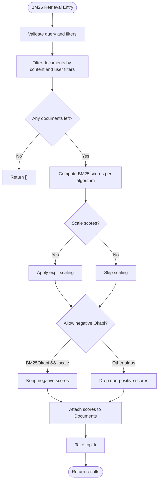
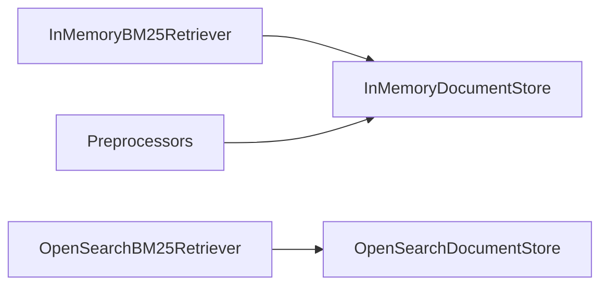

# Keyword-Based Retrievers

<cite>
**Referenced Files in This Document**
- [bm25_retriever.py](file://haystack/components/retrievers/in_memory/bm25_retriever.py)
- [document_store.py](file://haystack/document_stores/in_memory/document_store.py)
- [test_in_memory.py](file://test/document_stores/test_in_memory.py)
- [inmemorybm25retriever.mdx](file://docs-website/docs/pipeline-components/retrievers/inmemorybm25retriever.mdx)
- [opensearchbm25retriever.mdx](file://docs-website/docs/pipeline-components/retrievers/opensearchbm25retriever.mdx)
- [textcleaner.mdx](file://docs-website/docs/pipeline-components/preprocessors/textcleaner.mdx)
- [sentence_tokenizer.py](file://haystack/components/preprocessors/sentence_tokenizer.py)
- [inmemorybm25retriever-zero-score-docs-67406062a76aa7f4.yaml](file://releasenotes/notes/inmemorybm25retriever-zero-score-docs-67406062a76aa7f4.yaml)
- [enhance-inmemorydocumentstore-bm25-incremental-indexing-ebaf43b7163f3a24.yaml](file://releasenotes/notes/enhance-inmemorydocumentstore-bm25-incremental-indexing-ebaf43b7163f3a24.yaml)
</cite>

## Table of Contents
1. [Introduction](#introduction)
2. [Project Structure](#project-structure)
3. [Core Components](#core-components)
4. [Architecture Overview](#architecture-overview)
5. [Detailed Component Analysis](#detailed-component-analysis)
6. [Dependency Analysis](#dependency-analysis)
7. [Performance Considerations](#performance-considerations)
8. [Troubleshooting Guide](#troubleshooting-guide)
9. [Conclusion](#conclusion)
10. [Appendices](#appendices)

## Introduction
This document explains keyword-based retrievers with a focus on BM25 and text matching algorithms. It covers how BM25 scoring works (term frequency, inverse document frequency, and length normalization), how to configure BM25 parameters, and how to handle multi-term queries. It also documents the InMemoryBM25Retriever for local keyword search and the OpenSearchBM25Retriever for enterprise-scale keyword retrieval. Practical guidance is included for text preprocessing, tokenization, and fuzzy matching. Use cases where keyword precision matters more than semantic understanding—such as technical documentation search and structured content retrieval—are highlighted.

## Project Structure
The relevant components for keyword-based retrieval are organized as follows:
- In-memory retriever and document store: components under haystack/components/retrievers/in_memory and haystack/document_stores/in_memory
- Documentation and examples: docs-website/docs/pipeline-components/retrievers
- Preprocessing utilities: haystack/components/preprocessors
- Release notes: releasenotes/notes

**Diagram sources**
- [bm25_retriever.py](file://haystack/components/retrievers/in_memory/bm25_retriever.py#L12-L197)
- [document_store.py](file://haystack/document_stores/in_memory/document_store.py#L59-L800)
- [textcleaner.mdx](file://docs-website/docs/pipeline-components/preprocessors/textcleaner.mdx#L18-L56)
- [sentence_tokenizer.py](file://haystack/components/preprocessors/sentence_tokenizer.py#L50-L81)
- [inmemorybm25retriever.mdx](file://docs-website/docs/pipeline-components/retrievers/inmemorybm25retriever.mdx#L22-L45)
- [opensearchbm25retriever.mdx](file://docs-website/docs/pipeline-components/retrievers/opensearchbm25retriever.mdx#L19-L30)

**Section sources**
- [bm25_retriever.py](file://haystack/components/retrievers/in_memory/bm25_retriever.py#L12-L197)
- [document_store.py](file://haystack/document_stores/in_memory/document_store.py#L59-L800)
- [inmemorybm25retriever.mdx](file://docs-website/docs/pipeline-components/retrievers/inmemorybm25retriever.mdx#L22-L45)
- [opensearchbm25retriever.mdx](file://docs-website/docs/pipeline-components/retrievers/opensearchbm25retriever.mdx#L19-L30)
- [textcleaner.mdx](file://docs-website/docs/pipeline-components/preprocessors/textcleaner.mdx#L18-L56)
- [sentence_tokenizer.py](file://haystack/components/preprocessors/sentence_tokenizer.py#L50-L81)

## Core Components
- InMemoryBM25Retriever: a keyword-based retriever that delegates BM25 retrieval to an InMemoryDocumentStore. It supports runtime filters, top_k selection, and optional score scaling.
- InMemoryDocumentStore: provides BM25 retrieval with support for BM25Okapi, BM25L, and BM25Plus variants, configurable tokenization, and incremental statistics maintenance.

Key capabilities:
- Tokenization via regex and lowercasing
- BM25 scoring variants with tunable parameters
- Optional score scaling to [0, 1]
- Async retrieval support
- Metadata filtering and content-type filtering enforced internally

**Section sources**
- [bm25_retriever.py](file://haystack/components/retrievers/in_memory/bm25_retriever.py#L41-L82)
- [document_store.py](file://haystack/document_stores/in_memory/document_store.py#L64-L125)
- [document_store.py](file://haystack/document_stores/in_memory/document_store.py#L552-L608)

## Architecture Overview
The retrieval flow connects a retriever to a document store. The retriever passes the query and optional filters to the store, which computes BM25 scores against stored documents and returns the top-k results.

**Diagram sources**
- [bm25_retriever.py](file://haystack/components/retrievers/in_memory/bm25_retriever.py#L120-L156)
- [document_store.py](file://haystack/document_stores/in_memory/document_store.py#L552-L608)

## Detailed Component Analysis

### InMemoryBM25Retriever
Responsibilities:
- Validate and accept runtime parameters (filters, top_k, scale_score)
- Merge runtime filters with initialization filters according to FilterPolicy
- Delegate retrieval to the underlying InMemoryDocumentStore
- Support synchronous and asynchronous retrieval

Behavior highlights:
- Accepts a FilterPolicy to control filter merging vs replacement
- Raises errors for invalid top_k and non-InMemoryDocumentStore instances
- Serializes and deserializes with filter policy encoded as a string

**Diagram sources**
- [bm25_retriever.py](file://haystack/components/retrievers/in_memory/bm25_retriever.py#L12-L197)
- [document_store.py](file://haystack/document_stores/in_memory/document_store.py#L552-L781)

**Section sources**
- [bm25_retriever.py](file://haystack/components/retrievers/in_memory/bm25_retriever.py#L41-L82)
- [bm25_retriever.py](file://haystack/components/retrievers/in_memory/bm25_retriever.py#L120-L156)
- [bm25_retriever.py](file://haystack/components/retrievers/in_memory/bm25_retriever.py#L158-L197)

### InMemoryDocumentStore BM25 Implementation
Core mechanics:
- Tokenization: regex-based, lowercased
- Statistics: per-document token counts, vocabulary frequency, average document length
- Scoring algorithms:
  - BM25Okapi: classic variant with epsilon smoothing for negative IDF
  - BM25L: uses a dampening delta and normalized term frequency
  - BM25Plus: adds 1 to document frequency in IDF calculation
- Filtering: internal enforcement of content presence and optional user filters
- Score scaling: optional sigmoid-like scaling for BM25 scores

**Diagram sources**
- [document_store.py](file://haystack/document_stores/in_memory/document_store.py#L552-L608)
- [document_store.py](file://haystack/document_stores/in_memory/document_store.py#L193-L346)

**Section sources**
- [document_store.py](file://haystack/document_stores/in_memory/document_store.py#L64-L125)
- [document_store.py](file://haystack/document_stores/in_memory/document_store.py#L163-L174)
- [document_store.py](file://haystack/document_stores/in_memory/document_store.py#L176-L192)
- [document_store.py](file://haystack/document_stores/in_memory/document_store.py#L193-L346)
- [document_store.py](file://haystack/document_stores/in_memory/document_store.py#L552-L608)

### OpenSearchBM25 Integrations
Enterprise-scale keyword retrieval:
- Uses OpenSearchDocumentStore to leverage Elasticsearch/OpenSearch BM25 engine
- Supports fuzzy matching and all_terms_must_match options
- Suitable for production workloads requiring distributed search and robust analyzers

Practical notes:
- Configure fuzziness and term matching semantics via retriever/store parameters
- Combine with filters and metadata for precise scoping

**Section sources**
- [opensearchbm25retriever.mdx](file://docs-website/docs/pipeline-components/retrievers/opensearchbm25retriever.mdx#L19-L30)

### Text Preprocessing, Tokenization, and Fuzzy Matching
- Tokenization: InMemoryDocumentStore uses a configurable regex tokenizer and lowercases input. This ensures consistent BM25 tokenization across the corpus.
- Preprocessing: TextCleaner and SentenceTokenizer help normalize and segment text prior to indexing, improving recall and precision for keyword matching.
- Fuzzy matching: OpenSearchBM25Retriever exposes fuzziness and all_terms_must_match controls for flexible matching.

**Section sources**
- [document_store.py](file://haystack/document_stores/in_memory/document_store.py#L66-L93)
- [textcleaner.mdx](file://docs-website/docs/pipeline-components/preprocessors/textcleaner.mdx#L18-L56)
- [sentence_tokenizer.py](file://haystack/components/preprocessors/sentence_tokenizer.py#L50-L81)
- [opensearchbm25retriever.mdx](file://docs-website/docs/pipeline-components/retrievers/opensearchbm25retriever.mdx#L22-L38)

## Dependency Analysis
- InMemoryBM25Retriever depends on InMemoryDocumentStore for BM25 scoring and filtering
- InMemoryDocumentStore encapsulates BM25 algorithm implementations and maintains BM25 statistics incrementally
- OpenSearchBM25Retriever integrates with OpenSearchDocumentStore for enterprise-scale BM25

**Diagram sources**
- [bm25_retriever.py](file://haystack/components/retrievers/in_memory/bm25_retriever.py#L7-L9)
- [document_store.py](file://haystack/document_stores/in_memory/document_store.py#L59-L125)

**Section sources**
- [bm25_retriever.py](file://haystack/components/retrievers/in_memory/bm25_retriever.py#L7-L9)
- [document_store.py](file://haystack/document_stores/in_memory/document_store.py#L59-L125)

## Performance Considerations
- Incremental BM25 indexing: InMemoryDocumentStore rebuilds statistics incrementally to avoid reindexing the entire corpus on each query.
- Score scaling: Optional scaling reduces extreme score magnitudes and improves downstream ranking stability.
- Filter policy: Use MERGE to combine initialization and runtime filters; REPLACE for dynamic overrides.
- Async retrieval: Use async APIs for high-throughput scenarios.

Evidence and guidance:
- Incremental indexing improvements and removal of external dependency
- Score scaling factor and scaling behavior
- Async retrieval methods

**Section sources**
- [enhance-inmemorydocumentstore-bm25-incremental-indexing-ebaf43b7163f3a24.yaml](file://releasenotes/notes/enhance-inmemorydocumentstore-bm25-incremental-indexing-ebaf43b7163f3a24.yaml#L1-L7)
- [document_store.py](file://haystack/document_stores/in_memory/document_store.py#L28-L36)
- [document_store.py](file://haystack/document_stores/in_memory/document_store.py#L766-L781)
- [bm25_retriever.py](file://haystack/components/retrievers/in_memory/bm25_retriever.py#L146-L155)

## Troubleshooting Guide
Common issues and resolutions:
- Zero-score documents returned: The retriever avoids returning documents with a zero score when not explicitly requested.
- Negative BM25Okapi scores: These are valid when not scaling; they are filtered out when scale_score is enabled.
- Empty results: Ensure content is present and not filtered out; verify filters and query tokenization.
- Invalid filters: Filters must follow the documented syntax; otherwise, validation raises errors.

Validation and tests:
- Retrieval correctness and scaling behavior
- Updated documents affecting results
- Zero-score prevention

**Section sources**
- [inmemorybm25retriever-zero-score-docs-67406062a76aa7f4.yaml](file://releasenotes/notes/inmemorybm25retriever-zero-score-docs-67406062a76aa7f4.yaml#L1-L3)
- [document_store.py](file://haystack/document_stores/in_memory/document_store.py#L584-L596)
- [test_in_memory.py](file://test/document_stores/test_in_memory.py#L250-L299)

## Conclusion
Keyword-based retrieval with BM25 remains highly effective for precision-centric tasks such as technical documentation and structured content. InMemoryBM25Retriever and InMemoryDocumentStore provide a fast, configurable solution with tunable algorithms and scoring. For enterprise deployments, OpenSearchBM25Retriever integrates with OpenSearch/Elasticsearch to deliver scalable, production-ready keyword search with fuzzy matching and advanced analyzers. Proper preprocessing, tokenization, and careful tuning of BM25 parameters ensure robust and performant retrieval.

## Appendices

### Practical Configuration Examples
- Configure BM25 parameters: Set bm25_parameters with keys such as k1, b, delta, epsilon when initializing the InMemoryDocumentStore.
- Multi-term queries: Queries are tokenized and scored across multiple terms; BM25 aggregates per-token contributions.
- Fuzzy matching (OpenSearch): Adjust fuzziness and all_terms_must_match to balance precision and recall.

**Section sources**
- [document_store.py](file://haystack/document_stores/in_memory/document_store.py#L68-L104)
- [opensearchbm25retriever.mdx](file://docs-website/docs/pipeline-components/retrievers/openseearchbm25retriever.mdx#L22-L38)