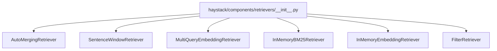
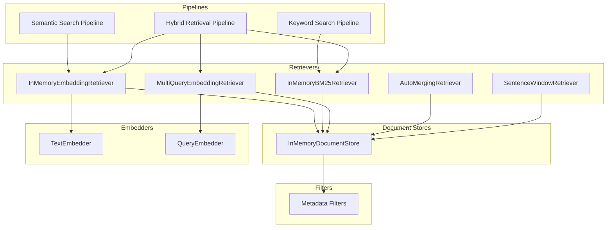
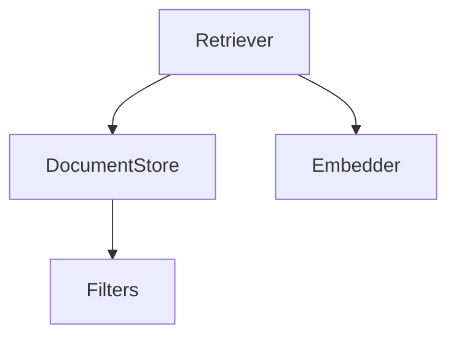

# Retrievers

<cite>
**Referenced Files in This Document**
- [__init__.py](file://haystack/components/retrievers/__init__.py)
- [auto_merging_retriever.py](file://haystack/components/retrievers/auto_merging_retriever.py)
- [sentence_window_retriever.py](file://haystack/components/retrievers/sentence_window_retriever.py)
- [multi_query_embedding_retriever.py](file://haystack/components/retrievers/multi_query_embedding_retriever.py)
- [document.py](file://haystack/dataclasses/document.py)
- [filters.py](file://haystack/utils/filters.py)
- [automergingretriever.mdx](file://docs-website/docs/pipeline-components/retrievers/automergingretriever.mdx)
- [releasenotes notes add-window-size-parameter-runtime-e841c4471f9d6b9c.yaml](file://releasenotes/notes/add-window-size-parameter-runtime-e841c4471f9d6b9c.yaml)
- [releasenotes notes sentence-window-retriever-output-docs-d3de2ac4328488f1.yaml](file://releasenotes/notes/sentence-window-retriever-output-docs-d3de2ac4328488f1.yaml)
- [releasenotes notes rename-sentence-window-retrieval-be4cd6e1d18ef10e.yaml](file://releasenotes/notes/rename-sentence-window-retrieval-be4cd6e1d18ef10e.yaml)
- [releasenotes notes sentence-window-retriever-change-output-7beca98e9951039e.yaml](file://releasenotes/notes/sentence-window-retriever-change-output-7beca98e9951039e.yaml)
- [releasenotes notes add-run-async-to-sentence-window-retriever-06165eb1fbf9a76f.yaml](file://releasenotes/notes/add-run-async-to-sentence-window-retriever-06165eb1fbf9a76f.yaml)
- [releasenotes notes inmemorybm25retriever-zero-score-docs-67406062a76aa7f4.yaml](file://releasenotes/notes/inmemorybm25retriever-zero-score-docs-67406062a76aa7f4.yaml)
- [releasenotes notes retrievers-filter-policy-enhancement-af52d026c346e9c0.yaml](file://releasenotes/notes/retrievers-filter-policy-enhancement-af52d026c346e9c0.yaml)
- [test_multi_query_embedding_retriever.py](file://test/components/retrievers/test_multi_query_embedding_retriever.py)
</cite>

## Table of Contents
1. [Introduction](#introduction)
2. [Project Structure](#project-structure)
3. [Core Components](#core-components)
4. [Architecture Overview](#architecture-overview)
5. [Detailed Component Analysis](#detailed-component-analysis)
6. [Dependency Analysis](#dependency-analysis)
7. [Performance Considerations](#performance-considerations)
8. [Troubleshooting Guide](#troubleshooting-guide)
9. [Conclusion](#conclusion)
10. [Appendices](#appendices)

## Introduction
This document explains Haystack’s retriever ecosystem with a focus on the major retriever families and specialized components. It covers embedding retrievers, BM25 retrievers, hybrid retrievers, and specialized retrievers such as Auto-Merging Retriever and Sentence Window Retriever. For each retriever family, we describe purpose, functionality, typical use cases, common interfaces, input/output parameters, similarity scoring, filtering capabilities, and performance optimization techniques. Practical examples show how to configure retrievers in semantic search, keyword search, and hybrid retrieval pipelines. Guidance is also provided on selecting the right retriever for different document types and search requirements.

## Project Structure
Retriever components are exposed via a lazy-imported package entry point. The retrievers module groups specialized retrievers under a single namespace, enabling flexible imports and reduced startup overhead.

**Diagram sources**
- [__init__.py](file://haystack/components/retrievers/__init__.py#L10-L29)

**Section sources**
- [__init__.py](file://haystack/components/retrievers/__init__.py#L1-L30)

## Core Components
This section introduces the primary retriever families and specialized components available in Haystack.

- Embedding retrievers: Retrieve documents by comparing dense embeddings of queries and documents. They excel at semantic similarity and are commonly paired with a document store and an embedder.
- BM25 retrievers: Keyword-based retrieval using inverted indices and BM25 scoring. They are fast and effective for lexical matching.
- Hybrid retrievers: Combine multiple retrievers (e.g., embedding and BM25) to leverage both lexical and semantic signals.
- Specialized retrievers:
  - Auto-Merging Retriever: Aggregates overlapping leaf documents into parent documents when a matching threshold is met, improving context coherence.
  - Sentence Window Retriever: Expands retrieved sentences into surrounding context windows for richer snippets.

Key shared data model:
- Documents carry content, metadata, optional embeddings, optional sparse embeddings, and a score used for ranking.

**Section sources**
- [document.py](file://haystack/dataclasses/document.py#L48-L90)
- [automergingretriever.mdx](file://docs-website/docs/pipeline-components/retrievers/automergingretriever.mdx#L23-L33)

## Architecture Overview
The retriever ecosystem integrates with document stores and embedders to form end-to-end pipelines. Filtering is supported through a unified filter syntax.

[No sources needed since this diagram shows conceptual workflow, not actual code structure]

## Detailed Component Analysis

### Embedding Retrievers
Purpose:
- Retrieve documents based on dense vector similarity between query and document embeddings.

Functionality:
- Accepts a query embedding and retrieves top-k documents from a document store that contains embeddings.
- Supports runtime filters and configurable filter policies to merge or replace initial filters.

Typical use cases:
- Semantic search over structured corpora.
- Retrieval-augmented generation (RAG) pipelines.

Common interface:
- Inputs: query embedding, filters, top_k, scale_score.
- Outputs: list of Documents with scores.

Similarity scoring:
- Cosine similarity or dot product depending on the underlying document store implementation.

Filtering:
- Runtime filters applied according to the chosen filter policy.

Performance tips:
- Pre-compute and cache embeddings.
- Tune top_k and filter policies to reduce downstream processing.

**Section sources**
- [releasenotes notes retrievers-filter-policy-enhancement-af52d026c346e9c0.yaml](file://releasenotes/notes/retrievers-filter-policy-enhancement-af52d026c346e9c0.yaml#L1-L4)

### BM25 Retrievers
Purpose:
- Perform keyword-based retrieval using BM25 scoring over lexical terms.

Functionality:
- Uses inverted indices and term frequencies to compute relevance scores.
- Excludes zero-score documents from results.

Typical use cases:
- Fast keyword search, factoid QA, and lexically focused retrieval.

Common interface:
- Inputs: query text, filters, top_k.
- Outputs: list of Documents with BM25-derived scores.

Filtering:
- Runtime filters applied according to the chosen filter policy.

Performance tips:
- Keep vocabulary normalized (lowercase, stemming) for consistent BM25 behavior.
- Limit top_k to reduce post-processing overhead.

**Section sources**
- [releasenotes notes inmemorybm25retriever-zero-score-docs-67406062a76aa7f4.yaml](file://releasenotes/notes/inmemorybm25retriever-zero-score-docs-67406062a76aa7f4.yaml#L1-L3)
- [releasenotes notes retrievers-filter-policy-enhancement-af52d026c346e9c0.yaml](file://releasenotes/notes/retrievers-filter-policy-enhancement-af52d026c346e9c0.yaml#L1-L4)

### Hybrid Retrievers
Purpose:
- Combine lexical and semantic signals to improve recall and precision.

Functionality:
- Often implemented by composing two retrievers (e.g., BM25 and embedding) and merging their results.
- May re-rank or fuse scores to produce final ranked lists.

Typical use cases:
- General-purpose search, robust RAG retrieval, and scenarios requiring both lexical and semantic coverage.

Common interface:
- Inputs: query text or embedding, filters, top_k.
- Outputs: merged and ranked Documents.

Filtering:
- Apply filters consistently across both retrievers or per-retriever depending on configuration.

Performance tips:
- Use fast BM25 for broad recall, then refine with embedding retriever.
- Fuse scores carefully to avoid dominance by one modality.

[No sources needed since this section provides general guidance]

### Auto-Merging Retriever
Purpose:
- Aggregates overlapping leaf documents into parent documents when a matching threshold is met, improving context coherence.

Functionality:
- Requires a hierarchical document structure where leaf nodes are indexed and parents represent larger units (e.g., paragraphs).
- Returns parent documents when sufficient child matches are detected.

Typical use cases:
- Paragraph-level retrieval from chunked documents.
- Reducing fragmentation in retrieval outputs.

Common interface:
- Inputs: documents (leaf-level), thresholds, and optional parameters controlling merging behavior.
- Outputs: list of parent documents representing coherent contexts.

Filtering:
- Applied before or after merging depending on configuration.

Performance tips:
- Tune thresholds to balance granularity vs. coherence.
- Ensure hierarchical structure is properly built upstream.

**Section sources**
- [automergingretriever.mdx](file://docs-website/docs/pipeline-components/retrievers/automergingretriever.mdx#L23-L33)
- [auto_merging_retriever.py](file://haystack/components/retrievers/auto_merging_retriever.py)

### Sentence Window Retriever
Purpose:
- Retrieves sentences and expands them into surrounding context windows to provide richer snippets.

Functionality:
- Supports runtime window size overrides and returns both the retrieved documents and the full context window.
- Provides async support for use in async pipelines.

Typical use cases:
- QA over long texts where local context around a sentence improves answerability.
- RAG where sentence-level retrieval benefits from broader context.

Common interface:
- Inputs: query text, filters, top_k, window_size (runtime override supported).
- Outputs: retrieved documents plus the expanded context window.

Filtering:
- Applied to the initial sentence-level retrieval.

Performance tips:
- Adjust window_size based on downstream generator capacity.
- Use async run for improved throughput in async pipelines.

**Section sources**
- [releasenotes notes add-window-size-parameter-runtime-e841c4471f9d6b9c.yaml](file://releasenotes/notes/add-window-size-parameter-runtime-e841c4471f9d6b9c.yaml#L1-L4)
- [releasenotes notes sentence-window-retriever-output-docs-d3de2ac4328488f1.yaml](file://releasenotes/notes/sentence-window-retriever-output-docs-d3de2ac4328488f1.yaml#L1-L4)
- [releasenotes notes sentence-window-retriever-change-output-7beca98e9951039e.yaml](file://releasenotes/notes/sentence-window-retriever-change-output-7beca9951039e.yaml#L1-L4)
- [releasenotes notes rename-sentence-window-retrieval-be4cd6e1d18ef10e.yaml](file://releasenotes/notes/rename-sentence-window-retrieval-be4cd6e1d18ef10e.yaml#L1-L4)
- [releasenotes notes add-run-async-to-sentence-window-retriever-06165eb1fbf9a76f.yaml](file://releasenotes/notes/add-run-async-to-sentence-window-retriever-06165eb1fbf9a76f.yaml#L1-L5)
- [sentence_window_retriever.py](file://haystack/components/retrievers/sentence_window_retriever.py)

### Multi-Query Embedding Retriever
Purpose:
- Generates multiple interpretations of the original query to improve recall by querying the same retriever multiple times.

Functionality:
- Wraps an embedding retriever and a query embedder to produce diverse query embeddings.
- Executes retrievals in parallel with a configurable worker limit.

Typical use cases:
- Improving recall for ambiguous or short queries.
- Robust semantic retrieval in noisy query conditions.

Common interface:
- Inputs: documents, filters, top_k, max_workers.
- Outputs: combined and deduplicated Documents.

Performance tips:
- Tune max_workers to balance latency and resource usage.
- Ensure the underlying embedding retriever is configured for efficient batch-like operations.

**Section sources**
- [test_multi_query_embedding_retriever.py](file://test/components/retrievers/test_multi_query_embedding_retriever.py#L76-L90)
- [multi_query_embedding_retriever.py](file://haystack/components/retrievers/multi_query_embedding_retriever.py)

## Dependency Analysis
Retrievers depend on:
- Document stores for persistence and retrieval.
- Embedders for generating query/document embeddings.
- Filters for metadata-driven selection.

[No sources needed since this diagram shows conceptual relationships, not specific code structure]

## Performance Considerations
- Reduce top_k to minimize downstream processing.
- Precompute embeddings and reuse them across runs.
- Use async pipelines for I/O-bound retrievers.
- Normalize text consistently for BM25 to improve lexical matching.
- Tune merging thresholds and window sizes to balance recall and context quality.
- Prefer filter policies that merge rather than replace when combining multiple retrievers.

[No sources needed since this section provides general guidance]

## Troubleshooting Guide
Common issues and remedies:
- Zero-score BM25 documents: Ensure the retriever excludes zero-score documents.
- Filter syntax errors: Validate filter structure and operators.
- Mismatched data types in filters: Ensure numeric and date comparisons are handled correctly.
- Asynchronous usage: Use the async run method for Sentence Window Retriever in async pipelines.

**Section sources**
- [releasenotes notes inmemorybm25retriever-zero-score-docs-67406062a76aa7f4.yaml](file://releasenotes/notes/inmemorybm25retriever-zero-score-docs-67406062a76aa7f4.yaml#L1-L3)
- [filters.py](file://haystack/utils/filters.py#L15-L22)
- [filters.py](file://haystack/utils/filters.py#L157-L166)
- [filters.py](file://haystack/utils/filters.py#L169-L179)
- [releasenotes notes add-run-async-to-sentence-window-retriever-06165eb1fbf9a76f.yaml](file://releasenotes/notes/add-run-async-to-sentence-window-retriever-06165eb1fbf9a76f.yaml#L1-L5)

## Conclusion
Haystack’s retrievers provide a flexible toolkit for semantic, lexical, and hybrid retrieval. Choose embedding retrievers for semantic search, BM25 for fast keyword search, hybrid approaches for balanced coverage, Auto-Merging Retriever for coherent parent-level documents, and Sentence Window Retriever for context-rich sentence-level retrieval. Combine them with strong filtering, precomputed embeddings, and careful tuning of top_k and thresholds to achieve optimal performance and quality.

[No sources needed since this section summarizes without analyzing specific files]

## Appendices

### Practical Pipeline Configurations
- Semantic search:
  - Use an embedding retriever with a document store containing embeddings and a text embedder for query encoding.
- Keyword search:
  - Use a BM25 retriever with a document store optimized for lexical indexing.
- Hybrid retrieval:
  - Combine BM25 and embedding retrievers, then merge and re-rank results.

[No sources needed since this section provides general guidance]

### Vector Store Integration Patterns
- Embedding retrievers require dense vectors in the document store.
- BM25 retrievers rely on inverted indices and term statistics.
- Hybrid patterns often involve separate retrievers feeding into a fusion stage.

[No sources needed since this section provides general guidance]

### Metadata Filtering Reference
- Supported operators: equality, inequality, greater/less than, membership, negation, logical AND/OR/NOT.
- Nested metadata access via dot notation.
- Date comparisons with automatic parsing and timezone handling.

**Section sources**
- [filters.py](file://haystack/utils/filters.py#L48-L49)
- [filters.py](file://haystack/utils/filters.py#L145-L154)
- [filters.py](file://haystack/utils/filters.py#L183-L193)
- [filters.py](file://haystack/utils/filters.py#L75-L87)
- [filters.py](file://haystack/utils/filters.py#L90-L105)