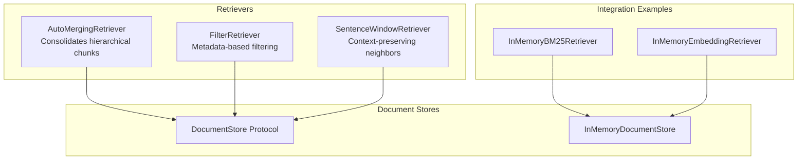
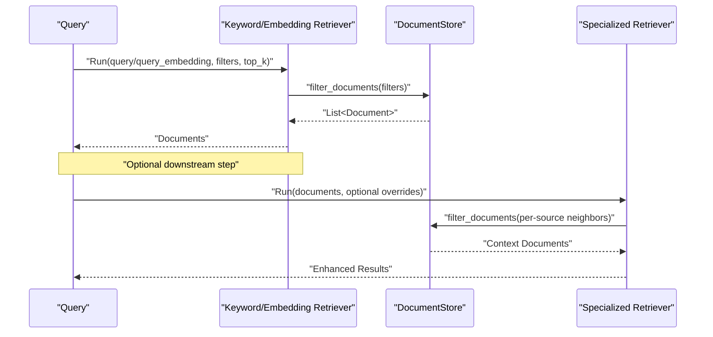
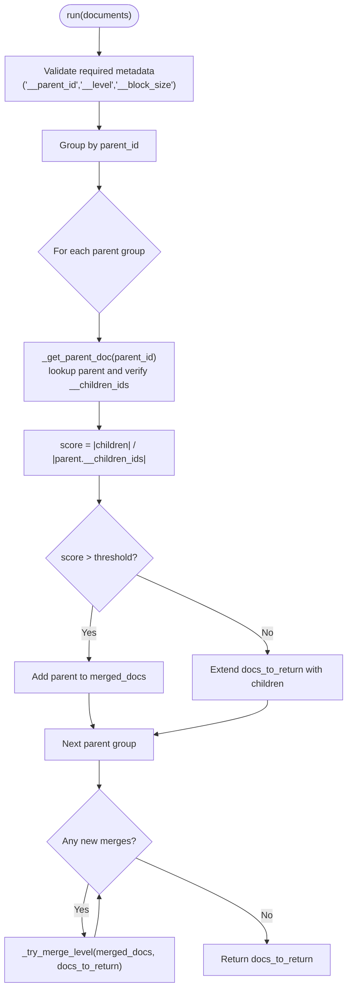
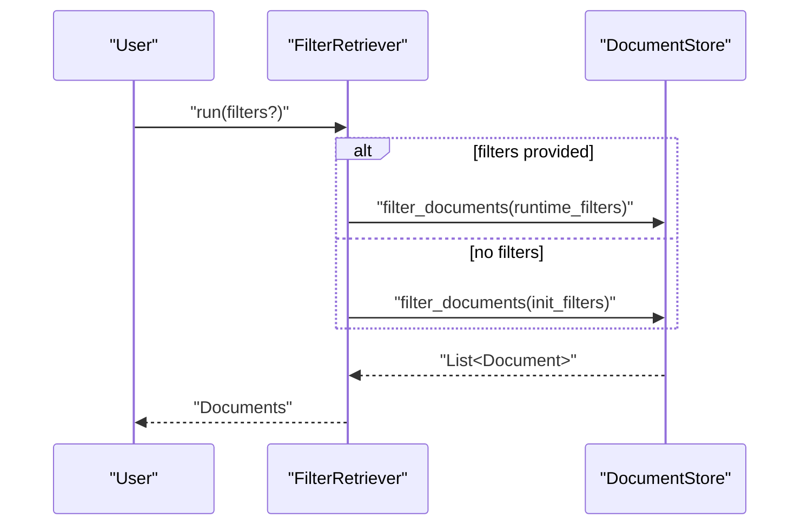
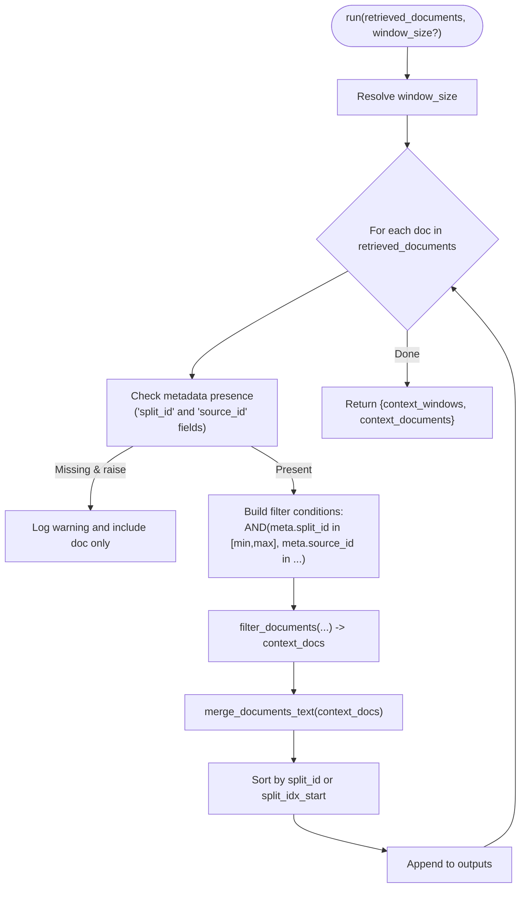
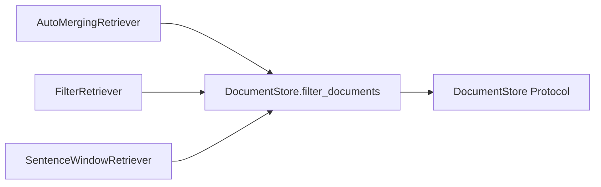

# Specialized Retrievers

<cite>
**Referenced Files in This Document**
- [auto_merging_retriever.py](file://haystack/components/retrievers/auto_merging_retriever.py)
- [filter_retriever.py](file://haystack/components/retrievers/filter_retriever.py)
- [sentence_window_retriever.py](file://haystack/components/retrievers/sentence_window_retriever.py)
- [test_auto_merging_retriever.py](file://test/components/retrievers/test_auto_merging_retriever.py)
- [test_filter_retriever.py](file://test/components/retrievers/test_filter_retriever.py)
- [test_sentence_window_retriever.py](file://test/components/retrievers/test_sentence_window_retriever.py)
- [__init__.py](file://haystack/components/retrievers/__init__.py)
- [protocol.py](file://haystack/document_stores/types/protocol.py)
- [bm25_retriever.py](file://haystack/components/retrievers/in_memory/bm25_retriever.py)
- [embedding_retriever.py](file://haystack/components/retrievers/in_memory/embedding_retriever.py)
</cite>

## Table of Contents
1. [Introduction](#introduction)
2. [Project Structure](#project-structure)
3. [Core Components](#core-components)
4. [Architecture Overview](#architecture-overview)
5. [Detailed Component Analysis](#detailed-component-analysis)
6. [Dependency Analysis](#dependency-analysis)
7. [Performance Considerations](#performance-considerations)
8. [Troubleshooting Guide](#troubleshooting-guide)
9. [Conclusion](#conclusion)

## Introduction
This document focuses on three specialized retriever components that extend beyond standard embedding and keyword search:
- AutoMergingRetriever: Consolidates hierarchical document chunks into parent documents based on a configurable threshold.
- FilterRetriever: Applies flexible metadata filters to select documents from a DocumentStore.
- SentenceWindowRetriever: Enhances retrieval results by fetching neighboring chunks around a retrieved document to preserve context.

We explain algorithms, use cases, configuration options, integration patterns, and performance considerations for each retriever, with practical examples grounded in the repository’s tests and components.

## Project Structure
The specialized retrievers live under haystack/components/retrievers and integrate with DocumentStore implementations. The in-memory retrievers (BM25 and Embedding) demonstrate typical integration patterns for keyword and semantic retrieval, respectively.

**Diagram sources**
- [auto_merging_retriever.py](file://haystack/components/retrievers/auto_merging_retriever.py#L12-L227)
- [filter_retriever.py](file://haystack/components/retrievers/filter_retriever.py#L11-L105)
- [sentence_window_retriever.py](file://haystack/components/retrievers/sentence_window_retriever.py#L13-L322)
- [protocol.py](file://haystack/document_stores/types/protocol.py#L11-L136)
- [bm25_retriever.py](file://haystack/components/retrievers/in_memory/bm25_retriever.py#L12-L197)
- [embedding_retriever.py](file://haystack/components/retrievers/in_memory/embedding_retriever.py#L12-L237)

**Section sources**
- [__init__.py](file://haystack/components/retrievers/__init__.py#L10-L29)
- [protocol.py](file://haystack/document_stores/types/protocol.py#L11-L136)

## Core Components
- AutoMergingRetriever
  - Purpose: Given leaf-level matched documents from a hierarchical structure, decide whether to return consolidated parent documents based on a fraction threshold of children retrieved.
  - Key configuration: threshold (float in (0,1)), DocumentStore supporting filter_documents.
  - Use cases: Reduce noise from small chunks, surface coherent paragraphs or sections when multiple child chunks match.
- FilterRetriever
  - Purpose: Narrow document retrieval by applying filters (comparison/logic) against metadata fields.
  - Key configuration: filters (dict), DocumentStore supporting filter_documents.
  - Use cases: Language filtering, category filtering, date ranges, publisher/source filtering.
- SentenceWindowRetriever
  - Purpose: For each retrieved document, fetch neighboring chunks based on split_id and source_id to reconstruct contiguous context.
  - Key configuration: window_size (int), source_id_meta_field(s), split_id_meta_field, raise_on_missing_meta_fields.
  - Use cases: Preserve sentence/paragraph context around hits, reduce hallucinations by providing richer context.

**Section sources**
- [auto_merging_retriever.py](file://haystack/components/retrievers/auto_merging_retriever.py#L12-L227)
- [filter_retriever.py](file://haystack/components/retrievers/filter_retriever.py#L11-L105)
- [sentence_window_retriever.py](file://haystack/components/retrievers/sentence_window_retriever.py#L13-L322)

## Architecture Overview
The specialized retrievers operate on top of a DocumentStore abstraction. They rely on filter_documents (and filter_documents_async where supported) to query and refine results. Integration with BM25 or embedding retrievers is common, followed by post-processing via AutoMergingRetriever or SentenceWindowRetriever.

**Diagram sources**
- [bm25_retriever.py](file://haystack/components/retrievers/in_memory/bm25_retriever.py#L120-L156)
- [embedding_retriever.py](file://haystack/components/retrievers/in_memory/embedding_retriever.py#L136-L185)
- [protocol.py](file://haystack/document_stores/types/protocol.py#L41-L107)
- [auto_merging_retriever.py](file://haystack/components/retrievers/auto_merging_retriever.py#L114-L167)
- [sentence_window_retriever.py](file://haystack/components/retrievers/sentence_window_retriever.py#L180-L211)

## Detailed Component Analysis

### AutoMergingRetriever
- Algorithm summary
  - Validates that matched leaf documents carry required metadata (__parent_id, __level, __block_size).
  - Groups leaf documents by parent_id and computes a “merge score” as num_matched_children / total_children_in_parent.
  - If score > threshold, replace children with the parent; otherwise keep children.
  - Recursively repeats the process upward through the hierarchy until no further merges occur.
- Inputs and outputs
  - Input: list of Documents (assumed to be leaf nodes).
  - Output: list of Documents (parents and/or children, depending on thresholds).
- Configuration
  - threshold: float in (0,1); default 0.5.
  - document_store: must support filter_documents and have parent documents with __children_ids metadata.
- Practical example
  - Build a hierarchical document structure, store non-leaf parents, run a keyword retriever to get leaf matches, then pass matches to AutoMergingRetriever to consolidate when sufficient children are retrieved.
- Error handling
  - Raises ValueError if metadata is missing or inconsistent, or if a parent lookup fails.
- Async variant
  - Uses filter_documents_async when available; otherwise falls back to sync behavior.

**Diagram sources**
- [auto_merging_retriever.py](file://haystack/components/retrievers/auto_merging_retriever.py#L114-L167)
- [auto_merging_retriever.py](file://haystack/components/retrievers/auto_merging_retriever.py#L180-L226)

**Section sources**
- [auto_merging_retriever.py](file://haystack/components/retrievers/auto_merging_retriever.py#L12-L227)
- [test_auto_merging_retriever.py](file://test/components/retrievers/test_auto_merging_retriever.py#L14-L263)

### FilterRetriever
- Algorithm summary
  - Accepts filters at initialization or at runtime; runtime filters override initialization filters if provided.
  - Delegates to DocumentStore.filter_documents to return matching documents.
- Inputs and outputs
  - Input: filters (optional; overrides init filters if provided).
  - Output: list of Documents matching filters.
- Configuration
  - document_store: any DocumentStore implementing filter_documents.
  - filters: dict (initial filters).
- Practical example
  - Initialize with a language filter; optionally override at runtime for different languages.
- Async variant
  - Uses filter_documents_async if available.

**Diagram sources**
- [filter_retriever.py](file://haystack/components/retrievers/filter_retriever.py#L78-L89)
- [filter_retriever.py](file://haystack/components/retrievers/filter_retriever.py#L91-L104)
- [protocol.py](file://haystack/document_stores/types/protocol.py#L41-L107)

**Section sources**
- [filter_retriever.py](file://haystack/components/retrievers/filter_retriever.py#L11-L105)
- [test_filter_retriever.py](file://test/components/retrievers/test_filter_retriever.py#L38-L147)

### SentenceWindowRetriever
- Algorithm summary
  - For each retrieved document, compute neighbor ranges using split_id and window_size.
  - Build filters to select documents with matching source_id(s) and split_id within [split_id - window_size, split_id + window_size].
  - Fetch context documents, merge text while removing overlaps, and sort by split_id or split_idx_start.
- Inputs and outputs
  - Input: retrieved_documents (list), optional window_size override.
  - Output: context_windows (list of merged texts), context_documents (list of Documents).
- Configuration
  - window_size: int ≥ 1; default 3.
  - source_id_meta_field: str or list[str]; default "source_id".
  - split_id_meta_field: str; default "split_id".
  - raise_on_missing_meta_fields: bool; default True.
- Practical example
  - Split documents into sentences/lines, store with split_id and split_idx_start, connect a BM25 retriever to SentenceWindowRetriever, and observe expanded context windows.

**Diagram sources**
- [sentence_window_retriever.py](file://haystack/components/retrievers/sentence_window_retriever.py#L180-L211)
- [sentence_window_retriever.py](file://haystack/components/retrievers/sentence_window_retriever.py#L264-L307)
- [sentence_window_retriever.py](file://haystack/components/retrievers/sentence_window_retriever.py#L309-L322)

**Section sources**
- [sentence_window_retriever.py](file://haystack/components/retrievers/sentence_window_retriever.py#L13-L322)
- [test_sentence_window_retriever.py](file://test/components/retrievers/test_sentence_window_retriever.py#L18-L336)

## Dependency Analysis
- AutoMergingRetriever depends on:
  - DocumentStore.filter_documents (and filter_documents_async when available).
  - Hierarchical metadata (__parent_id, __level, __block_size, __children_ids).
- FilterRetriever depends on:
  - DocumentStore.filter_documents (and filter_documents_async when available).
  - Flexible filter dictionaries (comparison/logic).
- SentenceWindowRetriever depends on:
  - DocumentStore.filter_documents (and filter_documents_async when available).
  - Metadata fields: source_id_meta_field(s) and split_id_meta_field.

**Diagram sources**
- [auto_merging_retriever.py](file://haystack/components/retrievers/auto_merging_retriever.py#L128-L137)
- [filter_retriever.py](file://haystack/components/retrievers/filter_retriever.py#L79-L89)
- [sentence_window_retriever.py](file://haystack/components/retrievers/sentence_window_retriever.py#L280-L281)
- [protocol.py](file://haystack/document_stores/types/protocol.py#L41-L107)

**Section sources**
- [protocol.py](file://haystack/document_stores/types/protocol.py#L11-L136)
- [auto_merging_retriever.py](file://haystack/components/retrievers/auto_merging_retriever.py#L12-L227)
- [filter_retriever.py](file://haystack/components/retrievers/filter_retriever.py#L11-L105)
- [sentence_window_retriever.py](file://haystack/components/retrievers/sentence_window_retriever.py#L13-L322)

## Performance Considerations
- AutoMergingRetriever
  - Complexity: O(P + C) per recursive level, where P is number of distinct parents and C is number of child documents grouped; recursion depth equals hierarchy depth.
  - Cost drivers: Parent lookups via filter_documents and child counts from parent metadata.
  - Memory: Stores grouped child lists and merged parent references; minimal extra memory beyond output lists.
- FilterRetriever
  - Complexity: O(D) to filter D documents; depends on backend index coverage for filters.
  - Memory: Returns filtered list; overhead proportional to result size.
- SentenceWindowRetriever
  - Complexity: O(N log N) per document due to sorting by split_id/split_idx_start; N is neighbors within window.
  - Memory: Holds context_docs and merged text; merging removes overlaps but requires careful indexing of split_idx_start.
  - Window size: Larger windows increase query cost and output size; tune based on latency and context needs.
- Integration patterns
  - Chain BM25 or embedding retrievers with SentenceWindowRetriever to enrich context; chain AutoMergingRetriever after keyword retrievers to consolidate chunks into higher-level units.
  - Use FilterRetriever upstream to reduce candidate sets by metadata (e.g., language, category).

[No sources needed since this section provides general guidance]

## Troubleshooting Guide
- AutoMergingRetriever
  - Missing metadata: Ensure __parent_id, __level, __block_size exist on leaf documents; ensure parent documents have __children_ids.
  - Parent not found: Verify parent ids exist and are stored in the DocumentStore.
  - Threshold tuning: Increase threshold to merge more aggressively; decrease to keep finer granularity.
- FilterRetriever
  - Filters override behavior: Runtime filters override initialization filters; confirm expected behavior by passing filters at runtime.
  - Empty results: Validate filter correctness and backend support.
- SentenceWindowRetriever
  - Missing metadata fields: Provide source_id_meta_field(s) and split_id_meta_field; disable raise_on_missing_meta_fields to skip problematic documents.
  - Sorting anomalies: Ensure split_id and split_idx_start are consistent across splits.
  - Window size: Must be ≥ 1; invalid values raise errors.

**Section sources**
- [test_auto_merging_retriever.py](file://test/components/retrievers/test_auto_merging_retriever.py#L27-L62)
- [test_auto_merging_retriever.py](file://test/components/retrievers/test_auto_merging_retriever.py#L108-L142)
- [test_filter_retriever.py](file://test/components/retrievers/test_filter_retriever.py#L100-L122)
- [test_sentence_window_retriever.py](file://test/components/retrievers/test_sentence_window_retriever.py#L132-L174)
- [test_sentence_window_retriever.py](file://test/components/retrievers/test_sentence_window_retriever.py#L176-L180)

## Conclusion
These specialized retrievers complement standard retrieval by adding intelligence around document structure, metadata filtering, and contextual continuity:
- AutoMergingRetriever consolidates hierarchical chunks into coherent units when many children match.
- FilterRetriever narrows candidates efficiently using flexible metadata filters.
- SentenceWindowRetriever preserves context by fetching neighboring chunks around hits.

Together, they enable robust RAG pipelines that handle complex document structures, reduce noise, and improve answer quality through intelligent document processing and context-aware retrieval.