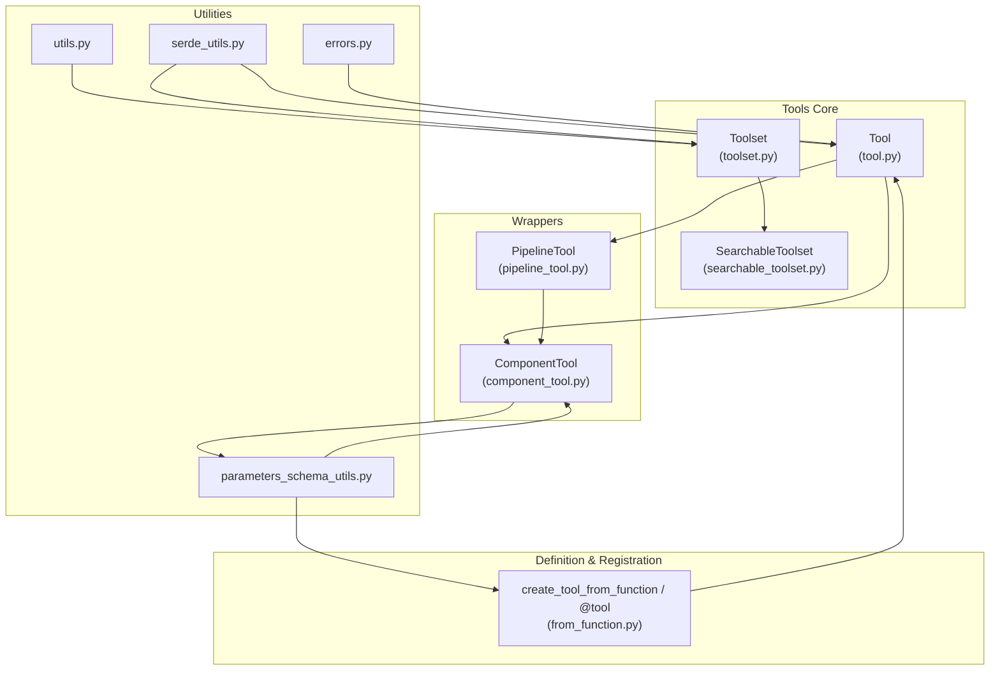
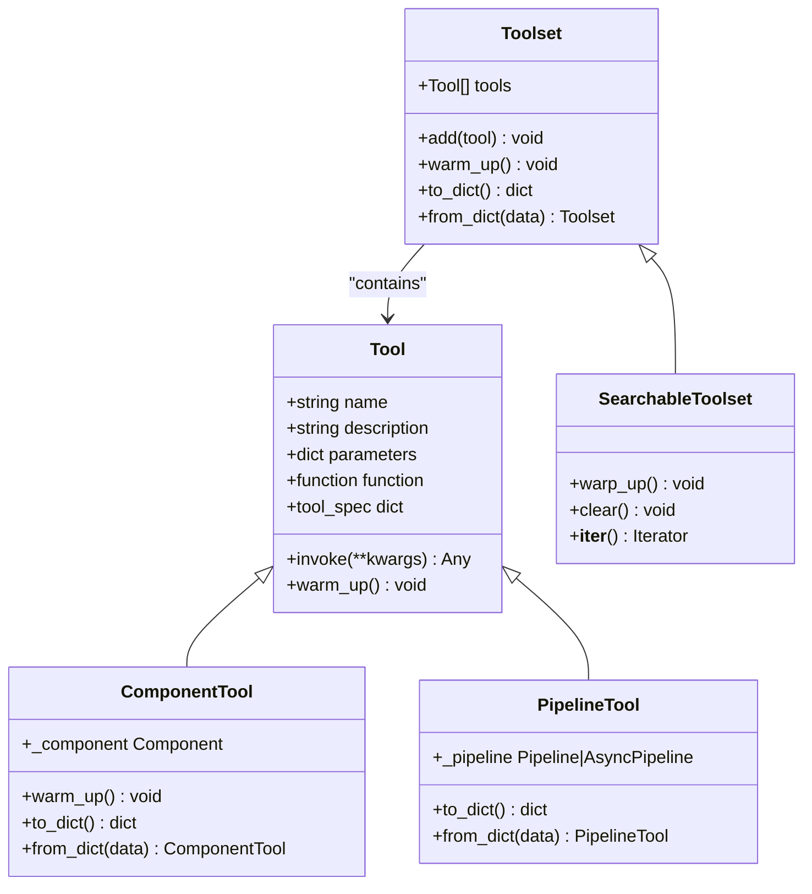
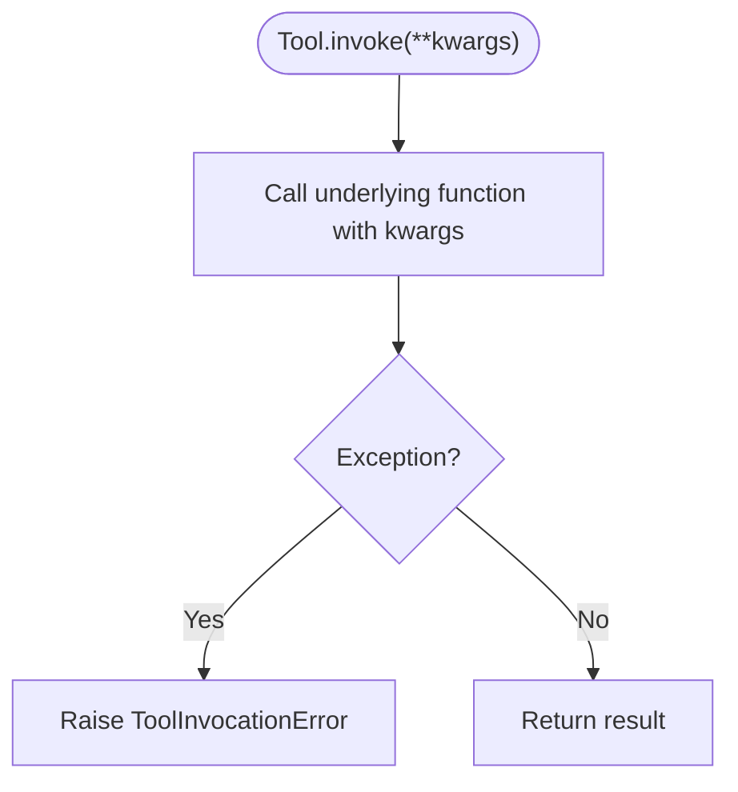
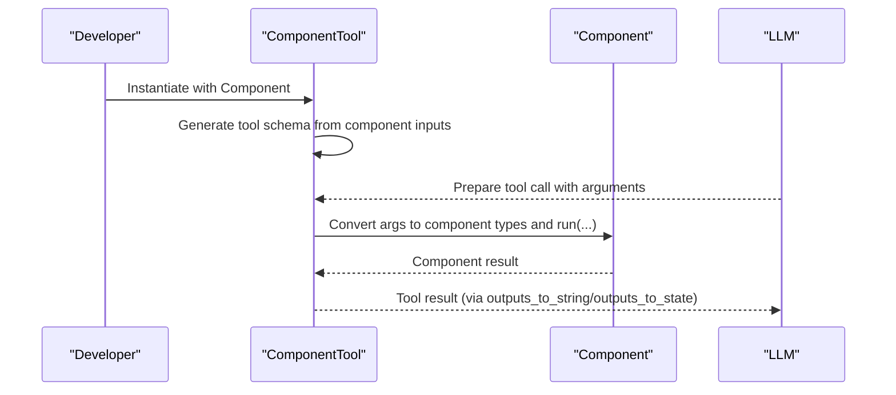
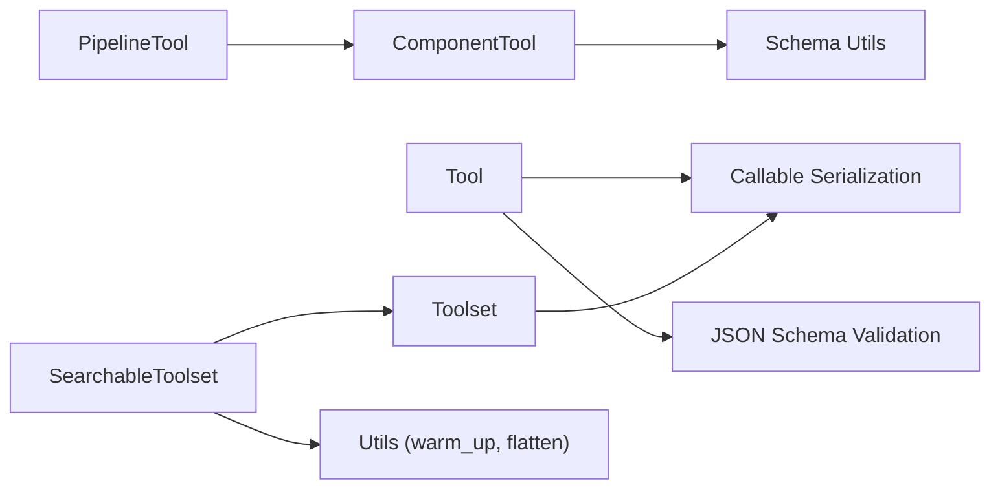

# Tools

<cite>
**Referenced Files in This Document**
- [__init__.py](file://haystack/tools/__init__.py)
- [tool.py](file://haystack/tools/tool.py)
- [toolset.py](file://haystack/tools/toolset.py)
- [component_tool.py](file://haystack/tools/component_tool.py)
- [pipeline_tool.py](file://haystack/tools/pipeline_tool.py)
- [from_function.py](file://haystack/tools/from_function.py)
- [searchable_toolset.py](file://haystack/tools/searchable_toolset.py)
- [utils.py](file://haystack/tools/utils.py)
- [serde_utils.py](file://haystack/tools/serde_utils.py)
- [errors.py](file://haystack/tools/errors.py)
- [parameters_schema_utils.py](file://haystack/tools/parameters_schema_utils.py)
- [tool.mdx](file://docs-website/docs/tools/tool.mdx)
- [toolset.mdx](file://docs-website/docs/tools/toolset.mdx)
- [componenttool.mdx](file://docs-website/docs/tools/componenttool.mdx)
- [pipelinetool.mdx](file://docs-website/docs/tools/pipelinetool.mdx)
- [searchabletoolset.mdx](file://docs-website/docs/tools/searchabletoolset.mdx)
</cite>

## Table of Contents
1. [Introduction](#introduction)
2. [Project Structure](#project-structure)
3. [Core Components](#core-components)
4. [Architecture Overview](#architecture-overview)
5. [Detailed Component Analysis](#detailed-component-analysis)
6. [Dependency Analysis](#dependency-analysis)
7. [Performance Considerations](#performance-considerations)
8. [Troubleshooting Guide](#troubleshooting-guide)
9. [Conclusion](#conclusion)
10. [Appendices](#appendices)

## Introduction
This document explains Haystack’s tool components: how tools are defined, how they are invoked, how tool sets are managed, and how to integrate them into AI applications. It covers the tool invocation framework, tool definition patterns, tool registration, parameter passing, execution patterns, and practical examples for external service integration, function calling, and workflow automation. It also addresses security considerations, error handling, best practices, tool discovery, dynamic loading, and performance optimization.

## Project Structure
The tools subsystem centers around a small set of cohesive modules that define the Tool abstraction, tool wrappers for Haystack components and pipelines, toolset containers, and utilities for serialization, discovery, and schema generation.

**Diagram sources**
- [tool.py](file://haystack/tools/tool.py#L18-L272)
- [toolset.py](file://haystack/tools/toolset.py#L13-L365)
- [component_tool.py](file://haystack/tools/component_tool.py#L37-L395)
- [pipeline_tool.py](file://haystack/tools/pipeline_tool.py#L21-L258)
- [from_function.py](file://haystack/tools/from_function.py#L16-L324)
- [utils.py](file://haystack/tools/utils.py#L14-L65)
- [serde_utils.py](file://haystack/tools/serde_utils.py#L16-L83)
- [parameters_schema_utils.py](file://haystack/tools/parameters_schema_utils.py#L23-L229)
- [errors.py](file://haystack/tools/errors.py#L6-L22)

**Section sources**
- [__init__.py](file://haystack/tools/__init__.py#L9-L40)

## Core Components
- Tool: A data class representing a callable tool with a name, description, JSON schema parameters, and a function to invoke. It supports mapping inputs from agent state, shaping outputs for LLM consumption, and returning raw multimodal results.
- Toolset: A container grouping related tools, supporting iteration, membership checks, warm-up, and serialization. It also enables dynamic loading by subclassing.
- ComponentTool: Wraps a Haystack Component as a Tool, auto-generating the tool schema from component input sockets and performing type conversions.
- PipelineTool: Wraps a Haystack Pipeline as a Tool, building the tool schema from pipeline inputs and outputs via input/output mappings.
- SearchableToolset: Enables dynamic discovery of tools from large catalogs using BM25 search, exposing a bootstrap tool to find and load tools on demand.
- Utilities: Serialization helpers, flattening and warming utilities, and schema generation helpers for type conversion and parameter descriptions.

**Section sources**
- [tool.py](file://haystack/tools/tool.py#L18-L272)
- [toolset.py](file://haystack/tools/toolset.py#L13-L365)
- [component_tool.py](file://haystack/tools/component_tool.py#L37-L395)
- [pipeline_tool.py](file://haystack/tools/pipeline_tool.py#L21-L258)
- [searchable_toolset.py](file://haystack/tools/searchable_toolset.py#L21-L330)
- [utils.py](file://haystack/tools/utils.py#L14-L65)
- [from_function.py](file://haystack/tools/from_function.py#L16-L324)
- [parameters_schema_utils.py](file://haystack/tools/parameters_schema_utils.py#L23-L229)
- [errors.py](file://haystack/tools/errors.py#L6-L22)

## Architecture Overview
The tool framework is centered on the Tool abstraction and its wrappers. ComponentTool and PipelineTool derive from Tool and add schema generation and type conversion tailored to Haystack components and pipelines. Toolset and SearchableToolset provide management and discovery capabilities. Serialization utilities enable persistence and dynamic loading.

**Diagram sources**
- [tool.py](file://haystack/tools/tool.py#L18-L272)
- [toolset.py](file://haystack/tools/toolset.py#L13-L365)
- [component_tool.py](file://haystack/tools/component_tool.py#L37-L395)
- [pipeline_tool.py](file://haystack/tools/pipeline_tool.py#L21-L258)
- [searchable_toolset.py](file://haystack/tools/searchable_toolset.py#L21-L330)

## Detailed Component Analysis

### Tool: Abstraction and Invocation
- Purpose: Unified representation of a callable tool for LLMs. Provides a tool specification and an invocation method.
- Key behaviors:
  - Validates that the function is synchronous and that parameters form a valid JSON schema.
  - Supports outputs_to_string for shaping outputs for LLM consumption and outputs_to_state for writing results into agent state.
  - Supports inputs_from_state to map agent state keys to tool parameters.
  - Exposes warm_up for resource-intensive initialization.
- Typical use cases:
  - Wrapping external functions or APIs for LLM tool calling.
  - Integrating with ToolInvoker or ChatGenerators that support tools.

**Diagram sources**
- [tool.py](file://haystack/tools/tool.py#L261-L271)

**Section sources**
- [tool.py](file://haystack/tools/tool.py#L18-L272)
- [errors.py](file://haystack/tools/errors.py#L14-L22)

### Toolset: Management and Serialization
- Purpose: Group related tools and manage them as a unit. Supports iteration, membership checks, warm-up delegation, and serialization.
- Key behaviors:
  - Prevents duplicate tool names.
  - Adds tools or merges other toolsets.
  - Serializes tool instances and deserializes them back.
  - Provides a wrapper for combining multiple toolsets.
- Typical use cases:
  - Passing a group of tools to ChatGenerators or ToolInvoker.
  - Building reusable tool bundles.

**Section sources**
- [toolset.py](file://haystack/tools/toolset.py#L13-L365)
- [serde_utils.py](file://haystack/tools/serde_utils.py#L16-L83)
- [utils.py](file://haystack/tools/utils.py#L14-L65)

### ComponentTool: Wrapping Haystack Components
- Purpose: Turn any Haystack Component into a Tool with an LLM-compatible schema generated from component input sockets.
- Key behaviors:
  - Auto-generates tool parameters from component run method signatures and type hints.
  - Performs type conversion for inputs and supports dataclasses, lists, and union types.
  - Respects inputs_from_state and outputs_to_state/outputs_to_string.
  - Delegates warm_up to the underlying component.
- Typical use cases:
  - Exposing existing Haystack components (e.g., web search, embedding, retrieval) as tools.
  - Integrating components into agents and pipelines with tool calling.

**Diagram sources**
- [component_tool.py](file://haystack/tools/component_tool.py#L99-L233)
- [parameters_schema_utils.py](file://haystack/tools/parameters_schema_utils.py#L89-L153)

**Section sources**
- [component_tool.py](file://haystack/tools/component_tool.py#L37-L395)
- [parameters_schema_utils.py](file://haystack/tools/parameters_schema_utils.py#L23-L229)

### PipelineTool: Wrapping Pipelines as Tools
- Purpose: Wrap a Haystack Pipeline as a Tool, exposing pipeline inputs and outputs via explicit mappings.
- Key behaviors:
  - Builds tool parameters from pipeline input sockets and uses component docstrings for descriptions.
  - Supports input_mapping and output_mapping to control exposure.
  - Works with both Pipeline and AsyncPipeline.
  - Serializes and deserializes the underlying pipeline.
- Typical use cases:
  - Exposing complex workflows (e.g., retrieval-augmented generation) as a single tool.
  - Using pipelines directly in agents and pipelines with tool calling.

**Section sources**
- [pipeline_tool.py](file://haystack/tools/pipeline_tool.py#L21-L258)

### SearchableToolset: Dynamic Discovery and Lazy Loading
- Purpose: Enable agents to discover tools from large catalogs using BM25 search, reducing context load by exposing a bootstrap tool first.
- Key behaviors:
  - Operates in two modes: passthrough (small catalogs) and search mode (large catalogs).
  - Creates a bootstrap tool that finds and loads tools on demand.
  - Supports customization of the bootstrap tool’s name, description, and parameter descriptions.
  - Provides clear() to reset discovered tools between runs.
- Typical use cases:
  - Managing hundreds of tools in an agent.
  - On-demand loading of tools from external sources (e.g., MCPToolset) via warm_up.

**Section sources**
- [searchable_toolset.py](file://haystack/tools/searchable_toolset.py#L21-L330)
- [utils.py](file://haystack/tools/utils.py#L14-L65)

### Tool Definition Patterns and Registration
- From function:
  - create_tool_from_function infers tool schema from function signatures and type hints.
  - The @tool decorator provides a concise way to define tools with optional customization.
- ComponentTool and PipelineTool:
  - Auto-generate schemas from component and pipeline inputs, respectively.
- Toolset and SearchableToolset:
  - Aggregate tools and provide serialization for persistence and dynamic loading.

**Section sources**
- [from_function.py](file://haystack/tools/from_function.py#L16-L324)
- [component_tool.py](file://haystack/tools/component_tool.py#L37-L395)
- [pipeline_tool.py](file://haystack/tools/pipeline_tool.py#L21-L258)
- [toolset.py](file://haystack/tools/toolset.py#L13-L365)
- [searchable_toolset.py](file://haystack/tools/searchable_toolset.py#L21-L330)

### Execution Patterns and Parameter Passing
- Inputs from state:
  - inputs_from_state maps agent state keys to tool parameters, enabling cross-step data sharing.
- Outputs shaping:
  - outputs_to_string supports single-output and multi-output configurations, including raw multimodal results.
  - outputs_to_state writes tool outputs into agent state for subsequent steps.
- Invocation:
  - Tool.invoke executes the underlying function.
  - ComponentTool and PipelineTool convert types and run the underlying component or pipeline.

**Section sources**
- [tool.py](file://haystack/tools/tool.py#L18-L272)
- [component_tool.py](file://haystack/tools/component_tool.py#L188-L206)
- [pipeline_tool.py](file://haystack/tools/pipeline_tool.py#L196-L204)

### Practical Examples in Pipeline Configurations
- External service integration:
  - Use ComponentTool to wrap a web search component and expose it as a tool in a pipeline with ToolInvoker.
- Function calling:
  - Define tools via @tool or create_tool_from_function and pass them to a ChatGenerator or Agent.
- Workflow automation:
  - Wrap a retrieval pipeline with PipelineTool and use it in an Agent to answer domain-specific queries.

**Section sources**
- [componenttool.mdx](file://docs-website/docs/tools/componenttool.mdx#L48-L125)
- [pipelinetool.mdx](file://docs-website/docs/tools/pipelinetool.mdx#L43-L245)
- [tool.mdx](file://docs-website/docs/tools/tool.mdx#L290-L476)

## Dependency Analysis
- Tool depends on:
  - JSON schema validation and callable serialization for safe transport.
  - Error types for consistent failure reporting.
- ComponentTool and PipelineTool depend on:
  - Schema generation utilities for parameter descriptions and type conversion.
  - Serialization utilities for component and pipeline persistence.
- Toolset and SearchableToolset depend on:
  - Serialization utilities for tool persistence.
  - Utilities for flattening and warming tools.

**Diagram sources**
- [tool.py](file://haystack/tools/tool.py#L10-L16)
- [component_tool.py](file://haystack/tools/component_tool.py#L22-L32)
- [parameters_schema_utils.py](file://haystack/tools/parameters_schema_utils.py#L23-L229)
- [toolset.py](file://haystack/tools/toolset.py#L9-L11)
- [searchable_toolset.py](file://haystack/tools/searchable_toolset.py#L12-L16)
- [utils.py](file://haystack/tools/utils.py#L14-L65)
- [serde_utils.py](file://haystack/tools/serde_utils.py#L16-L83)

**Section sources**
- [tool.py](file://haystack/tools/tool.py#L10-L16)
- [component_tool.py](file://haystack/tools/component_tool.py#L22-L32)
- [parameters_schema_utils.py](file://haystack/tools/parameters_schema_utils.py#L23-L229)
- [toolset.py](file://haystack/tools/toolset.py#L9-L11)
- [searchable_toolset.py](file://haystack/tools/searchable_toolset.py#L12-L16)
- [utils.py](file://haystack/tools/utils.py#L14-L65)
- [serde_utils.py](file://haystack/tools/serde_utils.py#L16-L83)

## Performance Considerations
- Warm-up strategy:
  - Use Tool.warm_up for expensive operations (connections, model loading). Toolset.warm_up delegates to contained tools; SearchableToolset supports lazy warm-up via catalog flattening and indexing.
- Serialization overhead:
  - Prefer serializing descriptors for dynamic toolsets (e.g., MCPToolset) rather than large tool instances to minimize payload size.
- Output shaping:
  - outputs_to_string reduces token usage by sending only formatted outputs to the LLM; avoid overly verbose handlers.
- Discovery mode:
  - SearchableToolset’s passthrough mode avoids search overhead for small catalogs; tune search_threshold accordingly.

[No sources needed since this section provides general guidance]

## Troubleshooting Guide
- Schema generation failures:
  - Ensure function signatures and component inputs are properly typed; callable types are skipped during schema generation.
- Tool invocation errors:
  - ToolInvocationError wraps exceptions during invocation; inspect the tool name and parameters.
- Duplicate tool names:
  - Toolset.add and Toolset.__post_init__ enforce uniqueness; resolve duplicates before adding.
- Serialization issues:
  - Use serialize_tools_or_toolset and deserialize_tools_or_toolset_inplace to persist and restore tools and toolsets.

**Section sources**
- [errors.py](file://haystack/tools/errors.py#L6-L22)
- [from_function.py](file://haystack/tools/from_function.py#L124-L128)
- [toolset.py](file://haystack/tools/toolset.py#L156-L160)
- [serde_utils.py](file://haystack/tools/serde_utils.py#L38-L83)

## Conclusion
Haystack’s tools subsystem provides a robust, extensible framework for defining, registering, and invoking tools in AI applications. The Tool abstraction unifies function-based and component-based tools, while Toolset and SearchableToolset offer scalable management and discovery. ComponentTool and PipelineTool bridge Haystack components and pipelines into the tool ecosystem. With strong serialization, schema generation, and error handling, the framework supports secure, maintainable integrations with external services and internal workflows.

[No sources needed since this section summarizes without analyzing specific files]

## Appendices

### Security Considerations
- Restrict tool capabilities to least privilege; validate and sanitize inputs.
- Avoid exposing sensitive operations; prefer controlled tool sets per agent.
- Use warm_up for pre-authentication and connection pooling rather than ad-hoc credentials.

[No sources needed since this section provides general guidance]

### Best Practices for Tool Development
- Keep tool names and descriptions precise; accurate definitions improve LLM tool selection.
- Use outputs_to_string to tailor LLM-facing output; keep raw results available for downstream steps.
- Prefer ComponentTool or PipelineTool for Haystack-native integrations to leverage schema generation and type safety.
- Use Toolset to group related tools and SearchableToolset for large catalogs.

[No sources needed since this section provides general guidance]

### Tool Discovery and Dynamic Loading
- Use SearchableToolset with BM25-based search for large catalogs.
- Implement custom Toolset subclasses to load tools from external sources (e.g., OpenAPI, MCP) and override warm_up for lazy initialization.

**Section sources**
- [searchable_toolset.py](file://haystack/tools/searchable_toolset.py#L21-L330)
- [toolset.py](file://haystack/tools/toolset.py#L72-L143)

### Creating Custom Tools and Managing Dependencies
- Define tools from functions using @tool or create_tool_from_function.
- For external APIs, wrap the API client in a function and define a Tool; use warm_up for session/connection setup.
- Manage dependencies via toolset serialization and ensure handlers are serializable.

**Section sources**
- [from_function.py](file://haystack/tools/from_function.py#L16-L324)
- [toolset.py](file://haystack/tools/toolset.py#L241-L281)
- [serde_utils.py](file://haystack/tools/serde_utils.py#L16-L83)