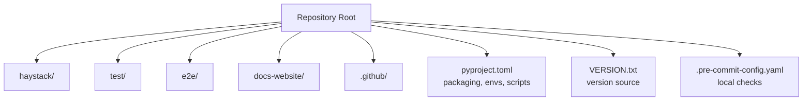
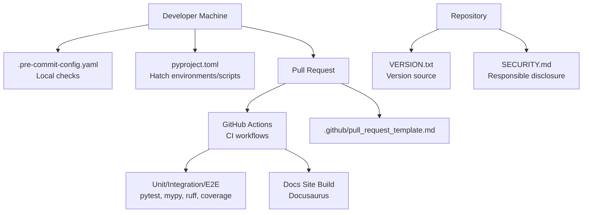
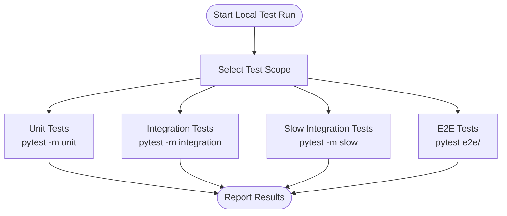
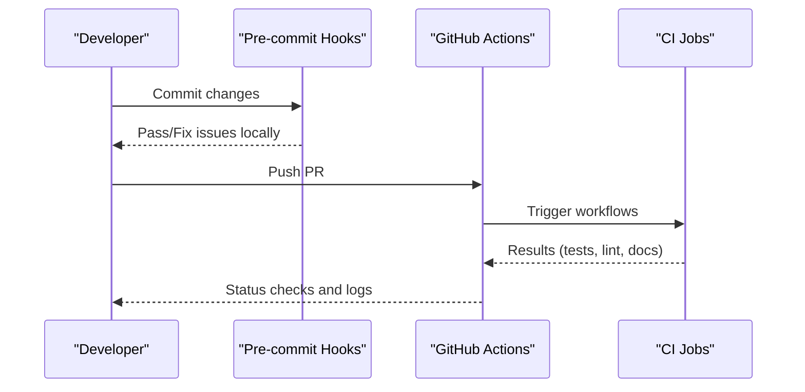
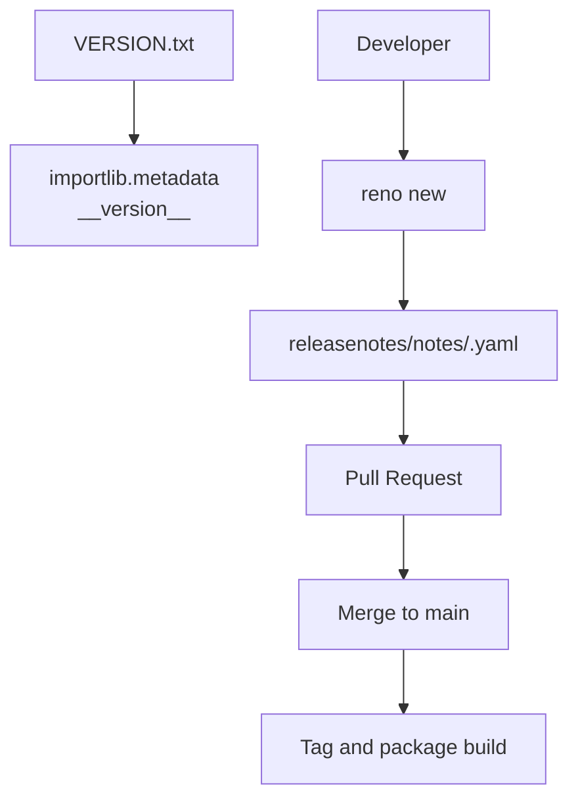
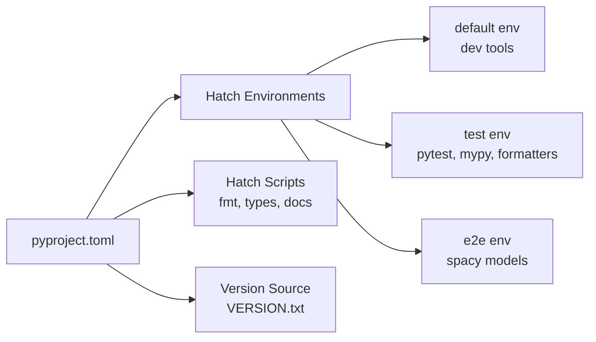

# Contributing and Development

<cite>
**Referenced Files in This Document**
- [CONTRIBUTING.md](file://CONTRIBUTING.md)
- [README.md](file://README.md)
- [pyproject.toml](file://pyproject.toml)
- [.pre-commit-config.yaml](file://.pre-commit-config.yaml)
- [.github/pull_request_template.md](file://.github/pull_request_template.md)
- [.github/dependabot.yml](file://.github/dependabot.yml)
- [SECURITY.md](file://SECURITY.md)
- [VERSION.txt](file://VERSION.txt)
- [haystack/__init__.py](file://haystack/__init__.py)
- [haystack/version.py](file://haystack/version.py)
- [docs-website/CONTRIBUTING.md](file://docs-website/CONTRIBUTING.md)
</cite>

## Table of Contents
1. [Introduction](#introduction)
2. [Project Structure](#project-structure)
3. [Core Components](#core-components)
4. [Architecture Overview](#architecture-overview)
5. [Detailed Component Analysis](#detailed-component-analysis)
6. [Dependency Analysis](#dependency-analysis)
7. [Performance Considerations](#performance-considerations)
8. [Troubleshooting Guide](#troubleshooting-guide)
9. [Conclusion](#conclusion)
10. [Appendices](#appendices)

## Introduction
This document explains how to contribute to the Haystack project and set up a productive development workflow. It covers environment setup, contribution processes, code and documentation standards, testing strategies, continuous integration, release procedures, and guidelines for building new components and integrations. It also outlines community engagement channels and recognition practices.

## Project Structure
The repository is organized into:
- Core library under haystack/
- Tests under test/ and e2e/
- Documentation website under docs-website/
- CI workflows and templates under .github/
- Packaging and tooling configuration in pyproject.toml, VERSION.txt, and related files

**Section sources**
- [pyproject.toml](file://pyproject.toml#L1-L362)
- [VERSION.txt](file://VERSION.txt#L1-L2)

## Core Components
Key development and contribution assets:
- Contribution guidelines and processes
- Documentation contribution guide
- Packaging and environment configuration
- Pre-commit hooks and quality gates
- Pull request template and Dependabot automation
- Security policy and responsible disclosure process

**Section sources**
- [CONTRIBUTING.md](file://CONTRIBUTING.md#L1-L421)
- [docs-website/CONTRIBUTING.md](file://docs-website/CONTRIBUTING.md#L1-L508)
- [pyproject.toml](file://pyproject.toml#L1-L362)
- [.pre-commit-config.yaml](file://.pre-commit-config.yaml#L1-L52)
- [.github/pull_request_template.md](file://.github/pull_request_template.md#L1-L27)
- [.github/dependabot.yml](file://.github/dependabot.yml#L1-L7)
- [SECURITY.md](file://SECURITY.md#L1-L38)

## Architecture Overview
High-level development and CI architecture for contributions:

**Diagram sources**
- [.pre-commit-config.yaml](file://.pre-commit-config.yaml#L1-L52)
- [pyproject.toml](file://pyproject.toml#L78-L177)
- [.github/pull_request_template.md](file://.github/pull_request_template.md#L1-L27)
- [SECURITY.md](file://SECURITY.md#L1-L38)
- [VERSION.txt](file://VERSION.txt#L1-L2)

## Detailed Component Analysis

### Development Environment Setup
- Python version and environment
  - Python version requirement and supported versions are defined in packaging configuration.
  - Use Hatch to manage environments and scripts.
- Tools and dependencies
  - Hatch is the primary project manager and environment builder.
  - Pre-commit hooks enforce formatting, linting, spellchecking, and CI-safe checks.
  - Additional dev dependencies are declared in the test environment.
- Local execution
  - Use Hatch-managed scripts to run tests, type checks, and formatting.
  - Pre-commit hooks run automatically on commit.

Recommended steps:
- Install Hatch and initialize a shell environment.
- Install pre-commit hooks.
- Run unit and integration tests locally before pushing.

**Section sources**
- [CONTRIBUTING.md](file://CONTRIBUTING.md#L154-L219)
- [pyproject.toml](file://pyproject.toml#L64-L177)
- [.pre-commit-config.yaml](file://.pre-commit-config.yaml#L1-L52)

### Contribution Process
- Issue reporting
  - Use bug report and feature request templates.
  - Provide reproducible steps, environment info, and expected vs actual behavior.
- Feature requests
  - Search existing issues; propose enhancements aligned with project scope.
- Pull requests
  - Follow the pull request template and checklist.
  - Use conventional commit messages.
  - Include release notes via reno for user-visible changes.
- Forking and access
  - Allow maintainers to push to your PR branch to facilitate reviews.

**Section sources**
- [CONTRIBUTING.md](file://CONTRIBUTING.md#L62-L136)
- [.github/pull_request_template.md](file://.github/pull_request_template.md#L1-L27)

### Code Standards and Quality Gates
- Formatting and linting
  - Ruff is used for linting and formatting; pre-commit applies fixes automatically.
- Static type checking
  - MyPy is configured for type checking; Hatch exposes a types script.
- Spellchecking
  - Codespell is integrated via pre-commit and pyproject configuration.
- Coverage and tests
  - pytest is configured with strict markers and asyncio defaults.
  - Coverage excludes testing scaffolding modules.

**Section sources**
- [pyproject.toml](file://pyproject.toml#L218-L362)
- [.pre-commit-config.yaml](file://.pre-commit-config.yaml#L1-L52)

### Testing Strategies
- Unit tests
  - Fast, deterministic, mock external resources, and runnable in any order.
  - Run with Hatch-managed scripts.
- Integration tests
  - Use external resources; avoid inference in these tests.
  - Separate slow/unstable tests into a dedicated workflow.
- End-to-end (E2E) tests
  - Evaluate real-world pipelines and may use inference.
  - Typically run outside the development cycle (nightly/manual).
- Scripts and markers
  - Unit, integration (fast/slow), and E2E scripts are defined in the test environment.
  - Markers distinguish unit, integration, and slow tests.

**Section sources**
- [CONTRIBUTING.md](file://CONTRIBUTING.md#L335-L405)
- [pyproject.toml](file://pyproject.toml#L157-L177)

### Continuous Integration and Quality Assurance
- GitHub Actions
  - CI runs tests, linting, formatting, and docs generation on pull requests.
  - Failures surface actionable logs and instructions.
- Dependabot
  - Daily updates for GitHub Actions workflows.
- Pre-commit
  - Enforces checks locally to speed up CI and reduce churn.

**Section sources**
- [CONTRIBUTING.md](file://CONTRIBUTING.md#L308-L325)
- [.github/dependabot.yml](file://.github/dependabot.yml#L1-L7)
- [.pre-commit-config.yaml](file://.pre-commit-config.yaml#L1-L52)

### Release Procedures and Version Management
- Version source
  - Version is read from VERSION.txt and exposed via importlib metadata.
- Release notes
  - Use reno to create release notes under releasenotes/notes.
  - PRs must include a release note unless explicitly exempted.
- Conventional commits
  - PR titles follow conventional commit types to automate changelog entries.

**Section sources**
- [VERSION.txt](file://VERSION.txt#L1-L2)
- [haystack/version.py](file://haystack/version.py#L1-L11)
- [CONTRIBUTING.md](file://CONTRIBUTING.md#L263-L307)
- [pyproject.toml](file://pyproject.toml#L185-L187)

### Developing New Components, Integrations, and Extensions
- Component development
  - Follow the established component interface and patterns used across haystack/components/.
  - Ensure serialization, typing, and error handling align with core patterns.
- Integrations
  - For new integrations, coordinate with the integrations repository and follow integration-specific guidelines.
- Documentation
  - For user-facing changes, update docs-website pages and ensure navigation is updated.
  - API reference content is auto-generated from Python docstrings; update docstrings in the main repository.

**Section sources**
- [CONTRIBUTING.md](file://CONTRIBUTING.md#L137-L153)
- [docs-website/CONTRIBUTING.md](file://docs-website/CONTRIBUTING.md#L255-L269)

### Community Engagement and Recognition
- Channels
  - Use GitHub Issues for bugs and feature requests.
  - Use GitHub Discussions and Discord for general advice and collaboration.
- Recognition
  - Contributors are recognized through merged contributions and community channels.

**Section sources**
- [README.md](file://README.md#L88-L91)
- [CONTRIBUTING.md](file://CONTRIBUTING.md#L1-L16)

## Dependency Analysis
Packaging and environment dependencies are centralized in pyproject.toml:
- Core runtime dependencies
- Development and tooling dependencies
- Test environment extras
- Type checking and linting configuration

**Diagram sources**
- [pyproject.toml](file://pyproject.toml#L64-L177)
- [VERSION.txt](file://VERSION.txt#L1-L2)

**Section sources**
- [pyproject.toml](file://pyproject.toml#L1-L362)

## Performance Considerations
- Keep unit tests fast and deterministic; avoid external calls.
- Use mocking for integration tests to reduce flakiness.
- Separate slow tests to dedicated workflows to maintain CI responsiveness.
- Run type checks and formatting locally to reduce CI iteration time.

[No sources needed since this section provides general guidance]

## Troubleshooting Guide
- CI failures
  - Inspect failing job logs for instructions; address formatting, linting, or test errors.
- Pre-commit failures
  - Fix staged issues locally; pre-commit will auto-apply fixes for some hooks.
- Documentation builds
  - Use the docs-website guide to build and preview changes locally before opening PRs.
- Security disclosures
  - Follow the responsible disclosure process outlined in the security policy.

**Section sources**
- [CONTRIBUTING.md](file://CONTRIBUTING.md#L317-L325)
- [.pre-commit-config.yaml](file://.pre-commit-config.yaml#L1-L52)
- [docs-website/CONTRIBUTING.md](file://docs-website/CONTRIBUTING.md#L208-L224)
- [SECURITY.md](file://SECURITY.md#L1-L38)

## Conclusion
By following the environment setup, contribution process, testing strategies, and quality gates described here, you can efficiently contribute to Haystack while maintaining high code and documentation standards. Use the provided scripts, templates, and CI workflows to streamline reviews and releases.

[No sources needed since this section summarizes without analyzing specific files]

## Appendices

### Quick Links and References
- Contribution guidelines: [CONTRIBUTING.md](file://CONTRIBUTING.md)
- Documentation contribution guide: [docs-website/CONTRIBUTING.md](file://docs-website/CONTRIBUTING.md)
- Packaging and tooling: [pyproject.toml](file://pyproject.toml)
- Pre-commit configuration: [.pre-commit-config.yaml](file://.pre-commit-config.yaml)
- Pull request template: [.github/pull_request_template.md](file://.github/pull_request_template.md)
- Dependabot configuration: [.github/dependabot.yml](file://.github/dependabot.yml)
- Security policy: [SECURITY.md](file://SECURITY.md)
- Version source: [VERSION.txt](file://VERSION.txt)
- Library initialization and version exposure: [haystack/__init__.py](file://haystack/__init__.py), [haystack/version.py](file://haystack/version.py)