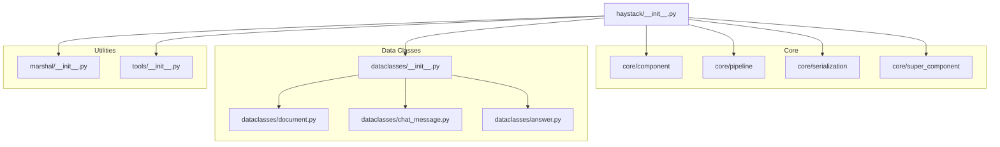
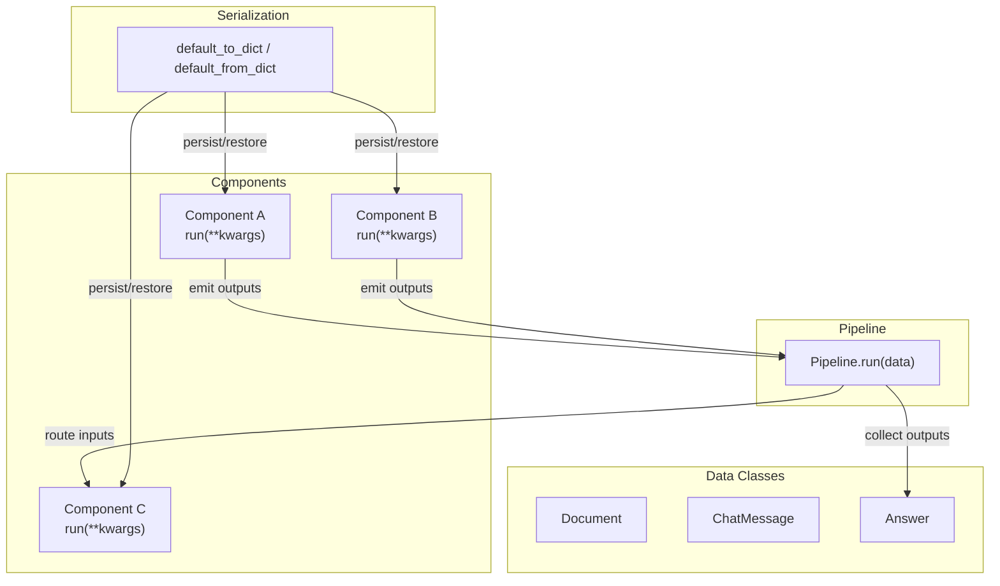
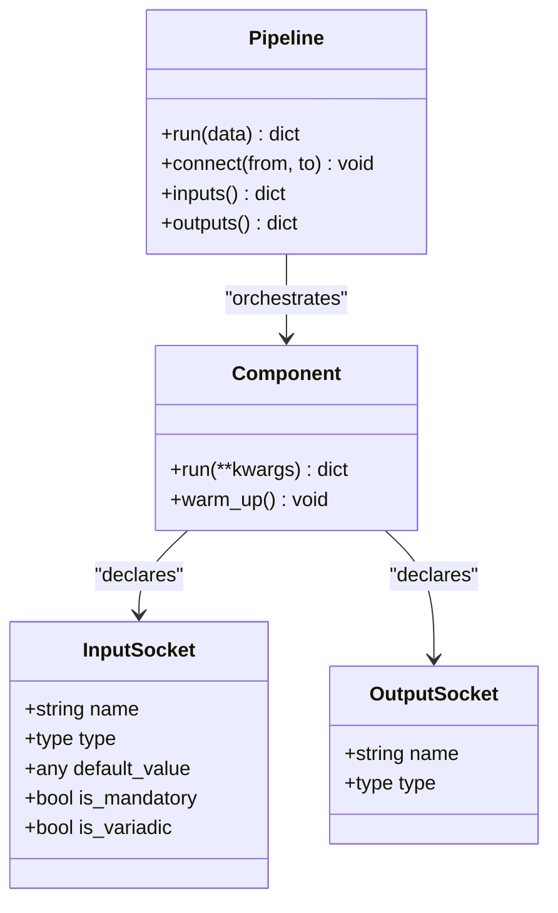
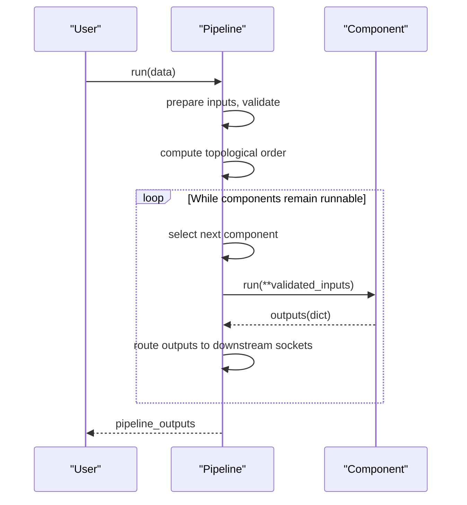
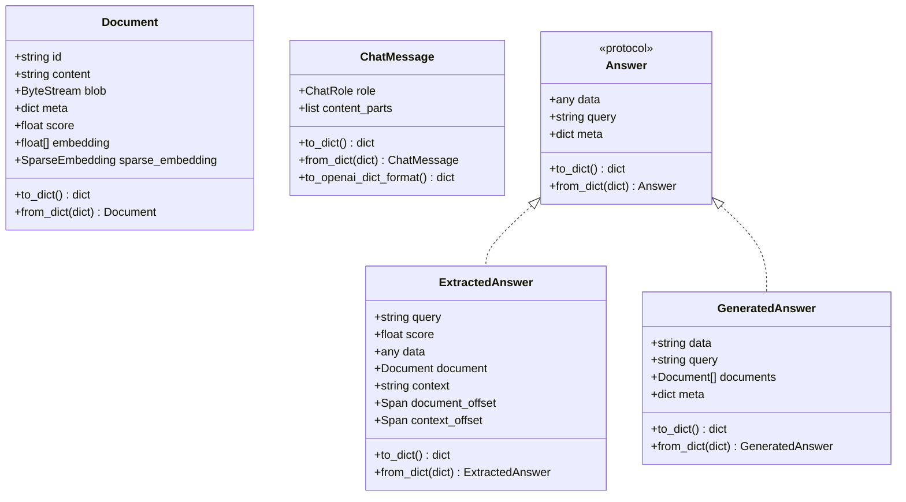
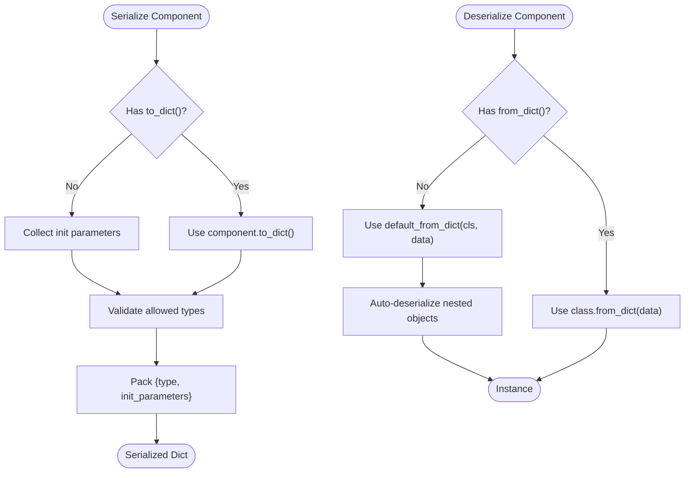
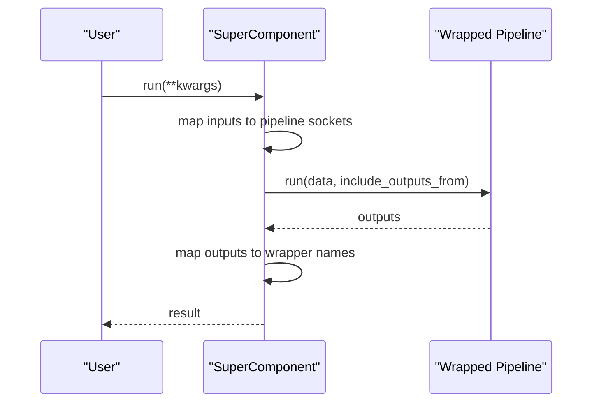
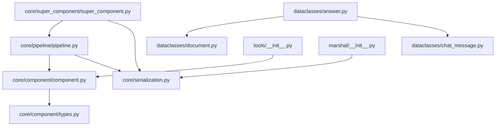

# Core Concepts

<cite>
**Referenced Files in This Document**
- [haystack/__init__.py](file://haystack/__init__.py)
- [haystack/core/__init__.py](file://haystack/core/__init__.py)
- [haystack/dataclasses/__init__.py](file://haystack/dataclasses/__init__.py)
- [haystack/marshal/__init__.py](file://haystack/marshal/__init__.py)
- [haystack/tools/__init__.py](file://haystack/tools/__init__.py)
- [haystack/core/component/__init__.py](file://haystack/core/component/__init__.py)
- [haystack/core/component/component.py](file://haystack/core/component/component.py)
- [haystack/core/component/types.py](file://haystack/core/component/types.py)
- [haystack/core/pipeline/__init__.py](file://haystack/core/pipeline/__init__.py)
- [haystack/core/pipeline/pipeline.py](file://haystack/core/pipeline/pipeline.py)
- [haystack/core/serialization.py](file://haystack/core/serialization.py)
- [haystack/core/super_component/super_component.py](file://haystack/core/super_component/super_component.py)
- [haystack/dataclasses/document.py](file://haystack/dataclasses/document.py)
- [haystack/dataclasses/chat_message.py](file://haystack/dataclasses/chat_message.py)
- [haystack/dataclasses/answer.py](file://haystack/dataclasses/answer.py)
</cite>

## Table of Contents
1. [Introduction](#introduction)
2. [Project Structure](#project-structure)
3. [Core Components](#core-components)
4. [Architecture Overview](#architecture-overview)
5. [Detailed Component Analysis](#detailed-component-analysis)
6. [Dependency Analysis](#dependency-analysis)
7. [Performance Considerations](#performance-considerations)
8. [Troubleshooting Guide](#troubleshooting-guide)
9. [Conclusion](#conclusion)
10. [Appendices](#appendices)

## Introduction
This document explains Haystack’s core architectural concepts with a focus on:
- Component-based architecture and standardized interfaces
- The pipeline paradigm for orchestrating component execution and data flow
- The data class system (Document, ChatMessage, Answer, and related types)
- Serialization mechanisms for component configuration and state persistence
- Socket-based input/output system enabling flexible component interconnection
- Architectural patterns such as factory, observer, and strategy as implemented in the framework

The goal is to provide a beginner-friendly overview alongside precise technical details for experienced developers.

## Project Structure
Haystack organizes its core capabilities into focused modules:
- Core orchestration: pipelines, component registry, sockets, and serialization
- Data classes: typed containers for documents, chat messages, answers, and auxiliary types
- Utilities and marshalling: pluggable serialization protocols and YAML support
- Tools: functional programming constructs for tool-based agents and pipelines

**Diagram sources**
- [haystack/__init__.py](file://haystack/__init__.py#L10-L41)
- [haystack/core/component/__init__.py](file://haystack/core/component/__init__.py#L5-L8)
- [haystack/core/pipeline/__init__.py](file://haystack/core/pipeline/__init__.py#L5-L8)
- [haystack/core/serialization.py](file://haystack/core/serialization.py#L1-L336)
- [haystack/core/super_component/super_component.py](file://haystack/core/super_component/super_component.py#L1-L627)
- [haystack/dataclasses/__init__.py](file://haystack/dataclasses/__init__.py#L10-L69)
- [haystack/marshal/__init__.py](file://haystack/marshal/__init__.py#L10-L16)
- [haystack/tools/__init__.py](file://haystack/tools/__init__.py#L9-L40)

**Section sources**
- [haystack/__init__.py](file://haystack/__init__.py#L10-L41)
- [haystack/core/__init__.py](file://haystack/core/__init__.py#L5-L7)

## Core Components
This section introduces the foundational building blocks of Haystack.

- Component decorator and registry
  - Components are ordinary Python classes marked with a decorator that registers them and enforces a contract. The decorator validates the presence of a run method and records the class in a registry for deserialization.
  - Components expose input and output sockets derived from the run method signature and optional decorators. These sockets define typed, connectable ports for data exchange.

- Input/Output sockets
  - InputSocket captures parameter names, types, defaults, and variability (lazy or greedy variadic). OutputSocket captures output names and types.
  - Variadic and greedy variadic annotations enable flexible multi-input wiring.

- Pipeline orchestration
  - The synchronous Pipeline executes components in a deterministic order, honoring dependencies and inputs readiness. It validates inputs, manages component visits, and supports breakpoints and snapshots for debugging and resumption.

- Serialization and persistence
  - Components serialize to a dictionary with a fully qualified type and init parameters. Deserialization reconstructs instances by importing the class and invoking a constructor with init parameters. Special handling supports secrets and device configurations.

- SuperComponent
  - A higher-order component that wraps a Pipeline or AsyncPipeline, exposing simplified input/output mappings. It aggregates and resolves types across mapped sockets and delegates execution to the wrapped pipeline.

**Section sources**
- [haystack/core/component/component.py](file://haystack/core/component/component.py#L572-L645)
- [haystack/core/component/types.py](file://haystack/core/component/types.py#L36-L128)
- [haystack/core/pipeline/pipeline.py](file://haystack/core/pipeline/pipeline.py#L35-L453)
- [haystack/core/serialization.py](file://haystack/core/serialization.py#L41-L336)
- [haystack/core/super_component/super_component.py](file://haystack/core/super_component/super_component.py#L35-L154)

## Architecture Overview
The Haystack architecture centers on a component-based design with a pipeline orchestrator. Components declare typed inputs/outputs via sockets, and pipelines wire them into a directed acyclic graph. Data classes encapsulate domain entities and messages. Serialization enables configuration and state persistence. SuperComponent composes pipelines into higher-level components.

**Diagram sources**
- [haystack/core/component/component.py](file://haystack/core/component/component.py#L572-L645)
- [haystack/core/pipeline/pipeline.py](file://haystack/core/pipeline/pipeline.py#L111-L453)
- [haystack/core/serialization.py](file://haystack/core/serialization.py#L177-L312)
- [haystack/dataclasses/document.py](file://haystack/dataclasses/document.py#L48-L190)
- [haystack/dataclasses/chat_message.py](file://haystack/dataclasses/chat_message.py#L273-L854)
- [haystack/dataclasses/answer.py](file://haystack/dataclasses/answer.py#L13-L139)

## Detailed Component Analysis

### Component System and Socket-Based I/O
- Component contract
  - Components must define a run method. Optional warm_up prepares heavy resources. The decorator records the class and enforces consistency between sync and async run signatures.
- Sockets
  - InputSocket and OutputSocket define typed ports. Variadic and greedy variadic inputs allow flexible fan-in wiring. Defaults propagate missing inputs.
- Execution model
  - Pipeline builds a priority queue of runnable components, consumes inputs, and invokes run with validated parameters. Outputs are routed to downstream sockets.

**Diagram sources**
- [haystack/core/component/component.py](file://haystack/core/component/component.py#L136-L185)
- [haystack/core/component/types.py](file://haystack/core/component/types.py#L36-L128)
- [haystack/core/pipeline/pipeline.py](file://haystack/core/pipeline/pipeline.py#L35-L225)

**Section sources**
- [haystack/core/component/component.py](file://haystack/core/component/component.py#L572-L645)
- [haystack/core/component/types.py](file://haystack/core/component/types.py#L36-L128)
- [haystack/core/pipeline/pipeline.py](file://haystack/core/pipeline/pipeline.py#L35-L225)

### Pipeline Orchestration Flow
- Data preparation and validation
  - Normalize inputs, validate shapes, compute topological ordering, and initialize visit counters.
- Execution loop
  - Select next runnable component, consume inputs, add defaults, run component, and write outputs to downstream sockets.
- Error handling and snapshots
  - Wrap exceptions into runtime errors, optionally create snapshots, and re-raise with pipeline state for debugging and resumption.

**Diagram sources**
- [haystack/core/pipeline/pipeline.py](file://haystack/core/pipeline/pipeline.py#L111-L453)

**Section sources**
- [haystack/core/pipeline/pipeline.py](file://haystack/core/pipeline/pipeline.py#L111-L453)

### Data Class System
- Document
  - Core unit of information with content, binary blob, metadata, scores, and embeddings. Provides to_dict/from_dict with backward compatibility and hashing for IDs.
- ChatMessage
  - Rich messaging structure supporting text, images, files, tool calls/results, and reasoning. Includes conversion to/from OpenAI-compatible formats and robust serialization/deserialization.
- Answer
  - Protocol and concrete types for extracted and generated answers, including spans, documents, and metadata. Supports nested serialization of Documents and ChatMessage lists.

**Diagram sources**
- [haystack/dataclasses/document.py](file://haystack/dataclasses/document.py#L48-L190)
- [haystack/dataclasses/chat_message.py](file://haystack/dataclasses/chat_message.py#L273-L854)
- [haystack/dataclasses/answer.py](file://haystack/dataclasses/answer.py#L13-L139)

**Section sources**
- [haystack/dataclasses/document.py](file://haystack/dataclasses/document.py#L48-L190)
- [haystack/dataclasses/chat_message.py](file://haystack/dataclasses/chat_message.py#L273-L854)
- [haystack/dataclasses/answer.py](file://haystack/dataclasses/answer.py#L13-L139)

### Serialization and State Persistence
- Component serialization
  - default_to_dict packages a fully qualified type and init parameters, auto-serializing nested objects with to_dict. default_from_dict reconstructs instances, auto-deserializing secrets, devices, and nested objects.
- Pipeline and SuperComponent persistence
  - SuperComponent serializes the wrapped pipeline and mapping configuration, enabling reuse and composition.

**Diagram sources**
- [haystack/core/serialization.py](file://haystack/core/serialization.py#L41-L336)

**Section sources**
- [haystack/core/serialization.py](file://haystack/core/serialization.py#L41-L336)
- [haystack/core/super_component/super_component.py](file://haystack/core/super_component/super_component.py#L380-L489)

### SuperComponent Composition
- Purpose
  - Wrap a Pipeline or AsyncPipeline into a single component with simplified input/output names and optional type coercion/aggregation.
- Behavior
  - Resolves input/output types across mapped sockets, validates mappings, and forwards run/run_async to the wrapped pipeline.

**Diagram sources**
- [haystack/core/super_component/super_component.py](file://haystack/core/super_component/super_component.py#L109-L154)

**Section sources**
- [haystack/core/super_component/super_component.py](file://haystack/core/super_component/super_component.py#L35-L154)

## Dependency Analysis
Key internal dependencies:
- Core orchestration depends on component sockets and serialization utilities.
- Data classes are consumed by components and answers; they rely on serialization helpers.
- SuperComponent depends on Pipeline/AsyncPipeline and serialization to persist the wrapped pipeline.
- Tools and marshal modules provide complementary capabilities for tool-based agents and pluggable serialization.

**Diagram sources**
- [haystack/core/component/component.py](file://haystack/core/component/component.py#L89-L90)
- [haystack/core/pipeline/pipeline.py](file://haystack/core/pipeline/pipeline.py#L9-L18)
- [haystack/core/serialization.py](file://haystack/core/serialization.py#L1-L336)
- [haystack/core/super_component/super_component.py](file://haystack/core/super_component/super_component.py#L10-L16)
- [haystack/dataclasses/answer.py](file://haystack/dataclasses/answer.py#L8-L10)
- [haystack/tools/__init__.py](file://haystack/tools/__init__.py#L9-L16)
- [haystack/marshal/__init__.py](file://haystack/marshal/__init__.py#L10-L16)

**Section sources**
- [haystack/core/component/component.py](file://haystack/core/component/component.py#L89-L90)
- [haystack/core/pipeline/pipeline.py](file://haystack/core/pipeline/pipeline.py#L9-L18)
- [haystack/core/serialization.py](file://haystack/core/serialization.py#L1-L336)
- [haystack/core/super_component/super_component.py](file://haystack/core/super_component/super_component.py#L10-L16)
- [haystack/dataclasses/answer.py](file://haystack/dataclasses/answer.py#L8-L10)
- [haystack/tools/__init__.py](file://haystack/tools/__init__.py#L9-L16)
- [haystack/marshal/__init__.py](file://haystack/marshal/__init__.py#L10-L16)

## Performance Considerations
- Lightweight component initialization
  - Keep __init__ fast; defer heavy initialization to warm_up to avoid repeated overhead during pipeline construction/validation.
- Variadic inputs
  - Prefer greedy variadic when early execution is beneficial to reduce wait times; use lazy variadic for batch aggregation.
- Serialization cost
  - Minimize nested object serialization depth; leverage default_to_dict/default_from_dict to avoid ad-hoc serialization logic.
- Tracing and snapshots
  - Enable tracing selectively; snapshots capture state for debugging but add IO overhead.

[No sources needed since this section provides general guidance]

## Troubleshooting Guide
- Component contract violations
  - Missing run method or inconsistent run/run_async signatures cause registration or runtime errors. Ensure decorators and signatures match.
- Invalid pipeline configuration
  - Blocked components or missing inputs lead to warnings and halted execution. Verify connections and provide required inputs.
- Serialization errors
  - Unsupported types or missing init parameter values during serialization raise errors. Ensure init parameters are basic types or provide custom to_dict/from_dict.
- Breakpoints and snapshots
  - Use breakpoints to pause execution and capture snapshots for debugging. Inspect pipeline snapshots to resume from a specific component.

**Section sources**
- [haystack/core/component/component.py](file://haystack/core/component/component.py#L572-L645)
- [haystack/core/pipeline/pipeline.py](file://haystack/core/pipeline/pipeline.py#L294-L453)
- [haystack/core/serialization.py](file://haystack/core/serialization.py#L90-L125)

## Conclusion
Haystack’s architecture embraces modularity and composability:
- Components are standardized units with typed sockets and a clear execution contract.
- Pipelines orchestrate component execution with deterministic scheduling and robust error handling.
- Data classes provide rich, serializable domain models.
- Serialization and SuperComponent enable persistence, reuse, and higher-level composition.
These patterns collectively support both simplicity for newcomers and powerful extensibility for advanced users.

[No sources needed since this section summarizes without analyzing specific files]

## Appendices

### Terminology Reference
- Component: A class decorated with the component decorator, implementing run and optionally warm_up.
- Socket: Typed input or output port exposed by a component.
- Pipeline: Orchestrator that wires components and drives execution.
- SuperComponent: A component that wraps a Pipeline or AsyncPipeline with simplified interfaces.
- Serialization: Mechanism to persist and restore components and pipelines using type-qualified dictionaries.

[No sources needed since this section provides general guidance]