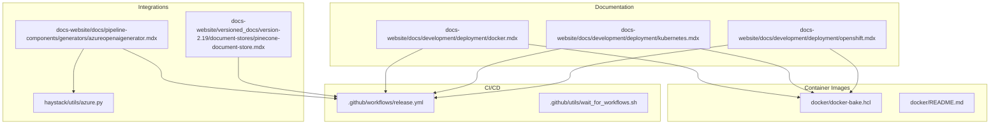
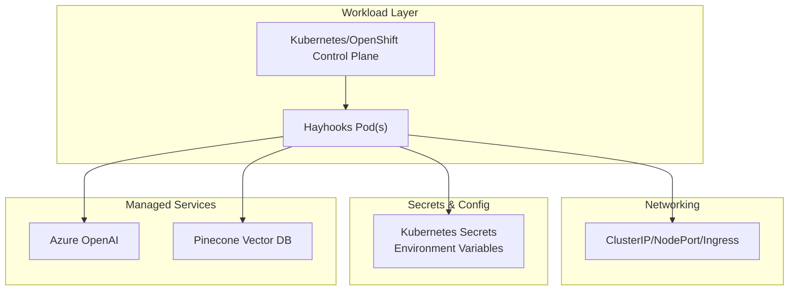
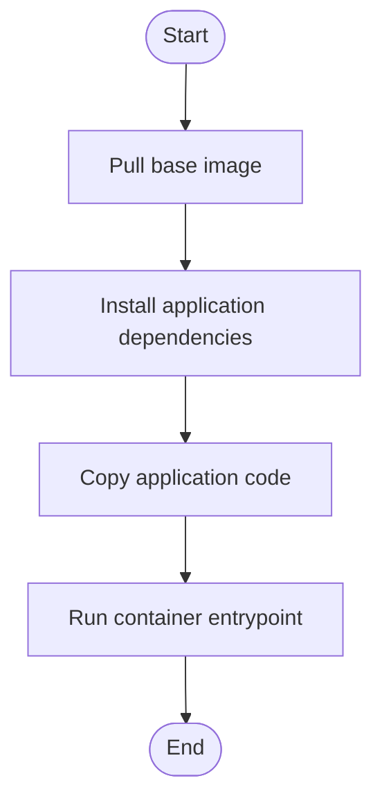
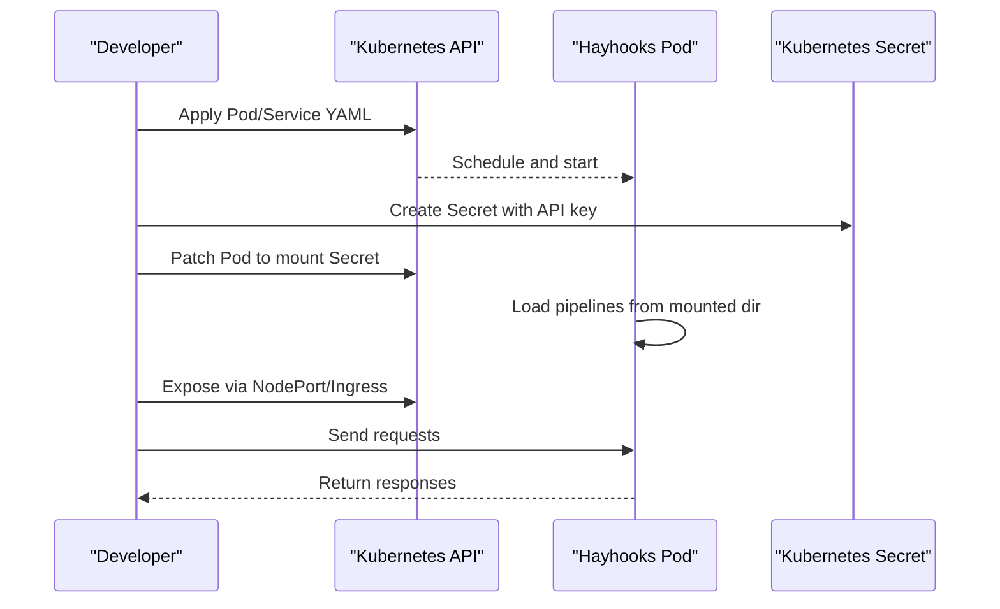
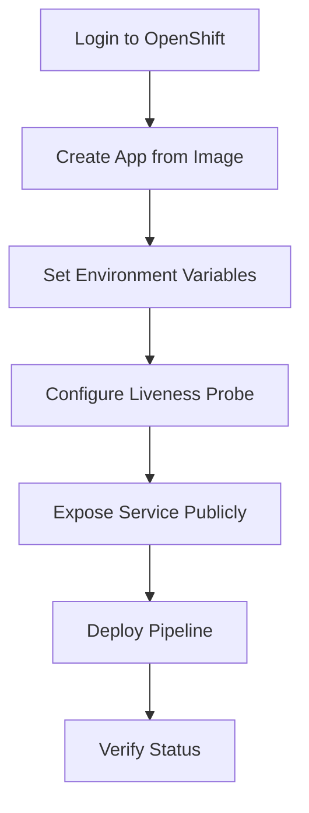
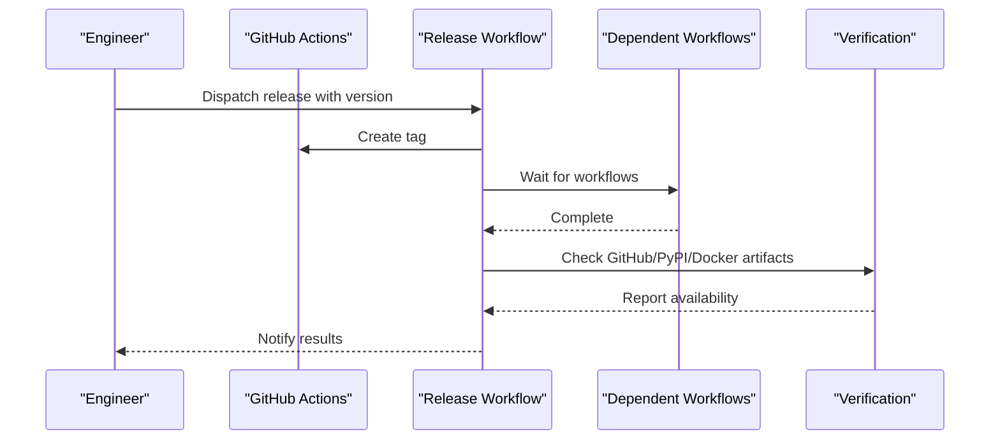
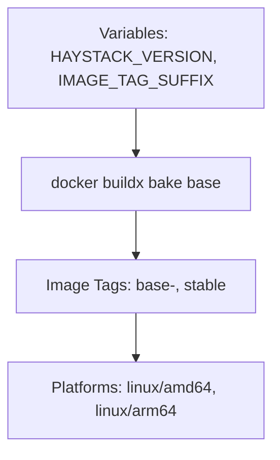
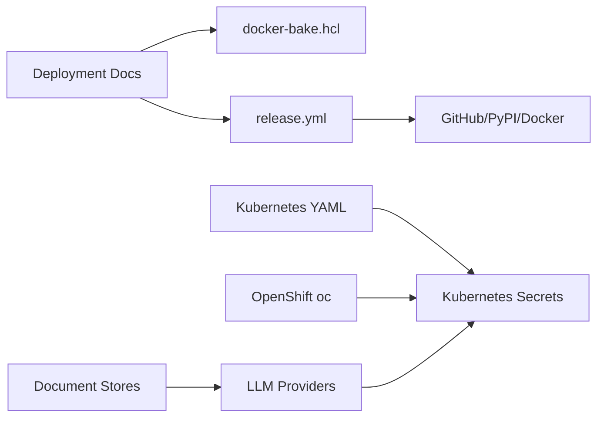

# Cloud Platform Deployment

<cite>
**Referenced Files in This Document**
- [docker.mdx](file://docs-website/docs/development/deployment/docker.mdx)
- [kubernetes.mdx](file://docs-website/docs/development/deployment/kubernetes.mdx)
- [openshift.mdx](file://docs-website/docs/development/deployment/openshift.mdx)
- [docker-bake.hcl](file://docker/docker-bake.hcl)
- [docker/README.md](file://docker/README.md)
- [release.yml](file://.github/workflows/release.yml)
- [wait_for_workflows.sh](file://.github/utils/wait_for_workflows.sh)
- [azureopenaigenerator.mdx](file://docs-website/docs/pipeline-components/generators/azureopenaigenerator.mdx)
- [azure.py](file://haystack/utils/azure.py)
- [utils_api.md](file://docs-website/reference_versioned_docs/version-2.23/haystack-api/utils_api.md)
- [pinecone-document-store.mdx](file://docs-website/versioned_docs/version-2.19/document-stores/pinecone-document-store.mdx)
</cite>

## Table of Contents
1. [Introduction](#introduction)
2. [Project Structure](#project-structure)
3. [Core Components](#core-components)
4. [Architecture Overview](#architecture-overview)
5. [Detailed Component Analysis](#detailed-component-analysis)
6. [Dependency Analysis](#dependency-analysis)
7. [Performance Considerations](#performance-considerations)
8. [Troubleshooting Guide](#troubleshooting-guide)
9. [Conclusion](#conclusion)
10. [Appendices](#appendices)

## Introduction
This document provides a comprehensive guide to deploying Haystack applications across major cloud platforms with a focus on AWS, Azure, and Google Cloud. It explains container orchestration using Kubernetes, service configurations, and infrastructure provisioning. It also covers managed service integrations for LLM providers and document stores, CI/CD pipeline integration with cloud platforms, cost optimization strategies, security configurations, and migration strategies between cloud providers.

## Project Structure
The repository organizes deployment guidance and infrastructure assets as follows:
- Deployment documentation for Docker, Kubernetes, and OpenShift resides under docs-website/docs/development/deployment.
- Container image build automation is defined in docker/docker-bake.hcl and docker/README.md.
- CI/CD workflows for releases and artifact verification are defined under .github/workflows and .github/utils.
- Managed service integrations and environment variable patterns are documented in pipeline components and utilities.



**Diagram sources**
- [docker.mdx](file://docs-website/docs/development/deployment/docker.mdx#L1-L117)
- [kubernetes.mdx](file://docs-website/docs/development/deployment/kubernetes.mdx#L1-L270)
- [openshift.mdx](file://docs-website/docs/development/deployment/openshift.mdx#L1-L73)
- [docker-bake.hcl](file://docker/docker-bake.hcl#L1-L41)
- [docker/README.md](file://docker/README.md#L1-L58)
- [release.yml](file://.github/workflows/release.yml#L1-L155)
- [wait_for_workflows.sh](file://.github/utils/wait_for_workflows.sh#L1-L47)
- [azureopenaigenerator.mdx](file://docs-website/docs/pipeline-components/generators/azureopenaigenerator.mdx#L22-L44)
- [azure.py](file://haystack/utils/azure.py#L1-L17)
- [pinecone-document-store.mdx](file://docs-website/versioned_docs/version-2.19/document-stores/pinecone-document-store.mdx#L48-L67)

**Section sources**
- [docker.mdx](file://docs-website/docs/development/deployment/docker.mdx#L1-L117)
- [kubernetes.mdx](file://docs-website/docs/development/deployment/kubernetes.mdx#L1-L270)
- [openshift.mdx](file://docs-website/docs/development/deployment/openshift.mdx#L1-L73)
- [docker-bake.hcl](file://docker/docker-bake.hcl#L1-L41)
- [docker/README.md](file://docker/README.md#L1-L58)
- [release.yml](file://.github/workflows/release.yml#L1-L155)
- [wait_for_workflows.sh](file://.github/utils/wait_for_workflows.sh#L1-L47)
- [azureopenaigenerator.mdx](file://docs-website/docs/pipeline-components/generators/azureopenaigenerator.mdx#L22-L44)
- [azure.py](file://haystack/utils/azure.py#L1-L17)
- [pinecone-document-store.mdx](file://docs-website/versioned_docs/version-2.19/document-stores/pinecone-document-store.mdx#L48-L67)

## Core Components
- Docker-based deployment: Official images, customization via Dockerfiles, and Docker Compose orchestration for multi-service setups.
- Kubernetes deployment: Pod, Service, NodePort, and Deployment configurations; auto-loading pipelines at startup; secret injection for API keys.
- OpenShift deployment: Developer sandbox quickstart, oc CLI commands, liveness probes, and public exposure.
- CI/CD: Automated release tagging, artifact verification across GitHub Releases, PyPI, and Docker Hub; workflow orchestration and waiting for dependent jobs.
- Managed service integrations: Azure OpenAI generator and token provider utilities; Pinecone document store configuration examples.

**Section sources**
- [docker.mdx](file://docs-website/docs/development/deployment/docker.mdx#L1-L117)
- [kubernetes.mdx](file://docs-website/docs/development/deployment/kubernetes.mdx#L1-L270)
- [openshift.mdx](file://docs-website/docs/development/deployment/openshift.mdx#L1-L73)
- [release.yml](file://.github/workflows/release.yml#L1-L155)
- [wait_for_workflows.sh](file://.github/utils/wait_for_workflows.sh#L1-L47)
- [azureopenaigenerator.mdx](file://docs-website/docs/pipeline-components/generators/azureopenaigenerator.mdx#L22-L44)
- [azure.py](file://haystack/utils/azure.py#L1-L17)
- [pinecone-document-store.mdx](file://docs-website/versioned_docs/version-2.19/document-stores/pinecone-document-store.mdx#L48-L67)

## Architecture Overview
The deployment architecture centers on containerized Haystack workloads orchestrated by Kubernetes/OpenShift, exposing REST endpoints via Hayhooks. Secrets and environment variables supply LLM credentials. Optional managed services (vector stores, cloud AI endpoints) integrate through documented components and environment variables.



**Diagram sources**
- [kubernetes.mdx](file://docs-website/docs/development/deployment/kubernetes.mdx#L16-L270)
- [openshift.mdx](file://docs-website/docs/development/deployment/openshift.mdx#L24-L73)
- [azureopenaigenerator.mdx](file://docs-website/docs/pipeline-components/generators/azureopenaigenerator.mdx#L22-L44)
- [pinecone-document-store.mdx](file://docs-website/versioned_docs/version-2.19/document-stores/pinecone-document-store.mdx#L48-L67)

## Detailed Component Analysis

### Docker Deployment Patterns
- Base image usage and customization for integrations (e.g., Chroma, Qdrant).
- Docker Compose for multi-container setups with persistent volumes and environment-driven configuration.
- Practical example references for Qdrant indexing demos.



**Diagram sources**
- [docker.mdx](file://docs-website/docs/development/deployment/docker.mdx#L34-L76)

**Section sources**
- [docker.mdx](file://docs-website/docs/development/deployment/docker.mdx#L12-L117)

### Kubernetes Orchestration
- Single Pod and Service configuration with ClusterIP.
- NodePort exposure for local access and port forwarding.
- Preloading pipelines at startup via mounted volumes and environment variables.
- Deployment scaling across multiple pods behind a Service.
- Secret injection for LLM API keys.



**Diagram sources**
- [kubernetes.mdx](file://docs-website/docs/development/deployment/kubernetes.mdx#L16-L270)

**Section sources**
- [kubernetes.mdx](file://docs-website/docs/development/deployment/kubernetes.mdx#L16-L270)

### OpenShift Deployment
- Developer sandbox quickstart using oc CLI.
- Creating an application from the Hayhooks image, setting environment variables, configuring liveness probes, exposing the service, and deploying pipelines.



**Diagram sources**
- [openshift.mdx](file://docs-website/docs/development/deployment/openshift.mdx#L24-L73)

**Section sources**
- [openshift.mdx](file://docs-website/docs/development/deployment/openshift.mdx#L1-L73)

### Managed Service Integrations
- Azure OpenAI Generator: Environment variables for endpoint and tokens; recommended pattern for API key management.
- Azure Identity Token Provider: Utility to obtain bearer tokens using DefaultAzureCredential for secure authentication.
- Pinecone Document Store: Example configuration specifying AWS region and cloud provider in spec.

```mermaid
classDiagram
class AzureOpenAIGenerator {
+uses "AZURE_OPENAI_API_KEY"
+uses "AZURE_OPENAI_AD_TOKEN"
+initialization "azure_endpoint, api_key, azure_deployment"
}
class AzureTokenProvider {
+default_azure_ad_token_provider() str
}
class PineconeDocumentStore {
+spec "serverless { region, cloud }"
}
AzureOpenAIGenerator --> AzureTokenProvider : "token-based auth"
AzureOpenAIGenerator --> PineconeDocumentStore : "vector ops"
```

**Diagram sources**
- [azureopenaigenerator.mdx](file://docs-website/docs/pipeline-components/generators/azureopenaigenerator.mdx#L22-L44)
- [azure.py](file://haystack/utils/azure.py#L11-L17)
- [pinecone-document-store.mdx](file://docs-website/versioned_docs/version-2.19/document-stores/pinecone-document-store.mdx#L48-L67)

**Section sources**
- [azureopenaigenerator.mdx](file://docs-website/docs/pipeline-components/generators/azureopenaigenerator.mdx#L22-L44)
- [azure.py](file://haystack/utils/azure.py#L1-L17)
- [pinecone-document-store.mdx](file://docs-website/versioned_docs/version-2.19/document-stores/pinecone-document-store.mdx#L48-L67)

### CI/CD Pipeline Integration
- Release workflow parses and validates version, creates tags, waits for dependent workflows, checks artifacts on GitHub, PyPI, and Docker Hub, and notifies stakeholders.
- Helper script waits for tag-triggered workflows to complete before verifying artifacts.



**Diagram sources**
- [release.yml](file://.github/workflows/release.yml#L1-L155)
- [wait_for_workflows.sh](file://.github/utils/wait_for_workflows.sh#L1-L47)

**Section sources**
- [release.yml](file://.github/workflows/release.yml#L1-L155)
- [wait_for_workflows.sh](file://.github/utils/wait_for_workflows.sh#L1-L47)

### Container Image Build Automation
- BuildKit and docker buildx bake orchestration for multi-platform builds.
- Overridable variables for versioning and tagging.
- Notes on multi-architecture builds and driver limitations.



**Diagram sources**
- [docker-bake.hcl](file://docker/docker-bake.hcl#L1-L41)
- [docker/README.md](file://docker/README.md#L14-L46)

**Section sources**
- [docker-bake.hcl](file://docker/docker-bake.hcl#L1-L41)
- [docker/README.md](file://docker/README.md#L14-L46)

## Dependency Analysis
- Deployment documentation depends on container image build definitions and CI/CD workflows.
- Kubernetes/OpenShift deployments rely on environment variables and secrets for LLM credentials.
- Managed service integrations depend on environment variables and credential providers.



**Diagram sources**
- [docker-bake.hcl](file://docker/docker-bake.hcl#L28-L40)
- [release.yml](file://.github/workflows/release.yml#L77-L119)
- [kubernetes.mdx](file://docs-website/docs/development/deployment/kubernetes.mdx#L16-L270)
- [openshift.mdx](file://docs-website/docs/development/deployment/openshift.mdx#L24-L73)
- [azureopenaigenerator.mdx](file://docs-website/docs/pipeline-components/generators/azureopenaigenerator.mdx#L22-L44)

**Section sources**
- [docker-bake.hcl](file://docker/docker-bake.hcl#L28-L40)
- [release.yml](file://.github/workflows/release.yml#L77-L119)
- [kubernetes.mdx](file://docs-website/docs/development/deployment/kubernetes.mdx#L16-L270)
- [openshift.mdx](file://docs-website/docs/development/deployment/openshift.mdx#L24-L73)
- [azureopenaigenerator.mdx](file://docs-website/docs/pipeline-components/generators/azureopenaigenerator.mdx#L22-L44)

## Performance Considerations
- Resource requests and limits: Configure CPU and memory limits per workload to ensure predictable performance and fair scheduling.
- Horizontal scaling: Use Deployments to scale pods behind a Service for increased throughput.
- Dependency installation: Prefer prebuilt images or initContainers to avoid repeated installs at runtime.
- Network locality: Place workloads and managed services in the same region/cloud to minimize latency.

[No sources needed since this section provides general guidance]

## Troubleshooting Guide
- Verify artifacts after release: Use the release workflow’s artifact verification steps to confirm availability on GitHub Releases, PyPI, and Docker Hub.
- Wait for dependent workflows: Utilize the helper script to ensure tag-triggered workflows complete before checking artifacts.
- Secret management: Ensure Kubernetes Secrets are created and referenced correctly; confirm environment variables are properly injected into pods.
- Liveness/readiness: Configure liveness probes for health monitoring and automatic restarts.

**Section sources**
- [release.yml](file://.github/workflows/release.yml#L77-L119)
- [wait_for_workflows.sh](file://.github/utils/wait_for_workflows.sh#L1-L47)
- [kubernetes.mdx](file://docs-website/docs/development/deployment/kubernetes.mdx#L16-L270)
- [openshift.mdx](file://docs-website/docs/development/deployment/openshift.mdx#L41-L44)

## Conclusion
This guide outlines a repeatable, secure, and scalable approach to deploying Haystack applications on Kubernetes/OpenShift with managed LLM and document store integrations. It leverages container images, CI/CD automation, and best practices for secrets, networking, and performance to support production-grade deployments across AWS, Azure, and Google Cloud.

[No sources needed since this section summarizes without analyzing specific files]

## Appendices

### Platform-Specific Deployment Patterns
- AWS: Use EKS or ECS with IAM roles for service accounts. Store credentials in AWS Secrets Manager or Parameter Store and inject via Kubernetes Secrets or IRSA. Place managed services (e.g., Amazon OpenSearch, AWS Bedrock) in the same region for low latency.
- Azure: Use AKS with Azure Workload Identity to securely access Azure OpenAI and Cognitive Services. Store keys/secrets in Azure Key Vault and inject via Kubernetes Secrets or CSI Driver. Align vector stores (e.g., Azure Cognitive Search) with the same region.
- Google Cloud: Use GKE with Workload Identity to access Vertex AI and Cloud Secret Manager. Inject secrets via Kubernetes Secrets or GCP Secret Manager CSI Driver. Place vector databases (e.g., AlloyDB with extensions) in the same region.

[No sources needed since this section provides general guidance]

### Infrastructure Provisioning and Security
- IAM roles and policies: Grant least privilege to service accounts for accessing LLM providers and document stores.
- Network policies: Restrict egress traffic to managed service endpoints; enable private link where available.
- TLS and mTLS: Enforce HTTPS between pods and to managed services; configure ingress TLS termination at the platform boundary.

[No sources needed since this section provides general guidance]

### Migration Strategies Between Cloud Platforms
- Abstract provider-specific components behind environment variables and configuration files.
- Standardize secret management via platform-agnostic secret stores or Kubernetes Secrets with a common schema.
- Use the same container images and Kubernetes manifests across clouds to simplify migration.
- Validate performance and cost in staging before cutover; monitor latency and error rates post-migration.

[No sources needed since this section provides general guidance]