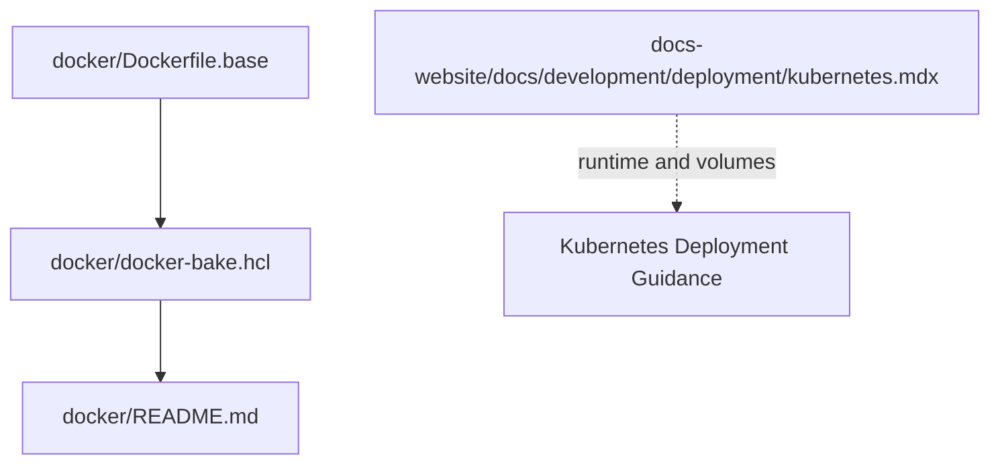
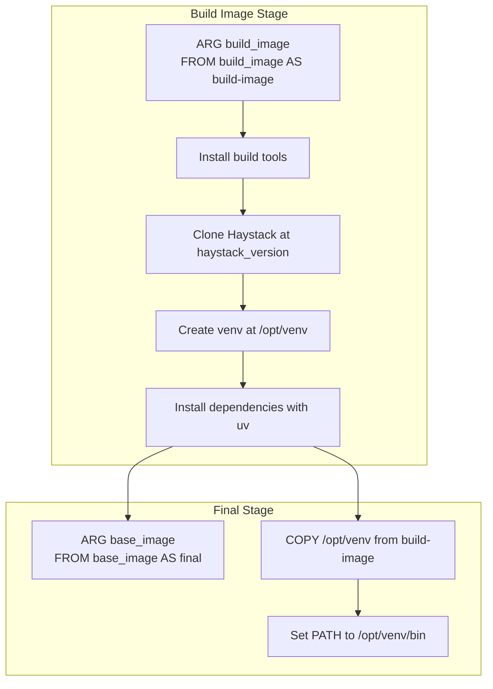
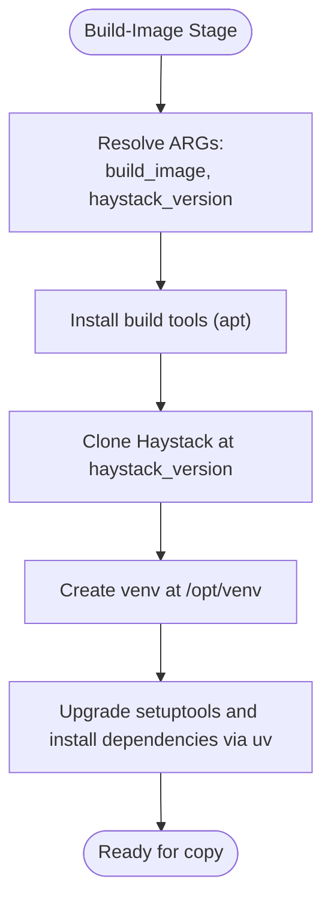
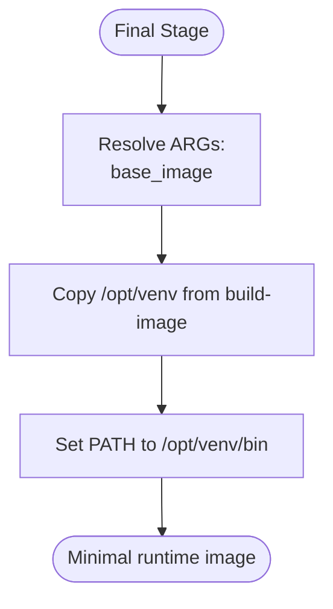
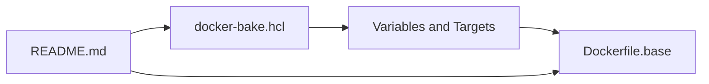

# Containerization

<cite>
**Referenced Files in This Document**
- [Dockerfile.base](file://docker/Dockerfile.base)
- [docker-bake.hcl](file://docker/docker-bake.hcl)
- [README.md](file://docker/README.md)
- [kubernetes.mdx (v2.25)](file://docs-website/docs/development/deployment/kubernetes.mdx)
- [SECURITY.md](file://SECURITY.md)
</cite>

## Table of Contents
1. [Introduction](#introduction)
2. [Project Structure](#project-structure)
3. [Core Components](#core-components)
4. [Architecture Overview](#architecture-overview)
5. [Detailed Component Analysis](#detailed-component-analysis)
6. [Dependency Analysis](#dependency-analysis)
7. [Performance Considerations](#performance-considerations)
8. [Troubleshooting Guide](#troubleshooting-guide)
9. [Conclusion](#conclusion)
10. [Appendices](#appendices)

## Introduction
This document explains how to containerize Haystack applications using the multi-stage Docker build defined in the repository. It covers the build-image and final stages, how to configure Docker build arguments (including build_image, base_image, and haystack_version), the virtual environment creation and dependency installation strategy, Docker build commands and optimization techniques for production images, container runtime configurations, environment variables, and volume mounting strategies. It also includes guidance on Docker Compose multi-container deployments, container security best practices, image scanning and vulnerability management, and a troubleshooting guide for common Docker build and runtime issues.

## Project Structure
The containerization assets are located under the docker directory and complemented by deployment guidance in the documentation website.

**Diagram sources**
- [Dockerfile.base](file://docker/Dockerfile.base#L1-L33)
- [docker-bake.hcl](file://docker/docker-bake.hcl#L1-L41)
- [README.md](file://docker/README.md#L1-L58)

**Section sources**
- [Dockerfile.base](file://docker/Dockerfile.base#L1-L33)
- [docker-bake.hcl](file://docker/docker-bake.hcl#L1-L41)
- [README.md](file://docker/README.md#L1-L58)

## Core Components
- Multi-stage Docker build with a dedicated build-image stage and a final stage.
- Build arguments to control the build-image, base-image, and Haystack version.
- Virtual environment creation and dependency installation strategy using uv for speed and pip compatibility.
- Build orchestration via docker buildx bake with platform targeting and tagging.

Key implementation references:
- Multi-stage build and argument usage: [Dockerfile.base](file://docker/Dockerfile.base#L1-L33)
- Build orchestration and variable defaults: [docker-bake.hcl](file://docker/docker-bake.hcl#L1-L41)
- Build commands and overrides: [README.md](file://docker/README.md#L14-L26)

**Section sources**
- [Dockerfile.base](file://docker/Dockerfile.base#L1-L33)
- [docker-bake.hcl](file://docker/docker-bake.hcl#L1-L41)
- [README.md](file://docker/README.md#L14-L26)

## Architecture Overview
The containerization architecture follows a two-stage build:
- Stage 1 (build-image): Installs build-time tools, clones the Haystack repository at a specific version, creates a virtual environment, and installs dependencies using uv.
- Stage 2 (final): Copies the virtual environment from the build stage into a minimal base image, sets PATH, and prepares a ready-to-use Python environment.

**Diagram sources**
- [Dockerfile.base](file://docker/Dockerfile.base#L1-L33)

## Detailed Component Analysis

### Multi-Stage Build: Build-Image Stage
- Purpose: Prepare a fully configured Python environment with Haystack installed.
- Steps:
  - Accepts build_image via ARG and uses it as the FROM base.
  - Sets non-interactive frontend for deterministic apt operations.
  - Installs git for cloning the repository.
  - Copies uv binaries into the image for fast dependency resolution.
  - Clones the Haystack repository at the specified haystack_version.
  - Creates a virtual environment at /opt/venv and activates it via PATH.
  - Upgrades setuptools and installs dependencies using uv pip.

**Diagram sources**
- [Dockerfile.base](file://docker/Dockerfile.base#L1-L33)

**Section sources**
- [Dockerfile.base](file://docker/Dockerfile.base#L1-L33)

### Multi-Stage Build: Final Stage
- Purpose: Produce a minimal runtime image containing only the virtual environment.
- Steps:
  - Accepts base_image via ARG and uses it as the FROM base.
  - Copies the virtual environment from the build stage.
  - Sets PATH to point to the copied virtual environment.

**Diagram sources**
- [Dockerfile.base](file://docker/Dockerfile.base#L28-L33)

**Section sources**
- [Dockerfile.base](file://docker/Dockerfile.base#L28-L33)

### Build Arguments and Configuration
- build_image: Controls the builder stage base image (default value provided in docker-bake.hcl).
- base_image: Controls the final stage base image (default value provided in docker-bake.hcl).
- haystack_version: Controls which version/branch of the Haystack repository is installed (default value provided in docker-bake.hcl).
- Variables can be overridden at build time via environment variables or bake targets.

References:
- Argument declarations and usage: [Dockerfile.base](file://docker/Dockerfile.base#L1-L3)
- Default values and target definition: [docker-bake.hcl](file://docker/docker-bake.hcl#L28-L39)
- Overriding variables and build commands: [README.md](file://docker/README.md#L14-L26)

**Section sources**
- [Dockerfile.base](file://docker/Dockerfile.base#L1-L3)
- [docker-bake.hcl](file://docker/docker-bake.hcl#L28-L39)
- [README.md](file://docker/README.md#L14-L26)

### Virtual Environment Creation and Dependency Installation
- Virtual environment creation uses Python’s venv module and is placed at /opt/venv.
- PATH is updated to prioritize /opt/venv/bin.
- Dependencies are upgraded and installed using uv pip to accelerate installation while maintaining pip compatibility.
- The repository is shallow-cloned at the specified version to reduce build size and time.

References:
- venv creation and PATH setup: [Dockerfile.base](file://docker/Dockerfile.base#L21-L22)
- Dependency upgrade and installation: [Dockerfile.base](file://docker/Dockerfile.base#L24-L26)
- Shallow clone and version pinning: [Dockerfile.base](file://docker/Dockerfile.base#L14-L16)

**Section sources**
- [Dockerfile.base](file://docker/Dockerfile.base#L14-L26)

### Docker Build Commands and Optimization Techniques
- Build orchestration uses docker buildx bake with the base target.
- You can override variables such as HAYSTACK_VERSION and IMAGE_TAG_SUFFIX to build custom images.
- Multi-platform builds are supported; if local platform support is unavailable, restrict platforms to your host architecture.
- Use --no-cache for reproducible builds when needed.

References:
- Build command and overrides: [README.md](file://docker/README.md#L17-L26)
- Platform limitations and guidance: [README.md](file://docker/README.md#L28-L45)
- Target definition and platforms: [docker-bake.hcl](file://docker/docker-bake.hcl#L28-L40)

**Section sources**
- [README.md](file://docker/README.md#L17-L26)
- [README.md](file://docker/README.md#L28-L45)
- [docker-bake.hcl](file://docker/docker-bake.hcl#L28-L40)

### Container Runtime Configurations, Environment Variables, and Volume Mounting
- Runtime image inherits PATH from the virtual environment, ensuring commands like python and pip are available.
- For persistent data or configuration, mount volumes to directories used by your application (for example, data directories or configuration files).
- Kubernetes deployment guidance demonstrates resource requests and limits, and volume mounting via hostPath.

References:
- PATH setup in final stage: [Dockerfile.base](file://docker/Dockerfile.base#L32-L33)
- Kubernetes resource and volume configuration: [kubernetes.mdx (v2.25)](file://docs-website/docs/development/deployment/kubernetes.mdx#L249-L262)

**Section sources**
- [Dockerfile.base](file://docker/Dockerfile.base#L32-L33)
- [kubernetes.mdx (v2.25)](file://docs-website/docs/development/deployment/kubernetes.mdx#L249-L262)

### Docker Compose Multi-Container Deployments
- The repository does not include a Docker Compose file. However, you can compose containers by:
  - Using the base image as a foundation for your application image.
  - Defining services for your application and dependent services (for example, databases, caches, or external APIs).
  - Mounting volumes for persistent data and configuration.
  - Passing environment variables for credentials and runtime configuration.
- Apply the same runtime principles: set PATH appropriately, mount volumes for data, and define resource limits.

[No sources needed since this section provides general guidance]

### Container Security Best Practices, Image Scanning, and Vulnerability Management
- Security policy defines responsible disclosure and vulnerability response timelines.
- For containerized deployments, apply security best practices:
  - Run containers as non-root users when feasible.
  - Limit capabilities and mount only necessary volumes.
  - Scan container images for vulnerabilities using industry-standard tools.
  - Keep base images updated and monitor for CVEs.
  - Enforce image signing and use trusted registries.
- The repository’s security policy applies to the framework; for container-specific security, integrate image scanning and hardening into your CI/CD pipeline.

References:
- Security policy and reporting: [SECURITY.md](file://SECURITY.md#L1-L38)

**Section sources**
- [SECURITY.md](file://SECURITY.md#L1-L38)

## Dependency Analysis
The build depends on:
- docker-bake.hcl for variable defaults and target configuration.
- Dockerfile.base for the multi-stage build logic and argument usage.
- README.md for build commands and platform guidance.

**Diagram sources**
- [docker-bake.hcl](file://docker/docker-bake.hcl#L1-L41)
- [Dockerfile.base](file://docker/Dockerfile.base#L1-L33)
- [README.md](file://docker/README.md#L1-L58)

**Section sources**
- [docker-bake.hcl](file://docker/docker-bake.hcl#L1-L41)
- [Dockerfile.base](file://docker/Dockerfile.base#L1-L33)
- [README.md](file://docker/README.md#L1-L58)

## Performance Considerations
- Use uv for faster dependency resolution and installation during the build stage.
- Pin haystack_version to a specific tag or branch to ensure reproducibility.
- Leverage multi-platform builds with targeted platforms to avoid unnecessary emulation overhead.
- Minimize layers by combining RUN commands and avoiding unnecessary cache busting.
- Prefer slim base images for reduced attack surface and faster pulls.

[No sources needed since this section provides general guidance]

## Troubleshooting Guide
Common issues and resolutions:
- Multi-platform build driver error: Switch drivers or limit platforms to your host architecture.
  - Reference: [README.md](file://docker/README.md#L33-L45)
- Build fails due to missing or incorrect build arguments:
  - Ensure build_image, base_image, and haystack_version are correctly passed or configured in docker-bake.hcl.
  - Reference: [Dockerfile.base](file://docker/Dockerfile.base#L1-L3), [docker-bake.hcl](file://docker/docker-bake.hcl#L28-L39)
- Virtual environment not found or PATH issues in the final image:
  - Confirm that /opt/venv is copied and PATH is set in the final stage.
  - Reference: [Dockerfile.base](file://docker/Dockerfile.base#L30-L33)
- Slow dependency installation:
  - Use uv and ensure network connectivity; consider caching layers and avoiding --no-cache unless necessary.
  - Reference: [Dockerfile.base](file://docker/Dockerfile.base#L24-L26)

**Section sources**
- [README.md](file://docker/README.md#L33-L45)
- [Dockerfile.base](file://docker/Dockerfile.base#L1-L3)
- [docker-bake.hcl](file://docker/docker-bake.hcl#L28-L39)
- [Dockerfile.base](file://docker/Dockerfile.base#L30-L33)
- [Dockerfile.base](file://docker/Dockerfile.base#L24-L26)

## Conclusion
The repository provides a robust, multi-stage Docker build for Haystack that separates build-time concerns from runtime efficiency. By configuring build_image, base_image, and haystack_version, you can produce optimized, reproducible images suitable for production. Combine these images with Kubernetes or Docker Compose deployments, apply security best practices, and integrate image scanning to maintain a secure and reliable containerized environment.

[No sources needed since this section summarizes without analyzing specific files]

## Appendices
- Build commands and overrides: [README.md](file://docker/README.md#L17-L26)
- Variable defaults and target platforms: [docker-bake.hcl](file://docker/docker-bake.hcl#L1-L41)
- Final stage PATH and venv copy: [Dockerfile.base](file://docker/Dockerfile.base#L28-L33)

**Section sources**
- [README.md](file://docker/README.md#L17-L26)
- [docker-bake.hcl](file://docker/docker-bake.hcl#L1-L41)
- [Dockerfile.base](file://docker/Dockerfile.base#L28-L33)