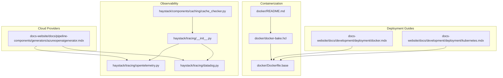
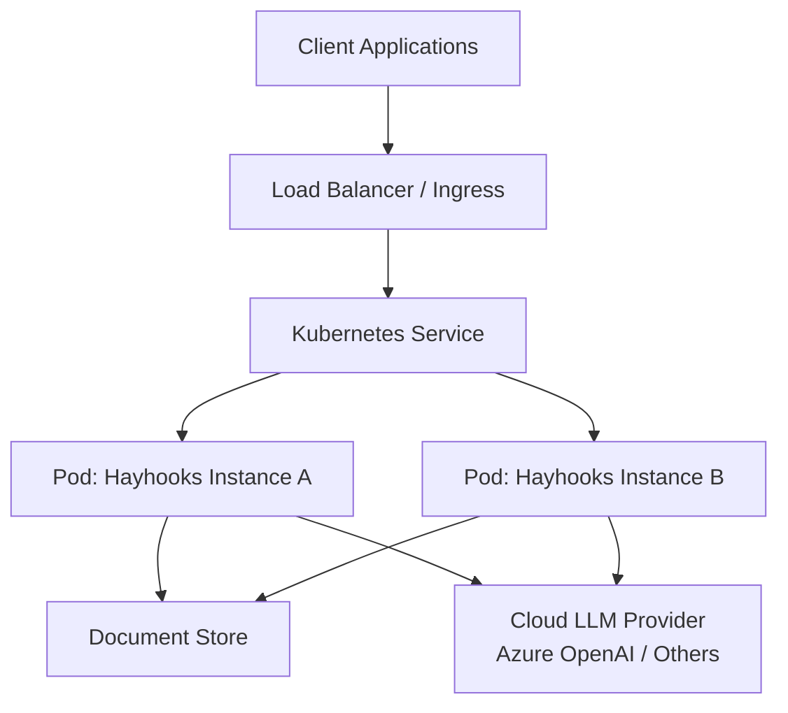
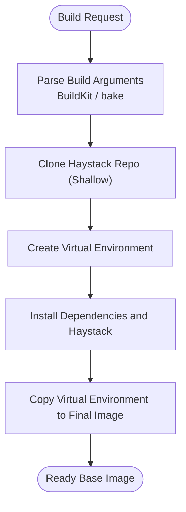
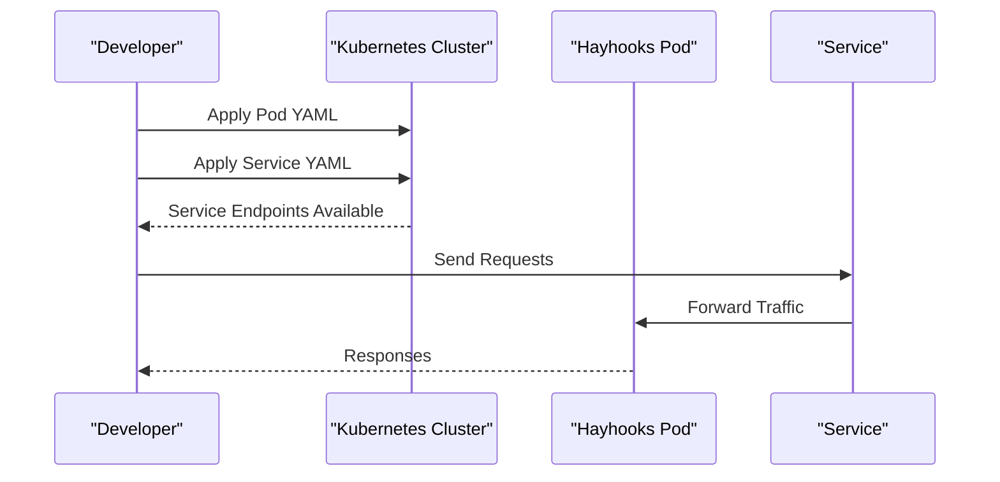
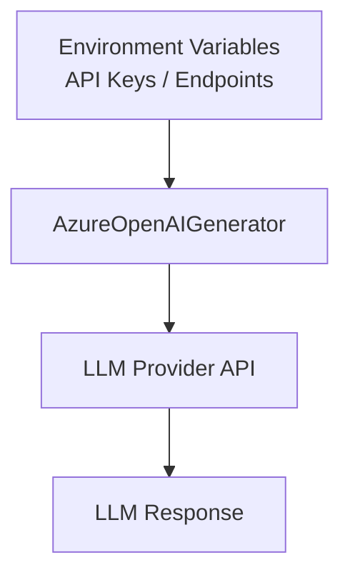
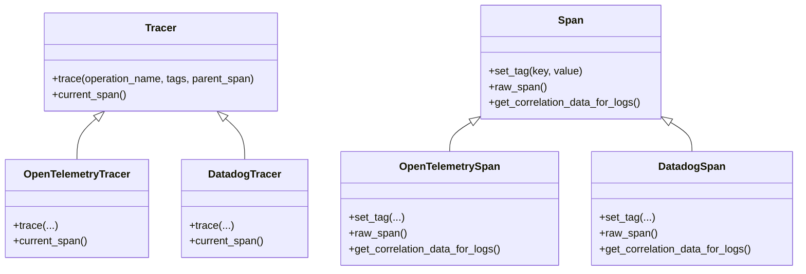
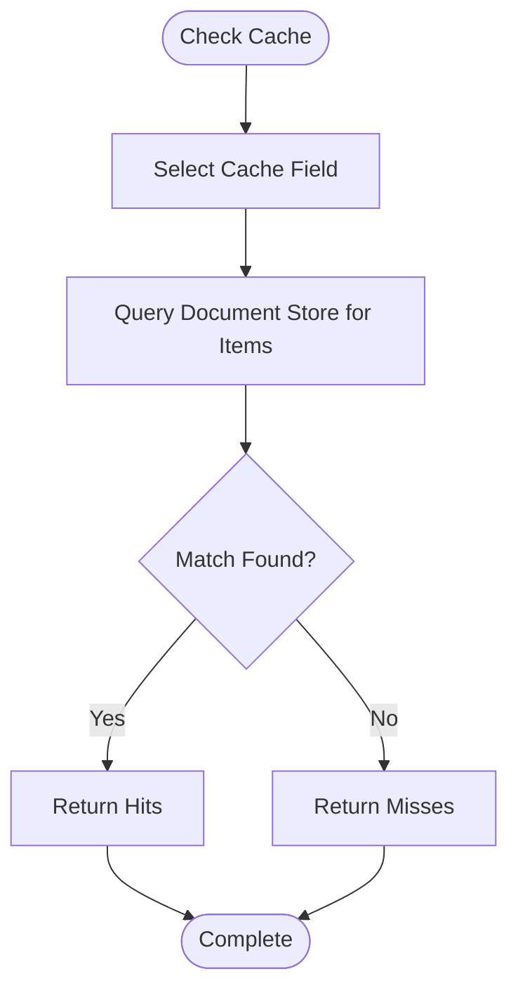
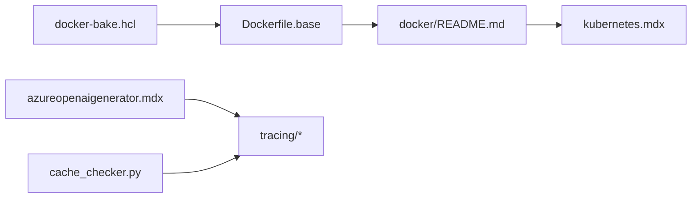

# Deployment and Production

<cite>
**Referenced Files in This Document**
- [docker/README.md](file://docker/README.md)
- [docker/Dockerfile.base](file://docker/Dockerfile.base)
- [docker/docker-bake.hcl](file://docker/docker-bake.hcl)
- [docs-website/docs/development/deployment/docker.mdx](file://docs-website/docs/development/deployment/docker.mdx)
- [docs-website/docs/development/deployment/kubernetes.mdx](file://docs-website/docs/development/deployment/kubernetes.mdx)
- [docs-website/versioned_docs/version-2.24/pipeline-components/generators/azureopenaigenerator.mdx](file://docs-website/versioned_docs/version-2.24/pipeline-components/generators/azureopenaigenerator.mdx)
- [docs-website/docs/pipeline-components/generators/azureopenaigenerator.mdx](file://docs-website/docs/pipeline-components/generators/azureopenaigenerator.mdx)
- [SECURITY.md](file://SECURITY.md)
- [haystack/components/caching/cache_checker.py](file://haystack/components/caching/cache_checker.py)
- [pydoc/caching_api.yml](file://pydoc/caching_api.yml)
- [docs-website/reference/haystack-api/cachings_api.md](file://docs-website/reference/haystack-api/cachings_api.md)
- [haystack/tracing/__init__.py](file://haystack/tracing/__init__.py)
- [haystack/tracing/opentelemetry.py](file://haystack/tracing/opentelemetry.py)
- [haystack/tracing/datadog.py](file://haystack/tracing/datadog.py)
- [releasenotes/notes/set-component-name-as-datadog-span-resource-name-bdec739077ca20ce.yaml](file://releasenotes/notes/set-component-name-as-datadog-span-resource-name-bdec739077ca20ce.yaml)
- [releasenotes/notes/fix-auto-tracing-51ed3a590000d6c8.yaml](file://releasenotes/notes/fix-auto-tracing-51ed3a590000d6c8.yaml)
</cite>

## Table of Contents
1. [Introduction](#introduction)
2. [Project Structure](#project-structure)
3. [Core Components](#core-components)
4. [Architecture Overview](#architecture-overview)
5. [Detailed Component Analysis](#detailed-component-analysis)
6. [Dependency Analysis](#dependency-analysis)
7. [Performance Considerations](#performance-considerations)
8. [Troubleshooting Guide](#troubleshooting-guide)
9. [Conclusion](#conclusion)
10. [Appendices](#appendices)

## Introduction
This document provides a comprehensive guide to deploying Haystack applications to production environments. It covers containerization with Docker, Kubernetes deployment patterns, cloud provider considerations, scaling strategies for high-throughput LLM applications, security and compliance, backup and disaster recovery, monitoring and alerting, performance optimization, and practical deployment architectures.

## Project Structure
The repository includes official documentation for Docker and Kubernetes deployment, container build configuration, and production-grade observability and caching capabilities. The documentation and build assets relevant to production deployment are organized as follows:
- Containerization and build: docker/README.md, docker/Dockerfile.base, docker/docker-bake.hcl
- Deployment guides: docs-website/docs/development/deployment/*.mdx
- Cloud provider configuration: docs-website/docs/pipeline-components/generators/azureopenaigenerator.mdx
- Observability: haystack/tracing/*, docs-website/reference/haystack-api/cachings_api.md
- Caching: haystack/components/caching/cache_checker.py, pydoc/caching_api.yml
- Security: SECURITY.md

**Diagram sources**
- [docker/README.md](file://docker/README.md#L1-L58)
- [docker/Dockerfile.base](file://docker/Dockerfile.base#L1-L33)
- [docker/docker-bake.hcl](file://docker/docker-bake.hcl)
- [docs-website/docs/development/deployment/docker.mdx](file://docs-website/docs/development/deployment/docker.mdx#L1-L27)
- [docs-website/docs/development/deployment/kubernetes.mdx](file://docs-website/docs/development/deployment/kubernetes.mdx#L1-L48)
- [docs-website/docs/pipeline-components/generators/azureopenaigenerator.mdx](file://docs-website/docs/pipeline-components/generators/azureopenaigenerator.mdx#L22-L44)
- [haystack/tracing/opentelemetry.py](file://haystack/tracing/opentelemetry.py#L1-L73)
- [haystack/tracing/datadog.py](file://haystack/tracing/datadog.py#L1-L96)
- [haystack/tracing/__init__.py](file://haystack/tracing/__init__.py#L1-L17)
- [haystack/components/caching/cache_checker.py](file://haystack/components/caching/cache_checker.py#L34-L73)

**Section sources**
- [docker/README.md](file://docker/README.md#L1-L58)
- [docker/Dockerfile.base](file://docker/Dockerfile.base#L1-L33)
- [docker/docker-bake.hcl](file://docker/docker-bake.hcl)
- [docs-website/docs/development/deployment/docker.mdx](file://docs-website/docs/development/deployment/docker.mdx#L1-L27)
- [docs-website/docs/development/deployment/kubernetes.mdx](file://docs-website/docs/development/deployment/kubernetes.mdx#L1-L48)
- [docs-website/docs/pipeline-components/generators/azureopenaigenerator.mdx](file://docs-website/docs/pipeline-components/generators/azureopenaigenerator.mdx#L22-L44)

## Core Components
- Containerization and image building: Official images are distributed via the deepset/haystack registry. Images are built with BuildKit and orchestrated via docker buildx bake. The base image is intended to be extended for production use.
- Kubernetes deployment: The recommended pattern is to expose one or more Hayhooks instances behind a Kubernetes Service. The documentation provides a minimal Pod and Service example.
- Cloud provider configuration: Azure OpenAI Generator demonstrates environment-based configuration for API keys and endpoints, suitable for production-grade secret management.
- Observability: Tracing integrates with OpenTelemetry and Datadog. Auto-enable tracing is supported when the relevant libraries are installed. Component spans can be enriched with component metadata.
- Caching: CacheChecker enables deduplication checks against a document store using a configurable cache field, supporting high-throughput scenarios.

**Section sources**
- [docker/README.md](file://docker/README.md#L9-L26)
- [docker/Dockerfile.base](file://docker/Dockerfile.base#L1-L33)
- [docs-website/docs/development/deployment/kubernetes.mdx](file://docs-website/docs/development/deployment/kubernetes.mdx#L14-L48)
- [docs-website/docs/pipeline-components/generators/azureopenaigenerator.mdx](file://docs-website/docs/pipeline-components/generators/azureopenaigenerator.mdx#L22-L44)
- [haystack/tracing/__init__.py](file://haystack/tracing/__init__.py#L7-L17)
- [haystack/tracing/opentelemetry.py](file://haystack/tracing/opentelemetry.py#L46-L73)
- [haystack/tracing/datadog.py](file://haystack/tracing/datadog.py#L54-L96)
- [releasenotes/notes/fix-auto-tracing-51ed3a590000d6c8.yaml](file://releasenotes/notes/fix-auto-tracing-51ed3a590000d6c8.yaml#L1-L4)
- [releasenotes/notes/set-component-name-as-datadog-span-resource-name-bdec739077ca20ce.yaml](file://releasenotes/notes/set-component-name-as-datadog-span-resource-name-bdec739077ca20ce.yaml#L1-L4)
- [haystack/components/caching/cache_checker.py](file://haystack/components/caching/cache_checker.py#L34-L73)

## Architecture Overview
The production-ready deployment architecture typically combines:
- Containerized Haystack services (optionally Hayhooks) packaged in Docker images
- Kubernetes orchestration with Services and Pods
- Cloud-native LLM providers configured via environment variables
- Observability with tracing and caching integrated into pipelines

**Diagram sources**
- [docs-website/docs/development/deployment/kubernetes.mdx](file://docs-website/docs/development/deployment/kubernetes.mdx#L14-L48)
- [docs-website/docs/pipeline-components/generators/azureopenaigenerator.mdx](file://docs-website/docs/pipeline-components/generators/azureopenaigenerator.mdx#L22-L44)

## Detailed Component Analysis

### Containerization with Docker
- Official images are published under the deepset/haystack namespace. The base image is designed to be extended for production needs.
- BuildKit and docker buildx bake are used to orchestrate builds. Multi-platform builds are supported, with guidance for driver limitations and platform overrides.
- The base Dockerfile sets up a virtual environment, installs dependencies, and copies the environment into the final stage.

**Diagram sources**
- [docker/Dockerfile.base](file://docker/Dockerfile.base#L14-L33)
- [docker/README.md](file://docker/README.md#L14-L26)

**Section sources**
- [docker/README.md](file://docker/README.md#L9-L26)
- [docker/Dockerfile.base](file://docker/Dockerfile.base#L1-L33)

### Kubernetes Deployment Patterns
- Recommended approach: Expose one or more Hayhooks instances behind a Kubernetes Service.
- The documentation provides a minimal Pod and Service example to bootstrap deployments locally using KinD or Minikube, and then move to managed clusters.

**Diagram sources**
- [docs-website/docs/development/deployment/kubernetes.mdx](file://docs-website/docs/development/deployment/kubernetes.mdx#L16-L48)

**Section sources**
- [docs-website/docs/development/deployment/kubernetes.mdx](file://docs-website/docs/development/deployment/kubernetes.mdx#L14-L48)

### Cloud Platform Deployment Options
- Azure OpenAI Generator demonstrates environment-based configuration for API keys and endpoints, enabling secure secret management and separation of credentials from code.
- Similar patterns apply to other cloud providers by setting environment variables and configuring endpoints accordingly.

**Diagram sources**
- [docs-website/docs/pipeline-components/generators/azureopenaigenerator.mdx](file://docs-website/docs/pipeline-components/generators/azureopenaigenerator.mdx#L22-L44)

**Section sources**
- [docs-website/docs/pipeline-components/generators/azureopenaigenerator.mdx](file://docs-website/docs/pipeline-components/generators/azureopenaigenerator.mdx#L22-L44)

### Observability and Monitoring
- Tracing integration supports both OpenTelemetry and Datadog. Auto-enabling tracing is available when the respective libraries are installed.
- Component spans can be enriched with component metadata, and resource names can be derived from component names for improved correlation.
- Logging correlation data is exposed for log-trace linkage.

**Diagram sources**
- [haystack/tracing/opentelemetry.py](file://haystack/tracing/opentelemetry.py#L46-L73)
- [haystack/tracing/datadog.py](file://haystack/tracing/datadog.py#L54-L96)
- [haystack/tracing/__init__.py](file://haystack/tracing/__init__.py#L7-L17)

**Section sources**
- [haystack/tracing/__init__.py](file://haystack/tracing/__init__.py#L7-L17)
- [haystack/tracing/opentelemetry.py](file://haystack/tracing/opentelemetry.py#L46-L73)
- [haystack/tracing/datadog.py](file://haystack/tracing/datadog.py#L54-L96)
- [releasenotes/notes/fix-auto-tracing-51ed3a590000d6c8.yaml](file://releasenotes/notes/fix-auto-tracing-51ed3a590000d6c8.yaml#L1-L4)
- [releasenotes/notes/set-component-name-as-datadog-span-resource-name-bdec739077ca20ce.yaml](file://releasenotes/notes/set-component-name-as-datadog-span-resource-name-bdec739077ca20ce.yaml#L1-L4)

### Caching Strategies
- CacheChecker enables checking for existing documents in a document store using a cache field (e.g., URL), returning hits and misses for deduplication.
- The caching API is documented and the component supports serialization/deserialization.

**Diagram sources**
- [haystack/components/caching/cache_checker.py](file://haystack/components/caching/cache_checker.py#L34-L73)
- [pydoc/caching_api.yml](file://pydoc/caching_api.yml#L1-L13)
- [docs-website/reference/haystack-api/cachings_api.md](file://docs-website/reference/haystack-api/cachings_api.md#L64-L97)

**Section sources**
- [haystack/components/caching/cache_checker.py](file://haystack/components/caching/cache_checker.py#L34-L73)
- [pydoc/caching_api.yml](file://pydoc/caching_api.yml#L1-L13)
- [docs-website/reference/haystack-api/cachings_api.md](file://docs-website/reference/haystack-api/cachings_api.md#L64-L97)

## Dependency Analysis
- Containerization depends on Docker BuildKit and docker buildx bake for orchestration and multi-platform builds.
- Kubernetes deployment depends on the availability of the Hayhooks image and proper resource requests/limits.
- Cloud provider configuration depends on environment variables and endpoint configuration.
- Observability depends on optional tracing libraries (OpenTelemetry or Datadog) being installed.
- Caching depends on a configured document store and cache field.

**Diagram sources**
- [docker/docker-bake.hcl](file://docker/docker-bake.hcl)
- [docker/Dockerfile.base](file://docker/Dockerfile.base#L1-L33)
- [docker/README.md](file://docker/README.md#L14-L26)
- [docs-website/docs/development/deployment/kubernetes.mdx](file://docs-website/docs/development/deployment/kubernetes.mdx#L14-L48)
- [docs-website/docs/pipeline-components/generators/azureopenaigenerator.mdx](file://docs-website/docs/pipeline-components/generators/azureopenaigenerator.mdx#L22-L44)
- [haystack/tracing/opentelemetry.py](file://haystack/tracing/opentelemetry.py#L46-L73)
- [haystack/tracing/datadog.py](file://haystack/tracing/datadog.py#L54-L96)
- [haystack/components/caching/cache_checker.py](file://haystack/components/caching/cache_checker.py#L34-L73)

**Section sources**
- [docker/README.md](file://docker/README.md#L14-L26)
- [docker/Dockerfile.base](file://docker/Dockerfile.base#L1-L33)
- [docs-website/docs/development/deployment/kubernetes.mdx](file://docs-website/docs/development/deployment/kubernetes.mdx#L14-L48)
- [docs-website/docs/pipeline-components/generators/azureopenaigenerator.mdx](file://docs-website/docs/pipeline-components/generators/azureopenaigenerator.mdx#L22-L44)
- [haystack/tracing/opentelemetry.py](file://haystack/tracing/opentelemetry.py#L46-L73)
- [haystack/tracing/datadog.py](file://haystack/tracing/datadog.py#L54-L96)
- [haystack/components/caching/cache_checker.py](file://haystack/components/caching/cache_checker.py#L34-L73)

## Performance Considerations
- Resource allocation: Configure CPU and memory requests/limits in Kubernetes to match workload characteristics and avoid throttling.
- Caching: Use CacheChecker to reduce redundant processing and LLM calls by deduplicating based on a cache field.
- Tracing overhead: Enable tracing conditionally in production and ensure lightweight tagging to minimize impact.
- Image builds: Use BuildKit and optimize layers to reduce build times and image sizes.

[No sources needed since this section provides general guidance]

## Troubleshooting Guide
- Vulnerability reporting: Follow the documented process for reporting vulnerabilities responsibly.
- Tracing not activating: Ensure the appropriate tracing library is installed and auto-enable tracing is functioning as expected.
- Caching behavior: Verify cache field selection and document store connectivity to ensure accurate hits/misses.

**Section sources**
- [SECURITY.md](file://SECURITY.md#L25-L38)
- [releasenotes/notes/fix-auto-tracing-51ed3a590000d6c8.yaml](file://releasenotes/notes/fix-auto-tracing-51ed3a590000d6c8.yaml#L1-L4)
- [haystack/components/caching/cache_checker.py](file://haystack/components/caching/cache_checker.py#L34-L73)

## Conclusion
By leveraging the provided Docker and Kubernetes documentation, cloud provider configuration examples, observability integrations, and caching mechanisms, teams can deploy robust, scalable, and secure Haystack applications in production. Proper resource planning, secret management, monitoring, and caching strategies are essential for high-throughput LLM workloads.

[No sources needed since this section summarizes without analyzing specific files]

## Appendices
- Practical deployment architectures:
  - Single-region Kubernetes Service exposing multiple Hayhooks Pods
  - Regional failover with cross-region document stores and LLM provider endpoints
- Configuration management:
  - Use environment variables for secrets and endpoints
  - Manage image tags and build arguments via docker buildx bake
- Compliance and regulatory considerations:
  - Follow responsible vulnerability disclosure
  - Enforce least-privilege access to secrets and endpoints
  - Audit traces and logs for compliance requirements

[No sources needed since this section provides general guidance]